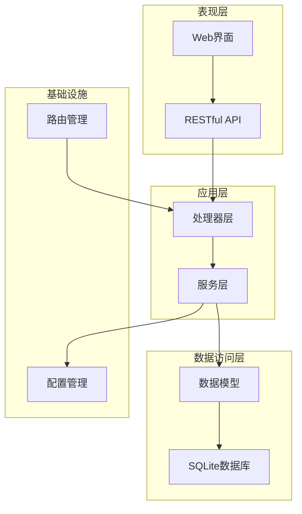
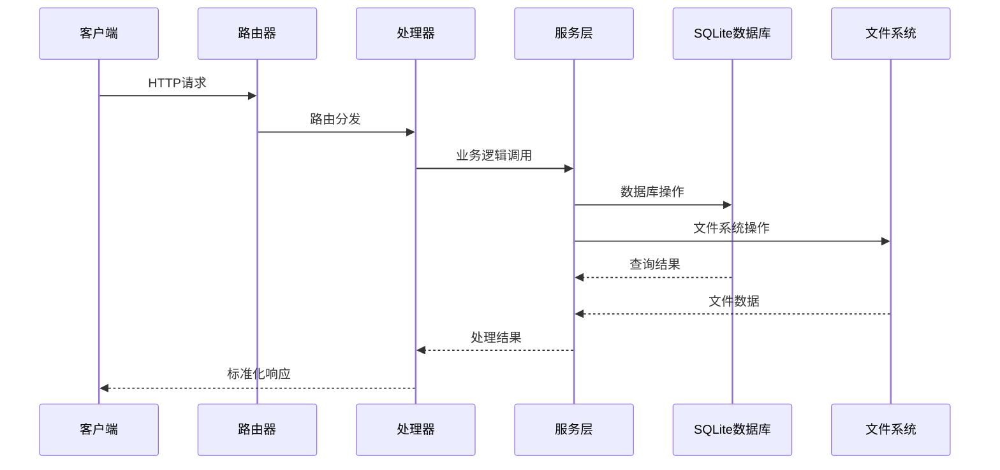

# API接口文档

<cite>
**本文引用的文件**
- [README.md](file://README.md)
- [main.go](file://main.go)
- [router.go](file://internal/router/router.go)
- [script.go](file://internal/handler/script.go)
- [slave.go](file://internal/handler/slave.go)
- [execution.go](file://internal/handler/execution.go)
- [script_service.go](file://internal/service/script.go)
- [slave_service.go](file://internal/service/slave.go)
- [execution_service.go](file://internal/service/execution.go)
- [response_model.go](file://internal/model/response.go)
</cite>

## 更新摘要
**变更内容**
- 更新文档管理策略：API文档现在通过README.md的API文档章节提供
- 修正API端点描述：基于实际的路由实现更新端点路径
- 更新SSE实时日志流说明：修正日志流端点路径
- 完善系统配置API：更新配置管理端点
- 修正响应格式：基于实际的统一响应模型

## 目录
1. [简介](#简介)
2. [项目结构](#项目结构)
3. [核心组件](#核心组件)
4. [架构概览](#架构概览)
5. [API文档](#api文档)
6. [详细API规范](#详细api规范)
7. [响应格式](#响应格式)
8. [错误处理](#错误处理)
9. [性能考虑](#性能考虑)
10. [故障排除指南](#故障排除指南)
11. [结论](#结论)

## 简介
JMeter Admin 是一个基于 Go (Gin) + Vue 3 + SQLite 的单文件部署 JMeter 分布式压测管理平台。后端提供完整的 RESTful API，涵盖脚本管理、Slave 节点管理、执行管理和系统配置四大模块。所有前端资源被嵌入到后端二进制文件中，编译后生成单一可执行文件，实现零依赖部署。

**章节来源**
- [README.md: 1-16:1-16](file://README.md#L1-L16)
- [main.go: 28-66:28-66](file://main.go#L28-L66)

## 项目结构
项目采用典型的分层架构设计，主要分为以下层次：



**图表来源**
- [main.go: 28-66:28-66](file://main.go#L28-L66)
- [router.go: 14-112:14-112](file://internal/router/router.go#L14-L112)

**章节来源**
- [main.go: 1-83:1-83](file://main.go#L1-L83)
- [router.go: 14-129:14-129](file://internal/router/router.go#L14-L129)

## 核心组件
系统的核心组件包括：

### 1. 路由管理器
负责 API 路由的注册和中间件配置，支持 CORS 跨域和静态文件服务。

### 2. 处理器层
实现具体的业务逻辑，处理 HTTP 请求并返回标准化响应格式。

### 3. 服务层
封装核心业务逻辑，包括数据库操作、文件系统管理、JMeter 执行管理等。

### 4. 数据模型
定义统一的响应格式和业务实体的数据结构。

### 5. 配置管理
提供系统配置的加载、保存和管理功能。

**章节来源**
- [router.go: 14-129:14-129](file://internal/router/router.go#L14-L129)
- [response_model.go: 1-46:1-46](file://internal/model/response.go#L1-L46)

## 架构概览



**图表来源**
- [router.go: 21-75:21-75](file://internal/router/router.go#L21-L75)
- [script.go: 37-50:37-50](file://internal/handler/script.go#L37-L50)

## API文档

### 脚本管理 `/api/scripts`

| 方法 | 路径 | 说明 |
|------|------|------|
| GET | / | 脚本列表 |
| POST | / | 创建脚本 |
| GET | /:id | 脚本详情 |
| PUT | /:id | 更新脚本 |
| DELETE | /:id | 删除脚本 |
| GET | /:id/download | 下载主脚本 |
| GET | /:id/content | 获取 JMX 内容 |
| PUT | /:id/content | 保存 JMX 内容 |
| POST | /:id/files | 上传附件 |
| DELETE | /:id/files/:fileId | 删除附件 |

### Slave 管理 `/api/slaves`

| 方法 | 路径 | 说明 |
|------|------|------|
| GET | / | Slave 列表 |
| POST | / | 添加 Slave |
| PUT | /:id | 更新 Slave |
| DELETE | /:id | 删除 Slave |
| POST | /:id/check | 连通性检测 |
| GET | /heartbeat-status | 心跳状态 |

### 执行管理 `/api/executions`

| 方法 | 路径 | 说明 |
|------|------|------|
| GET | / | 执行列表（支持筛选） |
| GET | /stats | 统计汇总 |
| POST | / | 创建执行 |
| GET | /:id | 执行详情 |
| DELETE | /:id | 删除执行 |
| POST | /:id/stop | 停止执行 |
| GET | /:id/log | 实时日志（SSE） |
| GET | /:id/errors | 错误分析 |
| GET | /:id/download/jtl | 下载 JTL |
| GET | /:id/download/report | 下载报告 |
| GET | /:id/download/errors | 导出错误 CSV |
| GET | /:id/download/all | 下载全部结果 |

### 系统配置 `/api/config`

| 方法 | 路径 | 说明 |
|------|------|------|
| GET | /network-interfaces | 网卡列表 |
| GET | /master-hostname | Master IP |
| PUT | /master-hostname | 更新 Master IP |

**章节来源**
- [README.md: 122-174:122-174](file://README.md#L122-L174)
- [router.go: 20-75:20-75](file://internal/router/router.go#L20-L75)

## 详细API规范

### 脚本管理 API

#### 1. 脚本列表查询
- **HTTP方法**: GET
- **URL模式**: `/api/scripts`
- **查询参数**:
  - `page`: 页码，默认1
  - `page_size`: 每页条数，默认10，最大100
  - `keyword`: 搜索关键词
- **响应格式**: 
```json
{
  "code": 0,
  "message": "success",
  "data": {
    "total": 0,
    "list": []
  }
}
```
- **状态码**: 200 成功，500 服务器内部错误

#### 2. 创建脚本
- **HTTP方法**: POST
- **URL模式**: `/api/scripts`
- **请求类型**: multipart/form-data
- **表单字段**:
  - `name`: 脚本名称
  - `description`: 脚本描述
  - `file`: .jmx 脚本文件（最大100MB）
- **响应格式**: 标准成功响应
- **状态码**: 200 成功，400 参数错误，500 服务器内部错误

#### 3. 获取脚本详情
- **HTTP方法**: GET
- **URL模式**: `/api/scripts/:id`
- **路径参数**: `id` - 脚本ID
- **响应格式**: 包含脚本信息和关联文件列表
- **状态码**: 200 成功，404 资源不存在，500 服务器内部错误

#### 4. 更新脚本
- **HTTP方法**: PUT
- **URL模式**: `/api/scripts/:id`
- **请求体**: JSON 格式
```json
{
  "name": "string",
  "description": "string"
}
```
- **状态码**: 200 成功，400 参数无效，500 服务器内部错误

#### 5. 删除脚本
- **HTTP方法**: DELETE
- **URL模式**: `/api/scripts/:id`
- **状态码**: 200 成功，500 服务器内部错误

#### 6. 下载脚本
- **HTTP方法**: GET
- **URL模式**: `/api/scripts/:id/download`
- **响应**: 文件下载（application/octet-stream）
- **状态码**: 200 成功，404 资源不存在

#### 7. 获取脚本内容
- **HTTP方法**: GET
- **URL模式**: `/api/scripts/:id/content`
- **响应格式**: 
```json
{
  "content": "string"
}
```

#### 8. 保存脚本内容
- **HTTP方法**: PUT
- **URL模式**: `/api/scripts/:id/content`
- **请求体**: JSON 格式
```json
{
  "content": "XML字符串"
}
```

#### 9. 上传附件文件
- **HTTP方法**: POST
- **URL模式**: `/api/scripts/:id/files`
- **请求类型**: multipart/form-data
- **表单字段**: `files[]` - 多个文件（总计最大500MB）
- **状态码**: 200 成功，400 参数错误，500 服务器内部错误

#### 10. 删除附件文件
- **HTTP方法**: DELETE
- **URL模式**: `/api/scripts/:id/files/:fileId`
- **路径参数**: `fileId` - 文件ID或文件名
- **状态码**: 200 成功，404 资源不存在，500 服务器内部错误

**章节来源**
- [script.go: 37-327:37-327](file://internal/handler/script.go#L37-L327)
- [script_service.go: 18-540:18-540](file://internal/service/script.go#L18-L540)

### Slave 管理 API

#### 1. Slave 列表查询
- **HTTP方法**: GET
- **URL模式**: `/api/slaves`
- **响应格式**: Slave 对象数组
- **状态码**: 200 成功，500 服务器内部错误

#### 2. 创建 Slave
- **HTTP方法**: POST
- **URL模式**: `/api/slaves`
- **请求体**: JSON 格式
```json
{
  "name": "string",
  "host": "string",
  "port": 0
}
```

#### 3. 更新 Slave
- **HTTP方法**: PUT
- **URL模式**: `/api/slaves/:id`
- **路径参数**: `id` - Slave ID
- **请求体**: JSON 格式同上

#### 4. 删除 Slave
- **HTTP方法**: DELETE
- **URL模式**: `/api/slaves/:id`
- **状态码**: 200 成功，500 服务器内部错误

#### 5. 连通性检测
- **HTTP方法**: POST
- **URL模式**: `/api/slaves/:id/check`
- **响应格式**: 
```json
{
  "online": true,
  "status": "online|offline"
}
```

#### 6. 心跳状态查询
- **HTTP方法**: GET
- **URL模式**: `/api/slaves/heartbeat-status`
- **响应格式**: 包含所有 Slave 的心跳状态信息

**章节来源**
- [slave.go: 16-236:16-236](file://internal/handler/slave.go#L16-L236)
- [slave_service.go: 15-220:15-220](file://internal/service/slave.go#L15-L220)

### 执行管理 API

#### 1. 执行列表查询
- **HTTP方法**: GET
- **URL模式**: `/api/executions`
- **查询参数**:
  - `page`: 页码，默认1
  - `page_size`: 每页条数，默认10，最大100
  - `script_id`: 脚本ID
  - `status`: 执行状态
  - `keyword`: 备注关键词
  - `start_date`: 开始日期
  - `end_date`: 结束日期

#### 2. 执行统计
- **HTTP方法**: GET
- **URL模式**: `/api/executions/stats`
- **响应格式**:
```json
{
  "total": 0,
  "running": 0,
  "completed": 0,
  "failed": 0,
  "stopped": 0
}
```

#### 3. 创建执行
- **HTTP方法**: POST
- **URL模式**: `/api/executions`
- **请求体**: JSON 格式
```json
{
  "script_id": 0,
  "slave_ids": [0],
  "remarks": "string",
  "save_http_details": false,
  "include_master": false
}
```
- **响应**: 执行记录对象

#### 4. 获取执行详情
- **HTTP方法**: GET
- **URL模式**: `/api/executions/:id`

#### 5. 实时指标获取
- **HTTP方法**: GET
- **URL模式**: `/api/executions/:id/live-metrics`
- **响应**: 实时性能指标数据

#### 6. 停止执行
- **HTTP方法**: POST
- **URL模式**: `/api/executions/:id/stop`
- **响应**: "执行已停止"

#### 7. 删除执行
- **HTTP方法**: DELETE
- **URL模式**: `/api/executions/:id`
- **响应**: "执行记录已删除"

#### 8. 错误分析
- **HTTP方法**: GET
- **URL模式**: `/api/executions/:id/errors`
- **响应**: 错误分析结果

#### 9. 错误明细上传
- **HTTP方法**: POST
- **URL模式**: `/api/executions/:id/error-details/upload`
- **请求体**: JSON 格式
```json
{
  "token": "string",
  "source": "string",
  "content": "string"
}
```

#### 10. 下载 JTL 结果
- **HTTP方法**: GET
- **URL模式**: `/api/executions/:id/download/jtl`
- **响应**: 文件下载（application/octet-stream）

#### 11. 下载报告
- **HTTP方法**: GET
- **URL模式**: `/api/executions/:id/download/report`
- **响应**: ZIP 文件下载（application/zip）

#### 12. 导出错误 CSV
- **HTTP方法**: GET
- **URL模式**: `/api/executions/:id/download/errors`
- **响应**: CSV 文件下载（text/csv）

#### 13. 下载完整结果包
- **HTTP方法**: GET
- **URL模式**: `/api/executions/:id/download/all`
- **响应**: ZIP 文件下载（application/zip）

#### 14. 实时日志流（SSE）
- **HTTP方法**: GET
- **URL模式**: `/api/executions/:id/log`
- **查询参数**:
  - `snapshot`: 1 表示快照模式
  - `tail`: 快照模式下显示的行数，默认300，最大5000
- **响应**: Server-Sent Events 流
- **事件类型**:
  - `message`: 日志行内容
  - `complete`: 执行完成事件
  - `error`: 错误事件

**章节来源**
- [execution.go: 38-729:38-729](file://internal/handler/execution.go#L38-L729)
- [execution_service.go: 103-800:103-800](file://internal/service/execution.go#L103-L800)

### 系统配置 API

#### 1. 获取网络接口列表
- **HTTP方法**: GET
- **URL模式**: `/api/config/network-interfaces`
- **响应**: 网卡信息数组

#### 2. 获取 Master 主机名
- **HTTP方法**: GET
- **URL模式**: `/api/config/master-hostname`
- **响应**: 
```json
{
  "master_hostname": "string"
}
```

#### 3. 更新 Master 主机名
- **HTTP方法**: PUT
- **URL模式**: `/api/config/master-hostname`
- **请求体**: JSON 格式
```json
{
  "master_hostname": "string"
}
```

**章节来源**
- [slave.go: 169-198:169-198](file://internal/handler/slave.go#L169-L198)

## 响应格式

所有 API 响应都遵循统一的 JSON 格式：

```json
{
  "code": 0,
  "message": "success",
  "data": {}
}
```

### 响应码说明
- **0**: 操作成功
- **-1**: 操作失败
- **其他**: 自定义错误码

### 分页响应格式
对于列表查询，响应包含分页信息：

```json
{
  "code": 0,
  "message": "success",
  "data": {
    "total": 0,
    "list": []
  }
}
```

**章节来源**
- [response_model.go: 14-46:14-46](file://internal/model/response.go#L14-L46)

## 错误处理

### 常见错误码
- **200**: 操作成功
- **400**: 请求参数错误
- **404**: 资源不存在
- **500**: 服务器内部错误

### 错误处理策略
- 所有 API 响应遵循统一的 JSON 格式
- 错误信息包含详细的错误描述
- 文件操作失败时提供具体的操作建议

**章节来源**
- [response_model.go: 14-46:14-46](file://internal/model/response.go#L14-L46)

## 性能考虑

### 1. 内存管理
系统根据可用内存动态计算 JVM 堆大小，取系统可用内存的 80%，范围在 512MB 到 32GB 之间。

### 2. 并发控制
- Slave 心跳检测使用信号量限制并发数为10
- 文件上传大小限制防止内存溢出
- 分页查询默认每页10条，最大100条

### 3. 文件处理
- 使用流式传输处理大文件下载
- SSE 实时日志使用缓冲区避免内存占用过高
- ZIP 文件打包采用增量方式减少内存压力

### 4. 数据库优化
- 为关键查询字段建立索引
- 使用预编译语句防止 SQL 注入
- 连接池配置优化数据库访问性能

**章节来源**
- [execution_service.go: 54-101:54-101](file://internal/service/execution.go#L54-L101)

## 故障排除指南

### 1. 常见错误码
- **200**: 操作成功
- **400**: 请求参数错误
- **404**: 资源不存在
- **500**: 服务器内部错误

### 2. 错误处理策略
- 所有 API 响应遵循统一的 JSON 格式
- 错误信息包含详细的错误描述
- 文件操作失败时提供具体的操作建议

### 3. 性能监控
- 实时日志流支持断线重连
- 执行状态轮询避免频繁请求
- 结果文件下载支持断点续传

**章节来源**
- [response_model.go: 14-46:14-46](file://internal/model/response.go#L14-L46)
- [execution.go: 555-708:555-708](file://internal/handler/execution.go#L555-L708)

## 结论
JMeter Admin 提供了完整的分布式压测管理解决方案，具有以下特点：

1. **完整的 API 生态**: 涵盖脚本管理、节点管理、执行管理和配置管理四大模块
2. **高性能设计**: 采用流式处理、内存优化和并发控制技术
3. **易用性强**: 统一的响应格式和详细的错误信息
4. **部署简单**: 单文件部署，零依赖要求
5. **扩展性好**: 模块化设计便于功能扩展

该系统适合中小型团队的分布式压测需求，提供了从脚本编写到结果分析的完整生命周期管理。

**章节来源**
- [README.md: 1-16:1-16](file://README.md#L1-L16)