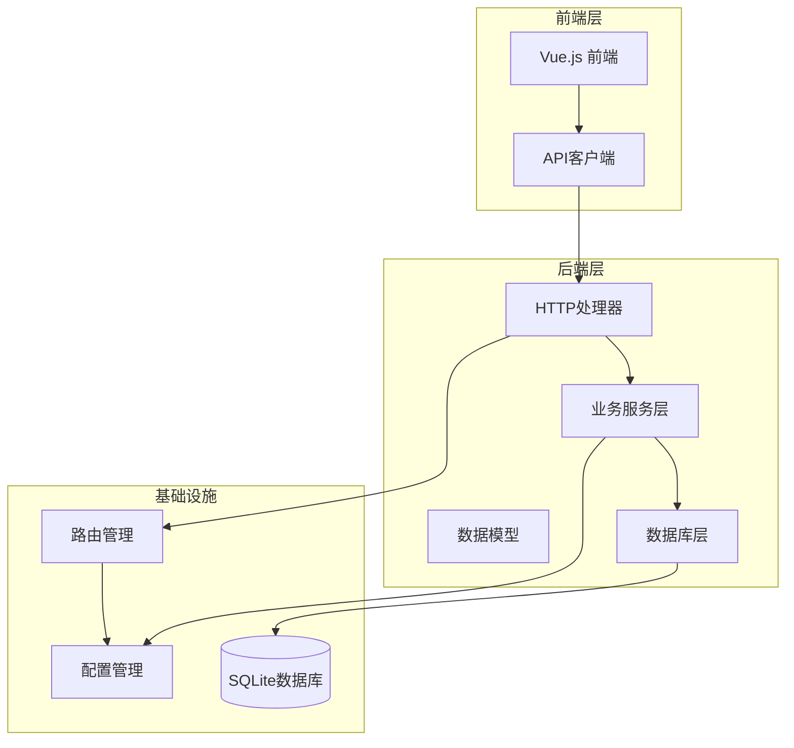
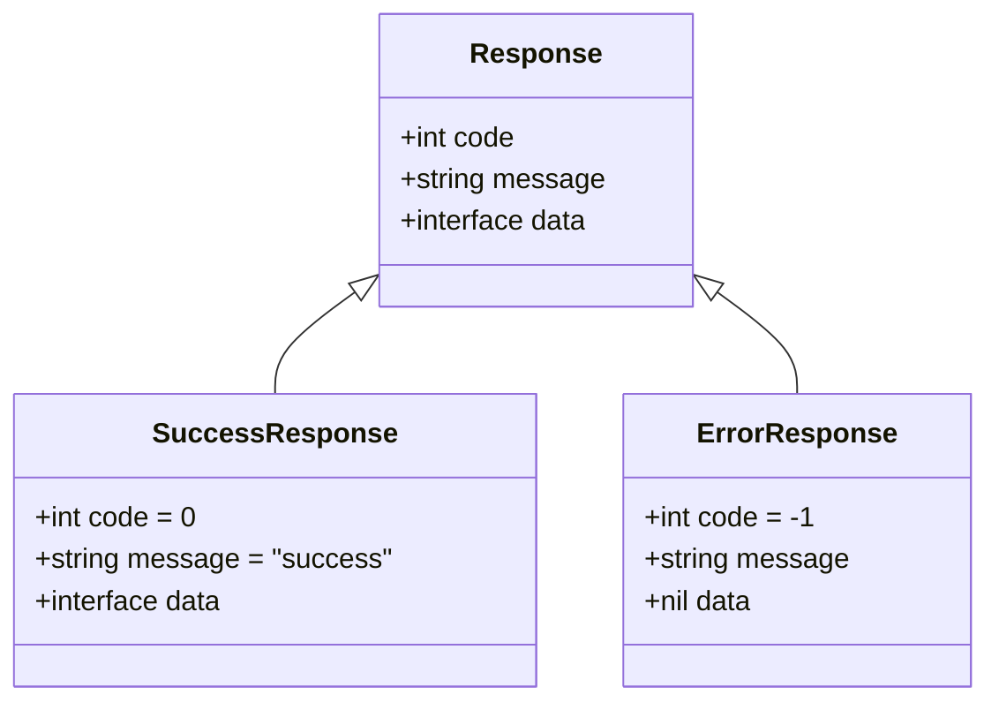
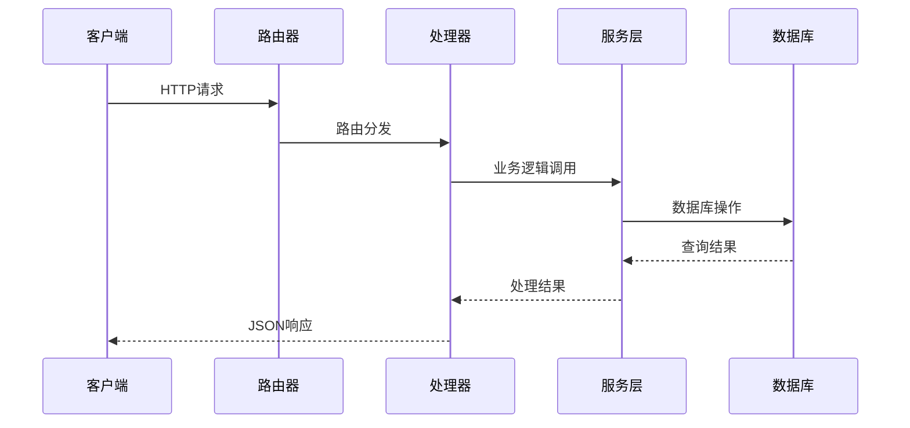
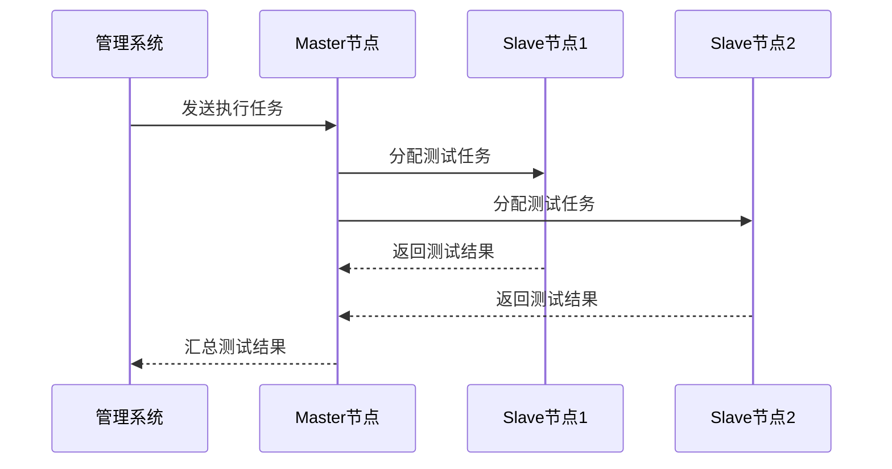

# Slave节点管理API

<cite>
**本文档引用的文件**
- [main.go](file://main.go)
- [router.go](file://internal/router/router.go)
- [slave.go](file://internal/handler/slave.go)
- [slave.go](file://internal/service/slave.go)
- [slave.go](file://internal/model/slave.go)
- [response.go](file://internal/model/response.go)
- [db.go](file://internal/database/db.go)
- [config.go](file://config/config.go)
- [slave.js](file://web/src/api/slave.js)
- [SlaveManage.vue](file://web/src/views/SlaveManage.vue)
- [README.md](file://README.md)
</cite>

## 目录
1. [简介](#简介)
2. [项目结构](#项目结构)
3. [核心组件](#核心组件)
4. [架构概览](#架构概览)
5. [详细API文档](#详细api文档)
6. [节点管理最佳实践](#节点管理最佳实践)
7. [故障排除指南](#故障排除指南)
8. [JMeter分布式架构集成](#jmeter分布式架构集成)
9. [性能考虑](#性能考虑)
10. [总结](#总结)

## 简介

JMeter Admin是一个基于Go语言和Vue.js的分布式JMeter压测管理平台。本文档专注于Slave节点管理功能，详细说明节点注册、发现、状态管理和连通性检测的完整API体系。该系统采用SQLite作为数据存储，提供自动心跳检测和手动连通性检查功能，支持多网卡环境下的Master节点配置。

## 项目结构

该项目采用分层架构设计，主要包含以下核心模块：



**图表来源**
- [main.go:28-66](file://main.go#L28-L66)
- [router.go:14-112](file://internal/router/router.go#L14-L112)

**章节来源**
- [main.go:1-83](file://main.go#L1-L83)
- [router.go:1-129](file://internal/router/router.go#L1-L129)

## 核心组件

### 数据模型

Slave节点的核心数据结构包含以下字段：

| 字段名 | 类型 | 描述 | 默认值 |
|--------|------|------|--------|
| id | int64 | 节点唯一标识符 | 自增 |
| name | string | 节点名称 | 必填 |
| host | string | 主机地址 | 必填 |
| port | int | 端口号 | 必填 |
| status | string | 节点状态 | "offline" |
| last_check_time | string | 最后检测时间 | null |
| created_at | string | 创建时间 | 系统时间 |

### 响应格式

所有API响应遵循统一的JSON格式：



**图表来源**
- [response.go:3-27](file://internal/model/response.go#L3-L27)

**章节来源**
- [slave.go:3-11](file://internal/model/slave.go#L3-L11)
- [response.go:14-27](file://internal/model/response.go#L14-L27)

## 架构概览

系统采用MVC架构模式，通过Gin框架提供RESTful API服务：



**图表来源**
- [router.go:38-47](file://internal/router/router.go#L38-L47)
- [slave.go:16-24](file://internal/handler/slave.go#L16-L24)

**章节来源**
- [router.go:14-112](file://internal/router/router.go#L14-L112)
- [slave.go:16-236](file://internal/handler/slave.go#L16-L236)

## 详细API文档

### 节点管理基础API

#### 获取节点列表
**GET** `/api/slaves`

**功能描述**: 返回所有Slave节点的完整列表

**请求参数**: 无

**响应数据**:
```json
{
  "code": 0,
  "message": "success",
  "data": [
    {
      "id": 1,
      "name": "slave-01",
      "host": "192.168.1.100",
      "port": 1099,
      "status": "online",
      "last_check_time": "2024-01-15 14:30:00",
      "created_at": "2024-01-10 09:15:00"
    }
  ]
}
```

**状态码**:
- 200 成功
- 500 服务器内部错误

**章节来源**
- [slave.go:16-24](file://internal/handler/slave.go#L16-L24)
- [slave.go:15-41](file://internal/service/slave.go#L15-L41)

#### 创建新节点
**POST** `/api/slaves`

**功能描述**: 添加新的Slave节点到系统

**请求头**: `Content-Type: application/json`

**请求体参数**:
```json
{
  "name": "slave-01",
  "host": "192.168.1.100", 
  "port": 1099
}
```

**响应数据**:
```json
{
  "code": 0,
  "message": "success",
  "data": {
    "id": 1,
    "name": "slave-01",
    "host": "192.168.1.100",
    "port": 1099,
    "status": "offline",
    "created_at": "2024-01-15 14:30:00"
  }
}
```

**状态码**:
- 200 创建成功
- 400 参数验证失败
- 500 服务器内部错误

**章节来源**
- [slave.go:33-48](file://internal/handler/slave.go#L33-L48)
- [slave.go:43-69](file://internal/service/slave.go#L43-L69)

#### 更新节点信息
**PUT** `/api/slaves/:id`

**功能描述**: 更新指定ID的Slave节点信息

**路径参数**:
- `id` (int64): 节点唯一标识符

**请求体参数**:
```json
{
  "name": "slave-01-updated",
  "host": "192.168.1.101",
  "port": 1099
}
```

**响应数据**:
```json
{
  "code": 0,
  "message": "success",
  "data": null
}
```

**状态码**:
- 200 更新成功
- 400 无效ID或参数错误
- 404 节点不存在
- 500 服务器内部错误

**章节来源**
- [slave.go:57-78](file://internal/handler/slave.go#L57-L78)
- [slave.go:71-91](file://internal/service/slave.go#L71-L91)

#### 删除节点
**DELETE** `/api/slaves/:id`

**功能描述**: 从系统中删除指定ID的Slave节点

**路径参数**:
- `id` (int64): 节点唯一标识符

**响应数据**:
```json
{
  "code": 0,
  "message": "success", 
  "data": null
}
```

**状态码**:
- 200 删除成功
- 400 无效ID
- 404 节点不存在
- 500 服务器内部错误

**章节来源**
- [slave.go:80-95](file://internal/handler/slave.go#L80-L95)
- [slave.go:93-110](file://internal/service/slave.go#L93-L110)

### 节点连通性检测API

#### 单节点连通性检查
**POST** `/api/slaves/:id/check`

**功能描述**: 手动检查指定ID节点的网络连通性

**路径参数**:
- `id` (int64): 节点唯一标识符

**响应数据**:
```json
{
  "code": 0,
  "message": "success",
  "data": {
    "online": true,
    "status": "online"
  }
}
```

**响应字段说明**:
- `online`: boolean - 节点连通性状态
- `status`: string - 节点状态文本（"online"/"offline"）

**状态码**:
- 200 检测完成
- 400 无效ID
- 500 检测失败

**章节来源**
- [slave.go:97-122](file://internal/handler/slave.go#L97-L122)
- [slave.go:112-157](file://internal/service/slave.go#L112-L157)

#### 心跳状态查询
**GET** `/api/slaves/heartbeat-status`

**功能描述**: 获取所有Slave节点的心跳状态和检测信息

**响应数据**:
```json
{
  "code": 0,
  "message": "success",
  "data": {
    "slaves": [
      {
        "id": 1,
        "name": "slave-01",
        "host": "192.168.1.100", 
        "port": 1099,
        "status": "online",
        "last_check_time": "2024-01-15 14:30:00"
      }
    ],
    "check_interval": 30,
    "last_check_time": "2024-01-15 14:30:00"
  }
}
```

**响应字段说明**:
- `slaves`: array - 节点状态数组
- `check_interval`: int - 心跳检测间隔（秒）
- `last_check_time`: string - 最近一次检测时间

**状态码**:
- 200 查询成功
- 500 服务器内部错误

**章节来源**
- [slave.go:200-235](file://internal/handler/slave.go#L200-L235)
- [slave.go:159-220](file://internal/service/slave.go#L159-L220)

### 系统配置API

#### 获取网络接口列表
**GET** `/api/config/network-interfaces`

**功能描述**: 获取本机可用的网络接口列表

**响应数据**:
```json
{
  "code": 0,
  "message": "success",
  "data": [
    {
      "name": "eth0",
      "ip": "192.168.1.10"
    },
    {
      "name": "wlan0", 
      "ip": "10.0.0.5"
    }
  ]
}
```

**状态码**:
- 200 查询成功
- 500 获取失败

**章节来源**
- [slave.go:124-167](file://internal/handler/slave.go#L124-L167)

#### 获取Master主机名配置
**GET** `/api/config/master-hostname`

**功能描述**: 获取当前配置的Master主机名

**响应数据**:
```json
{
  "code": 0,
  "message": "success", 
  "data": {
    "master_hostname": "192.168.1.10"
  }
}
```

**状态码**:
- 200 查询成功
- 500 服务器内部错误

**章节来源**
- [slave.go:169-174](file://internal/handler/slave.go#L169-L174)

#### 更新Master主机名配置
**PUT** `/api/config/master-hostname`

**功能描述**: 更新Master主机名配置

**请求体参数**:
```json
{
  "master_hostname": "192.168.1.10"
}
```

**响应数据**:
```json
{
  "code": 0,
  "message": "success",
  "data": {
    "master_hostname": "192.168.1.10"
  }
}
```

**状态码**:
- 200 更新成功
- 400 请求参数无效
- 500 保存失败

**章节来源**
- [slave.go:176-198](file://internal/handler/slave.go#L176-L198)

## 节点管理最佳实践

### 节点配置策略

1. **多网卡环境配置**
   - 在多网卡环境中必须明确配置`master_hostname`
   - 使用`/api/config/network-interfaces`获取可用IP列表
   - 确保Slave节点能够访问配置的Master IP

2. **端口规划**
   - 默认端口: 1099 (JMeter RMI端口)
   - 防火墙需要开放相应端口
   - 避免端口冲突

3. **节点命名规范**
   - 使用有意义的节点名称便于识别
   - 建议包含地理位置或用途信息

### 连通性管理

1. **定期健康检查**
   - 系统默认每30秒进行一次心跳检测
   - 可通过`/api/slaves/heartbeat-status`监控状态
   - 支持手动检测以快速发现问题

2. **状态监控**
   - `online`: 节点正常响应
   - `offline`: 节点不可达
   - `unknown`: 未检测状态

3. **故障处理流程**
   ```mermaid
flowchart TD
Start[开始检测] --> CheckID{验证ID有效}
CheckID --> |否| Error[返回错误]
CheckID --> |是| Connect[建立TCP连接]
Connect --> Connected{连接成功?}
Connected --> |是| UpdateOnline[更新状态为online]
Connected --> |否| UpdateOffline[更新状态为offline]
UpdateOnline --> Save[保存到数据库]
UpdateOffline --> Save
Save --> Success[返回成功]
Error --> End[结束]
Success --> End
```

**图表来源**
- [slave.go:112-157](file://internal/service/slave.go#L112-L157)

### 性能优化建议

1. **并发控制**
   - 心跳检测使用信号量限制并发数为10
   - 避免对大量节点同时检测造成网络拥塞

2. **超时设置**
   - TCP连接超时设置为3秒
   - 平衡检测速度和准确性

3. **数据库优化**
   - 使用SQLite轻量级存储
   - 自动创建索引提高查询性能

**章节来源**
- [slave.go:172-219](file://internal/service/slave.go#L172-L219)

## 故障排除指南

### 常见问题诊断

#### Slave节点无法连接

**症状**: 节点状态始终为`offline`

**排查步骤**:
1. 检查Master主机名配置
   ```bash
   curl http://localhost:8080/api/config/master-hostname
   ```

2. 验证网络连通性
   ```bash
   telnet 192.168.1.100 1099
   ```

3. 检查防火墙设置
   - 确认1099端口开放
   - 检查安全组规则

#### 心跳检测异常

**症状**: 心跳状态不准确或检测失败

**解决方案**:
1. 调整检测间隔
   - 修改配置文件中的`heartbeat_interval`
   - 重启服务生效

2. 检查系统负载
   - 监控CPU和内存使用率
   - 减少同时检测的节点数量

3. 查看日志输出
   - 系统会记录详细的检测日志
   - 检查是否有网络错误信息

#### 数据库问题

**症状**: API调用失败或数据丢失

**解决方法**:
1. 检查数据库文件权限
   - 确保应用程序有读写权限
   - 检查磁盘空间

2. 重建数据库
   ```bash
   rm data/jmeter-admin.db
   ./jmeter-admin
   ```

### 错误代码对照表

| 错误码 | 描述 | 可能原因 | 解决方案 |
|--------|------|----------|----------|
| -1 | 通用错误 | 服务器内部异常 | 检查日志，重启服务 |
| 400 | 参数错误 | 请求参数无效 | 验证请求格式 |
| 404 | 资源不存在 | 节点ID不存在 | 检查节点是否存在 |
| 500 | 服务器错误 | 数据库或系统错误 | 检查数据库连接 |

**章节来源**
- [slave.go:112-157](file://internal/service/slave.go#L112-L157)
- [response.go:22-27](file://internal/model/response.go#L22-L27)

## JMeter分布式架构集成

### Master节点配置

在多网卡环境中，Master节点的配置至关重要：

1. **配置选项**
   - 在`config.yaml`中设置`master_hostname`
   - 或通过Web界面选择合适的网络接口

2. **环境变量传递**
   - 系统自动设置`-Djava.rmi.server.hostname`
   - 确保Slave节点能够正确回传结果

3. **端口要求**
   - 默认端口: 1099 (RMI端口)
   - 需要开放防火墙访问权限

### Slave节点启动

Slave节点需要正确启动才能被管理系统识别：

```bash
# 启动JMeter服务器
jmeter-server -Dserver.rmi.ssl.disable=true
```

**启动参数说明**:
- `-Dserver.rmi.ssl.disable=true`: 禁用SSL，简化连接
- 确保JMeter版本兼容性

### 分布式执行流程



**图表来源**
- [README.md:238-246](file://README.md#L238-L246)

### 监控和维护

1. **实时监控**
   - 使用`/api/slaves/heartbeat-status`监控节点状态
   - 定期检查节点连通性

2. **故障恢复**
   - 自动检测节点故障
   - 支持手动重试机制
   - 提供详细的错误日志

3. **扩展性考虑**
   - 支持动态添加/删除节点
   - 平滑扩缩容能力
   - 负载均衡策略

**章节来源**
- [README.md:231-252](file://README.md#L231-L252)
- [main.go:50-55](file://main.go#L50-L55)

## 性能考虑

### 系统性能指标

1. **响应时间**
   - 单节点检测: ~3秒（TCP超时）
   - 批量检测: 受并发限制影响
   - 数据库查询: SQLite轻量级，响应迅速

2. **资源消耗**
   - 内存使用: 低开销设计
   - CPU占用: 心跳检测并发控制
   - 磁盘I/O: SQLite文件存储

3. **并发处理**
   - 心跳检测使用信号量限制并发数
   - 默认并发数: 10个节点
   - 可根据系统性能调整

### 优化建议

1. **网络优化**
   - 使用内网IP进行节点通信
   - 避免跨网络段检测
   - 合理设置检测间隔

2. **数据库优化**
   - 定期备份数据库
   - 监控数据库文件大小
   - 使用索引提高查询效率

3. **系统监控**
   - 监控系统资源使用情况
   - 设置告警阈值
   - 定期性能评估

## 总结

JMeter Admin的Slave节点管理功能提供了完整的分布式压测节点生命周期管理。通过RESTful API，用户可以轻松管理节点的注册、配置、状态监控和连通性检测。系统采用自动心跳检测和手动检测相结合的方式，确保节点状态的实时性和准确性。

关键特性包括：
- 完整的CRUD操作支持
- 自动和手动连通性检测
- 多网卡环境的Master配置
- 实时状态监控和告警
- 轻量级SQLite存储
- 前后端分离的现代化架构

该系统为JMeter分布式压测提供了可靠的管理平台，简化了节点管理复杂度，提高了分布式压测的效率和可靠性。