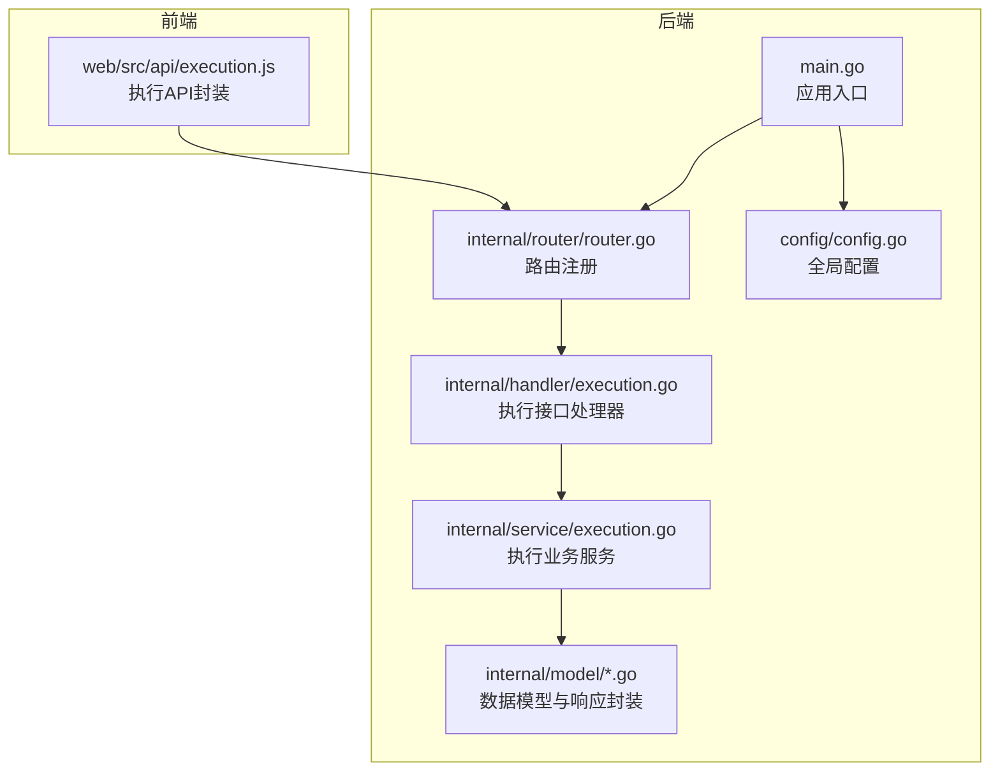
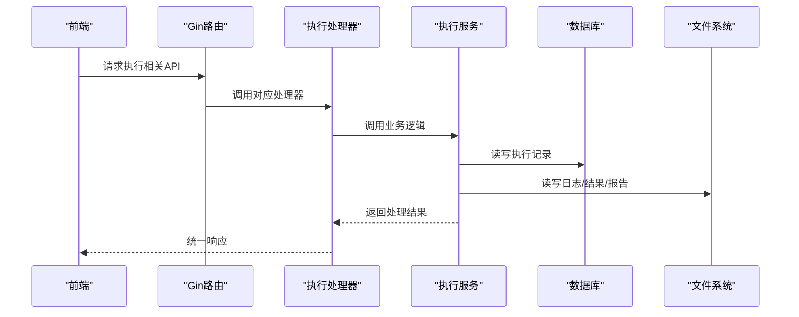
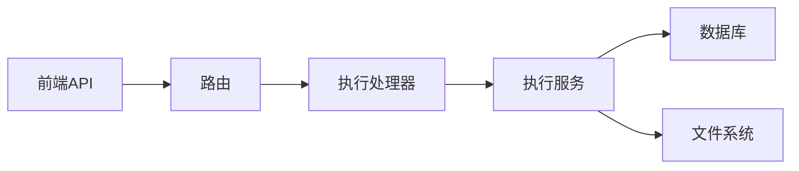

# 执行管理API

<cite>
**本文引用的文件**
- [main.go](file://main.go)
- [router.go](file://internal/router/router.go)
- [execution.go](file://internal/handler/execution.go)
- [execution.go](file://internal/service/execution.go)
- [execution.go](file://internal/model/execution.go)
- [response.go](file://internal/model/response.go)
- [config.go](file://config/config.go)
- [execution.js](file://web/src/api/execution.js)
</cite>

## 目录
1. [简介](#简介)
2. [项目结构](#项目结构)
3. [核心组件](#核心组件)
4. [架构总览](#架构总览)
5. [详细组件分析](#详细组件分析)
6. [依赖分析](#依赖分析)
7. [性能考虑](#性能考虑)
8. [故障排查指南](#故障排查指南)
9. [结论](#结论)
10. [附录](#附录)

## 简介
本文件为“执行管理”模块的全面API文档，覆盖测试执行的全生命周期管理，包括：
- 基础操作：创建执行任务、获取执行列表、获取执行详情、删除执行记录
- 实时监控：获取实时指标流（SSE）、停止执行任务
- 结果文件管理：下载JTL文件、生成HTML报告、导出错误信息
- 错误详情上传：分布式场景下从Slave节点回传错误明细
- 状态管理与错误处理：执行状态流转、异常恢复与清理策略

## 项目结构
后端采用Go语言与Gin框架，路由在统一入口注册；执行相关的Handler与Service分别负责接口层与业务逻辑；前端通过Axios封装的API模块调用后端接口。

**图表来源**
- [main.go:28-66](file://main.go#L28-L66)
- [router.go:14-112](file://internal/router/router.go#L14-L112)
- [execution.go:1-729](file://internal/handler/execution.go#L1-L729)
- [execution.go:1-2546](file://internal/service/execution.go#L1-L2546)
- [execution.js:1-78](file://web/src/api/execution.js#L1-L78)

**章节来源**
- [main.go:28-66](file://main.go#L28-L66)
- [router.go:14-112](file://internal/router/router.go#L14-L112)

## 核心组件
- 路由与接口
  - 所有执行相关接口位于/api/executions组下，包含列表、详情、实时指标、停止、删除、结果下载、错误导出、错误详情上传等端点。
- 处理器（Handler）
  - 负责参数校验、调用Service并返回统一格式的响应。
- 服务（Service）
  - 负责执行任务创建、状态更新、实时指标聚合、日志与结果文件管理、错误详情上传与合并。
- 模型与响应
  - 统一响应结构与分页结构，便于前后端一致处理。
- 配置
  - 服务器端口、JMeter路径、Master主机名、心跳间隔、目录结构等。

**章节来源**
- [router.go:49-66](file://internal/router/router.go#L49-L66)
- [execution.go:1-729](file://internal/handler/execution.go#L1-L729)
- [execution.go:1-2546](file://internal/service/execution.go#L1-L2546)
- [execution.go:1-19](file://internal/model/execution.go#L1-L19)
- [response.go:1-46](file://internal/model/response.go#L1-L46)
- [config.go:10-41](file://config/config.go#L10-L41)

## 架构总览
后端通过Gin注册执行相关路由，Handler将请求转发给Service，Service与数据库、文件系统交互，并在后台异步执行JMeter命令，最终生成结果与报告。前端通过封装的API模块调用后端接口。

**图表来源**
- [router.go:14-112](file://internal/router/router.go#L14-L112)
- [execution.go:1-729](file://internal/handler/execution.go#L1-L729)
- [execution.go:1-2546](file://internal/service/execution.go#L1-L2546)

## 详细组件分析

### 基础操作API

- 创建执行任务
  - 方法与路径：POST /api/executions
  - 请求体字段
    - script_id: 测试脚本ID（整数，必填）
    - slave_ids: Slave节点ID数组（整数数组，可选）
    - remarks: 备注（字符串，可选）
    - save_http_details: 是否保存HTTP详情（布尔，可选）
    - include_master: 分布式时是否包含Master本地执行（布尔，可选）
  - 成功响应：返回执行记录（包含ID、状态、路径等）
  - 常见错误：参数校验失败、脚本不存在、Slave离线、JVM内存计算失败、命令执行失败
  - 最佳实践：分布式执行时建议设置save_http_details以启用错误明细回传；如需包含Master本地执行，设置include_master为true
  - 前端调用参考：[execution.js:14-17](file://web/src/api/execution.js#L14-L17)

- 获取执行列表
  - 方法与路径：GET /api/executions
  - 查询参数
    - page/page_size：分页（默认page=1，page_size=10，最大100）
    - script_id/status/keyword/start_date/end_date：筛选条件
  - 成功响应：分页数据（total与list）
  - 最佳实践：结合关键字与时间范围筛选，避免一次性拉取过多数据

- 获取执行详情
  - 方法与路径：GET /api/executions/:id
  - 参数：id（执行ID）
  - 成功响应：执行记录（含状态、路径、摘要等）

- 删除执行记录
  - 方法与路径：DELETE /api/executions/:id
  - 参数：id（执行ID）
  - 行为：删除数据库记录并清理结果目录、日志、报告文件
  - 注意：删除不可逆，谨慎操作

**章节来源**
- [router.go:52-58](file://internal/router/router.go#L52-L58)
- [execution.go:29-53](file://internal/handler/execution.go#L29-L53)
- [execution.go:55-87](file://internal/handler/execution.go#L55-L87)
- [execution.go:100-116](file://internal/handler/execution.go#L100-L116)
- [execution.go:153-168](file://internal/handler/execution.go#L153-L168)
- [execution.go:103-481](file://internal/service/execution.go#L103-L481)
- [execution.go:504-594](file://internal/service/execution.go#L504-L594)
- [execution.go:637-671](file://internal/service/execution.go#L637-L671)
- [execution.go:1472-1519](file://internal/service/execution.go#L1472-L1519)
- [execution.js:9-12](file://web/src/api/execution.js#L9-L12)
- [execution.js:19-22](file://web/src/api/execution.js#L19-L22)
- [execution.js:34-37](file://web/src/api/execution.js#L34-L37)

### 实时监控API

- 获取实时指标（SSE）
  - 方法与路径：GET /api/executions/:id/live-metrics
  - 参数：id（执行ID）
  - 响应：JSON对象，包含执行状态、累计/峰值/当前指标（TPS、请求速率、平均RT、成功率、错误率、并发数、持续时间）与时间序列点
  - 特性：基于JTL文件的实时聚合，按秒级窗口统计；当执行结束时，会读取剩余内容并发送complete事件
  - 最佳实践：前端使用轮询或WebSocket替代方案时，建议优先使用此SSE接口以降低资源消耗

- 停止执行任务
  - 方法与路径：POST /api/executions/:id/stop
  - 参数：id（执行ID）
  - 行为：向运行中的JMeter进程发送终止信号，更新状态为stopped并计算时长
  - 注意：若执行未在运行中或已结束，将返回错误

- 日志流（SSE）
  - 方法与路径：GET /api/executions/:id/log
  - 参数：id（执行ID），snapshot=1可获取尾部快照（可选tail参数控制行数，默认300，上限5000）
  - 响应：SSE流，事件类型包括message（日志行）、complete（结束）、error（错误）
  - 特性：支持客户端断开自动回收；执行结束后会推送剩余日志并发送complete
  - 最佳实践：前端需正确处理SSE连接与断线重连

**章节来源**
- [router.go:56-57](file://internal/router/router.go#L56-L57)
- [execution.go:118-134](file://internal/handler/execution.go#L118-L134)
- [execution.go:136-151](file://internal/handler/execution.go#L136-L151)
- [execution.go:555-708](file://internal/handler/execution.go#L555-L708)
- [execution.go:673-947](file://internal/service/execution.go#L673-L947)
- [execution.go:949-994](file://internal/service/execution.go#L949-L994)
- [execution.go:996-1041](file://internal/service/execution.go#L996-L1041)

### 结果文件管理API

- 下载JTL结果文件
  - 方法与路径：GET /api/executions/:id/download/jtl
  - 参数：id（执行ID）
  - 响应：octet-stream，文件名为execution_{id}_result.jtl
  - 注意：若结果文件不存在或路径为空，返回相应错误

- 生成HTML报告（打包ZIP）
  - 方法与路径：GET /api/executions/:id/download/report
  - 参数：id（执行ID）
  - 响应：application/zip，包含报告目录全部内容
  - 注意：若报告目录不存在或非目录，返回相应错误

- 导出错误记录（CSV）
  - 方法与路径：GET /api/executions/:id/download/errors
  - 参数：id（执行ID）
  - 响应：text/csv，UTF-8 BOM编码，包含错误明细字段
  - 字段：时间戳、标签、响应码、响应信息、失败原因、请求URL、请求头、请求体、响应内容、响应头、线程名、响应时间(ms)、延迟(ms)、连接时间(ms)、发送字节数、接收字节数
  - 注意：若无错误记录，返回相应错误

- 导出完整结果（ZIP）
  - 方法与路径：GET /api/executions/:id/download/all
  - 参数：id（执行ID）
  - 响应：application/zip，包含execution.log、result.jtl、report目录与美化后的summary.json
  - 注意：若文件不存在或路径为空，按存在性进行打包

**章节来源**
- [router.go:62-66](file://internal/router/router.go#L62-L66)
- [execution.go:211-259](file://internal/handler/execution.go#L211-L259)
- [execution.go:261-358](file://internal/handler/execution.go#L261-L358)
- [execution.go:360-418](file://internal/handler/execution.go#L360-L418)
- [execution.go:420-553](file://internal/handler/execution.go#L420-L553)

### 错误详情上传API

- 错误详情上传
  - 方法与路径：POST /api/executions/:id/error-details/upload
  - 参数：id（执行ID）
  - 请求体字段
    - token: 上传令牌（由服务端生成并下发）
    - source: 来源标识（如Slave节点名），将作为文件名的一部分
    - content: ndjson格式的错误明细内容
  - 行为：校验令牌与执行状态，将内容保存至error-details/{source}.ndjson
  - 注意：分布式执行且开启save_http_details时，服务端会生成令牌并通过JMeter属性下发；Slave节点需按约定回传

- 错误分析获取
  - 方法与路径：GET /api/executions/:id/errors
  - 参数：id（执行ID）
  - 响应：错误分析数据（包含错误条目与统计）

**章节来源**
- [router.go:61](file://internal/router/router.go#L61)
- [execution.go:187-209](file://internal/handler/execution.go#L187-L209)
- [execution.go:170-185](file://internal/handler/execution.go#L170-L185)
- [execution.go:1985-2064](file://internal/service/execution.go#L1985-L2064)

### 统计与概览API

- 执行统计
  - 方法与路径：GET /api/executions/stats
  - 响应：执行总数、运行中、已完成、失败、已停止的数量
  - 最佳实践：用于仪表板与概览页面的数据来源

**章节来源**
- [router.go:53](file://internal/router/router.go#L53)
- [execution.go:89-98](file://internal/handler/execution.go#L89-L98)
- [execution.go:596-635](file://internal/service/execution.go#L596-L635)

## 依赖分析
- 组件耦合
  - Handler依赖Service，Service依赖数据库与文件系统；路由集中注册，职责清晰。
- 外部依赖
  - Gin框架、JMeter可执行文件、SQLite（根据数据库实现）、操作系统文件系统。
- 潜在循环依赖
  - 当前结构为单向依赖，无明显循环。

**图表来源**
- [router.go:14-112](file://internal/router/router.go#L14-L112)
- [execution.go:1-729](file://internal/handler/execution.go#L1-L729)
- [execution.go:1-2546](file://internal/service/execution.go#L1-L2546)

**章节来源**
- [router.go:14-112](file://internal/router/router.go#L14-L112)
- [execution.go:1-729](file://internal/handler/execution.go#L1-L729)
- [execution.go:1-2546](file://internal/service/execution.go#L1-L2546)

## 性能考虑
- 实时指标聚合
  - 基于JTL文件的CSV解析与按秒桶聚合，建议在高并发场景下合理设置刷新频率，避免频繁I/O。
- 日志流
  - SSE模式减少轮询开销；注意Nginx等代理的缓冲设置，确保实时性。
- 结果文件打包
  - ZIP打包涉及大量小文件读写，建议在空闲时段或批量导出，避免阻塞执行。
- 进程管理
  - 异步执行JMeter命令，使用WaitGroup协调本地与远程执行；合并结果与生成报告时注意磁盘IO与CPU占用。

[本节为通用指导，无需特定文件引用]

## 故障排查指南
- 常见错误与处理
  - 参数无效：检查请求体字段与类型，确保script_id存在且slave_ids在线。
  - 执行记录不存在：确认ID正确，或执行尚未创建。
  - 文件不存在/路径为空：检查结果目录与报告目录是否生成。
  - 进程停止失败：确认执行确实在运行中，必要时手动清理僵尸进程。
  - 分布式错误明细上传失败：核对令牌、来源标识与Master主机名配置。
- 状态管理
  - 服务重启时会将running状态清理为failed，避免悬挂状态。
  - 停止执行会更新状态为stopped并计算时长。
- 建议
  - 前端对SSE连接做好断线重连与超时处理。
  - 对大文件下载与打包操作进行进度提示与超时控制。

**章节来源**
- [execution.go:39-53](file://internal/handler/execution.go#L39-L53)
- [execution.go:100-116](file://internal/handler/execution.go#L100-L116)
- [execution.go:211-259](file://internal/handler/execution.go#L211-L259)
- [execution.go:261-358](file://internal/handler/execution.go#L261-L358)
- [execution.go:360-418](file://internal/handler/execution.go#L360-L418)
- [execution.go:555-708](file://internal/handler/execution.go#L555-L708)
- [execution.go:1043-1060](file://internal/service/execution.go#L1043-L1060)
- [execution.go:949-994](file://internal/service/execution.go#L949-L994)
- [execution.go:1985-2064](file://internal/service/execution.go#L1985-L2064)

## 结论
该执行管理API体系覆盖了从创建、监控到结果导出的完整链路，具备良好的扩展性与稳定性。通过SSE实现实时观测，通过错误详情上传支持分布式场景下的问题定位，通过统一的响应结构与分页设计提升前后端协作效率。建议在生产环境中结合令牌鉴权、限流与缓存策略进一步增强安全性与性能。

[本节为总结性内容，无需特定文件引用]

## 附录

### API一览与最佳实践速查
- 创建执行
  - 建议：分布式执行时开启save_http_details并配置Master主机名；如需本地与远程混合，设置include_master。
- 实时指标
  - 建议：前端使用SSE，合理设置刷新频率；执行结束后及时关闭连接。
- 停止执行
  - 建议：仅对运行中执行调用；停止后检查日志与结果完整性。
- 结果文件
  - 建议：大文件下载与打包在低峰期进行；导出CSV时注意字符集与字段顺序。
- 错误详情上传
  - 建议：严格校验token与source；确保Slave节点正确配置回传地址与令牌。

**章节来源**
- [execution.js:14-17](file://web/src/api/execution.js#L14-L17)
- [execution.js:24-27](file://web/src/api/execution.js#L24-L27)
- [execution.js:29-32](file://web/src/api/execution.js#L29-L32)
- [execution.js:44-66](file://web/src/api/execution.js#L44-L66)
- [config.go:26-29](file://config/config.go#L26-L29)