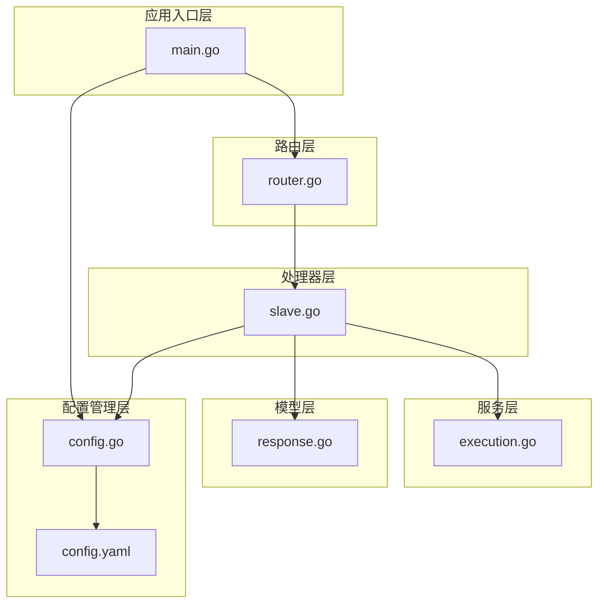
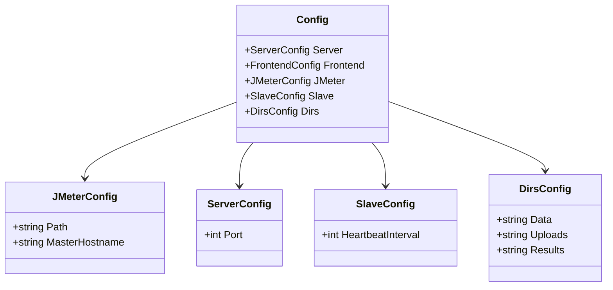
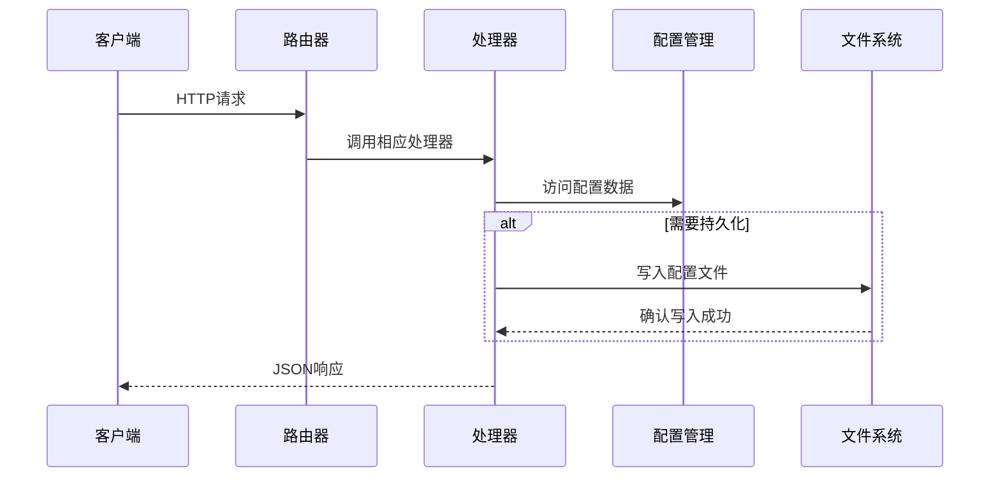
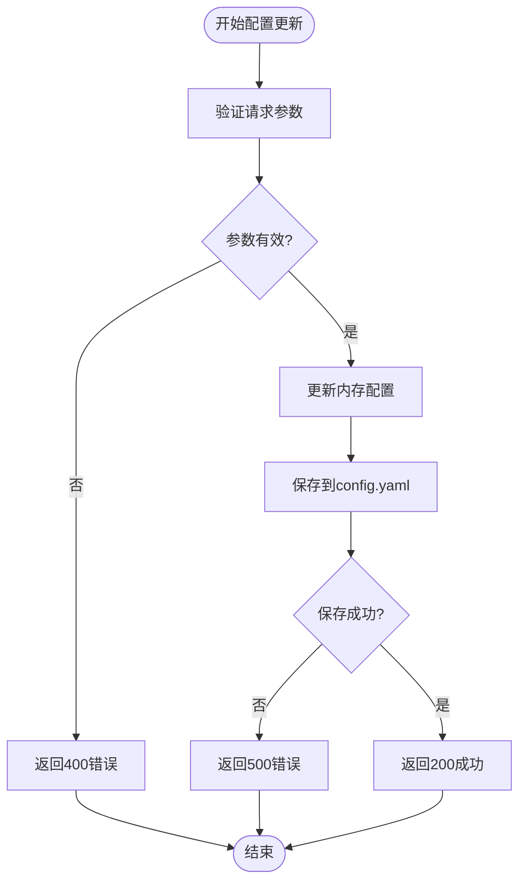
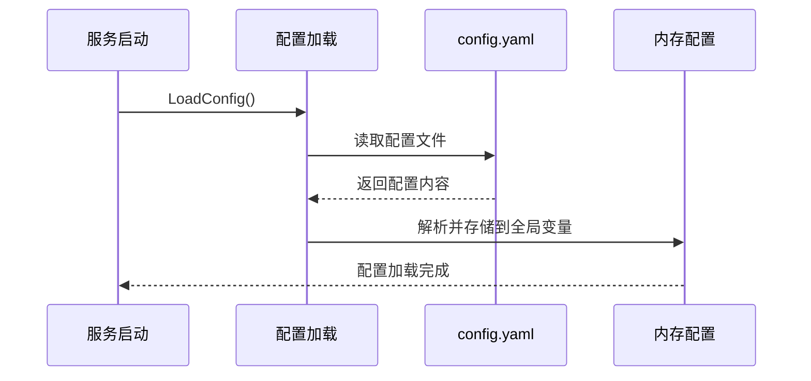
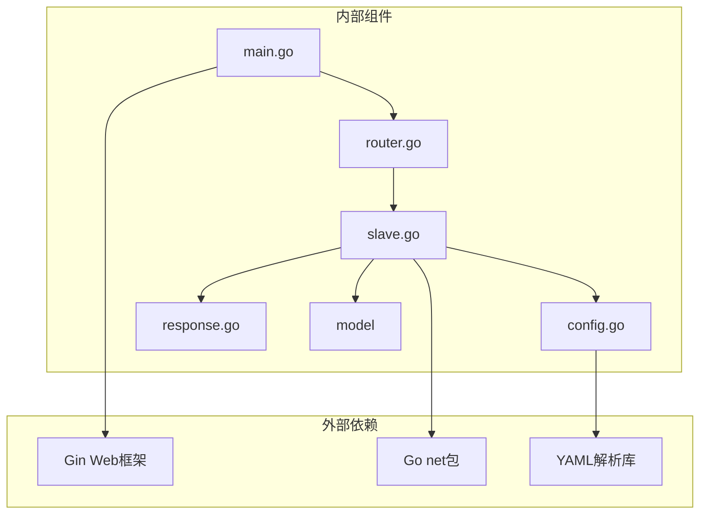
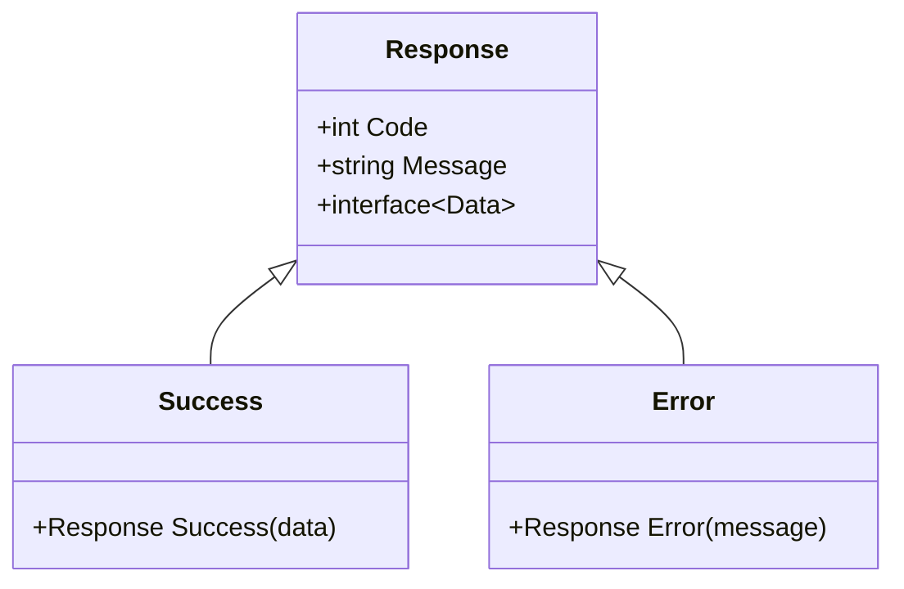

# 系统配置API

<cite>
**本文档引用的文件**
- [main.go](file://main.go)
- [config.go](file://config/config.go)
- [router.go](file://internal/router/router.go)
- [slave.go](file://internal/handler/slave.go)
- [response.go](file://internal/model/response.go)
- [config.yaml](file://config.yaml)
- [execution.go](file://internal/service/execution.go)
</cite>

## 目录
1. [简介](#简介)
2. [项目结构](#项目结构)
3. [核心组件](#核心组件)
4. [架构概览](#架构概览)
5. [详细组件分析](#详细组件分析)
6. [依赖关系分析](#依赖关系分析)
7. [性能考虑](#性能考虑)
8. [故障排除指南](#故障排除指南)
9. [结论](#结论)

## 简介

本文档详细说明了JMeter Admin系统的配置管理API，重点关注两个核心功能：
- **网络接口检测API**：用于获取服务器可用的网络接口列表，帮助用户在多网卡环境中正确配置Master主机名
- **Master主机名配置API**：用于获取、设置和持久化JMeter Master节点的回调地址配置

这些API对于分布式JMeter测试环境的正确配置至关重要，特别是在多网卡服务器上确保Slave节点能够正确连接到Master节点。

## 项目结构

JMeter Admin采用Go语言的模块化架构设计，主要分为以下几个层次：



**图表来源**
- [main.go:1-83](file://main.go#L1-L83)
- [config.go:1-113](file://config/config.go#L1-L113)
- [router.go:1-129](file://internal/router/router.go#L1-L129)

**章节来源**
- [main.go:1-83](file://main.go#L1-L83)
- [config.go:1-113](file://config/config.go#L1-L113)
- [router.go:1-129](file://internal/router/router.go#L1-L129)

## 核心组件

### 配置管理系统

系统配置管理基于以下核心组件：

1. **配置结构体**：定义了完整的配置层次结构
2. **路由映射**：将REST API端点映射到相应的处理器函数
3. **处理器函数**：实现具体的业务逻辑和数据处理
4. **响应模型**：统一的API响应格式标准

### 配置数据结构



**图表来源**
- [config.go:10-39](file://config/config.go#L10-L39)

**章节来源**
- [config.go:10-39](file://config/config.go#L10-L39)
- [config.yaml:1-26](file://config.yaml#L1-L26)

## 架构概览

系统采用经典的MVC架构模式，结合RESTful API设计原则：



**图表来源**
- [router.go:68-74](file://internal/router/router.go#L68-L74)
- [slave.go:176-198](file://internal/handler/slave.go#L176-L198)

## 详细组件分析

### 网络接口检测API

#### API端点规范

**端点**: `GET /api/config/network-interfaces`

**功能**: 获取服务器当前可用的网络接口列表，包括接口名称和IPv4地址

**请求参数**: 无

**请求头**: 
- Content-Type: application/json

**响应结构**:
```json
{
  "code": 0,
  "message": "success",
  "data": [
    {
      "name": "eth0",
      "ip": "192.168.1.100"
    },
    {
      "name": "wlan0", 
      "ip": "10.0.0.5"
    }
  ]
}
```

**状态码**:
- 200: 成功获取网络接口列表
- 500: 获取网络接口失败（内部服务器错误）

#### 实现细节

处理器函数通过Go标准库的`net.Interface`包枚举所有网络接口，并进行以下过滤：

1. **接口状态过滤**: 仅返回处于UP状态的接口
2. **接口类型过滤**: 排除回环接口（loopback）
3. **IP版本过滤**: 仅返回IPv4地址
4. **地址提取**: 从接口地址中提取纯IP地址

**章节来源**
- [slave.go:124-167](file://internal/handler/slave.go#L124-L167)

### Master主机名配置API

#### API端点规范

**端点**: `GET /api/config/master-hostname`

**功能**: 获取当前配置的JMeter Master主机名

**请求参数**: 无

**请求头**: 
- Content-Type: application/json

**响应结构**:
```json
{
  "code": 0,
  "message": "success", 
  "data": {
    "master_hostname": "192.168.62.225"
  }
}
```

**状态码**:
- 200: 成功获取Master主机名

#### API端点规范

**端点**: `PUT /api/config/master-hostname`

**功能**: 更新并持久化JMeter Master主机名配置

**请求参数**:
```json
{
  "master_hostname": "192.168.1.100"
}
```

**请求头**: 
- Content-Type: application/json

**响应结构**:
```json
{
  "code": 0,
  "message": "success",
  "data": {
    "master_hostname": "192.168.1.100"
  }
}
```

**状态码**:
- 200: 成功更新配置
- 400: 请求参数无效
- 500: 保存配置失败

#### 配置变更流程



**图表来源**
- [slave.go:176-198](file://internal/handler/slave.go#L176-L198)

**章节来源**
- [slave.go:169-198](file://internal/handler/slave.go#L169-L198)

### 配置生效机制

#### 运行时配置更新

Master主机名配置采用"运行时可更新"的设计，这意味着：

1. **即时生效**: 更新后立即反映在后续的JMeter执行中
2. **内存优先**: 配置首先更新到内存中的全局配置对象
3. **持久化存储**: 同步保存到config.yaml文件中

#### 配置加载流程



**图表来源**
- [config.go:43-84](file://config/config.go#L43-L84)

**章节来源**
- [config.go:43-84](file://config/config.go#L43-L84)

## 依赖关系分析

### 组件依赖图



**图表来源**
- [main.go:3-14](file://main.go#L3-L14)
- [router.go:3-12](file://internal/router/router.go#L3-L12)

### 错误处理依赖

系统采用统一的错误处理模式，所有API响应都遵循相同的结构：



**图表来源**
- [response.go:3-27](file://internal/model/response.go#L3-L27)

**章节来源**
- [response.go:3-27](file://internal/model/response.go#L3-L27)

## 性能考虑

### 网络接口检测性能

网络接口检测操作具有以下性能特征：

1. **时间复杂度**: O(n)，其中n为系统中网络接口的数量
2. **空间复杂度**: O(k)，其中k为可用的IPv4接口数量
3. **I/O开销**: 主要来源于系统网络接口查询调用
4. **缓存策略**: 当前实现每次请求都会重新枚举网络接口

### 配置更新性能

配置更新操作的性能特点：

1. **内存更新**: 即时完成，O(1)时间复杂度
2. **磁盘写入**: 异步完成，可能影响整体响应时间
3. **并发安全**: 使用Go的原子操作保证配置更新的线程安全

## 故障排除指南

### 常见问题及解决方案

#### 网络接口检测失败

**问题症状**: API返回500错误，无法获取网络接口列表

**可能原因**:
1. 系统权限不足，无法访问网络接口信息
2. 网络接口枚举过程中发生系统调用错误
3. 平台特定的网络接口访问限制

**解决方案**:
1. 检查应用程序运行权限
2. 确认系统网络子系统正常运行
3. 在支持的平台上重新部署应用

#### Master主机名配置更新失败

**问题症状**: PUT请求返回500错误，配置未保存

**可能原因**:
1. 配置文件写入权限不足
2. config.yaml文件被其他进程锁定
3. 磁盘空间不足

**解决方案**:
1. 检查config.yaml文件的写入权限
2. 确认没有其他进程占用配置文件
3. 检查磁盘空间是否充足

#### 配置不生效问题

**问题症状**: 更新Master主机名后，新的JMeter执行仍然使用旧的配置

**可能原因**:
1. 应用程序重启前的配置缓存
2. 多实例部署导致配置不同步
3. 配置文件权限问题

**解决方案**:
1. 重启JMeter Admin服务以刷新配置缓存
2. 在集群环境中同步配置文件
3. 检查配置文件的权限设置

### 配置最佳实践

#### 网络接口选择最佳实践

1. **优先选择物理接口**: 在多网卡环境中，优先选择物理网卡而非虚拟网卡
2. **考虑网络隔离**: 确保Master和Slave之间的网络可达性
3. **使用专用网络**: 为测试流量配置专用网络接口

#### Master主机名配置最佳实践

1. **明确指定IP地址**: 避免使用域名，直接指定IP地址
2. **考虑防火墙规则**: 确保Master主机的RMI端口开放
3. **监控配置变更**: 建立配置变更的审计机制

#### 配置备份和恢复

**配置备份策略**:
1. **定期备份**: 建议每日自动备份config.yaml文件
2. **版本控制**: 使用版本控制系统管理配置文件变更
3. **多地备份**: 在多个位置保存配置文件副本

**配置恢复流程**:
1. 停止服务进程
2. 备份当前配置文件
3. 恢复备份的配置文件
4. 重启服务验证配置

**章节来源**
- [config.yaml:1-3](file://config.yaml#L1-L3)

## 结论

JMeter Admin的系统配置API提供了完整且实用的配置管理能力，特别针对分布式JMeter测试环境的特殊需求进行了优化。通过网络接口检测API，用户可以轻松识别正确的网络接口；通过Master主机名配置API，用户可以在运行时动态调整关键的网络配置。

这些API的设计充分考虑了易用性和可靠性，采用了统一的响应格式和完善的错误处理机制。配合合理的配置管理和备份策略，可以确保分布式测试环境的稳定运行。

未来可以考虑的功能增强包括：
- 配置变更的实时通知机制
- 更详细的网络接口信息（如MAC地址、子网掩码）
- 配置模板和批量导入功能
- 配置变更的历史审计功能