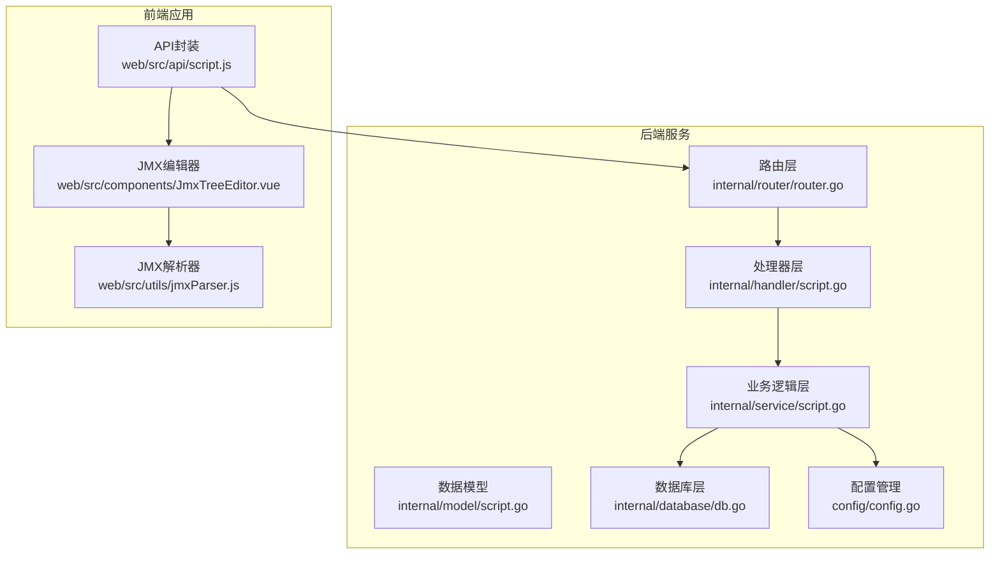
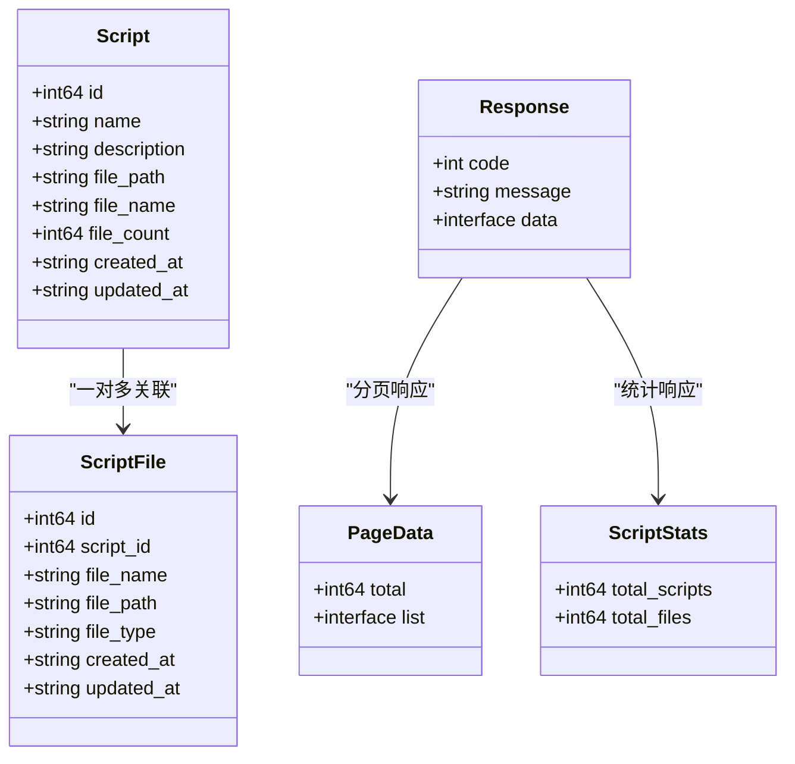
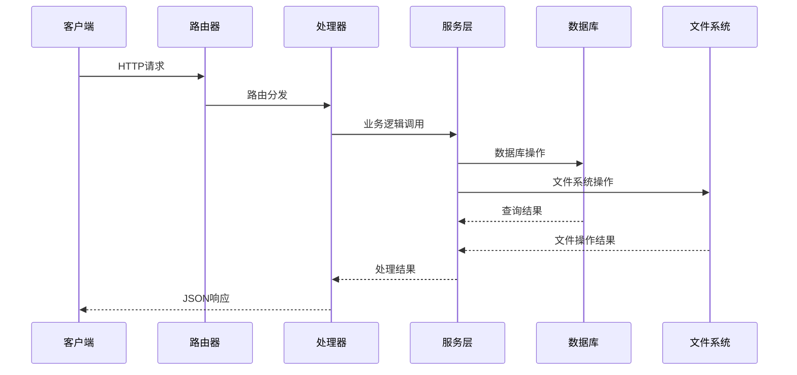
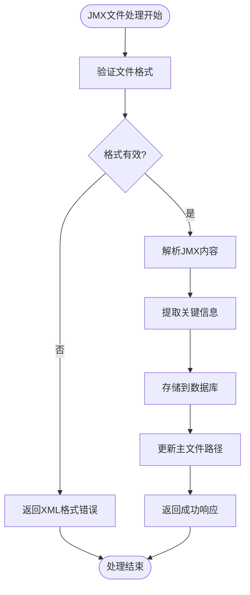
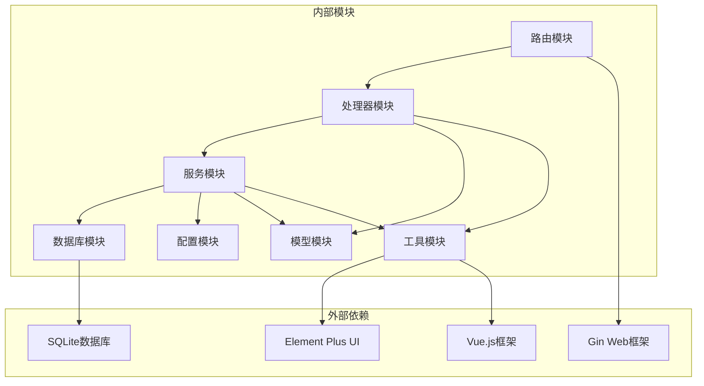

# 脚本管理API

<cite>
**本文档引用的文件**
- [router.go](file://internal/router/router.go)
- [script.go](file://internal/handler/script.go)
- [script.go](file://internal/service/script.go)
- [script.go](file://internal/model/script.go)
- [response.go](file://internal/model/response.go)
- [config.go](file://config/config.go)
- [db.go](file://internal/database/db.go)
- [script.js](file://web/src/api/script.js)
- [JmxTreeEditor.vue](file://web/src/components/JmxTreeEditor.vue)
- [jmxParser.js](file://web/src/utils/jmxParser.js)
</cite>

## 更新摘要
**变更内容**
- 新增脚本统计接口：`/api/scripts/stats` 端点
- 添加 `ScriptStats` 数据模型定义
- 更新路由配置以包含统计接口
- 更新前端API封装以支持统计功能

## 目录
1. [简介](#简介)
2. [项目结构](#项目结构)
3. [核心组件](#核心组件)
4. [架构概览](#架构概览)
5. [详细组件分析](#详细组件分析)
6. [依赖分析](#依赖分析)
7. [性能考虑](#性能考虑)
8. [故障排除指南](#故障排除指南)
9. [结论](#结论)

## 简介

脚本管理API是JMeter管理系统的核心功能模块，负责管理JMeter测试脚本的完整生命周期。该API提供了完整的CRUD操作，支持脚本的创建、查询、更新、删除，以及脚本内容的XML管理、文件上传下载等高级功能。

系统采用Go语言开发，使用Gin框架构建RESTful API，SQLite作为数据存储，前端使用Vue.js配合Element Plus构建用户界面。所有API响应都遵循统一的JSON格式规范，便于前后端交互和错误处理。

**更新** 新增了脚本统计功能，提供系统中脚本和文件的实时统计信息。

## 项目结构

脚本管理功能位于以下关键目录中：



**图表来源**
- [router.go:14-129](file://internal/router/router.go#L14-L129)
- [script.go:1-327](file://internal/handler/script.go#L1-L327)
- [script.go:1-540](file://internal/service/script.go#L1-L540)

**章节来源**
- [router.go:14-129](file://internal/router/router.go#L14-L129)
- [script.go:1-327](file://internal/handler/script.go#L1-L327)
- [script.go:1-540](file://internal/service/script.go#L1-L540)

## 核心组件

### 数据模型

系统使用多个核心数据模型来管理脚本信息，包括新增的统计模型：



**图表来源**
- [script.go:3-23](file://internal/model/script.go#L3-L23)
- [script.go:43-46](file://internal/model/script.go#L43-L46)
- [response.go:3-46](file://internal/model/response.go#L3-L46)

### 数据库架构

系统使用SQLite数据库存储脚本信息，包含四个核心表：

| 表名 | 字段 | 类型 | 描述 |
|------|------|------|------|
| scripts | id | INTEGER PRIMARY KEY AUTOINCREMENT | 脚本主表 |
| scripts | name | TEXT NOT NULL | 脚本名称 |
| scripts | description | TEXT | 脚本描述 |
| scripts | file_path | TEXT NOT NULL | 主JMX文件路径 |
| scripts | created_at | DATETIME | 创建时间 |
| scripts | updated_at | DATETIME | 更新时间 |
| script_files | id | INTEGER PRIMARY KEY AUTOINCREMENT | 脚本文件表 |
| script_files | script_id | INTEGER NOT NULL | 关联脚本ID |
| script_files | file_name | TEXT NOT NULL | 文件名 |
| script_files | file_path | TEXT NOT NULL | 文件完整路径 |
| script_files | file_type | TEXT NOT NULL | 文件类型 |
| script_files | created_at | DATETIME | 创建时间 |
| script_files | updated_at | DATETIME | 更新时间 |
| script_versions | id | INTEGER PRIMARY KEY AUTOINCREMENT | 脚本版本表 |
| script_versions | script_id | INTEGER NOT NULL | 关联脚本ID |
| script_versions | version_number | INTEGER NOT NULL | 版本号 |
| script_versions | content | TEXT | 版本内容 |
| script_versions | content_hash | TEXT | 内容哈希值 |
| script_versions | change_summary | TEXT | 变更摘要 |
| script_versions | created_at | DATETIME | 创建时间 |

**章节来源**
- [db.go:36-64](file://internal/database/db.go#L36-L64)
- [script.go:3-23](file://internal/model/script.go#L3-L23)

## 架构概览

脚本管理API采用经典的三层架构设计：



**图表来源**
- [router.go:24-36](file://internal/router/router.go#L24-L36)
- [script.go:37-50](file://internal/handler/script.go#L37-L50)

## 详细组件分析

### 脚本CRUD操作

#### 获取脚本列表
- **HTTP方法**: GET
- **URL路径**: `/api/scripts`
- **查询参数**:
  - `page`: 页码，默认1
  - `page_size`: 每页条数，默认10
  - `keyword`: 搜索关键词
- **响应格式**: 分页响应，包含总记录数和列表数据
- **状态码**: 200 成功，500 服务器错误

#### 创建新脚本
- **HTTP方法**: POST
- **URL路径**: `/api/scripts`
- **请求类型**: multipart/form-data
- **表单字段**:
  - `name`: 脚本名称（可选）
  - `description`: 脚本描述（可选）
  - `file`: JMX脚本文件（必需）
- **文件限制**: 单文件最大100MB，总大小最大500MB
- **响应格式**: 成功响应或错误信息
- **状态码**: 200 成功，400 参数错误，500 服务器错误

#### 获取单个脚本详情
- **HTTP方法**: GET
- **URL路径**: `/api/scripts/:id`
- **路径参数**: `id` - 脚本ID
- **响应格式**: 包含脚本基本信息和关联文件列表
- **状态码**: 200 成功，404 资源不存在，500 服务器错误

#### 更新脚本信息
- **HTTP方法**: PUT
- **URL路径**: `/api/scripts/:id`
- **路径参数**: `id` - 脚本ID
- **请求体**: JSON格式
  ```json
  {
    "name": "脚本名称",
    "description": "脚本描述"
  }
  ```
- **状态码**: 200 成功，400 参数无效，500 服务器错误

#### 删除脚本
- **HTTP方法**: DELETE
- **URL路径**: `/api/scripts/:id`
- **路径参数**: `id` - 脚本ID
- **副作用**: 同时删除关联的文件记录和磁盘文件
- **状态码**: 200 成功，500 服务器错误

**章节来源**
- [script.go:37-194](file://internal/handler/script.go#L37-L194)
- [script.go:18-83](file://internal/service/script.go#L18-L83)

### 脚本统计接口

#### 获取系统统计信息
- **HTTP方法**: GET
- **URL路径**: `/api/scripts/stats`
- **查询参数**: 无
- **响应格式**: 
  ```json
  {
    "code": 0,
    "message": "success",
    "data": {
      "total_scripts": 150,
      "total_files": 420
    }
  }
  ```
- **状态码**: 200 成功，500 服务器错误

**更新** 新增的统计接口，提供系统中脚本和文件的实时统计信息。

**章节来源**
- [script.go:52-60](file://internal/handler/script.go#L52-L60)
- [script.go:87-99](file://internal/service/script.go#L87-L99)
- [script.go:43-46](file://internal/model/script.go#L43-L46)

### 脚本内容管理API

#### 获取脚本XML内容
- **HTTP方法**: GET
- **URL路径**: `/api/scripts/:id/content`
- **路径参数**: `id` - 脚本ID
- **响应格式**: 
  ```json
  {
    "code": 0,
    "message": "success",
    "data": {
      "content": "<jmeter-test-plan>...</jmeter-test-plan>"
    }
  }
  ```
- **状态码**: 200 成功，404 资源不存在，500 服务器错误

#### 保存脚本内容
- **HTTP方法**: PUT
- **URL路径**: `/api/scripts/:id/content`
- **路径参数**: `id` - 脚本ID
- **请求体**: JSON格式
  ```json
  {
    "content": "<jmeter-test-plan>...</jmeter-test-plan>"
  }
  ```
- **校验**: 自动校验XML格式有效性
- **状态码**: 200 成功，400 XML格式无效，500 服务器错误

**章节来源**
- [script.go:196-238](file://internal/handler/script.go#L196-L238)
- [script.go:229-280](file://internal/service/script.go#L229-L280)

### 文件上传下载功能

#### 上传脚本文件
- **HTTP方法**: POST
- **URL路径**: `/api/scripts/:id/files`
- **路径参数**: `id` - 脚本ID
- **请求类型**: multipart/form-data
- **表单字段**: `files[]` - 多个文件
- **文件类型支持**: .jmx, .csv, .json, .txt, .properties, .xml, .yaml, .jar, 其他
- **响应格式**: 上传成功的文件列表
- **状态码**: 200 成功，400 参数错误，500 服务器错误

#### 删除脚本文件
- **HTTP方法**: DELETE
- **URL路径**: `/api/scripts/:id/files/:fileId`
- **路径参数**:
  - `id` - 脚本ID
  - `fileId` - 文件ID或文件名
- **支持方式**: 支持按ID或文件名删除
- **状态码**: 200 成功，404 资源不存在，500 服务器错误

#### 下载脚本主文件
- **HTTP方法**: GET
- **URL路径**: `/api/scripts/:id/download`
- **路径参数**: `id` - 脚本ID
- **响应**: 直接下载文件流
- **状态码**: 200 成功，404 资源不存在

**章节来源**
- [script.go:240-326](file://internal/handler/script.go#L240-L326)
- [script.go:299-489](file://internal/service/script.go#L299-L489)

### JMX文件处理特殊要求

系统提供了完整的JMX文件处理能力：



**图表来源**
- [script.go:282-297](file://internal/service/script.go#L282-L297)
- [script.go:350-356](file://internal/service/script.go#L350-L356)

**章节来源**
- [script.go:282-297](file://internal/service/script.go#L282-L297)
- [jmxParser.js:1-800](file://web/src/utils/jmxParser.js#L1-L800)

## 依赖分析

### 组件耦合关系



**图表来源**
- [router.go:3-12](file://internal/router/router.go#L3-L12)
- [script.go:3-14](file://internal/handler/script.go#L3-L14)

### 错误处理机制

系统实现了统一的错误处理机制：

| 错误类型 | HTTP状态码 | 错误码 | 描述 |
|----------|------------|--------|------|
| 参数错误 | 400 | -1 | 请求参数无效或缺失 |
| 资源不存在 | 404 | -1 | 脚本或文件不存在 |
| 服务器错误 | 500 | -1 | 服务器内部错误 |
| 成功 | 200 | 0 | 操作成功 |

**章节来源**
- [response.go:14-46](file://internal/model/response.go#L14-L46)
- [script.go:37-194](file://internal/handler/script.go#L37-L194)

## 性能考虑

### 文件大小限制
- 单文件大小限制: 100MB
- 总文件大小限制: 500MB
- 防止内存溢出和拒绝服务攻击

### 数据库优化
- 使用SQLite轻量级数据库
- 合理的索引设计
- 连接池管理

### 前端性能
- JMX文件解析采用异步处理
- 文件上传进度显示
- 响应式UI设计

## 故障排除指南

### 常见问题及解决方案

#### 1. 文件上传失败
**症状**: 上传JMX文件时报错
**可能原因**:
- 文件大小超过限制
- 文件格式不正确
- 权限问题

**解决方法**:
- 检查文件大小是否超过100MB限制
- 确认文件扩展名为.jmx
- 验证上传目录权限

#### 2. JMX文件解析错误
**症状**: 保存脚本内容时报XML格式错误
**解决方法**:
- 使用合法的JMX格式
- 检查XML标签闭合
- 验证JMeter版本兼容性

#### 3. 数据库连接问题
**症状**: 查询脚本列表失败
**解决方法**:
- 检查数据库文件完整性
- 验证数据库连接权限
- 重启服务进程

#### 4. 统计接口异常
**症状**: 获取统计信息失败
**可能原因**:
- 数据库查询错误
- 权限不足
- 数据库连接问题

**解决方法**:
- 检查数据库连接状态
- 验证统计查询权限
- 查看服务器日志获取详细错误信息

**章节来源**
- [script.go:16-20](file://internal/handler/script.go#L16-L20)
- [script.go:282-297](file://internal/service/script.go#L282-L297)

## 结论

脚本管理API提供了完整的JMeter脚本生命周期管理功能，具有以下特点：

1. **完整的CRUD操作**: 支持脚本的基本增删改查操作
2. **灵活的文件管理**: 支持多种文件类型的上传和管理
3. **强大的JMX处理**: 提供XML格式校验和内容管理
4. **统一的错误处理**: 标准化的响应格式和错误码
5. **安全的文件处理**: 防止路径穿越攻击和文件注入
6. **实时统计监控**: 新增的统计接口提供系统运行状态监控

系统采用模块化设计，各层职责清晰，易于维护和扩展。通过合理的性能优化和错误处理机制，确保了系统的稳定性和可靠性。

**更新** 新增的统计功能为系统监控和运维提供了重要支撑，帮助管理员实时了解脚本和文件的使用情况。