# Agent Server 组件

<cite>
**本文档引用的文件**
- [cmd/agent/main.go](file://cmd/agent/main.go)
- [internal/agent/server.go](file://internal/agent/server.go)
- [internal/service/agent_client.go](file://internal/service/agent_client.go)
- [internal/service/slave.go](file://internal/service/slave.go)
- [internal/handler/slave.go](file://internal/handler/slave.go)
- [internal/model/slave.go](file://internal/model/slave.go)
- [internal/model/response.go](file://internal/model/response.go)
- [internal/router/router.go](file://internal/router/router.go)
- [config/config.go](file://config/config.go)
- [config.yaml](file://config.yaml)
- [go.mod](file://go.mod)
- [README.md](file://README.md)
</cite>

## 目录
1. [简介](#简介)
2. [项目结构](#项目结构)
3. [核心组件](#核心组件)
4. [架构概览](#架构概览)
5. [详细组件分析](#详细组件分析)
6. [依赖关系分析](#依赖关系分析)
7. [性能考虑](#性能考虑)
8. [故障排除指南](#故障排除指南)
9. [结论](#结论)

## 简介

Agent Server 是 JMeter Admin 分布式压测管理平台中的轻量级辅助服务组件。它运行在每台 JMeter Slave 节点上，为 Master 提供文件分发、系统监控和健康检查等核心功能。该组件采用 Go 语言开发，基于标准库 HTTP 服务器实现，具有零依赖、易部署的特点。

Agent Server 的主要职责包括：
- **文件管理**：接收和管理 CSV 数据文件的上传、删除和批量清理
- **系统监控**：实时采集 CPU、内存、磁盘和网络等系统资源信息
- **健康检查**：提供服务状态检查和连通性诊断功能
- **环境报告**：收集 JMeter 环境配置和插件信息
- **回调检测**：验证外部回调地址的可达性和响应情况

## 项目结构

JMeter Admin 项目采用模块化的组织结构，Agent Server 组件位于独立的模块中：

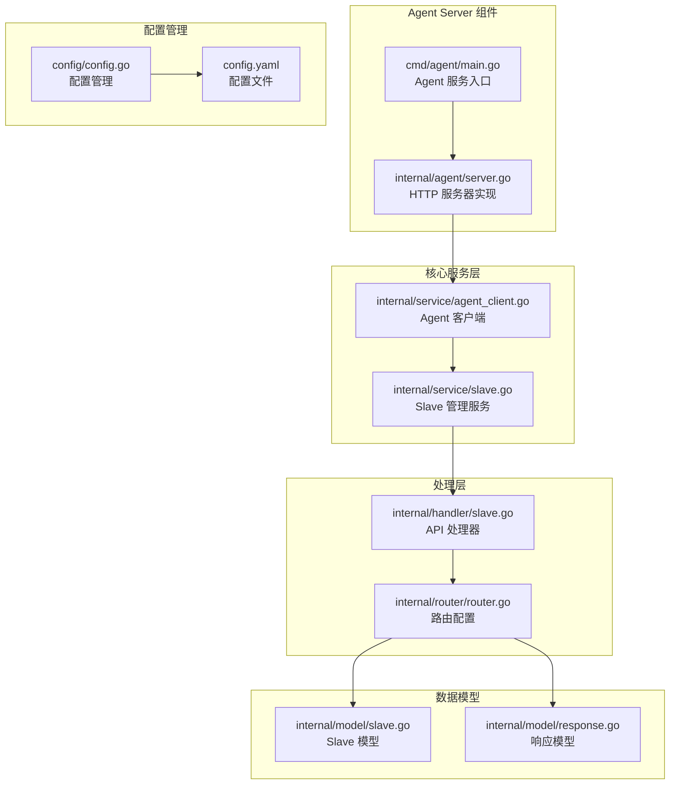

**图表来源**
- [cmd/agent/main.go:1-52](file://cmd/agent/main.go#L1-L52)
- [internal/agent/server.go:1-616](file://internal/agent/server.go#L1-L616)

**章节来源**
- [cmd/agent/main.go:1-52](file://cmd/agent/main.go#L1-L52)
- [internal/agent/server.go:1-616](file://internal/agent/server.go#L1-L616)
- [README.md:144-178](file://README.md#L144-L178)

## 核心组件

### Agent 服务器核心架构

Agent Server 采用简洁的三层架构设计：

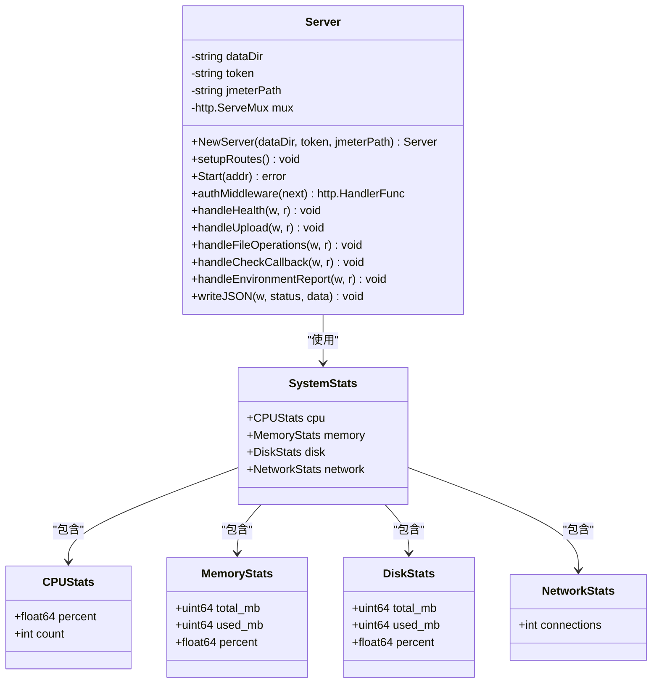

**图表来源**
- [internal/agent/server.go:94-122](file://internal/agent/server.go#L94-L122)
- [internal/agent/server.go:30-56](file://internal/agent/server.go#L30-L56)

### Agent 客户端通信层

Agent Server 通过专用的客户端与 Master 进行通信：

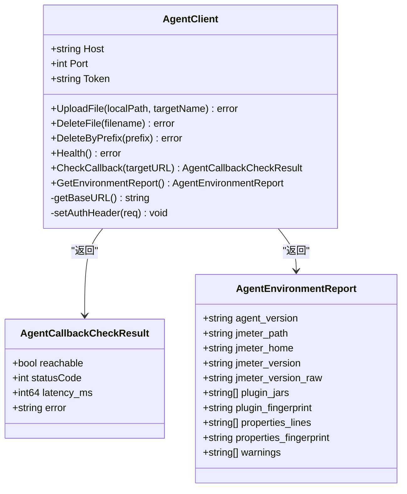

**图表来源**
- [internal/service/agent_client.go:14-48](file://internal/service/agent_client.go#L14-L48)
- [internal/service/agent_client.go:21-39](file://internal/service/agent_client.go#L21-L39)

**章节来源**
- [internal/agent/server.go:94-122](file://internal/agent/server.go#L94-L122)
- [internal/service/agent_client.go:14-48](file://internal/service/agent_client.go#L14-L48)

## 架构概览

### 整体系统架构

Agent Server 在 JMeter Admin 生态系统中扮演着关键的基础设施角色：

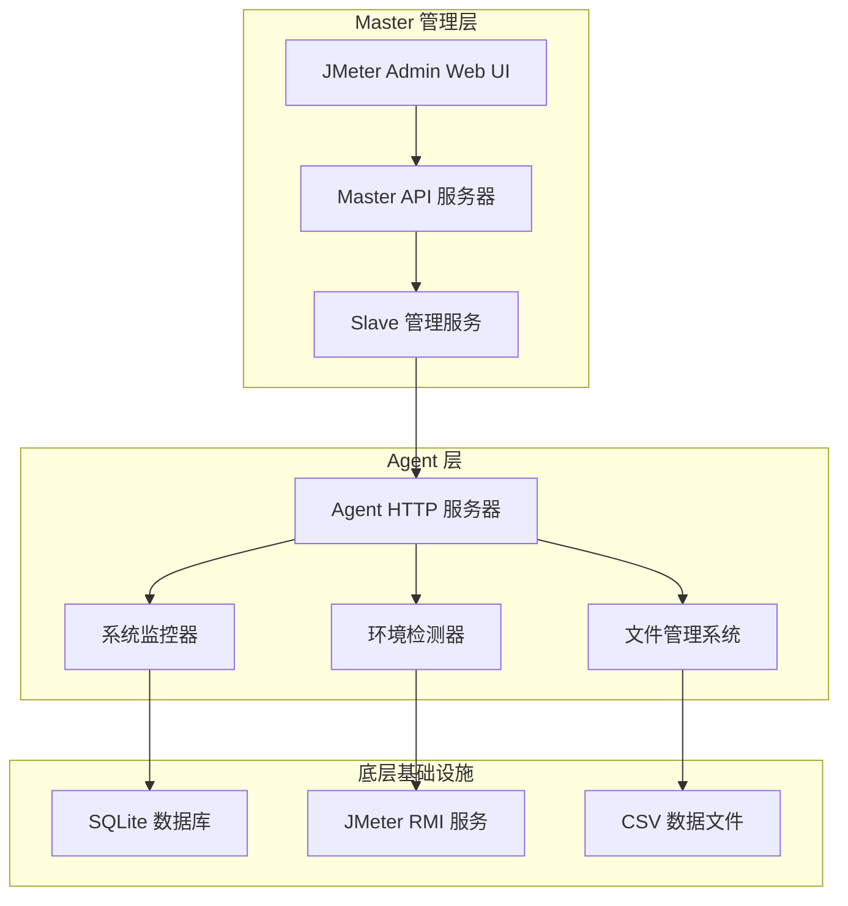

**图表来源**
- [README.md:316-421](file://README.md#L316-L421)

### Agent 服务生命周期

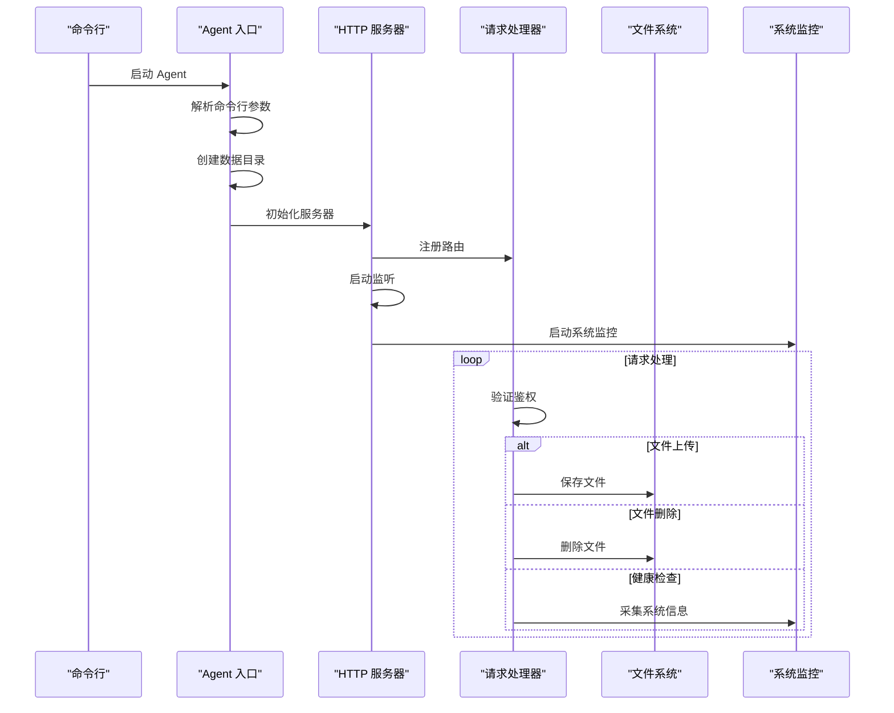

**图表来源**
- [cmd/agent/main.go:14-51](file://cmd/agent/main.go#L14-L51)
- [internal/agent/server.go:120-135](file://internal/agent/server.go#L120-L135)

**章节来源**
- [README.md:316-421](file://README.md#L316-L421)
- [cmd/agent/main.go:14-51](file://cmd/agent/main.go#L14-L51)

## 详细组件分析

### HTTP 服务器实现

Agent Server 的 HTTP 服务器基于 Go 标准库实现，提供了简洁高效的网络服务：

#### 路由配置

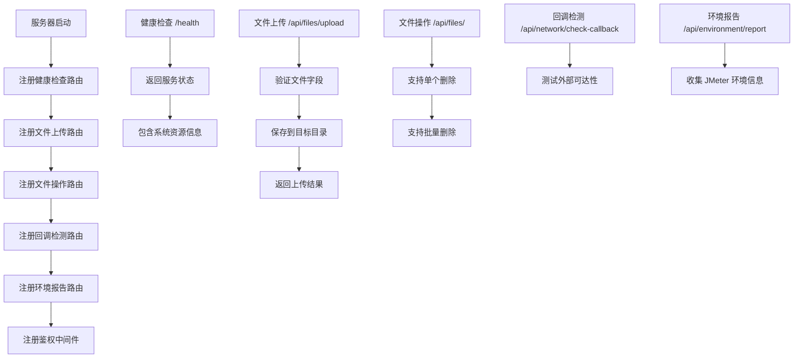

**图表来源**
- [internal/agent/server.go:112-118](file://internal/agent/server.go#L112-L118)
- [internal/agent/server.go:434-485](file://internal/agent/server.go#L434-L485)

#### 鉴权机制

Agent Server 支持可选的 Bearer Token 鉴权机制：

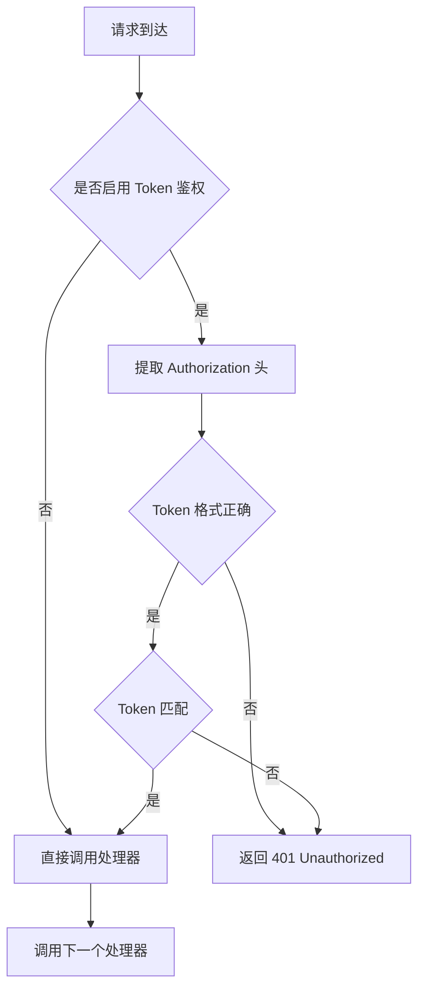

**图表来源**
- [internal/agent/server.go:124-135](file://internal/agent/server.go#L124-L135)

**章节来源**
- [internal/agent/server.go:112-135](file://internal/agent/server.go#L112-L135)
- [internal/agent/server.go:434-485](file://internal/agent/server.go#L434-L485)

### 文件管理系统

Agent Server 提供完整的文件管理功能，专门用于处理 CSV 数据文件：

#### 文件上传流程

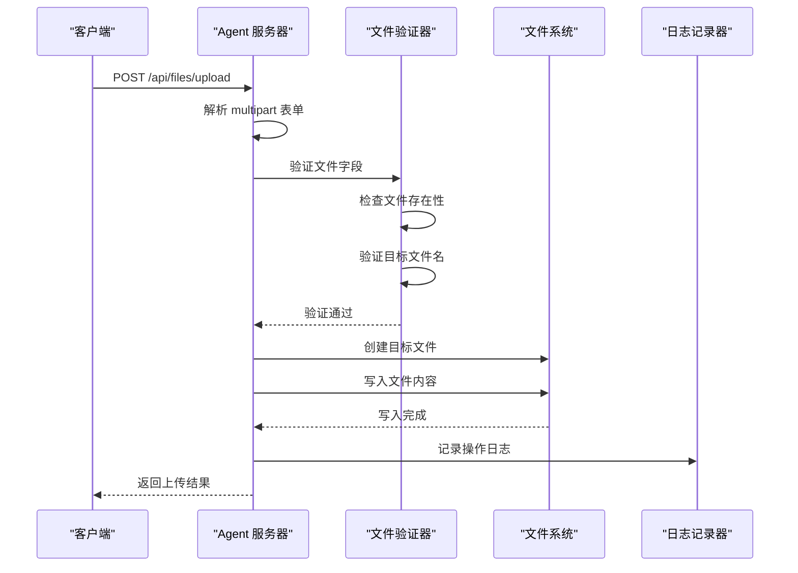

**图表来源**
- [internal/agent/server.go:434-485](file://internal/agent/server.go#L434-L485)

#### 文件删除策略

Agent Server 支持多种文件删除方式：

| 删除方式 | 路径 | 功能描述 |
|---------|------|----------|
| 单个删除 | `DELETE /api/files/{filename}` | 删除指定文件 |
| 批量删除 | `DELETE /api/files/batch` | 支持按前缀或文件列表删除 |
| 前缀删除 | `DELETE /api/files/batch` | 删除匹配指定前缀的所有文件 |

**章节来源**
- [internal/agent/server.go:487-569](file://internal/agent/server.go#L487-L569)

### 系统监控组件

Agent Server 内置了强大的系统监控功能，能够实时采集关键系统指标：

#### 系统资源采集

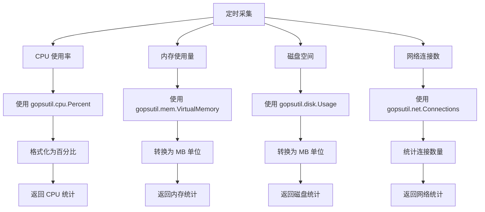

**图表来源**
- [internal/agent/server.go:58-92](file://internal/agent/server.go#L58-L92)

#### 性能优化策略

系统监控采用了多项性能优化措施：

- **快速 CPU 采样**：使用 500ms 超时进行 CPU 百分比采样
- **条件性资源采集**：仅在 gopsutil 库可用时才进行相应资源采集
- **精确度控制**：将百分比数据四舍五入到 0.1% 精度
- **内存效率**：使用固定大小的缓冲区避免内存泄漏

**章节来源**
- [internal/agent/server.go:58-92](file://internal/agent/server.go#L58-L92)

### 环境检测功能

Agent Server 能够检测和报告 JMeter 环境配置信息：

#### 环境信息收集

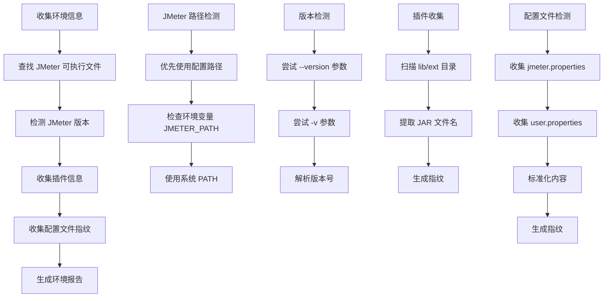

**图表来源**
- [internal/agent/server.go:375-423](file://internal/agent/server.go#L375-L423)

**章节来源**
- [internal/agent/server.go:375-423](file://internal/agent/server.go#L375-L423)

### 回调检测服务

Agent Server 提供外部回调地址的可达性检测功能：

#### 回调检测流程

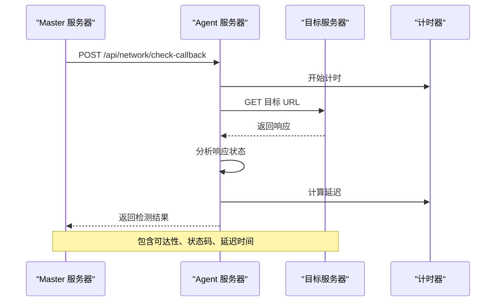

**图表来源**
- [internal/agent/server.go:177-218](file://internal/agent/server.go#L177-L218)

**章节来源**
- [internal/agent/server.go:177-218](file://internal/agent/server.go#L177-L218)

## 依赖关系分析

### 外部依赖管理

Agent Server 的依赖关系相对简单，主要依赖于标准库和第三方库：

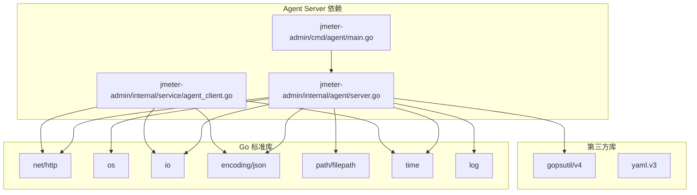

**图表来源**
- [go.mod:5-10](file://go.mod#L5-L10)
- [internal/agent/server.go:3-24](file://internal/agent/server.go#L3-L24)

### 内部模块依赖

Agent Server 组件内部的模块依赖关系清晰明确：

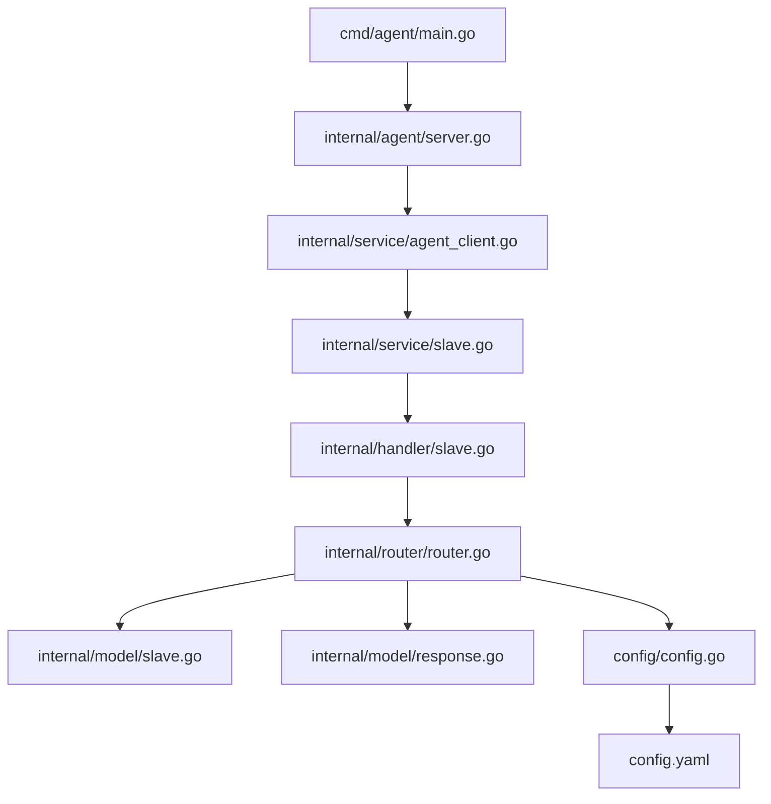

**图表来源**
- [cmd/agent/main.go:11](file://cmd/agent/main.go#L11)
- [internal/agent/server.go:101-110](file://internal/agent/server.go#L101-L110)

**章节来源**
- [go.mod:5-10](file://go.mod#L5-L10)
- [cmd/agent/main.go:11](file://cmd/agent/main.go#L11)

## 性能考虑

### 系统资源优化

Agent Server 在设计时充分考虑了性能优化：

#### 并发处理
- **请求处理**：基于 Go 标准库的 HTTP 服务器，天然支持并发请求处理
- **系统监控**：使用 goroutine 定期采集系统资源，不影响主请求处理
- **文件操作**：采用流式处理，避免大文件内存占用

#### 内存管理
- **缓冲区管理**：合理控制 multipart 表单的内存使用
- **字符串处理**：使用 strings.Builder 减少字符串拼接开销
- **资源清理**：及时关闭文件句柄和网络连接

#### 网络优化
- **超时控制**：为外部请求设置合理的超时时间
- **连接复用**：HTTP 客户端支持连接池复用
- **错误处理**：优雅处理网络异常和超时情况

### 配置优化建议

| 配置项 | 建议值 | 说明 |
|--------|--------|------|
| 监听端口 | 8089 | 默认端口，避免与其他服务冲突 |
| 数据目录 | /opt/jmeter/csv-data | 使用独立的高性能存储 |
| Token 鉴权 | 启用 | 提升安全性 |
| JMeter 路径 | 绝对路径 | 避免 PATH 查找开销 |

## 故障排除指南

### 常见问题诊断

#### 服务启动问题

**问题现象**：Agent 无法启动或启动后立即退出

**可能原因**：
1. 端口被占用
2. 数据目录权限不足
3. 配置文件格式错误

**解决方法**：
```bash
# 检查端口占用
netstat -tlnp | grep :8089

# 检查数据目录权限
ls -la /opt/jmeter/csv-data

# 验证配置文件
cat config.yaml
```

#### 文件上传失败

**问题现象**：文件上传返回错误

**可能原因**：
1. 磁盘空间不足
2. 文件名包含非法字符
3. 网络连接中断

**解决方法**：
```bash
# 检查磁盘空间
df -h /opt/jmeter/csv-data

# 验证文件名合法性
echo "data.csv" | grep -E '^[^./][^/]*$'

# 检查网络连通性
ping localhost
```

#### 系统监控异常

**问题现象**：系统资源信息显示异常

**可能原因**：
1. gopsutil 库缺失
2. 权限不足
3. 系统 API 调用失败

**解决方法**：
```bash
# 检查 gopsutil 库
go mod vendor

# 检查系统权限
sudo lsof -i :8089

# 查看详细错误日志
tail -f agent.log
```

### 性能监控

#### 监控指标

Agent Server 提供以下关键性能指标：

| 指标类型 | 监控项 | 正常范围 | 异常阈值 |
|----------|--------|----------|----------|
| CPU 使用率 | 百分比 | 0-100% | > 90% |
| 内存使用 | MB | 0-总内存 | > 95% |
| 磁盘空间 | MB | 0-总容量 | < 100MB |
| 网络连接 | 个数 | 0-系统上限 | > 1000 |
| 响应时间 | ms | 0-1000 | > 5000 |

#### 性能调优

**高并发场景优化**：
1. 增加系统文件描述符限制
2. 调整 TCP 连接参数
3. 使用 SSD 存储提升 I/O 性能

**内存优化**：
1. 控制文件缓存大小
2. 及时清理临时文件
3. 监控内存使用趋势

**章节来源**
- [internal/agent/server.go:58-92](file://internal/agent/server.go#L58-L92)
- [internal/agent/server.go:434-485](file://internal/agent/server.go#L434-L485)

## 结论

Agent Server 组件作为 JMeter Admin 分布式压测管理平台的重要基础设施，展现了优秀的工程设计和实现质量。其特点包括：

### 设计优势
- **简洁高效**：基于标准库实现，代码简洁易维护
- **功能完整**：涵盖文件管理、系统监控、环境检测等核心功能
- **安全可靠**：支持可选的鉴权机制和输入验证
- **易于部署**：零依赖设计，支持单文件部署

### 技术特色
- **实时监控**：内置系统资源采集和报告功能
- **环境感知**：智能检测 JMeter 环境配置
- **网络诊断**：提供外部回调地址可达性检测
- **文件管理**：完整的文件上传、删除和批量处理功能

### 应用价值
Agent Server 为 JMeter 分布式压测提供了可靠的基础设施支持，通过其轻量级的设计和强大的功能，有效降低了分布式压测的运维复杂度，提升了系统的稳定性和可维护性。

在未来的发展中，Agent Server 可以进一步扩展支持更多的监控指标、增强安全特性，并提供更丰富的配置选项，以满足不同规模和场景下的分布式压测需求。