# 执行详情视图

<cite>
**本文档引用的文件**
- [ExecutionDetail.vue](file://web/src/views/ExecutionDetail.vue)
- [execution.js](file://web/src/api/execution.js)
- [execution.go](file://internal/handler/execution.go)
- [execution.go](file://internal/service/execution.go)
- [execution_diagnostics.go](file://internal/service/execution_diagnostics.go)
- [execution_error_index.go](file://internal/service/execution_error_index.go)
- [execution_plan.go](file://internal/service/execution_plan.go)
- [jmx_csv.go](file://internal/service/jmx_csv.go)
- [execution.js](file://web/src/router/index.js)
- [MetricTrendChart.vue](file://web/src/components/MetricTrendChart.vue)
- [datetime.js](file://web/src/utils/datetime.js)
</cite>

## 目录
1. [项目概述](#项目概述)
2. [项目结构](#项目结构)
3. [核心组件](#核心组件)
4. [架构概览](#架构概览)
5. [详细组件分析](#详细组件分析)
6. [依赖关系分析](#依赖关系分析)
7. [性能考虑](#性能考虑)
8. [故障排除指南](#故障排除指南)
9. [结论](#结论)

## 项目概述

执行详情视图是 JMeter Admin 系统中的核心功能模块，为用户提供全面的测试执行监控和分析能力。该视图为用户提供了从多个维度监控测试执行状态的能力，包括实时指标、错误分析、节点监控、报告生成等。

该视图采用现代化的前端技术栈构建，结合后端服务实现了完整的测试执行生命周期管理。用户可以通过直观的界面实时监控测试执行状态，分析测试结果，并进行相应的操作。

## 项目结构

项目采用前后端分离的架构设计，主要分为以下层次：

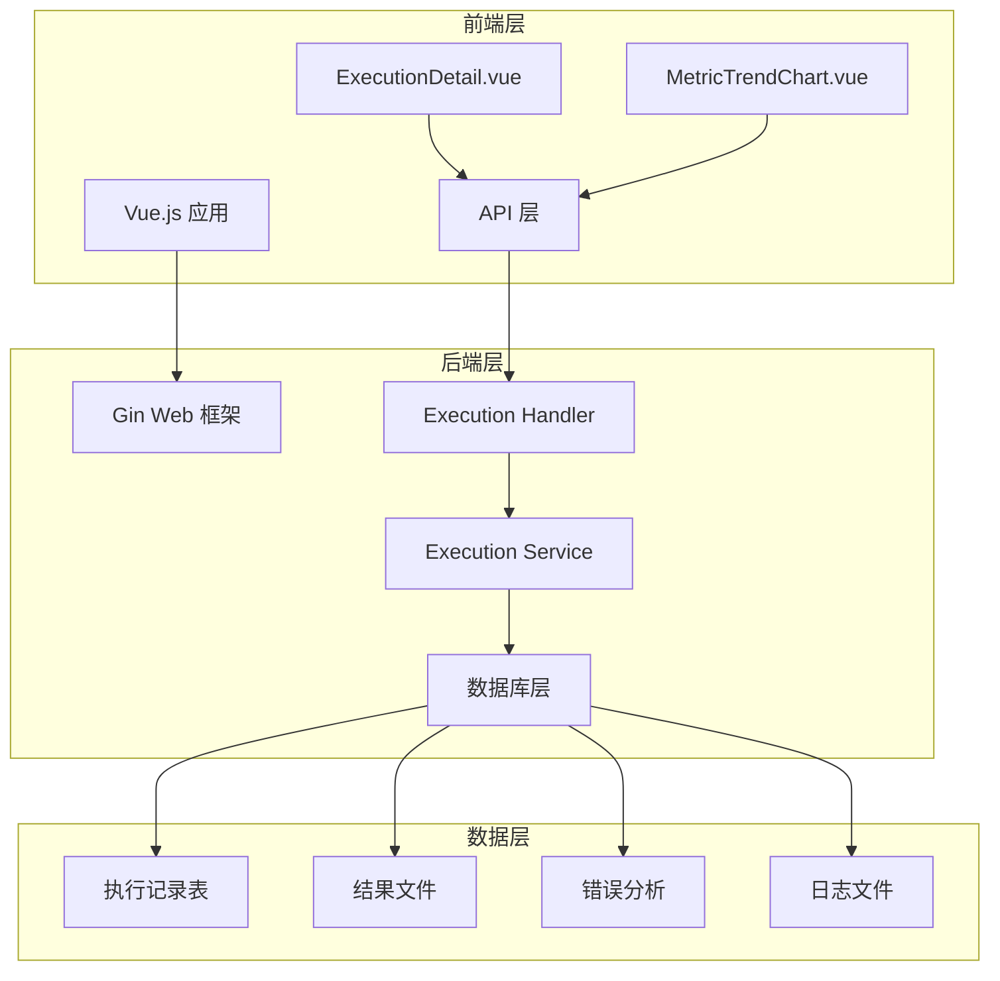

**图表来源**
- [ExecutionDetail.vue:1-50](file://web/src/views/ExecutionDetail.vue#L1-50)
- [execution.go:1-50](file://internal/handler/execution.go#L1-50)
- [execution.go:1-50](file://internal/service/execution.go#L1-50)

**章节来源**
- [ExecutionDetail.vue:1-100](file://web/src/views/ExecutionDetail.vue#L1-100)
- [execution.go:1-50](file://internal/handler/execution.go#L1-50)
- [execution.go:1-50](file://internal/service/execution.go#L1-50)

## 核心组件

执行详情视图由多个相互协作的组件构成，每个组件负责特定的功能领域：

### 主要组件架构

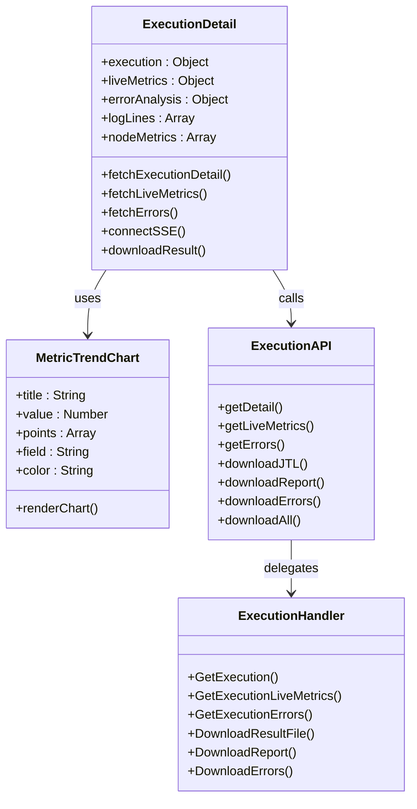

**图表来源**
- [ExecutionDetail.vue:1096-1150](file://web/src/views/ExecutionDetail.vue#L1096-1150)
- [execution.js:1-93](file://web/src/api/execution.js#L1-93)
- [execution.go:123-174](file://internal/handler/execution.go#L123-174)

### 关键功能特性

1. **实时监控**: 通过 SSE 流式传输获取实时执行状态
2. **多维度分析**: 提供吞吐量、延迟、错误率等关键指标
3. **错误深度分析**: 支持详细的错误记录和响应分析
4. **节点监控**: 实时监控分布式执行节点的系统状态
5. **报告生成**: 支持 HTML 报告的生成和下载
6. **文件管理**: 提供多种格式的结果文件下载

**章节来源**
- [ExecutionDetail.vue:1200-1600](file://web/src/views/ExecutionDetail.vue#L1200-1600)
- [execution.go:141-174](file://internal/handler/execution.go#L141-174)

## 架构概览

执行详情视图采用了分层架构设计，确保了系统的可维护性和扩展性：

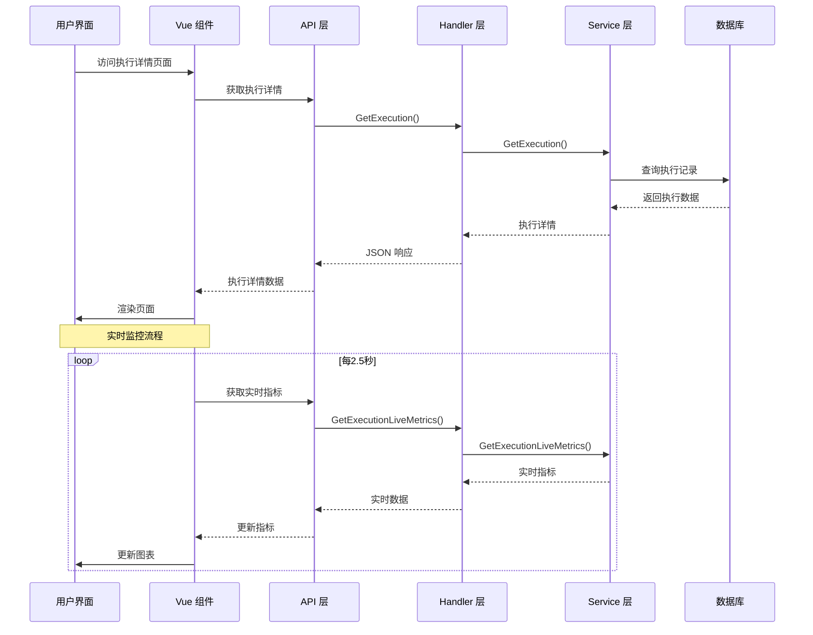

**图表来源**
- [ExecutionDetail.vue:2574-2595](file://web/src/views/ExecutionDetail.vue#L2574-2595)
- [execution.go:141-157](file://internal/handler/execution.go#L141-157)
- [execution.go:1-50](file://internal/service/execution.go#L1-50)

### 数据流架构

系统采用异步数据流设计，确保了良好的用户体验：

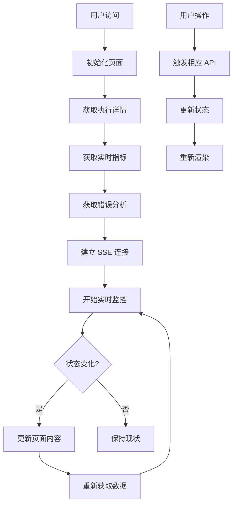

**图表来源**
- [ExecutionDetail.vue:2608-2662](file://web/src/views/ExecutionDetail.vue#L2608-2662)
- [execution.go:141-174](file://internal/handler/execution.go#L141-174)

**章节来源**
- [ExecutionDetail.vue:2574-2662](file://web/src/views/ExecutionDetail.vue#L2574-2662)
- [execution.go:141-174](file://internal/handler/execution.go#L141-174)

## 详细组件分析

### 执行详情组件 (ExecutionDetail)

执行详情组件是整个视图的核心，负责协调各个子组件的工作：

#### 核心功能实现

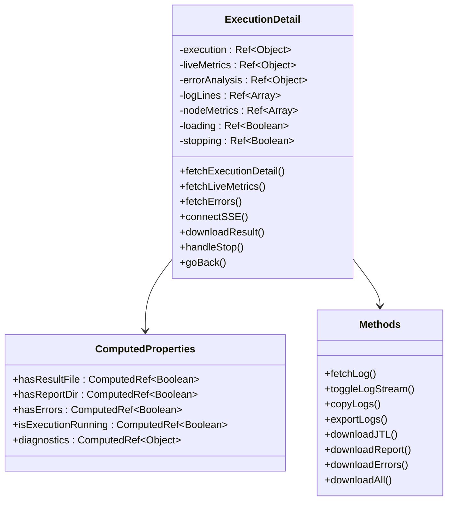

**图表来源**
- [ExecutionDetail.vue:1126-1180](file://web/src/views/ExecutionDetail.vue#L1126-1180)
- [ExecutionDetail.vue:1226-1242](file://web/src/views/ExecutionDetail.vue#L1226-1242)

#### 生命周期管理

组件采用 Vue 3 Composition API 设计，实现了高效的生命周期管理：

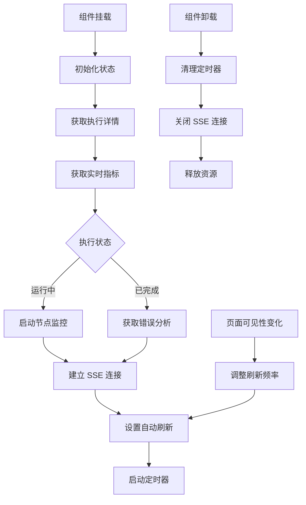

**图表来源**
- [ExecutionDetail.vue:2608-2662](file://web/src/views/ExecutionDetail.vue#L2608-2662)
- [ExecutionDetail.vue:2500-2510](file://web/src/views/ExecutionDetail.vue#L2500-2510)

**章节来源**
- [ExecutionDetail.vue:1096-1150](file://web/src/views/ExecutionDetail.vue#L1096-1150)
- [ExecutionDetail.vue:2608-2662](file://web/src/views/ExecutionDetail.vue#L2608-2662)

### 实时指标组件 (MetricTrendChart)

实时指标组件提供了可视化的时间序列数据展示：

#### 组件架构设计

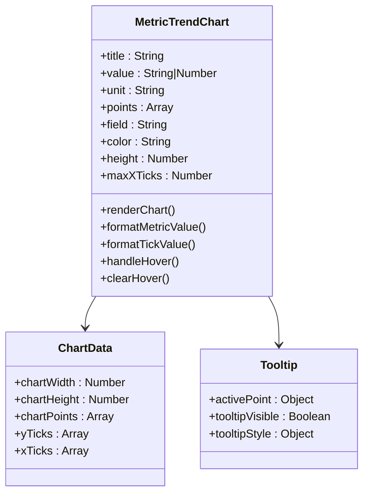

**图表来源**
- [MetricTrendChart.vue:142-162](file://web/src/components/MetricTrendChart.vue#L142-162)
- [MetricTrendChart.vue:177-188](file://web/src/components/MetricTrendChart.vue#L177-188)

#### 图表渲染机制

组件采用 SVG 渲染方式，支持高性能的实时更新：

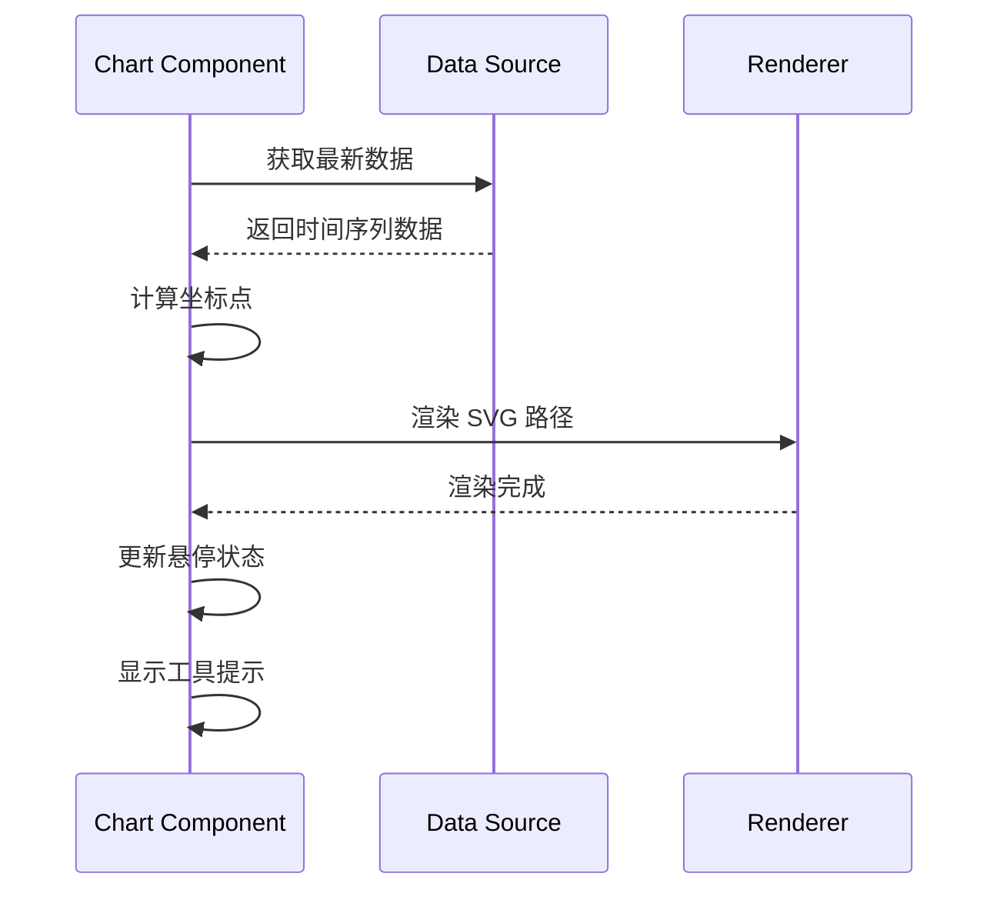

**图表来源**
- [MetricTrendChart.vue:212-227](file://web/src/components/MetricTrendChart.vue#L212-227)
- [MetricTrendChart.vue:326-340](file://web/src/components/MetricTrendChart.vue#L326-340)

**章节来源**
- [MetricTrendChart.vue:1-526](file://web/src/components/MetricTrendChart.vue#L1-526)

### 错误分析组件

错误分析组件提供了详细的错误诊断和分析功能：

#### 错误数据结构

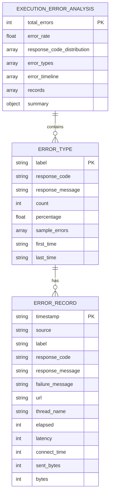

**图表来源**
- [ExecutionDetail.vue:1669-1680](file://web/src/views/ExecutionDetail.vue#L1669-1680)
- [ExecutionDetail.vue:1740-1758](file://web/src/views/ExecutionDetail.vue#L1740-1758)

#### 错误分析流程

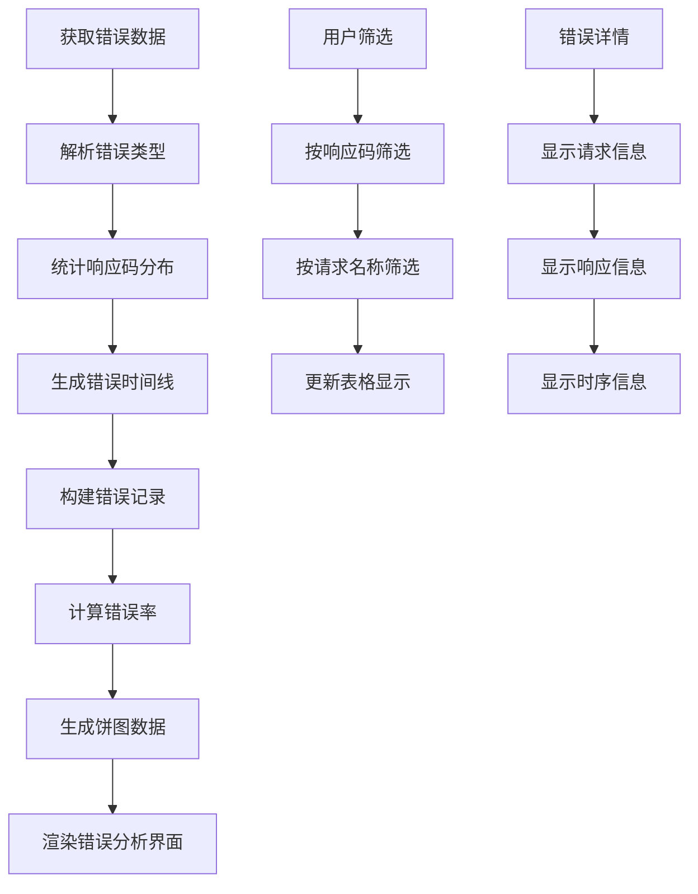

**图表来源**
- [ExecutionDetail.vue:2100-2136](file://web/src/views/ExecutionDetail.vue#L2100-2136)
- [ExecutionDetail.vue:1669-1703](file://web/src/views/ExecutionDetail.vue#L1669-1703)

**章节来源**
- [ExecutionDetail.vue:1669-1780](file://web/src/views/ExecutionDetail.vue#L1669-1780)

### 日志监控组件

日志监控组件实现了高效的实时日志流式传输：

#### SSE 连接管理

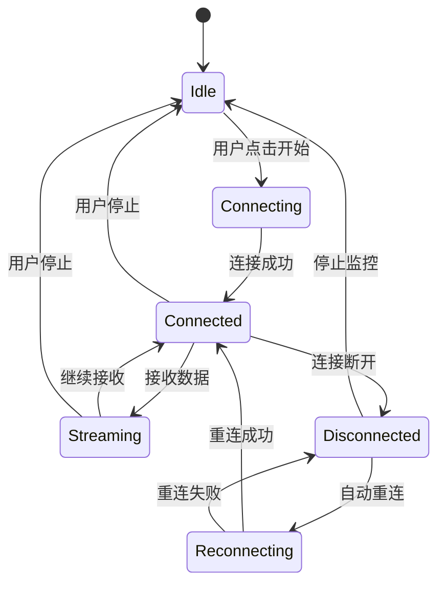

**图表来源**
- [ExecutionDetail.vue:2416-2457](file://web/src/views/ExecutionDetail.vue#L2416-2457)
- [ExecutionDetail.vue:2459-2480](file://web/src/views/ExecutionDetail.vue#L2459-2480)

#### 日志处理机制

组件实现了智能的日志处理和显示机制：

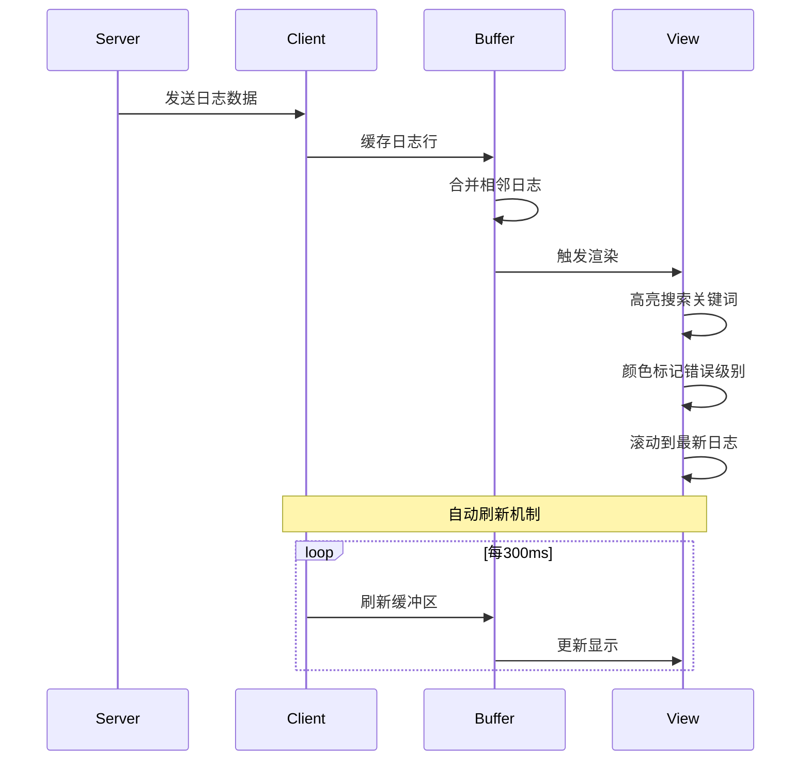

**图表来源**
- [ExecutionDetail.vue:2296-2311](file://web/src/views/ExecutionDetail.vue#L2296-2311)
- [ExecutionDetail.vue:2348-2373](file://web/src/views/ExecutionDetail.vue#L2348-2373)

**章节来源**
- [ExecutionDetail.vue:2313-2480](file://web/src/views/ExecutionDetail.vue#L2313-2480)

## 依赖关系分析

执行详情视图的依赖关系体现了清晰的分层架构：

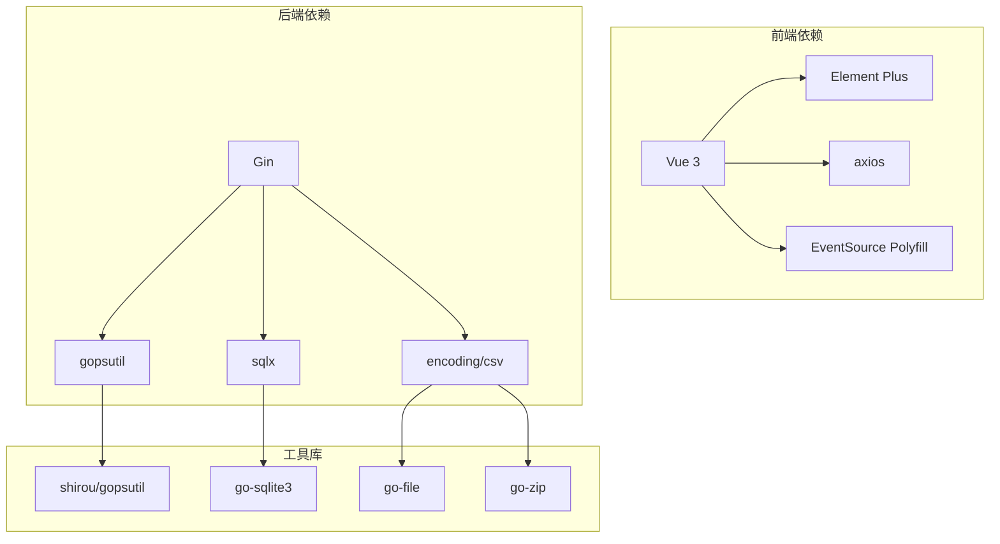

**图表来源**
- [execution.go:20-30](file://internal/handler/execution.go#L20-30)
- [execution.go:3-32](file://internal/service/execution.go#L3-32)

### 关键依赖关系

系统的关键依赖关系确保了功能的完整性和性能：

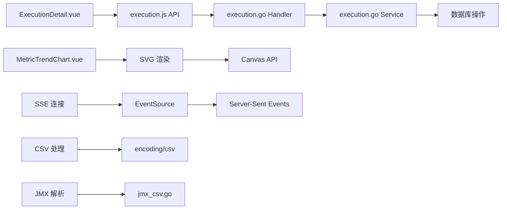

**图表来源**
- [execution.js:1-93](file://web/src/api/execution.js#L1-93)
- [execution.go:1-50](file://internal/handler/execution.go#L1-50)
- [jmx_csv.go:1-25](file://internal/service/jmx_csv.go#L1-25)

**章节来源**
- [execution.js:1-93](file://web/src/api/execution.js#L1-93)
- [execution.go:1-50](file://internal/handler/execution.go#L1-50)

## 性能考虑

执行详情视图在设计时充分考虑了性能优化：

### 实时数据处理优化

1. **增量更新**: 采用增量更新策略，只更新发生变化的数据
2. **数据缓存**: 实现多级缓存机制，减少重复计算
3. **虚拟滚动**: 对大量日志和错误记录采用虚拟滚动
4. **防抖处理**: 对频繁的用户操作进行防抖处理

### 内存管理

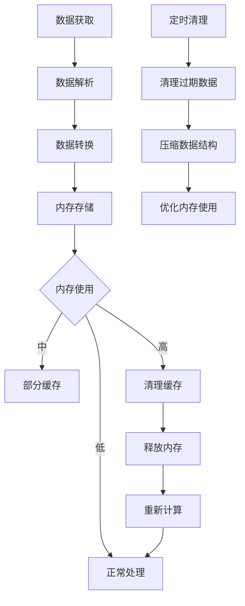

**图表来源**
- [ExecutionDetail.vue:2277-2285](file://web/src/views/ExecutionDetail.vue#L2277-2285)
- [ExecutionDetail.vue:2574-2595](file://web/src/views/ExecutionDetail.vue#L2574-2595)

### 网络优化

1. **连接池管理**: 合理管理 API 请求连接
2. **批量请求**: 对相关数据采用批量获取
3. **缓存策略**: 实现智能缓存机制
4. **错误重试**: 实现指数退避重试机制

## 故障排除指南

### 常见问题及解决方案

#### 实时监控问题

| 问题描述 | 可能原因 | 解决方案 |
|---------|---------|---------|
| 实时指标不更新 | SSE 连接断开 | 检查网络连接，重试连接 |
| 日志流中断 | 服务器重启 | 自动重连机制会恢复连接 |
| 数据延迟 | 网络延迟 | 调整刷新频率，检查服务器性能 |

#### 错误分析问题

| 问题描述 | 可能原因 | 解决方案 |
|---------|---------|---------|
| 错误记录为空 | 执行成功 | 检查执行状态，等待错误产生 |
| 错误类型不完整 | 数据截断 | 调整过滤条件，扩大显示范围 |
| 错误详情缺失 | 字段未捕获 | 检查 JMeter 配置，重新执行 |

#### 文件下载问题

| 问题描述 | 可能原因 | 解决方案 |
|---------|---------|---------|
| JTL 文件下载失败 | 文件不存在 | 检查执行状态，确认结果文件生成 |
| 报告下载失败 | 报告未生成 | 等待报告生成完成，重新下载 |
| 错误文件下载失败 | 无错误记录 | 检查执行结果，确认存在错误数据 |

**章节来源**
- [ExecutionDetail.vue:2443-2454](file://web/src/views/ExecutionDetail.vue#L2443-2454)
- [ExecutionDetail.vue:2541-2571](file://web/src/views/ExecutionDetail.vue#L2541-2571)

### 调试技巧

1. **浏览器开发者工具**: 使用 Network 面板监控 API 请求
2. **控制台日志**: 查看 JavaScript 错误和警告信息
3. **服务器日志**: 检查后端服务的错误日志
4. **性能分析**: 使用 Performance 面板分析页面性能

## 结论

执行详情视图作为 JMeter Admin 系统的核心功能模块，展现了现代 Web 应用开发的最佳实践。通过合理的架构设计、高效的性能优化和完善的错误处理机制，为用户提供了优秀的测试执行监控体验。

该视图的主要优势包括：

1. **全面的监控能力**: 提供多维度的测试执行状态监控
2. **实时性**: 通过 SSE 实现高效的数据流式传输
3. **可视化**: 丰富的图表和仪表板设计
4. **易用性**: 直观的用户界面和操作流程
5. **可扩展性**: 清晰的架构设计便于功能扩展

未来可以考虑的改进方向：
- 增加更多类型的图表和可视化组件
- 优化移动端的用户体验
- 实现更智能的错误预测和预警机制
- 增强与其他监控系统的集成能力