# Vue应用结构

<cite>
**本文引用的文件**
- [main.js](file://web/src/main.js)
- [App.vue](file://web/src/App.vue)
- [package.json](file://web/package.json)
- [vite.config.js](file://web/vite.config.js)
- [postcss.config.js](file://web/postcss.config.js)
- [index.scss](file://web/src/styles/index.scss)
- [MainLayout.vue](file://web/src/layout/MainLayout.vue)
- [router/index.js](file://web/src/router/index.js)
- [ScriptList.vue](file://web/src/views/ScriptList.vue)
- [JmxTreeEditor.vue](file://web/src/components/JmxTreeEditor.vue)
- [script.js](file://web/src/api/script.js)
- [datetime.js](file://web/src/utils/datetime.js)
- [jmxParser.js](file://web/src/utils/jmxParser.js)
- [README.md](file://README.md)
</cite>

## 目录
1. [简介](#简介)
2. [项目结构](#项目结构)
3. [核心组件](#核心组件)
4. [架构总览](#架构总览)
5. [详细组件分析](#详细组件分析)
6. [依赖关系分析](#依赖关系分析)
7. [性能考量](#性能考量)
8. [故障排查指南](#故障排查指南)
9. [结论](#结论)
10. [附录](#附录)

## 简介
本文件面向Vue 3应用的结构与实现，聚焦于应用初始化流程、插件与全局配置、Element Plus UI框架集成与图标系统、根组件App.vue设计与布局、全局样式与主题配置、暗色模式实现机制、应用启动流程的最佳实践，以及样式组织与CSS变量使用规范。文档同时结合项目实际文件进行深入分析，并提供可视化图表帮助理解。

## 项目结构
前端项目位于 web/src 目录，采用模块化组织：
- 应用入口与初始化：main.js
- 根组件：App.vue
- 路由：router/index.js
- 布局：layout/MainLayout.vue
- 视图页面：views/ScriptList.vue 等
- 组件：components/JmxTreeEditor.vue 等
- API封装：api/script.js 等
- 工具函数：utils/datetime.js、utils/jmxParser.js
- 样式：styles/index.scss
- 构建与开发：package.json、vite.config.js、postcss.config.js

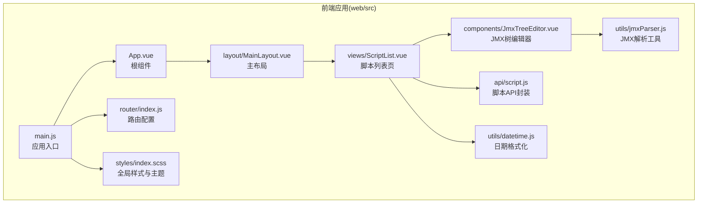

**图表来源**
- [main.js](file://web/src/main.js)
- [App.vue](file://web/src/App.vue)
- [router/index.js](file://web/src/router/index.js)
- [MainLayout.vue](file://web/src/layout/MainLayout.vue)
- [ScriptList.vue](file://web/src/views/ScriptList.vue)
- [JmxTreeEditor.vue](file://web/src/components/JmxTreeEditor.vue)
- [script.js](file://web/src/api/script.js)
- [datetime.js](file://web/src/utils/datetime.js)
- [jmxParser.js](file://web/src/utils/jmxParser.js)
- [index.scss](file://web/src/styles/index.scss)

**章节来源**
- [README.md](file://README.md)
- [main.js](file://web/src/main.js)
- [App.vue](file://web/src/App.vue)
- [router/index.js](file://web/src/router/index.js)
- [MainLayout.vue](file://web/src/layout/MainLayout.vue)
- [ScriptList.vue](file://web/src/views/ScriptList.vue)
- [JmxTreeEditor.vue](file://web/src/components/JmxTreeEditor.vue)
- [script.js](file://web/src/api/script.js)
- [datetime.js](file://web/src/utils/datetime.js)
- [jmxParser.js](file://web/src/utils/jmxParser.js)
- [index.scss](file://web/src/styles/index.scss)

## 核心组件
- 应用入口与初始化：负责创建应用实例、注册插件、挂载路由与Element Plus、引入全局样式、设置暗色模式、注册图标组件。
- 根组件App.vue：提供页面级过渡动画，承载路由视图。
- 主布局MainLayout.vue：提供顶部导航、内容区与底部信息，内嵌页面级过渡。
- 脚本列表页ScriptList.vue：展示统计卡片、上传区域、脚本表格、分页与操作弹窗。
- JMX树编辑器JmxTreeEditor.vue：提供JMX元素树、搜索过滤、拖拽排序、属性编辑与元数据定义。
- API封装script.js：统一封装脚本相关的REST API调用。
- 工具函数datetime.js：提供日期解析与格式化、相对时间计算。
- 工具函数jmxParser.js：提供JMX解析、序列化、元素元数据与分类定义。
- 全局样式index.scss：定义暗色主题变量、通用工具类、Element Plus覆盖样式与动画。

**章节来源**
- [main.js](file://web/src/main.js)
- [App.vue](file://web/src/App.vue)
- [MainLayout.vue](file://web/src/layout/MainLayout.vue)
- [ScriptList.vue](file://web/src/views/ScriptList.vue)
- [JmxTreeEditor.vue](file://web/src/components/JmxTreeEditor.vue)
- [script.js](file://web/src/api/script.js)
- [datetime.js](file://web/src/utils/datetime.js)
- [jmxParser.js](file://web/src/utils/jmxParser.js)
- [index.scss](file://web/src/styles/index.scss)

## 架构总览
应用采用Vue 3 + Element Plus + Vite的现代前端技术栈，通过Vite进行开发与构建，Element Plus提供UI组件库，路由采用history模式，全局样式通过SCSS变量与覆盖实现暗色主题。

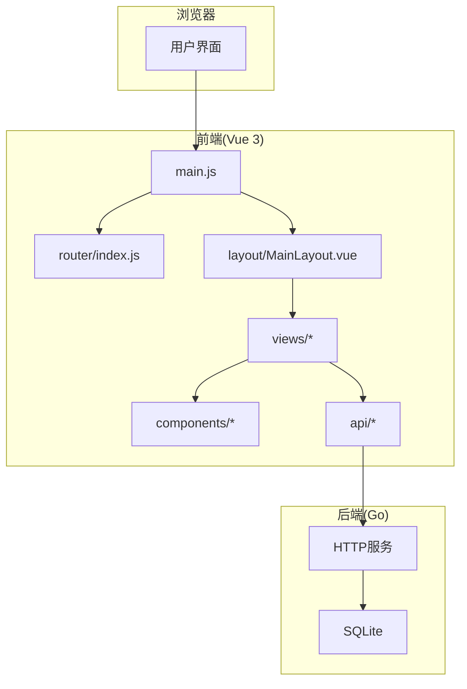

**图表来源**
- [main.js](file://web/src/main.js)
- [router/index.js](file://web/src/router/index.js)
- [MainLayout.vue](file://web/src/layout/MainLayout.vue)
- [ScriptList.vue](file://web/src/views/ScriptList.vue)
- [JmxTreeEditor.vue](file://web/src/components/JmxTreeEditor.vue)
- [script.js](file://web/src/api/script.js)

## 详细组件分析

### 应用初始化流程与全局配置
- 应用实例创建：通过createApp(App)创建应用实例。
- 插件注册：先注册路由，再注册Element Plus插件。
- 图标系统：遍历ElementPlusIconsVue并逐个注册为全局组件，便于在模板中直接使用图标组件。
- 暗色模式：通过为document.documentElement添加“dark”类名，配合全局样式中的CSS变量与Element Plus覆盖样式实现暗色主题。
- 全局样式：引入styles/index.scss，统一字体、颜色、圆角、阴影、动画与工具类。
- 路由挂载：app.use(router)后，app.mount('#app')完成挂载。

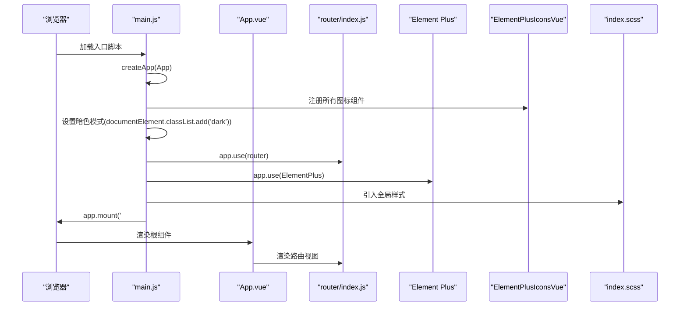

**图表来源**
- [main.js](file://web/src/main.js)
- [App.vue](file://web/src/App.vue)
- [router/index.js](file://web/src/router/index.js)
- [index.scss](file://web/src/styles/index.scss)

**章节来源**
- [main.js](file://web/src/main.js)
- [index.scss](file://web/src/styles/index.scss)

### Element Plus UI框架集成与图标系统
- 插件集成：通过app.use(ElementPlus)启用Element Plus组件库。
- 图标系统：遍历ElementPlusIconsVue并逐个注册为全局组件，可在模板中直接使用图标组件，减少重复导入。
- 暗色主题覆盖：在全局样式中通过CSS变量与覆盖类名，针对Element Plus组件（按钮、表格、输入框、选择器、日期选择器、弹窗、标签等）进行暗色适配与圆角优化。

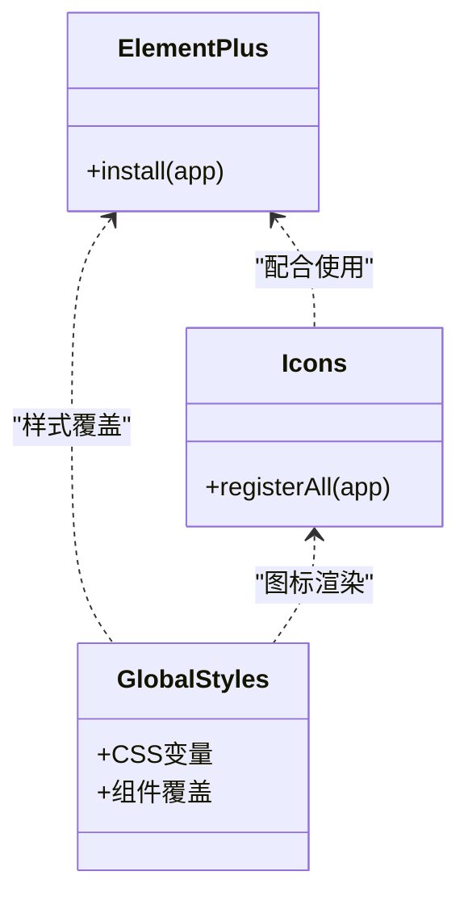

**图表来源**
- [main.js](file://web/src/main.js)
- [index.scss](file://web/src/styles/index.scss)

**章节来源**
- [main.js](file://web/src/main.js)
- [index.scss](file://web/src/styles/index.scss)

### 根组件App.vue的设计与布局
- 页面过渡：使用router-view包裹并应用“app-fade”过渡，实现页面切换的柔和动画。
- 样式：定义了进入/离开的过渡属性与时间曲线，保证视觉一致性。

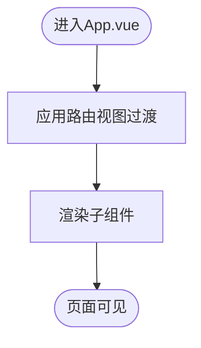

**图表来源**
- [App.vue](file://web/src/App.vue)

**章节来源**
- [App.vue](file://web/src/App.vue)

### 主布局MainLayout.vue
- 顶部导航：包含Logo与Tab导航，Tab项与路由路径对应，激活态通过isActive判断。
- 内容区：使用router-view承载页面内容，并应用“page-fade”过渡。
- 响应式布局：通过Flex布局与最大宽度约束，适配不同屏幕尺寸。
- 暗色主题：整体背景与边框采用暗色系，与全局样式保持一致。

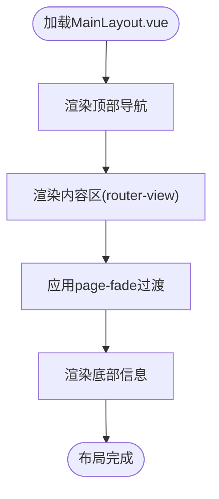

**图表来源**
- [MainLayout.vue](file://web/src/layout/MainLayout.vue)

**章节来源**
- [MainLayout.vue](file://web/src/layout/MainLayout.vue)

### 脚本列表页ScriptList.vue
- 统计概览：展示脚本总数、文件总数、运行中数量与执行记录数。
- 上传区域：支持描述输入与单文件上传，使用Element Plus表单与文件上传组件。
- 脚本表格：展示脚本名称、描述、主文件、创建/更新时间，提供下载、编辑、执行、删除等操作。
- 分页与搜索：支持关键词搜索与分页，刷新列表。
- 执行弹窗：打开执行对话框，触发执行流程。
- 使用指南：提供操作指引弹窗，帮助用户快速上手。

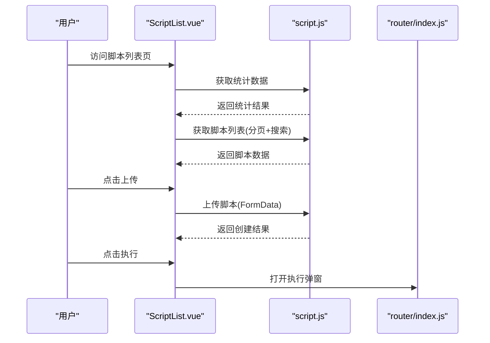

**图表来源**
- [ScriptList.vue](file://web/src/views/ScriptList.vue)
- [script.js](file://web/src/api/script.js)
- [router/index.js](file://web/src/router/index.js)

**章节来源**
- [ScriptList.vue](file://web/src/views/ScriptList.vue)
- [script.js](file://web/src/api/script.js)

### JMX树编辑器JmxTreeEditor.vue
- 元素树：左侧展示JMX元素树，支持搜索、展开/收起、拖拽排序、右键菜单与上下移动。
- 属性编辑：右侧展示所选节点的属性表单，根据元数据定义渲染不同类型的控件（字符串、数字、布尔、选择、文本域、键值对列表、线程调度配置、字符串列表等）。
- 元数据定义：通过jmxParser.js提供元素元数据与分类，支持动态生成编辑器。
- 原始XML：当元素类型无元数据定义时，显示原始XML以便手工编辑。

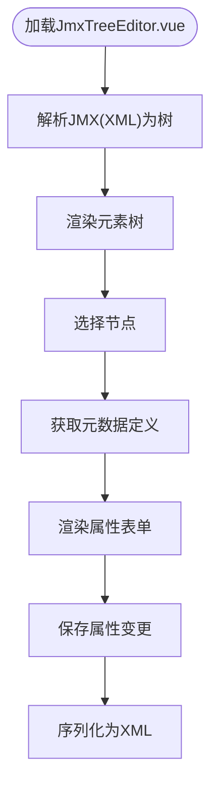

**图表来源**
- [JmxTreeEditor.vue](file://web/src/components/JmxTreeEditor.vue)
- [jmxParser.js](file://web/src/utils/jmxParser.js)

**章节来源**
- [JmxTreeEditor.vue](file://web/src/components/JmxTreeEditor.vue)
- [jmxParser.js](file://web/src/utils/jmxParser.js)

### 全局样式与主题配置
- 暗色主题：通过CSS变量定义圆角、字体、间距、阴影、过渡时间与色彩体系，并在Element Plus组件上进行覆盖。
- 通用工具类：提供文本对齐、Flex布局、间距等常用样式。
- 滚动条样式：自定义滚动条外观，提升暗色主题下的可视体验。
- 页面过渡：定义页面级“page-fade”过渡动画，与布局组件中的过渡保持一致。

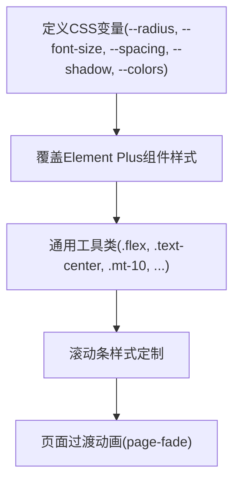

**图表来源**
- [index.scss](file://web/src/styles/index.scss)

**章节来源**
- [index.scss](file://web/src/styles/index.scss)

### 暗色模式实现机制
- 设置方式：在main.js中为document.documentElement添加“dark”类名，使全局样式中的暗色变量与覆盖生效。
- 样式联动：全局SCSS变量与Element Plus覆盖样式依赖暗色主题变量，从而实现统一的暗色视觉。
- 组件适配：通过类名与CSS变量，确保Element Plus组件在暗色模式下具有合适的对比度与视觉层次。

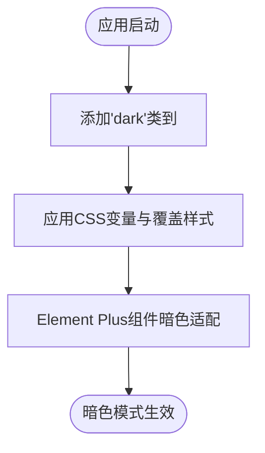

**图表来源**
- [main.js](file://web/src/main.js)
- [index.scss](file://web/src/styles/index.scss)

**章节来源**
- [main.js](file://web/src/main.js)
- [index.scss](file://web/src/styles/index.scss)

### 应用启动流程最佳实践
- 初始化顺序：先创建应用实例，再注册路由与Element Plus，最后挂载，避免路由守卫与组件生命周期异常。
- 图标注册：集中注册所有图标组件，减少重复导入，提高模板可读性。
- 暗色模式：在应用初始化阶段设置，确保首屏即为暗色主题，避免闪烁。
- 全局样式：在main.js中引入全局样式，保证组件样式优先级与覆盖生效。
- 构建与开发：通过Vite配置代理后端API，开发时保持前后端分离的调试体验。

**章节来源**
- [main.js](file://web/src/main.js)
- [vite.config.js](file://web/vite.config.js)

### 样式组织与CSS变量使用规范
- 变量命名：使用语义化的CSS变量名，如--radius-*、--font-size-*、--spacing-*、--shadow-*、--el-color-*等。
- 作用域：变量定义在:root层级，组件样式通过var(--variable)引用，确保全局一致性。
- 覆盖策略：针对Element Plus组件，通过类名与变量组合进行覆盖，避免破坏组件内部结构。
- 工具类：提供常用的Flex布局与间距工具类，减少重复样式编写。
- 动画：统一过渡时间与曲线，保证页面切换与交互的一致性。

**章节来源**
- [index.scss](file://web/src/styles/index.scss)

## 依赖关系分析
- 应用入口依赖：main.js依赖App.vue、router、Element Plus、图标库、全局样式。
- 路由依赖：router/index.js依赖MainLayout与各视图组件。
- 视图依赖：ScriptList.vue依赖API封装、组件与工具函数；JmxTreeEditor.vue依赖jmxParser工具。
- 样式依赖：全局样式被入口与各组件共同依赖，形成统一的主题与样式体系。

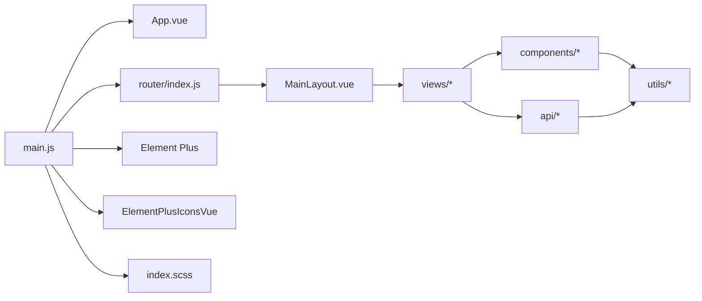

**图表来源**
- [main.js](file://web/src/main.js)
- [router/index.js](file://web/src/router/index.js)
- [MainLayout.vue](file://web/src/layout/MainLayout.vue)
- [ScriptList.vue](file://web/src/views/ScriptList.vue)
- [JmxTreeEditor.vue](file://web/src/components/JmxTreeEditor.vue)
- [script.js](file://web/src/api/script.js)
- [datetime.js](file://web/src/utils/datetime.js)
- [jmxParser.js](file://web/src/utils/jmxParser.js)
- [index.scss](file://web/src/styles/index.scss)

**章节来源**
- [main.js](file://web/src/main.js)
- [router/index.js](file://web/src/router/index.js)
- [index.scss](file://web/src/styles/index.scss)

## 性能考量
- 组件懒加载：对于大型视图与复杂组件，建议结合路由进行懒加载，减少首屏体积。
- 图标按需：当前注册了所有图标组件，若体积敏感，可改为按需注册或使用动态导入。
- 样式拆分：将通用样式与页面样式拆分，避免不必要的全局样式重绘。
- 动画优化：过渡时间与曲线应适度，避免在低端设备上造成卡顿。
- 请求合并：API调用尽量合并，减少网络往返次数。

## 故障排查指南
- 暗色模式无效：检查main.js中是否正确添加“dark”类名，以及全局样式变量是否正确覆盖Element Plus组件。
- 图标不显示：确认ElementPlusIconsVue是否正确遍历注册，模板中使用的图标组件名称是否与注册一致。
- 路由跳转异常：检查router/index.js中的路由配置与路径，确保与组件路径一致。
- API请求失败：检查Vite代理配置与后端服务端口，确保/api前缀请求被正确转发。
- 样式冲突：若Element Plus组件样式不符合预期，检查index.scss中的覆盖类名与变量是否正确应用。

**章节来源**
- [main.js](file://web/src/main.js)
- [index.scss](file://web/src/styles/index.scss)
- [vite.config.js](file://web/vite.config.js)

## 结论
本Vue应用通过清晰的初始化流程、完善的Element Plus集成与图标系统、统一的全局样式与暗色主题、合理的组件与路由组织，构建了一个现代化、可维护且具有良好用户体验的前端应用。遵循本文档的架构与最佳实践，可进一步提升开发效率与运行性能。

## 附录
- 构建与开发：通过Vite进行开发与构建，支持热更新与代理后端API。
- 依赖管理：package.json中声明了Vue、Vue Router、Element Plus、Axios、Monaco Editor等依赖。
- PostCSS配置：postcss.config.js为空配置，保持默认行为。

**章节来源**
- [package.json](file://web/package.json)
- [vite.config.js](file://web/vite.config.js)
- [postcss.config.js](file://web/postcss.config.js)