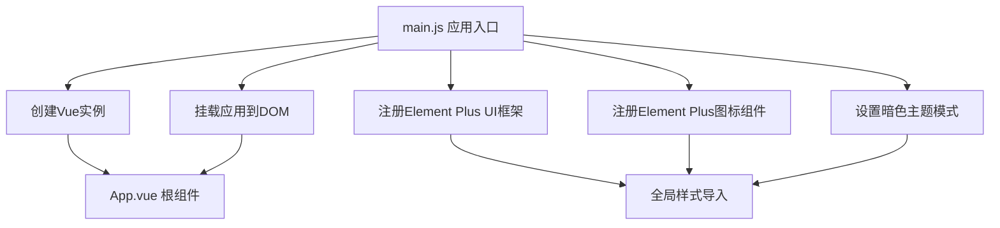
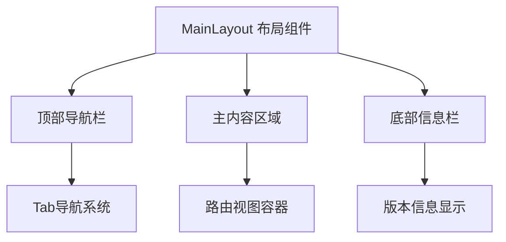
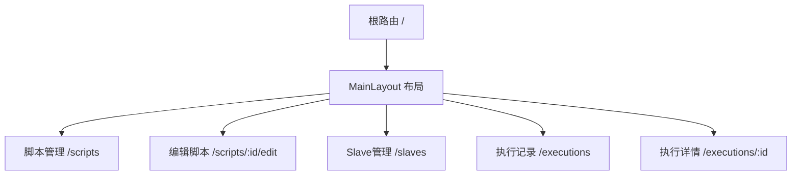
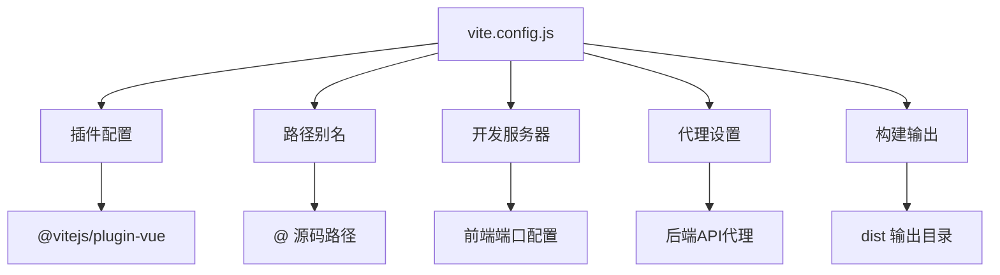
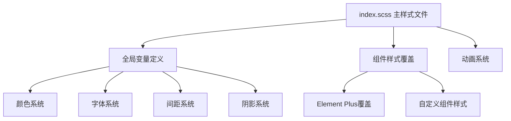
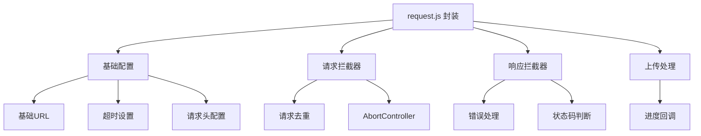
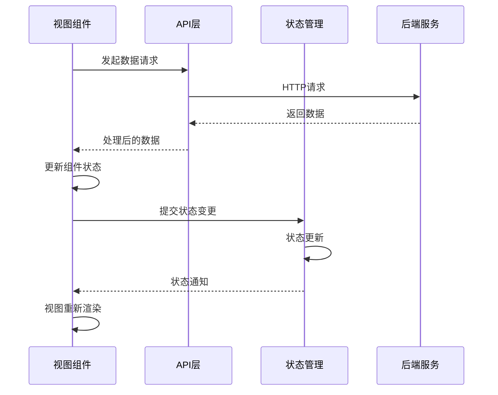

# 前端架构设计

<cite>
**本文档引用的文件**
- [README.md](file://README.md)
- [web/package.json](file://web/package.json)
- [web/vite.config.js](file://web/vite.config.js)
- [web/postcss.config.js](file://web/postcss.config.js)
- [web/src/main.js](file://web/src/main.js)
- [web/src/App.vue](file://web/src/App.vue)
- [web/src/router/index.js](file://web/src/router/index.js)
- [web/src/layout/MainLayout.vue](file://web/src/layout/MainLayout.vue)
- [web/src/views/ScriptList.vue](file://web/src/views/ScriptList.vue)
- [web/src/views/ExecutionList.vue](file://web/src/views/ExecutionList.vue)
- [web/src/views/ScriptEdit.vue](file://web/src/views/ScriptEdit.vue)
- [web/src/views/SlaveManage.vue](file://web/src/views/SlaveManage.vue)
- [web/src/views/ExecutionDetail.vue](file://web/src/views/ExecutionDetail.vue)
- [web/src/components/ExecuteDialog.vue](file://web/src/components/ExecuteDialog.vue)
- [web/src/components/JmxTreeEditor.vue](file://web/src/components/JmxTreeEditor.vue)
- [web/src/components/MetricTrendChart.vue](file://web/src/components/MetricTrendChart.vue)
- [web/src/api/request.js](file://web/src/api/request.js)
- [web/src/api/script.js](file://web/src/api/script.js)
- [web/src/api/execution.js](file://web/src/api/execution.js)
- [web/src/api/slave.js](file://web/src/api/slave.js)
- [web/src/utils/jmxParser.js](file://web/src/utils/jmxParser.js)
- [web/src/utils/datetime.js](file://web/src/utils/datetime.js)
- [web/src/styles/index.scss](file://web/src/styles/index.scss)
</cite>

## 更新摘要
**变更内容**
- 更新文档管理策略：前端架构设计文档现在通过README.md的前端相关章节提供
- 新增Vue应用结构详细分析，包括应用入口、插件注册和全局配置
- 完善组件层次结构说明，涵盖布局组件、视图组件和业务组件
- 补充路由配置架构，详细说明嵌套路由设计和导航机制
- 增强构建配置分析，包括Vite配置、代理设置和环境变量
- 丰富样式系统设计，详细说明暗色主题和Element Plus集成
- 完善API层架构，包括Axios封装和接口抽象设计

## 目录
1. [引言](#引言)
2. [Vue应用结构](#vue应用结构)
3. [组件层次结构](#组件层次结构)
4. [路由配置架构](#路由配置架构)
5. [构建配置与开发环境](#构建配置与开发环境)
6. [样式系统与主题设计](#样式系统与主题设计)
7. [API层架构设计](#api层架构设计)
8. [数据流与状态管理](#数据流与状态管理)
9. [性能优化策略](#性能优化策略)
10. [开发调试指南](#开发调试指南)
11. [总结与展望](#总结与展望)

## 引言
本文件全面阐述JMeter Admin前端基于Vue 3 + Element Plus的架构设计。系统采用现代化前端技术栈，通过清晰的分层架构和组件化设计，实现了脚本管理、执行记录、JMX编辑等核心功能。根据最新的文档管理策略，前端架构设计文档现在通过README.md的前端相关章节提供，包括Vue应用结构和组件层次等内容。

JMeter Admin是一个轻量级的JMeter分布式压测管理平台，采用Go (Gin) + Vue 3 (Element Plus) + SQLite技术栈开发。前端资源嵌入后端二进制文件，编译后生成单个可执行文件，实现零依赖部署。

## Vue应用结构
Vue应用采用现代化的组合式API和模块化架构设计，通过清晰的应用入口和插件注册机制，构建了稳定可靠的技术基础。

### 应用入口与初始化
应用入口通过`main.js`完成核心初始化工作，包括Vue实例创建、插件注册、全局配置等关键步骤：

**图表来源**
- [web/src/main.js:1-23](file://web/src/main.js#L1-L23)

### 插件生态系统
应用集成了完整的插件生态系统，每个插件承担特定职责：

- **Vue Router**: 提供客户端路由管理和导航功能
- **Element Plus**: 提供丰富的UI组件库和设计系统
- **Element Plus Icons**: 提供完整的图标系统支持
- **全局样式**: 集成暗色主题和自定义样式变量

### 全局配置策略
应用采用统一的全局配置策略，包括暗色主题设置、图标注册、样式导入等，确保应用的一致性和可维护性。

**章节来源**
- [web/src/main.js:1-23](file://web/src/main.js#L1-L23)

## 组件层次结构
前端采用清晰的组件层次结构，通过布局组件、视图组件、业务组件的分层设计，实现了高内聚低耦合的架构模式。

### 布局组件层
布局组件作为应用的基础框架，提供统一的页面结构和导航体验：

**图表来源**
- [web/src/layout/MainLayout.vue:1-228](file://web/src/layout/MainLayout.vue#L1-L228)

### 视图组件层
视图组件负责具体的业务页面展示，每个组件专注于特定的功能领域：

- **ScriptList**: 脚本管理页面，包含上传、列表、搜索、执行等功能
- **ExecutionList**: 执行记录页面，提供统计、筛选、表格展示
- **ExecutionDetail**: 执行详情页面，展示详细的执行结果
- **ScriptEdit**: 脚本编辑页面，支持JMX文件编辑
- **SlaveManage**: Slave节点管理页面

### 业务组件层
业务组件提供可复用的功能模块，支持复杂的业务场景：

- **ExecuteDialog**: 执行配置对话框，支持本地和分布式执行
- **JmxTreeEditor**: JMX树形编辑器，提供可视化编辑功能
- **FileUpload**: 文件上传组件，支持多种文件类型
- **MetricTrendChart**: 指标趋势图表组件

**章节来源**
- [web/src/layout/MainLayout.vue:1-228](file://web/src/layout/MainLayout.vue#L1-L228)
- [web/src/views/ScriptList.vue:1-200](file://web/src/views/ScriptList.vue#L1-L200)
- [web/src/views/ExecutionList.vue:1-200](file://web/src/views/ExecutionList.vue#L1-L200)
- [web/src/components/ExecuteDialog.vue:1-200](file://web/src/components/ExecuteDialog.vue#L1-L200)
- [web/src/components/JmxTreeEditor.vue:1-200](file://web/src/components/JmxTreeEditor.vue#L1-L200)

## 路由配置架构
应用采用Vue Router 4的嵌套路由设计，通过清晰的路由层次和导航机制，提供了流畅的用户体验。

### 路由结构设计
路由系统采用嵌套路由模式，根路由指向MainLayout布局，子路由负责具体页面：

**图表来源**
- [web/src/router/index.js:1-55](file://web/src/router/index.js#L1-L55)

### 导航系统设计
应用实现了智能的导航系统，包括：

- **Tab导航**: 顶部导航栏提供主要功能入口
- **活动状态**: 自动识别当前激活的导航项
- **响应式布局**: 根据页面类型调整内容区域宽度
- **过渡动画**: 页面切换时提供平滑的过渡效果

### 路由元信息
每个路由都包含元信息配置，用于页面标题和SEO优化：

- **title**: 页面标题配置
- **meta**: 元数据信息
- **name**: 路由名称标识

**章节来源**
- [web/src/router/index.js:1-55](file://web/src/router/index.js#L1-L55)
- [web/src/layout/MainLayout.vue:56-76](file://web/src/layout/MainLayout.vue#L56-L76)

## 构建配置与开发环境
应用采用Vite作为构建工具，通过现代化的构建配置和开发环境设置，提供了高效的开发体验。

### Vite构建配置
构建配置文件提供了完整的开发和生产环境配置：

**图表来源**
- [web/vite.config.js:1-35](file://web/vite.config.js#L1-L35)

### 开发服务器配置
开发服务器支持灵活的端口配置和代理设置：

- **前端端口**: 默认3000，可通过环境变量FRONTEND_PORT自定义
- **后端代理**: 将/api前缀转发到后端服务
- **热重载**: 支持实时代码更新和样式热替换

### 环境变量支持
应用支持通过环境变量配置运行参数：

- **FRONTEND_PORT**: 前端开发端口
- **BACKEND_PORT**: 后端服务端口

### 生产构建优化
构建配置针对生产环境进行了优化：

- **输出目录**: dist目录作为构建输出
- **静态资源**: assets目录存放静态资源
- **代码分割**: 自动进行代码分割和优化

**章节来源**
- [web/vite.config.js:1-35](file://web/vite.config.js#L1-L35)
- [web/package.json:1-24](file://web/package.json#L1-L24)

## 样式系统与主题设计
应用采用暗色主题设计，通过SCSS变量系统和Element Plus主题覆盖，实现了统一的视觉体验。

### 暗色主题架构
样式系统采用Apple风格的暗色主题设计：

**图表来源**
- [web/src/styles/index.scss:1-1110](file://web/src/styles/index.scss#L1-L1110)

### 设计系统变量
应用建立了完整的CSS变量系统：

- **颜色变量**: 包含主色调、辅助色、状态色等
- **字体变量**: 定义字体大小、行高、字重等
- **间距变量**: 建立统一的间距体系
- **圆角变量**: Apple风格的大圆角设计
- **阴影变量**: 渐变阴影效果

### Element Plus主题集成
通过深度选择器覆盖Element Plus组件样式：

- **按钮样式**: 大圆角设计，多种状态样式
- **表格样式**: 暗色主题适配
- **表单控件**: 输入框、选择器等组件样式
- **对话框样式**: 弹窗组件的暗色适配

### 动画系统设计
应用实现了统一的动画系统：

- **页面过渡**: 柔和的页面切换动画
- **组件动画**: 按钮悬停、点击等交互动画
- **加载动画**: 统一的加载状态指示

**章节来源**
- [web/src/styles/index.scss:1-1110](file://web/src/styles/index.scss#L1-L1110)

## API层架构设计
API层采用Axios封装和接口抽象设计，通过统一的请求处理和错误管理，提供了稳定的后端通信能力。

### Axios封装架构
应用通过Axios创建统一的HTTP客户端：

**图表来源**
- [web/src/api/request.js:1-103](file://web/src/api/request.js#L1-L103)

### 请求去重机制
应用实现了智能的请求去重功能：

- **请求签名生成**: 基于请求方法、URL、参数、数据生成唯一标识
- **Pending请求管理**: 使用Map存储正在进行的请求
- **AbortController**: 支持取消重复请求
- **竞态条件避免**: 确保请求的唯一性和一致性

### 错误处理系统
响应拦截器提供了完整的错误处理机制：

- **业务错误处理**: 统一处理后端返回的业务错误
- **网络错误处理**: 处理超时、连接失败等网络问题
- **状态码处理**: 针对不同HTTP状态码的专门处理
- **用户提示**: 通过Element Plus消息组件提供友好的错误提示

### 接口抽象设计
脚本API接口提供了完整的CRUD操作：

- **列表查询**: 支持分页、搜索、筛选
- **文件上传**: 支持单文件上传和进度跟踪
- **内容管理**: 支持脚本内容的读取和保存
- **文件管理**: 支持脚本文件的上传、删除、下载

**章节来源**
- [web/src/api/request.js:1-103](file://web/src/api/request.js#L1-L103)
- [web/src/api/script.js:1-74](file://web/src/api/script.js#L1-L74)

## 数据流与状态管理
应用采用Vue 3的响应式系统和组合式API，通过清晰的数据流设计和状态管理模式，实现了高效的数据管理。

### 组件数据流
数据流采用自上而下的单向数据流设计：

### 状态管理模式
应用采用Vue 3的Composition API进行状态管理：

- **响应式数据**: 使用ref和reactive创建响应式状态
- **计算属性**: 使用computed处理派生状态
- **侦听器**: 使用watch监听状态变化
- **生命周期**: 合理使用onMounted、onUnmounted等生命周期钩子

### 数据缓存策略
应用实现了多层次的数据缓存策略：

- **内存缓存**: 组件内部缓存常用数据
- **请求去重**: 避免重复请求相同数据
- **本地存储**: 重要状态持久化存储

## 性能优化策略
应用从多个维度实施性能优化策略，包括代码分割、懒加载、资源优化等，确保应用的高性能表现。

### 代码分割与懒加载
应用采用动态导入实现代码分割：

- **路由级懒加载**: 通过动态import实现路由级别的代码分割
- **组件懒加载**: 大型组件按需加载
- **第三方库分离**: 通过external配置分离第三方库

### 资源优化策略
构建配置集成了多种资源优化策略：

- **Tree Shaking**: 通过ES模块导入启用Tree Shaking
- **代码压缩**: 生产环境自动压缩JavaScript代码
- **资源压缩**: CSS和HTML文件的压缩优化
- **缓存策略**: 静态资源的长期缓存配置

### 运行时优化
应用在运行时也实施了多项优化措施：

- **虚拟滚动**: 大列表数据的虚拟滚动支持
- **防抖节流**: 用户交互的防抖节流处理
- **图片优化**: 图片资源的懒加载和格式优化
- **字体优化**: Web字体的加载优化

## 开发调试指南
应用提供了完善的开发调试工具和最佳实践，帮助开发者高效地进行开发和问题排查。

### 开发环境配置
开发环境支持灵活的配置选项：

- **端口配置**: 通过环境变量配置前端和后端端口
- **代理设置**: 开发时的API代理配置
- **热重载**: 支持代码和样式的热重载
- **Source Map**: 完整的Source Map支持

### 调试工具使用
推荐使用的调试工具和技巧：

- **Vue DevTools**: 组件层级和状态检查
- **浏览器开发者工具**: 网络请求和性能分析
- **ESLint**: 代码质量和风格检查
- **Prettier**: 代码格式化

### 常见问题排查
提供常见问题的排查方法：

- **请求失败**: 检查后端服务状态和代理配置
- **样式问题**: 检查CSS变量和Element Plus覆盖
- **组件问题**: 检查组件Props和事件传递
- **性能问题**: 使用性能分析工具定位瓶颈

**章节来源**
- [web/vite.config.js:1-35](file://web/vite.config.js#L1-L35)
- [web/src/api/request.js:1-103](file://web/src/api/request.js#L1-L103)

## 总结与展望
JMeter Admin前端架构通过Vue 3 + Element Plus的现代化技术栈，构建了清晰、可维护、高性能的前端应用。架构设计体现了以下特点：

### 架构优势
- **清晰的分层设计**: 应用结构层次分明，职责明确
- **组件化开发**: 高内聚低耦合的组件设计
- **现代化工具链**: Vite构建工具和ES模块化支持
- **完善的开发体验**: 丰富的调试工具和开发环境

### 技术亮点
- **暗色主题设计**: Apple风格的统一视觉体验
- **智能请求处理**: 请求去重和错误处理机制
- **响应式数据流**: 基于Vue 3的高效数据管理
- **性能优化策略**: 多维度的性能优化措施

### 未来发展方向
随着项目的发展，建议重点关注：

- **路由懒加载**: 进一步优化首屏加载性能
- **虚拟滚动**: 大数据量场景的性能优化
- **自动化测试**: 增加单元测试和端到端测试
- **组件库扩展**: 基于现有组件体系扩展新功能

通过持续的架构优化和技术升级，JMeter Admin前端将成为一个更加成熟、稳定、易用的现代化前端应用。

**章节来源**
- [README.md:1-316](file://README.md#L1-L316)