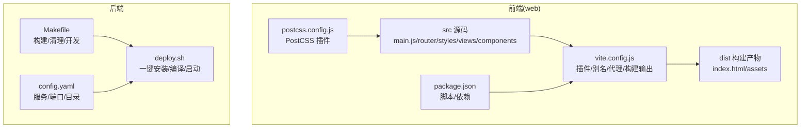
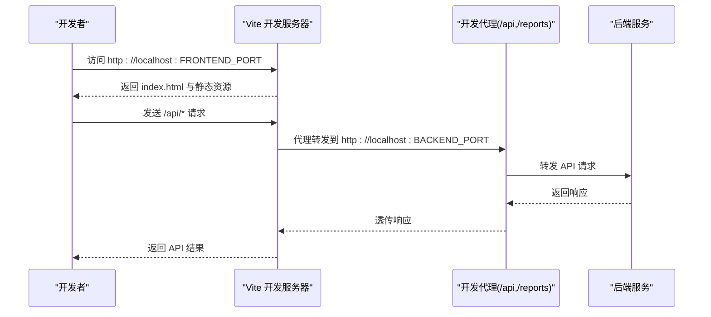
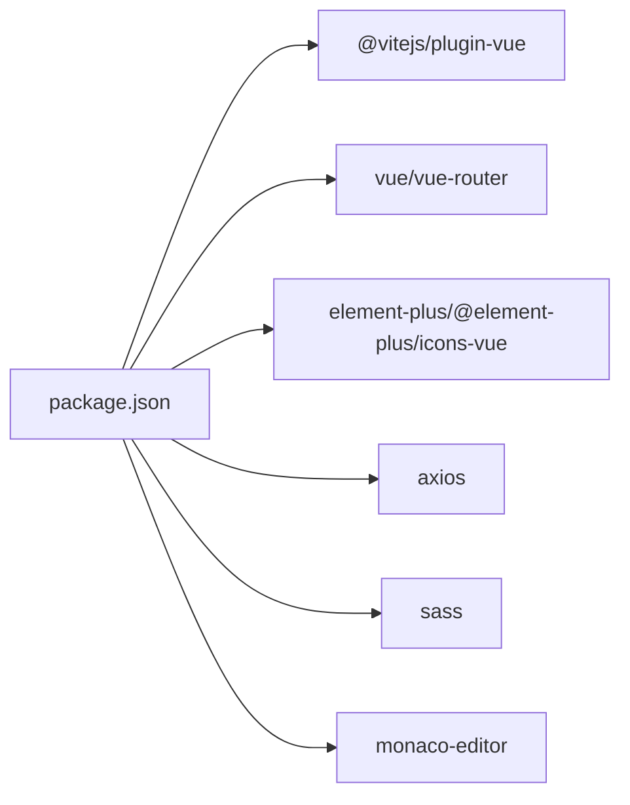

# 构建配置

<cite>
**本文档引用的文件**
- [vite.config.js](file://web/vite.config.js)
- [package.json](file://web/package.json)
- [postcss.config.js](file://web/postcss.config.js)
- [main.js](file://web/src/main.js)
- [index.scss](file://web/src/styles/index.scss)
- [App.vue](file://web/src/App.vue)
- [index.js](file://web/src/router/index.js)
- [Makefile](file://Makefile)
- [deploy.sh](file://deploy.sh)
- [config.yaml](file://config.yaml)
- [request.js](file://web/src/api/request.js)
- [script.js](file://web/src/api/script.js)
- [jmxParser.js](file://web/src/utils/jmxParser.js)
</cite>

## 更新摘要
**变更内容**
- 新增动态chunking策略章节，详细说明Vite的manualChunks配置
- 更新性能优化章节，重点介绍第三方库分离策略
- 新增构建产物分析，展示monaco-editor、element-plus、vue-router等库的独立bundle
- 补充代码分割最佳实践和监控方法

## 目录
1. [简介](#简介)
2. [项目结构](#项目结构)
3. [核心组件](#核心组件)
4. [架构总览](#架构总览)
5. [详细组件分析](#详细组件分析)
6. [依赖关系分析](#依赖关系分析)
7. [性能考虑](#性能考虑)
8. [故障排查指南](#故障排查指南)
9. [结论](#结论)
10. [附录](#附录)

## 简介
本文件聚焦于前端构建配置与优化策略，围绕 Vite 构建工具展开，涵盖开发服务器与热重载、生产打包与代码分割、CSS 预处理与 PostCSS、环境变量与部署准备等主题。同时对比 Webpack 的替代方案，给出选择理由与优势，并提供性能优化技巧与监控方法。

## 项目结构
前端位于 web 目录，采用 Vue 3 + Vite 技术栈，构建产物输出至 web/dist，后端通过嵌入方式提供静态资源与 API 服务。开发与部署脚本由 Makefile 与 deploy.sh 协同完成。

**图表来源**
- [vite.config.js:1-54](file://web/vite.config.js#L1-L54)
- [package.json:1-24](file://web/package.json#L1-L24)
- [postcss.config.js:1-4](file://web/postcss.config.js#L1-L4)
- [Makefile:1-39](file://Makefile#L1-L39)
- [deploy.sh:1-528](file://deploy.sh#L1-L528)
- [config.yaml:1-26](file://config.yaml#L1-L26)

**章节来源**
- [vite.config.js:1-54](file://web/vite.config.js#L1-L54)
- [package.json:1-24](file://web/package.json#L1-L24)
- [postcss.config.js:1-4](file://web/postcss.config.js#L1-L4)
- [Makefile:1-39](file://Makefile#L1-L39)
- [deploy.sh:1-528](file://deploy.sh#L1-L528)
- [config.yaml:1-26](file://config.yaml#L1-L26)

## 核心组件
- Vite 配置与插件：启用 Vue 插件、路径别名、开发服务器与代理、生产构建输出目录与资源目录。
- 包管理与脚本：定义 dev/build/preview 脚本，声明运行时与开发时依赖。
- PostCSS：当前配置为空对象，便于后续扩展。
- 全局样式：Apple 风格暗色主题与 Element Plus 覆盖，提供统一设计系统与过渡动画。
- 开发代理：将 /api 与 /reports 前缀转发至后端，支持跨域与本地联调。
- 部署与环境：通过环境变量控制前后端端口；Makefile 与 deploy.sh 提供一键构建与启动。

**章节来源**
- [vite.config.js:9-34](file://web/vite.config.js#L9-L34)
- [package.json:5-22](file://web/package.json#L5-L22)
- [postcss.config.js:1-4](file://web/postcss.config.js#L1-L4)
- [index.scss:1-112](file://web/src/styles/index.scss#L1-L112)
- [config.yaml:5-11](file://config.yaml#L5-L11)
- [Makefile:37-38](file://Makefile#L37-L38)
- [deploy.sh:110-115](file://deploy.sh#L110-L115)

## 架构总览
前端通过 Vite 提供开发服务器与热重载，构建时输出静态资源；后端提供 API 与嵌入的静态资源，开发模式下通过代理将 API 请求转发至后端。部署脚本负责依赖安装、前端构建与后端编译，最终以单二进制运行。

**图表来源**
- [vite.config.js:16-28](file://web/vite.config.js#L16-L28)
- [config.yaml:5-11](file://config.yaml#L5-L11)
- [Makefile:37-38](file://Makefile#L37-L38)

## 详细组件分析

### Vite 构建配置与优化策略
- 插件与别名
  - 使用 @vitejs/plugin-vue 提供 Vue SFC 支持与热重载。
  - 配置路径别名 @ 指向 src，简化导入路径。
- 开发服务器与代理
  - 通过环境变量 FRONTEND_PORT/BACKEND_PORT 控制端口，默认 3000/8080。
  - /api 前缀代理至后端，/reports 前缀同样代理，满足报告访问需求。
- 生产构建
  - 输出目录 outDir: dist，静态资源目录 assetsDir: assets，便于 CDN 与缓存策略配合。
- **动态chunking策略** **新增**
  - 实现精细的代码分割策略，通过 manualChunks 函数将大型第三方库分离到独立bundle中。
  - monaco-editor 独立打包为 monaco-editor，element-plus 独立打包为 element-plus，vue-router 独立打包为 vue-vendor，其他第三方库打包为 vendor。
  - 这种策略显著提升了缓存命中率，因为这些大型库很少更新，可以长期缓存。

**章节来源**
- [vite.config.js:9-34](file://web/vite.config.js#L9-L34)
- [vite.config.js:30-52](file://web/vite.config.js#L30-L52)
- [config.yaml:5-11](file://config.yaml#L5-L11)

### Webpack 替代方案的选择与优势
- 选择原因
  - Vite 基于原生 ESM 与 Rollup，启动更快、热更新更迅速，适合现代前端开发体验。
  - 与 Vue 3 生态契合度高，插件生态完善，迁移成本低。
- 优势
  - 开发阶段无需打包，冷启动极快；热更新基于 ES 模块，精准无效化。
  - 生产构建使用 Rollup，天然具备优秀的 Tree Shaking 与代码分割能力。
  - 对 TypeScript、CSS 预处理器与图片资源的内置支持良好。

### 开发服务器与热重载机制
- 端口与代理
  - 前端端口由 FRONTEND_PORT 控制，后端端口由 BACKEND_PORT 控制。
  - 代理规则确保 API 与报告接口可直接从开发服务器访问。
- 热重载
  - Vue 插件提供组件级热替换，样式变更即时生效。
  - 路由与全局样式变更通过浏览器刷新或组件热更新处理。

**章节来源**
- [vite.config.js:16-28](file://web/vite.config.js#L16-L28)
- [Makefile:37-38](file://Makefile#L37-L38)

### 生产环境打包与代码分割策略
- 构建输出
  - outDir: dist，assetsDir: assets，便于静态托管与 CDN 缓存。
- 代码分割
  - 建议结合路由懒加载与动态导入，将第三方库与业务代码分离。
  - 对 Element Plus 等体量较大的依赖进行按需引入，降低首屏体积。
- **动态chunking优化** **更新**
  - 通过 manualChunks 实现智能代码分割，将 monaco-editor、element-plus、vue-router 等大型库分离到独立bundle。
  - vendor bundle 包含其他第三方库，实现更好的缓存策略。
  - 这种策略减少了首屏加载时间，提升了应用的整体性能。
- 资源优化
  - 启用合适的压缩与最小化策略，合理设置缓存头与版本号策略。

**章节来源**
- [vite.config.js:30-52](file://web/vite.config.js#L30-L52)
- [package.json:10-17](file://web/package.json#L10-L17)

### PostCSS 配置与 CSS 预处理
- 当前配置
  - postcss.config.js 为空对象，表示未启用额外插件。
- CSS 预处理
  - 项目使用 Sass（package.json devDependencies），全局样式通过 SCSS 编写。
  - index.scss 定义了暗色主题变量、组件覆盖与过渡动画，保证视觉一致性。
- 建议
  - 可引入 autoprefixer、cssnano 等插件提升兼容性与压缩效果。
  - 结合 CSS Modules 或 scoped 样式，避免命名冲突。

**章节来源**
- [postcss.config.js:1-4](file://web/postcss.config.js#L1-L4)
- [package.json](file://web/package.json#L21)
- [index.scss:1-112](file://web/src/styles/index.scss#L1-L112)

### 环境变量与部署准备
- 环境变量
  - FRONTEND_PORT/BACKEND_PORT：分别控制前端开发服务器与后端 API 端口。
  - Makefile 中提供 dev-frontend 目标，支持通过环境变量覆盖端口。
- 部署脚本
  - deploy.sh 自动检测并安装 Go、Node.js、gcc、Java、JMeter 等依赖。
  - install 目标先构建前端（若 web/dist 不存在），再编译后端生成单二进制。
  - start 目标后台启动服务并记录 PID 与日志。
- 配置文件
  - config.yaml 提供 server/port、frontend/port、JMeter 路径与目录等配置项。

**章节来源**
- [config.yaml:5-26](file://config.yaml#L5-L26)
- [Makefile:37-38](file://Makefile#L37-L38)
- [deploy.sh:48-92](file://deploy.sh#L48-L92)
- [deploy.sh:95-115](file://deploy.sh#L95-L115)

### API 与请求拦截器（与构建相关）
- 请求去重
  - request.js 通过 Map 存储进行中的请求，避免重复发送相同请求。
- 响应拦截
  - 统一处理错误码与状态码，提供友好的消息提示。
- 上传进度
  - uploadWithProgress 支持上传进度回调，便于构建或部署时的进度反馈。

**章节来源**
- [request.js:12-88](file://web/src/api/request.js#L12-L88)

### 路由与过渡动画（影响构建体积与体验）
- 路由
  - index.js 定义主布局与各视图路由，结合懒加载可进一步优化首屏。
- 过渡动画
  - App.vue 与 MainLayout.vue 提供页面与应用级过渡，注意保持动画简洁以减少渲染压力。

**章节来源**
- [index.js:1-55](file://web/src/router/index.js#L1-L55)
- [App.vue:1-28](file://web/src/App.vue#L1-L28)
- [index.scss:114-152](file://web/src/styles/index.scss#L114-L152)

### JMX 解析工具（与构建关系）
- jmxParser.js 提供 JMX 元素元数据与解析能力，属于前端工具模块，与构建流程无直接耦合，但会影响运行时资源占用与打包体积。

**章节来源**
- [jmxParser.js:1-800](file://web/src/utils/jmxParser.js#L1-L800)

## 依赖关系分析
前端依赖主要分为运行时依赖与开发时依赖，构建脚本通过 npm 脚本与 Makefile 协作完成。

**图表来源**
- [package.json:10-22](file://web/package.json#L10-L22)

**章节来源**
- [package.json:1-24](file://web/package.json#L1-L24)

## 性能考虑
- 开发阶段
  - 使用 Vite 的快速冷启动与热更新，减少等待时间。
  - 合理拆分第三方库，避免将大依赖打入业务包。
- 生产阶段
  - **动态chunking策略**：通过 manualChunks 将 monaco-editor、element-plus、vue-router 等大型库分离到独立bundle，显著提升缓存命中率。
  - 启用代码分割与懒加载，结合 CDN 与缓存策略。
  - 压缩与最小化资源，合理设置缓存头与版本号。
  - 监控构建产物大小，定期分析 bundle 内容。
- 样式与主题
  - 按需引入 Element Plus 组件，避免全量引入导致体积膨胀。
  - 保持 SCSS 结构清晰，减少重复样式与深层嵌套。
- **构建产物分析** **新增**
  - monaco-editor: 独立的 monaco-editor-[hash].js bundle，包含完整的编辑器功能
  - element-plus: 独立的 element-plus-[hash].js bundle，包含UI组件库
  - vue-vendor: 独立的 vue-vendor-[hash].js bundle，包含 vue-router 和相关Vue库
  - vendor: 独立的 vendor-[hash].js bundle，包含其他第三方库

**章节来源**
- [vite.config.js:35-49](file://web/vite.config.js#L35-L49)

## 故障排查指南
- 端口冲突
  - 检查 FRONTEND_PORT/BACKEND_PORT 是否被占用，必要时调整或释放端口。
- 代理失效
  - 确认 vite.config.js 代理配置与后端实际端口一致。
- 构建失败
  - 检查 Node.js 版本与依赖安装，参考 deploy.sh 的 install 步骤。
- 服务启动问题
  - 使用 deploy.sh start 启动，查看日志文件定位问题。
- **chunking问题** **新增**
  - 如果发现某些库没有正确分离，检查 manualChunks 配置中的包名匹配逻辑。
  - 确保第三方库的版本更新不会破坏现有的代码分割策略。

**章节来源**
- [vite.config.js:16-28](file://web/vite.config.js#L16-L28)
- [config.yaml:5-11](file://config.yaml#L5-L11)
- [deploy.sh:95-115](file://deploy.sh#L95-L115)

## 结论
本项目采用 Vite 作为前端构建工具，结合 Vue 3 与 Element Plus，提供了良好的开发体验与可维护性。通过合理的代理配置、按需引入与代码分割策略，可在生产环境中获得较优的性能表现。**最新的动态chunking策略**显著提升了应用性能，通过将 monaco-editor、element-plus、vue-router 等大型库分离到独立bundle中，实现了更好的缓存策略和加载性能。PostCSS 与 SCSS 的组合满足了暗色主题与组件覆盖的需求。部署脚本与 Makefile 提供了便捷的一键构建与启动流程，适合中小型团队快速交付。

## 附录
- API 示例（路径引用）
  - [script.js:1-74](file://web/src/api/script.js#L1-L74)
  - [request.js:1-103](file://web/src/api/request.js#L1-L103)
- 样式与主题
  - [index.scss:1-112](file://web/src/styles/index.scss#L1-L112)
- 路由与过渡
  - [index.js:1-55](file://web/src/router/index.js#L1-L55)
  - [App.vue:1-28](file://web/src/App.vue#L1-L28)
- 构建与部署
  - [vite.config.js:1-54](file://web/vite.config.js#L1-L54)
  - [package.json:1-24](file://web/package.json#L1-L24)
  - [postcss.config.js:1-4](file://web/postcss.config.js#L1-L4)
  - [Makefile:1-39](file://Makefile#L1-L39)
  - [deploy.sh:1-528](file://deploy.sh#L1-L528)
  - [config.yaml:1-26](file://config.yaml#L1-L26)