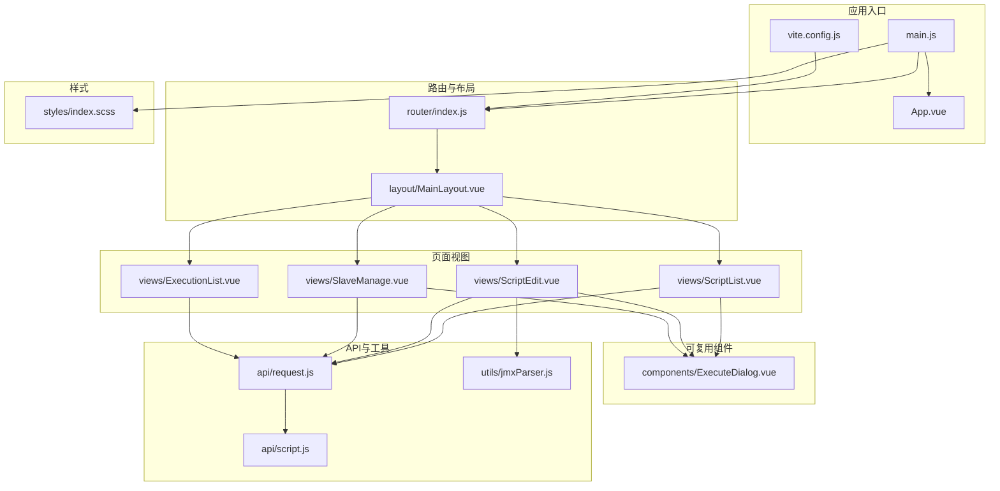
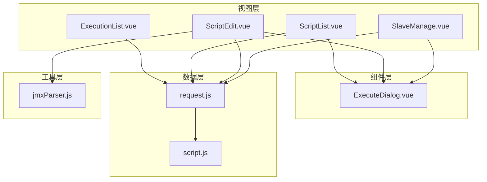
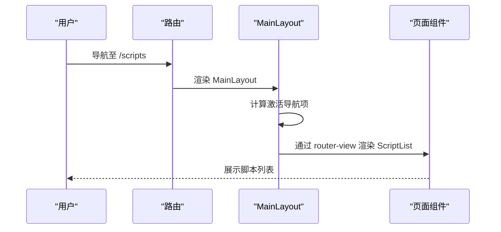
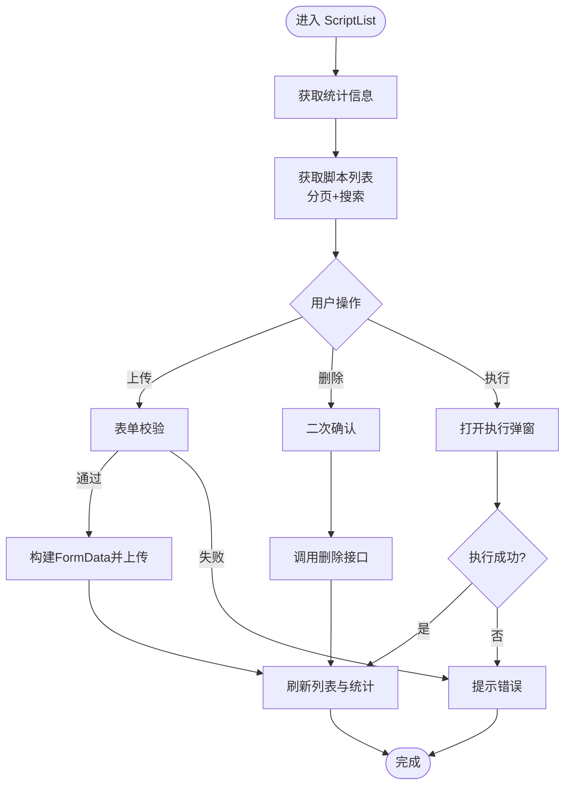
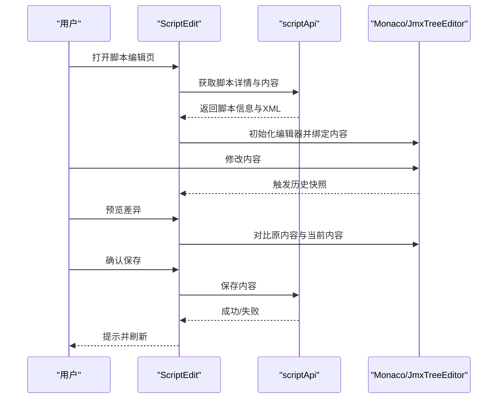
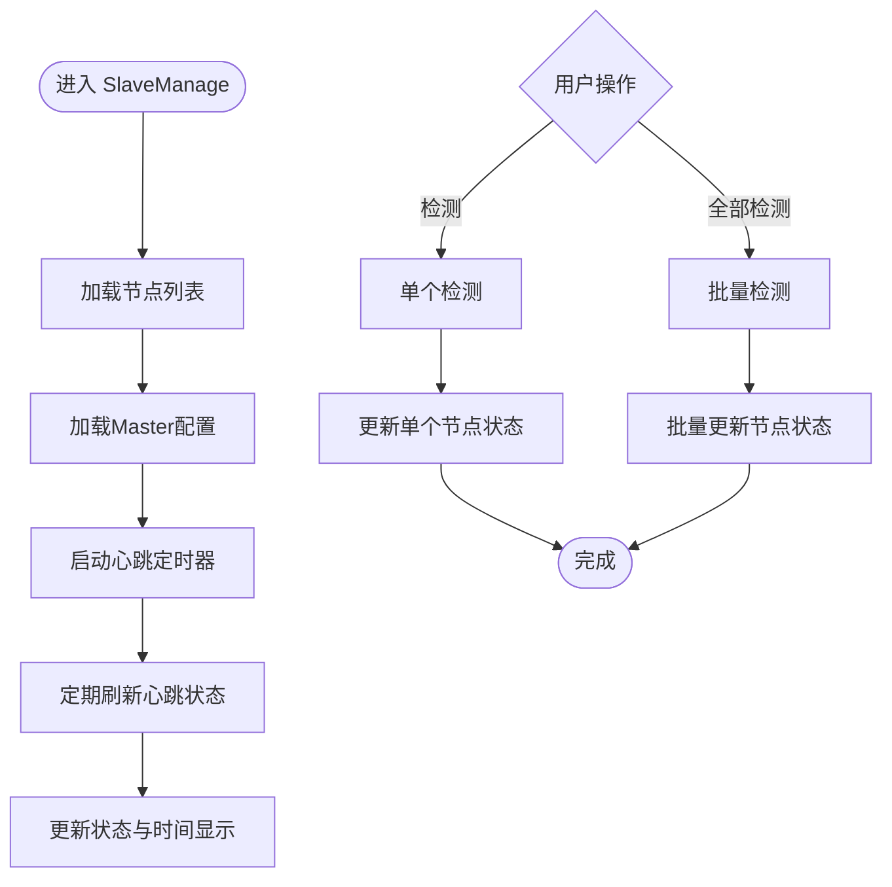
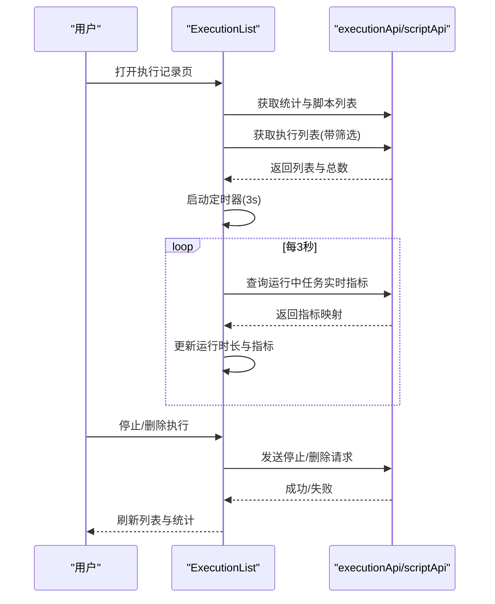
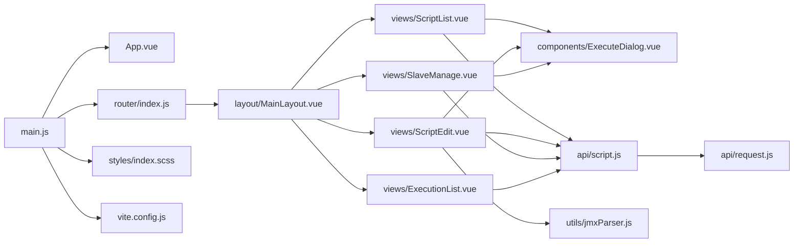

# 组件层次结构

<cite>
**本文档引用的文件**
- [web/src/App.vue](file://web/src/App.vue)
- [web/src/main.js](file://web/src/main.js)
- [web/src/layout/MainLayout.vue](file://web/src/layout/MainLayout.vue)
- [web/src/router/index.js](file://web/src/router/index.js)
- [web/src/views/ScriptList.vue](file://web/src/views/ScriptList.vue)
- [web/src/views/ScriptEdit.vue](file://web/src/views/ScriptEdit.vue)
- [web/src/views/SlaveManage.vue](file://web/src/views/SlaveManage.vue)
- [web/src/views/ExecutionList.vue](file://web/src/views/ExecutionList.vue)
- [web/src/api/request.js](file://web/src/api/request.js)
- [web/src/api/script.js](file://web/src/api/script.js)
- [web/src/components/ExecuteDialog.vue](file://web/src/components/ExecuteDialog.vue)
- [web/src/utils/jmxParser.js](file://web/src/utils/jmxParser.js)
- [web/src/styles/index.scss](file://web/src/styles/index.scss)
- [web/vite.config.js](file://web/vite.config.js)
</cite>

## 目录
1. [简介](#简介)
2. [项目结构](#项目结构)
3. [核心组件](#核心组件)
4. [架构总览](#架构总览)
5. [详细组件分析](#详细组件分析)
6. [依赖关系分析](#依赖关系分析)
7. [性能考虑](#性能考虑)
8. [故障排查指南](#故障排查指南)
9. [结论](#结论)
10. [附录](#附录)

## 简介
本文件系统性梳理 JMeter Admin 前端的组件层次结构，重点阐述：
- 分层设计与职责划分
- 布局组件 MainLayout 的设计模式与复用策略
- 页面级组件的组织结构与数据流向
- 组件间通信机制与事件传递
- 生命周期管理与状态共享
- 最佳实践与代码规范
- 测试与调试方法

## 项目结构
前端采用 Vue 3 + Vite 技术栈，目录组织遵循“按功能域”划分：
- 应用入口与全局配置：main.js、App.vue、vite.config.js
- 路由与布局：router/index.js、layout/MainLayout.vue
- 页面视图：views 下的各页面组件
- 可复用组件：components 下的通用组件
- API 层：api 下的请求封装与业务接口
- 工具库：utils 下的解析与辅助函数
- 样式：styles 下的主题与全局样式

图表来源
- [web/src/main.js:1-23](file://web/src/main.js#L1-L23)
- [web/src/App.vue:1-28](file://web/src/App.vue#L1-L28)
- [web/src/router/index.js:1-55](file://web/src/router/index.js#L1-L55)
- [web/src/layout/MainLayout.vue:1-228](file://web/src/layout/MainLayout.vue#L1-L228)
- [web/src/views/ScriptList.vue:1-800](file://web/src/views/ScriptList.vue#L1-L800)
- [web/src/views/ScriptEdit.vue:1-800](file://web/src/views/ScriptEdit.vue#L1-L800)
- [web/src/views/SlaveManage.vue:1-800](file://web/src/views/SlaveManage.vue#L1-L800)
- [web/src/views/ExecutionList.vue:1-800](file://web/src/views/ExecutionList.vue#L1-L800)
- [web/src/components/ExecuteDialog.vue:1-800](file://web/src/components/ExecuteDialog.vue#L1-L800)
- [web/src/api/request.js:1-103](file://web/src/api/request.js#L1-L103)
- [web/src/api/script.js:1-74](file://web/src/api/script.js#L1-L74)
- [web/src/utils/jmxParser.js:1-800](file://web/src/utils/jmxParser.js#L1-L800)
- [web/src/styles/index.scss:1-800](file://web/src/styles/index.scss#L1-L800)
- [web/vite.config.js:1-35](file://web/vite.config.js#L1-L35)

章节来源
- [web/src/main.js:1-23](file://web/src/main.js#L1-L23)
- [web/src/App.vue:1-28](file://web/src/App.vue#L1-L28)
- [web/src/router/index.js:1-55](file://web/src/router/index.js#L1-L55)
- [web/src/layout/MainLayout.vue:1-228](file://web/src/layout/MainLayout.vue#L1-L228)
- [web/src/views/ScriptList.vue:1-800](file://web/src/views/ScriptList.vue#L1-L800)
- [web/src/views/ScriptEdit.vue:1-800](file://web/src/views/ScriptEdit.vue#L1-L800)
- [web/src/views/SlaveManage.vue:1-800](file://web/src/views/SlaveManage.vue#L1-L800)
- [web/src/views/ExecutionList.vue:1-800](file://web/src/views/ExecutionList.vue#L1-L800)
- [web/src/components/ExecuteDialog.vue:1-800](file://web/src/components/ExecuteDialog.vue#L1-L800)
- [web/src/api/request.js:1-103](file://web/src/api/request.js#L1-L103)
- [web/src/api/script.js:1-74](file://web/src/api/script.js#L1-L74)
- [web/src/utils/jmxParser.js:1-800](file://web/src/utils/jmxParser.js#L1-L800)
- [web/src/styles/index.scss:1-800](file://web/src/styles/index.scss#L1-L800)
- [web/vite.config.js:1-35](file://web/vite.config.js#L1-L35)

## 核心组件
- 应用根组件 App.vue：负责全局路由视图渲染与页面过渡动画。
- 应用引导 main.js：初始化 Vue 实例、注册 Element Plus、全局样式与路由插件。
- 布局组件 MainLayout.vue：提供统一头部导航、主内容区与底部信息，承载页面级路由视图。
- 页面组件：ScriptList、ScriptEdit、SlaveManage、ExecutionList，分别承担脚本管理、脚本编辑、Slave 节点管理、执行记录管理。
- 可复用组件：ExecuteDialog，用于统一的执行弹窗交互。
- API 层：request.js 封装 Axios，提供请求去重、统一拦截与进度上传；script.js 提供脚本相关 API。
- 工具库：jmxParser.js 提供 JMX 解析与元数据定义。

章节来源
- [web/src/App.vue:1-28](file://web/src/App.vue#L1-L28)
- [web/src/main.js:1-23](file://web/src/main.js#L1-L23)
- [web/src/layout/MainLayout.vue:1-228](file://web/src/layout/MainLayout.vue#L1-L228)
- [web/src/views/ScriptList.vue:1-800](file://web/src/views/ScriptList.vue#L1-L800)
- [web/src/views/ScriptEdit.vue:1-800](file://web/src/views/ScriptEdit.vue#L1-L800)
- [web/src/views/SlaveManage.vue:1-800](file://web/src/views/SlaveManage.vue#L1-L800)
- [web/src/views/ExecutionList.vue:1-800](file://web/src/views/ExecutionList.vue#L1-L800)
- [web/src/components/ExecuteDialog.vue:1-800](file://web/src/components/ExecuteDialog.vue#L1-L800)
- [web/src/api/request.js:1-103](file://web/src/api/request.js#L1-L103)
- [web/src/api/script.js:1-74](file://web/src/api/script.js#L1-L74)
- [web/src/utils/jmxParser.js:1-800](file://web/src/utils/jmxParser.js#L1-L800)

## 架构总览
整体采用“布局容器 + 页面视图 + 可复用组件 + API 工具”的分层架构：
- 布局层：MainLayout 提供统一导航与内容区，通过 router-view 动态渲染页面。
- 视图层：页面组件负责具体业务逻辑、状态管理与 API 调用。
- 组件层：ExecuteDialog 等可复用组件提供跨页面的交互能力。
- 数据层：request.js 统一封装请求与错误处理，script.js 等模块化 API 接口。
- 工具层：jmxParser.js 提供 JMX 解析能力，支撑脚本编辑场景。

图表来源
- [web/src/views/ScriptList.vue:1-800](file://web/src/views/ScriptList.vue#L1-L800)
- [web/src/views/ScriptEdit.vue:1-800](file://web/src/views/ScriptEdit.vue#L1-L800)
- [web/src/views/SlaveManage.vue:1-800](file://web/src/views/SlaveManage.vue#L1-L800)
- [web/src/views/ExecutionList.vue:1-800](file://web/src/views/ExecutionList.vue#L1-L800)
- [web/src/components/ExecuteDialog.vue:1-800](file://web/src/components/ExecuteDialog.vue#L1-L800)
- [web/src/api/request.js:1-103](file://web/src/api/request.js#L1-L103)
- [web/src/api/script.js:1-74](file://web/src/api/script.js#L1-L74)
- [web/src/utils/jmxParser.js:1-800](file://web/src/utils/jmxParser.js#L1-L800)

## 详细组件分析

### 布局组件 MainLayout 设计模式与复用策略
- 设计模式：容器组件模式。MainLayout 作为布局容器，集中处理导航、内容区与过渡动画，内部通过 router-view 动态挂载页面组件。
- 复用策略：
  - Tab 导航与激活态：通过路由路径判断当前激活的导航项，提升导航一致性。
  - 页面过渡：为页面切换提供平滑的淡入淡出过渡效果。
  - 宽度适配：根据当前路由动态调整内容区宽度，保证编辑页等宽屏场景的体验。
- 与页面组件的协作：页面组件通过路由注册到 MainLayout 的 children 中，实现统一布局下的多页面渲染。

图表来源
- [web/src/layout/MainLayout.vue:1-228](file://web/src/layout/MainLayout.vue#L1-L228)
- [web/src/router/index.js:1-55](file://web/src/router/index.js#L1-L55)

章节来源
- [web/src/layout/MainLayout.vue:1-228](file://web/src/layout/MainLayout.vue#L1-L228)
- [web/src/router/index.js:1-55](file://web/src/router/index.js#L1-L55)

### 页面级组件组织与数据流

#### ScriptList 页面
- 职责：脚本列表展示、上传、搜索、分页、删除与执行。
- 数据流：
  - 统计数据：通过 scriptApi 获取脚本与执行记录统计。
  - 列表数据：分页参数与搜索关键词组合查询。
  - 上传流程：表单校验后构建 FormData，调用 scriptApi.create。
  - 删除流程：二次确认后调用 scriptApi.delete。
  - 执行流程：打开 ExecuteDialog，传递脚本 ID 与名称，成功后刷新列表与统计。
- 交互细节：Element Plus 表单、表格、分页与对话框的组合使用，配合格式化工具函数处理时间显示。

图表来源
- [web/src/views/ScriptList.vue:1-800](file://web/src/views/ScriptList.vue#L1-L800)
- [web/src/api/script.js:1-74](file://web/src/api/script.js#L1-L74)

章节来源
- [web/src/views/ScriptList.vue:1-800](file://web/src/views/ScriptList.vue#L1-L800)
- [web/src/api/script.js:1-74](file://web/src/api/script.js#L1-L74)

#### ScriptEdit 页面
- 职责：脚本内容编辑（可视化与 XML 源码）、文件关联与上传、差异预览与保存。
- 数据流：
  - 获取脚本详情与文件列表：scriptApi.getDetail。
  - 获取脚本内容：scriptApi.getContent，初始化 Monaco 编辑器。
  - 保存流程：ensureValidCurrentContent 校验 XML，openSavePreview 生成差异对比，confirmSave 调用 scriptApi.saveContent。
  - 文件上传：通过 Upload 组件触发，逐个上传并刷新文件列表。
  - 历史记录：基于编辑器内容变化，维护历史栈，支持撤销/重做。
- 交互细节：JmxTreeEditor 与 Monaco 编辑器的双向绑定，文件类型识别与引用检测。

图表来源
- [web/src/views/ScriptEdit.vue:1-800](file://web/src/views/ScriptEdit.vue#L1-L800)
- [web/src/api/script.js:1-74](file://web/src/api/script.js#L1-L74)
- [web/src/utils/jmxParser.js:1-800](file://web/src/utils/jmxParser.js#L1-L800)

章节来源
- [web/src/views/ScriptEdit.vue:1-800](file://web/src/views/ScriptEdit.vue#L1-L800)
- [web/src/api/script.js:1-74](file://web/src/api/script.js#L1-L74)
- [web/src/utils/jmxParser.js:1-800](file://web/src/utils/jmxParser.js#L1-L800)

#### SlaveManage 页面
- 职责：Slave 节点管理、Master 回调地址配置、心跳状态监控与批量检测。
- 数据流：
  - 获取节点列表：slaveApi.getList。
  - Master 配置：Promise.all 并行获取网络接口与 Master IP，自动配置并保存。
  - 心跳状态：定时器周期性刷新，仅更新状态与最后检测时间，避免整表刷新。
  - 检测流程：handleCheck/handleCheckAll 调用 slaveApi.checkConnectivity，更新状态并提示结果。
- 交互细节：状态标签、在线/离线指示、批量选择与提示。

图表来源
- [web/src/views/SlaveManage.vue:1-800](file://web/src/views/SlaveManage.vue#L1-L800)

章节来源
- [web/src/views/SlaveManage.vue:1-800](file://web/src/views/SlaveManage.vue#L1-L800)

#### ExecutionList 页面
- 职责：执行记录列表、筛选、自动刷新、运行中任务的实时指标。
- 数据流：
  - 统计信息：executionApi.getStats。
  - 脚本列表：scriptApi.getList 用于筛选下拉。
  - 列表数据：executionApi.getList，支持脚本 ID、状态、时间范围与关键字筛选。
  - 自动刷新：hasRunning 条件下定时刷新，同时维护 nowTick 时钟以计算运行时长。
  - 实时指标：对运行中任务并发调用 executionApi.getLiveMetrics，合并到内存映射。
  - 操作：停止执行与删除记录，二次确认后调用对应接口。
- 交互细节：统计卡片点击筛选、自动刷新指示、运行时长与指标格式化。

图表来源
- [web/src/views/ExecutionList.vue:1-800](file://web/src/views/ExecutionList.vue#L1-L800)
- [web/src/api/script.js:1-74](file://web/src/api/script.js#L1-L74)

章节来源
- [web/src/views/ExecutionList.vue:1-800](file://web/src/views/ExecutionList.vue#L1-L800)
- [web/src/api/script.js:1-74](file://web/src/api/script.js#L1-L74)

### 组件间通信与事件传递
- 父子通信：通过 props 与 emits 传递数据与事件。例如 ExecuteDialog 接收 visible、scriptId、scriptName，通过 update:visible 与 success 事件与父组件通信。
- 页面与弹窗：ScriptList/ScriptEdit 通过 v-model:visible 控制 ExecuteDialog 显示，成功后触发父组件刷新。
- 路由通信：MainLayout 通过 router-view 与路由配置联动，页面组件通过 useRouter/useRoute 获取路由参数与导航。

章节来源
- [web/src/components/ExecuteDialog.vue:1-800](file://web/src/components/ExecuteDialog.vue#L1-L800)
- [web/src/views/ScriptList.vue:1-800](file://web/src/views/ScriptList.vue#L1-L800)
- [web/src/views/ScriptEdit.vue:1-800](file://web/src/views/ScriptEdit.vue#L1-L800)
- [web/src/layout/MainLayout.vue:1-228](file://web/src/layout/MainLayout.vue#L1-L228)
- [web/src/router/index.js:1-55](file://web/src/router/index.js#L1-L55)

### 生命周期管理与状态共享
- 生命周期：页面组件在 onMounted 中发起初始化请求，在 onUnmounted 中清理定时器与资源，确保内存安全。
- 状态共享：
  - 页面内状态：通过 ref/reactive 管理本地状态（如 loading、列表、表单）。
  - 跨页面状态：通过路由参数与全局状态（如 Element Plus Message/Box）进行轻量交互。
  - 历史管理：ScriptEdit 维护编辑历史栈，支持撤销/重做。

章节来源
- [web/src/views/ScriptList.vue:1-800](file://web/src/views/ScriptList.vue#L1-L800)
- [web/src/views/ScriptEdit.vue:1-800](file://web/src/views/ScriptEdit.vue#L1-L800)
- [web/src/views/SlaveManage.vue:1-800](file://web/src/views/SlaveManage.vue#L1-L800)
- [web/src/views/ExecutionList.vue:1-800](file://web/src/views/ExecutionList.vue#L1-L800)

### 最佳实践与代码规范
- 组件职责单一：页面组件专注业务逻辑，可复用组件专注交互。
- API 封装：request.js 统一处理请求去重、错误提示与进度回调；script.js 等模块化接口便于维护。
- 样式隔离：通过 scoped 样式与全局变量（SCSS 变量）统一主题风格。
- 路由组织：路由嵌套与懒加载结合，减少首屏体积。
- 交互一致性：统一使用 Element Plus 组件与主题变量，保持视觉与交互一致。

章节来源
- [web/src/api/request.js:1-103](file://web/src/api/request.js#L1-L103)
- [web/src/api/script.js:1-74](file://web/src/api/script.js#L1-L74)
- [web/src/styles/index.scss:1-800](file://web/src/styles/index.scss#L1-L800)
- [web/src/router/index.js:1-55](file://web/src/router/index.js#L1-L55)

## 依赖关系分析

图表来源
- [web/src/main.js:1-23](file://web/src/main.js#L1-L23)
- [web/src/App.vue:1-28](file://web/src/App.vue#L1-L28)
- [web/src/router/index.js:1-55](file://web/src/router/index.js#L1-L55)
- [web/src/layout/MainLayout.vue:1-228](file://web/src/layout/MainLayout.vue#L1-L228)
- [web/src/views/ScriptList.vue:1-800](file://web/src/views/ScriptList.vue#L1-L800)
- [web/src/views/ScriptEdit.vue:1-800](file://web/src/views/ScriptEdit.vue#L1-L800)
- [web/src/views/SlaveManage.vue:1-800](file://web/src/views/SlaveManage.vue#L1-L800)
- [web/src/views/ExecutionList.vue:1-800](file://web/src/views/ExecutionList.vue#L1-L800)
- [web/src/components/ExecuteDialog.vue:1-800](file://web/src/components/ExecuteDialog.vue#L1-L800)
- [web/src/api/script.js:1-74](file://web/src/api/script.js#L1-L74)
- [web/src/api/request.js:1-103](file://web/src/api/request.js#L1-L103)
- [web/src/utils/jmxParser.js:1-800](file://web/src/utils/jmxParser.js#L1-L800)
- [web/src/styles/index.scss:1-800](file://web/src/styles/index.scss#L1-L800)
- [web/vite.config.js:1-35](file://web/vite.config.js#L1-L35)

章节来源
- [web/src/main.js:1-23](file://web/src/main.js#L1-L23)
- [web/src/router/index.js:1-55](file://web/src/router/index.js#L1-L55)
- [web/src/layout/MainLayout.vue:1-228](file://web/src/layout/MainLayout.vue#L1-L228)
- [web/src/views/ScriptList.vue:1-800](file://web/src/views/ScriptList.vue#L1-L800)
- [web/src/views/ScriptEdit.vue:1-800](file://web/src/views/ScriptEdit.vue#L1-L800)
- [web/src/views/SlaveManage.vue:1-800](file://web/src/views/SlaveManage.vue#L1-L800)
- [web/src/views/ExecutionList.vue:1-800](file://web/src/views/ExecutionList.vue#L1-L800)
- [web/src/components/ExecuteDialog.vue:1-800](file://web/src/components/ExecuteDialog.vue#L1-L800)
- [web/src/api/script.js:1-74](file://web/src/api/script.js#L1-L74)
- [web/src/api/request.js:1-103](file://web/src/api/request.js#L1-L103)
- [web/src/utils/jmxParser.js:1-800](file://web/src/utils/jmxParser.js#L1-L800)
- [web/src/styles/index.scss:1-800](file://web/src/styles/index.scss#L1-L800)
- [web/vite.config.js:1-35](file://web/vite.config.js#L1-L35)

## 性能考虑
- 请求去重：request.js 通过 pendingRequests 避免重复请求，提升稳定性与性能。
- 自动刷新策略：ExecutionList 仅在存在运行中任务时才定时刷新，降低不必要的网络压力。
- 编辑器优化：Monaco 编辑器按需初始化，差异对比使用只读 DiffEditor，避免频繁重绘。
- 样式优化：全局变量与组件化样式减少重复计算，滚动条与阴影等微动画提升体验而不影响性能。

## 故障排查指南
- 网络与代理：确认 vite 代理配置指向正确后端端口，避免 /api 前缀转发问题。
- 请求拦截：request.js 已内置错误分类与提示，关注控制台错误与 Element Plus 消息提示。
- 执行弹窗：若分布式执行失败，检查 Slave 节点在线状态与 Master IP 配置。
- 页面卡顿：检查是否存在过多定时器未清理（onUnmounted），以及 Monaco 编辑器实例是否重复创建。

章节来源
- [web/vite.config.js:1-35](file://web/vite.config.js#L1-L35)
- [web/src/api/request.js:1-103](file://web/src/api/request.js#L1-L103)
- [web/src/views/SlaveManage.vue:1-800](file://web/src/views/SlaveManage.vue#L1-L800)
- [web/src/views/ScriptEdit.vue:1-800](file://web/src/views/ScriptEdit.vue#L1-L800)

## 结论
该前端组件体系通过清晰的分层设计与统一的布局容器，实现了页面功能的模块化与可复用性。API 层的统一封装与工具库的引入，进一步提升了开发效率与可维护性。建议在后续迭代中持续完善单元测试与集成测试，强化错误边界与性能监控，以保障复杂业务场景下的稳定性与可扩展性。

## 附录
- 主题变量与样式覆盖：通过 styles/index.scss 定义全局变量与 Element Plus 组件暗色主题覆盖，确保视觉一致性。
- 路由与别名：vite.config.js 配置了 @ 别名与 /api 代理，便于开发与部署。

章节来源
- [web/src/styles/index.scss:1-800](file://web/src/styles/index.scss#L1-L800)
- [web/vite.config.js:1-35](file://web/vite.config.js#L1-L35)