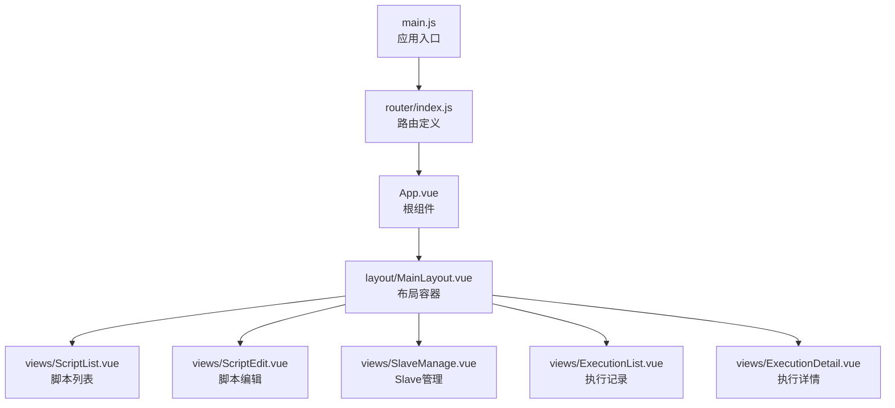
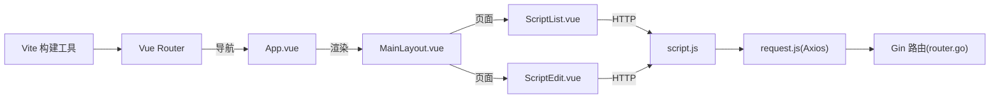

# 路由配置

<cite>
**本文档引用的文件**
- [web/src/router/index.js](file://web/src/router/index.js)
- [web/src/main.js](file://web/src/main.js)
- [web/src/App.vue](file://web/src/App.vue)
- [web/src/layout/MainLayout.vue](file://web/src/layout/MainLayout.vue)
- [web/src/views/ScriptList.vue](file://web/src/views/ScriptList.vue)
- [web/src/views/ScriptEdit.vue](file://web/src/views/ScriptEdit.vue)
- [web/src/api/script.js](file://web/src/api/script.js)
- [web/src/api/request.js](file://web/src/api/request.js)
- [web/vite.config.js](file://web/vite.config.js)
- [internal/router/router.go](file://internal/router/router.go)
</cite>

## 更新摘要
**变更内容**
- 路由组件动态导入优化：所有路由组件已转换为动态导入，启用自动代码分割
- 路由懒加载策略更新：从同步导入改为异步导入，提升首屏加载性能
- Vite 代码分割配置增强：优化了 vendor chunk 分离策略
- Suspense 和加载状态优化：新增路由级别的加载状态管理

## 目录
1. [简介](#简介)
2. [项目结构](#项目结构)
3. [核心组件](#核心组件)
4. [架构总览](#架构总览)
5. [详细组件分析](#详细组件分析)
6. [依赖分析](#依赖分析)
7. [性能考虑](#性能考虑)
8. [故障排查指南](#故障排查指南)
9. [结论](#结论)

## 简介
本文件面向 Vue Router 的路由配置与使用，结合项目实际代码，系统阐述以下主题：
- 路由表的定义与配置规则
- 路由守卫与权限控制机制（基于现有实现的说明）
- 动态路由的使用场景与实现方式
- 路由懒加载与性能优化策略
- 路由参数传递与查询字符串处理
- 路由导航最佳实践与错误处理
- 路由元信息与页面标题管理

## 项目结构
前端采用 Vue 3 + Vue Router 4 + Vite 的现代前端栈；路由位于 web/src/router/index.js，入口在 web/src/main.js 中注册，根组件 App.vue 通过 router-view 渲染当前路由组件。



**图表来源**
- [web/src/main.js:1-23](file://web/src/main.js#L1-L23)
- [web/src/router/index.js:1-56](file://web/src/router/index.js#L1-L56)
- [web/src/App.vue:1-28](file://web/src/App.vue#L1-L28)
- [web/src/layout/MainLayout.vue:1-276](file://web/src/layout/MainLayout.vue#L1-L276)

**章节来源**
- [web/src/router/index.js:1-56](file://web/src/router/index.js#L1-L56)
- [web/src/main.js:1-23](file://web/src/main.js#L1-L23)
- [web/src/App.vue:1-28](file://web/src/App.vue#L1-L28)

## 核心组件
- **路由定义与配置**
  - 使用 createRouter + createWebHistory
  - 定义父子级路由，子路由均挂载于 MainLayout 下
  - 子路由包含脚本管理、编辑、Slave管理、执行记录、执行详情
  - 子路由均设置 meta.title 用于页面标题管理
  - **更新**：所有路由组件已转换为动态导入，启用自动代码分割
- **应用入口与注册**
  - main.js 中安装 router 插件并挂载应用
- **根组件渲染**
  - App.vue 通过 router-view 渲染当前组件，并包裹过渡动画
- **布局组件**
  - MainLayout.vue 提供顶部 Tab 导航，使用 router-link 进行导航，router-view 渲染子路由组件
  - **更新**：新增 Suspense 加载状态管理，提供更好的用户体验

**章节来源**
- [web/src/router/index.js:4-8](file://web/src/router/index.js#L4-L8)
- [web/src/main.js:19-19](file://web/src/main.js#L19-L19)
- [web/src/App.vue:2-6](file://web/src/App.vue#L2-L6)
- [web/src/layout/MainLayout.vue:40-54](file://web/src/layout/MainLayout.vue#L40-L54)

## 架构总览
前端路由与后端 API 的交互关系如下：

```mermaid
graph TB
subgraph "前端"
R["router/index.js<br/>路由定义"]
M["main.js<br/>应用注册"]
A["App.vue<br/>根组件"]
L["layout/MainLayout.vue<br/>布局"]
V1["views/ScriptList.vue"]
V2["views/ScriptEdit.vue"]
API["api/script.js<br/>脚本API"]
REQ["api/request.js<br/>Axios封装"]
VITE["vite.config.js<br/>构建配置"]
END
subgraph "后端"
GR["internal/router/router.go<br/>Gin路由"]
END
M --> R
A --> L
L --> V1
L --> V2
V1 --> API --> REQ --> GR
V2 --> API
R --> A
VITE --> R
```

**图表来源**
- [web/src/router/index.js:1-56](file://web/src/router/index.js#L1-L56)
- [web/src/main.js:1-23](file://web/src/main.js#L1-L23)
- [web/src/App.vue:1-28](file://web/src/App.vue#L1-L28)
- [web/src/layout/MainLayout.vue:1-276](file://web/src/layout/MainLayout.vue#L1-L276)
- [web/src/views/ScriptList.vue:1-200](file://web/src/views/ScriptList.vue#L1-L200)
- [web/src/views/ScriptEdit.vue:1-200](file://web/src/views/ScriptEdit.vue#L1-L200)
- [web/src/api/script.js:1-74](file://web/src/api/script.js#L1-L74)
- [web/src/api/request.js:1-103](file://web/src/api/request.js#L1-L103)
- [web/vite.config.js:30-52](file://web/vite.config.js#L30-L52)
- [internal/router/router.go:14-112](file://internal/router/router.go#L14-L112)

## 详细组件分析

### 路由表定义与配置规则
- **路由层级**
  - 根路径 '/' 对应 MainLayout，并重定向至 '/scripts'
  - 子路由均在 MainLayout.children 中定义，形成"布局 + 多页面"的结构
- **路由路径与组件映射**
  - scripts → ScriptList
  - scripts/:id/edit → ScriptEdit
  - slaves → SlaveManage
  - executions → ExecutionList
  - executions/:id → ExecutionDetail
- **元信息与标题**
  - 每个子路由设置 meta.title，便于统一管理页面标题
- **历史模式**
  - 使用 createWebHistory，适配现代浏览器历史 API
- **动态导入优化**
  - **更新**：所有路由组件已转换为动态导入（如 ScriptList = () => import('@/views/ScriptList.vue')）
  - 启用自动代码分割，按需加载页面组件
  - 减少首屏包体积，提升应用启动性能

**章节来源**
- [web/src/router/index.js:10-47](file://web/src/router/index.js#L10-L47)
- [web/src/router/index.js:4-8](file://web/src/router/index.js#L4-L8)

### 路由守卫与权限控制机制
- **当前实现**
  - 项目未显式定义全局前置/后置守卫或路由独享守卫
  - 页面内导航主要通过 router.push 与 router-link 实现
- **权限控制建议**
  - 可在路由表增加 meta.requiresAuth 字段，结合全局前置守卫进行鉴权
  - 对敏感页面（如执行详情）可在进入前校验用户状态与资源访问权限
  - 结合后端接口返回的状态码（如 401/403）在 Axios 拦截器中统一处理跳转逻辑

**章节来源**
- [web/src/router/index.js:19-43](file://web/src/router/index.js#L19-L43)
- [web/src/api/request.js:42-88](file://web/src/api/request.js#L42-L88)

### 动态路由的使用场景与实现方式
- **使用场景**
  - 脚本编辑页根据路由参数 :id 动态加载对应脚本详情与内容
  - 执行详情页根据 :id 动态加载对应执行记录
- **实现方式**
  - ScriptEdit.vue 通过 useRoute 获取路由参数 id
  - ScriptList.vue 通过 router.push('/scripts/:id/edit') 进行导航
- **动态导入优势**
  - **更新**：组件按需加载，减少初始包大小
  - Vite 自动进行代码分割，生成独立的 chunk
  - 提升首屏加载速度和整体性能
- **最佳实践**
  - 在进入动态路由前进行参数校验与资源存在性检查
  - 对无效 id 或资源不存在的情况，提供友好的降级提示与回退路径

**章节来源**
- [web/src/views/ScriptEdit.vue:310-312](file://web/src/views/ScriptEdit.vue#L310-L312)
- [web/src/views/ScriptList.vue:448-450](file://web/src/views/ScriptList.vue#L448-L450)

### 路由懒加载与性能优化策略
- **当前实现**
  - **更新**：路由组件已改为异步导入（动态 import），启用自动代码分割
  - 减少首屏包体积，提升应用启动性能
- **Vite 代码分割配置**
  - **更新**：优化了 vendor chunk 分离策略
  - monaco-editor → 'monaco-editor' chunk
  - element-plus → 'element-plus' chunk
  - vue-router → 'vue-vendor' chunk
  - 其他第三方库 → 'vendor' chunk
- **其他优化**
  - 使用 keep-alive 缓存不常变动的页面
  - 对大型页面（如编辑器）在进入时再初始化重型实例
  - **新增**：MainLayout.vue 中的 Suspense 加载状态管理

**章节来源**
- [web/src/router/index.js:4-8](file://web/src/router/index.js#L4-L8)
- [web/vite.config.js:30-52](file://web/vite.config.js#L30-L52)
- [web/src/layout/MainLayout.vue:43-52](file://web/src/layout/MainLayout.vue#L43-L52)

### 路由参数传递与查询字符串处理
- **路径参数**
  - 通过路由定义中的 :id 捕获路径参数
  - 在组件中通过 useRoute().params.id 获取
- **查询参数**
  - API 层面通过 request.get('/api/scripts', { params }) 传入查询参数
  - 注意字段命名一致性（如 pageSize/page_size 的兼容处理）
- **示例参考**
  - ScriptList.vue 中分页与搜索参数的传递
  - ScriptEdit.vue 中通过 router.push 进行页面跳转

**章节来源**
- [web/src/views/ScriptEdit.vue:310-312](file://web/src/views/ScriptEdit.vue#L310-L312)
- [web/src/views/ScriptList.vue:375-409](file://web/src/views/ScriptList.vue#L375-L409)
- [web/src/api/script.js:5-11](file://web/src/api/script.js#L5-L11)

### 路由导航最佳实践与错误处理
- **导航最佳实践**
  - 使用 router-link 进行同源导航，保持 SPA 体验
  - 对外部链接使用原生 a 标签或在新窗口打开
  - 在复杂页面（如编辑器）离开前，可通过路由钩子或对话框提示未保存更改
- **错误处理**
  - Axios 拦截器对不同状态码进行统一提示与处理
  - 对重复请求进行去重，避免并发错误
  - 对超时、网络异常、404、403、401 等场景给出明确反馈
- **动态导入错误处理**
  - **新增**：路由组件加载失败时的降级处理
  - Suspense 组件提供加载状态和错误边界

**章节来源**
- [web/src/api/request.js:12-88](file://web/src/api/request.js#L12-L88)
- [web/src/layout/MainLayout.vue:43-52](file://web/src/layout/MainLayout.vue#L43-L52)

### 路由元信息与页面标题管理
- **元信息**
  - 每个子路由设置 meta.title，用于页面标题管理
- **标题更新建议**
  - 可在全局后置守卫中读取 meta.title 并设置 document.title
  - 或在组件生命周期中动态更新标题
- **动态导入影响**
  - **更新**：动态导入不影响元信息的使用
  - 元信息仍然可用于页面标题管理
  - 组件加载状态通过 Suspense 进行管理

**章节来源**
- [web/src/router/index.js:19-43](file://web/src/router/index.js#L19-L43)

## 依赖分析
- **前端路由依赖**
  - Vue 3 + Vue Router 4 + Vite
  - Axios 作为 HTTP 客户端，配合请求/响应拦截器
  - **更新**：Vite 的自动代码分割功能
- **后端路由依赖**
  - Gin 提供 /api/* 接口，静态资源与前端回退由 NoRoute 处理



**图表来源**
- [web/src/router/index.js:1-56](file://web/src/router/index.js#L1-L56)
- [web/src/App.vue:1-28](file://web/src/App.vue#L1-L28)
- [web/src/layout/MainLayout.vue:1-276](file://web/src/layout/MainLayout.vue#L1-L276)
- [web/src/views/ScriptList.vue:1-200](file://web/src/views/ScriptList.vue#L1-L200)
- [web/src/views/ScriptEdit.vue:1-200](file://web/src/views/ScriptEdit.vue#L1-L200)
- [web/src/api/script.js:1-74](file://web/src/api/script.js#L1-L74)
- [web/src/api/request.js:1-103](file://web/src/api/request.js#L1-L103)
- [internal/router/router.go:14-112](file://internal/router/router.go#L14-L112)
- [web/vite.config.js:30-52](file://web/vite.config.js#L30-L52)

**章节来源**
- [web/src/router/index.js:1-56](file://web/src/router/index.js#L1-L56)
- [web/src/api/script.js:1-74](file://web/src/api/script.js#L1-L74)
- [web/src/api/request.js:1-103](file://web/src/api/request.js#L1-L103)
- [internal/router/router.go:14-112](file://internal/router/router.go#L14-L112)

## 性能考虑
- **代码分割与懒加载**
  - **更新**：路由组件已改为动态 import，利用 Vite 的按需加载能力
  - 自动代码分割，减少首屏包体积
  - 按需加载页面组件，提升应用启动速度
- **Vite 构建优化**
  - **更新**：优化的 vendor chunk 分离策略
  - monaco-editor → 'monaco-editor' chunk
  - element-plus → 'element-plus' chunk
  - vue-router → 'vue-vendor' chunk
  - 其他第三方库 → 'vendor' chunk
- **资源与网络**
  - Axios 拦截器内置请求去重，避免重复请求带来的资源浪费
  - 对大文件上传/下载建议使用进度回调与断点续传策略（可扩展）
- **前端回退与缓存**
  - Gin 的 NoRoute 机制确保 SPA 历史模式下刷新不丢失页面
  - Vite 开发服务器代理 /api 与 /reports，减少跨域与调试成本
- **加载状态管理**
  - **新增**：MainLayout.vue 中的 Suspense 组件提供加载状态
  - 路由级别加载状态管理，提升用户体验

**章节来源**
- [web/src/router/index.js:4-8](file://web/src/router/index.js#L4-L8)
- [web/vite.config.js:30-52](file://web/vite.config.js#L30-L52)
- [web/src/api/request.js:12-40](file://web/src/api/request.js#L12-L40)
- [web/src/layout/MainLayout.vue:43-52](file://web/src/layout/MainLayout.vue#L43-L52)
- [internal/router/router.go:92-109](file://internal/router/router.go#L92-L109)

## 故障排查指南
- **常见问题**
  - 404：确认路由路径与后端 /api 前缀是否匹配
  - 403/401：检查鉴权流程与后端返回状态码
  - 网络异常：检查 Vite 代理配置与后端服务是否启动
  - **新增**：动态导入失败：检查组件路径是否正确，确认文件存在
- **定位方法**
  - 在 Axios 响应拦截器中打印错误信息与状态码
  - 在路由组件中捕获参数错误并给出降级提示
  - **新增**：检查浏览器开发者工具中的 Network 标签，确认 chunk 加载状态
- **建议**
  - 在全局后置守卫中统一处理错误与回退
  - 对关键页面增加加载态与空状态提示
  - **新增**：利用 Suspense 的 fallback 组件提供更好的加载体验

**章节来源**
- [web/src/api/request.js:55-88](file://web/src/api/request.js#L55-L88)
- [web/src/layout/MainLayout.vue:43-52](file://web/src/layout/MainLayout.vue#L43-L52)
- [internal/router/router.go:92-109](file://internal/router/router.go#L92-L109)

## 结论
本项目采用标准的 Vue Router 4 + 布局 + 子页面的路由结构，配合 Axios 的统一拦截与后端 Gin 的 API 路由，实现了清晰的前后端分离架构。**最新更新**：路由组件已全面转换为动态导入，启用自动代码分割，显著提升了应用性能和用户体验。建议后续引入路由守卫完善权限控制，在全局后置守卫中完成页面标题与错误处理的统一管理，并充分利用 Vite 的构建优化策略，以进一步提升安全性与用户体验。