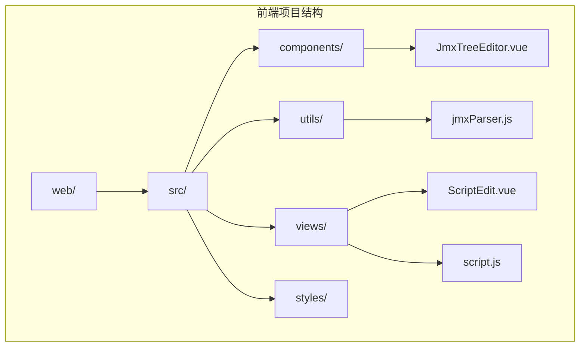
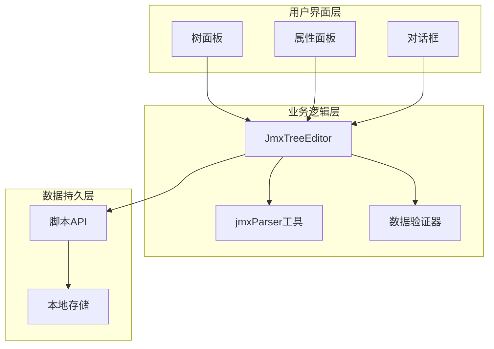
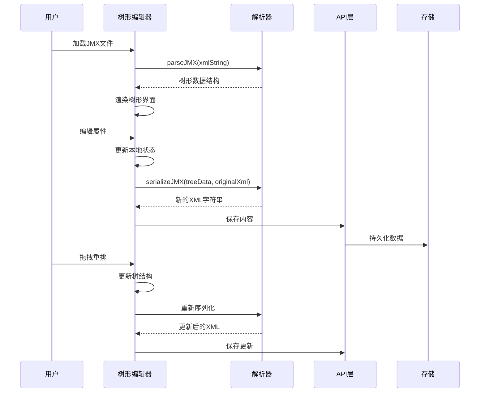
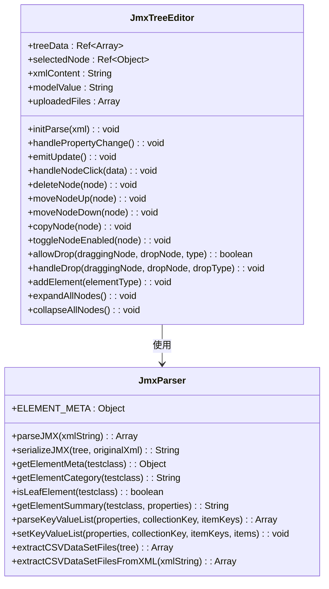
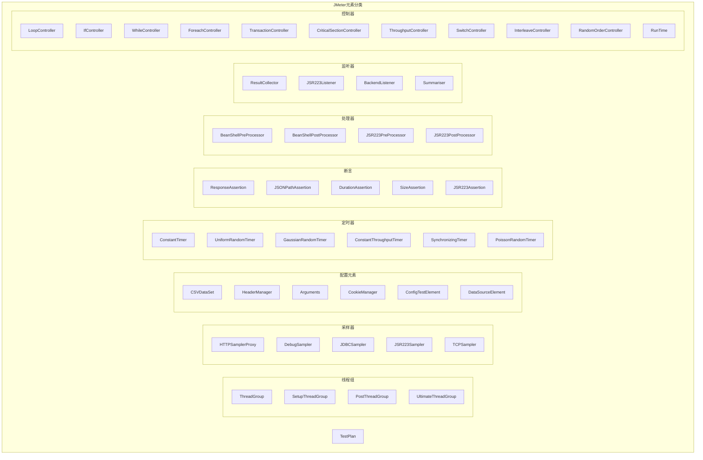
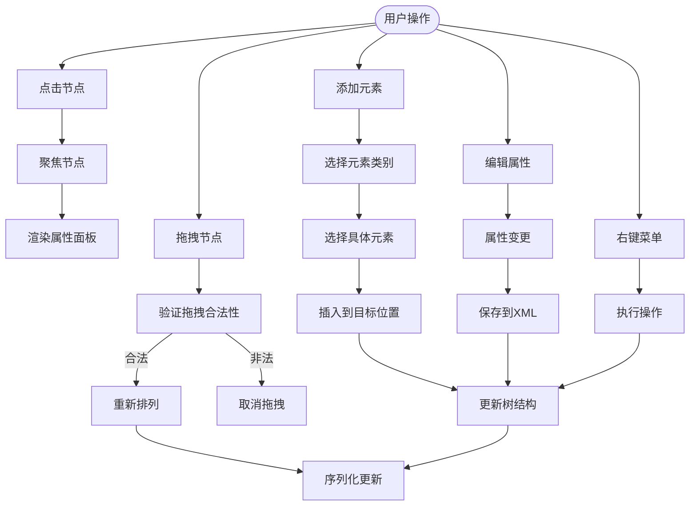
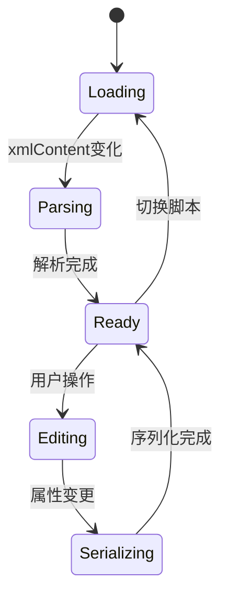
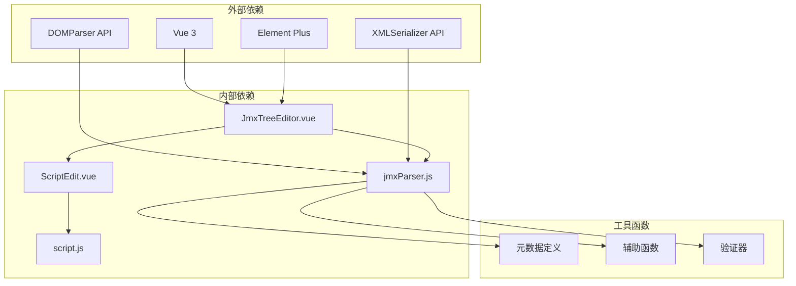

# JMX树形编辑器

<cite>
**本文档引用的文件**
- [JmxTreeEditor.vue](file://web/src/components/JmxTreeEditor.vue)
- [jmxParser.js](file://web/src/utils/jmxParser.js)
- [ScriptEdit.vue](file://web/src/views/ScriptEdit.vue)
- [script.js](file://web/src/api/script.js)
- [index.scss](file://web/src/styles/index.scss)
- [index.js](file://web/src/router/index.js)
- [README.md](file://README.md)
</cite>

## 目录
1. [简介](#简介)
2. [项目结构](#项目结构)
3. [核心组件](#核心组件)
4. [架构概览](#架构概览)
5. [详细组件分析](#详细组件分析)
6. [依赖分析](#依赖分析)
7. [性能考虑](#性能考虑)
8. [故障排除指南](#故障排除指南)
9. [结论](#结论)
10. [附录](#附录)

## 简介

JMX树形编辑器是JMeter Admin项目中的核心组件，为用户提供了一个直观、高效的JMeter脚本可视化编辑界面。该组件实现了完整的JMX文件XML解析、树形结构展示、节点编辑和操作功能，支持复杂的JMeter元素层次结构管理。

JMeter Admin是一个轻量级的JMeter分布式压测管理平台，采用Go (Gin) + Vue 3 (Element Plus) + SQLite技术栈开发。前端资源嵌入后端二进制文件，编译后生成单个可执行文件，实现零依赖部署。

## 项目结构

JMX树形编辑器位于前端项目的组件目录中，与解析工具和视图层紧密集成：

**图表来源**
- [JmxTreeEditor.vue:1-50](file://web/src/components/JmxTreeEditor.vue#L1-L50)
- [jmxParser.js:1-20](file://web/src/utils/jmxParser.js#L1-L20)
- [ScriptEdit.vue:1-50](file://web/src/views/ScriptEdit.vue#L1-L50)

**章节来源**
- [README.md:92-120](file://README.md#L92-L120)

## 核心组件

JMX树形编辑器由三个主要部分组成：

### 1. 树形编辑器核心组件
- **JmxTreeEditor.vue**: 主要的树形编辑器组件，负责UI渲染和用户交互
- **jmxParser.js**: JMX文件解析和序列化工具，提供XML DOM操作和节点遍历功能

### 2. 集成组件
- **ScriptEdit.vue**: 脚本编辑视图，集成JMX树形编辑器和XML编辑器
- **script.js**: API封装，处理脚本内容的获取和保存

### 3. 工具函数
- **元数据定义**: 完整的JMeter元素元数据定义，支持100+种JMeter组件
- **属性定义**: 针对不同元素类型的属性编辑器配置
- **分类系统**: 基于JMeter元素类别的智能分类和权限控制

**章节来源**
- [JmxTreeEditor.vue:542-615](file://web/src/components/JmxTreeEditor.vue#L542-L615)
- [jmxParser.js:11-790](file://web/src/utils/jmxParser.js#L11-L790)

## 架构概览

JMX树形编辑器采用模块化架构设计，实现了清晰的职责分离：

**图表来源**
- [JmxTreeEditor.vue:1-100](file://web/src/components/JmxTreeEditor.vue#L1-L100)
- [jmxParser.js:942-943](file://web/src/utils/jmxParser.js#L942-L943)

### 组件交互流程

**图表来源**
- [JmxTreeEditor.vue:1029-1041](file://web/src/components/JmxTreeEditor.vue#L1029-L1041)
- [jmxParser.js:1728-1756](file://web/src/utils/jmxParser.js#L1728-L1756)

## 详细组件分析

### JmxTreeEditor组件架构

JmxTreeEditor组件采用了现代化的Vue 3 Composition API设计，实现了高度模块化的架构：

**图表来源**
- [JmxTreeEditor.vue:542-1599](file://web/src/components/JmxTreeEditor.vue#L542-L1599)
- [jmxParser.js:800-1949](file://web/src/utils/jmxParser.js#L800-L1949)

### XML解析和序列化机制

JMX树形编辑器的核心能力在于其强大的XML解析和序列化机制：

#### 解析流程
1. **DOM解析**: 使用DOMParser将XML字符串转换为DOM对象
2. **结构验证**: 验证根元素为`jmeterTestPlan`
3. **哈希树遍历**: 递归解析`hashTree`结构
4. **元素属性提取**: 解析各种属性节点（stringProp、intProp、boolProp等）
5. **嵌套结构处理**: 支持复杂嵌套的elementProp和collectionProp结构

#### 序列化流程
1. **增量更新**: 基于原始XML进行增量更新，保留未定义的属性
2. **属性映射**: 将树形结构中的属性映射到相应的XML节点
3. **集合处理**: 特殊处理键值对列表和字符串列表
4. **HTTP Body处理**: 专门处理HTTP请求的body属性

**章节来源**
- [jmxParser.js:1216-1285](file://web/src/utils/jmxParser.js#L1216-L1285)
- [jmxParser.js:1728-1756](file://web/src/utils/jmxParser.js#L1728-L1756)

### 元数据管理系统

JMX树形编辑器内置了完整的元数据管理系统，支持100多种JMeter元素：

#### 元素分类系统

**图表来源**
- [jmxParser.js:11-790](file://web/src/utils/jmxParser.js#L11-L790)

#### 属性定义系统
每个JMeter元素都有详细的属性定义，支持多种编辑器类型：

| 属性类型 | 编辑器 | 示例用途 | 复杂度 |
|---------|--------|----------|--------|
| string | 文本输入框 | 字符串属性 | 简单 |
| number | 数字输入框 | 数值属性 | 简单 |
| boolean | 开关控件 | 布尔属性 | 简单 |
| select | 下拉选择器 | 枚举属性 | 中等 |
| textarea | 多行文本框 | 复杂文本 | 中等 |
| keyValueList | 键值对表格 | 配置列表 | 复杂 |
| stringList | 字符串列表 | 匹配规则 | 中等 |
| threadSchedule | 线程调度表格 | UltimateThreadGroup | 复杂 |

**章节来源**
- [jmxParser.js:11-790](file://web/src/utils/jmxParser.js#L11-L790)
- [JmxTreeEditor.vue:277-466](file://web/src/components/JmxTreeEditor.vue#L277-L466)

### 交互设计分析

#### 树形界面交互
JMX树形编辑器提供了丰富的用户交互功能：

**图表来源**
- [JmxTreeEditor.vue:988-1068](file://web/src/components/JmxTreeEditor.vue#L988-L1068)
- [JmxTreeEditor.vue:1478-1483](file://web/src/components/JmxTreeEditor.vue#L1478-L1483)

#### 节点操作功能
组件支持以下核心操作：

1. **节点展开/折叠**: 支持全展开和全折叠功能
2. **节点搜索**: 基于名称、类型、摘要的全文搜索
3. **节点移动**: 上移、下移功能，支持边界检查
4. **节点复制**: 深拷贝整个节点树，包括所有子节点
5. **节点删除**: 安全删除，防止误删TestPlan
6. **节点启用/禁用**: 动态控制节点执行状态

**章节来源**
- [JmxTreeEditor.vue:1204-1210](file://web/src/components/JmxTreeEditor.vue#L1204-L1210)
- [JmxTreeEditor.vue:1565-1599](file://web/src/components/JmxTreeEditor.vue#L1565-L1599)

### 数据绑定机制

JMX树形编辑器采用了双向数据绑定机制，确保UI状态与数据状态的同步：

#### 响应式状态管理

**图表来源**
- [JmxTreeEditor.vue:674-707](file://web/src/components/JmxTreeEditor.vue#L674-L707)

#### 状态同步策略
1. **XML状态**: 通过v-model双向绑定，实时同步到父组件
2. **树状态**: 本地响应式状态，支持快速UI更新
3. **属性状态**: 单独的状态管理，支持复杂属性编辑器
4. **历史状态**: 内置撤销/重做功能

**章节来源**
- [JmxTreeEditor.vue:658-755](file://web/src/components/JmxTreeEditor.vue#L658-L755)

### 性能优化策略

#### 大文件处理优化
1. **懒加载**: 树节点按需渲染，避免一次性渲染大量节点
2. **虚拟滚动**: 对于大型树形结构，使用虚拟滚动减少DOM节点数量
3. **增量更新**: 仅更新发生变化的节点，而非整个树
4. **缓存机制**: 缓存解析结果和元数据定义

#### 内存管理
1. **对象池**: 复用节点对象，减少垃圾回收压力
2. **弱引用**: 对DOM节点使用弱引用，避免内存泄漏
3. **及时清理**: 在组件销毁时清理所有事件监听器

#### 渲染优化
1. **批量更新**: 使用Vue的批量更新机制减少重绘
2. **防抖处理**: 对频繁的用户操作进行防抖处理
3. **异步渲染**: 复杂操作使用异步渲染，避免阻塞UI

**章节来源**
- [JmxTreeEditor.vue:1172-1188](file://web/src/components/JmxTreeEditor.vue#L1172-L1188)

## 依赖分析

### 组件间依赖关系

**图表来源**
- [JmxTreeEditor.vue:542-597](file://web/src/components/JmxTreeEditor.vue#L542-L597)
- [jmxParser.js:800-943](file://web/src/utils/jmxParser.js#L800-L943)

### 外部API集成

JMX树形编辑器通过ScriptEdit视图与后端API集成：

| API端点 | 方法 | 功能 | 参数 |
|---------|------|------|------|
| /api/scripts | GET | 获取脚本列表 | 分页参数 |
| /api/scripts/:id | GET | 获取脚本详情 | 脚本ID |
| /api/scripts/:id/content | GET | 获取JMX内容 | 脚本ID |
| /api/scripts/:id/content | PUT | 保存JMX内容 | 脚本ID, 内容 |
| /api/scripts/:id/files | POST | 上传附件 | 脚本ID, 文件 |

**章节来源**
- [script.js:1-74](file://web/src/api/script.js#L1-L74)

## 性能考虑

### 大型JMX文件处理

对于包含数千个节点的大型JMX文件，JMX树形编辑器采用了以下优化策略：

1. **分页渲染**: 仅渲染可见区域内的节点
2. **延迟加载**: 子节点在展开时才加载
3. **虚拟DOM**: 使用虚拟DOM减少真实DOM操作
4. **增量更新**: 仅更新发生变化的部分

### 内存使用优化

1. **对象复用**: 复用节点对象和属性对象
2. **垃圾回收**: 及时释放不再使用的对象引用
3. **内存监控**: 提供内存使用情况监控

### 网络性能优化

1. **请求合并**: 将多个小请求合并为批量请求
2. **缓存策略**: 缓存常用的元数据和配置
3. **压缩传输**: 对传输的数据进行压缩

## 故障排除指南

### 常见问题及解决方案

#### XML解析错误
**症状**: 加载JMX文件时报错，提示XML格式错误
**原因**: XML格式不符合JMeter规范
**解决方案**: 
1. 检查XML语法是否正确
2. 确保根元素为`jmeterTestPlan`
3. 验证所有标签都正确闭合

#### 元素类型不支持
**症状**: 某些JMeter元素无法正确显示或编辑
**原因**: 元数据定义中缺少该元素类型
**解决方案**:
1. 检查ELEMENT_META中是否包含该元素
2. 如需支持新元素，添加相应的元数据定义

#### 属性编辑异常
**症状**: 属性编辑器显示异常或无法保存
**原因**: 属性定义不完整或类型不匹配
**解决方案**:
1. 检查属性定义中的type字段
2. 确保defaultValue与属性类型匹配
3. 验证special标记是否正确设置

#### 性能问题
**症状**: 大型JMX文件加载缓慢或界面卡顿
**原因**: 节点过多导致渲染压力
**解决方案**:
1. 启用懒加载功能
2. 减少同时展开的节点层级
3. 使用搜索功能定位特定节点

**章节来源**
- [jmxParser.js:1216-1285](file://web/src/utils/jmxParser.js#L1216-L1285)

## 结论

JMX树形编辑器是一个功能强大、设计精良的JMeter脚本可视化编辑组件。它成功地解决了JMeter脚本编辑的技术挑战，提供了直观易用的用户体验。

### 主要优势

1. **完整的JMeter支持**: 支持100+种JMeter元素，涵盖所有常用场景
2. **强大的解析能力**: 基于DOM解析，能够处理复杂的嵌套结构
3. **丰富的交互功能**: 提供拖拽、搜索、批量操作等高级功能
4. **良好的性能表现**: 通过多种优化策略支持大型JMX文件
5. **完善的错误处理**: 提供详细的错误信息和恢复机制

### 技术亮点

1. **模块化设计**: 清晰的职责分离和依赖管理
2. **响应式架构**: 基于Vue 3的现代前端架构
3. **元数据驱动**: 通过元数据定义实现高度可配置性
4. **增量更新**: 最小化更新策略提升性能
5. **类型安全**: 严格的类型检查和验证机制

JMX树形编辑器不仅满足了当前的功能需求，还为未来的扩展和定制化提供了良好的基础。它代表了JMeter脚本编辑领域的一个重要进步，为用户提供了更加高效和可靠的JMeter使用体验。

## 附录

### 扩展和定制化指导

#### 添加新元素类型
1. 在ELEMENT_META中添加元素定义
2. 定义属性列表和编辑器类型
3. 实现必要的特殊处理逻辑
4. 更新分类系统和权限控制

#### 自定义属性编辑器
1. 在元数据中定义新的属性类型
2. 在组件中实现对应的编辑器组件
3. 处理属性值的序列化和反序列化
4. 添加必要的验证逻辑

#### 性能优化建议
1. 对于超大型JMX文件，考虑实现虚拟滚动
2. 添加节点缓存机制
3. 优化XML解析算法
4. 实现增量备份功能