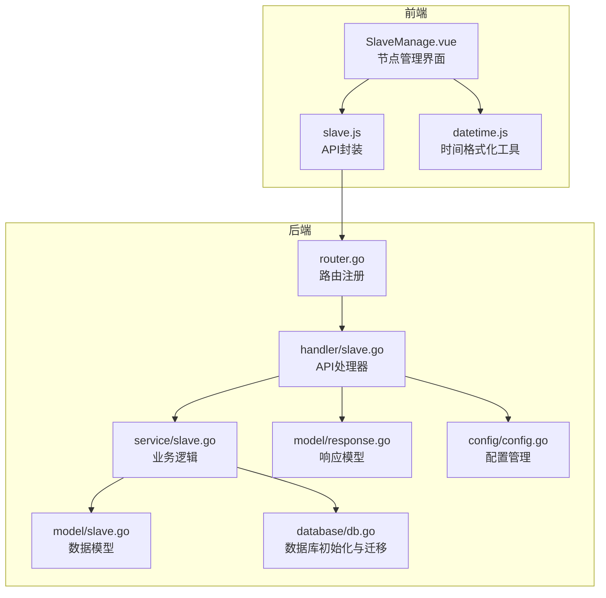
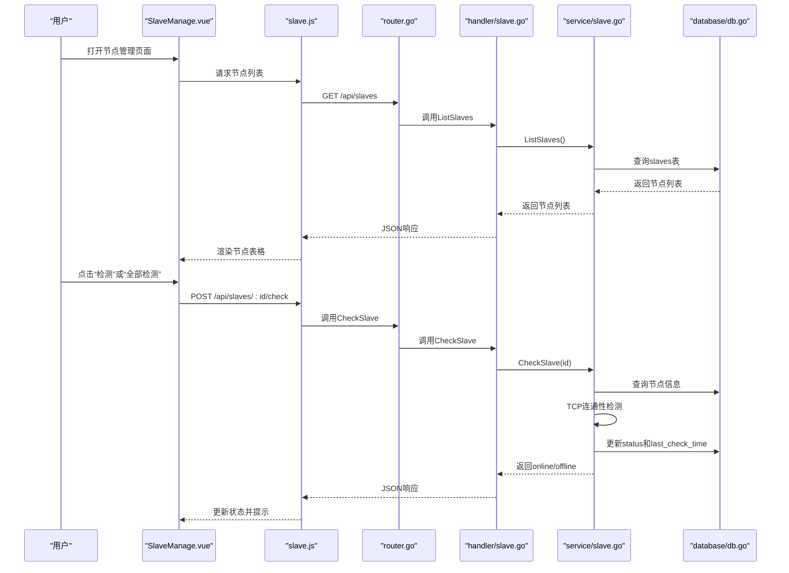
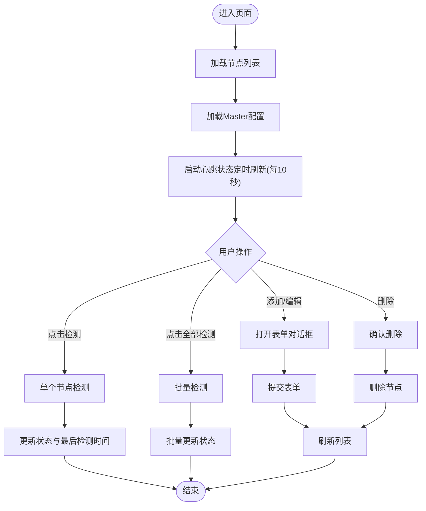
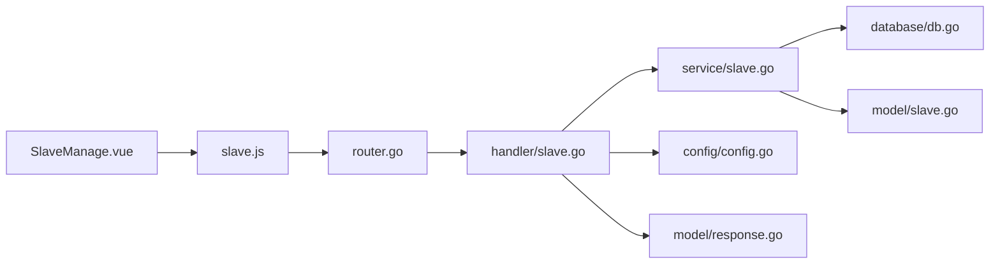

# Slave管理组件

<cite>
**本文引用的文件**
- [SlaveManage.vue](file://web/src/views/SlaveManage.vue)
- [slave.js](file://web/src/api/slave.js)
- [slave.go](file://internal/handler/slave.go)
- [slave.go](file://internal/service/slave.go)
- [slave.go](file://internal/model/slave.go)
- [router.go](file://internal/router/router.go)
- [db.go](file://internal/database/db.go)
- [config.go](file://config/config.go)
- [datetime.js](file://web/src/utils/datetime.js)
- [response.go](file://internal/model/response.go)
- [README.md](file://README.md)
</cite>

## 目录
1. [简介](#简介)
2. [项目结构](#项目结构)
3. [核心组件](#核心组件)
4. [架构概览](#架构概览)
5. [详细组件分析](#详细组件分析)
6. [依赖分析](#依赖分析)
7. [性能考虑](#性能考虑)
8. [故障排查指南](#故障排查指南)
9. [结论](#结论)
10. [附录](#附录)

## 简介
本文件详细阐述Slave管理组件的设计与实现，涵盖Slave节点列表展示、节点状态监控、节点配置管理、连通性检测、实时心跳机制、与Slave管理API的交互模式、用户交互设计、错误处理与故障恢复、性能监控与日志记录，以及该组件在分布式测试架构中的作用与使用场景。

## 项目结构
该项目采用“后端(Go Gin) + 前端(Vue 3 + Element Plus) + SQLite”的技术栈，前端资源嵌入后端二进制文件，实现单文件部署。Slave管理组件位于前端页面，后端提供REST API，数据持久化使用SQLite。

图表来源
- [router.go:38-47](file://internal/router/router.go#L38-L47)
- [slave.go:16-24](file://internal/handler/slave.go#L16-L24)
- [slave.go:15-41](file://internal/service/slave.go#L15-L41)
- [slave.go:3-11](file://internal/model/slave.go#L3-L11)
- [db.go:15-34](file://internal/database/db.go#L15-L34)
- [config.go:10-39](file://config/config.go#L10-L39)
- [datetime.js:33-70](file://web/src/utils/datetime.js#L33-L70)

章节来源
- [README.md:92-120](file://README.md#L92-L120)
- [router.go:14-112](file://internal/router/router.go#L14-L112)

## 核心组件
- 前端组件：SlaveManage.vue负责节点列表展示、Master配置、连通性检测、批量检测、添加/编辑/删除节点、实时心跳状态刷新。
- API封装：slave.js定义了与后端交互的REST接口，包括节点查询、状态检查、配置更新、心跳状态获取等。
- 后端处理器：handler/slave.go提供HTTP接口，处理节点增删改查、连通性检测、Master配置读写、心跳状态聚合。
- 业务逻辑：service/slave.go实现数据库操作、连通性检测、心跳检测任务调度。
- 数据模型：model/slave.go定义Slave实体字段；model/response.go统一响应格式。
- 数据库：database/db.go负责SQLite初始化、表创建与迁移，含slaves表及last_check_time列。
- 配置：config/config.go管理全局配置，包括JMeter Master主机名、心跳间隔等。

章节来源
- [SlaveManage.vue:1-570](file://web/src/views/SlaveManage.vue#L1-L570)
- [slave.js:3-48](file://web/src/api/slave.js#L3-L48)
- [slave.go:16-235](file://internal/handler/slave.go#L16-L235)
- [slave.go:15-220](file://internal/service/slave.go#L15-L220)
- [slave.go:3-11](file://internal/model/slave.go#L3-L11)
- [response.go:3-46](file://internal/model/response.go#L3-L46)
- [db.go:66-78](file://internal/database/db.go#L66-L78)
- [config.go:10-39](file://config/config.go#L10-L39)

## 架构概览
Slave管理组件遵循前后端分离架构，前端通过API封装调用后端路由，后端路由分发到处理器，处理器调用业务逻辑层，业务逻辑层操作数据库，最终返回统一响应格式。

图表来源
- [router.go:38-47](file://internal/router/router.go#L38-L47)
- [slave.go:16-122](file://internal/handler/slave.go#L16-L122)
- [slave.go:15-157](file://internal/service/slave.go#L15-L157)
- [db.go:66-78](file://internal/database/db.go#L66-L78)

## 详细组件分析

### 前端组件：SlaveManage.vue
- 节点列表展示：使用Element Plus表格展示节点名称、主机地址、端口、状态、最后检测时间、创建时间，并提供排序与省略显示。
- Master节点配置：展示并允许选择本机网卡IP作为Master主机名，支持自动检测与手动更新，更新后持久化到配置文件。
- 连通性检测：支持单个节点检测与批量检测，检测结果更新表格状态并给出消息提示。
- 实时心跳状态：每10秒刷新一次心跳状态，仅更新状态与最后检测时间，避免全量刷新。
- 用户交互：提供添加、编辑、删除节点的对话框，包含表单校验与提交流程。

图表来源
- [SlaveManage.vue:307-569](file://web/src/views/SlaveManage.vue#L307-L569)

章节来源
- [SlaveManage.vue:1-570](file://web/src/views/SlaveManage.vue#L1-L570)
- [datetime.js:33-70](file://web/src/utils/datetime.js#L33-L70)

### API封装：slave.js
- 节点管理：getList、create、update、delete
- 连通性检测：checkConnectivity
- 配置管理：getNetworkInterfaces、getMasterHostname、updateMasterHostname
- 心跳状态：getHeartbeatStatus

章节来源
- [slave.js:3-48](file://web/src/api/slave.js#L3-L48)

### 后端处理器：handler/slave.go
- 节点管理：ListSlaves、CreateSlave、UpdateSlave、DeleteSlave
- 连通性检测：CheckSlave，同时返回online与status字段以兼容前端
- 配置管理：GetNetworkInterfaces、GetMasterHostname、UpdateMasterHostname
- 心跳状态：GetHeartbeatStatus，聚合所有节点的心跳信息与最后检测时间

章节来源
- [slave.go:16-235](file://internal/handler/slave.go#L16-L235)

### 业务逻辑：service/slave.go
- 数据访问：ListSlaves、CreateSlave、UpdateSlave、DeleteSlave
- 连通性检测：CheckSlave，基于TCP超时连接判断在线状态，并更新状态与最后检测时间
- 心跳检测：StartHeartbeat与checkAllSlaves，使用信号量限制并发（默认10），定时批量检测并更新数据库

章节来源
- [slave.go:15-220](file://internal/service/slave.go#L15-L220)

### 数据模型与响应
- Slave模型：包含id、name、host、port、status、last_check_time、created_at
- 统一响应：Success/Error/ErrorWithCode/PageSuccess，保证前后端一致的响应格式

章节来源
- [slave.go:3-11](file://internal/model/slave.go#L3-L11)
- [response.go:3-46](file://internal/model/response.go#L3-L46)

### 数据库与配置
- 数据库初始化：SQLite，表创建与迁移，包含slaves表及last_check_time列
- 配置管理：JMeter Master主机名、心跳间隔等，支持动态更新并持久化

章节来源
- [db.go:15-34](file://internal/database/db.go#L15-L34)
- [db.go:66-78](file://internal/database/db.go#L66-L78)
- [db.go:161-171](file://internal/database/db.go#L161-L171)
- [config.go:10-39](file://config/config.go#L10-L39)

## 依赖分析
- 前端依赖：Vue 3、Element Plus、axios封装的request模块（未在本文列出具体文件，但被slave.js引用）
- 后端依赖：Gin框架、SQLite驱动、YAML配置解析
- 组件耦合：前端通过API封装与后端解耦；后端通过路由、处理器、服务层分层解耦；数据库通过统一初始化与迁移接口管理

图表来源
- [router.go:14-112](file://internal/router/router.go#L14-L112)
- [slave.go:16-235](file://internal/handler/slave.go#L16-L235)
- [slave.go:15-220](file://internal/service/slave.go#L15-L220)
- [db.go:15-34](file://internal/database/db.go#L15-L34)
- [config.go:10-39](file://config/config.go#L10-L39)
- [slave.go:3-11](file://internal/model/slave.go#L3-L11)
- [response.go:3-46](file://internal/model/response.go#L3-L46)

## 性能考虑
- 并发控制：心跳检测使用信号量限制最大并发（默认10），避免大量节点同时检测导致资源耗尽
- 定时刷新：前端每10秒刷新心跳状态，减少频繁全量刷新带来的压力
- 数据库索引：为执行记录等表建立索引，提升查询性能（虽然与Slave管理直接关联不大，但体现整体性能优化思路）
- 连接超时：连通性检测设置TCP超时（默认3秒），避免长时间阻塞
- 前端渲染：表格使用虚拟滚动与省略显示，提升大数据量下的渲染性能

章节来源
- [slave.go:179-189](file://internal/service/slave.go#L179-L189)
- [SlaveManage.vue:541-549](file://web/src/views/SlaveManage.vue#L541-L549)

## 故障排查指南
- 连接失败
  - 检查Master主机名配置是否正确，多网卡环境下必须显式指定
  - 确认防火墙开放端口（默认50000、1099）
  - Slave端禁用RMI SSL：-Dserver.rmi.ssl.disable=true
- 节点状态异常
  - 使用“检测”或“全部检测”功能验证连通性
  - 查看最后检测时间与状态是否更新
- 配置更新失败
  - 确认配置文件写入权限
  - 如需重置，删除数据库文件后重启服务重建表结构
- 前端无数据
  - 检查API是否可达（CORS已开启）
  - 确认后端服务已启动且端口正确

章节来源
- [README.md:292-311](file://README.md#L292-L311)
- [slave.go:176-198](file://internal/handler/slave.go#L176-L198)
- [db.go:161-171](file://internal/database/db.go#L161-L171)

## 结论
Slave管理组件通过清晰的前后端分层与统一的API契约，实现了节点的全生命周期管理与实时状态监控。其心跳检测机制、批量检测能力与Master配置管理，使得分布式压测环境的节点运维更加高效与可靠。配合完善的错误处理与性能优化策略，该组件在生产环境中具备良好的稳定性与可维护性。

## 附录
- API定义（节选）
  - GET /api/slaves：获取节点列表
  - POST /api/slaves：创建节点
  - PUT /api/slaves/:id：更新节点
  - DELETE /api/slaves/:id：删除节点
  - POST /api/slaves/:id/check：连通性检测
  - GET /api/slaves/heartbeat-status：心跳状态
  - GET /api/config/network-interfaces：网卡列表
  - GET /api/config/master-hostname：Master IP
  - PUT /api/config/master-hostname：更新Master IP

章节来源
- [README.md:139-174](file://README.md#L139-L174)