# 前端组件详解

<cite>
**本文档引用的文件**
- [main.js](file://web/src/main.js)
- [App.vue](file://web/src/App.vue)
- [router/index.js](file://web/src/router/index.js)
- [layout/MainLayout.vue](file://web/src/layout/MainLayout.vue)
- [views/ScriptList.vue](file://web/src/views/ScriptList.vue)
- [api/request.js](file://web/src/api/request.js)
- [api/script.js](file://web/src/api/script.js)
- [api/execution.js](file://web/src/api/execution.js)
- [components/ExecuteDialog.vue](file://web/src/components/ExecuteDialog.vue)
- [components/FileUpload.vue](file://web/src/components/FileUpload.vue)
- [components/JmxTreeEditor.vue](file://web/src/components/JmxTreeEditor.vue)
- [components/MetricTrendChart.vue](file://web/src/components/MetricTrendChart.vue)
- [views/ScriptEdit.vue](file://web/src/views/ScriptEdit.vue)
- [views/SlaveManage.vue](file://web/src/views/SlaveManage.vue)
- [views/ExecutionList.vue](file://web/src/views/ExecutionList.vue)
- [views/ExecutionDetail.vue](file://web/src/views/ExecutionDetail.vue)
- [utils/jmxParser.js](file://web/src/utils/jmxParser.js)
- [utils/datetime.js](file://web/src/utils/datetime.js)
- [styles/index.scss](file://web/src/styles/index.scss)
- [package.json](file://web/package.json)
- [internal/service/csv_split.go](file://internal/service/csv_split.go)
</cite>

## 更新摘要
**变更内容**
- 新增Vue 3 Suspense懒加载机制：MainLayout.vue实现路由级Suspense组件
- 新增defineAsyncComponent懒加载：ScriptList.vue使用defineAsyncComponent延迟加载ExecuteDialog
- 新增并发API调用优化：ScriptList.vue使用Promise.all并行获取统计数据
- 新增请求去重机制：api/request.js实现重复请求自动取消
- 新增路由级代码分割：router/index.js使用动态导入实现按需加载

## 目录
1. [简介](#简介)
2. [项目结构](#项目结构)
3. [核心组件](#核心组件)
4. [架构概览](#架构概览)
5. [详细组件分析](#详细组件分析)
6. [依赖关系分析](#依赖关系分析)
7. [性能考虑](#性能考虑)
8. [故障排除指南](#故障排除指南)
9. [结论](#结论)

## 简介

JMeter Admin 是一个基于 Vue 3 和 Element Plus 的现代化 JMeter 脚本管理平台。本文档深入分析前端核心组件的设计与实现，涵盖文件上传组件、JMX 树形编辑器、执行对话框、指标趋势图表等关键 UI 组件。

该平台采用暗色主题设计，提供完整的 JMeter 脚本编辑、管理和执行功能，支持可视化编辑和 XML 源码编辑两种模式。最新版本引入了先进的懒加载机制和性能优化策略，包括Vue 3 Suspense组件、defineAsyncComponent异步组件加载、Promise.all并发API调用优化以及请求去重机制。

## 项目结构

前端项目采用模块化架构，主要目录结构如下：

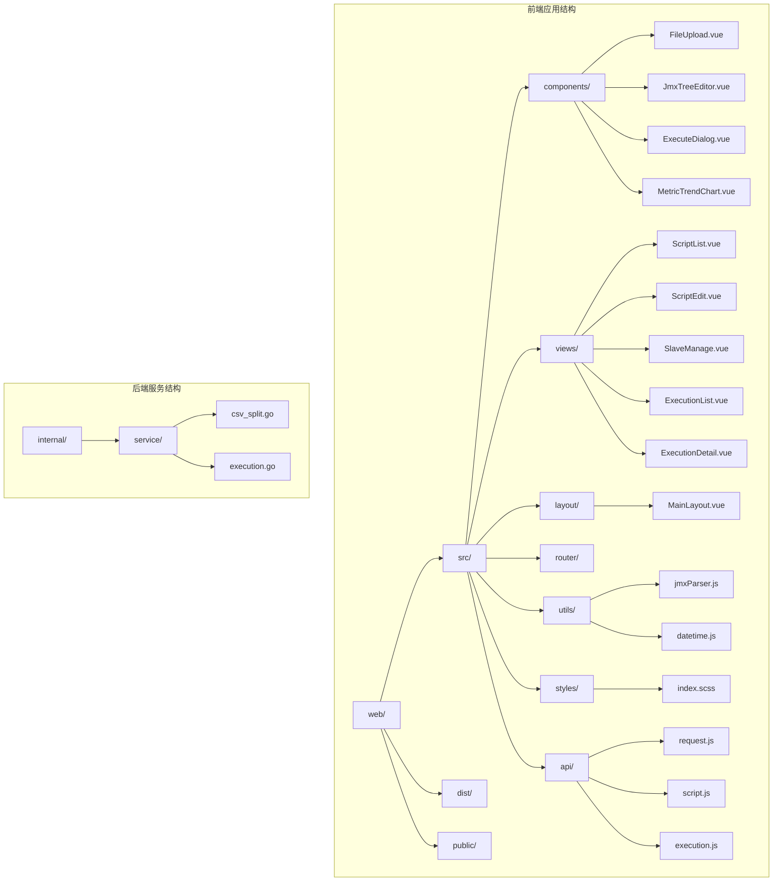

**图表来源**
- [main.js:1-23](file://web/src/main.js#L1-L23)
- [router/index.js:1-56](file://web/src/router/index.js#L1-L56)
- [csv_split.go:1-145](file://internal/service/csv_split.go#L1-L145)

**章节来源**
- [main.js:1-23](file://web/src/main.js#L1-L23)
- [package.json:1-24](file://web/package.json#L1-L24)

## 核心组件

### 路由级懒加载布局 (MainLayout.vue)

MainLayout.vue 实现了Vue 3 Suspense组件，为整个应用提供统一的路由级懒加载体验。

**主要特性：**
- Vue 3 Suspense组件实现异步组件加载
- 统一的加载状态显示和用户体验
- 页面切换时的平滑过渡动画
- 自定义加载界面和视觉反馈

**Suspense实现细节：**
- 在router-view中包裹Suspense组件
- 提供自定义fallback模板
- 展示"页面资源加载中"的友好提示
- 支持按需加载当前页面模块

**章节来源**
- [layout/MainLayout.vue:41-54](file://web/src/layout/MainLayout.vue#L41-L54)
- [layout/MainLayout.vue:43-52](file://web/src/layout/MainLayout.vue#L43-L52)

### 异步组件加载 (ScriptList.vue)

ScriptList.vue 使用defineAsyncComponent实现ExecuteDialog的懒加载，优化首屏加载性能。

**主要特性：**
- defineAsyncComponent实现组件级异步加载
- 延迟加载ExecuteDialog组件
- 减少初始包体积和加载时间
- 按需加载大型对话框组件

**异步加载实现：**
- 使用defineAsyncComponent动态导入ExecuteDialog
- 组件首次使用时才加载
- 支持加载状态和错误处理
- 保持组件间通信的无缝体验

**章节来源**
- [views/ScriptList.vue:290](file://web/src/views/ScriptList.vue#L290)
- [views/ScriptList.vue:214-221](file://web/src/views/ScriptList.vue#L214-L221)

### 并发API调用优化 (ScriptList.vue)

ScriptList.vue 使用Promise.all实现并发API调用，提升数据获取效率。

**主要特性：**
- Promise.all并行执行多个API请求
- 同时获取脚本统计和执行统计
- 减少总等待时间和网络往返
- 优化用户体验和响应速度

**并发优化实现：**
- fetchStats函数中使用Promise.all
- 同时请求scriptApi.getStats()和executionApi.getStats()
- 并行处理多个独立的数据源
- 统一的错误处理和状态管理

**章节来源**
- [views/ScriptList.vue:354-371](file://web/src/views/ScriptList.vue#L354-L371)
- [views/ScriptList.vue:357-360](file://web/src/views/ScriptList.vue#L357-L360)

### 请求去重机制 (api/request.js)

api/request.js 实现了请求去重机制，避免重复请求和资源浪费。

**主要特性：**
- 自动检测和取消重复请求
- 基于请求键值的去重策略
- AbortController实现请求取消
- 完整的请求生命周期管理

**去重机制实现：**
- generateRequestKey生成唯一请求标识
- pendingRequests Map存储进行中的请求
- 自动取消相同请求的重复调用
- 支持超时和错误的请求清理

**章节来源**
- [api/request.js:12-18](file://web/src/api/request.js#L12-L18)
- [api/request.js:20-40](file://web/src/api/request.js#L20-L40)

### 文件上传组件 (FileUpload)

文件上传组件提供了灵活的文件选择和管理功能，支持多种文件格式和上传模式。

**主要特性：**
- 支持拖拽上传和点击选择
- 多文件上传限制
- 实时文件列表展示
- 文件大小格式化显示
- 自定义接受文件类型

**组件属性：**
- `accept`: 接受的文件类型，默认 '*'
- `multiple`: 是否允许多文件上传，默认 true
- `limit`: 文件数量限制，默认 0（无限制）
- `fileList`: 当前文件列表，默认 []
- `tip`: 自定义提示信息
- `compact`: 紧凑模式显示
- `showFileList`: 是否显示文件列表，默认 true
- `singleTile`: 单文件选择模式

**事件处理：**
- `update:fileList`: 文件列表更新事件
- `onChange`: 文件变更事件

**章节来源**
- [components/FileUpload.vue:69-104](file://web/src/components/FileUpload.vue#L69-L104)
- [components/FileUpload.vue:120-145](file://web/src/components/FileUpload.vue#L120-L145)

### JMX 树形编辑器 (JmxTreeEditor)

JMX 树形编辑器是整个平台的核心组件，提供可视化的 JMeter 脚本编辑功能。

**主要功能：**
- JMX 文件解析和序列化
- 树形结构可视化展示
- 元素属性编辑
- 拖拽排序和层级管理
- 搜索和过滤功能

**编辑器特性：**
- 左侧元素树：支持展开/折叠、搜索、批量操作
- 右侧属性面板：根据元素类型动态生成编辑表单
- 支持 50+ 种 JMeter 元素类型的可视化编辑
- 实时 XML 同步和验证

**章节来源**
- [components/JmxTreeEditor.vue:599-614](file://web/src/components/JmxTreeEditor.vue#L599-L614)
- [components/JmxTreeEditor.vue:721-769](file://web/src/components/JmxTreeEditor.vue#L721-L769)

### 执行对话框 (ExecuteDialog)

执行对话框提供脚本执行的完整配置界面，支持本地和分布式执行模式。

**执行模式：**
- **本地执行**：在当前服务器执行测试
- **分布式执行**：在多个节点上并行执行

**分布式执行特性：**
- Slave 节点选择和管理
- Master 回调地址配置
- 节点状态监控
- 执行参数配置

**章节来源**
- [components/ExecuteDialog.vue:266-279](file://web/src/components/ExecuteDialog.vue#L266-L279)
- [components/ExecuteDialog.vue:420-484](file://web/src/components/ExecuteDialog.vue#L420-L484)

### 指标趋势图表 (MetricTrendChart)

指标趋势图表组件提供实时性能指标可视化，支持多种图表交互功能。

**图表特性：**
- SVG 原生绘制，高性能渲染
- 鼠标悬停交互和精确定位
- 动态数据更新和缩放
- 自适应布局和响应式设计

**交互功能：**
- 鼠标悬停显示详细信息
- 图表区域缩放
- 点击事件处理
- 动画过渡效果

**章节来源**
- [components/MetricTrendChart.vue:126-137](file://web/src/components/MetricTrendChart.vue#L126-L137)
- [components/MetricTrendChart.vue:269-283](file://web/src/components/MetricTrendChart.vue#L269-L283)

### Slave 管理组件 (SlaveManage)

Slave 管理组件提供了分布式节点的完整管理功能，包含增强的资源监控能力。

**主要功能：**
- Slave 节点添加和配置
- 连通性检测
- 心跳状态监控
- **新增：资源监控图表**
  - CPU 使用率进度条显示
  - 内存使用率进度条显示
  - 磁盘使用率进度条显示
  - 资源详情弹窗展示
- 批量操作支持

**资源监控特性：**
- 实时 CPU 使用率监控（百分比显示）
- 实时内存使用率监控（百分比显示）
- 实时磁盘使用率监控（百分比显示）
- 资源颜色分级（绿色健康/蓝色正常偏高/橙色警告/红色超严重）
- Agent 运行时长显示
- 网络连接数统计

**章节来源**
- [views/SlaveManage.vue:131-181](file://web/src/views/SlaveManage.vue#L131-L181)
- [views/SlaveManage.vue:288-339](file://web/src/views/SlaveManage.vue#L288-L339)

### 执行详情组件 (ExecutionDetail)

执行详情组件提供了全面的测试执行监控和管理功能，包含增强的CSV处理信息显示。

**主要功能：**
- 执行记录列表
- 实时执行状态监控
- 执行详情查看
- **新增：CSV处理信息显示**
  - 错误存储状态检测
  - 可用字段自动识别
  - 节点缺失提醒
  - 详细错误分析
- 日志和报告管理

**CSV处理增强功能：**
- 错误存储状态提示（是否保存完整HTTP明细）
- 可用字段检测（请求头、响应头、请求体、响应体等）
- 节点缺失情况统计和提醒
- 详细错误记录分析和展示
- 错误类型分布和趋势分析

**章节来源**
- [views/ExecutionDetail.vue:842-948](file://web/src/views/ExecutionDetail.vue#L842-L948)
- [views/ExecutionDetail.vue:1629-1644](file://web/src/views/ExecutionDetail.vue#L1629-L1644)

## 架构概览

平台采用前后端分离架构，前端使用 Vue 3 Composition API 和 Element Plus 组件库，实现了多层次的性能优化策略。

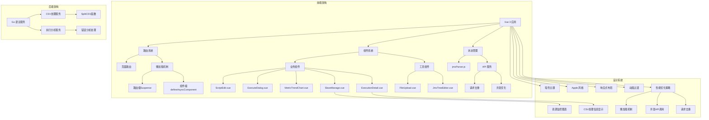

**图表来源**
- [main.js:9-22](file://web/src/main.js#L9-L22)
- [router/index.js:4-8](file://web/src/router/index.js#L4-L8)
- [layout/MainLayout.vue:43-52](file://web/src/layout/MainLayout.vue#L43-L52)
- [views/ScriptList.vue:290](file://web/src/views/ScriptList.vue#L290)
- [views/ScriptList.vue:357-360](file://web/src/views/ScriptList.vue#L357-L360)
- [api/request.js:20-40](file://web/src/api/request.js#L20-L40)
- [index.scss:1-112](file://web/src/styles/index.scss#L1-L112)
- [csv_split.go:10-145](file://internal/service/csv_split.go#L10-L145)

**章节来源**
- [main.js:1-23](file://web/src/main.js#L1-L23)
- [router/index.js:1-56](file://web/src/router/index.js#L1-L56)

## 详细组件分析

### Vue 3 Suspense路由级懒加载

MainLayout.vue 实现了Vue 3 Suspense组件，为整个应用提供统一的异步加载体验。

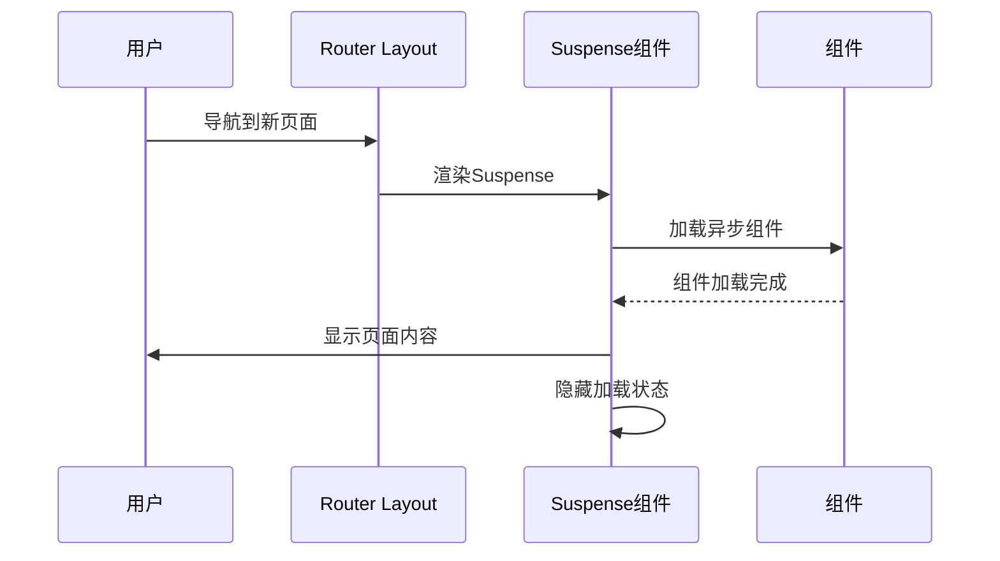

**图表来源**
- [layout/MainLayout.vue:41-54](file://web/src/layout/MainLayout.vue#L41-L54)

**Suspense实现要点：**
- 在router-view中使用Suspense包裹
- 提供自定义fallback模板显示加载状态
- 支持异步组件的错误边界处理
- 保持页面切换的流畅体验

**章节来源**
- [layout/MainLayout.vue:43-52](file://web/src/layout/MainLayout.vue#L43-L52)

### defineAsyncComponent异步组件加载

ScriptList.vue 使用defineAsyncComponent实现ExecuteDialog的按需加载。

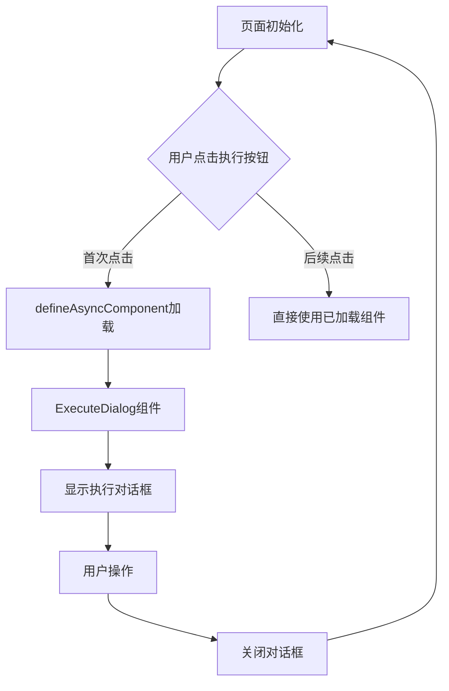

**图表来源**
- [views/ScriptList.vue:290](file://web/src/views/ScriptList.vue#L290)
- [views/ScriptList.vue:214-221](file://web/src/views/ScriptList.vue#L214-L221)

**异步加载优势：**
- 减少初始包体积，提升首屏加载速度
- 按需加载大型组件，优化内存使用
- 保持组件间通信的无缝体验
- 支持加载状态和错误处理

**章节来源**
- [views/ScriptList.vue:290](file://web/src/views/ScriptList.vue#L290)

### Promise.all并发API调用优化

ScriptList.vue 使用Promise.all实现统计数据的并发获取。

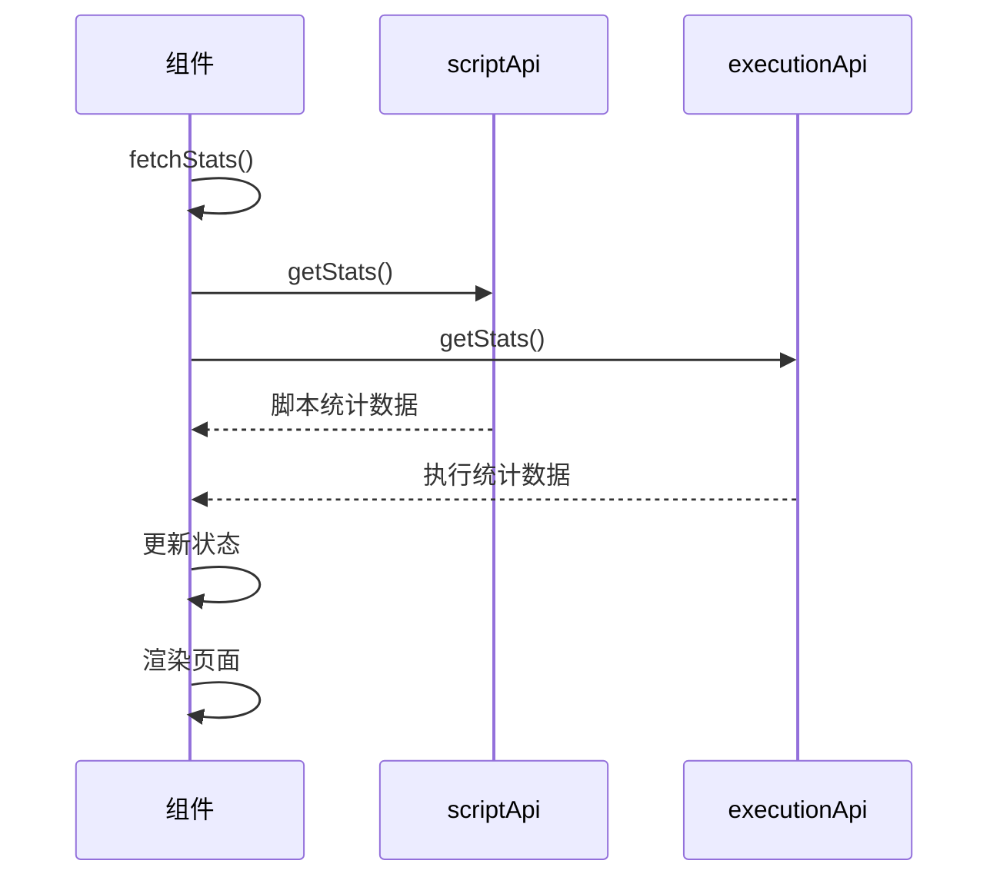

**图表来源**
- [views/ScriptList.vue:354-371](file://web/src/views/ScriptList.vue#L354-L371)
- [views/ScriptList.vue:357-360](file://web/src/views/ScriptList.vue#L357-L360)

**并发优化策略：**
- 同时发起多个独立的API请求
- 减少总等待时间，提升用户体验
- 统一的错误处理和状态管理
- 保持数据的一致性和完整性

**章节来源**
- [views/ScriptList.vue:357-360](file://web/src/views/ScriptList.vue#L357-L360)

### 请求去重机制实现

api/request.js 实现了完整的请求去重和取消机制。

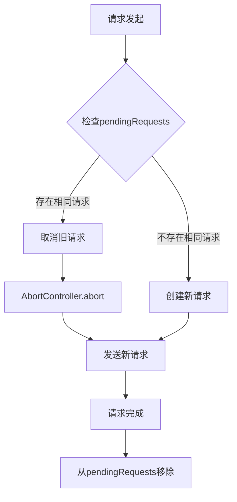

**图表来源**
- [api/request.js:20-40](file://web/src/api/request.js#L20-L40)
- [api/request.js:42-96](file://web/src/api/request.js#L42-L96)

**去重机制实现：**
- generateRequestKey生成唯一请求标识
- pendingRequests Map跟踪进行中的请求
- AbortController实现请求取消
- 自动清理已完成的请求

**章节来源**
- [api/request.js:12-18](file://web/src/api/request.js#L12-L18)
- [api/request.js:20-40](file://web/src/api/request.js#L20-L40)

### 文件上传组件深度分析

文件上传组件实现了完整的文件管理流程，从文件选择到列表展示的全生命周期管理。

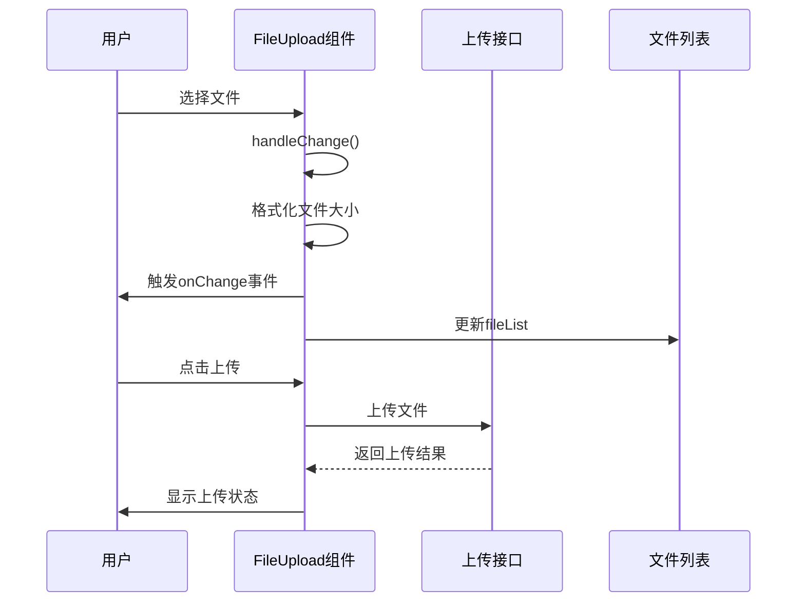

**图表来源**
- [components/FileUpload.vue:120-145](file://web/src/components/FileUpload.vue#L120-L145)

**组件设计要点：**
- 响应式文件大小格式化
- 多文件选择和限制机制
- 实时文件列表更新
- 用户友好的视觉反馈

**章节来源**
- [components/FileUpload.vue:147-152](file://web/src/components/FileUpload.vue#L147-L152)

### JMX 树形编辑器核心实现

JMX 树形编辑器是平台最复杂的组件，实现了完整的 JMeter 脚本可视化编辑功能。

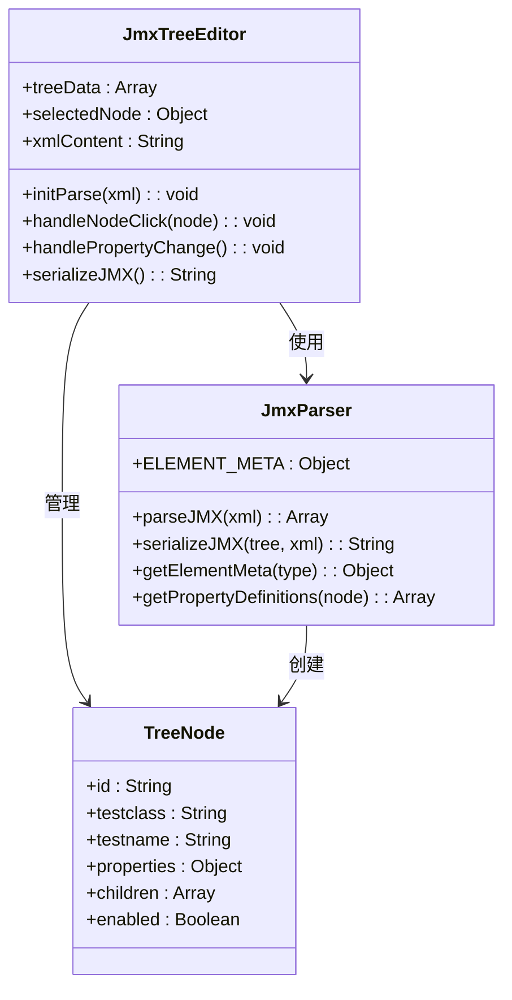

**图表来源**
- [components/JmxTreeEditor.vue:658-698](file://web/src/components/JmxTreeEditor.vue#L658-L698)
- [utils/jmxParser.js:11-789](file://web/src/utils/jmxParser.js#L11-L789)

**核心功能实现：**

1. **JMX 解析引擎**：支持完整的 JMeter XML 结构解析
2. **元数据管理系统**：定义 50+ 种 JMeter 元素的属性定义
3. **动态表单生成**：根据元素类型自动生成相应的编辑表单
4. **实时序列化**：双向同步 JMX 树结构和 XML 字符串

**章节来源**
- [utils/jmxParser.js:1216-1285](file://web/src/utils/jmxParser.js#L1216-L1285)
- [components/JmxTreeEditor.vue:721-755](file://web/src/components/JmxTreeEditor.vue#L721-L755)

### 执行对话框交互流程

执行对话框实现了复杂的分布式执行配置逻辑。

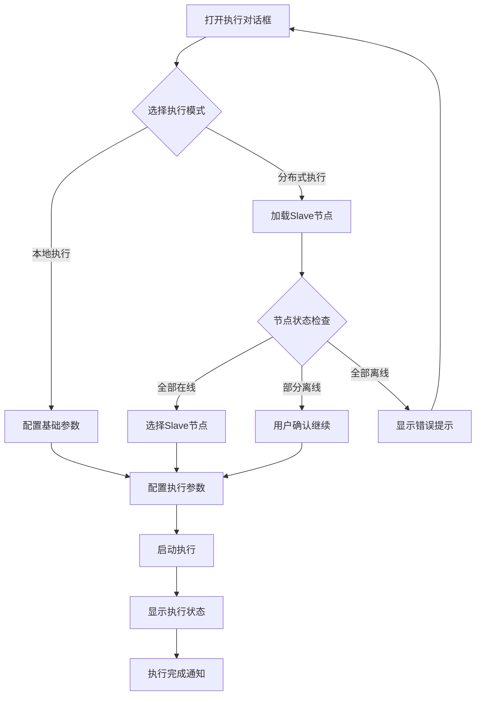

**图表来源**
- [components/ExecuteDialog.vue:420-484](file://web/src/components/ExecuteDialog.vue#L420-L484)

**分布式执行特性：**
- 自动节点连通性检查
- 智能离线节点处理
- Master 回调地址自动配置
- 执行参数的灵活配置

**章节来源**
- [components/ExecuteDialog.vue:346-385](file://web/src/components/ExecuteDialog.vue#L346-L385)

### 指标趋势图表渲染机制

指标趋势图表采用了高性能的 SVG 渲染方案，支持复杂的交互功能。

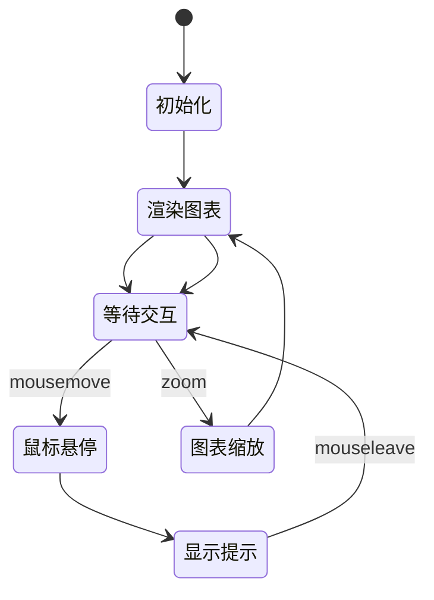

**图表来源**
- [components/MetricTrendChart.vue:264-283](file://web/src/components/MetricTrendChart.vue#L264-L283)

**性能优化策略：**
- SVG 原生绘制，避免 DOM 操作开销
- 精确的坐标计算和缓存
- 动画过渡的硬件加速
- 响应式布局适配

**章节来源**
- [components/MetricTrendChart.vue:154-204](file://web/src/components/MetricTrendChart.vue#L154-L204)

### Slave 管理组件深度分析

Slave 管理组件是分布式节点管理的核心，新增了强大的资源监控功能。

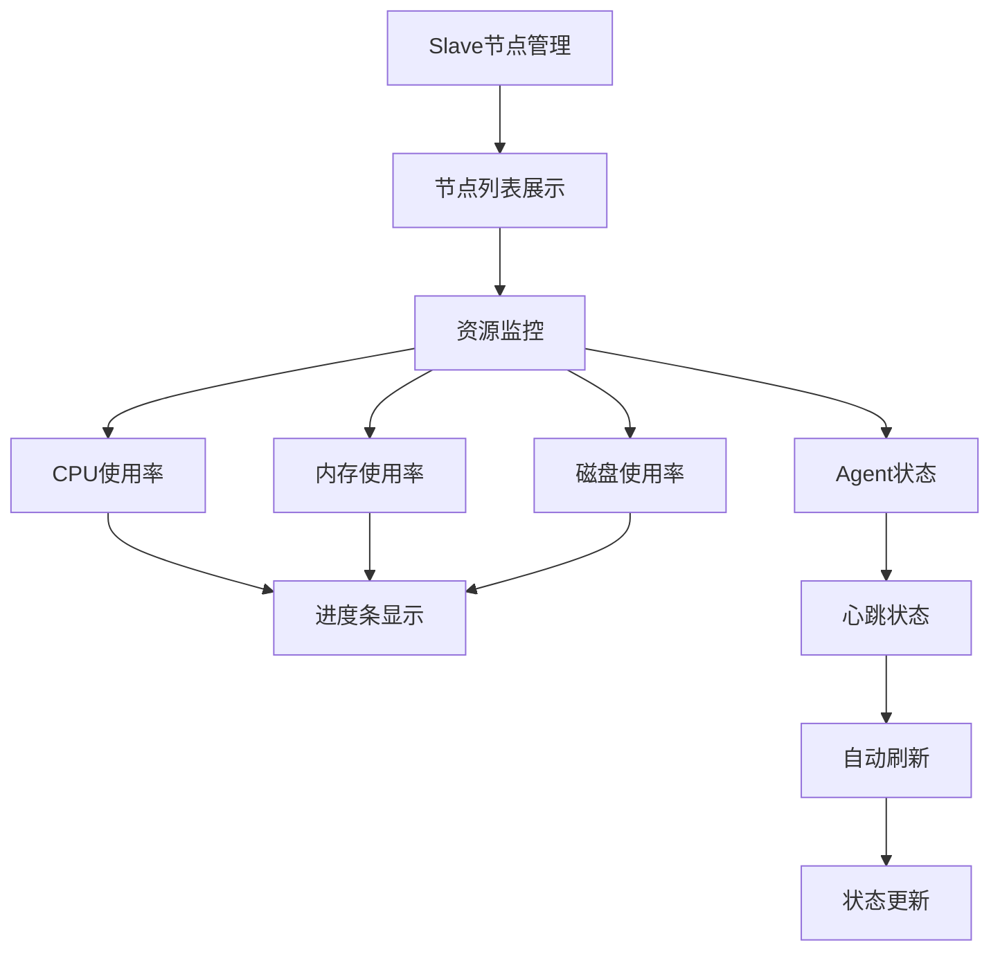

**图表来源**
- [views/SlaveManage.vue:131-181](file://web/src/views/SlaveManage.vue#L131-L181)
- [views/SlaveManage.vue:819-847](file://web/src/views/SlaveManage.vue#L819-L847)

**资源监控实现：**
- 实时系统统计解析（system_stats JSON解析）
- 进度条组件集成（Element Plus Progress）
- 颜色分级系统（基于阈值的动态颜色）
- 自动刷新机制（10秒间隔心跳检测）

**章节来源**
- [views/SlaveManage.vue:534-557](file://web/src/views/SlaveManage.vue#L534-L557)
- [views/SlaveManage.vue:819-847](file://web/src/views/SlaveManage.vue#L819-L847)

### 执行详情组件深度分析

执行详情组件提供了完整的测试执行分析功能，新增了详细的CSV处理信息显示。

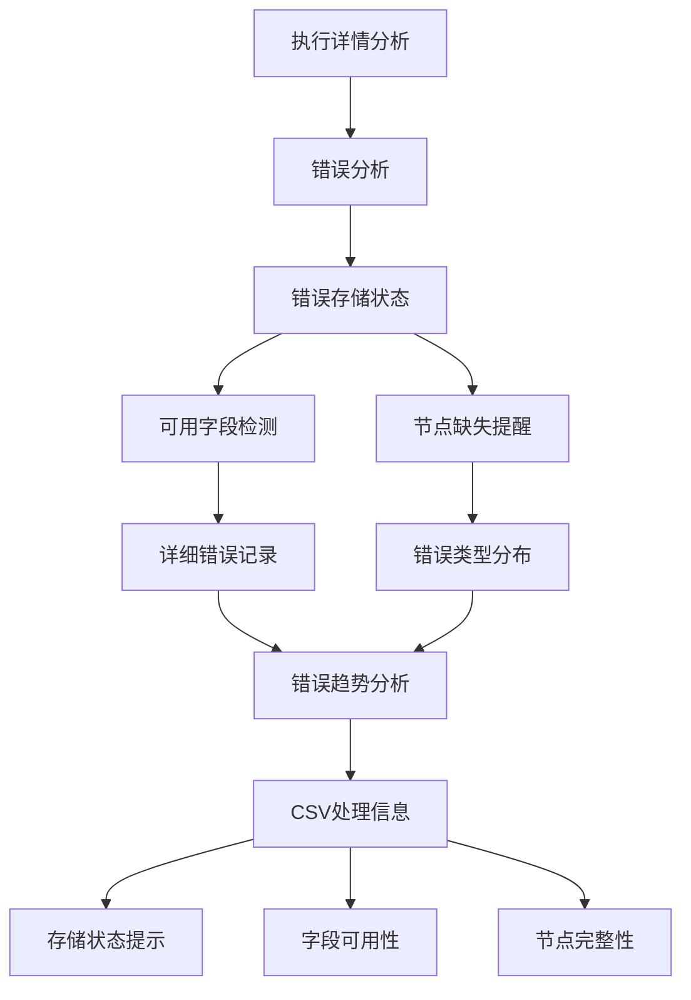

**图表来源**
- [views/ExecutionDetail.vue:1629-1644](file://web/src/views/ExecutionDetail.vue#L1629-L1644)
- [views/ExecutionDetail.vue:842-948](file://web/src/views/ExecutionDetail.vue#L842-L948)

**CSV处理增强功能：**
- 错误存储状态检测（detail_fields_available）
- 可用字段自动识别（available_detail_fields）
- 节点缺失情况统计（missing_detail_sources）
- 详细错误分析和展示
- 错误类型分布和趋势分析

**章节来源**
- [views/ExecutionDetail.vue:1366-1385](file://web/src/views/ExecutionDetail.vue#L1366-L1385)
- [views/ExecutionDetail.vue:2590-2607](file://web/src/views/ExecutionDetail.vue#L2590-L2607)

### CSV文件智能分割处理

后端新增了CSV文件智能分割处理功能，支持均匀分割大型CSV文件。

**分割算法特性：**
- 基于数据行数的智能分配
- 表头保留机制
- 均匀负载分配（前余数个分片多一行，其余分片少一行）
- 错误处理和清理机制

**章节来源**
- [internal/service/csv_split.go:10-145](file://internal/service/csv_split.go#L10-L145)

## 依赖关系分析

前端项目采用模块化依赖管理，主要依赖关系如下：

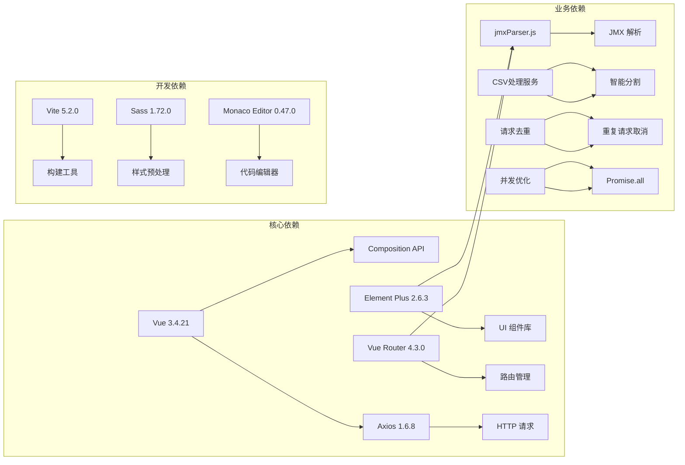

**图表来源**
- [package.json:10-22](file://web/package.json#L10-L22)

**第三方库使用：**
- **Vue 3**: 前端框架，提供响应式数据绑定和组件系统
- **Element Plus**: UI 组件库，提供丰富的预设组件
- **Monaco Editor**: VS Code 同款编辑器，用于 XML 源码编辑
- **Axios**: HTTP 客户端，处理 API 请求

**章节来源**
- [package.json:1-24](file://web/package.json#L1-L24)

## 性能考虑

### 多层次懒加载优化

1. **路由级懒加载**：使用动态导入实现页面级别的按需加载
2. **组件级懒加载**：使用defineAsyncComponent实现大型组件的延迟加载
3. **Suspense统一处理**：提供一致的加载状态管理和用户体验
4. **代码分割策略**：合理划分代码包，减少初始加载体积

### 并发请求优化

1. **Promise.all并发调用**：同时发起多个独立的API请求
2. **请求去重机制**：避免重复请求和资源浪费
3. **AbortController取消**：及时取消不再需要的请求
4. **超时控制**：设置合理的请求超时时间

### 内存管理

1. **异步组件卸载**：组件销毁时自动清理异步加载状态
2. **定时器管理**：及时清理定时器和轮询任务
3. **事件监听器清理**：组件销毁时自动清理事件监听
4. **大数据处理**：对大量数据进行分页和虚拟滚动

### 网络性能

1. **请求合并**：减少不必要的 API 调用
2. **缓存策略**：合理使用浏览器缓存和应用缓存
3. **压缩传输**：启用 Gzip 压缩和资源压缩
4. **增量更新**：心跳检测采用增量更新机制

## 故障排除指南

### 懒加载相关问题

**Suspense加载异常：**
- 检查异步组件的加载路径是否正确
- 验证fallback模板的样式和内容
- 确认组件加载过程中是否有错误抛出

**defineAsyncComponent加载失败：**
- 检查组件的动态导入语法
- 验证组件文件是否存在且可访问
- 确认组件的默认导出是否正确

**路由级懒加载问题：**
- 检查路由配置中的动态导入
- 验证路由组件的加载状态
- 确认页面切换时的过渡动画

### 并发API调用问题

**Promise.all并发调用异常：**
- 检查所有API请求的返回格式
- 验证错误处理逻辑的完整性
- 确认数据合并和状态更新的正确性

**请求去重机制失效：**
- 检查generateRequestKey的唯一性
- 验证pendingRequests的存储和清理
- 确认AbortController的正确使用

### 性能问题诊断

**组件渲染异常：**
- 检查 Element Plus 版本兼容性
- 验证组件属性传入是否正确
- 确认样式文件加载正常

**内存泄漏问题：**
- 检查组件销毁时的清理逻辑
- 验证定时器和事件监听器的清理
- 确认异步操作的正确取消

**网络请求问题：**
- 检查API接口的可用性和响应时间
- 验证请求去重机制的正常工作
- 确认错误处理和重试逻辑

### 调试技巧

1. **开发者工具**：使用 Vue DevTools 分析组件状态
2. **网络监控**：检查 API 请求和响应
3. **性能分析**：使用浏览器性能面板分析渲染瓶颈
4. **日志分析**：查看后端CSV处理日志

**章节来源**
- [layout/MainLayout.vue:43-52](file://web/src/layout/MainLayout.vue#L43-L52)
- [views/ScriptList.vue:290](file://web/src/views/ScriptList.vue#L290)
- [views/ScriptList.vue:357-360](file://web/src/views/ScriptList.vue#L357-L360)
- [api/request.js:20-40](file://web/src/api/request.js#L20-L40)

## 结论

JMeter Admin 前端组件展现了现代 Web 应用的优秀设计实践。通过精心设计的组件架构、完善的错误处理机制、优秀的用户体验和先进的性能优化策略，为 JMeter 脚本管理提供了强大而易用的解决方案。

**主要优势：**
- 模块化设计，易于维护和扩展
- 完善的类型定义和错误处理
- 优秀的性能表现和用户体验
- 丰富的交互功能和视觉效果
- **新增的懒加载机制和并发优化**
- **新增的请求去重和资源管理**

**最新增强功能：**
- Vue 3 Suspense路由级懒加载，提供统一的异步加载体验
- defineAsyncComponent组件级异步加载，优化首屏性能
- Promise.all并发API调用，提升数据获取效率
- 请求去重机制，避免重复请求和资源浪费
- 路由级代码分割，实现按需加载和性能优化

**未来改进方向：**
- 增加更多的国际化支持
- 优化移动端适配
- 扩展更多的 JMeter 元素类型支持
- 增强数据导入导出功能
- 添加更多类型的性能监控图表
- 进一步优化懒加载策略和性能指标

该组件体系为类似的企业级应用开发提供了良好的参考范例，展示了如何在复杂业务场景下实现高质量的前端解决方案。通过引入现代前端技术栈和性能优化策略，显著提升了应用的用户体验和运行效率。