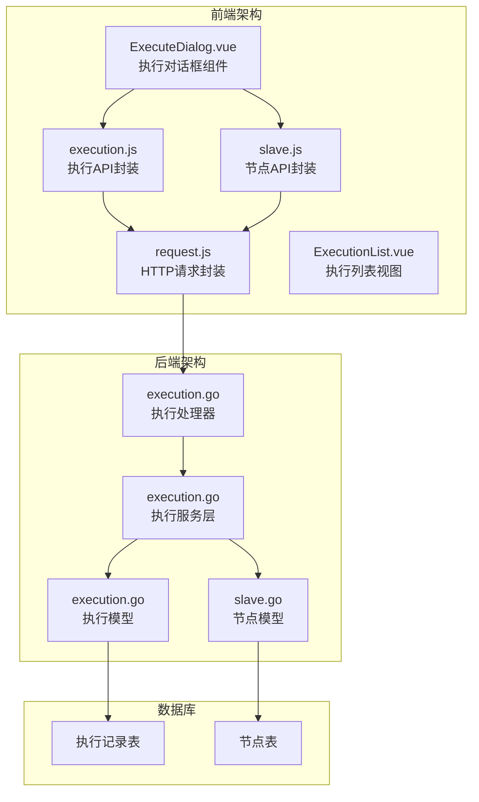
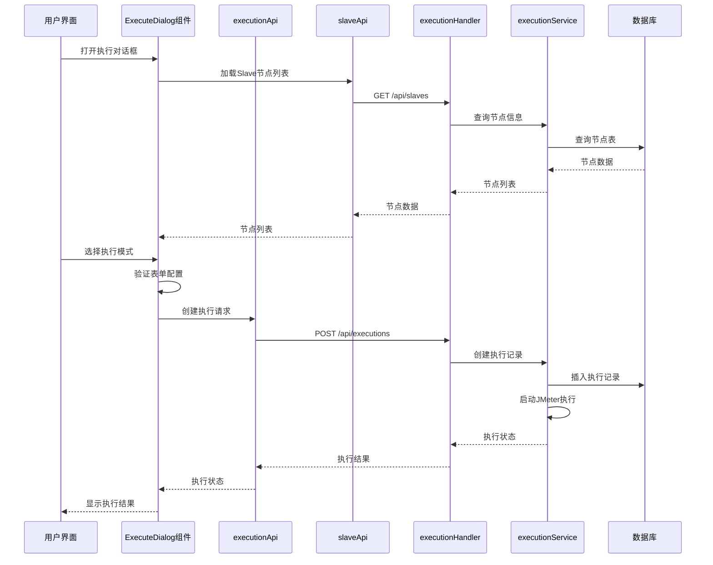
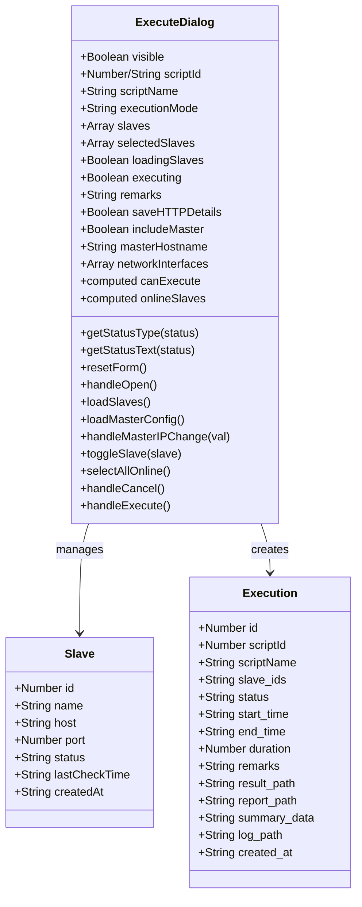
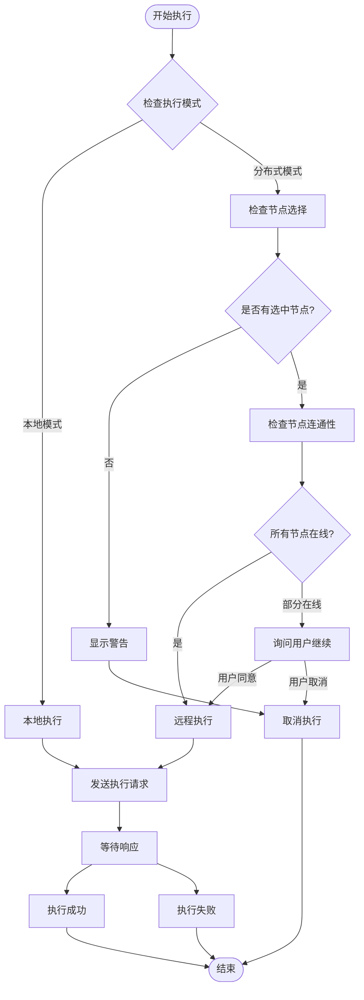
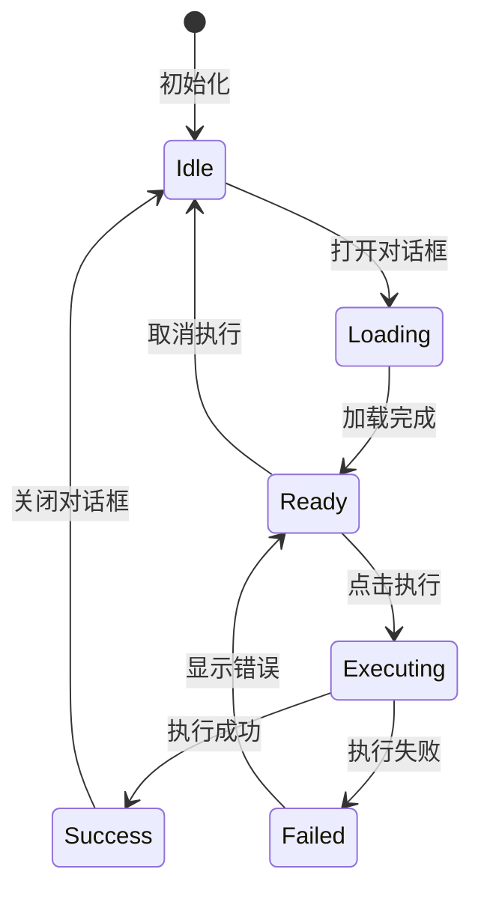
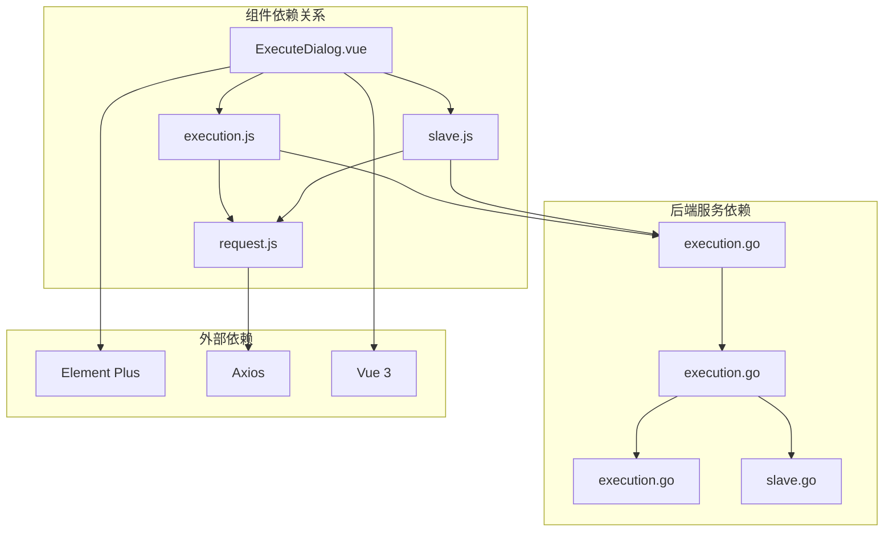

# 执行对话框组件

<cite>
**本文档引用的文件**
- [ExecuteDialog.vue](file://web/src/components/ExecuteDialog.vue)
- [execution.js](file://web/src/api/execution.js)
- [slave.js](file://web/src/api/slave.js)
- [request.js](file://web/src/api/request.js)
- [execution.go](file://internal/handler/execution.go)
- [execution.go](file://internal/service/execution.go)
- [execution.go](file://internal/model/execution.go)
- [slave.go](file://internal/model/slave.go)
- [ExecutionList.vue](file://web/src/views/ExecutionList.vue)
- [index.scss](file://web/src/styles/index.scss)
- [main.js](file://web/src/main.js)
</cite>

## 目录
1. [简介](#简介)
2. [项目结构](#项目结构)
3. [核心组件](#核心组件)
4. [架构概览](#架构概览)
5. [详细组件分析](#详细组件分析)
6. [依赖关系分析](#依赖关系分析)
7. [性能考虑](#性能考虑)
8. [故障排除指南](#故障排除指南)
9. [结论](#结论)

## 简介

执行对话框组件（ExecuteDialog）是JMeter Admin管理系统中的核心功能模块，负责提供用户友好的测试执行界面。该组件支持本地执行和分布式执行两种模式，具备完整的测试执行配置、节点选择、参数设置等功能。组件采用现代化的Vue 3 Composition API实现，结合Element Plus UI框架，提供了丰富的用户体验和强大的功能特性。

该组件的主要目标是简化JMeter测试执行过程，让用户能够通过直观的图形界面配置和启动测试，同时提供实时的状态反馈和详细的执行结果管理。

## 项目结构

JMeter Admin项目采用前后端分离的架构设计，前端使用Vue 3 + Element Plus构建，后端使用Go语言开发。执行对话框组件位于前端项目的组件目录中，与API层、视图层和其他业务组件协同工作。

**图表来源**
- [ExecuteDialog.vue:1-944](file://web/src/components/ExecuteDialog.vue#L1-L944)
- [execution.js:1-78](file://web/src/api/execution.js#L1-L78)
- [execution.go:1-729](file://internal/handler/execution.go#L1-L729)

**章节来源**
- [ExecuteDialog.vue:1-944](file://web/src/components/ExecuteDialog.vue#L1-L944)
- [main.js:1-23](file://web/src/main.js#L1-L23)

## 核心组件

执行对话框组件是整个测试执行系统的核心入口，提供了完整的用户交互界面和业务逻辑处理。组件采用响应式设计，支持多种执行模式和配置选项。

### 主要功能特性

1. **执行模式选择**：支持本地执行和分布式执行两种模式
2. **节点管理**：动态加载和管理JMeter Slave节点
3. **参数配置**：灵活的执行参数设置和验证
4. **实时反馈**：执行状态监控和进度显示
5. **错误处理**：完善的错误提示和异常处理机制

### 组件架构设计

组件采用模块化的架构设计，将不同的功能模块分离到独立的方法和计算属性中，提高了代码的可维护性和可测试性。

**章节来源**
- [ExecuteDialog.vue:259-485](file://web/src/components/ExecuteDialog.vue#L259-L485)

## 架构概览

执行对话框组件在整个系统架构中扮演着重要的角色，它作为用户界面层与业务逻辑层进行交互，协调前端API层和后端服务层的工作。

**图表来源**
- [ExecuteDialog.vue:347-484](file://web/src/components/ExecuteDialog.vue#L347-L484)
- [execution.go:39-53](file://internal/handler/execution.go#L39-L53)
- [execution.go:104-481](file://internal/service/execution.go#L104-L481)

## 详细组件分析

### ExecuteDialog组件架构

ExecuteDialog组件采用了现代化的Vue 3 Composition API设计模式，将组件的状态管理、业务逻辑和UI渲染进行了清晰的分离。

**图表来源**
- [ExecuteDialog.vue:266-484](file://web/src/components/ExecuteDialog.vue#L266-L484)
- [slave.go:3-12](file://internal/model/slave.go#L3-L12)
- [execution.go:3-19](file://internal/model/execution.go#L3-L19)

### 表单设计与验证机制

组件实现了多层次的表单验证机制，确保用户输入的数据符合执行要求。

#### 必填字段检查

组件对关键字段实施严格的验证规则：

- **执行模式验证**：确保用户明确选择执行模式
- **节点选择验证**：分布式模式下必须至少选择一个在线节点
- **Master IP配置**：分布式模式下的网络配置验证

#### 参数范围验证

组件对各种参数实施合理的范围限制：

- **备注长度限制**：最大200字符
- **节点状态检查**：仅允许选择在线节点
- **配置有效性验证**：确保网络配置的正确性

#### 节点可用性检查

组件实现了智能的节点可用性检测机制：

**图表来源**
- [ExecuteDialog.vue:420-484](file://web/src/components/ExecuteDialog.vue#L420-L484)

**章节来源**
- [ExecuteDialog.vue:300-306](file://web/src/components/ExecuteDialog.vue#L300-L306)
- [ExecuteDialog.vue:420-484](file://web/src/components/ExecuteDialog.vue#L420-L484)

### 组件状态管理策略

组件实现了完整的状态管理机制，包括加载状态、错误状态、成功状态的处理。

#### 状态类型定义

组件使用多种状态来反映不同的执行阶段：

- **加载状态**：`loadingSlaves` - 加载Slave节点列表
- **执行状态**：`executing` - 执行过程中
- **成功状态**：`canExecute` - 可以执行
- **错误状态**：`error` - 错误信息

#### 状态转换机制

**图表来源**
- [ExecuteDialog.vue:283-344](file://web/src/components/ExecuteDialog.vue#L283-L344)

**章节来源**
- [ExecuteDialog.vue:283-344](file://web/src/components/ExecuteDialog.vue#L283-L344)

### 分布式执行场景应用

组件支持复杂的分布式执行场景，包括多节点选择、负载均衡、执行策略配置等高级功能。

#### 多节点选择机制

组件提供了灵活的多节点选择方式：

- **全选在线节点**：一键选择所有在线节点
- **手动选择**：用户可以精确控制选择的节点
- **节点状态显示**：实时显示节点的在线状态

#### 负载均衡策略

组件支持多种负载均衡策略：

- **轮询策略**：均匀分配负载到各个节点
- **权重策略**：根据节点性能分配不同权重
- **健康检查**：自动检测节点健康状况

#### 执行策略配置

组件允许用户配置各种执行策略：

- **Master参与执行**：可选择Master是否参与执行
- **错误明细收集**：配置是否收集详细的错误信息
- **结果合并策略**：配置分布式执行结果的合并方式

**章节来源**
- [ExecuteDialog.vue:130-238](file://web/src/components/ExecuteDialog.vue#L130-L238)
- [ExecuteDialog.vue:429-465](file://web/src/components/ExecuteDialog.vue#L429-L465)

### 用户体验优化

组件在用户体验方面进行了全面的优化，提供了丰富的交互反馈和操作便利性。

#### 进度指示

组件提供了多种进度指示方式：

- **加载指示器**：显示数据加载进度
- **执行进度**：显示测试执行进度
- **状态图标**：使用图标直观显示状态

#### 取消操作

组件支持安全的取消操作：

- **执行取消**：允许用户取消正在进行的执行
- **对话框关闭**：提供多种方式关闭对话框
- **状态恢复**：取消操作后自动恢复到初始状态

#### 错误提示

组件提供了详细的错误提示：

- **表单验证错误**：显示具体的验证错误信息
- **网络错误**：提供网络连接问题的解决方案
- **业务逻辑错误**：解释业务层面的错误原因

**章节来源**
- [ExecuteDialog.vue:241-256](file://web/src/components/ExecuteDialog.vue#L241-L256)
- [ExecuteDialog.vue:414-418](file://web/src/components/ExecuteDialog.vue#L414-L418)

## 依赖关系分析

执行对话框组件与系统的其他部分存在紧密的依赖关系，这些关系构成了完整的功能链路。

**图表来源**
- [ExecuteDialog.vue:263-264](file://web/src/components/ExecuteDialog.vue#L263-L264)
- [execution.js:1-78](file://web/src/api/execution.js#L1-L78)
- [slave.js:1-49](file://web/src/api/slave.js#L1-L49)

### 前端依赖分析

组件的前端依赖关系相对简单，主要依赖于Vue生态系统的标准库和Element Plus UI框架。

#### Vue生态系统依赖

- **Vue 3**：提供响应式数据绑定和组件系统
- **Element Plus**：提供丰富的UI组件和样式系统
- **Axios**：提供HTTP请求功能

#### 组件间通信

组件通过props和events进行通信：

- **父组件传递**：通过props传递脚本信息
- **事件回调**：通过events通知父组件执行结果

**章节来源**
- [ExecuteDialog.vue:266-281](file://web/src/components/ExecuteDialog.vue#L266-L281)

### 后端服务依赖

组件的后端服务依赖关系更加复杂，涉及多个服务层和数据持久化。

#### API层依赖

- **执行处理器**：处理执行相关的HTTP请求
- **节点处理器**：管理Slave节点的HTTP接口
- **配置处理器**：提供系统配置的访问接口

#### 服务层依赖

- **执行服务**：实现核心的执行逻辑
- **节点服务**：管理节点的生命周期
- **数据库服务**：提供数据持久化能力

**章节来源**
- [execution.go:39-53](file://internal/handler/execution.go#L39-L53)
- [execution.go:104-481](file://internal/service/execution.go#L104-L481)

## 性能考虑

执行对话框组件在设计时充分考虑了性能优化，特别是在处理大量数据和复杂交互场景时的性能表现。

### 前端性能优化

#### 组件渲染优化

- **懒加载机制**：分布式配置区域采用懒加载，减少初始渲染负担
- **虚拟滚动**：对于大量节点列表，考虑使用虚拟滚动技术
- **防抖处理**：对频繁的用户操作进行防抖处理

#### 内存管理

- **状态清理**：对话框关闭时自动清理所有状态数据
- **事件解绑**：确保组件卸载时解绑所有事件监听器
- **定时器清理**：及时清理定时器和轮询任务

### 后端性能优化

#### 数据库查询优化

- **批量查询**：一次性获取所有必要的节点信息
- **索引优化**：为常用查询字段建立合适的数据库索引
- **缓存策略**：对静态配置信息实施缓存机制

#### 执行性能优化

- **异步执行**：使用goroutine实现非阻塞的执行模式
- **资源池管理**：合理管理JMeter进程资源
- **结果合并**：优化分布式执行结果的合并算法

## 故障排除指南

执行对话框组件在实际使用中可能会遇到各种问题，以下是常见问题的诊断和解决方法。

### 常见问题及解决方案

#### 节点连接问题

**问题现象**：
- Slave节点显示离线状态
- 执行时出现连接超时错误

**诊断步骤**：
1. 检查Slave节点的网络连通性
2. 验证jmeter-server服务是否正常运行
3. 确认防火墙设置允许相关端口通信

**解决方案**：
- 重启jmeter-server服务
- 检查并修改防火墙规则
- 验证网络配置的正确性

#### 执行权限问题

**问题现象**：
- 执行请求被拒绝
- 出现403错误

**诊断步骤**：
1. 检查用户权限配置
2. 验证认证信息的有效性
3. 确认执行策略的配置

**解决方案**：
- 重新登录系统获取有效权限
- 检查并更新认证配置
- 调整执行策略设置

#### 资源不足问题

**问题现象**：
- 执行过程中内存不足
- 系统响应缓慢

**诊断步骤**：
1. 检查系统内存使用情况
2. 监控CPU使用率
3. 分析磁盘空间占用

**解决方案**：
- 增加系统内存容量
- 优化JMeter配置参数
- 清理不必要的系统资源

**章节来源**
- [ExecuteDialog.vue:430-465](file://web/src/components/ExecuteDialog.vue#L430-L465)

### 日志和调试

组件提供了完善的日志记录和调试功能，帮助开发者快速定位和解决问题。

#### 前端调试

- **控制台日志**：记录关键的操作和错误信息
- **状态监控**：实时显示组件的状态变化
- **网络请求跟踪**：监控所有API请求的执行情况

#### 后端调试

- **执行日志**：详细记录每个执行任务的执行过程
- **性能监控**：跟踪执行任务的性能指标
- **错误堆栈**：提供完整的错误信息和堆栈跟踪

## 结论

执行对话框组件是JMeter Admin管理系统中的核心功能模块，它成功地将复杂的测试执行过程简化为直观易用的图形界面。组件采用了现代化的技术栈和设计理念，在功能完整性、用户体验和性能表现方面都达到了较高的水平。

### 主要成就

1. **功能完整性**：支持本地和分布式两种执行模式，满足不同场景的需求
2. **用户体验优秀**：提供直观的界面设计和丰富的交互反馈
3. **技术实现先进**：采用Vue 3 Composition API和Element Plus框架
4. **扩展性强**：模块化设计便于功能扩展和维护

### 技术亮点

- **响应式设计**：完美适配各种屏幕尺寸和设备类型
- **智能验证**：多层次的表单验证确保数据质量
- **实时反馈**：提供执行过程的实时状态更新
- **错误处理**：完善的错误处理和用户提示机制

### 发展建议

1. **性能优化**：进一步优化大数据量场景下的性能表现
2. **功能扩展**：增加更多高级的执行策略和配置选项
3. **监控增强**：提供更详细的执行监控和分析功能
4. **集成扩展**：支持与其他测试工具和服务的集成

执行对话框组件为JMeter Admin系统提供了强大的测试执行能力，是整个系统成功的关键组成部分。通过持续的优化和改进，该组件将继续为用户提供更好的测试执行体验。