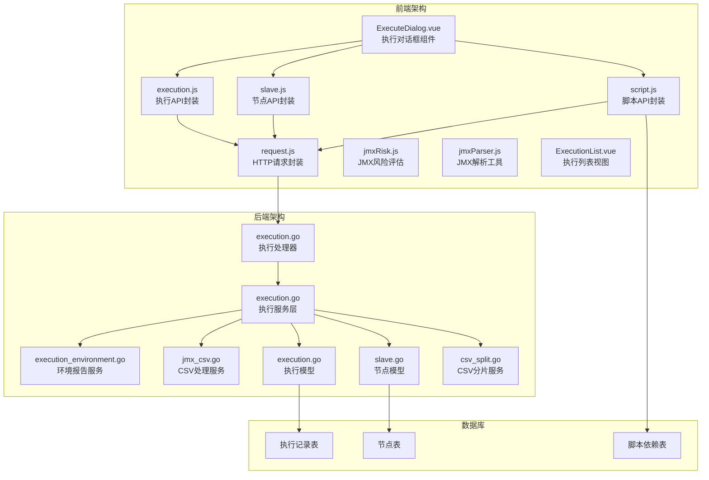
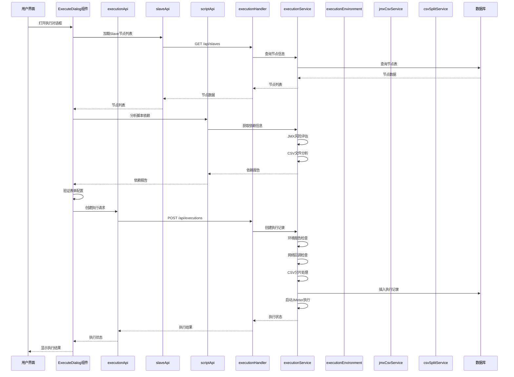
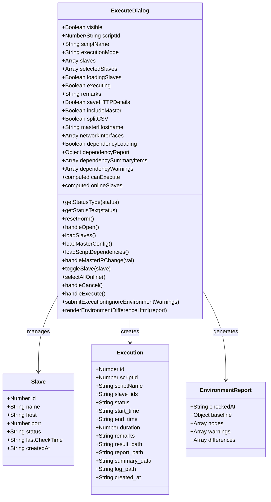
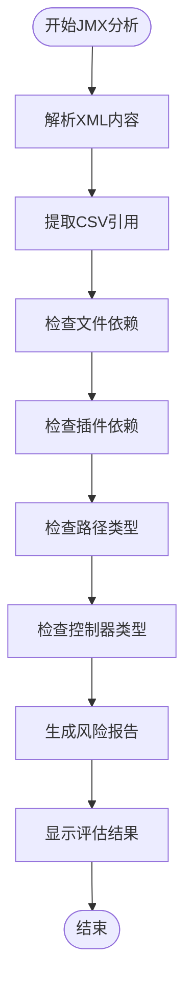
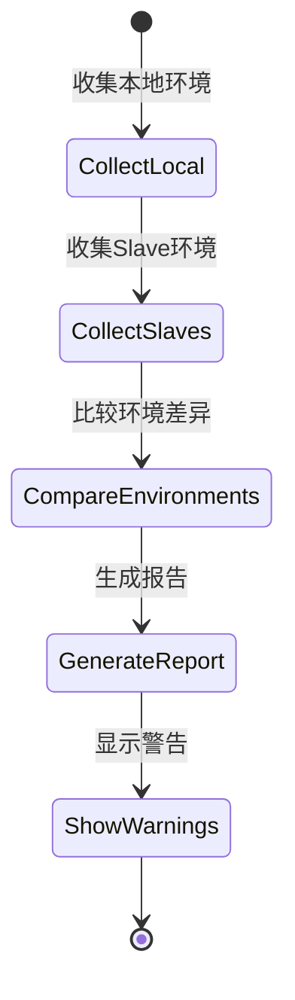
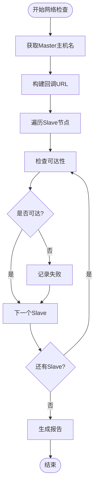
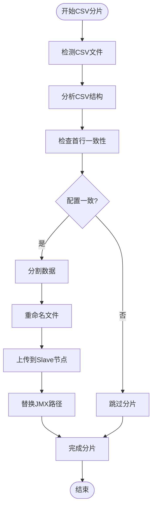
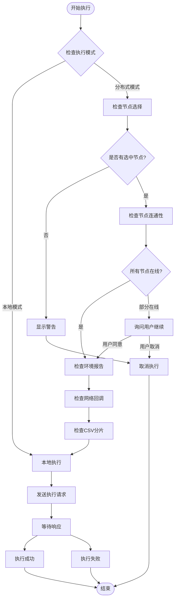
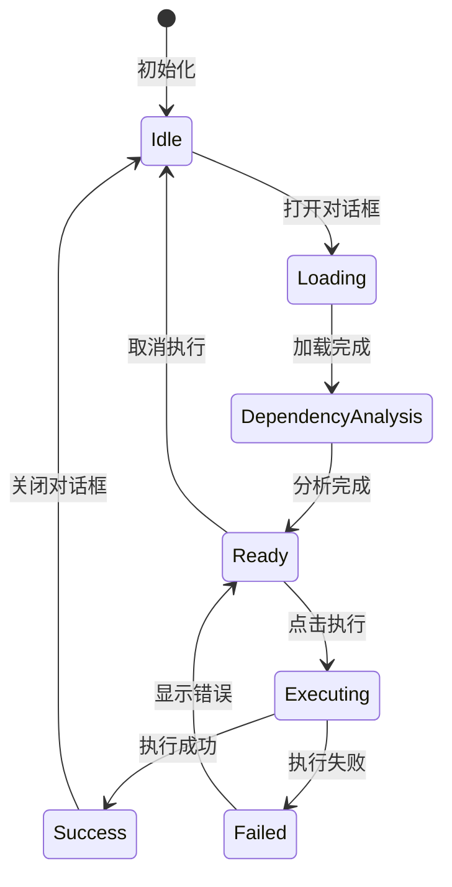
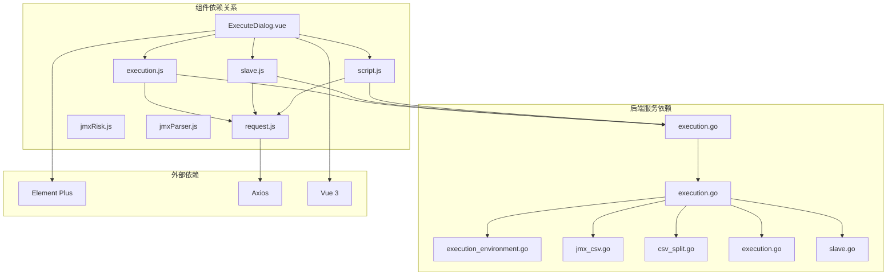

# 执行对话框组件

<cite>
**本文档引用的文件**
- [ExecuteDialog.vue](file://web/src/components/ExecuteDialog.vue)
- [execution.js](file://web/src/api/execution.js)
- [slave.js](file://web/src/api/slave.js)
- [script.js](file://web/src/api/script.js)
- [request.js](file://web/src/api/request.js)
- [execution.go](file://internal/handler/execution.go)
- [execution.go](file://internal/service/execution.go)
- [execution_environment.go](file://internal/service/execution_environment.go)
- [jmx_csv.go](file://internal/service/jmx_csv.go)
- [csv_split.go](file://internal/service/csv_split.go)
- [execution.go](file://internal/model/execution.go)
- [slave.go](file://internal/model/slave.go)
- [ExecutionList.vue](file://web/src/views/ExecutionList.vue)
- [jmxRisk.js](file://web/src/utils/jmxRisk.js)
- [jmxParser.js](file://web/src/utils/jmxParser.js)
- [index.scss](file://web/src/styles/index.scss)
- [main.js](file://web/src/main.js)
</cite>

## 更新摘要
**变更内容**
- 新增JMX风险评估功能，提供脚本依赖分析和风险提示
- 新增环境报告功能，支持分布式执行前的环境一致性检查
- 新增网络回调检查功能，确保Slave节点可回调Master
- 新增CSV数据分片功能，支持分布式环境下的数据隔离
- 增强用户体验，提供更详细的执行前检查和警告提示

## 目录
1. [简介](#简介)
2. [项目结构](#项目结构)
3. [核心组件](#核心组件)
4. [架构概览](#架构概览)
5. [详细组件分析](#详细组件分析)
6. [依赖关系分析](#依赖关系分析)
7. [性能考虑](#性能考虑)
8. [故障排除指南](#故障排除指南)
9. [结论](#结论)

## 简介

执行对话框组件（ExecuteDialog）是JMeter Admin管理系统中的核心功能模块，负责提供用户友好的测试执行界面。该组件支持本地执行和分布式执行两种模式，具备完整的测试执行配置、节点选择、参数设置等功能。组件采用现代化的Vue 3 Composition API实现，结合Element Plus UI框架，提供了丰富的用户体验和强大的功能特性。

**更新** 新增了JMX风险评估、环境报告、网络回调检查等高级功能，显著提升了用户体验和执行安全性。

该组件的主要目标是简化JMeter测试执行过程，让用户能够通过直观的图形界面配置和启动测试，同时提供实时的状态反馈和详细的执行结果管理。

## 项目结构

JMeter Admin项目采用前后端分离的架构设计，前端使用Vue 3 + Element Plus构建，后端使用Go语言开发。执行对话框组件位于前端项目的组件目录中，与API层、视图层和其他业务组件协同工作。

**图表来源**
- [ExecuteDialog.vue:1-1266](file://web/src/components/ExecuteDialog.vue#L1-L1266)
- [execution.js:1-93](file://web/src/api/execution.js#L1-L93)
- [execution.go:1-970](file://internal/handler/execution.go#L1-L970)

**章节来源**
- [ExecuteDialog.vue:1-1266](file://web/src/components/ExecuteDialog.vue#L1-L1266)
- [main.js:1-23](file://web/src/main.js#L1-L23)

## 核心组件

执行对话框组件是整个测试执行系统的核心入口，提供了完整的用户交互界面和业务逻辑处理。组件采用响应式设计，支持多种执行模式和配置选项。

### 主要功能特性

1. **执行模式选择**：支持本地执行和分布式执行两种模式
2. **节点管理**：动态加载和管理JMeter Slave节点
3. **参数配置**：灵活的执行参数设置和验证
4. **实时反馈**：执行状态监控和进度显示
5. **错误处理**：完善的错误提示和异常处理机制
6. **JMX风险评估**：脚本依赖分析和风险提示
7. **环境报告**：分布式执行前的环境一致性检查
8. **网络回调检查**：确保Slave节点可回调Master
9. **CSV数据分片**：分布式环境下的数据隔离处理

### 组件架构设计

组件采用模块化的架构设计，将不同的功能模块分离到独立的方法和计算属性中，提高了代码的可维护性和可测试性。

**章节来源**
- [ExecuteDialog.vue:259-485](file://web/src/components/ExecuteDialog.vue#L259-L485)

## 架构概览

执行对话框组件在整个系统架构中扮演着重要的角色，它作为用户界面层与业务逻辑层进行交互，协调前端API层和后端服务层的工作。

**图表来源**
- [ExecuteDialog.vue:347-674](file://web/src/components/ExecuteDialog.vue#L347-L674)
- [execution.go:39-76](file://internal/handler/execution.go#L39-L76)
- [execution.go:157-259](file://internal/service/execution.go#L157-L259)

## 详细组件分析

### ExecuteDialog组件架构

ExecuteDialog组件采用了现代化的Vue 3 Composition API设计模式，将组件的状态管理、业务逻辑和UI渲染进行了清晰的分离。

**图表来源**
- [ExecuteDialog.vue:266-674](file://web/src/components/ExecuteDialog.vue#L266-L674)
- [slave.go:3-12](file://internal/model/slave.go#L3-L12)
- [execution.go:3-19](file://internal/model/execution.go#L3-L19)

### JMX风险评估功能

组件集成了JMX风险评估功能，能够分析脚本的潜在问题并提供风险提示。

#### 风险评估内容

1. **缺失依赖文件**：检测脚本引用但未关联的文件
2. **CSV配置冲突**：检查多个CSVDataSet的配置一致性
3. **绝对路径引用**：识别可能在分布式环境下失效的绝对路径
4. **插件依赖**：检测第三方插件的使用情况
5. **事务控制器缺失**：提醒可能影响TPS计算的配置

#### 评估机制

**图表来源**
- [jmxRisk.js:46-208](file://web/src/utils/jmxRisk.js#L46-L208)

**章节来源**
- [jmxRisk.js:1-209](file://web/src/utils/jmxRisk.js#L1-L209)
- [jmxParser.js:1-800](file://web/src/utils/jmxParser.js#L1-L800)

### 环境报告功能

组件提供了分布式执行前的环境一致性检查功能，确保所有节点的执行环境一致。

#### 环境检查内容

1. **JMeter版本对比**：检查Master和Slave的JMeter版本是否一致
2. **插件清单对比**：验证插件安装的一致性
3. **配置文件对比**：检查jmeter.properties和user.properties的差异
4. **Agent版本检查**：确保Agent版本的一致性

#### 环境报告生成

**图表来源**
- [execution_environment.go:362-410](file://internal/service/execution_environment.go#L362-L410)

**章节来源**
- [execution_environment.go:1-434](file://internal/service/execution_environment.go#L1-L434)

### 网络回调检查功能

组件实现了Slave节点到Master的网络回调可达性检查，确保分布式执行的网络连通性。

#### 检查机制

1. **回调地址生成**：基于Master主机名和端口生成回调URL
2. **可达性测试**：向每个Slave节点发起HTTP请求测试
3. **错误收集**：收集所有不可达的节点及其原因
4. **预检报告**：提供详细的网络连通性报告

#### 检查流程

**图表来源**
- [execution.go:218-242](file://internal/service/execution.go#L218-L242)

**章节来源**
- [execution.go:218-242](file://internal/service/execution.go#L218-L242)

### CSV数据分片功能

组件支持分布式执行场景下的CSV数据分片，确保每个节点只处理属于自己的数据。

#### 分片机制

1. **CSV文件检测**：自动识别脚本中引用的所有CSV文件
2. **数据分割**：将CSV文件按节点数量均匀分割
3. **文件重命名**：为每个分片生成唯一的文件名
4. **节点分发**：将分片文件上传到对应的Slave节点
5. **路径替换**：更新JMX文件中的CSV文件路径

#### 分片策略

**图表来源**
- [jmx_csv.go:26-136](file://internal/service/jmx_csv.go#L26-L136)

**章节来源**
- [jmx_csv.go:1-137](file://internal/service/jmx_csv.go#L1-L137)
- [csv_split.go:1-154](file://internal/service/csv_split.go#L1-L154)

### 表单设计与验证机制

组件实现了多层次的表单验证机制，确保用户输入的数据符合执行要求。

#### 必填字段检查

组件对关键字段实施严格的验证规则：

- **执行模式验证**：确保用户明确选择执行模式
- **节点选择验证**：分布式模式下必须至少选择一个在线节点
- **Master IP配置**：分布式模式下的网络配置验证
- **脚本依赖验证**：确保脚本依赖完整且无冲突

#### 参数范围验证

组件对各种参数实施合理的范围限制：

- **备注长度限制**：最大200字符
- **节点状态检查**：仅允许选择在线节点
- **配置有效性验证**：确保网络配置的正确性
- **CSV分片验证**：确保CSV文件配置的一致性

#### 节点可用性检查

组件实现了智能的节点可用性检测机制：

**图表来源**
- [ExecuteDialog.vue:568-674](file://web/src/components/ExecuteDialog.vue#L568-L674)

**章节来源**
- [ExecuteDialog.vue:300-306](file://web/src/components/ExecuteDialog.vue#L300-L306)
- [ExecuteDialog.vue:568-674](file://web/src/components/ExecuteDialog.vue#L568-L674)

### 组件状态管理策略

组件实现了完整的状态管理机制，包括加载状态、错误状态、成功状态的处理。

#### 状态类型定义

组件使用多种状态来反映不同的执行阶段：

- **加载状态**：`loadingSlaves` - 加载Slave节点列表
- **依赖分析状态**：`dependencyLoading` - 分析脚本依赖
- **执行状态**：`executing` - 执行过程中
- **成功状态**：`canExecute` - 可以执行
- **错误状态**：`error` - 错误信息

#### 状态转换机制

**图表来源**
- [ExecuteDialog.vue:283-344](file://web/src/components/ExecuteDialog.vue#L283-L344)

**章节来源**
- [ExecuteDialog.vue:283-344](file://web/src/components/ExecuteDialog.vue#L283-L344)

### 分布式执行场景应用

组件支持复杂的分布式执行场景，包括多节点选择、负载均衡、执行策略配置等高级功能。

#### 多节点选择机制

组件提供了灵活的多节点选择方式：

- **全选在线节点**：一键选择所有在线节点
- **手动选择**：用户可以精确控制选择的节点
- **节点状态显示**：实时显示节点的在线状态

#### 负载均衡策略

组件支持多种负载均衡策略：

- **轮询策略**：均匀分配负载到各个节点
- **权重策略**：根据节点性能分配不同权重
- **健康检查**：自动检测节点健康状况

#### 执行策略配置

组件允许用户配置各种执行策略：

- **Master参与执行**：可选择Master是否参与执行
- **错误明细收集**：配置是否收集详细的错误信息
- **结果合并策略**：配置分布式执行结果的合并方式
- **CSV数据分片**：配置是否启用CSV文件分片功能

**章节来源**
- [ExecuteDialog.vue:130-238](file://web/src/components/ExecuteDialog.vue#L130-L238)
- [ExecuteDialog.vue:429-465](file://web/src/components/ExecuteDialog.vue#L429-L465)

### 用户体验优化

组件在用户体验方面进行了全面的优化，提供了丰富的交互反馈和操作便利性。

#### 进度指示

组件提供了多种进度指示方式：

- **加载指示器**：显示数据加载进度
- **执行进度**：显示测试执行进度
- **状态图标**：使用图标直观显示状态
- **依赖分析进度**：显示脚本依赖分析进度

#### 反馈机制

组件提供了详细的反馈机制：

- **依赖分析结果**：显示脚本依赖的详细信息
- **环境报告**：提供分布式执行前的环境检查结果
- **网络检查报告**：显示Slave节点的网络可达性检查结果
- **CSV分片状态**：显示CSV文件分片的处理状态

#### 错误提示

组件提供了详细的错误提示：

- **表单验证错误**：显示具体的验证错误信息
- **网络连接错误**：提供网络连接问题的解决方案
- **业务逻辑错误**：解释业务层面的错误原因
- **环境不一致警告**：提示可能影响执行结果的环境差异

**章节来源**
- [ExecuteDialog.vue:241-256](file://web/src/components/ExecuteDialog.vue#L241-L256)
- [ExecuteDialog.vue:414-418](file://web/src/components/ExecuteDialog.vue#L414-L418)

## 依赖关系分析

执行对话框组件与系统的其他部分存在紧密的依赖关系，这些关系构成了完整的功能链路。

**图表来源**
- [ExecuteDialog.vue:263-264](file://web/src/components/ExecuteDialog.vue#L263-L264)
- [execution.js:1-93](file://web/src/api/execution.js#L1-L93)
- [slave.js:1-49](file://web/src/api/slave.js#L1-L49)

### 前端依赖分析

组件的前端依赖关系相对简单，主要依赖于Vue生态系统的标准库和Element Plus UI框架。

#### Vue生态系统依赖

- **Vue 3**：提供响应式数据绑定和组件系统
- **Element Plus**：提供丰富的UI组件和样式系统
- **Axios**：提供HTTP请求功能

#### 组件间通信

组件通过props和events进行通信：

- **父组件传递**：通过props传递脚本信息
- **事件回调**：通过events通知父组件执行结果
- **API调用**：通过API封装层进行后端通信

**章节来源**
- [ExecuteDialog.vue:266-281](file://web/src/components/ExecuteDialog.vue#L266-L281)

### 后端服务依赖

组件的后端服务依赖关系更加复杂，涉及多个服务层和数据持久化。

#### API层依赖

- **执行处理器**：处理执行相关的HTTP请求
- **节点处理器**：管理Slave节点的HTTP接口
- **脚本处理器**：提供脚本依赖分析的HTTP接口

#### 服务层依赖

- **执行服务**：实现核心的执行逻辑，包括环境检查和网络验证
- **节点服务**：管理节点的生命周期和连通性检查
- **环境报告服务**：提供分布式执行前的环境一致性检查
- **CSV处理服务**：支持分布式环境下的CSV文件分片

**章节来源**
- [execution.go:39-76](file://internal/handler/execution.go#L39-L76)
- [execution.go:157-259](file://internal/service/execution.go#L157-L259)

## 性能考虑

执行对话框组件在设计时充分考虑了性能优化，特别是在处理大量数据和复杂交互场景时的性能表现。

### 前端性能优化

#### 组件渲染优化

- **懒加载机制**：分布式配置区域采用懒加载，减少初始渲染负担
- **虚拟滚动**：对于大量节点列表，考虑使用虚拟滚动技术
- **防抖处理**：对频繁的用户操作进行防抖处理
- **依赖分析缓存**：缓存脚本依赖分析结果，避免重复计算

#### 内存管理

- **状态清理**：对话框关闭时自动清理所有状态数据
- **事件解绑**：确保组件卸载时解绑所有事件监听器
- **定时器清理**：及时清理定时器和轮询任务
- **依赖释放**：及时释放不再使用的依赖分析结果

### 后端性能优化

#### 数据库查询优化

- **批量查询**：一次性获取所有必要的节点信息
- **索引优化**：为常用查询字段建立合适的数据库索引
- **缓存策略**：对静态配置信息实施缓存机制
- **依赖分析缓存**：缓存脚本依赖分析结果

#### 执行性能优化

- **异步执行**：使用goroutine实现非阻塞的执行模式
- **资源池管理**：合理管理JMeter进程资源
- **结果合并**：优化分布式执行结果的合并算法
- **网络检查优化**：并行执行多个Slave节点的网络检查

## 故障排除指南

执行对话框组件在实际使用中可能会遇到各种问题，以下是常见问题的诊断和解决方法。

### 常见问题及解决方案

#### 节点连接问题

**问题现象**：
- Slave节点显示离线状态
- 执行时出现连接超时错误

**诊断步骤**：
1. 检查Slave节点的网络连通性
2. 验证jmeter-server服务是否正常运行
3. 确认防火墙设置允许相关端口通信

**解决方案**：
- 重启jmeter-server服务
- 检查并修改防火墙规则
- 验证网络配置的正确性

#### 环境不一致问题

**问题现象**：
- 分布式执行前出现环境差异警告
- 执行被中断提示环境不一致

**诊断步骤**：
1. 检查Master和Slave的JMeter版本
2. 验证插件安装的一致性
3. 确认配置文件的同步状态

**解决方案**：
- 统一JMeter版本和插件安装
- 同步配置文件内容
- 重新部署环境

#### 网络回调问题

**问题现象**：
- 分布式执行前网络检查失败
- Slave节点无法回调Master

**诊断步骤**：
1. 检查Master主机名配置
2. 验证网络连通性
3. 确认回调端口的可达性

**解决方案**：
- 更新Master主机名配置
- 修复网络连接问题
- 开放回调端口的防火墙规则

#### CSV分片问题

**问题现象**：
- CSV文件分片失败
- 分布式执行时数据不一致

**诊断步骤**：
1. 检查CSV文件的配置一致性
2. 验证文件路径的有效性
3. 确认分片算法的正确性

**解决方案**：
- 修正CSV文件的配置
- 使用相对路径引用文件
- 重新执行分片操作

**章节来源**
- [ExecuteDialog.vue:430-465](file://web/src/components/ExecuteDialog.vue#L430-L465)

### 日志和调试

组件提供了完善的日志记录和调试功能，帮助开发者快速定位和解决问题。

#### 前端调试

- **控制台日志**：记录关键的操作和错误信息
- **状态监控**：实时显示组件的状态变化
- **网络请求跟踪**：监控所有API请求的执行情况
- **依赖分析日志**：显示脚本依赖分析的详细过程

#### 后端调试

- **执行日志**：详细记录每个执行任务的执行过程
- **性能监控**：跟踪执行任务的性能指标
- **错误堆栈**：提供完整的错误信息和堆栈跟踪
- **环境检查日志**：显示分布式执行前的环境检查过程

## 结论

执行对话框组件是JMeter Admin管理系统中的核心功能模块，它成功地将复杂的测试执行过程简化为直观易用的图形界面。组件采用了现代化的技术栈和设计理念，在功能完整性、用户体验和性能表现方面都达到了较高的水平。

**更新** 新增的JMX风险评估、环境报告、网络回调检查等功能，显著提升了组件的安全性和可靠性，为用户提供了更全面的执行前检查和风险预警能力。

### 主要成就

1. **功能完整性**：支持本地和分布式两种执行模式，满足不同场景的需求
2. **用户体验优秀**：提供直观的界面设计和丰富的交互反馈
3. **技术实现先进**：采用Vue 3 Composition API和Element Plus框架
4. **扩展性强**：模块化设计便于功能扩展和维护
5. **安全性提升**：新增的风险评估和环境检查功能显著提升了执行安全性

### 技术亮点

- **响应式设计**：完美适配各种屏幕尺寸和设备类型
- **智能验证**：多层次的表单验证确保数据质量
- **实时反馈**：提供执行过程的实时状态更新
- **错误处理**：完善的错误处理和用户提示机制
- **风险评估**：内置JMX风险评估和依赖分析功能
- **环境检查**：分布式执行前的环境一致性检查
- **网络验证**：Slave节点到Master的网络可达性检查
- **数据分片**：分布式环境下的CSV文件智能分片

### 发展建议

1. **性能优化**：进一步优化大数据量场景下的性能表现
2. **功能扩展**：增加更多高级的执行策略和配置选项
3. **监控增强**：提供更详细的执行监控和分析功能
4. **集成扩展**：支持与其他测试工具和服务的集成
5. **AI辅助**：引入AI技术进行智能的风险预测和优化建议

执行对话框组件为JMeter Admin系统提供了强大的测试执行能力，是整个系统成功的关键组成部分。通过持续的优化和改进，该组件将继续为用户提供更好的测试执行体验。