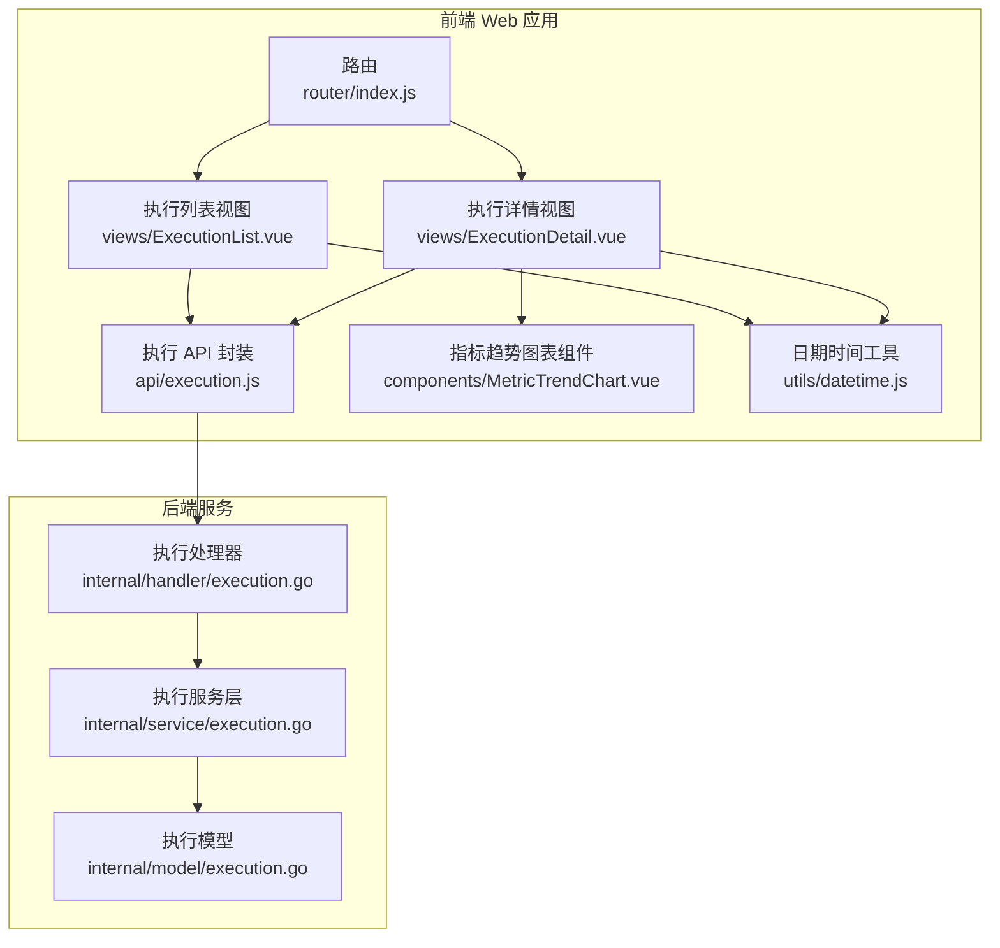
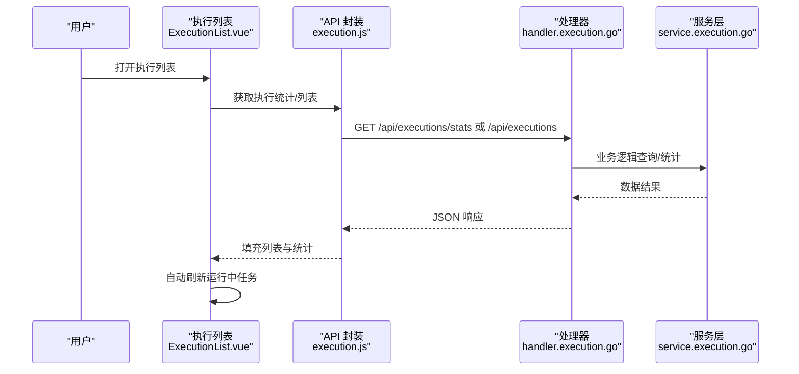
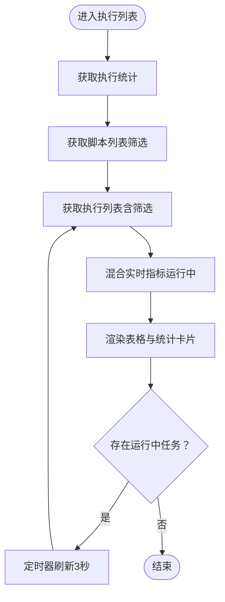
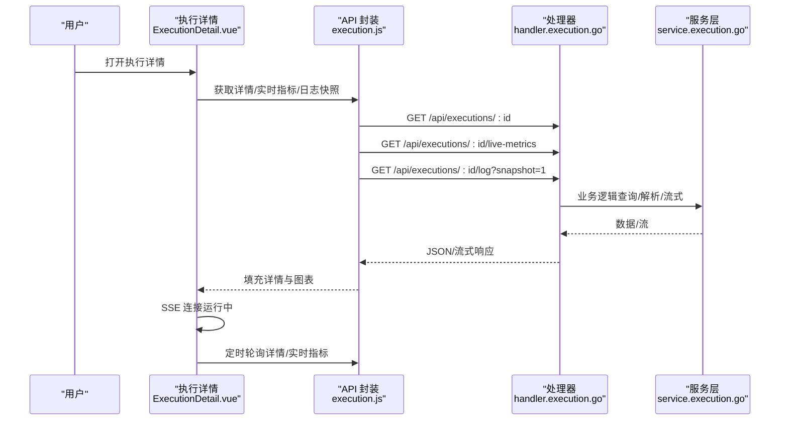
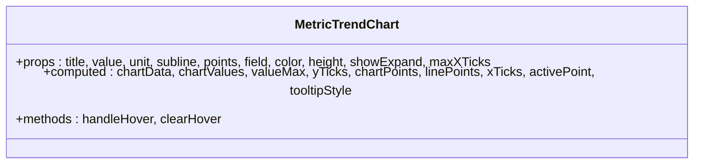
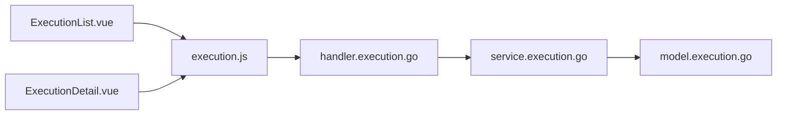

# 执行管理组件

<cite>
**本文档引用的文件**
- [ExecutionList.vue](file://web/src/views/ExecutionList.vue)
- [ExecutionDetail.vue](file://web/src/views/ExecutionDetail.vue)
- [execution.js](file://web/src/api/execution.js)
- [execution.go](file://internal/handler/execution.go)
- [execution.go](file://internal/service/execution.go)
- [execution.go](file://internal/model/execution.go)
- [MetricTrendChart.vue](file://web/src/components/MetricTrendChart.vue)
- [index.js](file://web/src/router/index.js)
- [datetime.js](file://web/src/utils/datetime.js)
</cite>

## 目录
1. [简介](#简介)
2. [项目结构](#项目结构)
3. [核心组件](#核心组件)
4. [架构总览](#架构总览)
5. [详细组件分析](#详细组件分析)
6. [依赖关系分析](#依赖关系分析)
7. [性能考虑](#性能考虑)
8. [故障排除指南](#故障排除指南)
9. [结论](#结论)

## 简介
本文件聚焦于执行管理相关的两个核心页面组件：执行记录列表（ExecutionList）与执行详情（ExecutionDetail）。文档深入阐述这两个组件的功能设计、数据流、与后端 API 的交互模式、实时监控机制、图表集成、性能优化策略以及用户体验设计。

## 项目结构
前端采用 Vue 3 单页应用，路由定义了执行管理页面；后端基于 Go Gin 框架提供执行管理 API；JMeter 结果与报告通过服务层解析与生成。

**图表来源**
- [index.js:1-55](file://web/src/router/index.js#L1-L55)
- [ExecutionList.vue:1-290](file://web/src/views/ExecutionList.vue#L1-L290)
- [ExecutionDetail.vue:1-200](file://web/src/views/ExecutionDetail.vue#L1-L200)
- [execution.js:1-78](file://web/src/api/execution.js#L1-L78)
- [execution.go:1-120](file://internal/handler/execution.go#L1-L120)
- [execution.go:1-120](file://internal/service/execution.go#L1-L120)
- [execution.go:1-19](file://internal/model/execution.go#L1-L19)

**章节来源**
- [index.js:1-55](file://web/src/router/index.js#L1-L55)
- [ExecutionList.vue:1-290](file://web/src/views/ExecutionList.vue#L1-L290)
- [ExecutionDetail.vue:1-200](file://web/src/views/ExecutionDetail.vue#L1-L200)
- [execution.js:1-78](file://web/src/api/execution.js#L1-L78)
- [execution.go:1-120](file://internal/handler/execution.go#L1-L120)
- [execution.go:1-120](file://internal/service/execution.go#L1-L120)
- [execution.go:1-19](file://internal/model/execution.go#L1-L19)

## 核心组件
- 执行记录列表（ExecutionList）
  - 功能：展示执行记录、状态筛选、时间范围筛选、关键字搜索、分页、统计卡片、自动刷新、批量操作（停止、删除）、查看详情跳转。
  - 关键特性：按状态聚合统计、运行中任务自动刷新、实时指标混合（持久化与实时）。
- 执行详情（ExecutionDetail）
  - 功能：执行概览、实时趋势图表、详细统计、错误分析、测试报告、执行日志（SSE 实时流）、导出能力（JTL、HTML 报告、错误记录、完整包）。
  - 关键特性：SSE 实时日志、图表放大对话框、错误详情弹窗、自动刷新策略。

**章节来源**
- [ExecutionList.vue:1-290](file://web/src/views/ExecutionList.vue#L1-L290)
- [ExecutionDetail.vue:1-200](file://web/src/views/ExecutionDetail.vue#L1-L200)

## 架构总览
前端组件通过 API 封装与后端交互，后端处理器调用服务层，服务层负责执行生命周期管理、JTL 解析、实时指标聚合与日志流式输出。

**图表来源**
- [ExecutionList.vue:504-556](file://web/src/views/ExecutionList.vue#L504-L556)
- [execution.js:3-17](file://web/src/api/execution.js#L3-L17)
- [execution.go:55-87](file://internal/handler/execution.go#L55-L87)
- [execution.go:89-98](file://internal/handler/execution.go#L89-L98)

**章节来源**
- [ExecutionList.vue:504-556](file://web/src/views/ExecutionList.vue#L504-L556)
- [execution.js:3-17](file://web/src/api/execution.js#L3-L17)
- [execution.go:55-98](file://internal/handler/execution.go#L55-L98)

## 详细组件分析

### 执行列表（ExecutionList）组件分析
- 页面布局与功能
  - 统计卡片：总执行数、运行中、已完成、失败、已停止，点击切换状态筛选。
  - 筛选区：脚本下拉、状态、日期范围、关键字搜索。
  - 执行记录表格：脚本名、状态、备注、开始时间、执行时长、样本数、平均 RT、TPS、错误率、操作列（查看、停止、删除）。
  - 分页与刷新：分页变更、大小变更、手动刷新、自动刷新指示。
- 数据处理与格式化
  - 执行时长：优先使用实时指标，其次使用持久化字段，最后回退到计算值。
  - 指标计算：从 summary_data 解析字段，支持实时指标覆盖。
  - 时间格式化：统一转换为上海时区字符串。
- 实时性与性能
  - 运行中任务定时刷新列表与实时指标。
  - 时钟定时器每秒更新，保证运行中时长准确。
- 用户交互
  - 停止执行与删除执行均使用二次确认。
  - 查看详情跳转至详情页。

**图表来源**
- [ExecutionList.vue:653-694](file://web/src/views/ExecutionList.vue#L653-L694)
- [ExecutionList.vue:482-502](file://web/src/views/ExecutionList.vue#L482-L502)

**章节来源**
- [ExecutionList.vue:1-290](file://web/src/views/ExecutionList.vue#L1-L290)
- [ExecutionList.vue:327-421](file://web/src/views/ExecutionList.vue#L327-L421)
- [ExecutionList.vue:482-556](file://web/src/views/ExecutionList.vue#L482-L556)
- [ExecutionList.vue:653-694](file://web/src/views/ExecutionList.vue#L653-L694)

### 执行详情（ExecutionDetail）组件分析
- 页面结构
  - 顶部信息栏：返回、脚本名、状态、导出菜单（JTL、HTML 报告、错误记录、完整包）、停止执行。
  - 执行概览：状态条、主指标卡片（吞吐量、平均响应时间）、迷你指标（样本数、错误率、P95、时长、流量）。
  - 实时趋势：TPS、请求次数、平均 RT、响应时间、并发数、成功率。
  - 详细统计：请求概况、延迟分布、流量与传输。
  - 错误分析：错误类型分布与明细、错误记录分页、错误详情弹窗。
  - 测试报告：iframe 展示 HTML 报告，支持全屏查看。
  - 执行日志：SSE 实时流、搜索高亮、复制/导出、断线重连。
- 数据流与刷新策略
  - 初始化：获取详情、实时指标、日志快照；运行中状态时获取实时指标与日志流。
  - 自动刷新：每 3 秒轮询详情与实时指标；运行中状态时刷新错误分析。
  - 实时日志：SSE 连接，断线指数退避重连。
- 图表组件集成
  - 使用 MetricTrendChart 组件展示多维趋势，支持放大对话框。
- 导出能力
  - JTL、HTML 报告（ZIP）、错误记录（CSV）、完整结果包（ZIP）。

**图表来源**
- [ExecutionDetail.vue:1308-1353](file://web/src/views/ExecutionDetail.vue#L1308-L1353)
- [ExecutionDetail.vue:1597-1638](file://web/src/views/ExecutionDetail.vue#L1597-L1638)
- [execution.js:19-42](file://web/src/api/execution.js#L19-L42)
- [execution.go:100-134](file://internal/handler/execution.go#L100-L134)
- [execution.go:555-708](file://internal/handler/execution.go#L555-L708)

**章节来源**
- [ExecutionDetail.vue:1-800](file://web/src/views/ExecutionDetail.vue#L1-L800)
- [ExecutionDetail.vue:800-1599](file://web/src/views/ExecutionDetail.vue#L800-L1599)
- [ExecutionDetail.vue:1600-2399](file://web/src/views/ExecutionDetail.vue#L1600-L2399)
- [ExecutionDetail.vue:2400-2972](file://web/src/views/ExecutionDetail.vue#L2400-L2972)
- [execution.js:19-77](file://web/src/api/execution.js#L19-L77)
- [execution.go:100-134](file://internal/handler/execution.go#L100-L134)
- [execution.go:555-708](file://internal/handler/execution.go#L555-L708)

### 图表组件（MetricTrendChart）分析
- 功能：绘制趋势折线图，支持悬停提示、坐标轴、网格、单位显示、放大对话框。
- 数据输入：points 数组（包含时间戳、数值），field 指定取值字段。
- 交互：鼠标悬停高亮、tooltip 定位、可扩展放大。

**图表来源**
- [MetricTrendChart.vue:123-284](file://web/src/components/MetricTrendChart.vue#L123-L284)

**章节来源**
- [MetricTrendChart.vue:1-454](file://web/src/components/MetricTrendChart.vue#L1-L454)

## 依赖关系分析
- 组件到 API 的依赖
  - ExecutionList.vue 依赖 execution.js 的 getStats、getList、stop、delete、getLiveMetrics。
  - ExecutionDetail.vue 依赖 execution.js 的 getDetail、getLiveMetrics、getErrors、stop、download*。
- API 到后端的依赖
  - execution.js 的接口映射到 handler.execution.go 的路由处理函数。
- 后端内部依赖
  - handler.execution.go 调用 service.execution.go，service 层封装数据库、文件系统、JMeter 执行与解析逻辑。
- 模型依赖
  - internal/model/execution.go 定义执行实体，前后端共享结构。

**图表来源**
- [ExecutionList.vue:309-310](file://web/src/views/ExecutionList.vue#L309-L310)
- [ExecutionDetail.vue:801-803](file://web/src/views/ExecutionDetail.vue#L801-L803)
- [execution.js:3-77](file://web/src/api/execution.js#L3-L77)
- [execution.go:39-53](file://internal/handler/execution.go#L39-L53)
- [execution.go:104-481](file://internal/service/execution.go#L104-L481)
- [execution.go:3-18](file://internal/model/execution.go#L3-L18)

**章节来源**
- [ExecutionList.vue:309-310](file://web/src/views/ExecutionList.vue#L309-L310)
- [ExecutionDetail.vue:801-803](file://web/src/views/ExecutionDetail.vue#L801-L803)
- [execution.js:3-77](file://web/src/api/execution.js#L3-L77)
- [execution.go:39-53](file://internal/handler/execution.go#L39-L53)
- [execution.go:104-481](file://internal/service/execution.go#L104-L481)
- [execution.go:3-18](file://internal/model/execution.go#L3-L18)

## 性能考虑
- 列表侧
  - 自动刷新间隔：3 秒，仅在存在运行中任务时触发，避免不必要的轮询。
  - 实时指标混合：对运行中任务使用实时指标，其他任务使用持久化 summary_data，减少 IO。
  - 时钟定时器：每秒更新 nowTick，保证运行中时长计算准确，避免频繁网络请求。
- 详情侧
  - SSE 实时日志：断线重连采用指数退避，限制最大重连次数，降低资源占用。
  - 日志缓冲：pendingLogLines + 定时 flush，避免高频 DOM 更新。
  - 图表渲染：SVG 绘制，按需计算坐标与刻度，支持最大 X 轴刻度限制。
- 通用
  - 日期时间解析与格式化集中于工具模块，避免重复计算。
  - 组件内使用 computed 与 watch 控制刷新范围，减少不必要渲染。

**章节来源**
- [ExecutionList.vue:653-694](file://web/src/views/ExecutionList.vue#L653-L694)
- [ExecutionDetail.vue:1737-1770](file://web/src/views/ExecutionDetail.vue#L1737-L1770)
- [ExecutionDetail.vue:1597-1638](file://web/src/views/ExecutionDetail.vue#L1597-L1638)
- [datetime.js:1-71](file://web/src/utils/datetime.js#L1-L71)

## 故障排除指南
- 列表无数据
  - 检查筛选条件与日期范围；尝试重置筛选。
  - 确认后端执行记录是否存在与状态正确。
- 实时指标不更新
  - 确认执行状态为 running；检查 getLiveMetrics 接口是否正常。
  - 查看浏览器控制台网络请求与后端日志。
- 日志流异常
  - 检查 SSE 连接状态与断线重连日志；确认日志文件路径与权限。
  - 若执行已完成，SSE 会发送 complete 事件，属预期行为。
- 停止执行失败
  - 确认执行确实处于 running 状态；查看服务层进程管理与数据库状态更新。
- 导出失败
  - 检查结果文件/报告目录是否存在；确认后端下载接口返回状态与文件路径。

**章节来源**
- [ExecutionList.vue:601-651](file://web/src/views/ExecutionList.vue#L601-L651)
- [ExecutionDetail.vue:1675-1698](file://web/src/views/ExecutionDetail.vue#L1675-L1698)
- [execution.go:555-708](file://internal/handler/execution.go#L555-L708)
- [execution.go:949-994](file://internal/service/execution.go#L949-L994)

## 结论
执行管理组件围绕“列表—详情”的核心流程构建，通过 API 封装与后端服务层实现完整的执行生命周期管理。列表侧强调筛选、统计与自动刷新，详情侧强调实时监控、趋势可视化与报告/日志导出。整体设计在保证用户体验的同时兼顾性能与可维护性，适合在生产环境中稳定运行。