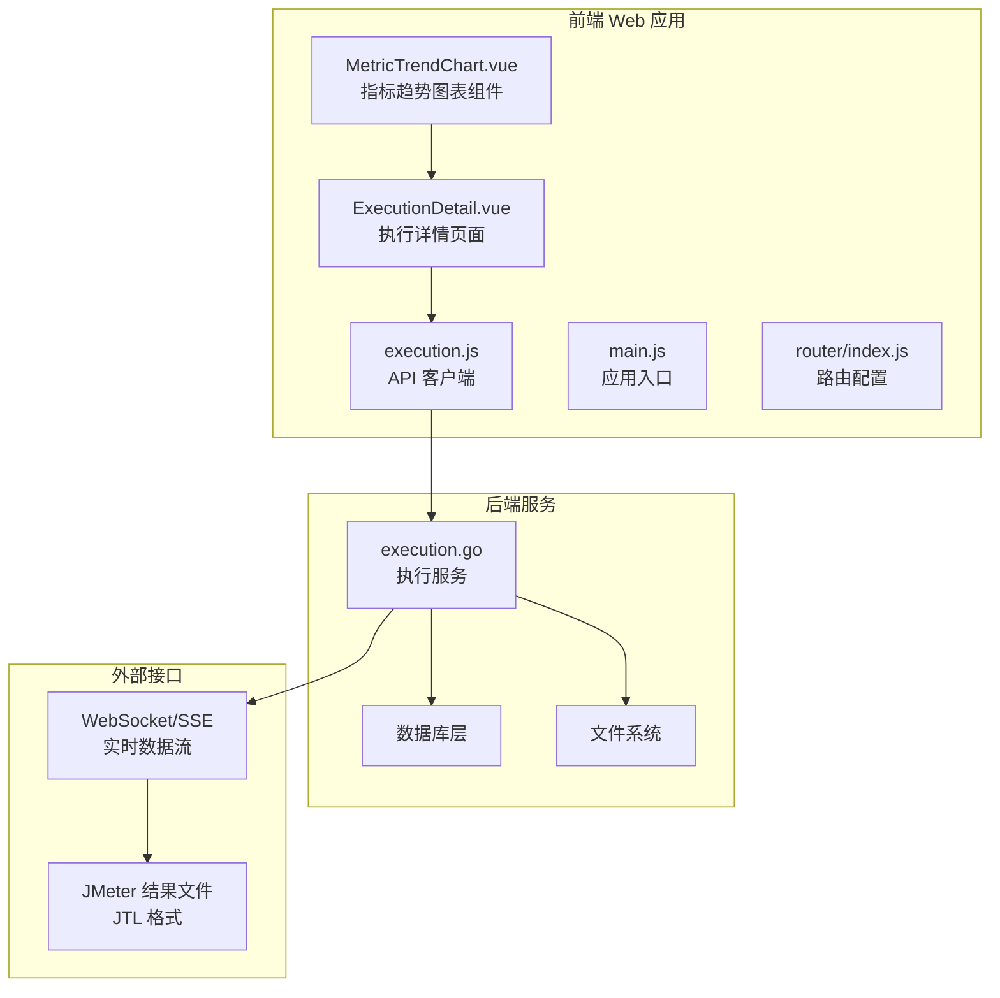
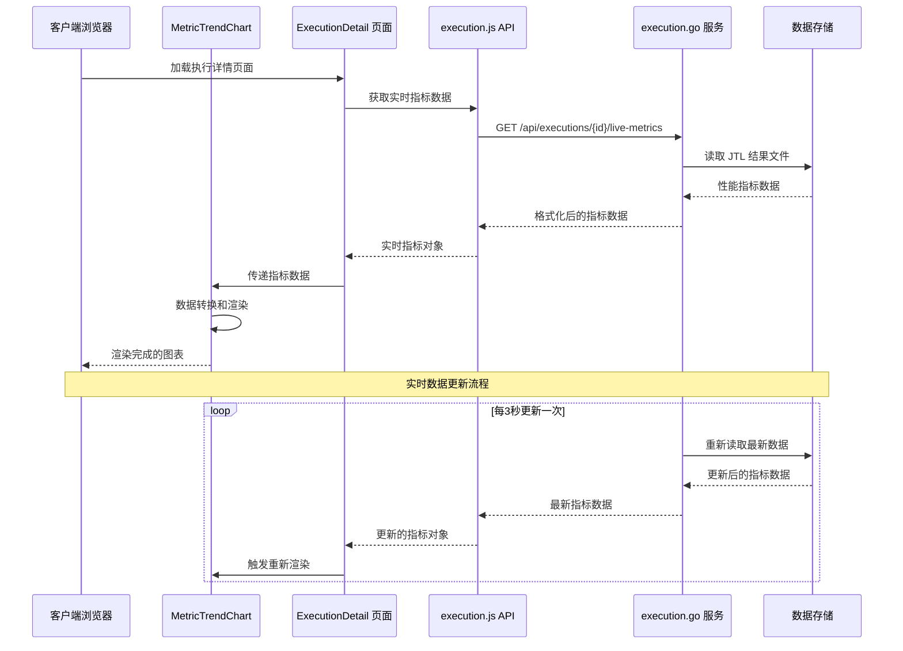
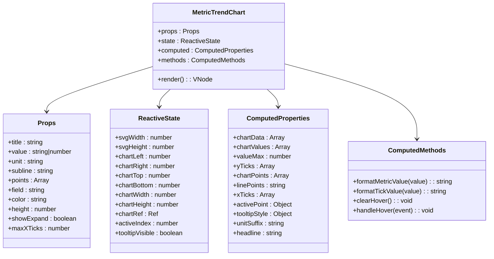
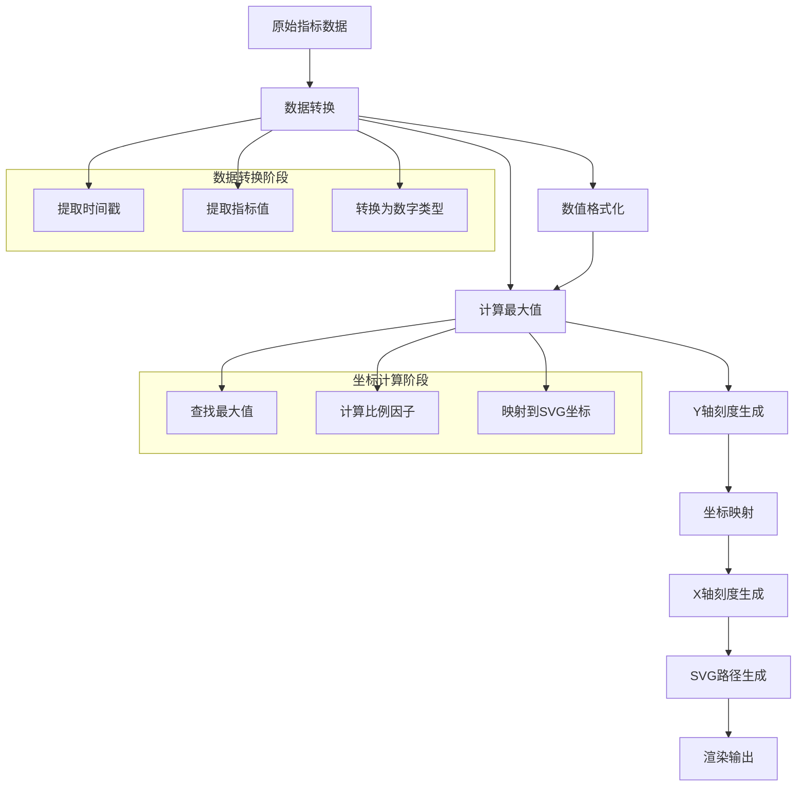
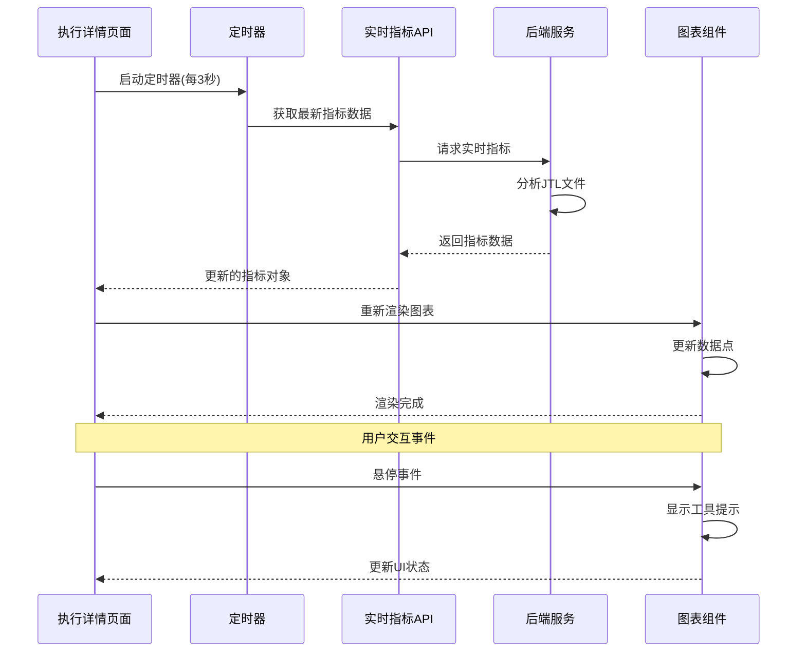
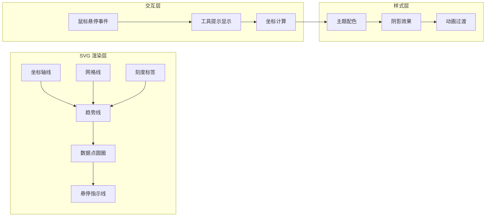
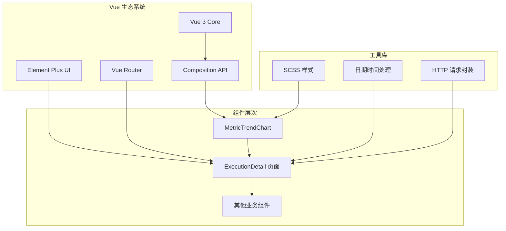
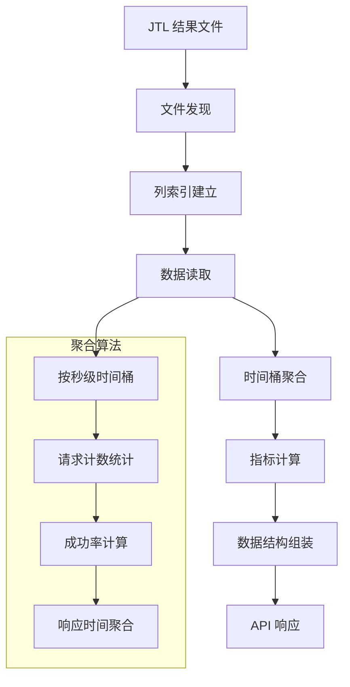

# 指标趋势图表组件

<cite>
**本文档引用的文件**
- [MetricTrendChart.vue](file://web/src/components/MetricTrendChart.vue)
- [ExecutionDetail.vue](file://web/src/views/ExecutionDetail.vue)
- [execution.js](file://web/src/api/execution.js)
- [execution.go](file://internal/service/execution.go)
- [datetime.js](file://web/src/utils/datetime.js)
- [main.js](file://web/src/main.js)
- [router/index.js](file://web/src/router/index.js)
</cite>

## 目录
1. [简介](#简介)
2. [项目结构](#项目结构)
3. [核心组件](#核心组件)
4. [架构概览](#架构概览)
5. [详细组件分析](#详细组件分析)
6. [依赖关系分析](#依赖关系分析)
7. [性能考虑](#性能考虑)
8. [故障排除指南](#故障排除指南)
9. [结论](#结论)

## 简介

MetricTrendChart 是 JMeter Admin 项目中的核心可视化组件，专门用于展示性能测试过程中的实时指标趋势。该组件采用纯 SVG 实现，提供了丰富的交互功能和高度可定制的视觉效果。

该组件支持多种关键性能指标的可视化展示，包括吞吐量(TPS)、请求速率、响应时间、并发数、成功率等，为性能测试工程师提供了直观的监控界面。

## 项目结构

JMeter Admin 项目采用前后端分离架构，前端使用 Vue 3 + TypeScript + Element Plus 构建，后端使用 Go 语言开发。

**图表来源**
- [MetricTrendChart.vue:1-454](file://web/src/components/MetricTrendChart.vue#L1-L454)
- [ExecutionDetail.vue:1-2972](file://web/src/views/ExecutionDetail.vue#L1-L2972)
- [execution.go:1585-1779](file://internal/service/execution.go#L1585-L1779)

**章节来源**
- [main.js:1-23](file://web/src/main.js#L1-L23)
- [router/index.js:1-55](file://web/src/router/index.js#L1-L55)

## 核心组件

MetricTrendChart 组件是整个性能监控系统的核心，它实现了以下关键功能：

### 主要特性
- **实时数据可视化**: 支持实时更新的指标趋势展示
- **多指标对比**: 同时展示多个性能指标的对比情况
- **时间序列展示**: 以时间为轴的连续数据流展示
- **响应式设计**: 自适应不同屏幕尺寸的显示效果
- **交互式操作**: 支持悬停查看、缩放、区域选择等操作

### 数据结构
组件接收标准化的指标数据格式，每个数据点包含：
- 时间戳信息
- 指标数值
- 元数据标签

**章节来源**
- [MetricTrendChart.vue:126-137](file://web/src/components/MetricTrendChart.vue#L126-L137)
- [execution.go:1585-1604](file://internal/service/execution.go#L1585-L1604)

## 架构概览

系统采用分层架构设计，从前端渲染到后端数据处理形成完整的数据流。

**图表来源**
- [ExecutionDetail.vue:1341-1353](file://web/src/views/ExecutionDetail.vue#L1341-L1353)
- [execution.js:24-27](file://web/src/api/execution.js#L24-L27)
- [execution.go:685-895](file://internal/service/execution.go#L685-L895)

**章节来源**
- [ExecutionDetail.vue:1341-1353](file://web/src/views/ExecutionDetail.vue#L1341-L1353)
- [execution.js:24-27](file://web/src/api/execution.js#L24-L27)

## 详细组件分析

### 组件架构设计

MetricTrendChart 采用了函数式组件设计，利用 Vue 3 的 Composition API 提供了强大的响应式数据处理能力。

**图表来源**
- [MetricTrendChart.vue:123-284](file://web/src/components/MetricTrendChart.vue#L123-L284)

### 数据处理管道

组件实现了完整的数据处理管道，从原始指标数据到最终的 SVG 渲染。

**图表来源**
- [MetricTrendChart.vue:154-229](file://web/src/components/MetricTrendChart.vue#L154-L229)

### 实时更新机制

系统实现了基于 WebSocket 的实时数据更新机制，确保用户能够看到最新的性能指标。

**图表来源**
- [ExecutionDetail.vue:1341-1353](file://web/src/views/ExecutionDetail.vue#L1341-L1353)
- [execution.js:24-27](file://web/src/api/execution.js#L24-L27)

**章节来源**
- [ExecutionDetail.vue:1341-1353](file://web/src/views/ExecutionDetail.vue#L1341-L1353)
- [MetricTrendChart.vue:264-283](file://web/src/components/MetricTrendChart.vue#L264-L283)

### 图表渲染引擎

组件使用纯 SVG 实现，提供了高性能的渲染能力和丰富的视觉效果。

**图表来源**
- [MetricTrendChart.vue:29-119](file://web/src/components/MetricTrendChart.vue#L29-L119)

**章节来源**
- [MetricTrendChart.vue:29-119](file://web/src/components/MetricTrendChart.vue#L29-L119)

## 依赖关系分析

### 前端依赖关系

**图表来源**
- [main.js:1-23](file://web/src/main.js#L1-L23)
- [router/index.js:1-55](file://web/src/router/index.js#L1-L55)

### 后端数据处理

后端服务负责处理 JTL 结果文件，提取关键性能指标并进行聚合计算。

**图表来源**
- [execution.go:685-895](file://internal/service/execution.go#L685-L895)

**章节来源**
- [execution.go:685-895](file://internal/service/execution.go#L685-L895)

## 性能考虑

### 渲染性能优化

组件采用了多项性能优化策略来确保在大数据量下的流畅渲染：

1. **虚拟 DOM 优化**: 使用 Vue 3 的 Composition API 减少不必要的重渲染
2. **SVG 原生渲染**: 直接使用 SVG 元素避免复杂的 CSS 渲染开销
3. **数据缓存**: 计算结果缓存在响应式引用中，避免重复计算
4. **批量更新**: 将多个状态更新合并为单次渲染

### 内存管理

- **数据截断**: 当数据量超过阈值时自动截断旧数据
- **垃圾回收**: 及时清理不再使用的计算结果
- **事件监听器**: 在组件卸载时清理所有事件监听器

### 网络优化

- **请求去重**: 防止重复的 API 请求
- **节流控制**: 对频繁的用户交互进行节流处理
- **增量更新**: 只更新发生变化的数据点

## 故障排除指南

### 常见问题及解决方案

#### 图表不显示或显示异常

**症状**: 图表空白或显示错误

**可能原因**:
1. 数据格式不正确
2. SVG 容器尺寸异常
3. 计算属性未正确更新

**解决步骤**:
1. 检查传入的指标数据格式
2. 验证组件容器的 CSS 样式
3. 确认计算属性的依赖关系

#### 实时数据更新延迟

**症状**: 图表数据更新不及时

**可能原因**:
1. API 请求频率过高
2. 数据处理逻辑阻塞
3. 浏览器性能问题

**解决步骤**:
1. 检查网络连接状态
2. 优化数据处理算法
3. 考虑降低更新频率

#### 移动端显示问题

**症状**: 在移动设备上显示效果不佳

**可能原因**:
1. 响应式设计问题
2. 触摸事件处理不当
3. 屏幕分辨率适配

**解决步骤**:
1. 检查媒体查询规则
2. 验证触摸事件绑定
3. 测试不同屏幕尺寸

**章节来源**
- [MetricTrendChart.vue:264-283](file://web/src/components/MetricTrendChart.vue#L264-L283)

## 结论

MetricTrendChart 组件作为 JMeter Admin 项目的核心可视化组件，展现了现代前端性能监控的最佳实践。通过纯 SVG 实现、响应式设计和高效的实时数据处理机制，该组件为性能测试工程师提供了强大而直观的监控工具。

组件的主要优势包括：
- **高性能渲染**: 基于 SVG 的原生渲染确保了流畅的用户体验
- **实时性**: 通过 WebSocket 和定期轮询实现数据的实时更新
- **可扩展性**: 模块化的架构设计便于功能扩展和维护
- **用户体验**: 丰富的交互功能和响应式设计提升了用户的操作体验

未来可以考虑的改进方向：
- 集成更高级的图表库以支持更复杂的数据可视化需求
- 实现数据缓存机制以减少重复计算
- 添加更多的交互功能，如数据导出、图表分享等
- 优化移动端的触摸交互体验