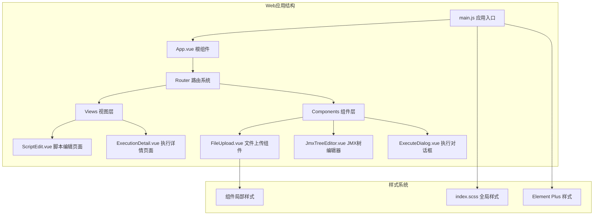
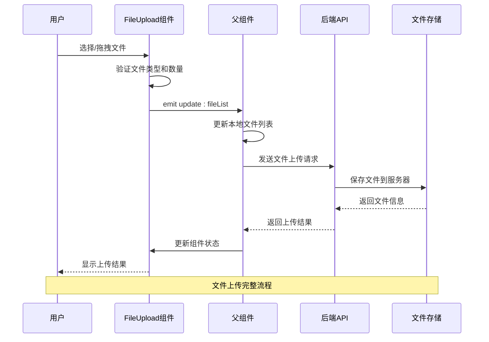
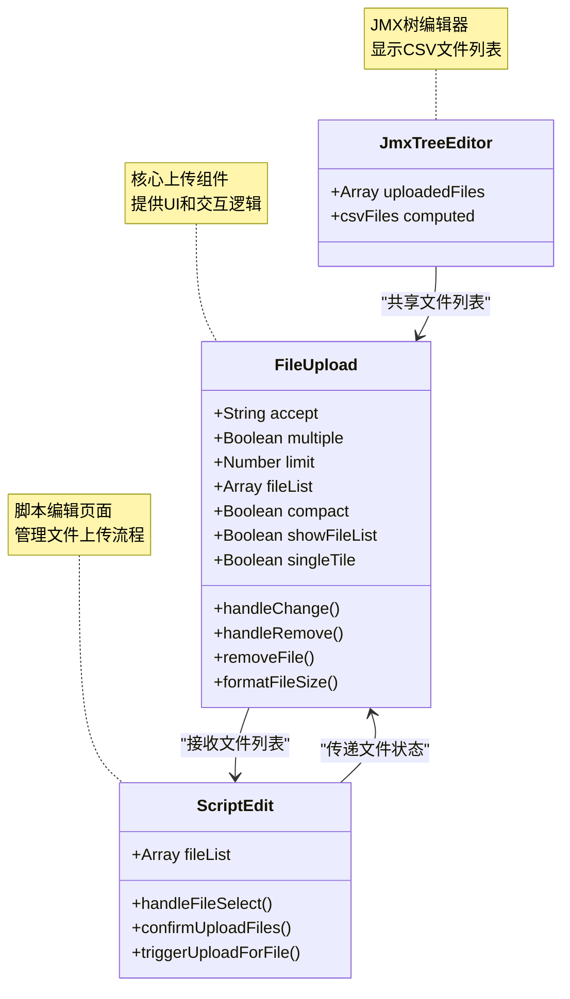
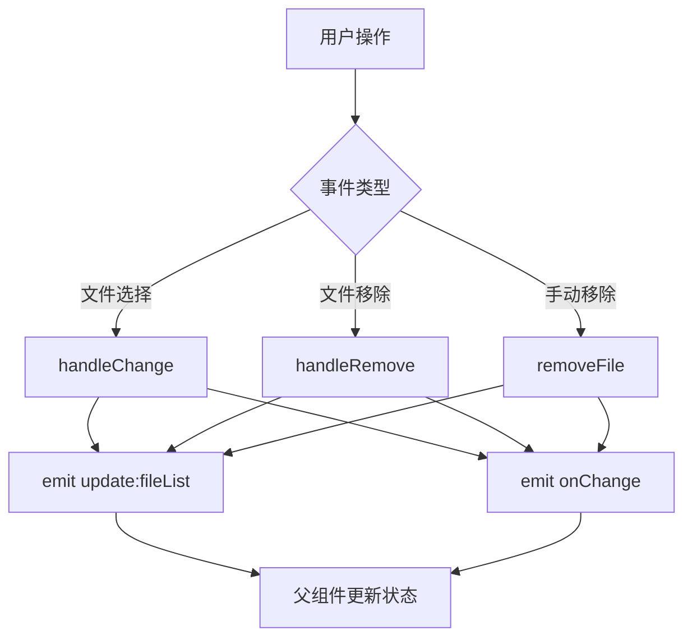
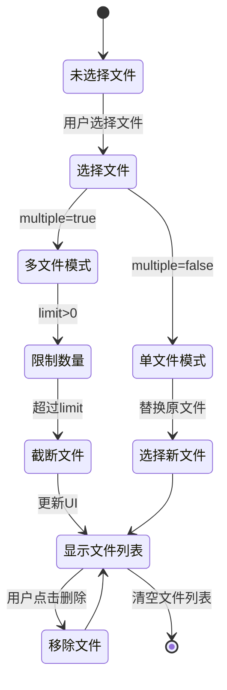
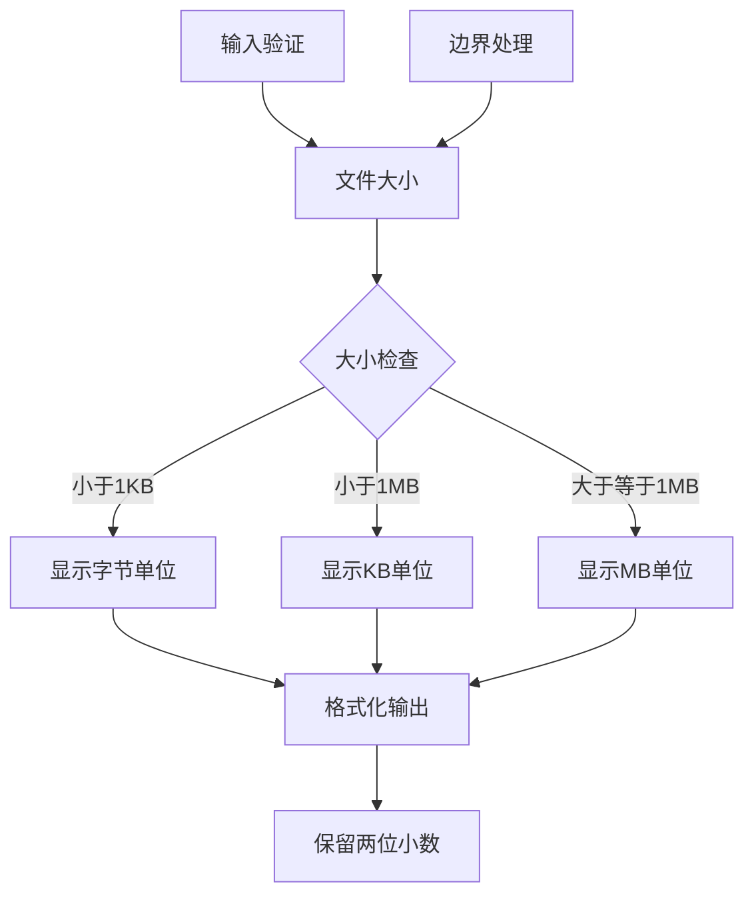
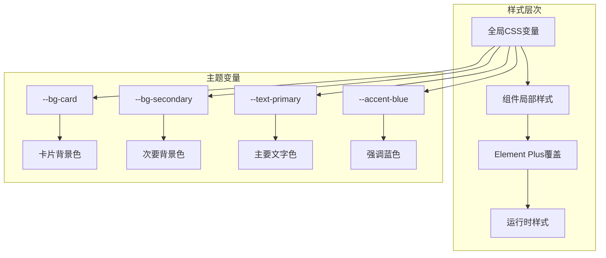
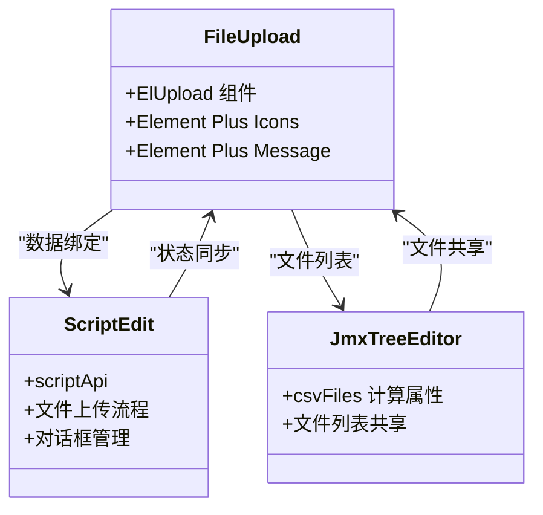
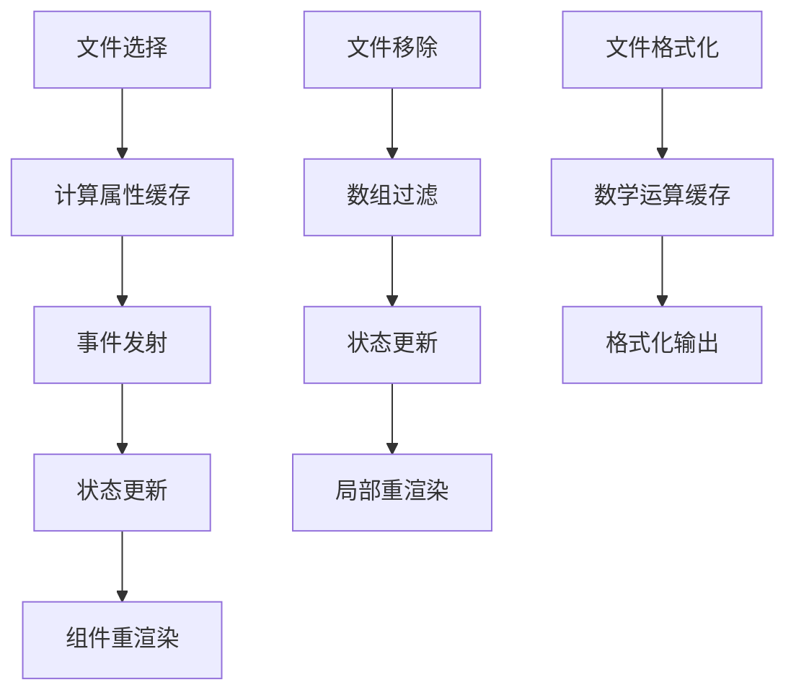

# 文件上传组件

<cite>
**本文档引用的文件**
- [FileUpload.vue](file://web/src/components/FileUpload.vue)
- [ScriptEdit.vue](file://web/src/views/ScriptEdit.vue)
- [JmxTreeEditor.vue](file://web/src/components/JmxTreeEditor.vue)
- [main.js](file://web/src/main.js)
- [index.scss](file://web/src/styles/index.scss)
- [package.json](file://web/package.json)
</cite>

## 目录
1. [简介](#简介)
2. [项目结构](#项目结构)
3. [核心组件](#核心组件)
4. [架构概览](#架构概览)
5. [详细组件分析](#详细组件分析)
6. [依赖关系分析](#依赖关系分析)
7. [性能考虑](#性能考虑)
8. [故障排除指南](#故障排除指南)
9. [结论](#结论)
10. [附录](#附录)

## 简介

文件上传组件是 JMeter Admin 系统中的核心功能模块，为用户提供直观、高效的文件上传体验。该组件基于 Element Plus 的 ElUpload 组件构建，支持多种上传模式，包括拖拽上传、单文件选择和多文件限制等特性。

该组件主要服务于 JMX 脚本文件的上传管理，同时也可以用于其他类型的文件上传场景。组件设计遵循暗色主题风格，提供流畅的用户体验和良好的视觉反馈。

## 项目结构

JMeter Admin 采用 Vue 3 + Element Plus 的现代前端架构，文件上传组件位于组件目录中，与其他业务组件协同工作。



**图表来源**
- [main.js:1-23](file://web/src/main.js#L1-L23)
- [FileUpload.vue:1-491](file://web/src/components/FileUpload.vue#L1-L491)

**章节来源**
- [main.js:1-23](file://web/src/main.js#L1-L23)
- [package.json:1-24](file://web/package.json#L1-L24)

## 核心组件

文件上传组件 FileUpload 是整个上传功能的核心，提供了完整的文件上传界面和交互逻辑。

### 组件特性

- **多模式支持**：支持拖拽上传和单文件选择两种模式
- **文件类型限制**：通过 accept 属性控制可上传的文件类型
- **多文件管理**：支持单文件和多文件上传，具备文件数量限制
- **实时状态反馈**：提供文件列表展示和状态更新
- **紧凑模式**：支持紧凑布局，适合表单内嵌场景
- **单块模式**：支持单块选择器，专门用于 JMX 文件上传

### 主要功能

1. **拖拽上传**：用户可以通过拖拽文件到上传区域进行上传
2. **文件选择**：支持点击选择文件或直接拖拽文件
3. **文件列表管理**：实时显示已选择的文件列表
4. **文件大小格式化**：自动格式化文件大小显示
5. **文件移除**：支持单独移除某个文件
6. **事件通知**：通过事件向父组件传递文件状态变化

**章节来源**
- [FileUpload.vue:69-102](file://web/src/components/FileUpload.vue#L69-L102)
- [FileUpload.vue:120-145](file://web/src/components/FileUpload.vue#L120-L145)

## 架构概览

文件上传组件在整个系统架构中扮演着重要的角色，与多个业务模块紧密协作。



**图表来源**
- [FileUpload.vue:120-145](file://web/src/components/FileUpload.vue#L120-L145)
- [ScriptEdit.vue:772-822](file://web/src/views/ScriptEdit.vue#L772-L822)

### 组件间关系



**图表来源**
- [FileUpload.vue:69-102](file://web/src/components/FileUpload.vue#L69-L102)
- [ScriptEdit.vue:319](file://web/src/views/ScriptEdit.vue#L319)
- [JmxTreeEditor.vue:1120-1125](file://web/src/components/JmxTreeEditor.vue#L1120-L1125)

**章节来源**
- [ScriptEdit.vue:319](file://web/src/views/ScriptEdit.vue#L319)
- [JmxTreeEditor.vue:1120-1125](file://web/src/components/JmxTreeEditor.vue#L1120-L1125)

## 详细组件分析

### 组件属性配置

FileUpload 组件提供了丰富的属性配置，满足不同场景的上传需求：

| 属性名 | 类型 | 默认值 | 描述 |
|--------|------|--------|------|
| accept | String | '*' | 文件类型限制，支持 MIME 类型或扩展名 |
| multiple | Boolean | true | 是否允许多文件上传 |
| limit | Number | 0 | 文件数量限制，0 表示不限制 |
| fileList | Array | [] | 当前文件列表，双向绑定 |
| tip | String | '' | 自定义提示信息 |
| compact | Boolean | false | 是否使用紧凑模式 |
| showFileList | Boolean | true | 是否显示文件列表 |
| singleTile | Boolean | false | 是否使用单块选择器模式 |

### 事件处理机制

组件通过事件系统与父组件进行通信：



**图表来源**
- [FileUpload.vue:120-145](file://web/src/components/FileUpload.vue#L120-L145)

### 文件状态管理

组件实现了完整的文件状态管理机制：



**图表来源**
- [FileUpload.vue:120-134](file://web/src/components/FileUpload.vue#L120-L134)
- [FileUpload.vue:136-145](file://web/src/components/FileUpload.vue#L136-L145)

### 文件大小格式化算法

组件提供了智能的文件大小格式化功能：



**图表来源**
- [FileUpload.vue:147-152](file://web/src/components/FileUpload.vue#L147-L152)

**章节来源**
- [FileUpload.vue:69-102](file://web/src/components/FileUpload.vue#L69-L102)
- [FileUpload.vue:120-152](file://web/src/components/FileUpload.vue#L120-L152)

### 样式系统与主题适配

组件采用暗色主题设计，与整体应用风格保持一致：



**图表来源**
- [index.scss:67-112](file://web/src/styles/index.scss#L67-L112)
- [FileUpload.vue:155-491](file://web/src/components/FileUpload.vue#L155-L491)

**章节来源**
- [index.scss:67-112](file://web/src/styles/index.scss#L67-L112)
- [FileUpload.vue:155-491](file://web/src/components/FileUpload.vue#L155-L491)

## 依赖关系分析

### 外部依赖

组件依赖于以下外部库：

```mermaid
graph LR
subgraph "Vue生态系统"
A[Vue 3.4.21] --> B[Composition API]
C[Element Plus 2.6.3] --> D[ElUpload组件]
E[@element-plus/icons-vue] --> F[图标组件]
end
subgraph "项目内部依赖"
G[FileUpload.vue] --> H[ScriptEdit.vue]
G --> I[JmxTreeEditor.vue]
H --> J[scriptApi]
I --> K[jmxParser]
end
subgraph "样式系统"
L[index.scss] --> M[全局变量]
N[Element Plus CSS] --> O[组件样式]
end
```

**图表来源**
- [package.json:10-17](file://web/package.json#L10-L17)
- [main.js:1-23](file://web/src/main.js#L1-L23)

### 内部依赖关系



**图表来源**
- [FileUpload.vue:65-67](file://web/src/components/FileUpload.vue#L65-L67)
- [ScriptEdit.vue:305](file://web/src/views/ScriptEdit.vue#L305)
- [JmxTreeEditor.vue:597](file://web/src/components/JmxTreeEditor.vue#L597)

**章节来源**
- [package.json:10-17](file://web/package.json#L10-L17)
- [main.js:1-23](file://web/src/main.js#L1-L23)

## 性能考虑

### 文件处理优化

组件在文件处理方面采用了多项优化策略：

1. **内存管理**：使用 computed 属性避免不必要的重新计算
2. **事件节流**：通过事件系统减少重复渲染
3. **虚拟滚动**：文件列表采用虚拟滚动提升大数据量性能
4. **懒加载**：图标和样式按需加载

### 渲染性能



**图表来源**
- [FileUpload.vue:111-118](file://web/src/components/FileUpload.vue#L111-L118)
- [FileUpload.vue:147-152](file://web/src/components/FileUpload.vue#L147-L152)

## 故障排除指南

### 常见问题及解决方案

| 问题类型 | 症状 | 可能原因 | 解决方案 |
|----------|------|----------|----------|
| 文件类型错误 | 无法上传特定文件 | accept 属性限制 | 检查 accept 值或设置为 '*' |
| 文件数量超限 | 上传被截断 | limit 属性设置 | 调整 limit 值或移除多余文件 |
| 文件大小异常 | 显示格式错误 | 文件大小为 null | 检查文件对象完整性 |
| UI 不更新 | 界面状态不同步 | 事件未正确发射 | 确认 update:fileList 事件 |
| 样式冲突 | 组件样式异常 | CSS 优先级问题 | 检查样式作用域 |

### 调试技巧

1. **开发者工具**：使用浏览器开发者工具监控组件状态
2. **日志输出**：在关键事件中添加 console.log 输出
3. **状态检查**：验证 fileList 数组的数据结构
4. **网络监控**：检查文件上传请求的响应

**章节来源**
- [FileUpload.vue:120-152](file://web/src/components/FileUpload.vue#L120-L152)

## 结论

文件上传组件 FileUpload 是 JMeter Admin 系统中的重要组成部分，它提供了完整的文件上传解决方案。组件具有以下特点：

- **功能完整**：支持多种上传模式和文件管理功能
- **用户体验优秀**：直观的界面设计和流畅的交互体验
- **可扩展性强**：灵活的属性配置和事件系统
- **主题一致**：与整体应用风格完美融合
- **性能优化**：采用多项技术手段确保运行效率

该组件为 JMX 脚本管理和数据文件上传提供了坚实的技术基础，是整个系统文件管理功能的核心支撑。

## 附录

### 使用示例

#### JMX 文件上传场景

```javascript
// 在脚本编辑页面中使用
<FileUpload
  v-model:fileList="fileList"
  accept=".jmx"
  :multiple="false"
  :singleTile="true"
  @onChange="handleFileChange"
/>
```

#### 附件上传场景

```javascript
// 在数据文件上传中使用
<FileUpload
  v-model:fileList="attachmentList"
  accept=".csv,.txt,.json"
  :multiple="true"
  :limit="10"
  @onChange="handleAttachmentChange"
/>
```

### 最佳实践

1. **合理设置 accept 属性**：根据业务需求精确限定文件类型
2. **适当使用 limit 属性**：控制文件数量，避免资源浪费
3. **及时清理文件**：定期清理不需要的临时文件
4. **错误处理**：完善上传失败的错误处理机制
5. **性能监控**：关注大量文件上传时的性能表现