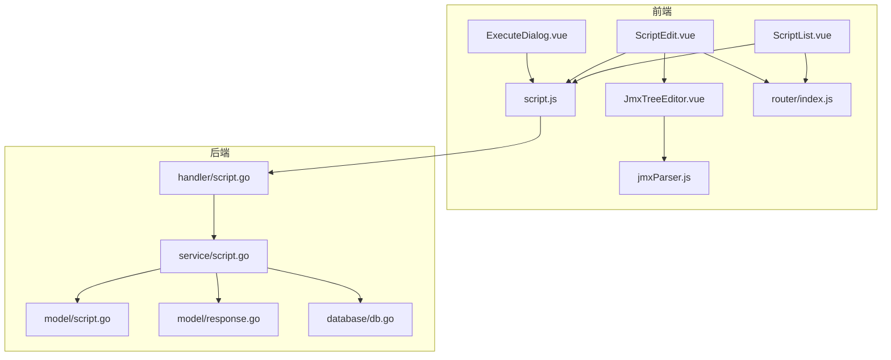
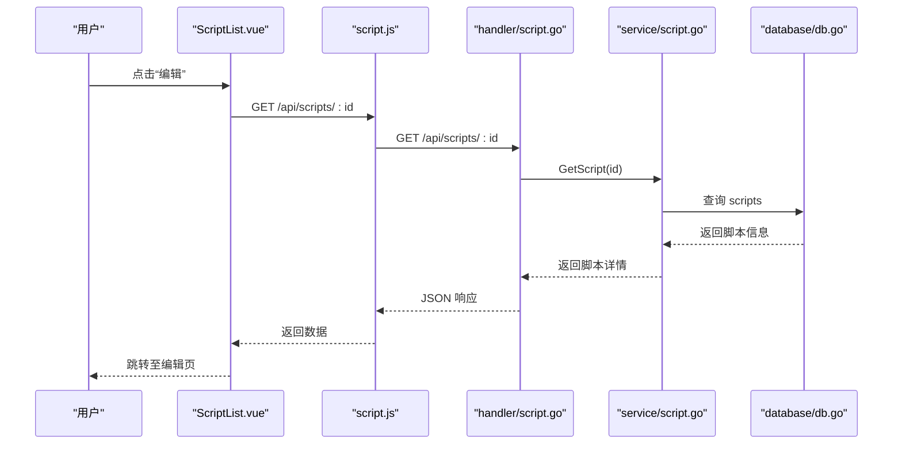
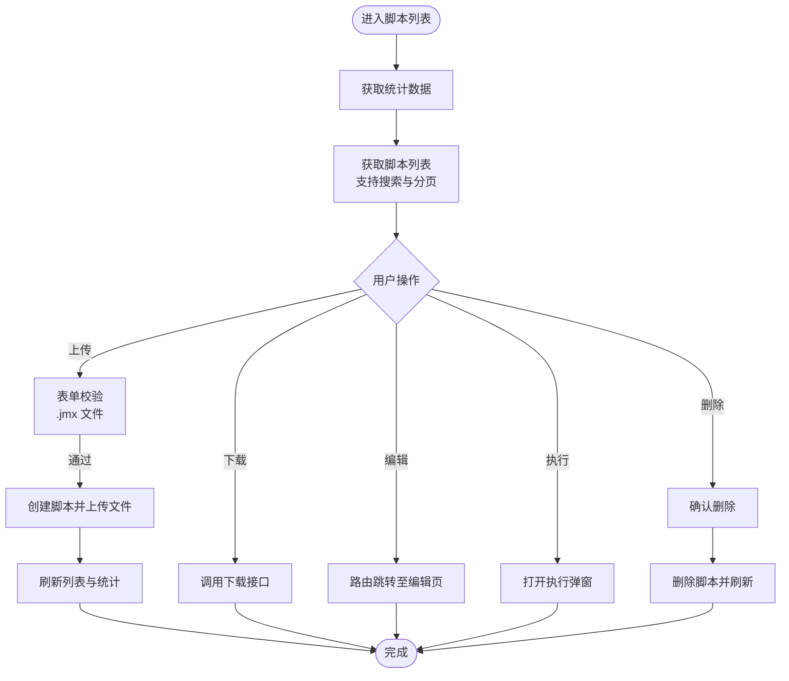
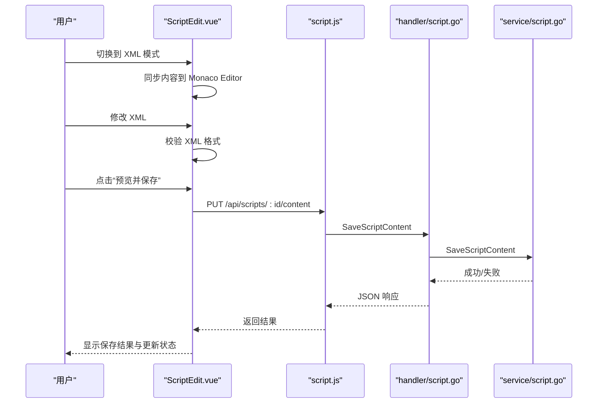
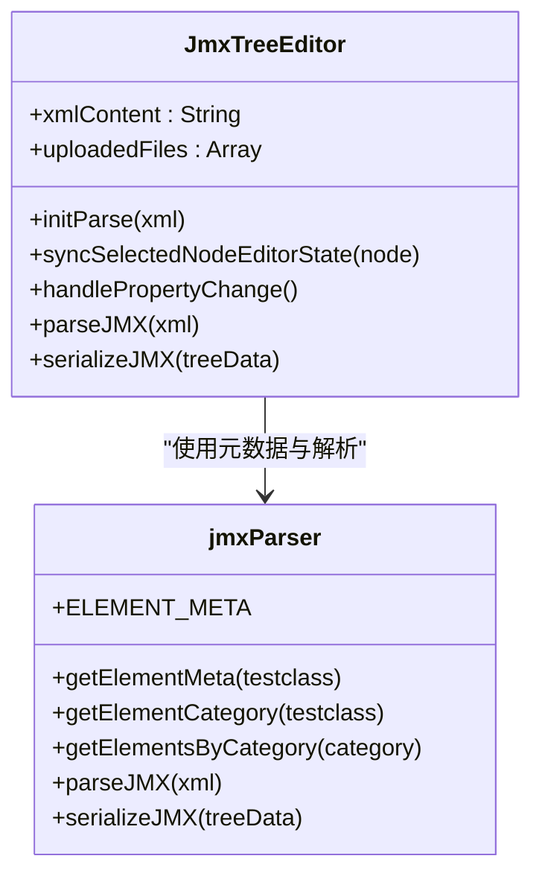
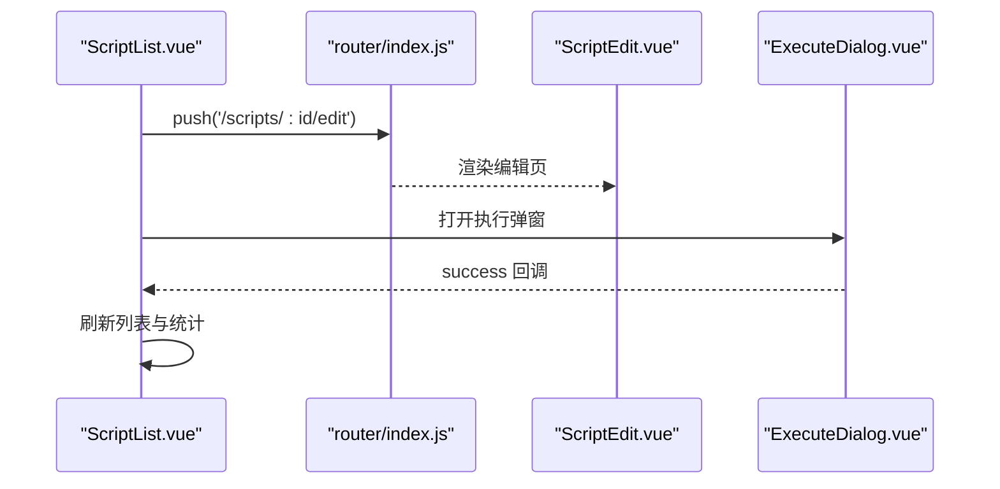
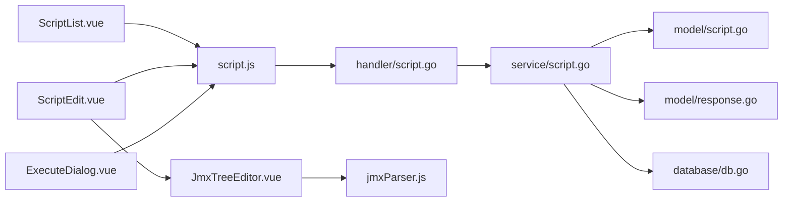

# 脚本管理组件

<cite>
**本文档引用的文件**
- [ScriptList.vue](file://web/src/views/ScriptList.vue)
- [ScriptEdit.vue](file://web/src/views/ScriptEdit.vue)
- [script.js](file://web/src/api/script.js)
- [script.go](file://internal/handler/script.go)
- [script.go](file://internal/service/script.go)
- [script.go](file://internal/model/script.go)
- [response.go](file://internal/model/response.go)
- [db.go](file://internal/database/db.go)
- [JmxTreeEditor.vue](file://web/src/components/JmxTreeEditor.vue)
- [jmxParser.js](file://web/src/utils/jmxParser.js)
- [ExecuteDialog.vue](file://web/src/components/ExecuteDialog.vue)
- [index.js](file://web/src/router/index.js)
</cite>

## 目录
1. [简介](#简介)
2. [项目结构](#项目结构)
3. [核心组件](#核心组件)
4. [架构总览](#架构总览)
5. [详细组件分析](#详细组件分析)
6. [依赖关系分析](#依赖关系分析)
7. [性能考量](#性能考量)
8. [故障排查指南](#故障排查指南)
9. [结论](#结论)
10. [附录](#附录)

## 简介
本文件聚焦于脚本管理相关的两个核心页面组件：ScriptList（脚本列表）与 ScriptEdit（脚本编辑）。文档将深入阐述：
- ScriptList 的功能设计：脚本列表展示、搜索过滤、分页、批量操作、状态统计、上传与下载、删除等。
- ScriptEdit 的实现细节：JMX 文件可视化编辑、XML 源码编辑、实时预览、语法高亮、文件关联与上传、保存操作、撤销/重做、差异预览等。
- 组件间的数据流转：从列表到编辑页面的导航、编辑状态同步、保存后的列表刷新。
- 与 API 的交互模式：脚本 CRUD、文件上传下载、内容同步。
- 权限控制与安全考虑：文件名校验、路径穿越防护、大小限制、XML 校验。
- 用户体验优化：加载状态、错误处理、操作反馈。
- 在脚本管理流程中的作用与集成方式。

## 项目结构
前端采用 Vue 3 + Element Plus + Monaco Editor 的技术栈；后端使用 Go + Gin + SQLite。脚本管理模块位于 web/src/views 与 internal/handler/service/model/database 目录中。

图表来源
- [ScriptList.vue:1-505](file://web/src/views/ScriptList.vue#L1-L505)
- [ScriptEdit.vue:1-800](file://web/src/views/ScriptEdit.vue#L1-L800)
- [script.js:1-74](file://web/src/api/script.js#L1-L74)
- [script.go:1-327](file://internal/handler/script.go#L1-L327)
- [script.go:1-540](file://internal/service/script.go#L1-L540)
- [script.go:1-23](file://internal/model/script.go#L1-L23)
- [response.go:1-46](file://internal/model/response.go#L1-L46)
- [db.go:1-197](file://internal/database/db.go#L1-L197)
- [JmxTreeEditor.vue:1-800](file://web/src/components/JmxTreeEditor.vue#L1-L800)
- [jmxParser.js:1-800](file://web/src/utils/jmxParser.js#L1-L800)
- [ExecuteDialog.vue:1-800](file://web/src/components/ExecuteDialog.vue#L1-L800)
- [index.js:1-55](file://web/src/router/index.js#L1-L55)

章节来源
- [ScriptList.vue:1-505](file://web/src/views/ScriptList.vue#L1-L505)
- [ScriptEdit.vue:1-800](file://web/src/views/ScriptEdit.vue#L1-L800)
- [script.js:1-74](file://web/src/api/script.js#L1-L74)
- [script.go:1-327](file://internal/handler/script.go#L1-L327)
- [script.go:1-540](file://internal/service/script.go#L1-L540)
- [script.go:1-23](file://internal/model/script.go#L1-L23)
- [response.go:1-46](file://internal/model/response.go#L1-L46)
- [db.go:1-197](file://internal/database/db.go#L1-L197)
- [JmxTreeEditor.vue:1-800](file://web/src/components/JmxTreeEditor.vue#L1-L800)
- [jmxParser.js:1-800](file://web/src/utils/jmxParser.js#L1-L800)
- [ExecuteDialog.vue:1-800](file://web/src/components/ExecuteDialog.vue#L1-L800)
- [index.js:1-55](file://web/src/router/index.js#L1-L55)

## 核心组件
- ScriptList：负责脚本列表展示、搜索过滤、分页、上传主脚本、下载主文件、删除脚本、打开执行弹窗等。
- ScriptEdit：负责脚本内容编辑（可视化与 XML 源码）、文件关联与上传、保存、撤销/重做、差异预览等。
- API 层：封装与后端交互的脚本 CRUD、内容读写、文件上传下载等接口。
- 后端服务：处理业务逻辑、数据库操作、文件系统管理、XML 校验与安全防护。

章节来源
- [ScriptList.vue:1-505](file://web/src/views/ScriptList.vue#L1-L505)
- [ScriptEdit.vue:1-800](file://web/src/views/ScriptEdit.vue#L1-L800)
- [script.js:1-74](file://web/src/api/script.js#L1-L74)
- [script.go:1-327](file://internal/handler/script.go#L1-L327)
- [script.go:1-540](file://internal/service/script.go#L1-L540)

## 架构总览
前端组件通过 script.js 与后端交互，后端 handler 接收请求，service 层执行业务逻辑，model 定义数据结构，database 负责 SQLite 操作。JmxTreeEditor 与 jmxParser.js 提供 JMX 可视化编辑能力。

图表来源
- [ScriptList.vue:447-450](file://web/src/views/ScriptList.vue#L447-L450)
- [script.js:23-26](file://web/src/api/script.js#L23-L26)
- [script.go:127-152](file://internal/handler/script.go#L127-L152)
- [script.go:118-134](file://internal/service/script.go#L118-L134)
- [db.go:1-197](file://internal/database/db.go#L1-L197)

## 详细组件分析

### ScriptList 组件分析
- 功能概览
  - 统计概览：总脚本数、总文件数、运行中、执行记录数。
  - 上传区域：描述输入、单文件上传（.jmx），表单校验。
  - 脚本列表：名称、描述、主文件、创建/修改时间、操作按钮（下载、编辑、执行、删除）。
  - 搜索与分页：关键词搜索、页码与每页大小切换。
  - 执行弹窗：本地/分布式执行配置。
  - 使用指南：帮助说明。

- 关键实现要点
  - 列表加载与分页：getList 支持 keyword、page、pageSize 参数，后端统一 page_size。
  - 上传流程：构建 FormData，一次性提交 name、description、file，创建脚本并上传文件。
  - 下载主文件：download 接口触发浏览器下载。
  - 删除脚本：删除前确认，删除后刷新统计与列表。
  - 打开执行弹窗：传递 scriptId 与 scriptName，弹窗内部完成执行配置与启动。

图表来源
- [ScriptList.vue:351-504](file://web/src/views/ScriptList.vue#L351-L504)
- [ScriptList.vue:411-445](file://web/src/views/ScriptList.vue#L411-L445)
- [ScriptList.vue:452-459](file://web/src/views/ScriptList.vue#L452-L459)
- [ScriptList.vue:447-450](file://web/src/views/ScriptList.vue#L447-L450)
- [ScriptList.vue:489-494](file://web/src/views/ScriptList.vue#L489-L494)
- [ScriptList.vue:461-487](file://web/src/views/ScriptList.vue#L461-L487)
- [script.js:14-21](file://web/src/api/script.js#L14-L21)
- [script.js:64-72](file://web/src/api/script.js#L64-L72)

章节来源
- [ScriptList.vue:1-505](file://web/src/views/ScriptList.vue#L1-L505)
- [script.js:1-74](file://web/src/api/script.js#L1-L74)

### ScriptEdit 组件分析
- 功能概览
  - 顶部操作栏：可视化/XML 模式切换、撤销/重做、未保存状态提示、保存与预览。
  - 编辑器区域：可视化编辑（JmxTreeEditor）与 XML 源码编辑（Monaco Editor）。
  - 文件面板：脚本文件（JMX）、数据文件（CSV/JSON/TXT/PROPERTIES/XML/YAML/JAR/OTHER）、关联文件缺失提示、上传与删除。
  - 差异预览：保存前对比原始与当前内容，统计行数变化。
  - 历史管理：编辑历史栈，支持撤销/重做，防抖快照。

- 关键实现要点
  - 内容获取与初始化：getDetail 获取脚本与文件列表，getContent 获取 JMX 内容，初始化 Monaco Editor。
  - 模式切换：XML 模式下从可视化编辑器同步内容，可视化模式下从 Monaco Editor 同步内容；切换前进行 XML 校验。
  - 文件上传：支持多文件上传，自动识别目标文件名（当从“缺少引用文件”触发时）。
  - 保存流程：ensureValidCurrentContent 校验 XML，openSavePreview 预览差异，confirmSave 调用 saveContent 并更新状态。
  - 历史管理：watch 监听内容变化，scheduleHistorySnapshot 防抖保存快照，commitHistorySnapshot 限制历史长度，undo/redo 切换。

图表来源
- [ScriptEdit.vue:642-672](file://web/src/views/ScriptEdit.vue#L642-L672)
- [ScriptEdit.vue:674-704](file://web/src/views/ScriptEdit.vue#L674-L704)
- [script.js:43-46](file://web/src/api/script.js#L43-L46)
- [script.go:215-238](file://internal/handler/script.go#L215-L238)
- [script.go:251-280](file://internal/service/script.go#L251-L280)

章节来源
- [ScriptEdit.vue:1-800](file://web/src/views/ScriptEdit.vue#L1-L800)
- [script.js:1-74](file://web/src/api/script.js#L1-L74)
- [script.go:1-327](file://internal/handler/script.go#L1-L327)
- [script.go:1-540](file://internal/service/script.go#L1-L540)

### JmxTreeEditor 与 jmxParser
- JmxTreeEditor
  - 左侧元素树：支持搜索、展开/折叠、节点上下移动、新增/复制/删除、启用/禁用。
  - 右侧属性面板：根据元素类型动态渲染属性表单（字符串、数字、布尔、选择、文本域、线程调度、键值对列表、字符串列表等）。
  - 与 JMX 的双向绑定：通过 parseJMX/serializeJMX 实现 XML 与树结构的转换。
- jmxParser
  - 定义了大量 JMeter 元素的元数据（标签、图标、属性定义、摘要键等），用于可视化编辑器的智能表单生成与摘要显示。

图表来源
- [JmxTreeEditor.vue:599-707](file://web/src/components/JmxTreeEditor.vue#L599-L707)
- [jmxParser.js:11-789](file://web/src/utils/jmxParser.js#L11-L789)

章节来源
- [JmxTreeEditor.vue:1-800](file://web/src/components/JmxTreeEditor.vue#L1-L800)
- [jmxParser.js:1-800](file://web/src/utils/jmxParser.js#L1-L800)

### 组件间数据流与导航
- 导航机制：路由配置支持 /scripts 与 /scripts/:id/edit，ScriptList 通过 router.push 导航至编辑页。
- 数据传递：ScriptList 传递 scriptId 与 scriptName 至执行弹窗，执行完成后回调刷新列表。
- 状态同步：编辑页保存成功后，列表页刷新统计与列表，保证数据一致性。

图表来源
- [index.js:1-55](file://web/src/router/index.js#L1-L55)
- [ScriptList.vue:447-450](file://web/src/views/ScriptList.vue#L447-L450)
- [ExecuteDialog.vue:281-484](file://web/src/components/ExecuteDialog.vue#L281-L484)

章节来源
- [index.js:1-55](file://web/src/router/index.js#L1-L55)
- [ScriptList.vue:1-505](file://web/src/views/ScriptList.vue#L1-L505)
- [ExecuteDialog.vue:1-800](file://web/src/components/ExecuteDialog.vue#L1-L800)

## 依赖关系分析
- 前端依赖
  - Element Plus：UI 组件库，提供表格、表单、对话框、按钮、标签等。
  - Monaco Editor：XML 源码编辑器，提供语法高亮与差异对比。
  - Vue Router：页面路由与导航。
  - 自定义组件：JmxTreeEditor、ExecuteDialog。
- 后端依赖
  - Gin：HTTP 框架。
  - SQLite：轻量级数据库，存储脚本与文件元数据。
  - 自定义模型与服务层：封装业务逻辑与数据库操作。

图表来源
- [ScriptList.vue:1-505](file://web/src/views/ScriptList.vue#L1-L505)
- [ScriptEdit.vue:1-800](file://web/src/views/ScriptEdit.vue#L1-L800)
- [script.js:1-74](file://web/src/api/script.js#L1-L74)
- [script.go:1-327](file://internal/handler/script.go#L1-L327)
- [script.go:1-540](file://internal/service/script.go#L1-L540)
- [script.go:1-23](file://internal/model/script.go#L1-L23)
- [response.go:1-46](file://internal/model/response.go#L1-L46)
- [db.go:1-197](file://internal/database/db.go#L1-L197)
- [JmxTreeEditor.vue:1-800](file://web/src/components/JmxTreeEditor.vue#L1-L800)
- [jmxParser.js:1-800](file://web/src/utils/jmxParser.js#L1-L800)
- [ExecuteDialog.vue:1-800](file://web/src/components/ExecuteDialog.vue#L1-L800)

章节来源
- [script.js:1-74](file://web/src/api/script.js#L1-L74)
- [script.go:1-327](file://internal/handler/script.go#L1-L327)
- [script.go:1-540](file://internal/service/script.go#L1-L540)
- [db.go:1-197](file://internal/database/db.go#L1-L197)

## 性能考量
- 列表分页：后端支持分页与关键字过滤，前端分页控件与搜索联动，避免一次性加载过多数据。
- 编辑器性能：Monaco Editor 与 JmxTreeEditor 在大文件场景下可能影响渲染性能，建议：
  - 对大型 JMX 文件采用懒加载或虚拟滚动（若框架支持）。
  - 限制同时打开的文件数量。
  - 使用增量保存与差异对比减少网络传输。
- 文件上传：后端限制单文件与总大小，前端上传对话框提供预览与确认，避免大文件误传。
- 历史管理：编辑历史栈限制与防抖机制降低频繁快照带来的内存占用。

## 故障排查指南
- 上传失败
  - 检查文件类型是否为 .jmx，文件大小是否超过限制。
  - 查看后端日志：handler/script.go 中的文件校验与错误返回。
- 保存失败
  - 确认 XML 格式有效，service/script.go 中 validateXML 校验。
  - 检查脚本是否关联主文件（file_path），否则无法保存内容。
- 下载失败
  - 确认脚本存在且主文件路径有效，后端 GetScriptDownloadInfo 返回文件路径。
- 编辑器异常
  - JmxTreeEditor 解析失败时会清空树，检查 XML 是否完整。
  - Monaco Editor 初始化失败时，检查容器是否存在与主题配置。

章节来源
- [script.go:52-108](file://internal/handler/script.go#L52-L108)
- [script.go:251-280](file://internal/service/script.go#L251-L280)
- [script.go:136-155](file://internal/service/script.go#L136-L155)
- [JmxTreeEditor.vue:674-707](file://web/src/components/JmxTreeEditor.vue#L674-L707)

## 结论
ScriptList 与 ScriptEdit 作为脚本管理的核心页面，分别承担“浏览与操作”和“编辑与保存”的职责。二者通过路由与 API 协作，配合后端的安全校验与数据库持久化，形成完整的脚本生命周期管理闭环。可视化编辑与 XML 源码编辑互补，满足不同用户的编辑偏好；文件关联与上传机制完善，保障脚本与数据文件的一致性；差异预览与历史管理提升编辑安全性与效率。

## 附录
- API 接口清单（与脚本管理相关）
  - GET /api/scripts?page=1&page_size=10&keyword=xxx
  - POST /api/scripts（FormData：name、description、file）
  - GET /api/scripts/:id
  - PUT /api/scripts/:id
  - DELETE /api/scripts/:id
  - GET /api/scripts/:id/content
  - PUT /api/scripts/:id/content
  - POST /api/scripts/:id/files（FormData：files[]）
  - DELETE /api/scripts/:id/files/:fileId
  - GET /api/scripts/:id/download

章节来源
- [script.js:1-74](file://web/src/api/script.js#L1-L74)
- [script.go:37-327](file://internal/handler/script.go#L37-L327)