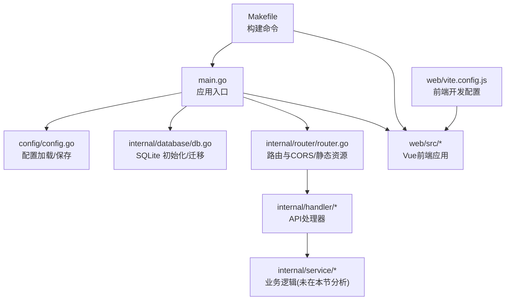
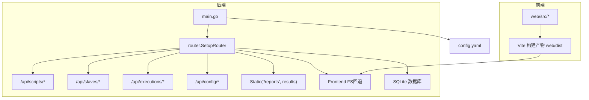
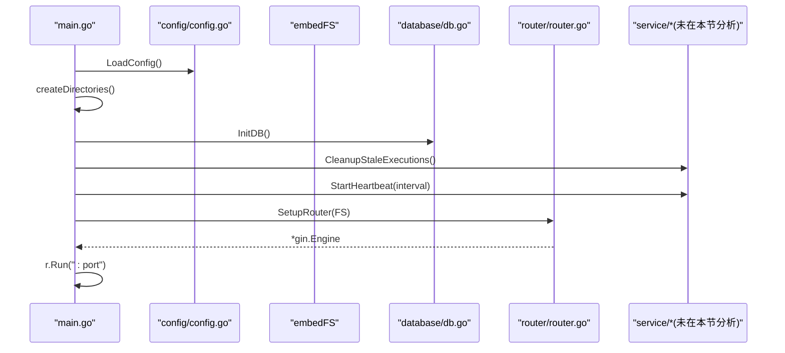
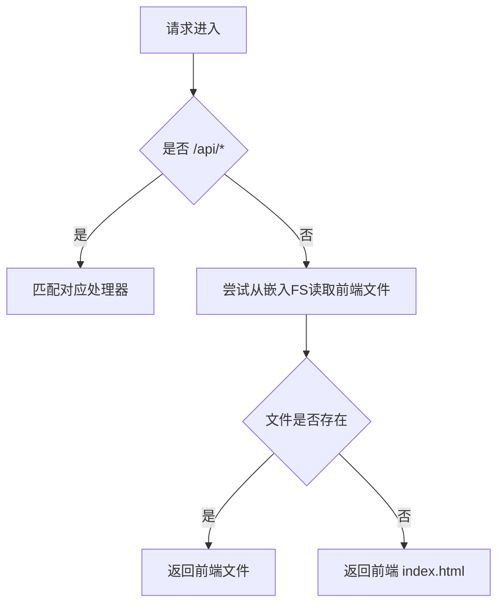
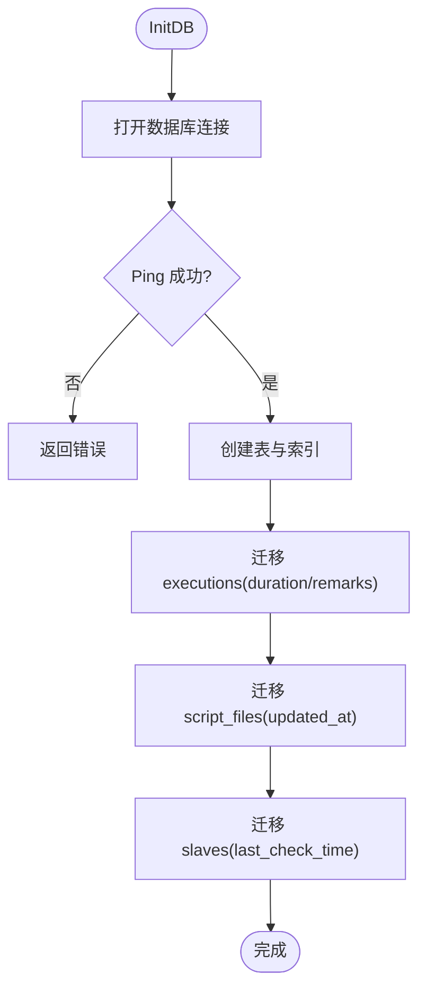
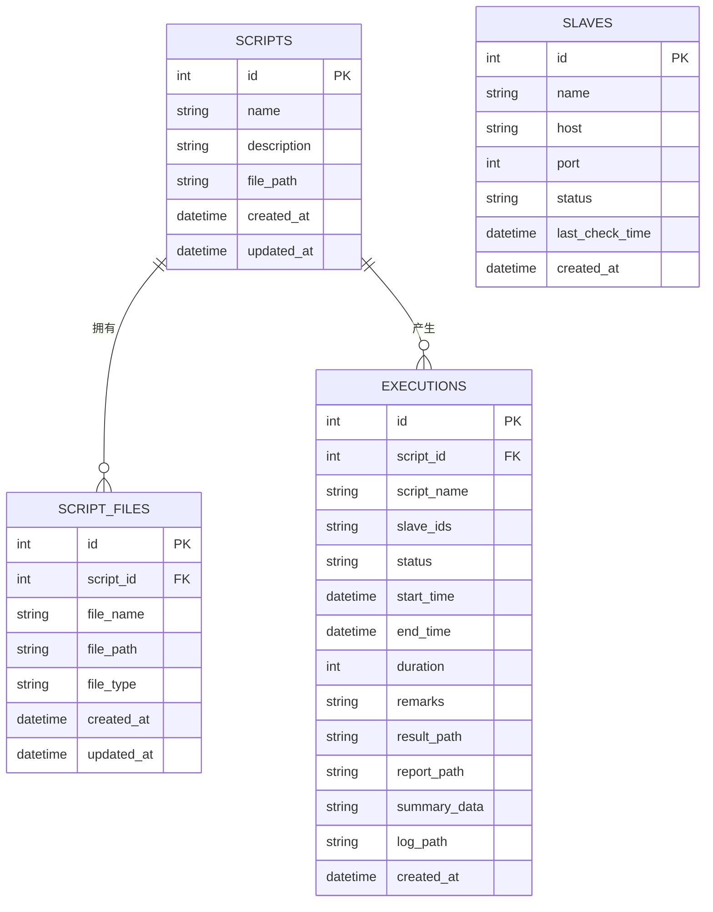
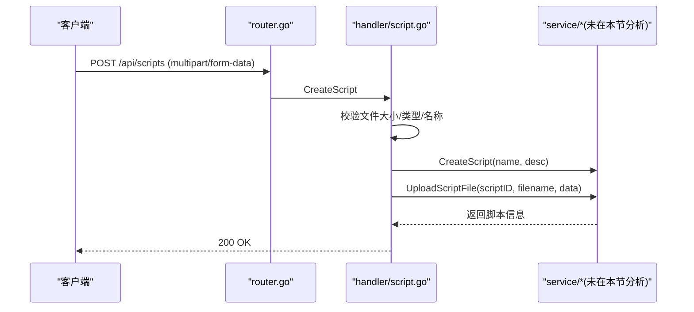
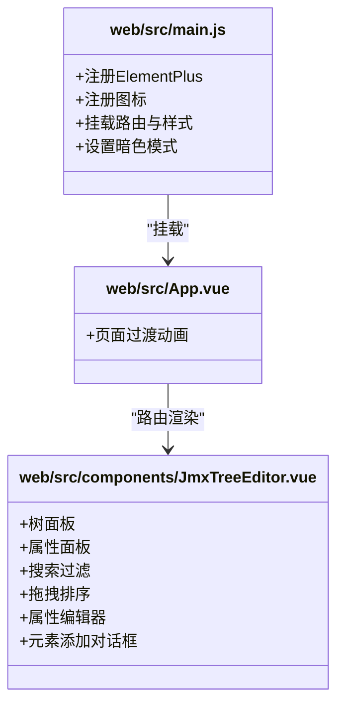
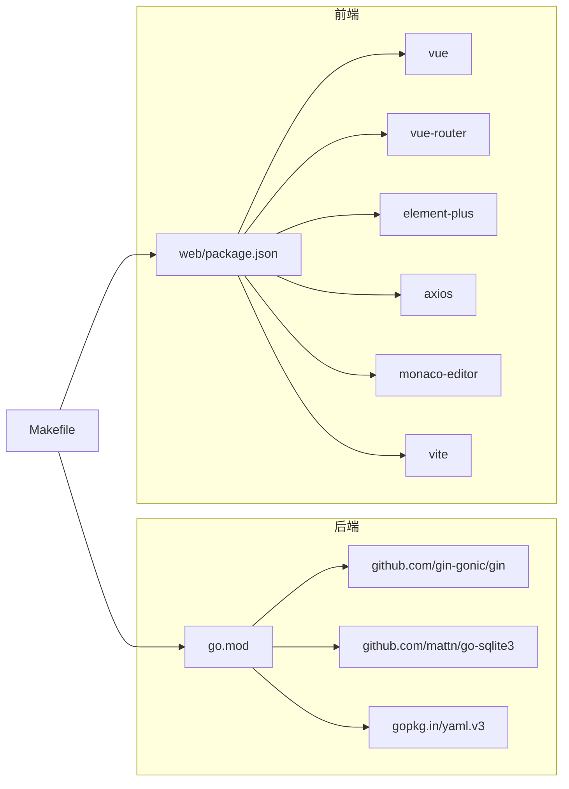

# 开发指南

<cite>
**本文引用的文件**
- [main.go](file://main.go)
- [go.mod](file://go.mod)
- [README.md](file://README.md)
- [config/config.go](file://config/config.go)
- [internal/router/router.go](file://internal/router/router.go)
- [internal/database/db.go](file://internal/database/db.go)
- [internal/model/script.go](file://internal/model/script.go)
- [internal/model/slave.go](file://internal/model/slave.go)
- [internal/model/execution.go](file://internal/model/execution.go)
- [internal/handler/script.go](file://internal/handler/script.go)
- [web/src/main.js](file://web/src/main.js)
- [web/src/App.vue](file://web/src/App.vue)
- [web/src/components/JmxTreeEditor.vue](file://web/src/components/JmxTreeEditor.vue)
- [web/package.json](file://web/package.json)
- [Makefile](file://Makefile)
- [web/vite.config.js](file://web/vite.config.js)
</cite>

## 更新摘要
**所做更改**
- 更新了文档管理策略：开发指南现在通过README.md的开发相关章节提供
- 更新了项目结构说明，反映最新的目录组织
- 更新了开发流程和构建命令
- 更新了前端开发配置和代理设置
- 更新了API文档和数据库表结构说明

## 目录
1. [简介](#简介)
2. [项目结构](#项目结构)
3. [核心组件](#核心组件)
4. [架构总览](#架构总览)
5. [详细组件分析](#详细组件分析)
6. [依赖分析](#依赖分析)
7. [性能考虑](#性能考虑)
8. [调试与测试策略](#调试与测试策略)
9. [开发规范与最佳实践](#开发规范与最佳实践)
10. [功能扩展与定制化](#功能扩展与定制化)
11. [版本控制与发布流程](#版本控制与发布流程)
12. [常见问题排查](#常见问题排查)
13. [结论](#结论)

## 简介
本指南面向JMeter Admin项目的开发者，提供从环境搭建、代码规范、模块划分、调试测试到性能优化与发布流程的全流程指导。项目采用"Go (Gin) + Vue 3 (Element Plus) + SQLite"技术栈，前端资源内嵌至后端二进制，实现单文件部署。

**重要更新**：开发指南现在通过README.md的开发相关章节提供，包括详细的项目结构说明、开发流程和API文档。

## 项目结构
- 后端入口与生命周期：main.go负责初始化配置、目录、数据库、清理陈旧执行记录、启动心跳检测与路由，并以 Gin 提供 HTTP 服务。
- 配置管理：config/config.go 提供默认配置、加载/保存配置能力。
- 路由与中间件：internal/router/router.go 定义 API 分组与静态资源服务，内置 CORS 中间件与前端资源回退。
- 数据层：internal/database/db.go 负责 SQLite 初始化、表结构创建与迁移、索引创建与关闭。
- 数据模型：internal/model/* 定义脚本、Slave、执行记录等数据结构。
- 处理器：internal/handler/* 实现 API 业务处理，包含脚本管理、文件上传下载、执行与错误分析等。
- 前端：web/src 下包含 Vue 3 应用、组件、路由、样式与工具；通过 Vite 构建，最终产物内嵌于后端二进制。
- 构建与开发：Makefile 提供统一构建命令，支持前端构建、后端编译、交叉编译与开发模式。

**图表来源**
- [main.go:28-66](file://main.go#L28-L66)
- [config/config.go:43-84](file://config/config.go#L43-L84)
- [internal/router/router.go:14-112](file://internal/router/router.go#L14-L112)
- [internal/database/db.go:15-34](file://internal/database/db.go#L15-L34)
- [Makefile:1-39](file://Makefile#L1-L39)
- [web/vite.config.js:1-34](file://web/vite.config.js#L1-L34)

**章节来源**
- [README.md:92-120](file://README.md#L92-L120)
- [main.go:28-66](file://main.go#L28-L66)
- [Makefile:1-39](file://Makefile#L1-L39)
- [web/vite.config.js:1-34](file://web/vite.config.js#L1-L34)

## 核心组件
- 配置模块：负责默认值设定、配置文件读取/写入、保存配置。
- 路由模块：定义 /api 路由组，挂载脚本、Slave、执行、系统配置等接口；提供静态资源服务与前端回退。
- 数据库模块：SQLite 初始化、表结构与索引创建、迁移兼容、关闭连接。
- 处理器模块：实现脚本 CRUD、JMX 内容读写、文件上传/删除、执行查询/停止/日志/SSE、错误分析与报告下载等。
- 前端模块：Vue 3 应用、Element Plus UI、路由、样式与工具；JmxTreeEditor 提供 JMX 树形编辑与属性面板。

**章节来源**
- [config/config.go:10-41](file://config/config.go#L10-L41)
- [internal/router/router.go:14-75](file://internal/router/router.go#L14-L75)
- [internal/database/db.go:15-124](file://internal/database/db.go#L15-L124)
- [internal/handler/script.go:37-108](file://internal/handler/script.go#L37-L108)
- [web/src/main.js:1-23](file://web/src/main.js#L1-L23)

## 架构总览
后端以 Gin 为核心，统一处理 API 请求；前端资源通过 embedFS 内嵌至二进制，静态文件服务与前端回退保证 SPA 正常运行；SQLite 作为本地存储，配合迁移与索引提升查询效率；配置模块集中管理运行参数。

**图表来源**
- [main.go:58-65](file://main.go#L58-L65)
- [internal/router/router.go:77-109](file://internal/router/router.go#L77-L109)
- [config/config.go:43-84](file://config/config.go#L43-L84)

## 详细组件分析

### 后端入口与生命周期
- 初始化时区为 Asia/Shanghai，确保日志与时间字段一致。
- 加载配置、创建必要目录、初始化数据库并清理陈旧执行记录。
- 启动 Slave 心跳检测定时任务。
- 设置路由并启动 HTTP 服务。

**图表来源**
- [main.go:19-65](file://main.go#L19-L65)
- [config/config.go:43-84](file://config/config.go#L43-L84)
- [internal/database/db.go:15-34](file://internal/database/db.go#L15-L34)
- [internal/router/router.go:14-112](file://internal/router/router.go#L14-L112)

**章节来源**
- [main.go:19-65](file://main.go#L19-L65)

### 路由与中间件
- CORS 中间件允许跨域请求，支持常见方法与头。
- /api 路由组下细分脚本、Slave、执行、系统配置接口。
- 静态文件服务 /reports 指向结果目录；前端资源通过嵌入 FS 提供；其他路由回退到前端 index.html 支持 Vue Router history 模式。

**图表来源**
- [internal/router/router.go:17-18](file://internal/router/router.go#L17-L18)
- [internal/router/router.go:77-109](file://internal/router/router.go#L77-L109)

**章节来源**
- [internal/router/router.go:14-129](file://internal/router/router.go#L14-L129)

### 数据库与迁移
- 初始化 SQLite 并创建 scripts、script_files、slaves、executions 表。
- 执行迁移：为 executions 表新增 duration、remarks 列；为 script_files 新增 updated_at；为 slaves 新增 last_check_time。
- 创建索引：executions(script_id)、executions(status)、executions(created_at DESC)、script_files(script_id)。

**图表来源**
- [internal/database/db.go:15-124](file://internal/database/db.go#L15-L124)
- [internal/database/db.go:126-171](file://internal/database/db.go#L126-L171)
- [internal/database/db.go:173-189](file://internal/database/db.go#L173-L189)

**章节来源**
- [internal/database/db.go:15-197](file://internal/database/db.go#L15-L197)

### 数据模型
- Script：脚本基本信息与文件数量统计。
- ScriptFile：脚本附件信息（文件名、路径、类型）。
- Slave：Slave 节点信息与状态。
- Execution：执行记录（含状态、时间、结果路径、摘要数据等）。

**图表来源**
- [internal/model/script.go:3-22](file://internal/model/script.go#L3-L22)
- [internal/model/slave.go:3-11](file://internal/model/slave.go#L3-L11)
- [internal/model/execution.go:3-18](file://internal/model/execution.go#L3-L18)
- [internal/database/db.go:37-98](file://internal/database/db.go#L37-L98)

**章节来源**
- [internal/model/script.go:1-23](file://internal/model/script.go#L1-L23)
- [internal/model/slave.go:1-12](file://internal/model/slave.go#L1-L12)
- [internal/model/execution.go:1-19](file://internal/model/execution.go#L1-L19)
- [internal/database/db.go:37-124](file://internal/database/db.go#L37-L124)

### 脚本管理处理器（示例）
- 列表/创建/详情/更新/删除：支持分页、关键词筛选。
- JMX 内容读取与保存：校验请求体绑定与内容有效性。
- 文件上传/删除：限制单文件与总大小、防路径穿越、支持按ID或文件名删除。

**图表来源**
- [internal/router/router.go:24-36](file://internal/router/router.go#L24-L36)
- [internal/handler/script.go:52-108](file://internal/handler/script.go#L52-L108)

**章节来源**
- [internal/handler/script.go:37-327](file://internal/handler/script.go#L37-L327)

### 前端应用与组件
- 应用入口：注册 Element Plus、图标、路由与全局样式，启用暗色模式。
- 根组件：提供页面切换过渡效果。
- JmxTreeEditor：提供 JMX 树形结构浏览、搜索、拖拽排序、上下移动、复制/删除、启用/禁用、属性编辑（含多种控件类型）、原始 XML 显示与元素添加对话框。

**图表来源**
- [web/src/main.js:1-23](file://web/src/main.js#L1-L23)
- [web/src/App.vue:1-28](file://web/src/App.vue#L1-L28)
- [web/src/components/JmxTreeEditor.vue:1-540](file://web/src/components/JmxTreeEditor.vue#L1-L540)

**章节来源**
- [web/src/main.js:1-23](file://web/src/main.js#L1-L23)
- [web/src/App.vue:1-28](file://web/src/App.vue#L1-L28)
- [web/src/components/JmxTreeEditor.vue:1-800](file://web/src/components/JmxTreeEditor.vue#L1-L800)

## 依赖分析
- 后端依赖：Gin 用于 Web 框架，go-sqlite3 用于 SQLite，yaml.v3 用于配置解析。
- 前端依赖：Vue 3、Vue Router、Element Plus、Axios、Monaco Editor、Vite、Sass 等。
- 构建链路：Makefile 统一编排前端构建与后端编译，支持交叉编译 Linux 版本。

**图表来源**
- [go.mod:5-9](file://go.mod#L5-L9)
- [web/package.json:10-22](file://web/package.json#L10-L22)
- [Makefile:1-39](file://Makefile#L1-L39)

**章节来源**
- [go.mod:1-42](file://go.mod#L1-L42)
- [web/package.json:1-24](file://web/package.json#L1-L24)
- [Makefile:1-39](file://Makefile#L1-L39)

## 性能考虑
- 数据库层面：为 executions 与 script_files 建立索引，有助于分页与筛选场景下的查询性能。
- 文件上传：限制单文件与总大小，避免过大请求导致内存压力与超时。
- 前端渲染：JmxTreeEditor 对树节点进行搜索过滤与懒渲染，建议在大规模 JMX 场景下优化虚拟滚动与批量更新。
- 时区与日志：统一 Asia/Shanghai 时区，减少跨时区带来的计算与展示误差。

**章节来源**
- [internal/database/db.go:173-189](file://internal/database/db.go#L173-L189)
- [internal/handler/script.go:16-20](file://internal/handler/script.go#L16-L20)
- [main.go:20-26](file://main.go#L20-L26)

## 调试与测试策略
- 单元测试：建议针对 service 层与工具函数编写单元测试，覆盖边界条件与错误分支。
- 集成测试：基于 Gin 的测试框架发起 /api 请求，验证路由、中间件、处理器与数据库交互。
- 端到端测试：结合浏览器自动化工具（如 Playwright/Cypress）验证前端交互与路由回退行为。
- 日志与监控：利用 Gin 默认日志与业务日志输出关键路径；对长时间运行的任务（如执行管理）增加进度与错误上报。
- 调试技巧：后端使用 go run . 开发模式；前端使用 npm run dev 并通过代理访问后端；必要时开启数据库与网络抓包定位问题。

**章节来源**
- [README.md:45-72](file://README.md#L45-L72)
- [Makefile:28-39](file://Makefile#L28-L39)

## 开发规范与最佳实践

### Go 语言编码规范
- 包与导入：按 internal/* 划分领域模块，保持清晰的层次与职责分离。
- 错误处理：统一返回 model.Error 包裹错误信息；对不可恢复错误使用 log.Fatalf，可恢复错误返回 5xx/4xx。
- 配置管理：通过 config.LoadConfig 提供默认值与文件持久化，避免魔法数字。
- 数据库：使用 sqlite3 驱动，迁移时采用列存在性检查与条件添加，保证向后兼容。
- 路由与中间件：CORS 中间件统一处理跨域；静态资源与前端回退逻辑清晰。
- 文件安全：上传文件前进行大小限制与路径穿越清理，确保文件名安全。

**章节来源**
- [config/config.go:43-113](file://config/config.go#L43-L113)
- [internal/database/db.go:126-171](file://internal/database/db.go#L126-L171)
- [internal/router/router.go:114-129](file://internal/router/router.go#L114-L129)
- [internal/handler/script.go:22-35](file://internal/handler/script.go#L22-L35)

### Vue.js 组件开发规范
- 组件职责单一：如 JmxTreeEditor 聚焦 JMX 编辑，避免过度耦合。
- 响应式与状态管理：使用 Composition API，合理拆分响应式状态与计算属性。
- 表单与校验：Element Plus 表单项与受控组件配合，确保属性变更及时同步。
- 性能优化：对大型树结构使用虚拟滚动与按需渲染；对频繁变更的属性编辑使用防抖。
- 可访问性：为交互元素提供 aria-label 与键盘导航支持。

**章节来源**
- [web/src/components/JmxTreeEditor.vue:542-800](file://web/src/components/JmxTreeEditor.vue#L542-L800)
- [web/src/main.js:1-23](file://web/src/main.js#L1-L23)

## 功能扩展与定制化
- 新增 API：在 internal/router/router.go 中注册路由组与处理器，在 internal/handler/* 中实现业务逻辑。
- 数据模型扩展：在 internal/model/* 中定义结构体，并在 internal/database/db.go 中完善迁移与索引。
- 前端页面与组件：在 web/src/views 与 web/src/components 中新增页面与复用组件，更新路由与样式。
- 配置扩展：在 config/config.go 中扩展 Config 结构体字段，并在 config.LoadConfig 中提供默认值与保存逻辑。

**章节来源**
- [internal/router/router.go:14-75](file://internal/router/router.go#L14-L75)
- [internal/model/script.go:3-22](file://internal/model/script.go#L3-L22)
- [internal/database/db.go:126-171](file://internal/database/db.go#L126-L171)
- [config/config.go:43-113](file://config/config.go#L43-L113)

## 版本控制与发布流程
- 本地开发：使用 make dev 同时启动后端与前端；也可分别使用 make dev-backend 与 make dev-frontend。
- 构建与打包：make build-all 先构建前端再编译后端；make build-backend 仅编译后端；make build-linux 交叉编译 Linux 版本。
- 运行：./jmeter-admin 启动服务；通过 config.yaml 配置端口、JMeter 路径与目录。
- 发布：将生成的 jmeter-admin 与 config.yaml 一起交付，确保 data、uploads、results 目录权限与磁盘空间充足。

**章节来源**
- [README.md:45-72](file://README.md#L45-L72)
- [Makefile:1-39](file://Makefile#L1-L39)
- [main.go:61-65](file://main.go#L61-L65)

## 常见问题排查
- CGO 相关编译错误：确保系统安装 gcc；参考 README 的常见问题章节。
- 前端构建缓慢：使用国内镜像源加速 npm 安装。
- Slave 连接失败：核对 master_hostname 配置、防火墙放通端口、确认 jmeter-server 禁用 RMI SSL。
- JMeter OOM：系统自动按可用内存分配 JVM 堆，无需手动配置。
- SQLite 迁移报错：删除数据库文件后重启服务以重建表结构。

**章节来源**
- [README.md:270-312](file://README.md#L270-L312)

## 结论
本指南提供了从环境搭建、代码结构、组件实现到调试测试、性能优化与发布流程的完整开发指引。建议在新增功能时遵循"路由—处理器—服务—模型—数据库"的分层设计，前端组件保持单一职责与可复用性，后端严格控制错误与安全边界，持续完善测试与文档，确保系统稳定与可维护性。

**重要更新**：开发指南现在通过README.md的开发相关章节提供，包括详细的项目结构说明、开发流程和API文档。开发者应优先参考README.md中的开发指南部分获取最新信息。