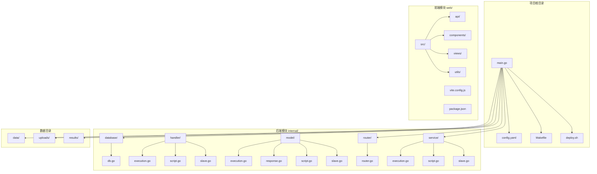
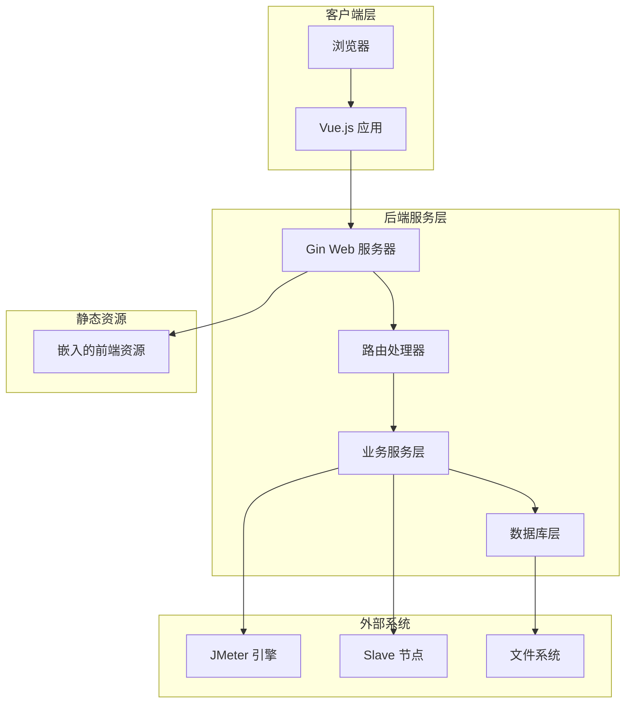
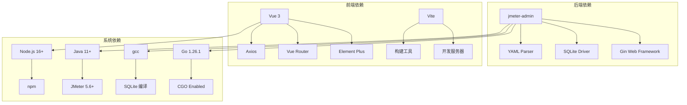

# 快速开始

<cite>
**本文引用的文件**   
- [README.md](file://README.md)
- [go.mod](file://go.mod)
- [main.go](file://main.go)
- [config.yaml](file://config.yaml)
- [Makefile](file://Makefile)
- [deploy.sh](file://deploy.sh)
- [web/package.json](file://web/package.json)
- [web/vite.config.js](file://web/vite.config.js)
- [internal/router/router.go](file://internal/router/router.go)
- [uploads/11/demo.jmx](file://uploads/11/demo.jmx)
- [results/10/runtime.jmx](file://results/10/runtime.jmx)
</cite>

## 目录
1. [简介](#简介)
2. [项目结构](#项目结构)
3. [核心组件](#核心组件)
4. [架构概览](#架构概览)
5. [详细组件分析](#详细组件分析)
6. [依赖分析](#依赖分析)
7. [性能考虑](#性能考虑)
8. [故障排除指南](#故障排除指南)
9. [结论](#结论)
10. [附录](#附录)

## 简介
JMeter Admin 是一个轻量级的 JMeter 分布式压测管理平台，采用 Go (Gin) + Vue 3 (Element Plus) + SQLite 技术栈开发。前端资源被嵌入到后端二进制文件中，编译后生成单个可执行文件，实现零依赖部署。项目提供 JMX 脚本管理、Slave 节点管理、分布式压测执行、执行记录管理、Master IP 自动检测等核心功能。

## 项目结构
项目采用前后端分离的模块化组织方式，主要目录结构如下：
- main.go：后端入口程序，负责初始化配置、数据库、路由和服务器启动
- config.yaml：应用配置文件，包含服务器端口、JMeter路径、目录配置等
- Makefile：构建和开发相关的命令定义
- deploy.sh：一键部署脚本，包含依赖安装、编译、服务管理等功能
- web/：前端项目，基于 Vue 3 + Vite 构建
- internal/：后端核心模块，包含数据库、处理器、模型、路由、服务等
- data/：SQLite 数据库存放目录
- uploads/：JMX 脚本和附件上传目录
- results/：压测执行结果和报告目录



**图表来源**
- [main.go:1-83](file://main.go#L1-L83)
- [internal/router/router.go:1-129](file://internal/router/router.go#L1-L129)

**章节来源**
- [README.md:92-120](file://README.md#L92-L120)

## 核心组件
项目的核心组件包括：

### 后端服务组件
- Gin Web 框架：提供 RESTful API 接口和路由管理
- SQLite 数据库：轻量级本地数据库，存储脚本、节点、执行记录等数据
- 静态资源嵌入：使用 go:embed 将前端构建产物嵌入二进制文件
- 分布式执行：集成 JMeter，支持单机和分布式压测模式

### 前端组件
- Vue 3 + Element Plus：现代化的前端框架和UI组件库
- Vite 构建工具：快速的开发服务器和生产构建
- 单页应用：支持 Vue Router 的历史模式路由

### 配置管理
- YAML 配置文件：集中管理服务器、JMeter、目录等配置
- 环境变量支持：开发模式下的端口配置
- 动态配置：部分配置可在运行时通过API修改

**章节来源**
- [main.go:16-66](file://main.go#L16-L66)
- [web/package.json:1-24](file://web/package.json#L1-24)

## 架构概览
JMeter Admin 采用前后端分离的架构设计，后端提供RESTful API，前端通过AJAX调用接口进行数据交互。



**图表来源**
- [internal/router/router.go:14-112](file://internal/router/router.go#L14-L112)
- [main.go:28-66](file://main.go#L28-L66)

## 详细组件分析

### 安装要求与版本规范
根据项目文档，系统对各组件有明确的版本要求：

#### 后端编译要求
- Go: >= 1.21（项目 go.mod 指定 go 1.26.1）
- gcc: 任意版本（SQLite 编译依赖，启用 CGO）

#### 前端构建要求
- Node.js: >= 16.x（项目 package.json 使用 ^16.20.2）
- npm: 随 Node.js 一起安装

#### 运行时环境要求
- Java: >= 11（JMeter 运行时）
- JMeter: >= 5.6（压测引擎）

#### 依赖安装脚本
项目提供了完整的依赖安装脚本，支持一键安装所有必需组件：
- Go: 1.22.2 版本
- Node.js: 20.12.2（高版本 glibc）或 16.20.2（兼容模式）
- gcc: 系统原生包管理器安装
- Java: 11 OpenJDK
- JMeter: 5.6.3 版本

**章节来源**
- [README.md:17-26](file://README.md#L17-L26)
- [deploy.sh:224-419](file://deploy.sh#L224-L419)
- [go.mod:3](file://go.mod#L3)
- [web/package.json:10-16](file://web/package.json#L10-L16)

### 一键部署流程
项目提供了一键部署脚本，简化了安装和启动过程：

#### 步骤1：安装依赖
```bash
./deploy.sh install-deps
source ~/.bashrc
```

#### 步骤2：编译项目
```bash
./deploy.sh install
```

#### 步骤3：启动服务
```bash
./deploy.sh start
```

#### 服务管理命令
```bash
./deploy.sh start     # 启动
./deploy.sh stop      # 停止
./deploy.sh restart   # 重启
./deploy.sh status    # 状态
```

**章节来源**
- [README.md:29-43](file://README.md#L29-L43)
- [deploy.sh:48-92](file://deploy.sh#L48-L92)
- [deploy.sh:500-526](file://deploy.sh#L500-L526)

### 本地开发环境搭建
项目支持多种开发模式，满足不同场景的需求：

#### 同时启动前后端
```bash
make dev
```

#### 分别启动
```bash
make dev-backend    # 后端 :8080
make dev-frontend   # 前端 :3000（代理 API 到 :8080）
```

#### 开发环境配置
- 后端端口：8080（可通过 BACKEND_PORT 环境变量自定义）
- 前端端口：3000（可通过 FRONTEND_PORT 环境变量自定义）
- API 代理：前端开发服务器自动代理 /api 前缀到后端
- 热更新：Vite 提供快速的模块热替换

**章节来源**
- [README.md:45-56](file://README.md#L45-L56)
- [Makefile:28-38](file://Makefile#L28-L38)
- [web/vite.config.js:6-29](file://web/vite.config.js#L6-L29)

### 编译部署选项
项目提供了多种编译选项，适应不同的部署需求：

#### 完整编译
```bash
make build-all
```
- 先构建前端（web/dist）
- 再编译后端（嵌入前端资源）
- 生成单文件可执行文件

#### 仅编译后端
```bash
make build-backend
```
- 需要先构建前端（web/dist 已存在）
- 编译后端并嵌入现有前端资源

#### 交叉编译 Linux 版本
```bash
make build-linux
```
- 设置 GOOS=linux, GOARCH=amd64
- 生成 Linux 平台可执行文件

#### 运行
```bash
./jmeter-admin
```

**章节来源**
- [README.md:58-72](file://README.md#L58-L72)
- [Makefile:4-17](file://Makefile#L4-L17)

### API 路由设计
项目采用分组路由的设计，清晰地组织了各个功能模块：

#### 脚本管理路由
- GET /api/scripts - 脚本列表
- POST /api/scripts - 创建脚本
- GET /api/scripts/:id - 脚本详情
- PUT /api/scripts/:id - 更新脚本
- DELETE /api/scripts/:id - 删除脚本
- GET /api/scripts/:id/download - 下载主脚本
- GET /api/scripts/:id/content - 获取 JMX 内容
- PUT /api/scripts/:id/content - 保存 JMX 内容
- POST /api/scripts/:id/files - 上传附件
- DELETE /api/scripts/:id/files/:fileId - 删除附件

#### Slave 节点管理路由
- GET /api/slaves - Slave 列表
- POST /api/slaves - 添加 Slave
- PUT /api/slaves/:id - 更新 Slave
- DELETE /api/slaves/:id - 删除 Slave
- POST /api/slaves/:id/check - 连通性检测
- GET /api/slaves/heartbeat-status - 心跳状态

#### 执行管理路由
- GET /api/executions - 执行列表（支持筛选）
- GET /api/executions/stats - 统计汇总
- POST /api/executions - 创建执行
- GET /api/executions/:id - 执行详情
- DELETE /api/executions/:id - 删除执行
- POST /api/executions/:id/stop - 停止执行
- GET /api/executions/:id/log - 实时日志（SSE）
- GET /api/executions/:id/errors - 错误分析
- GET /api/executions/:id/download/jtl - 下载 JTL
- GET /api/executions/:id/download/report - 下载报告
- GET /api/executions/:id/download/errors - 导出错误 CSV
- GET /api/executions/:id/download/all - 下载全部结果

#### 系统配置路由
- GET /api/config/network-interfaces - 网卡列表
- GET /api/config/master-hostname - Master IP
- PUT /api/config/master-hostname - 更新 Master IP

**章节来源**
- [internal/router/router.go:20-75](file://internal/router/router.go#L20-L75)
- [README.md:122-174](file://README.md#L122-L174)

### 分布式压测配置
项目支持灵活的分布式压测配置：

#### Master 节点配置
1. 在 `config.yaml` 中配置 `master_hostname`
2. 或在页面「系统设置」中选择网卡 IP
3. 多网卡环境必须显式指定，否则 Slave 无法回传数据

#### Slave 节点配置
1. 在页面「节点管理」中添加 Slave，填写 `host:port`
2. Slave 端启动 jmeter-server：
   ```bash
   jmeter-server -Dserver.rmi.ssl.disable=true
   ```

#### 多网卡环境注意事项
- Master 有多个网卡时，RMI 回调 IP 可能错误
- 必须在配置中指定 `master_hostname` 为 Slave 可访问的 IP
- 系统会自动将 `-Djava.rmi.server.hostname` 传递给 JMeter

**章节来源**
- [README.md:231-251](file://README.md#L231-L251)

## 依赖分析
项目的主要依赖关系如下：



**图表来源**
- [go.mod:5-9](file://go.mod#L5-L9)
- [web/package.json:10-22](file://web/package.json#L10-L22)

**章节来源**
- [go.mod:1-42](file://go.mod#L1-L42)
- [web/package.json:1-24](file://web/package.json#L1-L24)

## 性能考虑
项目在性能方面采用了多项优化措施：

### 内存管理
- 系统自动根据可用内存分配 JVM 堆（80% 可用内存），无需手动配置
- SQLite 使用连接池优化数据库操作

### 网络优化
- Gin 框架提供高性能的 HTTP 处理能力
- 前端静态资源通过 CDN 加速（国内镜像源）
- API 响应使用 JSON 格式，减少传输开销

### 存储优化
- SQLite 轻量级数据库，适合中小规模数据
- 压测结果文件采用压缩存储
- 自动清理陈旧的执行记录

## 故障排除指南

### 编译相关问题
**问题：CGO_ENABLED 相关错误**
- 确保系统已安装 gcc
- Ubuntu/Debian: `sudo apt-get install -y gcc build-essential`
- CentOS/RHEL: `sudo yum install -y gcc gcc-c++ make`

**问题：前端构建慢**
- 使用 npmmirror 镜像加速：
  ```bash
  npm config set registry https://registry.npmmirror.com
  ```

### 运行时问题
**问题：Slave 连接失败**
- 检查 `master_hostname` 配置是否正确
- 确认防火墙开放端口（默认 50000, 1099）
- Slave 端确保禁用 RMI SSL：`-Dserver.rmi.ssl.disable=true`

**问题：JMeter OOM（内存溢出）**
- 系统自动根据可用内存分配 JVM 堆（80% 可用内存）
- 无需手动配置，如仍出现内存问题，建议降低并发线程数

**问题：SQLite 迁移报错**
- 删除数据库文件重新创建：
  ```bash
  rm -f data/jmeter-admin.db
  ./jmeter-admin
  ```

### 服务管理问题
**问题：服务无法启动**
- 检查端口占用情况：`netstat -tlnp | grep :8080`
- 查看日志文件：`tail -f jmeter-admin.log`
- 确认依赖服务正常运行（Java、JMeter）

**问题：权限问题**
- 确保有足够的文件系统权限
- 数据目录需要读写权限
- 端口 8080 需要管理员权限（如需使用特权端口）

**章节来源**
- [README.md:270-312](file://README.md#L270-L312)
- [deploy.sh:31-45](file://deploy.sh#L31-L45)

## 结论
JMeter Admin 提供了一个完整、易用的分布式压测管理平台。通过一键部署脚本和完善的开发工具链，新用户可以在最短时间内成功运行项目。项目采用现代化的技术栈，具有良好的扩展性和维护性。建议用户在生产环境中：
1. 使用 systemd 服务管理
2. 配置合适的日志轮转
3. 定期备份数据目录
4. 监控系统资源使用情况

## 附录

### 配置文件详解
项目配置文件包含以下主要配置项：

#### 服务器配置
- `server.port`: HTTP 服务监听端口，默认 8080

#### 前端开发配置
- `frontend.port`: 前端 Vite 开发服务器端口，默认 3000

#### JMeter 配置
- `jmeter.path`: JMeter 可执行文件路径
- `jmeter.master_hostname`: Master 节点 IP

#### 目录配置
- `dirs.data`: SQLite 数据库存储目录
- `dirs.uploads`: 脚本和附件上传目录
- `dirs.results`: 执行结果和报告存储目录

### 示例 JMX 文件
项目包含示例 JMX 文件，展示了常见的压测配置：
- HTTP 请求采样器
- 响应断言
- JSR223 监听器
- 结果收集器

这些示例文件可以帮助用户快速理解和使用 JMeter Admin 的功能。

**章节来源**
- [config.yaml:1-26](file://config.yaml#L1-L26)
- [uploads/11/demo.jmx:1-155](file://uploads/11/demo.jmx#L1-L155)
- [results/10/runtime.jmx:1-200](file://results/10/runtime.jmx#L1-L200)