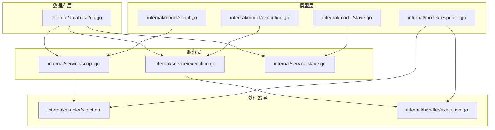
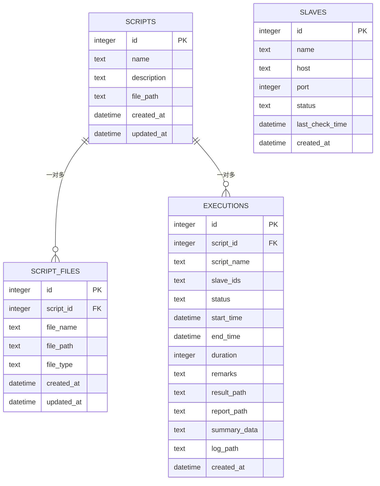
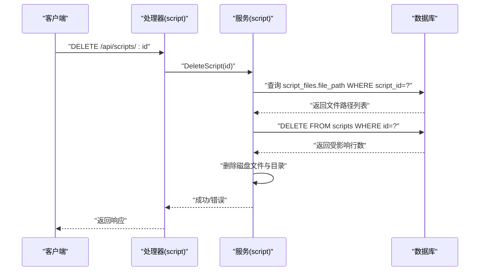
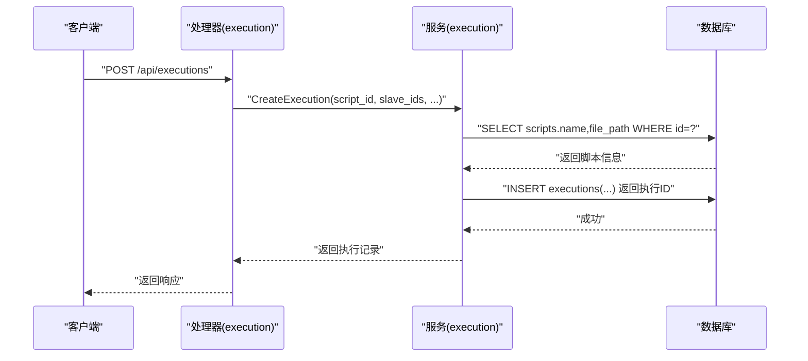
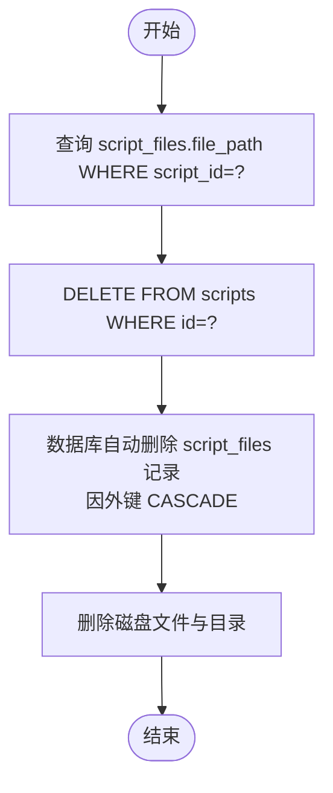
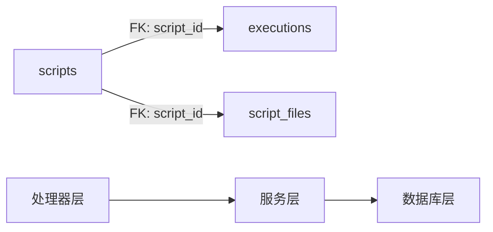

# 关系与约束

<cite>
**本文引用的文件**
- [db.go](file://internal/database/db.go)
- [script.go](file://internal/service/script.go)
- [execution.go](file://internal/service/execution.go)
- [script.go](file://internal/handler/script.go)
- [execution.go](file://internal/handler/execution.go)
- [script.go](file://internal/model/script.go)
- [execution.go](file://internal/model/execution.go)
- [slave.go](file://internal/model/slave.go)
- [slave.go](file://internal/service/slave.go)
- [response.go](file://internal/model/response.go)
</cite>

## 目录
1. [简介](#简介)
2. [项目结构](#项目结构)
3. [核心组件](#核心组件)
4. [架构总览](#架构总览)
5. [详细组件分析](#详细组件分析)
6. [依赖分析](#依赖分析)
7. [性能考虑](#性能考虑)
8. [故障排查指南](#故障排查指南)
9. [结论](#结论)
10. [附录](#附录)

## 简介
本文件聚焦于 JMeter Admin 的数据库关系与约束设计，围绕以下主题展开：
- 表间关系设计：scripts 与 script_files 的一对多关系；executions 通过外键关联 scripts。
- 外键约束与维护机制：明确外键定义、ON DELETE 行为及索引策略。
- 级联删除策略：重点说明 script_files 对 scripts 的 CASCADE 删除。
- 数据完整性约束：唯一性与非空约束的设计原则与实践。
- 索引策略与性能影响：基于查询模式的索引选择与代价权衡。
- ER 图与关系图：可视化展示核心实体与关系。
- 约束违反的处理机制与错误处理策略：结合业务层与处理器层的错误传播。

## 项目结构
数据库初始化与表结构创建集中在数据库层，业务逻辑在服务层，接口在处理器层，模型在模型层。核心表包括 scripts、script_files、executions、slaves。

图表来源
- [db.go:36-124](file://internal/database/db.go#L36-L124)
- [script.go:1-540](file://internal/service/script.go#L1-L540)
- [execution.go:1-800](file://internal/service/execution.go#L1-L800)
- [slave.go:1-220](file://internal/service/slave.go#L1-L220)
- [script.go:1-327](file://internal/handler/script.go#L1-L327)
- [execution.go:1-729](file://internal/handler/execution.go#L1-L729)

章节来源
- [db.go:36-124](file://internal/database/db.go#L36-L124)

## 核心组件
- scripts 表：存储脚本元信息（名称、描述、主 JMX 文件路径等），主键自增。
- script_files 表：存储脚本关联的文件集合，每个文件记录包含文件名、路径、类型等；与 scripts 建立一对多关系，外键引用 scripts.id，并启用 ON DELETE CASCADE。
- executions 表：存储执行记录，包含脚本 ID、脚本名称冗余字段、状态、时间戳、结果路径等；外键引用 scripts.id。
- slaves 表：存储 JMeter 分布式节点信息，包含主机、端口、状态等。

章节来源
- [db.go:38-98](file://internal/database/db.go#L38-L98)
- [script.go:3-22](file://internal/model/script.go#L3-L22)
- [execution.go:3-18](file://internal/model/execution.go#L3-L18)
- [slave.go:3-11](file://internal/model/slave.go#L3-L11)

## 架构总览
下图展示数据库层面的实体关系与外键约束：

图表来源
- [db.go:38-98](file://internal/database/db.go#L38-L98)

## 详细组件分析

### 表结构与约束定义
- scripts
  - 主键：id（自增）
  - 非空字段：name、file_path
  - 时间戳：created_at、updated_at
- script_files
  - 主键：id（自增）
  - 外键：script_id 引用 scripts.id
  - ON DELETE：CASCADE（删除 scripts 时自动删除其关联文件）
  - 非空字段：script_id、file_name、file_path、file_type
  - 时间戳：created_at、updated_at
- executions
  - 主键：id（自增）
  - 外键：script_id 引用 scripts.id
  - 非空字段：script_id、script_name
  - 默认值：status='running'、duration=0
  - 时间戳：created_at、start_time、end_time
- slaves
  - 主键：id（自增）
  - 非空字段：name、host、port
  - 默认值：status='offline'

章节来源
- [db.go:38-98](file://internal/database/db.go#L38-L98)

### 外键约束与维护机制
- scripts → script_files：一对多，外键 script_id 引用 scripts.id，ON DELETE CASCADE。
- scripts → executions：一对多，外键 script_id 引用 scripts.id，ON DELETE NO ACTION（未显式 CASCADE）。
- 维护机制：
  - 删除 scripts 时，数据库引擎自动删除对应 script_files 记录（CASCADE）。
  - 删除 executions 时不会级联删除 scripts（NO ACTION），需业务层谨慎处理。
  - 业务层在删除脚本时，先查询并删除磁盘文件，再删除数据库记录，确保一致性。

章节来源
- [db.go:52-61](file://internal/database/db.go#L52-L61)
- [db.go:80-98](file://internal/database/db.go#L80-L98)
- [script.go:179-227](file://internal/service/script.go#L179-L227)

### 级联删除策略
- script_files 对 scripts 的 CASCADE 删除：当删除 scripts 记录时，数据库自动删除该脚本下的所有文件记录，避免悬挂引用。
- executions 对 scripts 的 NO ACTION 删除：删除脚本前必须清理或转移执行记录，否则外键约束会阻止删除。
- 业务层补充：删除脚本时，服务层会先查询 script_files 中的 file_path，删除磁盘文件后才删除数据库记录，确保文件系统与数据库一致。

章节来源
- [db.go](file://internal/database/db.go#L60)
- [db.go](file://internal/database/db.go#L97)
- [script.go:179-227](file://internal/service/script.go#L179-L227)

### 数据完整性约束设计原则
- 非空约束：关键业务字段（如 name、file_path、script_id、script_name）设置为 NOT NULL，保证基本数据完整性。
- 默认值：status、duration 等字段设置合理默认值，减少插入时的遗漏。
- 外键约束：通过外键保证引用完整性，避免孤儿记录。
- 唯一性：当前未见显式的 UNIQUE 约束；若未来需要保证脚本名称唯一，可在 scripts.name 上增加唯一约束。

章节来源
- [db.go:38-98](file://internal/database/db.go#L38-L98)

### 唯一性与非空约束应用场景
- 非空约束
  - scripts.name：脚本名称必填，便于展示与检索。
  - scripts.file_path：主 JMX 文件路径必填，确保执行时可定位脚本。
  - executions.script_id、executions.script_name：执行记录必须关联有效脚本。
- 唯一性建议
  - 若需保证脚本名称全局唯一，可在 scripts.name 上增加唯一约束，避免重名冲突。
  - 若需保证脚本文件名在同一脚本内唯一，可在 script_files 上增加 (script_id, file_name) 的唯一约束。

章节来源
- [db.go:38-98](file://internal/database/db.go#L38-L98)

### 索引策略与性能影响
- 已创建索引
  - executions.script_id：加速按脚本过滤执行记录。
  - executions.status：加速按状态统计与筛选。
  - executions.created_at（降序）：加速按时间倒序分页查询。
  - script_files.script_id：加速按脚本查询文件列表。
- 性能影响
  - 以上索引覆盖了常见查询模式（按脚本、按状态、按时间排序、按脚本列出文件），有助于提升查询性能。
  - 插入/更新成本：索引会带来 DML 成本，但查询收益显著，整体收益为正。

章节来源
- [db.go:174-189](file://internal/database/db.go#L174-L189)

### 关系图与调用流程（删除脚本）

图表来源
- [script.go:180-194](file://internal/handler/script.go#L180-L194)
- [script.go:179-227](file://internal/service/script.go#L179-L227)
- [db.go:52-61](file://internal/database/db.go#L52-L61)

### API 与服务交互（创建执行）

图表来源
- [execution.go:38-53](file://internal/handler/execution.go#L38-L53)
- [execution.go:103-180](file://internal/service/execution.go#L103-L180)
- [db.go:80-98](file://internal/database/db.go#L80-L98)

### 级联删除流程（删除脚本）

图表来源
- [db.go:52-61](file://internal/database/db.go#L52-L61)
- [script.go:179-227](file://internal/service/script.go#L179-L227)

## 依赖分析
- 数据库层负责表结构与约束定义，服务层负责业务逻辑与数据一致性，处理器层负责接口与错误封装。
- 外键关系决定删除行为：scripts → script_files（CASCADE）、scripts → executions（NO ACTION）。
- 索引服务于高频查询：按脚本过滤、按状态筛选、按时间排序、按脚本列出文件。

图表来源
- [db.go:38-98](file://internal/database/db.go#L38-L98)
- [script.go:1-327](file://internal/handler/script.go#L1-L327)
- [execution.go:1-729](file://internal/handler/execution.go#L1-L729)

章节来源
- [db.go:38-98](file://internal/database/db.go#L38-L98)

## 性能考虑
- 索引覆盖常用查询：按脚本、按状态、按时间排序、按脚本列出文件。
- 插入/更新成本：适度的索引数量与结构平衡查询与写入性能。
- 建议：根据实际查询模式持续评估索引命中率与执行计划，必要时新增复合索引或调整现有索引。

[本节为通用指导，无需具体文件来源]

## 故障排查指南
- 删除脚本失败（外键约束）
  - 现象：删除 scripts 报错，提示违反外键约束。
  - 原因：executions 中仍有关联记录。
  - 处理：先清理或转移 executions 记录，再删除脚本。
  - 参考
    - [db.go](file://internal/database/db.go#L97)
    - [script.go:179-227](file://internal/service/script.go#L179-L227)
- 删除脚本成功但文件残留
  - 现象：数据库记录已删除，但磁盘仍有文件。
  - 原因：服务层在删除数据库记录后才删除磁盘文件，异常时可能中断。
  - 处理：确认服务层删除流程，检查磁盘文件权限与路径。
  - 参考
    - [script.go:179-227](file://internal/service/script.go#L179-L227)
- 执行记录创建失败
  - 现象：创建执行时报错“脚本不存在”或“查询脚本失败”。
  - 处理：确认 scripts.id 是否存在，检查脚本文件路径是否正确。
  - 参考
    - [execution.go:103-117](file://internal/service/execution.go#L103-L117)
- 错误响应格式
  - 统一使用模型层响应结构，便于前端处理。
  - 参考
    - [response.go:14-46](file://internal/model/response.go#L14-L46)

章节来源
- [db.go](file://internal/database/db.go#L97)
- [script.go:179-227](file://internal/service/script.go#L179-L227)
- [execution.go:103-117](file://internal/service/execution.go#L103-L117)
- [response.go:14-46](file://internal/model/response.go#L14-L46)

## 结论
- 本设计通过外键与索引保障了数据完整性与查询效率。
- script_files 对 scripts 的 CASCADE 删除简化了脚本生命周期管理。
- executions 对 scripts 的 NO ACTION 删除要求业务层在删除脚本前清理执行记录，避免数据悬挂。
- 建议后续根据业务需求引入唯一性约束与更精细的索引优化，持续监控查询性能与 DML 成本。

[本节为总结，无需具体文件来源]

## 附录
- 模型映射
  - scripts → model.Script
  - script_files → model.ScriptFile
  - executions → model.Execution
  - slaves → model.Slave
- 参考
  - [script.go:3-22](file://internal/model/script.go#L3-L22)
  - [execution.go:3-18](file://internal/model/execution.go#L3-L18)
  - [slave.go:3-11](file://internal/model/slave.go#L3-L11)

章节来源
- [script.go:3-22](file://internal/model/script.go#L3-L22)
- [execution.go:3-18](file://internal/model/execution.go#L3-L18)
- [slave.go:3-11](file://internal/model/slave.go#L3-L11)