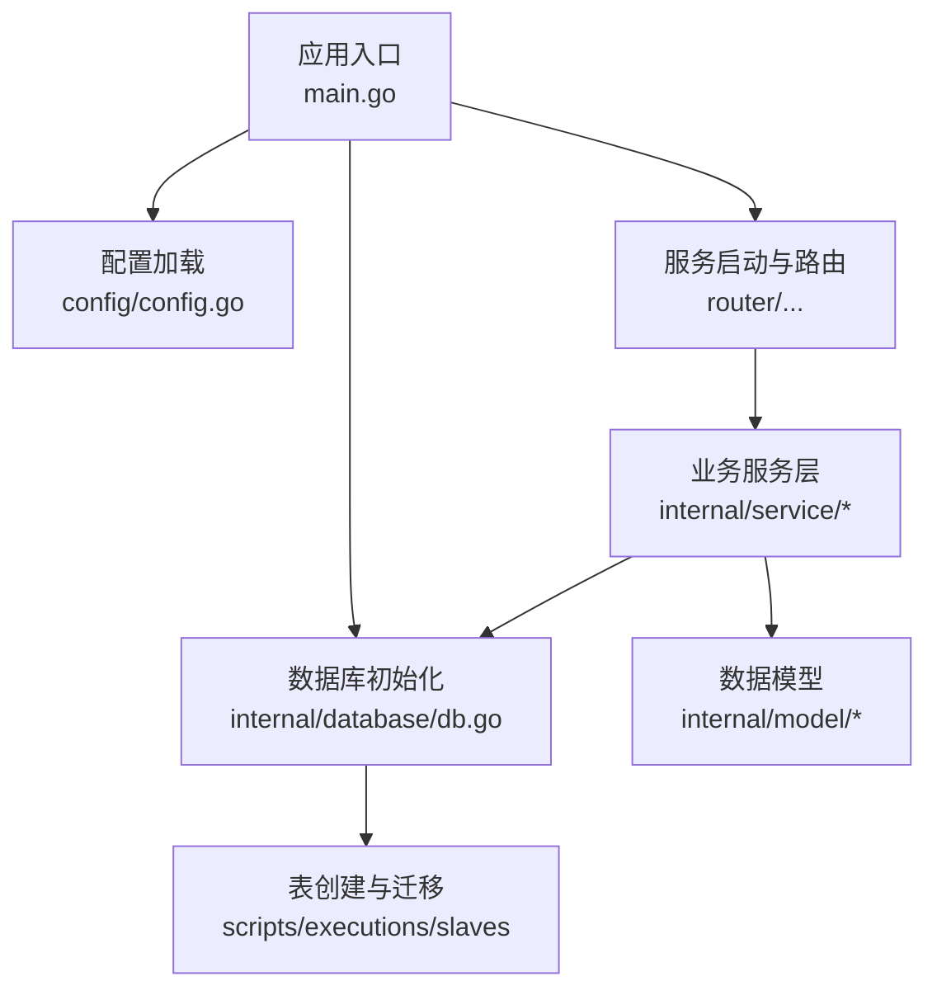
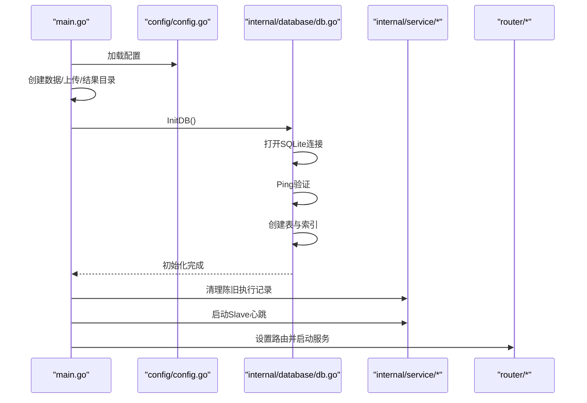
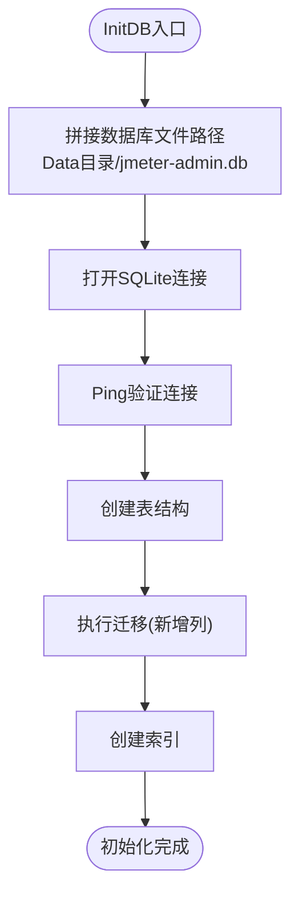
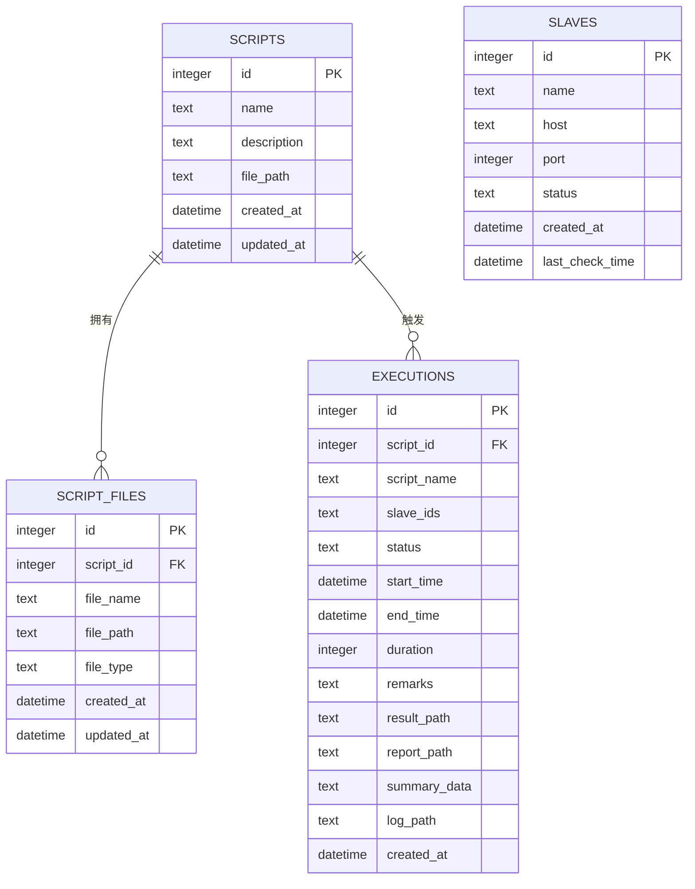
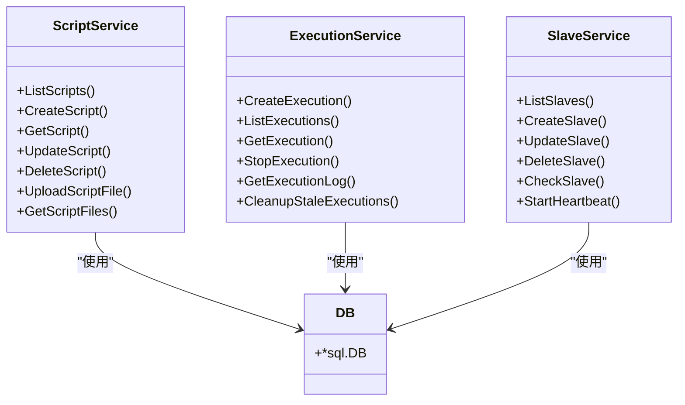
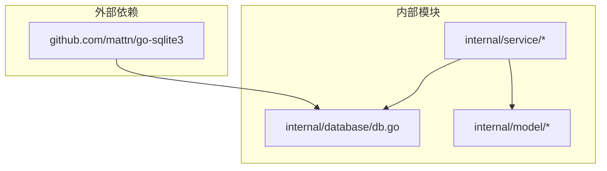
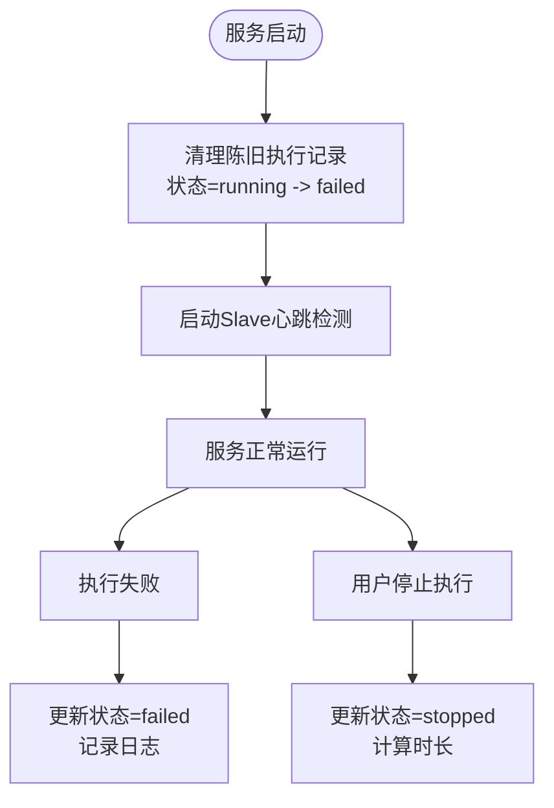

# 数据库架构概览

<cite>
**本文档引用的文件**
- [internal/database/db.go](file://internal/database/db.go)
- [config/config.go](file://config/config.go)
- [main.go](file://main.go)
- [internal/model/script.go](file://internal/model/script.go)
- [internal/model/execution.go](file://internal/model/execution.go)
- [internal/model/slave.go](file://internal/model/slave.go)
- [internal/service/script.go](file://internal/service/script.go)
- [internal/service/execution.go](file://internal/service/execution.go)
- [internal/service/slave.go](file://internal/service/slave.go)
- [go.mod](file://go.mod)
</cite>

## 目录
1. [简介](#简介)
2. [项目结构](#项目结构)
3. [核心组件](#核心组件)
4. [架构概览](#架构概览)
5. [详细组件分析](#详细组件分析)
6. [依赖关系分析](#依赖关系分析)
7. [性能考量](#性能考量)
8. [故障处理与恢复](#故障处理与恢复)
9. [结论](#结论)

## 简介
本文件面向JMeter Admin项目的数据库架构，聚焦于SQLite数据库的整体设计理念、初始化流程、表结构与迁移机制、数据访问层设计、生命周期管理以及性能优化与并发控制策略。文档旨在帮助开发者与运维人员快速理解数据库层的职责边界、数据流与控制流，并提供实用的排障建议与优化方向。

## 项目结构
数据库相关代码主要集中在以下模块：
- 数据库初始化与表结构定义：internal/database/db.go
- 配置加载与目录结构：config/config.go、main.go
- 数据模型：internal/model/*
- 业务服务层：internal/service/*（脚本、执行、Slave等）
- 依赖声明：go.mod

图表来源
- [main.go:28-66](file://main.go#L28-L66)
- [config/config.go:43-84](file://config/config.go#L43-L84)
- [internal/database/db.go:15-34](file://internal/database/db.go#L15-L34)

章节来源
- [main.go:28-66](file://main.go#L28-L66)
- [config/config.go:43-84](file://config/config.go#L43-L84)
- [internal/database/db.go:15-34](file://internal/database/db.go#L15-L34)

## 核心组件
- 数据库初始化与生命周期管理：负责数据库连接建立、表创建、迁移与关闭。
- 配置与目录管理：统一管理数据、上传、结果目录，确保运行时目录存在。
- 数据模型：定义脚本、执行、Slave等实体的结构。
- 业务服务层：封装数据库访问逻辑，提供脚本管理、执行调度、Slave心跳检测等功能。
- 连接与事务：基于database/sql的标准库接口，未引入第三方连接池库。

章节来源
- [internal/database/db.go:15-34](file://internal/database/db.go#L15-L34)
- [config/config.go:35-62](file://config/config.go#L35-L62)
- [internal/model/script.go:3-12](file://internal/model/script.go#L3-L12)
- [internal/model/execution.go:3-18](file://internal/model/execution.go#L3-L18)
- [internal/model/slave.go:3-11](file://internal/model/slave.go#L3-L11)
- [internal/service/script.go:85-116](file://internal/service/script.go#L85-L116)
- [internal/service/execution.go:104-180](file://internal/service/execution.go#L104-L180)
- [internal/service/slave.go:15-41](file://internal/service/slave.go#L15-L41)

## 架构概览
JMeter Admin采用“单实例SQLite”架构，数据库文件位于数据目录下，通过标准SQL接口进行读写。初始化流程如下：
- 应用启动时加载配置，创建必要的数据、上传、结果目录。
- 初始化数据库：打开SQLite连接，Ping验证，创建表结构，执行迁移，创建索引。
- 服务启动后，执行清理陈旧执行记录（将running标记为failed），并启动Slave心跳检测。
- 业务服务通过全局DB句柄进行数据库操作。

图表来源
- [main.go:28-66](file://main.go#L28-L66)
- [internal/database/db.go:15-34](file://internal/database/db.go#L15-L34)
- [internal/service/execution.go:1044-1060](file://internal/service/execution.go#L1044-L1060)
- [internal/service/slave.go:159-170](file://internal/service/slave.go#L159-L170)

## 详细组件分析

### 数据库初始化与生命周期
- 初始化流程
  - 连接建立：使用SQLite驱动打开数据库文件，文件路径来自配置的Data目录。
  - 连接验证：通过Ping确认连接可用。
  - 表创建：创建scripts、script_files、slaves、executions四张表。
  - 迁移：对executions、script_files、slaves表进行增量列添加，兼容历史版本。
  - 索引创建：为高频查询字段建立索引。
  - 关闭：应用退出时通过defer调用CloseDB关闭连接。
- 生命周期管理
  - 应用启动时初始化，退出时关闭；未实现连接池，所有操作共享同一sql.DB实例。
  - 未见显式的事务管理与超时设置。

图表来源
- [internal/database/db.go:15-34](file://internal/database/db.go#L15-L34)
- [internal/database/db.go:36-124](file://internal/database/db.go#L36-L124)
- [internal/database/db.go:126-171](file://internal/database/db.go#L126-L171)
- [internal/database/db.go:173-189](file://internal/database/db.go#L173-L189)
- [internal/database/db.go:191-196](file://internal/database/db.go#L191-L196)

章节来源
- [internal/database/db.go:15-34](file://internal/database/db.go#L15-L34)
- [internal/database/db.go:36-124](file://internal/database/db.go#L36-L124)
- [internal/database/db.go:126-171](file://internal/database/db.go#L126-L171)
- [internal/database/db.go:173-189](file://internal/database/db.go#L173-L189)
- [internal/database/db.go:191-196](file://internal/database/db.go#L191-L196)

### 数据模型与表结构
- scripts表：存储脚本元数据（名称、描述、主JMX文件路径、时间戳）。
- script_files表：存储脚本关联的附件文件（名称、路径、类型、时间戳），与scripts通过外键关联，删除脚本时级联删除附件。
- slaves表：存储Slave节点信息（名称、主机、端口、状态、时间戳），支持last_check_time迁移字段。
- executions表：存储执行记录（脚本ID/名称、Slave列表、状态、起止时间、时长、备注、结果/报告/日志路径、时间戳），支持duration、remarks迁移字段。

图表来源
- [internal/database/db.go:38-98](file://internal/database/db.go#L38-L98)
- [internal/model/script.go:3-12](file://internal/model/script.go#L3-L12)
- [internal/model/execution.go:3-18](file://internal/model/execution.go#L3-L18)
- [internal/model/slave.go:3-11](file://internal/model/slave.go#L3-L11)

章节来源
- [internal/database/db.go:38-98](file://internal/database/db.go#L38-L98)
- [internal/model/script.go:3-12](file://internal/model/script.go#L3-L12)
- [internal/model/execution.go:3-18](file://internal/model/execution.go#L3-L18)
- [internal/model/slave.go:3-11](file://internal/model/slave.go#L3-L11)

### 数据访问层设计模式
- 单例DB：全局变量持有sql.DB实例，所有服务通过该实例进行数据库操作。
- 服务层封装：业务服务（脚本、执行、Slave）封装具体SQL语句与参数绑定，隐藏底层细节。
- 模型映射：服务层将数据库查询结果映射到模型结构体，便于上层使用。
- 未引入第三方连接池库，直接使用database/sql的默认行为。

图表来源
- [internal/database/db.go:13](file://internal/database/db.go#L13)
- [internal/service/script.go:18-83](file://internal/service/script.go#L18-L83)
- [internal/service/execution.go:104-180](file://internal/service/execution.go#L104-L180)
- [internal/service/slave.go:15-41](file://internal/service/slave.go#L15-L41)

章节来源
- [internal/database/db.go:13](file://internal/database/db.go#L13)
- [internal/service/script.go:18-83](file://internal/service/script.go#L18-L83)
- [internal/service/execution.go:104-180](file://internal/service/execution.go#L104-L180)
- [internal/service/slave.go:15-41](file://internal/service/slave.go#L15-L41)

### 数据库文件位置与存储策略
- 数据库文件：位于配置的Data目录下的jmeter-admin.db。
- 目录策略：应用启动时自动创建Data、Uploads、Results三个目录，确保运行时文件系统存在。
- 存储策略：SQLite采用单文件存储，适合轻量级场景；执行结果与报告以独立目录存放，便于归档与清理。

章节来源
- [internal/database/db.go:16](file://internal/database/db.go#L16)
- [config/config.go:58-62](file://config/config.go#L58-L62)
- [main.go:68-82](file://main.go#L68-L82)

### 连接池管理
- 当前实现：未引入第三方连接池库，直接使用database/sql的默认行为。
- 影响：在高并发写入场景下可能成为瓶颈；建议结合业务特性评估是否引入连接池或调整并发策略。

章节来源
- [go.mod:7](file://go.mod#L7)
- [internal/database/db.go:19](file://internal/database/db.go#L19)

### 数据库生命周期管理与关闭机制
- 初始化：main.go中调用InitDB()，并在defer中调用CloseDB()确保服务退出时关闭数据库。
- 关闭：CloseDB()对全局DB进行关闭，避免资源泄漏。

章节来源
- [main.go:40-43](file://main.go#L40-L43)
- [internal/database/db.go:191-196](file://internal/database/db.go#L191-L196)

### 数据库迁移机制
- 迁移目标：为executions、script_files、slaves表增加新列，保证向后兼容。
- 实现方式：通过PRAGMA查询表结构，判断列是否存在，不存在则ALTER TABLE添加列。
- 索引策略：为executions与script_files的关键查询字段建立索引，提升查询性能。

章节来源
- [internal/database/db.go:126-171](file://internal/database/db.go#L126-L171)
- [internal/database/db.go:173-189](file://internal/database/db.go#L173-L189)

### 并发控制与事务处理
- 并发控制：未见显式的事务管理与锁控制；执行服务内部使用goroutine异步执行JMeter命令，但数据库层面未开启事务。
- 事务建议：对于批量写入或需要强一致性的场景，建议引入显式事务以保证原子性。

章节来源
- [internal/service/execution.go:369-463](file://internal/service/execution.go#L369-L463)

## 依赖关系分析
- 外部依赖：使用github.com/mattn/go-sqlite3作为SQLite驱动，未引入连接池库。
- 内部依赖：业务服务依赖数据库层提供的全局DB实例；模型层与服务层解耦良好。

图表来源
- [go.mod:7](file://go.mod#L7)
- [internal/database/db.go:10](file://internal/database/db.go#L10)
- [internal/service/script.go:14](file://internal/service/script.go#L14)
- [internal/service/execution.go:25](file://internal/service/execution.go#L25)
- [internal/service/slave.go:11](file://internal/service/slave.go#L11)

章节来源
- [go.mod:7](file://go.mod#L7)
- [internal/database/db.go:10](file://internal/database/db.go#L10)
- [internal/service/script.go:14](file://internal/service/script.go#L14)
- [internal/service/execution.go:25](file://internal/service/execution.go#L25)
- [internal/service/slave.go:11](file://internal/service/slave.go#L11)

## 性能考量
- 索引优化：已为executions与script_files的关键字段建立索引，有助于分页查询与过滤。
- 查询优化：服务层对高频查询使用参数化SQL，减少SQL注入风险与解析开销。
- I/O策略：执行结果与报告独立目录存储，避免数据库膨胀；建议定期清理过期结果。
- 并发与连接：未使用连接池，建议根据实际QPS评估是否引入连接池或调整并发策略。

章节来源
- [internal/database/db.go:173-189](file://internal/database/db.go#L173-L189)
- [internal/service/script.go:18-83](file://internal/service/script.go#L18-L83)
- [internal/service/execution.go:505-594](file://internal/service/execution.go#L505-L594)
- [internal/service/slave.go:172-219](file://internal/service/slave.go#L172-L219)

## 故障处理与恢复
- 启动时清理：服务启动时将状态为running的执行记录标记为failed，并附带备注说明，避免脏数据影响后续执行。
- 运行时异常：执行服务在命令执行失败时更新状态为failed，并记录日志文件；支持手动停止执行并更新状态为stopped。
- 日志与诊断：执行记录包含日志路径，可通过服务层读取日志文件定位问题。
- 迁移容错：迁移过程对列存在性进行检查，避免重复添加导致失败。

图表来源
- [internal/service/execution.go:1044-1060](file://internal/service/execution.go#L1044-L1060)
- [internal/service/execution.go:949-994](file://internal/service/execution.go#L949-L994)
- [internal/service/execution.go:996-1041](file://internal/service/execution.go#L996-L1041)

章节来源
- [internal/service/execution.go:1044-1060](file://internal/service/execution.go#L1044-L1060)
- [internal/service/execution.go:949-994](file://internal/service/execution.go#L949-L994)
- [internal/service/execution.go:996-1041](file://internal/service/execution.go#L996-L1041)

## 结论
JMeter Admin的数据库层采用简洁的单实例SQLite方案，通过初始化流程完成表结构与迁移，配合索引与目录策略满足日常使用需求。当前实现未引入连接池，适合中小规模并发场景；若未来业务增长带来更高的并发与吞吐需求，建议评估引入连接池、优化事务策略与I/O路径，并加强监控与告警体系。