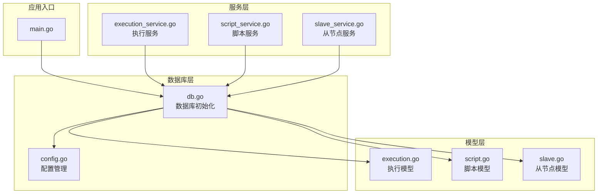
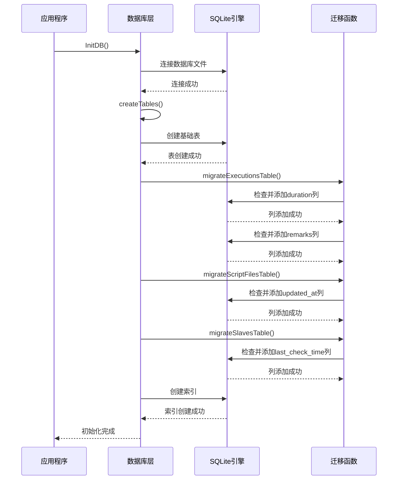
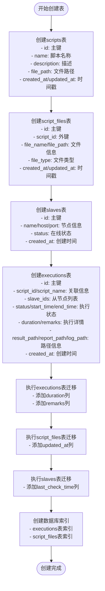
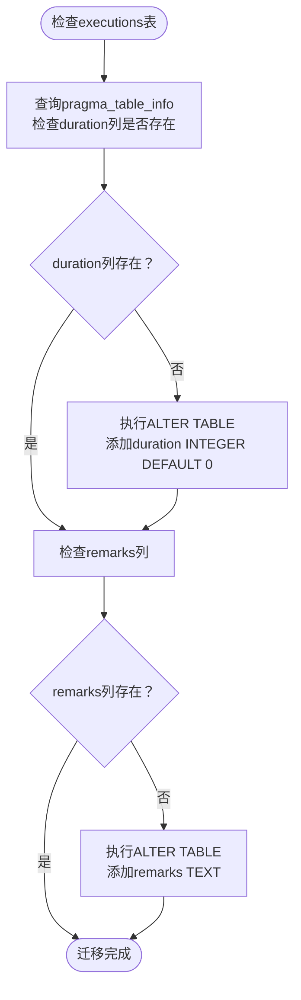
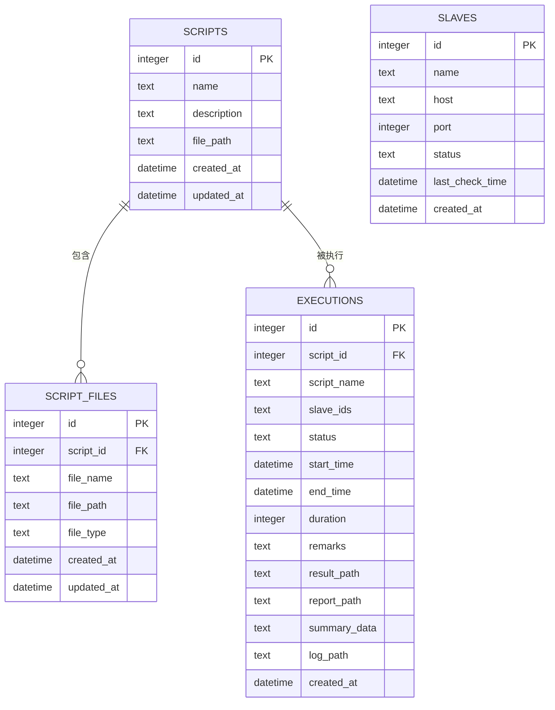
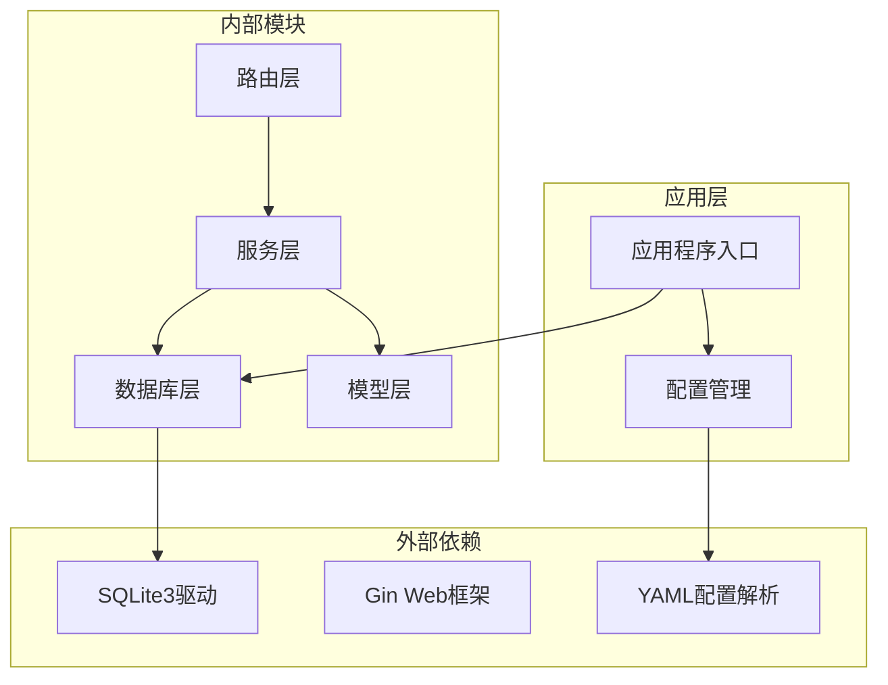
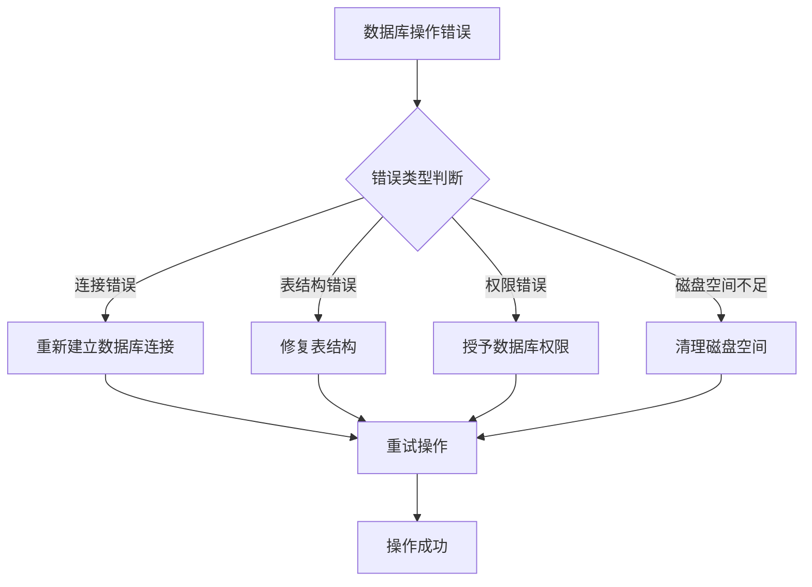

# 数据库迁移与版本管理

<cite>
**本文档引用的文件**
- [main.go](file://main.go)
- [db.go](file://internal/database/db.go)
- [config.go](file://config/config.go)
- [execution.go](file://internal/model/execution.go)
- [script.go](file://internal/model/script.go)
- [slave.go](file://internal/model/slave.go)
- [execution_service.go](file://internal/service/execution.go)
- [script_service.go](file://internal/service/script.go)
- [slave_service.go](file://internal/service/slave.go)
- [go.mod](file://go.mod)
</cite>

## 目录
1. [简介](#简介)
2. [项目结构](#项目结构)
3. [核心组件](#核心组件)
4. [架构概览](#架构概览)
5. [详细组件分析](#详细组件分析)
6. [依赖关系分析](#依赖关系分析)
7. [性能考虑](#性能考虑)
8. [故障排除指南](#故障排除指南)
9. [结论](#结论)

## 简介

JMeter Admin是一个基于Go语言开发的JMeter测试管理平台，采用SQLite作为内置数据库。本文档详细阐述了系统的数据库迁移机制设计与实现，包括表创建逻辑、迁移函数工作原理、列添加条件检查机制、向后兼容性保证、迁移脚本执行顺序和依赖关系、数据库版本控制策略以及生产环境迁移的最佳实践。

## 项目结构

JMeter Admin采用模块化的项目结构，数据库相关的核心文件位于`internal/database/`目录下：

**图表来源**
- [main.go:28-66](file://main.go#L28-L66)
- [db.go:15-34](file://internal/database/db.go#L15-L34)

**章节来源**
- [main.go:1-83](file://main.go#L1-L83)
- [db.go:1-197](file://internal/database/db.go#L1-L197)

## 核心组件

### 数据库初始化流程

系统在启动时通过`InitDB()`函数完成数据库初始化，该函数负责：
- 连接SQLite数据库文件
- 创建基础表结构
- 执行数据库迁移
- 创建必要的索引

### 表结构设计

系统维护四个核心表：

1. **scripts表**：存储JMeter测试脚本信息
2. **script_files表**：存储脚本关联的文件信息
3. **slaves表**：存储从节点信息
4. **executions表**：存储执行历史记录

**章节来源**
- [db.go:36-124](file://internal/database/db.go#L36-L124)

## 架构概览

**图表来源**
- [db.go:15-34](file://internal/database/db.go#L15-L34)
- [db.go:126-171](file://internal/database/db.go#L126-L171)

## 详细组件分析

### createTables函数分析

`createTables()`函数是数据库初始化的核心，负责创建所有基础表结构：

**图表来源**
- [db.go:36-124](file://internal/database/db.go#L36-L124)

**章节来源**
- [db.go:36-124](file://internal/database/db.go#L36-L124)

### 迁移函数工作原理

#### migrateExecutionsTable函数

该函数负责为executions表添加新的列，采用条件检查机制确保向后兼容性：

**图表来源**
- [db.go:126-147](file://internal/database/db.go#L126-L147)

#### migrateScriptFilesTable函数

为script_files表添加updated_at列，支持脚本文件的更新时间追踪：

**章节来源**
- [db.go:149-159](file://internal/database/db.go#L149-L159)

#### migrateSlavesTable函数

为slaves表添加last_check_time列，支持从节点的心跳检测功能：

**章节来源**
- [db.go:161-171](file://internal/database/db.go#L161-L171)

### 数据模型映射

**图表来源**
- [db.go:38-98](file://internal/database/db.go#L38-L98)
- [execution.go:3-18](file://internal/model/execution.go#L3-L18)
- [script.go:3-12](file://internal/model/script.go#L3-L12)
- [slave.go:3-11](file://internal/model/slave.go#L3-L11)

**章节来源**
- [execution.go:3-18](file://internal/model/execution.go#L3-L18)
- [script.go:3-12](file://internal/model/script.go#L3-L12)
- [slave.go:3-11](file://internal/model/slave.go#L3-L11)

## 依赖关系分析

### 数据库依赖图

**图表来源**
- [go.mod:5-9](file://go.mod#L5-L9)
- [main.go:3-14](file://main.go#L3-L14)

### 迁移依赖关系

迁移函数之间存在明确的依赖关系：

1. **基础表创建**：必须先创建所有基础表结构
2. **列添加顺序**：executions表迁移依赖于基础表创建
3. **索引创建**：在所有表结构确定后创建索引

**章节来源**
- [db.go:103-123](file://internal/database/db.go#L103-L123)

## 性能考虑

### 索引优化策略

系统创建了多个关键索引以提升查询性能：

1. **executions表索引**：
   - `idx_executions_script_id`：按脚本ID查询
   - `idx_executions_status`：按状态过滤
   - `idx_executions_created_at`：按时间倒序排序

2. **script_files表索引**：
   - `idx_script_files_script_id`：按脚本ID查询文件

### 查询优化

服务层的查询操作充分利用了这些索引：

- 分页查询使用`LIMIT/OFFSET`配合索引
- 条件查询使用适当的WHERE子句
- 排序操作使用索引支持的字段

## 故障排除指南

### 常见迁移问题

#### 迁移失败处理

当迁移过程中出现错误时，系统会返回详细的错误信息：

1. **表创建失败**：检查数据库文件权限和磁盘空间
2. **列添加失败**：验证SQLite版本支持ALTER TABLE操作
3. **索引创建失败**：检查表结构完整性和约束条件

#### 数据库锁定问题

SQLite在高并发场景下可能出现锁定问题：

- 使用适当的事务管理
- 避免长时间持有数据库连接
- 实现重试机制处理短暂锁定

### 错误处理机制

**章节来源**
- [db.go:15-34](file://internal/database/db.go#L15-L34)
- [execution_service.go:1043-1060](file://internal/service/execution.go#L1043-L1060)

## 结论

JMeter Admin的数据库迁移与版本管理机制展现了良好的设计原则：

1. **向后兼容性**：通过条件检查确保新版本可以在旧数据库上正常运行
2. **渐进式演进**：采用分阶段迁移策略，逐步添加新功能
3. **错误处理**：完善的错误处理和恢复机制
4. **性能优化**：合理的索引设计和查询优化
5. **安全性**：SQLite本地存储，无需额外的数据库部署

该机制为JMeter Admin提供了稳定可靠的数据库管理能力，支持系统的持续演进和功能扩展。