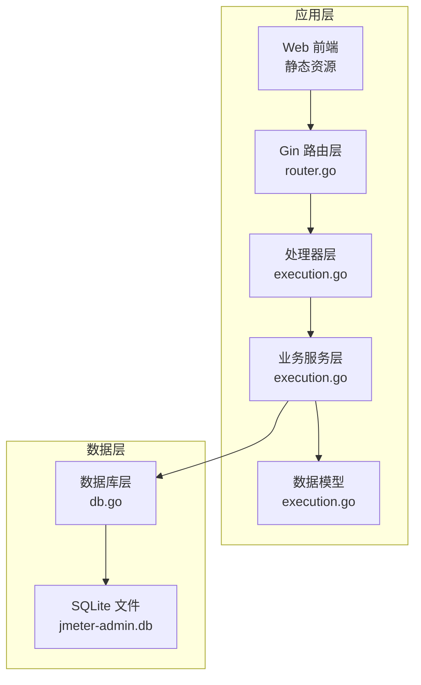
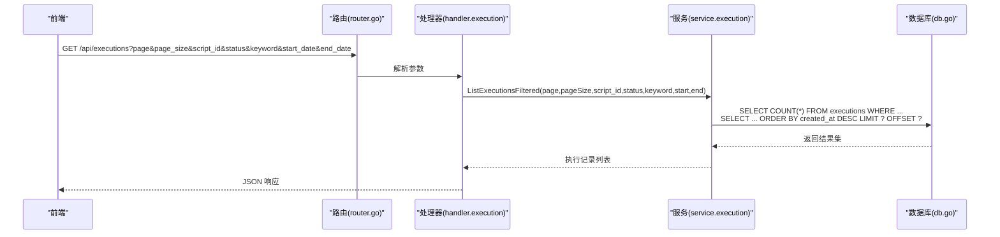
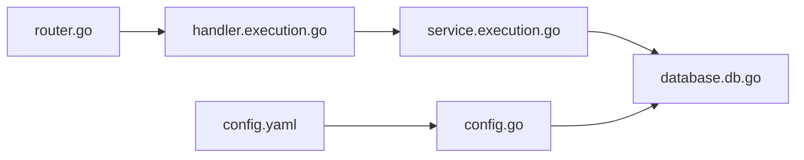

# 索引与性能

<cite>
**本文引用的文件**
- [internal/database/db.go](file://internal/database/db.go)
- [internal/service/execution.go](file://internal/service/execution.go)
- [internal/handler/execution.go](file://internal/handler/execution.go)
- [internal/model/execution.go](file://internal/model/execution.go)
- [internal/router/router.go](file://internal/router/router.go)
- [config/config.go](file://config/config.go)
- [config.yaml](file://config.yaml)
- [README.md](file://README.md)
</cite>

## 目录
1. [简介](#简介)
2. [项目结构](#项目结构)
3. [核心组件](#核心组件)
4. [架构总览](#架构总览)
5. [详细组件分析](#详细组件分析)
6. [依赖分析](#依赖分析)
7. [性能考量](#性能考量)
8. [故障排查指南](#故障排查指南)
9. [结论](#结论)
10. [附录](#附录)

## 简介
本文件聚焦于 JMeter Admin 的数据库索引策略与性能优化，围绕 executions 表的索引设计展开，解释现有索引（script_id、status、created_at）的设计目的、查询优化效果与权衡，并给出复合索引设计思路、维护成本与更新开销评估、查询计划分析与性能监控方法、慢查询分析与调优案例，以及数据库统计信息收集与分析建议。文档同时结合实际代码路径，帮助读者快速定位实现细节。

## 项目结构
JMeter Admin 采用后端 Go + Gin 框架 + SQLite 的轻量级架构。数据库初始化、表结构与索引创建集中在数据库层；业务逻辑集中在 service 层；API 路由与参数解析在 handler 层；模型定义在 model 层；前端通过静态资源提供。

图表来源
- [internal/router/router.go:14-112](file://internal/router/router.go#L14-L112)
- [internal/handler/execution.go:38-87](file://internal/handler/execution.go#L38-L87)
- [internal/service/execution.go:504-594](file://internal/service/execution.go#L504-L594)
- [internal/database/db.go:15-124](file://internal/database/db.go#L15-L124)

章节来源
- [internal/router/router.go:14-112](file://internal/router/router.go#L14-L112)
- [internal/handler/execution.go:38-87](file://internal/handler/execution.go#L38-L87)
- [internal/service/execution.go:504-594](file://internal/service/execution.go#L504-L594)
- [internal/database/db.go:15-124](file://internal/database/db.go#L15-L124)

## 核心组件
- 数据库层负责表创建、索引创建与迁移，确保 executions 表具备 script_id、status、created_at 三类常用查询字段的索引能力。
- 业务服务层提供分页查询、统计汇总、执行状态更新等能力，查询语句以 created_at 降序排序，常伴随 script_id/status/时间范围过滤。
- 处理器层负责参数解析与分页控制，将筛选条件传递给服务层。
- 模型层定义执行记录的数据结构，便于服务层扫描与返回。

章节来源
- [internal/database/db.go:173-189](file://internal/database/db.go#L173-L189)
- [internal/service/execution.go:504-594](file://internal/service/execution.go#L504-L594)
- [internal/handler/execution.go:55-87](file://internal/handler/execution.go#L55-L87)
- [internal/model/execution.go:3-18](file://internal/model/execution.go#L3-L18)

## 架构总览
下图展示了从 API 请求到数据库查询的关键路径，以及索引在查询优化中的作用。

图表来源
- [internal/router/router.go:50-66](file://internal/router/router.go#L50-L66)
- [internal/handler/execution.go:55-87](file://internal/handler/execution.go#L55-L87)
- [internal/service/execution.go:509-558](file://internal/service/execution.go#L509-L558)
- [internal/database/db.go:173-189](file://internal/database/db.go#L173-L189)

## 详细组件分析

### executions 表索引策略与设计目标
- 现有索引
  - idx_executions_script_id：加速按脚本维度的过滤与统计。
  - idx_executions_status：加速按状态过滤（如运行中、成功、失败）。
  - idx_executions_created_at：加速按时间倒序分页查询，满足“最近执行优先”的展示需求。
- 设计目标
  - 降低分页查询成本：created_at DESC 排序 + LIMIT/OFFSET 的组合在大数据量下需要高效索引支撑。
  - 提升过滤效率：script_id 与 status 的过滤在执行列表与统计接口中频繁出现。
  - 平衡写入成本：索引越多，INSERT/UPDATE/DELETE 的维护成本越高，需在读写比例上做权衡。

章节来源
- [internal/database/db.go:173-189](file://internal/database/db.go#L173-L189)
- [internal/service/execution.go:509-558](file://internal/service/execution.go#L509-L558)

### 查询优化效果与使用场景
- 场景一：执行列表分页（按时间倒序）
  - SQL 特征：ORDER BY created_at DESC + LIMIT/OFFSET；常见筛选：script_id、status、created_at 范围、remarks 模糊匹配。
  - 索引收益：created_at 索引可避免全表扫描与临时排序，显著降低 IO 与 CPU。
- 场景二：按脚本维度统计/过滤
  - SQL 特征：WHERE script_id = ? 或 COUNT(*) GROUP BY status。
  - 索引收益：script_id 索引可快速定位某脚本的所有执行记录。
- 场景三：按状态统计
  - SQL 特征：COUNT(*) WHERE status = ?。
  - 索引收益：status 索引可快速聚合不同状态的数量。

章节来源
- [internal/service/execution.go:509-558](file://internal/service/execution.go#L509-L558)
- [internal/service/execution.go:606-635](file://internal/service/execution.go#L606-L635)

### 复合索引设计思路与建议
- 设计原则
  - 前缀匹配优先：若查询常以 script_id 作为首要过滤条件，且后续再按 created_at 排序，可考虑复合索引 (script_id, created_at) 以减少回表与排序成本。
  - 覆盖查询：若查询仅涉及 script_id、status、created_at 等少量列，可考虑覆盖索引减少主键回表。
  - 选择性与基数：优先选择高选择性的列作为前导列，例如 status 的分布较均匀时，(status, created_at) 也可作为备选。
- 建议的复合索引
  - (script_id, created_at DESC)：针对“按脚本查看最新执行”场景。
  - (status, created_at DESC)：针对“按状态查看最新执行”场景。
  - (script_id, status, created_at DESC)：针对“按脚本+状态查看最新执行”的强过滤场景。
- 注意事项
  - SQLite 对复合索引的最左前缀原则有效，但不支持隐式覆盖，仍需谨慎评估是否能完全覆盖查询列。
  - 新增复合索引会增加写入开销，需结合实际读写比例评估。

章节来源
- [internal/database/db.go:173-189](file://internal/database/db.go#L173-L189)
- [internal/service/execution.go:509-558](file://internal/service/execution.go#L509-L558)

### 索引维护成本与更新开销
- 写入路径
  - INSERT：每次插入需要更新所有相关索引，索引越多，单次写入开销越大。
  - UPDATE：若更新了被索引列（如 status、created_at），需要重建对应索引条目。
  - DELETE：删除记录同样需要维护索引。
- 成本权衡
  - executions 表写入主要来自执行状态变更与新增记录，读取以分页查询为主。
  - 在当前读多写少的场景下，适度增加索引可显著提升查询性能，但需关注写入延迟与磁盘占用。

章节来源
- [internal/database/db.go:173-189](file://internal/database/db.go#L173-L189)

### 查询计划分析与性能监控
- 查询计划
  - SQLite 的 EXPLAIN QUERY PLAN 可用于分析执行路径，确认是否命中索引、是否发生全表扫描或临时排序。
  - 建议在测试环境对高频查询（如分页查询、统计查询）进行计划分析，验证 created_at、script_id、status 索引的使用情况。
- 性能监控
  - 业务侧：通过接口响应时间、分页查询耗时、统计接口耗时等指标观察性能变化。
  - 数据库侧：定期检查索引使用率、表大小增长趋势、写入延迟等。
  - 前端侧：执行列表页面的加载时间与自动刷新频率可作为间接指标。

章节来源
- [internal/service/execution.go:509-558](file://internal/service/execution.go#L509-L558)

### 慢查询分析与性能调优案例
- 案例一：分页查询变慢
  - 现象：当 executions 表规模增大时，按 created_at 倒序分页查询耗时上升。
  - 分析：可能未命中 created_at 索引或存在隐式排序导致额外开销。
  - 调优：确认 created_at 索引存在并保持更新；必要时引入 (script_id, created_at DESC) 复合索引以减少回表与排序。
- 案例二：按脚本过滤慢
  - 现象：筛选 script_id 的查询耗时较高。
  - 分析：可能未建立 script_id 索引或查询未使用索引。
  - 调优：确认 idx_executions_script_id 存在；若查询同时包含 created_at 范围，考虑 (script_id, created_at DESC) 复合索引。
- 案例三：按状态统计慢
  - 现象：统计 running/success/failed 数量耗时较长。
  - 分析：COUNT(*) 未使用索引或表过大。
  - 调优：确认 idx_executions_status 存在；必要时引入 (status, created_at DESC) 复合索引以覆盖统计查询。

章节来源
- [internal/database/db.go:173-189](file://internal/database/db.go#L173-L189)
- [internal/service/execution.go:606-635](file://internal/service/execution.go#L606-L635)

### 数据库统计信息收集与分析
- 统计项建议
  - 表大小与索引大小：评估索引带来的存储开销。
  - 索引使用次数：分析各索引的命中频率，识别低效或冗余索引。
  - 写入速率与延迟：监控 INSERT/UPDATE/DELETE 的平均耗时与 P95/P99。
  - 查询耗时分布：对高频查询进行耗时分位分析，定位瓶颈。
- 分析方法
  - SQLite PRAGMA 命令：如 table_info、index_info、index_list 等辅助分析索引结构。
  - EXPLAIN QUERY PLAN：分析具体 SQL 的执行计划。
  - 应用埋点：在服务层记录查询耗时与返回行数，形成趋势报表。

章节来源
- [internal/database/db.go:173-189](file://internal/database/db.go#L173-L189)

## 依赖分析
- 路由层到处理器层：通过 /api/executions 组织执行相关的 API，参数解析与分页控制在处理器层完成。
- 处理器层到服务层：处理器将筛选参数传递给服务层的 ListExecutionsFiltered 与 GetExecutionStats。
- 服务层到数据库层：服务层构造 SQL 查询，数据库层负责执行与索引使用。
- 配置层：全局配置影响数据目录、JMeter 路径等，间接影响结果与报告的生成与存储。

图表来源
- [internal/router/router.go:50-66](file://internal/router/router.go#L50-L66)
- [internal/handler/execution.go:55-87](file://internal/handler/execution.go#L55-L87)
- [internal/service/execution.go:509-558](file://internal/service/execution.go#L509-L558)
- [internal/database/db.go:15-34](file://internal/database/db.go#L15-L34)
- [config/config.go:43-84](file://config/config.go#L43-L84)
- [config.yaml:1-26](file://config.yaml#L1-L26)

章节来源
- [internal/router/router.go:50-66](file://internal/router/router.go#L50-L66)
- [internal/handler/execution.go:55-87](file://internal/handler/execution.go#L55-L87)
- [internal/service/execution.go:509-558](file://internal/service/execution.go#L509-L558)
- [internal/database/db.go:15-34](file://internal/database/db.go#L15-L34)
- [config/config.go:43-84](file://config/config.go#L43-L84)
- [config.yaml:1-26](file://config.yaml#L1-L26)

## 性能考量
- 读写比例与索引密度
  - executions 表以读为主（列表、统计、报告），适度增加索引可显著提升查询性能。
- 索引覆盖与回表
  - 若查询列较多，建议通过复合索引覆盖常用列，减少主键回表带来的 IO。
- 分页与排序
  - created_at DESC 排序配合 LIMIT/OFFSET 是热点模式，务必保证 created_at 索引的高效性。
- 写入放大
  - 新增索引会放大写入成本，建议在业务低峰期进行索引变更，并做好灰度验证。

## 故障排查指南
- 现象：分页查询缓慢
  - 步骤：确认 created_at 索引是否存在；使用 EXPLAIN QUERY PLAN 检查是否命中索引；评估是否需要复合索引。
- 现象：按脚本/状态过滤慢
  - 步骤：确认 script_id/status 索引是否存在；检查查询是否使用了索引；必要时引入复合索引。
- 现象：统计接口耗时上升
  - 步骤：检查 COUNT(*) 查询计划；评估是否需要覆盖索引；关注表规模增长趋势。
- 现象：写入延迟升高
  - 步骤：评估索引数量与写入路径；在低峰期进行索引维护；监控磁盘与内存占用。

章节来源
- [internal/database/db.go:173-189](file://internal/database/db.go#L173-L189)
- [internal/service/execution.go:509-558](file://internal/service/execution.go#L509-L558)
- [internal/service/execution.go:606-635](file://internal/service/execution.go#L606-L635)

## 结论
JMeter Admin 的 executions 表已具备 script_id、status、created_at 三类关键字段的索引，能够有效支撑执行列表分页、按脚本/状态过滤与统计汇总等核心场景。为进一步提升性能，建议在高频查询场景引入复合索引（如 script_id+created_at DESC、status+created_at DESC），并在写入高峰时段谨慎评估索引变更的影响。通过查询计划分析、性能监控与慢查询案例复盘，可持续优化数据库性能与稳定性。

## 附录
- 数据库表结构参考
  - executions 表字段与说明可参考项目自述文件中的“数据库表结构”部分。
- 配置文件位置与用途
  - config.yaml 用于设置服务端口、JMeter 路径、Master 主机名、数据/上传/结果目录等。

章节来源
- [README.md:175-229](file://README.md#L175-L229)
- [config.yaml:1-26](file://config.yaml#L1-L26)