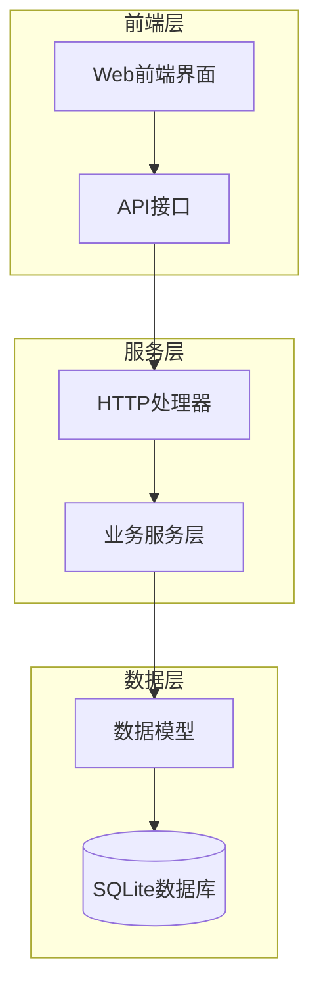
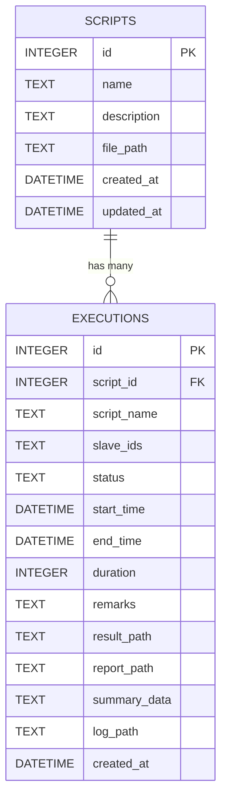
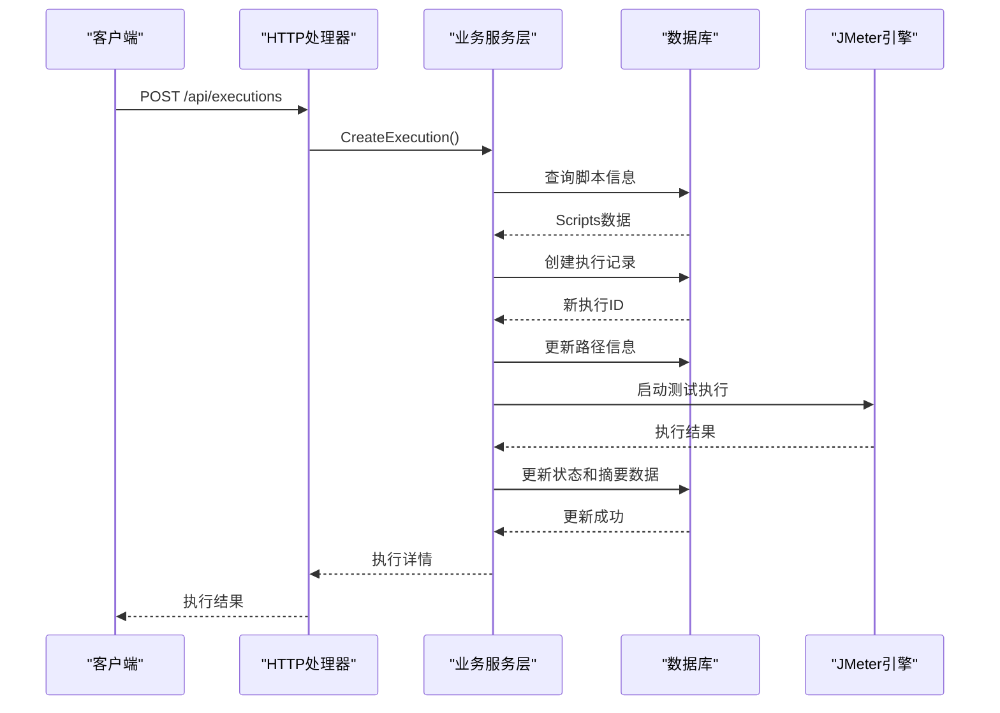
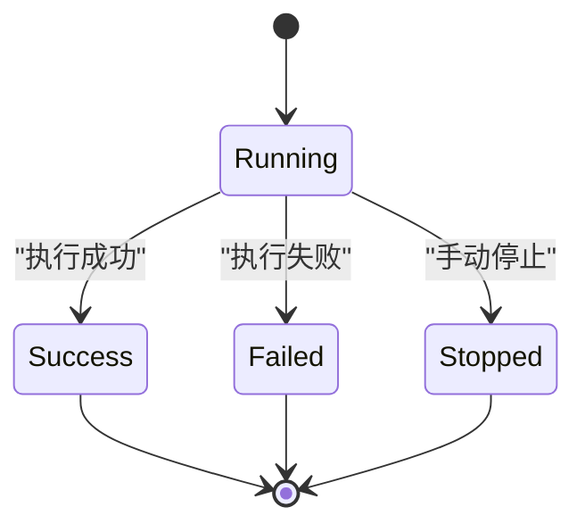
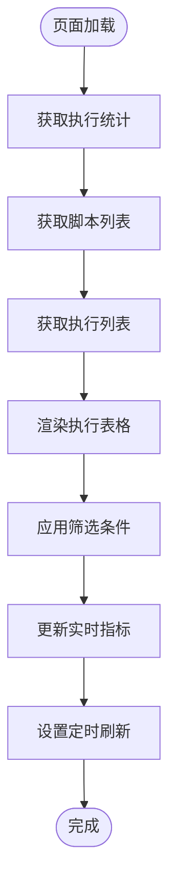
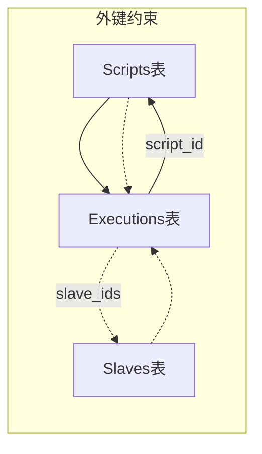
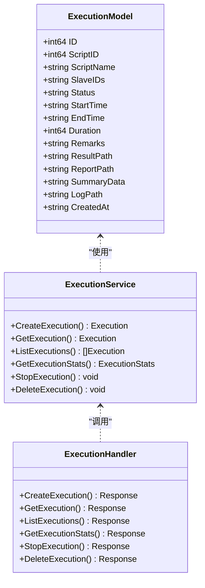

# Executions表设计

<cite>
**本文档引用的文件**
- [db.go](file://internal/database/db.go)
- [execution.go](file://internal/model/execution.go)
- [execution.go](file://internal/service/execution.go)
- [execution.go](file://internal/handler/execution.go)
- [execution.js](file://web/src/api/execution.js)
- [ExecutionList.vue](file://web/src/views/ExecutionList.vue)
- [ExecutionDetail.vue](file://web/src/views/ExecutionDetail.vue)
</cite>

## 目录
1. [简介](#简介)
2. [项目结构](#项目结构)
3. [核心组件](#核心组件)
4. [架构概览](#架构概览)
5. [详细组件分析](#详细组件分析)
6. [依赖关系分析](#依赖关系分析)
7. [性能考虑](#性能考虑)
8. [故障排除指南](#故障排除指南)
9. [结论](#结论)

## 简介

Executions表是JMeter管理系统中的核心数据表，用于跟踪和管理所有测试执行的历史记录。该表设计遵循数据库规范化原则，通过外键关系与Scripts表建立关联，确保测试执行数据的完整性和一致性。本文档将详细分析Executions表的完整结构、字段含义、业务关联以及在整个测试执行流程中的作用。

## 项目结构

JMeter管理系统采用分层架构设计，Executions表作为数据持久化的关键组件，位于以下层次结构中：

**图表来源**
- [execution.go:1-729](file://internal/handler/execution.go#L1-L729)
- [execution.go:1-2546](file://internal/service/execution.go#L1-L2546)
- [db.go:1-197](file://internal/database/db.go#L1-L197)

## 核心组件

### Executions表结构设计

Executions表采用SQLite数据库实现，包含以下核心字段：

| 字段名 | 类型 | 约束 | 描述 |
|--------|------|------|------|
| id | INTEGER | PRIMARY KEY AUTOINCREMENT | 主键，自增标识符 |
| script_id | INTEGER | NOT NULL, FOREIGN KEY | 外键，关联scripts表 |
| script_name | TEXT | NOT NULL | 脚本名称冗余字段，便于展示 |
| slave_ids | TEXT | | Slave节点ID集合（JSON数组） |
| status | TEXT | DEFAULT 'running' | 执行状态：running/success/failed/stopped |
| start_time | DATETIME | | 开始执行时间 |
| end_time | DATETIME | | 执行结束时间 |
| duration | INTEGER | DEFAULT 0 | 执行时长（秒） |
| remarks | TEXT | | 执行备注信息 |
| result_path | TEXT | | JTL结果文件路径 |
| report_path | TEXT | | HTML报告路径 |
| summary_data | TEXT | | 执行摘要数据（JSON） |
| log_path | TEXT | | 执行日志文件路径 |
| created_at | DATETIME | | 记录创建时间 |

**章节来源**
- [db.go:80-98](file://internal/database/db.go#L80-L98)

### 外键关系设计

Executions表与Scripts表建立了严格的外键约束关系：

**图表来源**
- [db.go:37-46](file://internal/database/db.go#L37-L46)
- [db.go:80-98](file://internal/database/db.go#L80-L98)

**章节来源**
- [db.go:37-46](file://internal/database/db.go#L37-L46)
- [db.go:80-98](file://internal/database/db.go#L80-L98)

## 架构概览

Executions表在整个系统中的工作流程如下：

**图表来源**
- [execution.go:38-53](file://internal/handler/execution.go#L38-L53)
- [execution.go:103-481](file://internal/service/execution.go#L103-L481)

## 详细组件分析

### 数据模型设计

Executions表的数据模型设计体现了以下特点：

#### 字段完整性保证
- **主键设计**：使用INTEGER PRIMARY KEY AUTOINCREMENT确保唯一性
- **非空约束**：script_id、script_name、status等关键字段设置NOT NULL
- **默认值**：status默认值为'running'，duration默认值为0

#### 关系映射
- **一对一关系**：每个执行记录对应一个脚本
- **一对多关系**：每个脚本可以有多个执行记录

**章节来源**
- [execution.go:3-18](file://internal/model/execution.go#L3-L18)

### 业务流程集成

Executions表在测试执行流程中的关键作用：

#### 执行生命周期管理

#### 数据流向分析
1. **创建阶段**：Handler接收请求 → Service验证脚本 → DB插入记录
2. **执行阶段**：Service启动JMeter → 实时更新状态和指标
3. **完成阶段**：Service解析结果 → DB更新最终状态和摘要

**章节来源**
- [execution.go:103-481](file://internal/service/execution.go#L103-L481)

### 前端集成设计

Executions表与前端界面的集成体现在以下几个方面：

#### 执行列表展示
前端通过API接口获取执行记录，支持按状态、时间范围、关键字等条件筛选：

**图表来源**
- [ExecutionList.vue:504-556](file://web/src/views/ExecutionList.vue#L504-L556)

**章节来源**
- [ExecutionList.vue:1-800](file://web/src/views/ExecutionList.vue#L1-L800)
- [execution.js:1-78](file://web/src/api/execution.js#L1-L78)

#### 执行详情展示
前端提供详细的执行结果展示，包括：
- 实时趋势图表
- 错误分析统计
- 报告文件下载
- 日志流式显示

**章节来源**
- [ExecutionDetail.vue:1-800](file://web/src/views/ExecutionDetail.vue#L1-L800)

## 依赖关系分析

### 数据库依赖关系

Executions表与其他表的依赖关系：

**图表来源**
- [db.go:80-98](file://internal/database/db.go#L80-L98)

### 业务逻辑依赖

Executions表在业务逻辑中的依赖关系：

**图表来源**
- [execution.go:3-18](file://internal/model/execution.go#L3-L18)
- [execution.go:103-481](file://internal/service/execution.go#L103-L481)
- [execution.go:38-168](file://internal/handler/execution.go#L38-L168)

**章节来源**
- [execution.go:3-18](file://internal/model/execution.go#L3-L18)
- [execution.go:103-481](file://internal/service/execution.go#L103-L481)
- [execution.go:38-168](file://internal/handler/execution.go#L38-L168)

## 性能考虑

### 数据库优化策略

1. **索引设计**：为script_id、status、created_at字段建立索引
2. **查询优化**：使用LIMIT和OFFSET实现分页查询
3. **缓存策略**：对常用统计信息进行缓存

### 内存管理

1. **实时指标**：使用sync.Map存储执行中的进程信息
2. **日志处理**：采用流式处理避免大文件内存占用
3. **资源清理**：及时释放数据库连接和文件句柄

## 故障排除指南

### 常见问题及解决方案

#### 执行记录查询异常
- **症状**：查询执行列表时出现错误
- **原因**：数据库连接问题或SQL语法错误
- **解决**：检查数据库连接状态，验证SQL语句正确性

#### 外键约束冲突
- **症状**：删除脚本时提示外键约束错误
- **原因**：存在关联的执行记录
- **解决**：先删除相关执行记录，再删除脚本

#### 文件路径问题
- **症状**：下载结果文件或报告时找不到文件
- **原因**：文件路径配置错误或文件被删除
- **解决**：检查文件系统权限和路径配置

**章节来源**
- [execution.go:504-594](file://internal/service/execution.go#L504-L594)

## 结论

Executions表作为JMeter管理系统的核心数据组件，通过精心设计的字段结构、严格的外键关系和完整的业务流程集成，实现了测试执行数据的完整管理和高效查询。其设计充分考虑了性能优化、错误处理和用户体验，在保证数据一致性的同时提供了丰富的功能特性。

该表的设计体现了现代Web应用的最佳实践，包括：
- 清晰的业务逻辑分离
- 完善的错误处理机制
- 高效的数据库查询优化
- 用户友好的前端交互体验

通过持续的监控和维护，Executions表将继续为JMeter管理系统的稳定运行提供可靠的数据支撑。