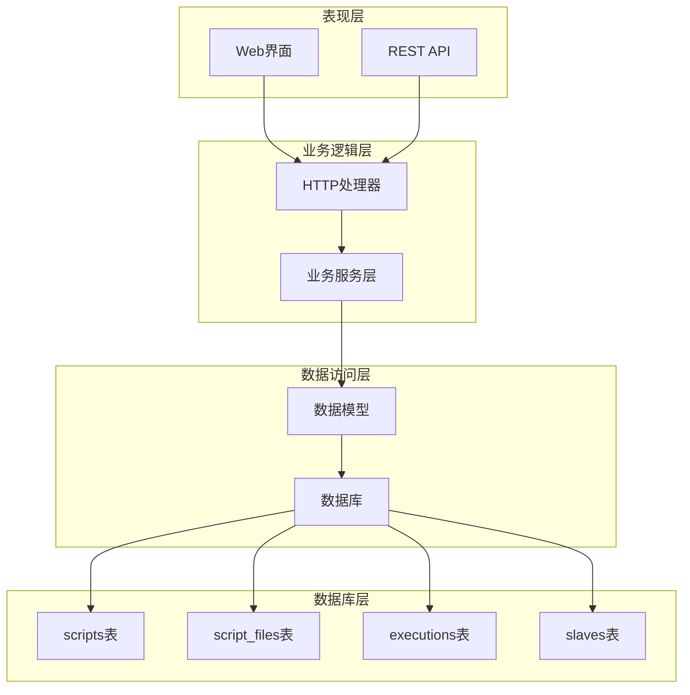
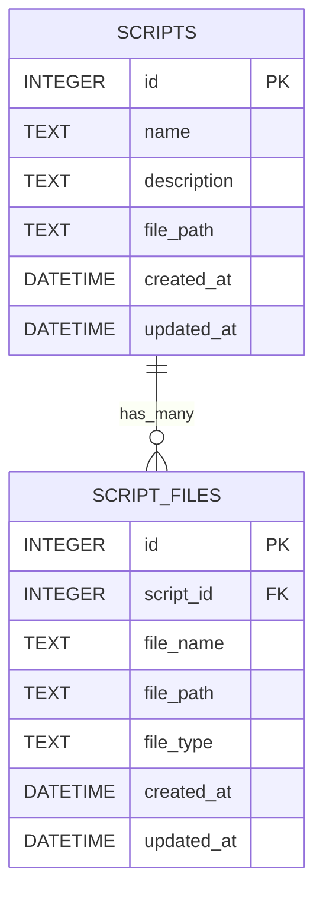
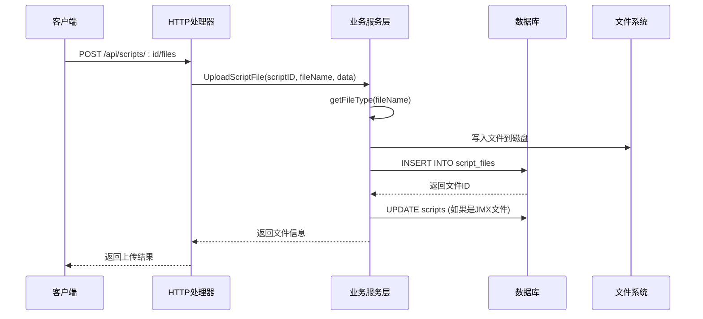
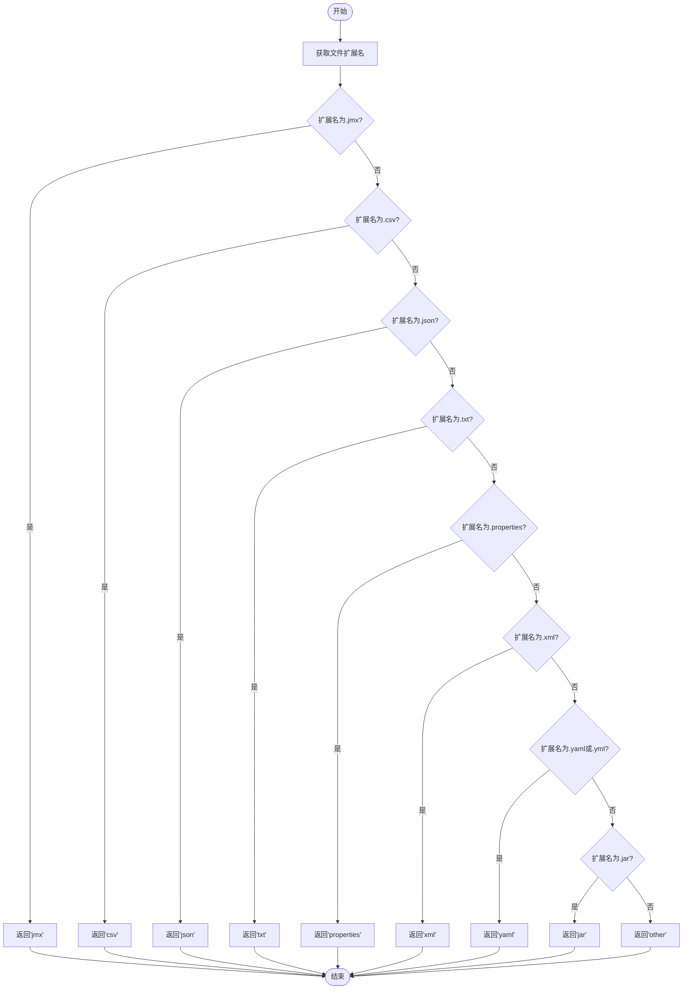
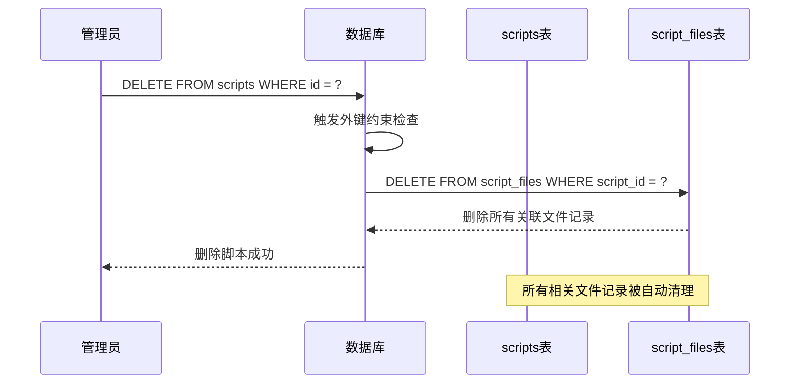
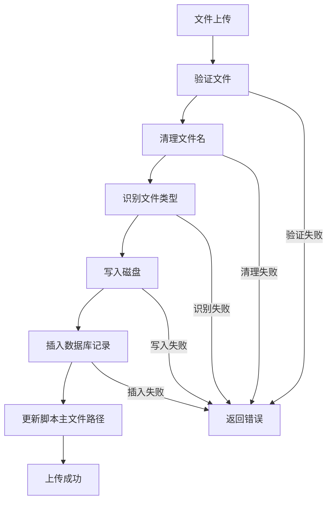
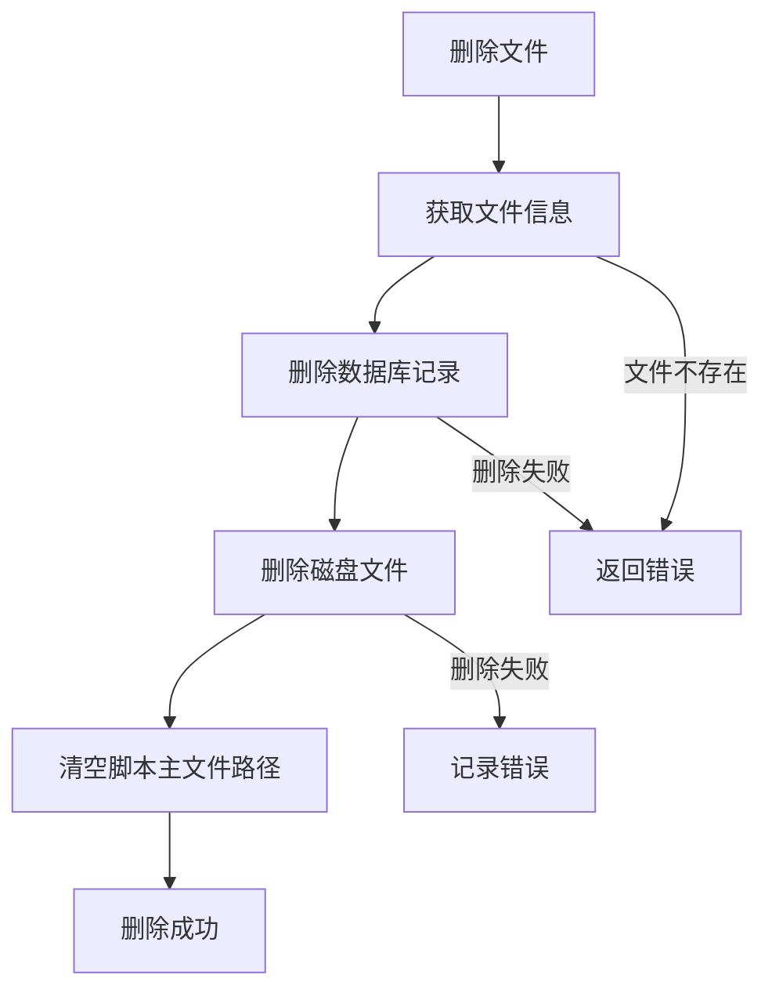
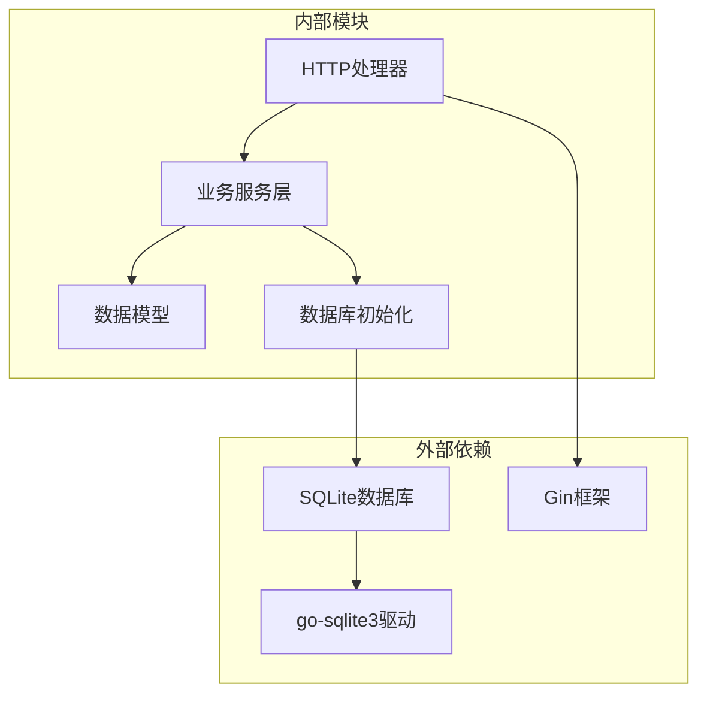

# Script Files表设计

<cite>
**本文档引用的文件**
- [db.go](file://internal/database/db.go)
- [script.go](file://internal/model/script.go)
- [script.go](file://internal/service/script.go)
- [script.go](file://internal/handler/script.go)
- [router.go](file://internal/router/router.go)
</cite>

## 目录
1. [简介](#简介)
2. [项目结构](#项目结构)
3. [核心组件](#核心组件)
4. [架构概览](#架构概览)
5. [详细组件分析](#详细组件分析)
6. [依赖分析](#依赖分析)
7. [性能考虑](#性能考虑)
8. [故障排除指南](#故障排除指南)
9. [结论](#结论)

## 简介

本文档详细说明了JMeter管理系统中Script Files表的完整设计。该表用于存储与测试脚本相关的所有文件信息，包括主JMX文件和其他辅助文件。本文档将深入分析表结构、外键关系设计、字段约束、业务用途以及相关的数据流处理逻辑。

## 项目结构

该项目采用典型的三层架构模式，主要分为以下层次：



**图表来源**
- [router.go:24-36](file://internal/router/router.go#L24-L36)
- [db.go:38-61](file://internal/database/db.go#L38-L61)

**章节来源**
- [router.go:14-112](file://internal/router/router.go#L14-L112)
- [db.go:15-124](file://internal/database/db.go#L15-L124)

## 核心组件

### Script Files表结构

Script Files表是整个系统的核心数据表之一，负责存储与测试脚本相关的所有文件信息。该表的设计充分考虑了JMeter测试脚本的特性，支持多种文件类型的管理。

#### 表结构定义

| 字段名 | 数据类型 | 约束条件 | 描述 |
|--------|----------|----------|------|
| id | INTEGER | PRIMARY KEY AUTOINCREMENT | 主键，自增ID |
| script_id | INTEGER | NOT NULL, FOREIGN KEY | 外键，关联scripts表的id |
| file_name | TEXT | NOT NULL | 文件名，包含扩展名 |
| file_path | TEXT | NOT NULL | 文件在服务器上的完整路径 |
| file_type | TEXT | NOT NULL | 文件类型标识 |
| created_at | DATETIME | - | 创建时间戳 |
| updated_at | DATETIME | - | 更新时间戳 |

#### 外键关系设计



**图表来源**
- [db.go:52-61](file://internal/database/db.go#L52-L61)

#### 外键约束定义

外键约束定义：
- **REFERENCES scripts(id)**: 确保每个文件都必须关联到一个存在的脚本
- **ON DELETE CASCADE**: 当删除脚本时，自动删除该脚本关联的所有文件记录

**章节来源**
- [db.go:52-61](file://internal/database/db.go#L52-L61)

## 架构概览

系统采用分层架构设计，各层职责明确：



**图表来源**
- [script.go:240-302](file://internal/handler/script.go#L240-L302)
- [script.go:307-359](file://internal/service/script.go#L307-L359)

**章节来源**
- [script.go:240-302](file://internal/handler/script.go#L240-L302)
- [script.go:307-359](file://internal/service/script.go#L307-L359)

## 详细组件分析

### 文件类型字段设计

文件类型字段是Script Files表的核心业务字段，用于标识文件的类型和用途。

#### 文件类型取值规范

根据文件扩展名自动识别文件类型：

| 文件类型 | 扩展名 | 业务用途 |
|----------|--------|----------|
| jmx | .jmx | JMeter测试脚本主文件 |
| csv | .csv | 测试数据文件 |
| json | .json | 配置或数据文件 |
| txt | .txt | 文本数据或日志文件 |
| properties | .properties | Java属性配置文件 |
| xml | .xml | XML格式数据或配置 |
| yaml | .yaml, .yml | YAML格式配置文件 |
| jar | .jar | Java库文件 |
| other | 其他 | 不在上述分类中的文件 |

#### 文件类型识别逻辑



**图表来源**
- [script.go:362-384](file://internal/service/script.go#L362-L384)

**章节来源**
- [script.go:362-384](file://internal/service/script.go#L362-L384)

### 外键关系设计详解

#### ON DELETE CASCADE级联删除规则

外键关系设计中的ON DELETE CASCADE规则具有重要意义：



**图表来源**
- [db.go:60](file://internal/database/db.go#L60)

#### 外键约束的作用机制

1. **数据完整性保证**: 确保每个文件都必须关联到有效的脚本
2. **级联删除**: 自动清理相关联的数据，避免孤儿记录
3. **引用一致性**: 防止出现无效的外键引用

**章节来源**
- [db.go:60](file://internal/database/db.go#L60)

### 字段约束说明

#### 主键约束
- **id**: PRIMARY KEY AUTOINCREMENT，确保每条记录的唯一性

#### 非空约束
- **script_id**: NOT NULL，确保文件必须关联到脚本
- **file_name**: NOT NULL，确保文件名存在
- **file_path**: NOT NULL，确保文件路径存在
- **file_type**: NOT NULL，确保文件类型标识存在

#### 外键约束
- **script_id**: REFERENCES scripts(id) ON DELETE CASCADE，实现级联删除

#### 时间戳字段
- **created_at**: 记录文件创建时间
- **updated_at**: 记录文件最后更新时间（通过迁移添加）

**章节来源**
- [db.go:52-61](file://internal/database/db.go#L52-L61)

### 业务流程分析

#### 文件上传流程



**图表来源**
- [script.go:240-302](file://internal/handler/script.go#L240-L302)
- [script.go:307-359](file://internal/service/script.go#L307-L359)

#### 文件删除流程



**图表来源**
- [script.go:386-432](file://internal/service/script.go#L386-L432)

**章节来源**
- [script.go:240-302](file://internal/handler/script.go#L240-L302)
- [script.go:307-359](file://internal/service/script.go#L307-L359)
- [script.go:386-432](file://internal/service/script.go#L386-L432)

## 依赖分析

### 组件耦合关系



**图表来源**
- [db.go:10](file://internal/database/db.go#L10)
- [script.go:12-14](file://internal/handler/script.go#L12-L14)

### 关键依赖关系

1. **数据库依赖**: 使用SQLite作为数据存储，go-sqlite3驱动提供数据库连接
2. **Web框架依赖**: 使用Gin框架处理HTTP请求和响应
3. **文件系统依赖**: 直接操作文件系统进行文件读写
4. **业务逻辑依赖**: 严格的业务规则确保数据一致性

**章节来源**
- [db.go:10](file://internal/database/db.go#L10)
- [script.go:12-14](file://internal/handler/script.go#L12-L14)

## 性能考虑

### 索引策略

系统为script_files表建立了专门的索引以优化查询性能：

```sql
CREATE INDEX IF NOT EXISTS idx_script_files_script_id ON script_files(script_id);
```

该索引用于加速基于script_id的查询操作，提高文件列表查询的性能。

### 存储优化

1. **文件路径存储**: 存储完整文件路径，便于直接访问
2. **类型分离**: 通过file_type字段实现不同类型文件的快速筛选
3. **时间戳优化**: 提供精确的时间戳记录，支持排序和统计

### 并发处理

系统采用SQLite的并发处理能力，支持多用户同时访问。对于高并发场景，建议考虑以下优化：

1. **连接池管理**: 合理配置数据库连接池
2. **批量操作**: 对于大量文件操作，考虑批量处理
3. **缓存策略**: 对于频繁访问的文件元数据，考虑应用层缓存

## 故障排除指南

### 常见问题及解决方案

#### 文件上传失败

**问题**: 上传文件时返回错误
**可能原因**:
- 文件大小超出限制（单文件100MB，总大小500MB）
- 文件类型不受支持
- 磁盘空间不足
- 权限问题

**解决方法**:
1. 检查文件大小是否符合限制
2. 确认文件扩展名在支持列表中
3. 检查磁盘空间和权限
4. 查看服务端日志获取详细错误信息

#### 文件删除异常

**问题**: 删除文件后数据库记录仍然存在
**可能原因**:
- 外键约束导致删除失败
- 文件路径不正确
- 权限不足

**解决方法**:
1. 确认文件ID和脚本ID的对应关系
2. 检查文件路径是否正确
3. 验证文件系统权限
4. 检查数据库事务状态

#### 级联删除问题

**问题**: 删除脚本后相关文件未被删除
**可能原因**:
- 外键约束配置错误
- 数据库版本问题
- 手动修改了外键约束

**解决方法**:
1. 检查外键约束定义
2. 验证数据库版本兼容性
3. 重新创建表结构

**章节来源**
- [script.go:386-432](file://internal/service/script.go#L386-L432)

## 结论

Script Files表设计充分体现了JMeter管理系统对测试脚本文件管理的需求。通过合理的表结构设计、严格的外键约束和完善的业务逻辑处理，系统能够有效地管理各种类型的测试脚本文件。

### 设计亮点

1. **完整性保证**: 通过外键约束确保数据完整性
2. **自动化清理**: ON DELETE CASCADE实现自动级联删除
3. **类型化管理**: 文件类型字段支持精确的文件分类
4. **性能优化**: 合理的索引设计提升查询效率
5. **业务一致性**: 严格的业务规则确保数据一致性

### 改进建议

1. **索引优化**: 可考虑为file_type字段建立索引以优化类型查询
2. **监控机制**: 添加文件操作的审计日志
3. **备份策略**: 实现文件的定期备份机制
4. **容量监控**: 添加磁盘使用情况的监控

该设计为JMeter测试脚本的管理提供了坚实的数据基础，能够满足实际业务需求并具备良好的扩展性。