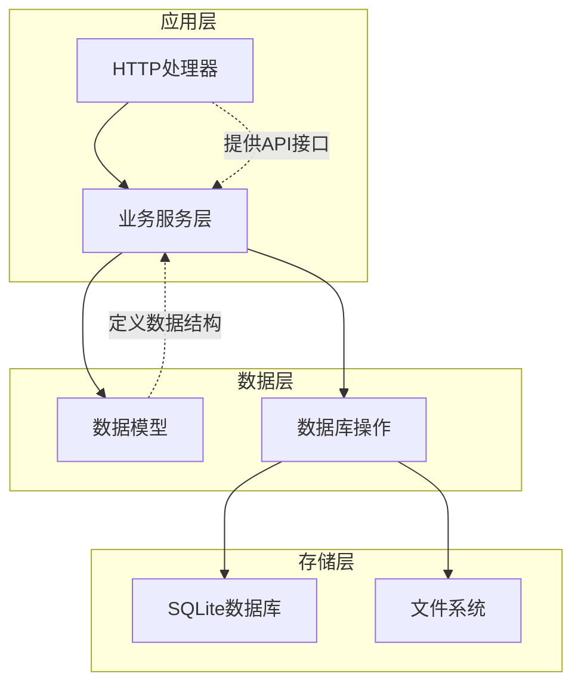
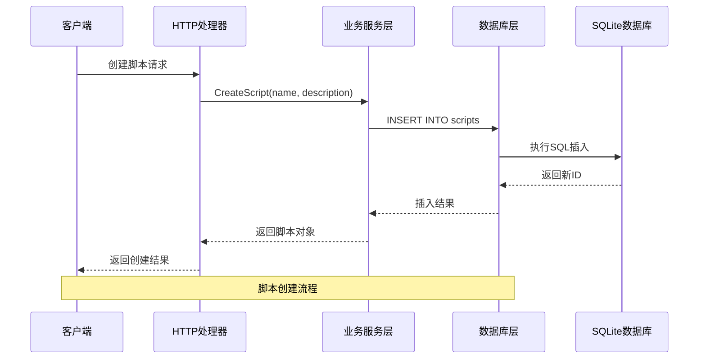
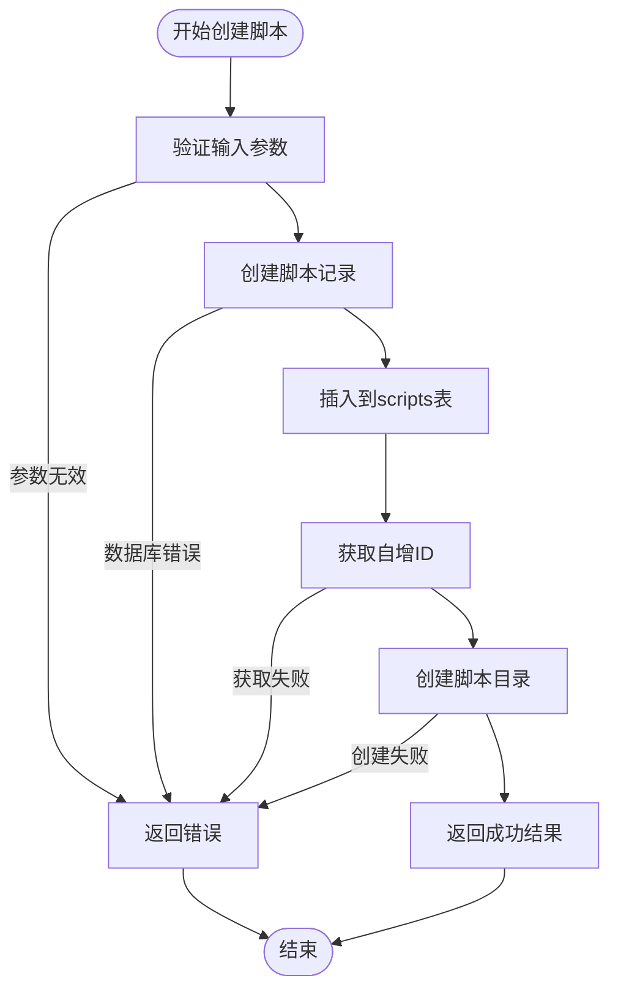
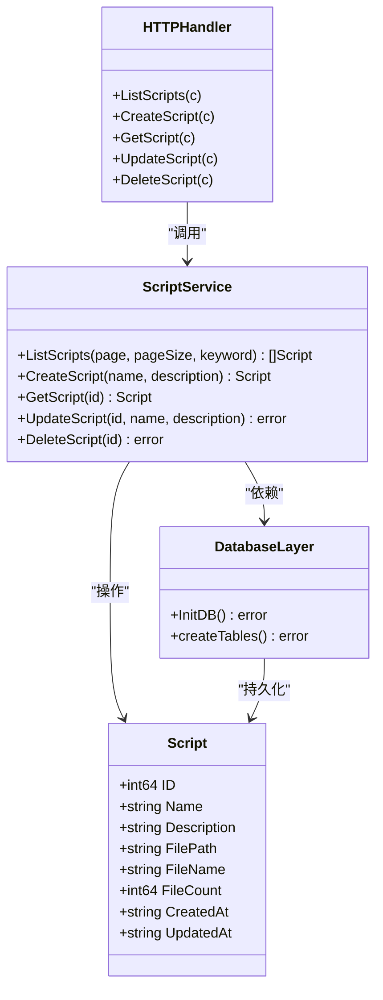

# Scripts表设计

<cite>
**本文档引用的文件**
- [db.go](file://internal/database/db.go)
- [script.go](file://internal/model/script.go)
- [script.go](file://internal/service/script.go)
- [script.go](file://internal/handler/script.go)
- [config.go](file://config/config.go)
- [config.yaml](file://config.yaml)
</cite>

## 目录
1. [简介](#简介)
2. [项目结构](#项目结构)
3. [核心组件](#核心组件)
4. [架构概览](#架构概览)
5. [详细组件分析](#详细组件分析)
6. [依赖关系分析](#依赖关系分析)
7. [性能考虑](#性能考虑)
8. [故障排除指南](#故障排除指南)
9. [结论](#结论)

## 简介

Scripts表是JMeter Admin管理系统的核心数据表之一，用于存储JMeter测试脚本的基本信息。该表设计遵循SQLite的自增主键策略，确保每条记录的唯一性和完整性。通过该表，系统能够有效管理JMeter脚本的元数据信息，包括脚本名称、描述、文件路径以及时间戳等关键属性。

## 项目结构

JMeter Admin项目采用Go语言开发，采用分层架构设计。Scripts表位于数据库层，与模型层、服务层和处理器层协同工作，形成完整的数据访问链路。

**图表来源**
- [db.go:15-34](file://internal/database/db.go#L15-L34)
- [script.go:18-83](file://internal/service/script.go#L18-L83)
- [script.go:37-50](file://internal/handler/script.go#L37-L50)

**章节来源**
- [db.go:15-34](file://internal/database/db.go#L15-L34)
- [config.go:35-39](file://config/config.go#L35-L39)

## 核心组件

### 数据库初始化与表创建

系统在启动时自动初始化数据库并创建必要的表结构。Scripts表的创建逻辑位于数据库初始化函数中，采用SQLite的自增主键策略。

**章节来源**
- [db.go:36-49](file://internal/database/db.go#L36-L49)

### 数据模型定义

Scripts表对应Go语言中的Script结构体，定义了脚本实体的字段映射关系。该结构体包含了所有数据库字段的Go语言类型映射。

**章节来源**
- [script.go:3-12](file://internal/model/script.go#L3-L12)

### 业务服务层

服务层提供了对Scripts表的完整CRUD操作，包括创建、查询、更新和删除功能。每个操作都经过严格的参数验证和错误处理。

**章节来源**
- [script.go:85-116](file://internal/service/script.go#L85-L116)
- [script.go:118-134](file://internal/service/script.go#L118-L134)
- [script.go:157-177](file://internal/service/script.go#L157-L177)
- [script.go:179-227](file://internal/service/script.go#L179-L227)

## 架构概览

Scripts表在整个系统架构中扮演着核心角色，连接着前端用户界面、后端业务逻辑和底层数据存储。

**图表来源**
- [script.go:52-108](file://internal/handler/script.go#L52-L108)
- [script.go:85-116](file://internal/service/script.go#L85-L116)
- [db.go:38-46](file://internal/database/db.go#L38-L46)

## 详细组件分析

### 表结构设计

Scripts表采用SQLite的原生数据类型，确保跨平台兼容性和最佳性能。

| 字段名 | 数据类型 | 约束条件 | 描述 | 业务含义 |
|--------|----------|----------|------|----------|
| id | INTEGER | PRIMARY KEY, AUTOINCREMENT | 自增主键 | 脚本唯一标识符 |
| name | TEXT | NOT NULL | 脚本名称 | 测试脚本的显示名称 |
| description | TEXT | NULL | 描述信息 | 脚本功能说明 |
| file_path | TEXT | NOT NULL | 文件路径 | 主JMX文件的完整路径 |
| created_at | DATETIME | NULL | 创建时间 | 记录创建的时间戳 |
| updated_at | DATETIME | NULL | 更新时间 | 记录最后修改时间 |

**章节来源**
- [db.go:38-46](file://internal/database/db.go#L38-L46)

### 主键设计分析

系统采用SQLite的自增主键策略，具有以下优势：

1. **唯一性保证**：AUTOINCREMENT确保每个新记录都有唯一的ID
2. **性能优化**：自增主键在SQLite中具有最佳的索引性能
3. **简单易用**：无需手动管理ID分配
4. **并发安全**：SQLite内置的自增机制保证并发安全性

**章节来源**
- [db.go:40](file://internal/database/db.go#L40)

### 字段命名规范

系统遵循统一的命名规范，确保代码的一致性和可维护性：

- **数据库字段**：使用下划线分隔的小写字母（如`file_path`）
- **Go语言字段**：使用驼峰命名法（如`FilePath`）
- **JSON字段**：使用下划线分隔的小写字母（如`file_path`）

这种设计确保了不同层之间的数据转换顺畅，同时保持了各层的最佳实践。

**章节来源**
- [script.go:3-12](file://internal/model/script.go#L3-L12)

### 业务字段详解

#### name字段
- **数据类型**：TEXT
- **约束**：NOT NULL
- **用途**：存储脚本的显示名称
- **业务规则**：必须提供非空的脚本名称

#### description字段
- **数据类型**：TEXT
- **约束**：NULL
- **用途**：存储脚本的功能描述
- **业务规则**：可选字段，用于详细说明脚本用途

#### file_path字段
- **数据类型**：TEXT
- **约束**：NOT NULL
- **用途**：存储主JMX文件的完整路径
- **业务规则**：必须指向有效的JMX文件路径

#### 时间戳字段
- **created_at** 和 **updated_at**：DATETIME类型
- **用途**：跟踪记录的创建和修改时间
- **业务规则**：系统自动维护，无需手动设置

**章节来源**
- [db.go:38-46](file://internal/database/db.go#L38-L46)
- [script.go:85-116](file://internal/service/script.go#L85-L116)

### 数据库操作流程

#### 创建脚本流程

**图表来源**
- [script.go:85-116](file://internal/service/script.go#L85-L116)
- [db.go:38-46](file://internal/database/db.go#L38-L46)

**章节来源**
- [script.go:85-116](file://internal/service/script.go#L85-L116)

#### 查询脚本流程

系统支持多种查询方式，包括分页查询、关键字搜索和详情查询。

**章节来源**
- [script.go:18-83](file://internal/service/script.go#L18-L83)
- [script.go:118-134](file://internal/service/script.go#L118-L134)

### 错误处理机制

系统实现了完善的错误处理机制，确保数据一致性和用户体验：

1. **参数验证**：所有输入参数都会进行严格验证
2. **数据库事务**：关键操作在事务中执行
3. **回滚机制**：发生错误时自动回滚相关操作
4. **错误传播**：详细的错误信息逐层传递给调用者

**章节来源**
- [script.go:198-227](file://internal/service/script.go#L198-L227)

## 依赖关系分析

Scripts表与其他组件存在紧密的依赖关系，形成了完整的数据访问层。

**图表来源**
- [script.go:3-12](file://internal/model/script.go#L3-L12)
- [script.go:18-83](file://internal/service/script.go#L18-L83)
- [db.go:15-34](file://internal/database/db.go#L15-L34)
- [script.go:37-50](file://internal/handler/script.go#L37-L50)

**章节来源**
- [script.go:3-12](file://internal/model/script.go#L3-L12)
- [script.go:18-83](file://internal/service/script.go#L18-L83)
- [db.go:15-34](file://internal/database/db.go#L15-L34)

## 性能考虑

### 索引策略

虽然Scripts表本身没有显式定义索引，但系统通过以下方式优化查询性能：

1. **主键索引**：SQLite自动为PRIMARY KEY创建索引
2. **外键约束**：通过外键关联确保数据一致性
3. **查询优化**：使用LIMIT和OFFSET实现高效的分页查询

### 存储优化

1. **文件分离**：脚本文件存储在独立的文件系统中，避免数据库膨胀
2. **目录结构**：按脚本ID创建独立目录，便于文件管理
3. **缓存策略**：对于频繁访问的脚本信息，可以考虑应用层缓存

## 故障排除指南

### 常见问题及解决方案

#### 数据库连接问题
- **症状**：应用启动时报数据库连接错误
- **原因**：SQLite数据库文件不可访问或权限不足
- **解决**：检查数据库文件路径和文件权限

#### 主键冲突
- **症状**：插入数据时报主键冲突错误
- **原因**：手动指定ID值导致冲突
- **解决**：删除ID字段，让SQLite自动分配

#### 文件路径问题
- **症状**：脚本文件无法找到或访问失败
- **原因**：file_path字段存储的路径不正确
- **解决**：检查文件系统路径和文件存在性

**章节来源**
- [db.go:15-34](file://internal/database/db.go#L15-L34)
- [script.go:137-155](file://internal/service/script.go#L137-L155)

## 结论

Scripts表作为JMeter Admin系统的核心数据结构，设计合理、功能完善。其采用的SQLite自增主键策略确保了数据的唯一性和完整性，同时通过清晰的字段命名规范和严格的约束条件，为上层应用提供了可靠的数据基础。

该表结构不仅满足了当前的业务需求，还为未来的扩展预留了空间。通过与其他组件的紧密协作，形成了完整的脚本管理生态系统，为JMeter测试脚本的创建、管理和执行提供了强有力的技术支撑。