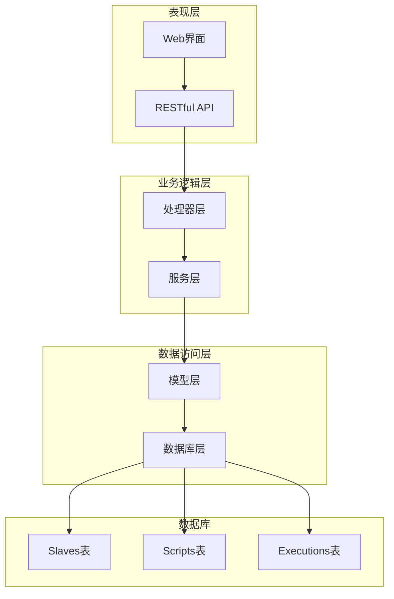
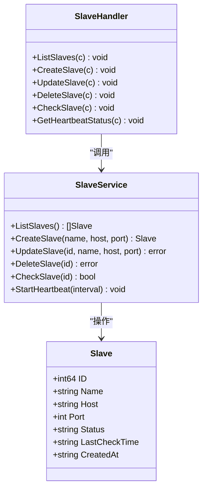
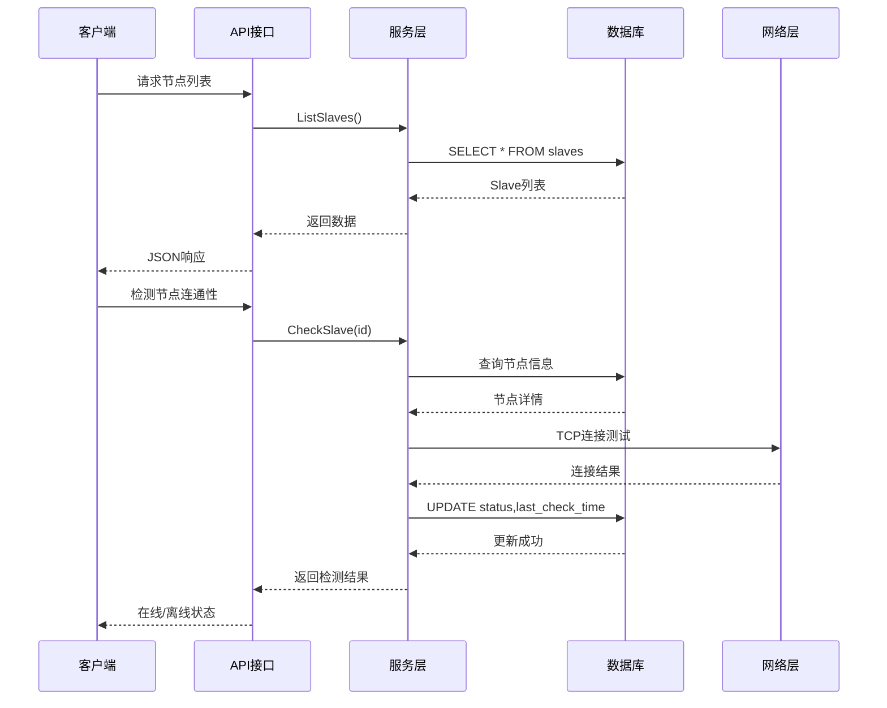
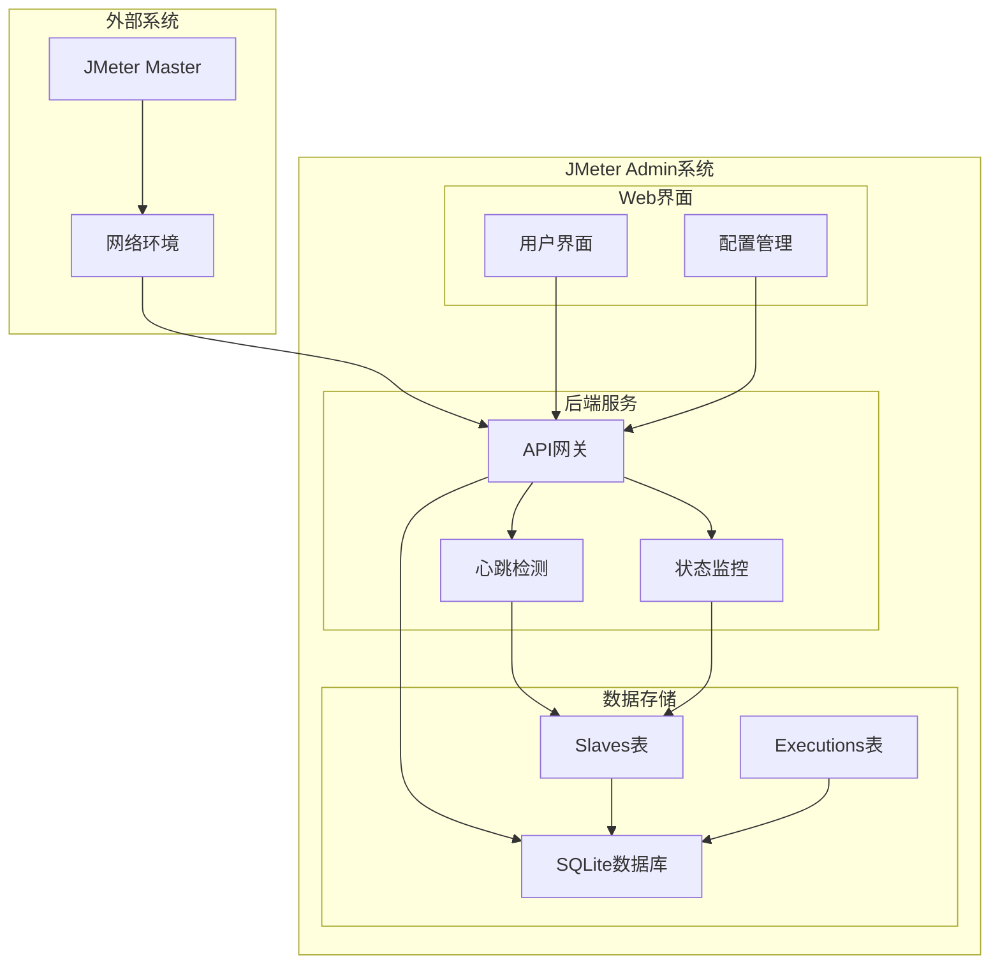
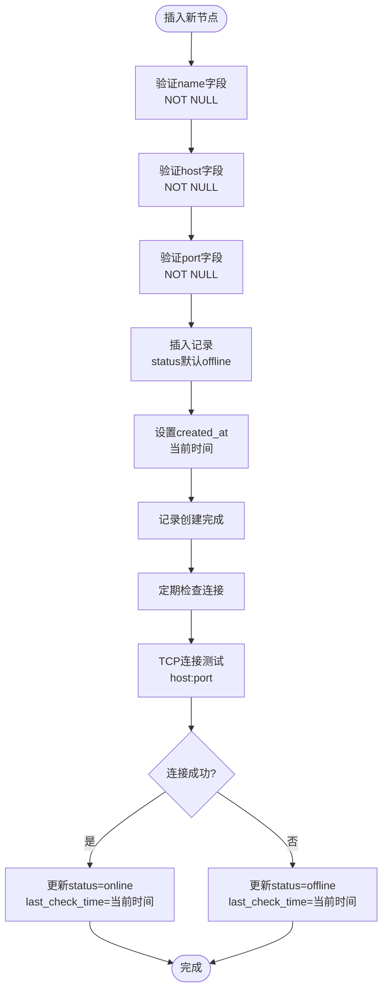
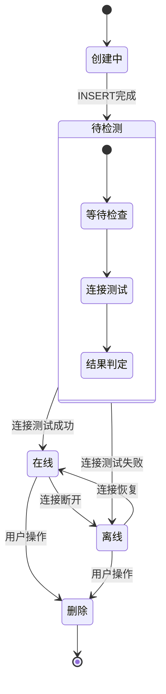
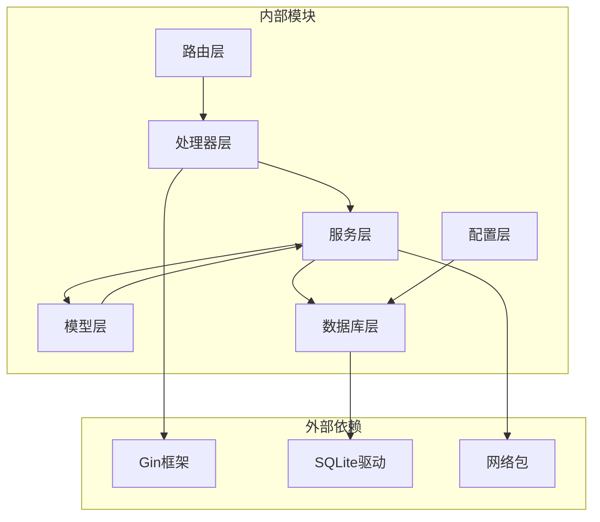
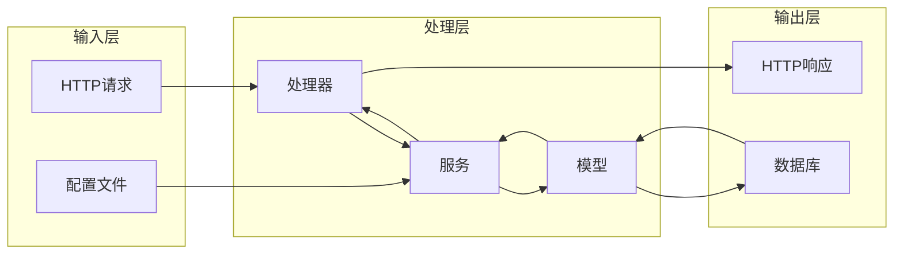

# Slaves表设计

<cite>
**本文档引用的文件**
- [internal/model/slave.go](file://internal/model/slave.go)
- [internal/database/db.go](file://internal/database/db.go)
- [internal/service/slave.go](file://internal/service/slave.go)
- [internal/handler/slave.go](file://internal/handler/slave.go)
- [config/config.go](file://config/config.go)
- [internal/router/router.go](file://internal/router/router.go)
</cite>

## 目录
1. [简介](#简介)
2. [项目结构](#项目结构)
3. [核心组件](#核心组件)
4. [架构概览](#架构概览)
5. [详细组件分析](#详细组件分析)
6. [依赖关系分析](#依赖关系分析)
7. [性能考虑](#性能考虑)
8. [故障排除指南](#故障排除指南)
9. [结论](#结论)

## 简介

Slaves表是JMeter Admin项目中用于管理JMeter从节点（Slave）的核心数据库表。该表设计用于存储和跟踪分布式测试环境中各个从节点的状态信息，包括节点的基本信息、网络连接状态以及健康检查历史。通过Slaves表，系统能够实现自动化的节点发现、状态监控和故障检测功能。

## 项目结构

JMeter Admin项目采用分层架构设计，Slaves表位于数据持久层，与业务逻辑层和服务层紧密协作：



**图表来源**
- [internal/handler/slave.go:1-236](file://internal/handler/slave.go#L1-L236)
- [internal/service/slave.go:1-220](file://internal/service/slave.go#L1-L220)
- [internal/database/db.go:36-124](file://internal/database/db.go#L36-L124)

**章节来源**
- [internal/router/router.go:14-112](file://internal/router/router.go#L14-L112)
- [config/config.go:10-41](file://config/config.go#L10-L41)

## 核心组件

### 数据模型定义

Slaves表的数据模型通过Go语言结构体进行定义，体现了清晰的字段映射关系：



**图表来源**
- [internal/model/slave.go:3-11](file://internal/model/slave.go#L3-L11)
- [internal/service/slave.go:15-220](file://internal/service/slave.go#L15-L220)
- [internal/handler/slave.go:16-236](file://internal/handler/slave.go#L16-L236)

### 数据库表结构

Slaves表采用SQLite数据库存储，具备以下核心字段：

| 字段名 | 数据类型 | 约束条件 | 描述 | 默认值 |
|--------|----------|----------|------|--------|
| id | INTEGER | PRIMARY KEY, AUTOINCREMENT | 主键标识符 | 自动递增 |
| name | TEXT | NOT NULL | 节点名称 | 无 |
| host | TEXT | NOT NULL | 主机地址 | 无 |
| port | INTEGER | NOT NULL | 端口号 | 无 |
| status | TEXT | DEFAULT 'offline' | 节点状态 | offline |
| created_at | DATETIME | 无 | 创建时间 | 无 |
| last_check_time | DATETIME | 无 | 最后检查时间 | NULL |

**章节来源**
- [internal/database/db.go:66-78](file://internal/database/db.go#L66-L78)
- [internal/model/slave.go:3-11](file://internal/model/slave.go#L3-L11)

## 架构概览

### 数据流架构



**图表来源**
- [internal/handler/slave.go:16-122](file://internal/handler/slave.go#L16-L122)
- [internal/service/slave.go:15-157](file://internal/service/slave.go#L15-L157)
- [internal/database/db.go:161-171](file://internal/database/db.go#L161-L171)

### 系统集成架构



**图表来源**
- [internal/router/router.go:38-47](file://internal/router/router.go#L38-L47)
- [config/config.go:31-33](file://config/config.go#L31-L33)
- [internal/service/slave.go:159-220](file://internal/service/slave.go#L159-L220)

## 详细组件分析

### 数据库表设计详解

#### 核心字段设计

**主键字段 (id)**
- 类型：INTEGER
- 约束：PRIMARY KEY, AUTOINCREMENT
- 设计目的：提供唯一标识符，支持自动递增
- 性能考虑：作为主键，天然建立聚簇索引

**节点标识字段 (name)**
- 类型：TEXT
- 约束：NOT NULL
- 设计目的：提供人类可读的节点名称
- 业务意义：便于用户识别和管理不同的从节点

**网络连接字段 (host, port)**
- 类型：TEXT, INTEGER
- 约束：NOT NULL
- 设计目的：存储从节点的网络连接信息
- 业务意义：用于建立TCP连接进行健康检查

**状态管理字段 (status)**
- 类型：TEXT
- 约束：DEFAULT 'offline'
- 设计目的：跟踪从节点的当前状态
- 状态枚举：online, offline
- 设计策略：默认offline确保新节点初始状态安全

**时间戳字段 (created_at, last_check_time)**
- 类型：DATETIME
- 约定格式："YYYY-MM-DD HH:MM:SS"
- 设计目的：记录节点创建时间和最后检查时间
- 业务价值：支持审计追踪和状态监控

#### 约束和完整性



**图表来源**
- [internal/service/slave.go:43-69](file://internal/service/slave.go#L43-L69)
- [internal/service/slave.go:112-157](file://internal/service/slave.go#L112-L157)

**章节来源**
- [internal/database/db.go:66-78](file://internal/database/db.go#L66-L78)
- [internal/service/slave.go:43-69](file://internal/service/slave.go#L43-L69)

### 业务逻辑实现

#### 节点生命周期管理



**图表来源**
- [internal/service/slave.go:15-41](file://internal/service/slave.go#L15-L41)
- [internal/service/slave.go:112-157](file://internal/service/slave.go#L112-L157)

#### 健康检查机制

系统实现了多层次的健康检查机制：

**手动检查流程**
1. 接收检查请求
2. 查询节点详细信息
3. 建立TCP连接测试
4. 更新节点状态和检查时间
5. 返回检查结果

**自动心跳检测**
1. 定时器触发检查
2. 并发处理多个节点
3. 控制最大并发数量
4. 异步更新节点状态

**章节来源**
- [internal/service/slave.go:112-157](file://internal/service/slave.go#L112-L157)
- [internal/service/slave.go:159-220](file://internal/service/slave.go#L159-L220)

### API接口设计

#### RESTful接口规范

| 方法 | 路径 | 功能 | 请求参数 | 响应内容 |
|------|------|------|----------|----------|
| GET | /api/slaves | 获取节点列表 | 无 | Slave数组 |
| POST | /api/slaves | 创建新节点 | CreateSlaveRequest | 新Slave对象 |
| PUT | /api/slaves/:id | 更新节点信息 | UpdateSlaveRequest | 成功/错误 |
| DELETE | /api/slaves/:id | 删除节点 | 路径参数id | 成功/错误 |
| POST | /api/slaves/:id/check | 检测节点连通性 | 路径参数id | {online: bool, status: string} |
| GET | /api/slaves/heartbeat-status | 获取心跳状态 | 无 | 心跳状态列表 |

**章节来源**
- [internal/router/router.go:38-47](file://internal/router/router.go#L38-L47)
- [internal/handler/slave.go:16-122](file://internal/handler/slave.go#L16-L122)

### 配置管理

#### 系统配置参数

| 配置项 | 类型 | 默认值 | 描述 |
|--------|------|--------|------|
| server.port | int | 8080 | HTTP服务监听端口 |
| slave.heartbeat_interval | int | 30 | 心跳检测间隔（秒） |
| jmeter.master_hostname | string | 空字符串 | RMI回调IP地址 |
| dirs.data | string | ./data | 数据文件目录 |
| dirs.uploads | string | ./uploads | 上传文件目录 |
| dirs.results | string | ./results | 测试结果目录 |

**章节来源**
- [config/config.go:18-39](file://config/config.go#L18-L39)
- [config/config.go:55-57](file://config/config.go#L55-L57)

## 依赖关系分析

### 组件依赖图



**图表来源**
- [internal/handler/slave.go:3-14](file://internal/handler/slave.go#L3-L14)
- [internal/service/slave.go:3-13](file://internal/service/slave.go#L3-L13)
- [internal/database/db.go:3-11](file://internal/database/db.go#L3-L11)

### 数据流依赖



**图表来源**
- [internal/handler/slave.go:16-122](file://internal/handler/slave.go#L16-L122)
- [internal/service/slave.go:15-220](file://internal/service/slave.go#L15-L220)

**章节来源**
- [internal/router/router.go:14-112](file://internal/router/router.go#L14-L112)
- [internal/database/db.go:15-34](file://internal/database/db.go#L15-L34)

## 性能考虑

### 数据库优化策略

**索引设计**
- 主键索引：自动为id字段创建
- 查询优化：为常用查询字段建立索引
- 性能平衡：避免过度索引影响写入性能

**连接池管理**
- 数据库连接复用
- 连接超时控制
- 并发连接限制

**查询优化**
- 使用参数化查询防止SQL注入
- 限制查询结果集大小
- 合理使用LIMIT子句

### 网络性能优化

**连接测试优化**
- TCP连接超时设置（3秒）
- 并发连接控制（最多10个并发）
- 连接复用减少资源消耗

**心跳检测优化**
- 可配置的心跳间隔
- 异步处理避免阻塞
- 错误重试机制

## 故障排除指南

### 常见问题诊断

**数据库连接问题**
- 检查数据库文件权限
- 验证数据库路径配置
- 确认SQLite驱动安装

**网络连接问题**
- 验证主机地址可达性
- 检查端口是否开放
- 确认防火墙设置

**状态同步问题**
- 检查心跳检测服务运行状态
- 验证数据库写入权限
- 查看日志文件定位错误

### 调试工具

**数据库调试**
```sql
-- 查看表结构
PRAGMA table_info(slaves);

-- 查看所有记录
SELECT * FROM slaves;

-- 查看最近的检查记录
SELECT name, host, port, status, last_check_time 
FROM slaves 
ORDER BY last_check_time DESC;
```

**系统监控**
- 查看应用日志
- 监控数据库连接数
- 检查网络连接状态

**章节来源**
- [internal/database/db.go:161-171](file://internal/database/db.go#L161-L171)
- [internal/service/slave.go:172-219](file://internal/service/slave.go#L172-L219)

## 结论

Slaves表作为JMeter Admin项目的核心数据结构，通过精心设计的字段约束和业务逻辑，实现了对分布式测试环境中从节点的全面管理。系统采用分层架构设计，确保了良好的可维护性和扩展性。

**主要设计亮点**：
1. **完整的生命周期管理**：从创建到删除的全链路支持
2. **智能状态监控**：自动心跳检测和手动检查相结合
3. **健壮的错误处理**：完善的异常捕获和错误反馈机制
4. **高性能设计**：并发控制和异步处理提升系统性能
5. **灵活的配置管理**：支持运行时参数调整

**未来改进方向**：
1. 增加更详细的节点状态信息
2. 实现节点分组和标签功能
3. 添加节点性能指标收集
4. 增强故障自动恢复能力

通过持续的优化和完善，Slaves表将为JMeter分布式测试管理提供更加稳定可靠的技术支撑。