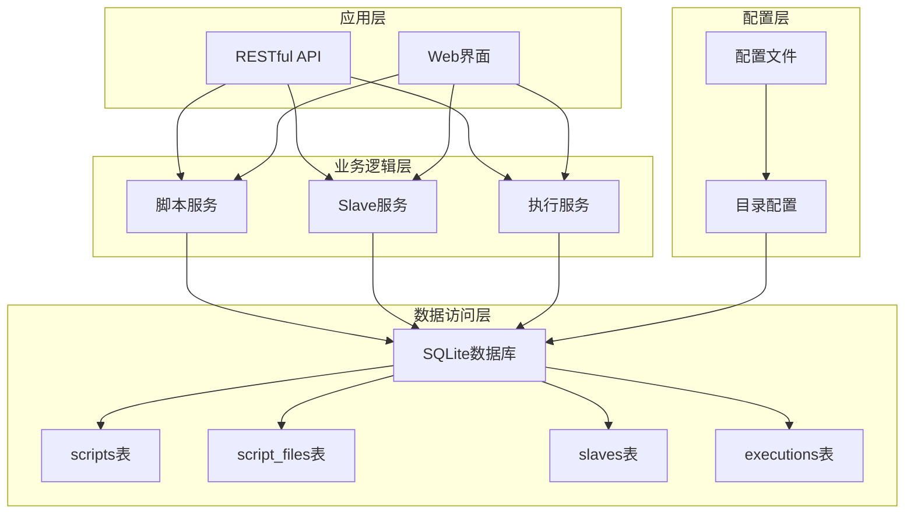
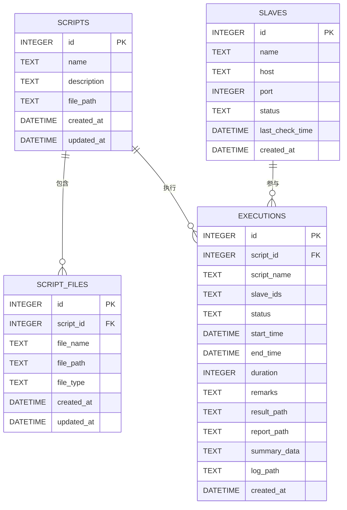
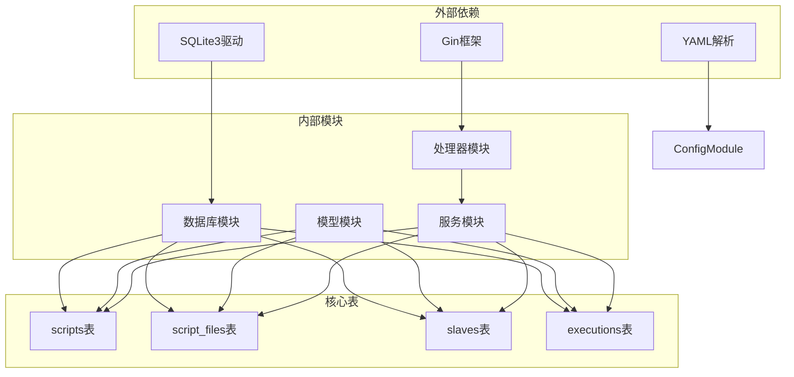
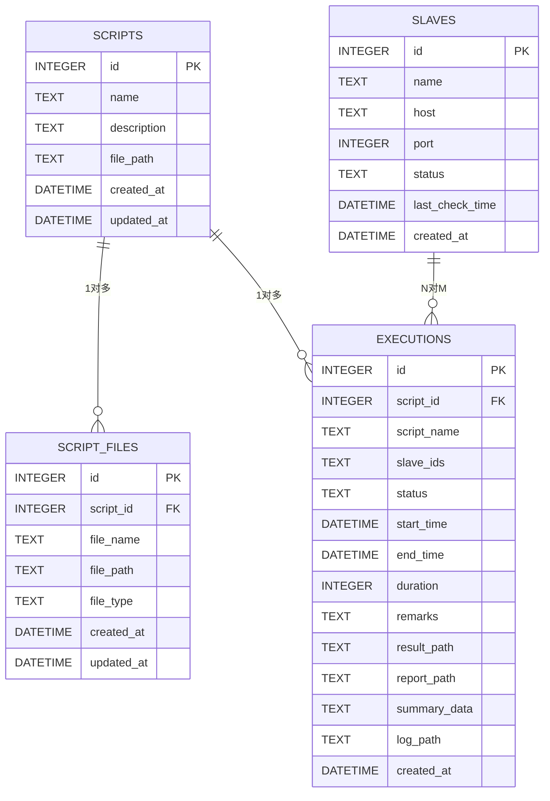
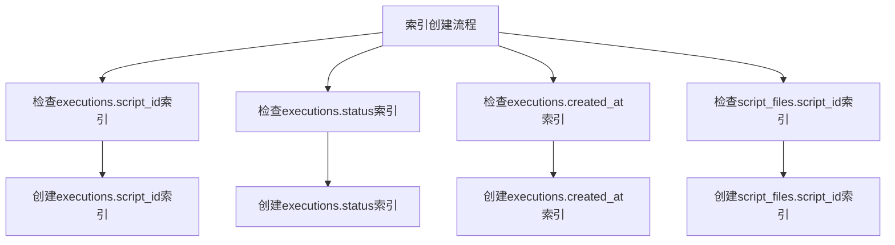
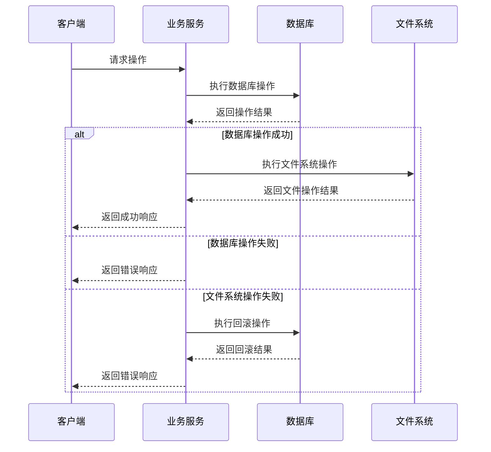

# 表结构设计

<cite>
**本文档引用的文件**
- [db.go](file://internal/database/db.go)
- [script.go](file://internal/model/script.go)
- [slave.go](file://internal/model/slave.go)
- [execution.go](file://internal/model/execution.go)
- [script.go](file://internal/service/script.go)
- [slave.go](file://internal/service/slave.go)
- [execution.go](file://internal/service/execution.go)
- [config.go](file://config/config.go)
- [config.yaml](file://config.yaml)
</cite>

## 目录
1. [简介](#简介)
2. [项目结构](#项目结构)
3. [核心组件](#核心组件)
4. [架构概览](#架构概览)
5. [详细组件分析](#详细组件分析)
6. [依赖分析](#依赖分析)
7. [性能考虑](#性能考虑)
8. [故障排除指南](#故障排除指南)
9. [结论](#结论)

## 简介
本文档详细说明了JMeter Admin项目的四个核心表结构设计，包括scripts表、script_files表、slaves表和executions表。这些表构成了整个JMeter自动化测试管理系统的数据基础，支持脚本管理、文件附件、Slave节点管理和执行记录等功能。

## 项目结构
JMeter Admin采用Go语言开发，采用分层架构设计，主要分为以下层次：
- 数据访问层：通过SQLite数据库进行数据持久化
- 业务逻辑层：提供完整的业务处理逻辑
- 接口层：提供RESTful API接口
- 配置层：支持运行时配置管理

**图表来源**
- [db.go:36-124](file://internal/database/db.go#L36-L124)
- [script.go:18-83](file://internal/service/script.go#L18-L83)
- [slave.go:15-41](file://internal/service/slave.go#L15-L41)
- [execution.go:504-594](file://internal/service/execution.go#L504-L594)

**章节来源**
- [db.go:15-34](file://internal/database/db.go#L15-L34)
- [config.go:10-41](file://config/config.go#L10-L41)
- [config.yaml:1-26](file://config.yaml#L1-L26)

## 核心组件

### 数据库初始化与表创建
系统使用SQLite作为数据存储引擎，通过统一的数据库初始化函数创建所有核心表。数据库文件位于配置指定的数据目录中。

### 表结构概述
四个核心表采用标准的关系型数据库设计，支持外键关联和级联删除，确保数据的一致性和完整性。

**章节来源**
- [db.go:36-124](file://internal/database/db.go#L36-L124)
- [config.go:35-39](file://config/config.go#L35-L39)
- [config.yaml:22-25](file://config.yaml#L22-L25)

## 架构概览

**图表来源**
- [db.go:38-98](file://internal/database/db.go#L38-L98)
- [script.go:3-22](file://internal/model/script.go#L3-L22)
- [slave.go:3-11](file://internal/model/slave.go#L3-L11)
- [execution.go:3-18](file://internal/model/execution.go#L3-L18)

## 详细组件分析

### scripts表（脚本基本信息表）

#### 字段定义
| 字段名 | 数据类型 | 约束条件 | 默认值 | 描述 |
|--------|----------|----------|--------|------|
| id | INTEGER | PRIMARY KEY, AUTOINCREMENT | 无 | 主键，自增ID |
| name | TEXT | NOT NULL | 无 | 脚本名称 |
| description | TEXT | NULL | 无 | 脚本描述 |
| file_path | TEXT | NOT NULL | 无 | 主JMX文件路径 |
| created_at | DATETIME | NULL | 无 | 创建时间 |
| updated_at | DATETIME | NULL | 无 | 更新时间 |

#### 设计特点
- **主键设计**：使用INTEGER类型的自增主键，符合SQLite最佳实践
- **约束设计**：关键字段设置NOT NULL约束，确保数据完整性
- **时间戳**：支持创建和更新时间追踪
- **文件路径**：直接存储主JMX文件的物理路径

#### 外键关系
- 与script_files表建立一对多关系
- 与executions表建立一对多关系

**章节来源**
- [db.go:38-49](file://internal/database/db.go#L38-L49)
- [script.go:3-12](file://internal/model/script.go#L3-L12)

### script_files表（脚本附件文件表）

#### 字段定义
| 字段名 | 数据类型 | 约束条件 | 默认值 | 描述 |
|--------|----------|----------|--------|------|
| id | INTEGER | PRIMARY KEY, AUTOINCREMENT | 无 | 主键，自增ID |
| script_id | INTEGER | NOT NULL, FK | 无 | 关联脚本ID |
| file_name | TEXT | NOT NULL | 无 | 文件名称 |
| file_path | TEXT | NOT NULL | 无 | 文件物理路径 |
| file_type | TEXT | NOT NULL | 无 | 文件类型（jmx/csv/jar/other） |
| created_at | DATETIME | NULL | 无 | 创建时间 |
| updated_at | DATETIME | NULL | 无 | 更新时间 |

#### 外键关系
- **外键约束**：script_id字段引用scripts表的id字段
- **级联删除**：设置ON DELETE CASCADE，当脚本被删除时自动删除关联文件

#### 文件类型管理
系统支持多种文件类型，通过file_type字段进行分类管理：
- jmx：JMeter测试脚本文件
- csv：数据文件
- jar：插件或依赖库
- json：配置文件
- txt：文本文件
- properties：配置属性文件
- xml：XML格式文件
- yaml/yml：YAML配置文件
- 其他：未知或特殊文件类型

**章节来源**
- [db.go:52-64](file://internal/database/db.go#L52-L64)
- [script.go:14-22](file://internal/model/script.go#L14-L22)
- [script.go:361-384](file://internal/service/script.go#L361-L384)

### slaves表（Slave节点信息表）

#### 字段定义
| 字段名 | 数据类型 | 约束条件 | 默认值 | 描述 |
|--------|----------|----------|--------|------|
| id | INTEGER | PRIMARY KEY, AUTOINCREMENT | 无 | 主键，自增ID |
| name | TEXT | NOT NULL | 无 | 节点名称 |
| host | TEXT | NOT NULL | 无 | 主机IP地址 |
| port | INTEGER | NOT NULL | 无 | 端口号 |
| status | TEXT | NULL | 'offline' | 节点状态（online/offline） |
| last_check_time | DATETIME | NULL | 无 | 最后检测时间 |
| created_at | DATETIME | NULL | 无 | 创建时间 |

#### 状态管理
- **默认状态**：新创建的Slave节点默认状态为'offline'
- **状态更新**：通过心跳检测机制自动更新节点状态
- **状态枚举**：支持'online'和'offline'两种状态

#### 心跳检测机制
系统提供定时心跳检测功能，通过TCP连接测试Slave节点的连通性，并自动更新节点状态和最后检测时间。

**章节来源**
- [db.go:66-78](file://internal/database/db.go#L66-L78)
- [slave.go:3-11](file://internal/model/slave.go#L3-L11)
- [slave.go:112-157](file://internal/service/slave.go#L112-L157)

### executions表（执行记录表）

#### 字段定义
| 字段名 | 数据类型 | 约束条件 | 默认值 | 描述 |
|--------|----------|----------|--------|------|
| id | INTEGER | PRIMARY KEY, AUTOINCREMENT | 无 | 主键，自增ID |
| script_id | INTEGER | NOT NULL, FK | 无 | 关联脚本ID |
| script_name | TEXT | NOT NULL | 无 | 脚本名称（冗余字段） |
| slave_ids | TEXT | NULL | 无 | Slave节点ID列表（JSON数组） |
| status | TEXT | NULL | 'running' | 执行状态 |
| start_time | DATETIME | NULL | 无 | 开始时间 |
| end_time | DATETIME | NULL | 无 | 结束时间 |
| duration | INTEGER | NULL | 0 | 执行时长（秒） |
| remarks | TEXT | NULL | 无 | 执行备注 |
| result_path | TEXT | NULL | 无 | JTL结果文件路径 |
| report_path | TEXT | NULL | 无 | 报告生成路径 |
| summary_data | TEXT | NULL | 无 | 执行摘要数据（JSON） |
| log_path | TEXT | NULL | 无 | 日志文件路径 |
| created_at | DATETIME | NULL | 无 | 创建时间 |

#### 执行状态管理
- **默认状态**：新创建的执行记录默认状态为'running'
- **状态转换**：执行完成后自动更新为'success'或'failed'
- **状态枚举**：支持running、success、failed、stopped四种状态

#### 冗余字段设计
- **script_name**：存储脚本名称的冗余字段，便于展示时不需关联查询
- **优化目的**：减少查询时的JOIN操作，提高列表展示性能

#### JSON数据存储
- **slave_ids**：以JSON数组形式存储参与执行的Slave节点ID
- **summary_data**：以JSON对象形式存储执行摘要统计信息

**章节来源**
- [db.go:80-98](file://internal/database/db.go#L80-L98)
- [execution.go:3-18](file://internal/model/execution.go#L3-L18)
- [execution.go:103-171](file://internal/service/execution.go#L103-L171)

## 依赖分析

**图表来源**
- [db.go:3-11](file://internal/database/db.go#L3-L11)
- [script.go:3-16](file://internal/service/script.go#L3-L16)
- [slave.go:3-13](file://internal/service/slave.go#L3-L13)
- [execution.go:3-27](file://internal/service/execution.go#L3-L27)

### 外键关系图

**图表来源**
- [db.go:60-98](file://internal/database/db.go#L60-L98)

**章节来源**
- [db.go:52-98](file://internal/database/db.go#L52-L98)

## 性能考虑

### 索引设计
系统为关键查询字段建立了适当的索引以优化查询性能：

**图表来源**
- [db.go:174-189](file://internal/database/db.go#L174-L189)

### 数据迁移策略
系统支持数据库结构的向后兼容性，通过迁移函数动态添加新字段：

- **executions表**：动态添加duration和remarks字段
- **script_files表**：动态添加updated_at字段  
- **slaves表**：动态添加last_check_time字段

### 存储优化
- **文件分离**：脚本文件存储在独立的文件系统中，数据库仅存储元数据
- **路径管理**：通过配置文件集中管理数据目录位置
- **缓存策略**：关键查询结果在内存中进行适当缓存

**章节来源**
- [db.go:126-171](file://internal/database/db.go#L126-L171)
- [config.go:35-39](file://config/config.go#L35-L39)
- [config.yaml:22-25](file://config.yaml#L22-L25)

## 故障排除指南

### 常见问题诊断

#### 数据库连接问题
- **症状**：应用启动时报数据库连接错误
- **原因**：SQLite驱动未正确安装或数据库文件权限不足
- **解决方案**：确认go-sqlite3驱动已安装，检查数据目录权限

#### 外键约束冲突
- **症状**：删除脚本时报外键约束错误
- **原因**：存在关联的脚本文件或执行记录
- **解决方案**：先删除关联的文件和执行记录，再删除脚本

#### 文件路径异常
- **症状**：脚本文件无法找到或访问失败
- **原因**：file_path字段存储的路径与实际文件路径不一致
- **解决方案**：检查文件系统权限和路径配置

#### 心跳检测失败
- **症状**：Slave节点状态始终为offline
- **原因**：网络连接问题或端口不可达
- **解决方案**：检查网络连通性和防火墙设置

### 错误处理机制

**图表来源**
- [script.go:179-227](file://internal/service/script.go#L179-L227)
- [script.go:386-432](file://internal/service/script.go#L386-L432)

**章节来源**
- [script.go:179-227](file://internal/service/script.go#L179-L227)
- [script.go:386-432](file://internal/service/script.go#L386-L432)
- [slave.go:93-110](file://internal/service/slave.go#L93-L110)
- [execution.go:483-502](file://internal/service/execution.go#L483-L502)

## 结论

JMeter Admin项目的表结构设计体现了良好的数据库规范化原则和实际业务需求的平衡：

### 设计优势
1. **清晰的实体关系**：四个核心表职责明确，关系清晰
2. **完整的生命周期管理**：支持从创建到销毁的完整数据生命周期
3. **性能优化考虑**：合理的索引设计和冗余字段优化
4. **扩展性良好**：支持动态字段添加和配置管理
5. **数据一致性**：通过外键约束和级联删除保证数据完整性

### 技术特色
- **SQLite轻量化**：适合中小型应用场景，部署简单
- **JSON数据存储**：灵活处理非结构化数据
- **文件系统分离**：优化大文件存储和访问
- **自动迁移机制**：支持数据库结构演进

### 改进建议
1. **索引优化**：可根据实际查询模式进一步优化索引策略
2. **数据压缩**：对于大量文本数据可考虑压缩存储
3. **备份策略**：建议实现定期数据库备份机制
4. **监控指标**：增加数据库性能监控和告警机制

该表结构设计为JMeter自动化测试管理提供了坚实的数据基础，既满足了当前功能需求，又具备良好的扩展性和维护性。