# 自动化部署

<cite>
**本文档引用的文件**
- [main.go](file://main.go)
- [config.go](file://config/config.go)
- [router.go](file://internal/router/router.go)
- [deploy.sh](file://deploy.sh)
- [Makefile](file://Makefile)
- [README.md](file://README.md)
- [config.yaml](file://config.yaml)
- [script.go](file://internal/handler/script.go)
- [slave.go](file://internal/handler/slave.go)
- [execution.go](file://internal/handler/execution.go)
- [execution_service.go](file://internal/service/execution.go)
- [db.go](file://internal/database/db.go)
- [script_model.go](file://internal/model/script.go)
- [slave_model.go](file://internal/model/slave.go)
- [execution_model.go](file://internal/model/execution.go)
- [agent_main.go](file://cmd/agent/main.go)
</cite>

## 目录
1. [简介](#简介)
2. [项目结构](#项目结构)
3. [核心组件](#核心组件)
4. [架构概览](#架构概览)
5. [详细组件分析](#详细组件分析)
6. [依赖分析](#依赖分析)
7. [性能考虑](#性能考虑)
8. [故障排除指南](#故障排除指南)
9. [结论](#结论)
10. [附录](#附录)

## 简介

JMeter Admin 是一个基于 Go (Gin) + Vue 3 + SQLite 技术栈的分布式 JMeter 压测管理平台。该项目采用单文件部署策略，前端资源嵌入后端二进制文件，编译后生成单个可执行文件，实现零依赖部署。

### 核心特性

- **JMX 脚本管理** - 支持上传、可视化树形编辑、XML 源码编辑双模式
- **脚本版本管理** - 自动保存编辑历史，SHA256 去重，支持版本预览和一键回滚
- **Slave 节点管理** - 自动心跳检测、一键连通性检查
- **Agent 节点服务** - 轻量级辅助服务，提供文件分发和系统监控能力
- **CSV 自动拆分分发** - 大文件流式拆分，按 Slave 数量均匀分发
- **分布式压测执行** - 支持单机模式与分布式模式
- **实时监控增强** - P95/P99 响应时间分位数、实时错误趋势
- **进程管理** - 进程组管理、僵尸进程自动清理、执行超时保护

## 项目结构

项目采用模块化的目录结构，主要包含以下核心部分：

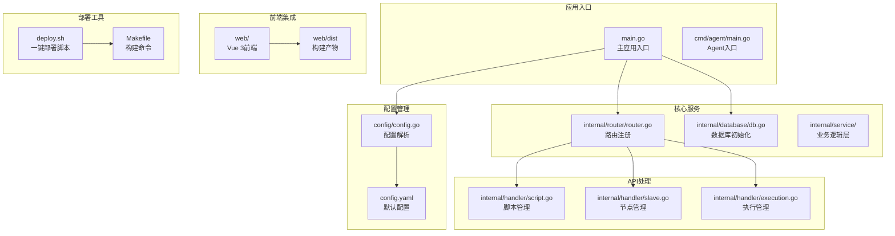

**图表来源**
- [main.go:1-83](file://main.go#L1-L83)
- [config.go:1-115](file://config/config.go#L1-L115)
- [router.go:1-134](file://internal/router/router.go#L1-L134)

**章节来源**
- [main.go:1-83](file://main.go#L1-L83)
- [config.go:1-115](file://config/config.go#L1-L115)
- [router.go:1-134](file://internal/router/router.go#L1-L134)

## 核心组件

### 应用入口组件

应用入口负责初始化整个系统，包括配置加载、目录创建、数据库初始化和路由设置。

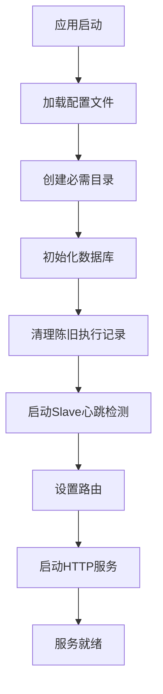

**图表来源**
- [main.go:28-66](file://main.go#L28-L66)

### 配置管理系统

配置系统采用 YAML 格式，支持默认值设置和动态保存。

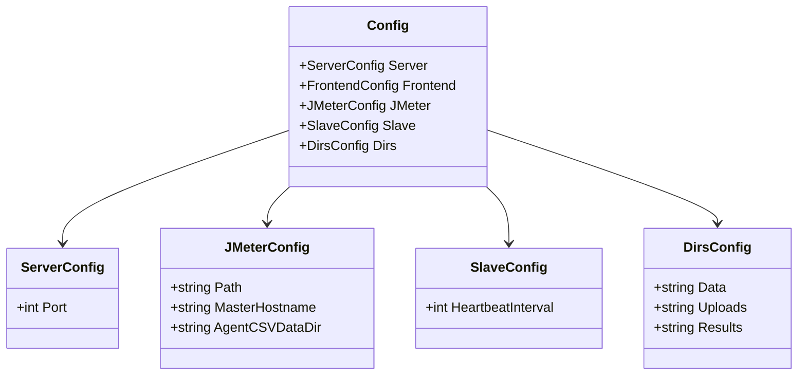

**图表来源**
- [config.go:10-42](file://config/config.go#L10-L42)

**章节来源**
- [main.go:19-66](file://main.go#L19-L66)
- [config.go:44-115](file://config/config.go#L44-L115)

## 架构概览

系统采用分层架构设计，包含表现层、业务逻辑层、数据访问层和外部服务集成层。

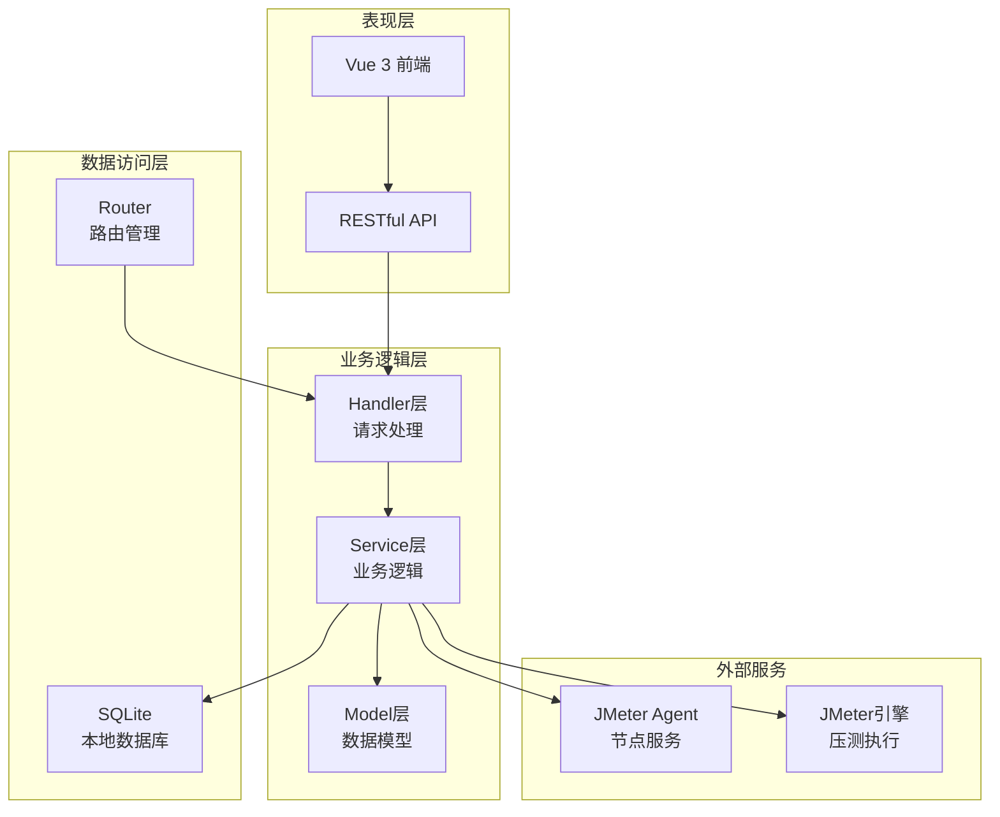

**图表来源**
- [router.go:14-117](file://internal/router/router.go#L14-L117)
- [execution_service.go:132-686](file://internal/service/execution.go#L132-L686)

## 详细组件分析

### 脚本管理组件

脚本管理组件提供完整的 JMX 脚本生命周期管理功能。

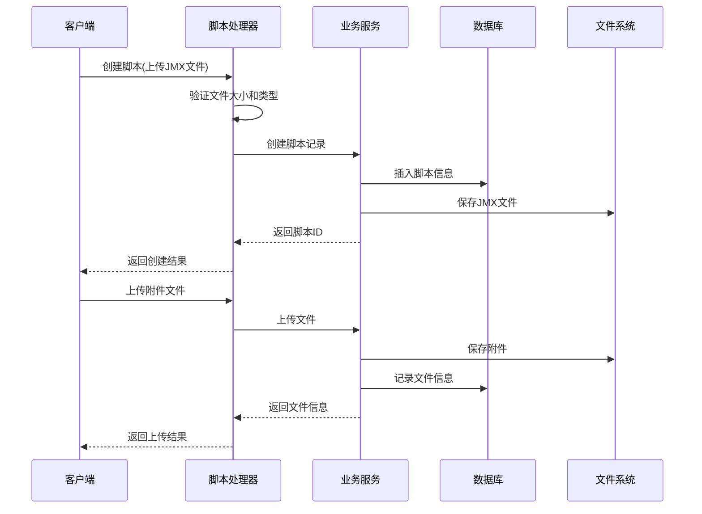

**图表来源**
- [script.go:52-108](file://internal/handler/script.go#L52-L108)
- [script.go:240-302](file://internal/handler/script.go#L240-L302)

#### 数据模型设计

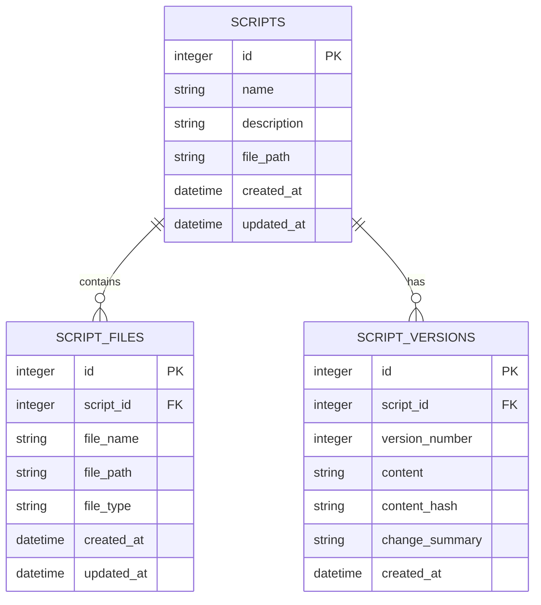

**图表来源**
- [script_model.go:3-32](file://internal/model/script.go#L3-L32)
- [db.go:37-122](file://internal/database/db.go#L37-L122)

**章节来源**
- [script.go:37-397](file://internal/handler/script.go#L37-L397)
- [script_model.go:1-33](file://internal/model/script.go#L1-L33)
- [db.go:36-129](file://internal/database/db.go#L36-L129)

### Slave 节点管理组件

Slave 节点管理组件提供节点的发现、配置和监控功能。

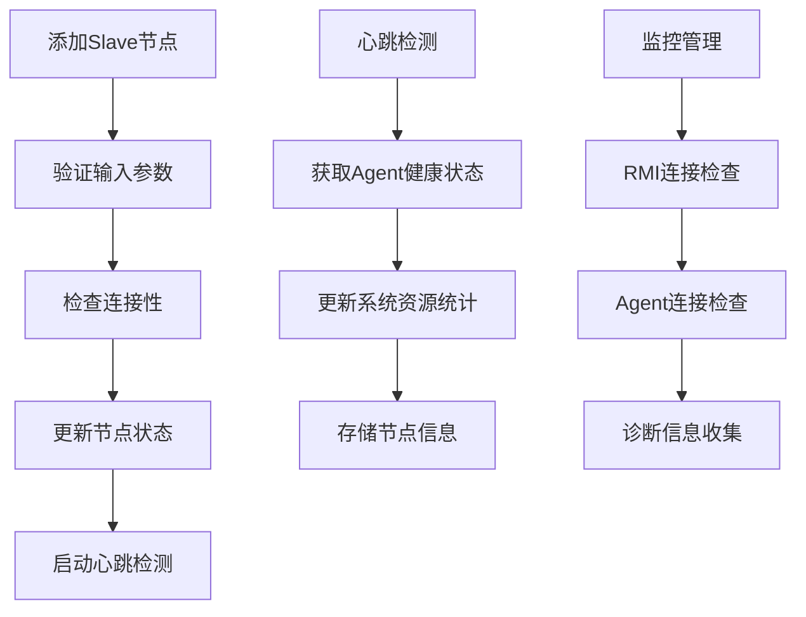

**图表来源**
- [slave.go:35-144](file://internal/handler/slave.go#L35-L144)
- [slave.go:222-267](file://internal/handler/slave.go#L222-L267)

#### 节点状态管理

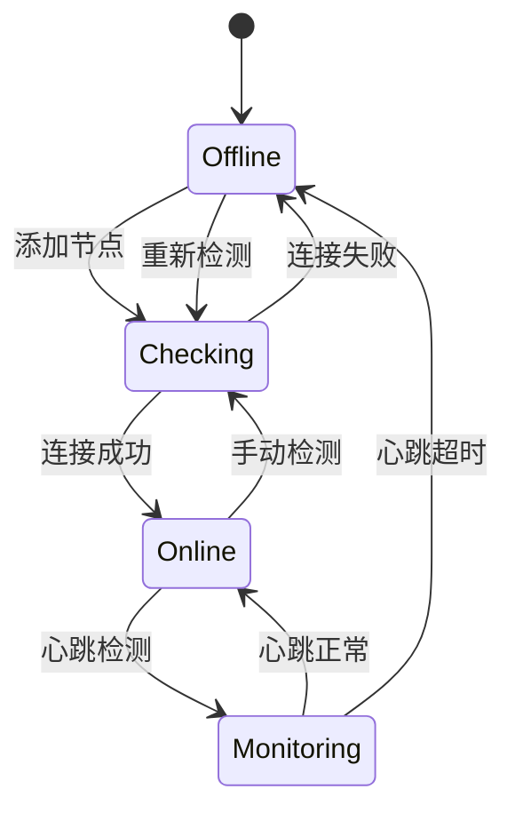

**图表来源**
- [slave.go:16-24](file://internal/handler/slave.go#L16-L24)

**章节来源**
- [slave.go:16-268](file://internal/handler/slave.go#L16-L268)
- [slave_model.go:32-47](file://internal/model/slave.go#L32-L47)

### 执行管理组件

执行管理组件是系统的核心，负责分布式压测的完整生命周期管理。

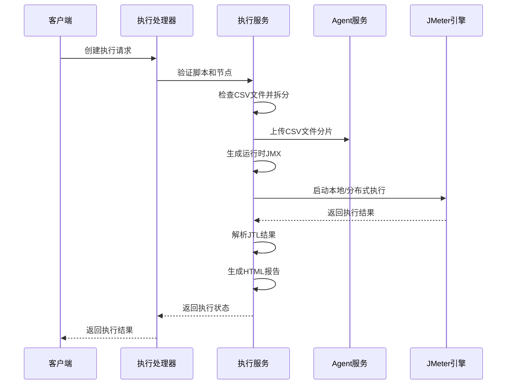

**图表来源**
- [execution.go:39-54](file://internal/handler/execution.go#L39-L54)
- [execution_service.go:132-686](file://internal/service/execution.go#L132-L686)

#### 执行流程控制

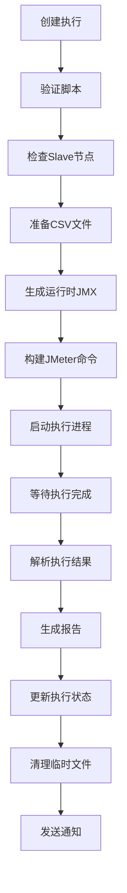

**图表来源**
- [execution_service.go:532-686](file://internal/service/execution.go#L532-L686)

**章节来源**
- [execution.go:39-787](file://internal/handler/execution.go#L39-L787)
- [execution_service.go:132-800](file://internal/service/execution.go#L132-L800)
- [execution_model.go:3-20](file://internal/model/execution.go#L3-L20)

### Agent 节点服务

Agent 是运行在每个 JMeter Slave 节点上的轻量级辅助服务。

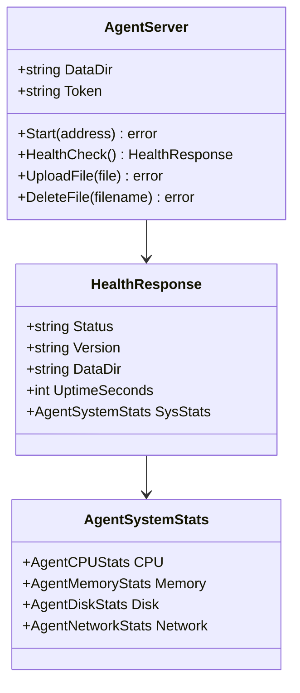

**图表来源**
- [agent_main.go:14-49](file://cmd/agent/main.go#L14-L49)

**章节来源**
- [agent_main.go:14-50](file://cmd/agent/main.go#L14-L50)

## 依赖分析

系统采用模块化依赖管理，主要依赖关系如下：

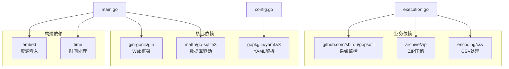

**图表来源**
- [go.mod:1-200](file://go.mod#L1-L200)

**章节来源**
- [go.mod:1-200](file://go.mod#L1-L200)

## 性能考虑

### 内存管理优化

系统实现了智能的 JVM 内存分配机制，根据系统可用内存动态调整 JMeter 堆大小。

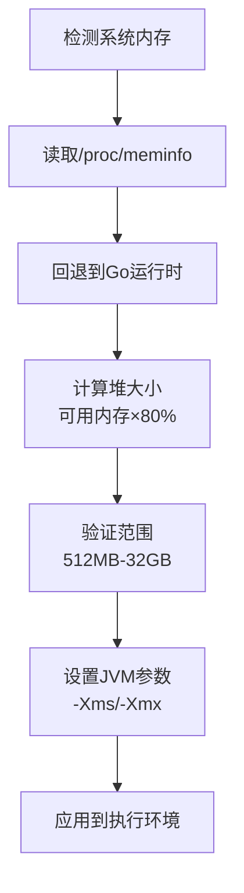

**图表来源**
- [execution_service.go:82-129](file://internal/service/execution.go#L82-L129)

### 并发执行优化

系统支持本地和分布式并发执行，通过进程组管理和超时控制确保稳定性。

**章节来源**
- [execution_service.go:52-80](file://internal/service/execution.go#L52-L80)
- [execution_service.go:532-686](file://internal/service/execution.go#L532-L686)

## 故障排除指南

### 常见部署问题

| 问题类型 | 症状 | 解决方案 |
|---------|------|----------|
| 编译错误 | CGO_ENABLED 相关错误 | 安装 gcc 和 build-essential |
| 前端构建慢 | npm install 速度慢 | 使用 npmmirror 镜像源 |
| Slave 连接失败 | RMI 连接超时 | 检查防火墙和 RMI 配置 |
| JMeter OOM | 内存不足 | 系统自动调整 JVM 参数 |

### 系统监控

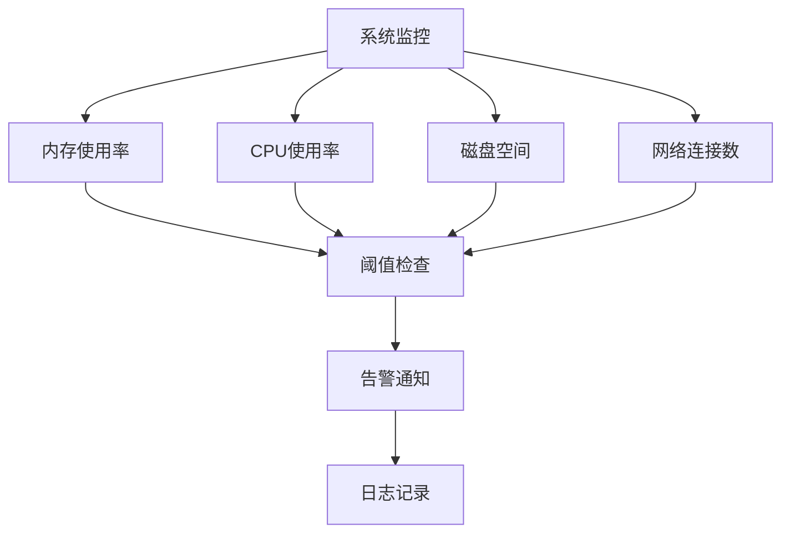

**图表来源**
- [slave_model.go:3-31](file://internal/model/slave.go#L3-L31)

**章节来源**
- [README.md:437-479](file://README.md#L437-L479)

## 结论

JMeter Admin 提供了一个完整、可靠的分布式 JMeter 压测管理解决方案。其设计特点包括：

1. **零依赖部署** - 通过资源嵌入实现单文件部署
2. **智能配置管理** - 支持动态配置和默认值设置
3. **完善的监控体系** - 包含节点监控、执行监控和系统监控
4. **灵活的执行模式** - 支持本地和分布式执行
5. **强大的扩展性** - 模块化设计便于功能扩展

该系统特别适合需要快速部署和管理 JMeter 压测环境的团队使用。

## 附录

### 部署命令参考

```bash
# 一键安装所有依赖
./deploy.sh install-deps

# 编译项目
./deploy.sh install

# 启动服务
./deploy.sh start

# 查看状态
./deploy.sh status

# 安装为系统服务
sudo ./deploy.sh install-service
```

### 开发环境配置

```bash
# 同时启动前后端
make dev

# 分别启动
make dev-backend    # 后端 :8080
make dev-frontend   # 前端 :3000
```

**章节来源**
- [README.md:36-81](file://README.md#L36-L81)
- [Makefile:30-41](file://Makefile#L30-L41)