# JMeter Agent系统

<cite>
**本文档引用的文件**
- [main.go](file://main.go)
- [cmd/agent/main.go](file://cmd/agent/main.go)
- [config/config.go](file://config/config.go)
- [internal/router/router.go](file://internal/router/router.go)
- [internal/agent/server.go](file://internal/agent/server.go)
- [internal/database/db.go](file://internal/database/db.go)
- [internal/model/script.go](file://internal/model/script.go)
- [internal/model/slave.go](file://internal/model/slave.go)
- [internal/model/execution.go](file://internal/model/execution.go)
- [internal/service/execution.go](file://internal/service/execution.go)
- [internal/service/slave.go](file://internal/service/slave.go)
- [internal/service/csv_split.go](file://internal/service/csv_split.go)
- [internal/handler/execution.go](file://internal/handler/execution.go)
- [internal/handler/slave.go](file://internal/handler/slave.go)
- [README.md](file://README.md)
</cite>

## 目录
1. [简介](#简介)
2. [项目结构](#项目结构)
3. [核心组件](#核心组件)
4. [架构概览](#架构概览)
5. [详细组件分析](#详细组件分析)
6. [依赖关系分析](#依赖关系分析)
7. [性能考虑](#性能考虑)
8. [故障排除指南](#故障排除指南)
9. [结论](#结论)

## 简介

JMeter Admin是一个基于Go语言开发的分布式JMeter压力测试管理系统，采用Go (Gin) + Vue 3 (Element Plus) + SQLite技术栈构建。该系统提供了完整的JMeter分布式压测管理功能，包括脚本管理、Slave节点管理、Agent节点服务、CSV自动拆分分发、分布式压测执行等核心功能。

系统的核心特点包括：
- 单文件部署的分布式压测管理平台
- 轻量级的Agent节点服务，提供文件分发和系统监控能力
- 自动化的CSV文件拆分和分发机制
- 实时监控和错误分析功能
- 支持本地模式和分布式模式的压测执行

## 项目结构

项目的整体架构采用分层设计，主要包含以下层次：

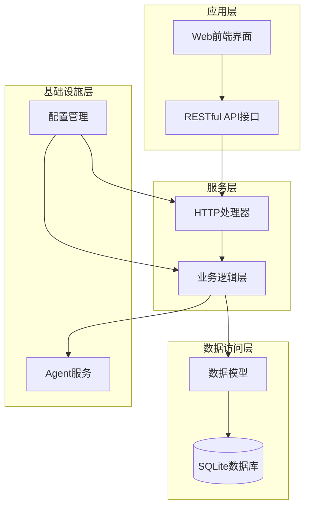

**图表来源**
- [main.go:28-66](file://main.go#L28-L66)
- [internal/router/router.go:14-117](file://internal/router/router.go#L14-L117)

### 核心模块组织

项目采用按功能模块划分的组织方式：

- **cmd/**: 应用程序入口点
  - `agent/`: Agent节点服务入口
  - `main.go`: 主应用程序入口

- **config/**: 配置管理模块
  - `config.go`: 配置结构定义和加载逻辑

- **internal/**: 核心业务逻辑
  - `agent/`: Agent服务实现
  - `database/`: 数据库初始化和管理
  - `handler/`: HTTP请求处理器
  - `model/`: 数据模型定义
  - `router/`: 路由配置
  - `service/`: 业务逻辑服务

- **web/**: 前端Vue.js应用
  - `src/`: 源代码
  - `public/`: 静态资源

**章节来源**
- [README.md:118-152](file://README.md#L118-L152)

## 核心组件

### 主应用程序组件

主应用程序负责系统的整体初始化和协调工作：

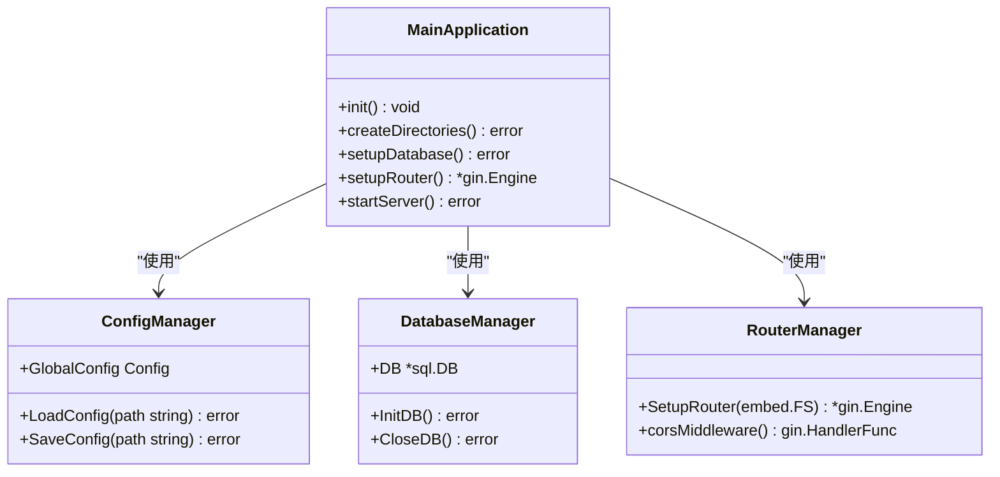

**图表来源**
- [main.go:28-66](file://main.go#L28-L66)
- [config/config.go:42-86](file://config/config.go#L42-L86)
- [internal/database/db.go:15-34](file://internal/database/db.go#L15-L34)

### Agent节点服务组件

Agent服务是运行在每个Slave节点上的轻量级辅助服务：

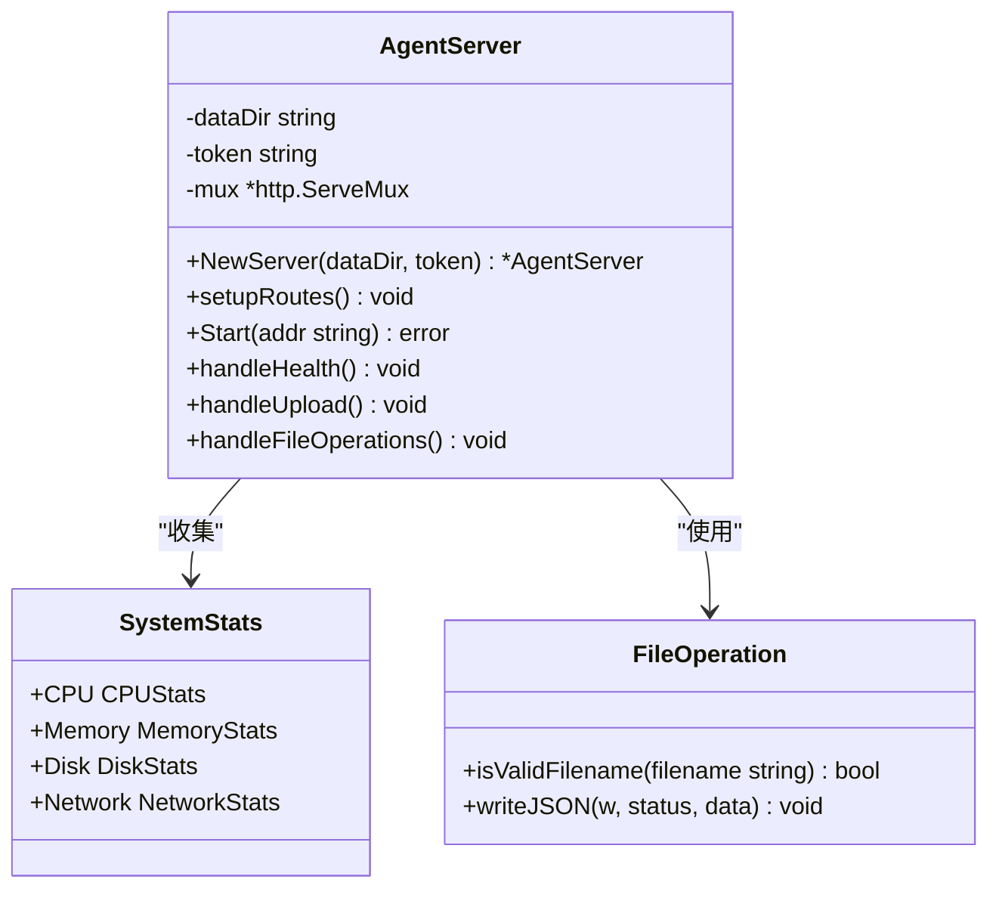

**图表来源**
- [internal/agent/server.go:89-113](file://internal/agent/server.go#L89-L113)
- [internal/agent/server.go:25-87](file://internal/agent/server.go#L25-L87)

**章节来源**
- [main.go:28-66](file://main.go#L28-L66)
- [cmd/agent/main.go:14-49](file://cmd/agent/main.go#L14-L49)

## 架构概览

系统采用典型的三层架构设计，结合微服务思想实现了分布式压测管理：

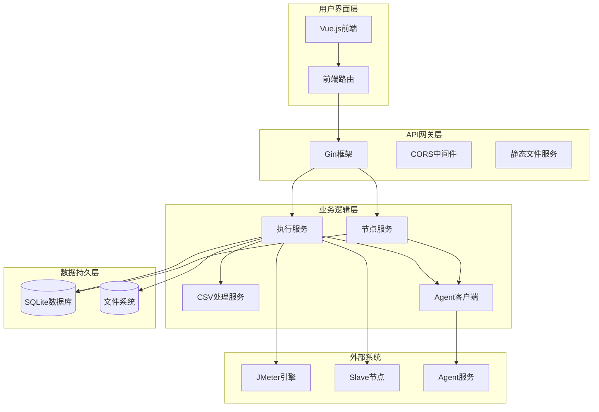

**图表来源**
- [internal/router/router.go:14-117](file://internal/router/router.go#L14-L117)
- [internal/service/execution.go:132-686](file://internal/service/execution.go#L132-L686)
- [internal/service/slave.go:448-524](file://internal/service/slave.go#L448-L524)

### 数据流分析

系统的核心数据流包括执行流程、监控流程和文件处理流程：

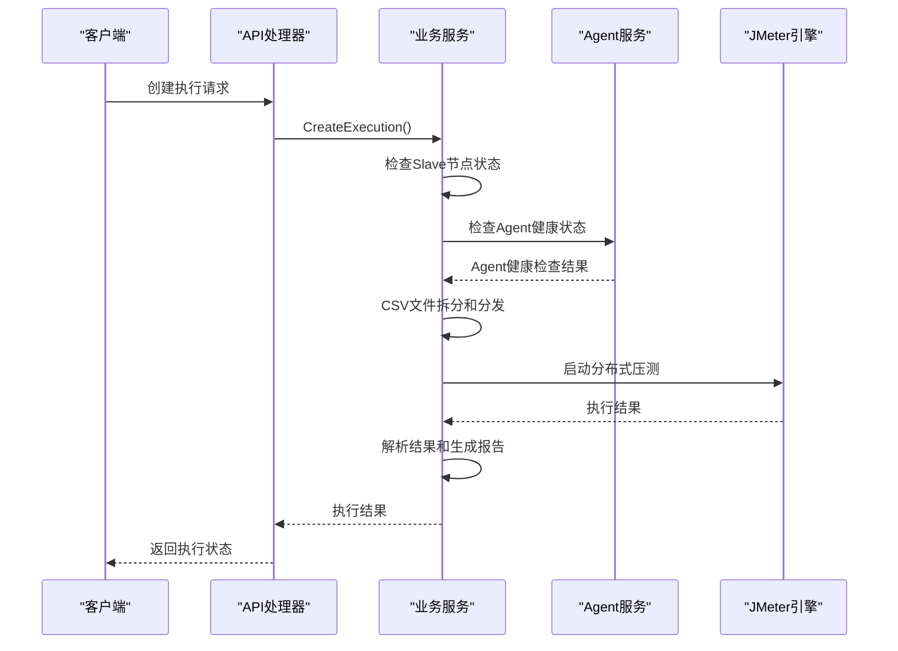

**图表来源**
- [internal/handler/execution.go:39-54](file://internal/handler/execution.go#L39-L54)
- [internal/service/execution.go:132-686](file://internal/service/execution.go#L132-L686)

**章节来源**
- [internal/service/execution.go:132-686](file://internal/service/execution.go#L132-L686)

## 详细组件分析

### 配置管理系统

配置管理模块提供了灵活的配置加载和保存机制：

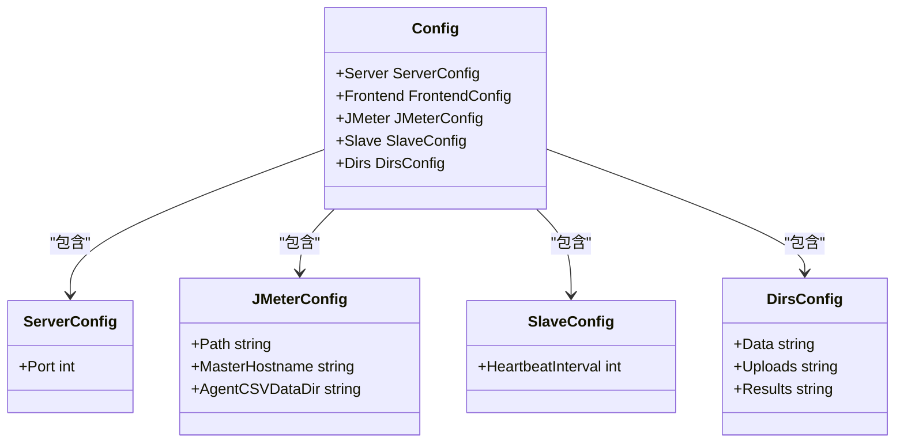

**图表来源**
- [config/config.go:10-42](file://config/config.go#L10-L42)

配置系统支持以下特性：
- YAML格式配置文件
- 默认值设置
- 运行时配置更新
- 配置验证和持久化

**章节来源**
- [config/config.go:42-115](file://config/config.go#L42-L115)

### 数据库管理系统

数据库模块负责SQLite数据库的初始化和表结构管理：

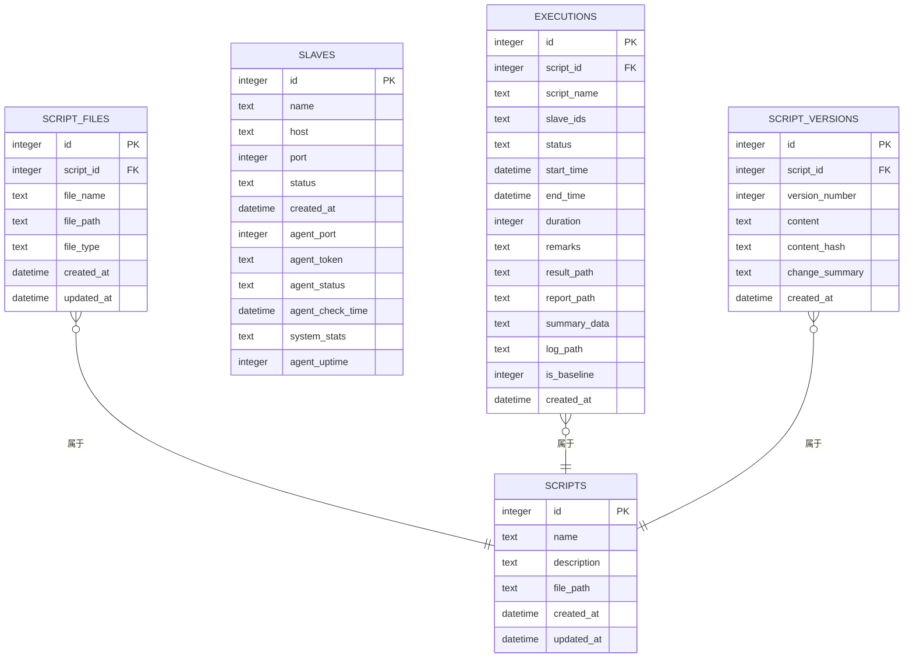

**图表来源**
- [internal/database/db.go:37-128](file://internal/database/db.go#L37-L128)
- [internal/database/db.go:244-260](file://internal/database/db.go#L244-L260)

数据库设计特点：
- 支持脚本版本管理
- 完整的执行记录跟踪
- Slave节点状态监控
- 索引优化查询性能

**章节来源**
- [internal/database/db.go:15-287](file://internal/database/db.go#L15-L287)

### 执行管理系统

执行管理模块是系统的核心业务逻辑，负责分布式压测的完整生命周期管理：

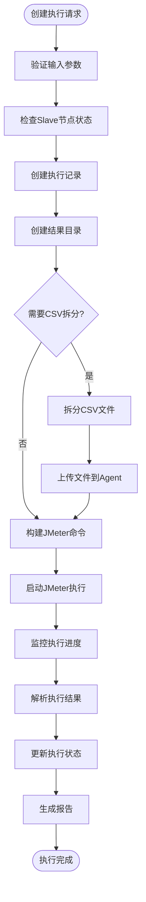

**图表来源**
- [internal/service/execution.go:132-686](file://internal/service/execution.go#L132-L686)

执行管理的关键特性：
- 支持本地和分布式模式
- 自动CSV文件拆分和分发
- 实时日志流和监控指标
- 执行超时保护机制
- 错误详情捕获和分析

**章节来源**
- [internal/service/execution.go:132-686](file://internal/service/execution.go#L132-L686)

### Slave节点管理

Slave节点管理模块负责分布式节点的发现、监控和维护：

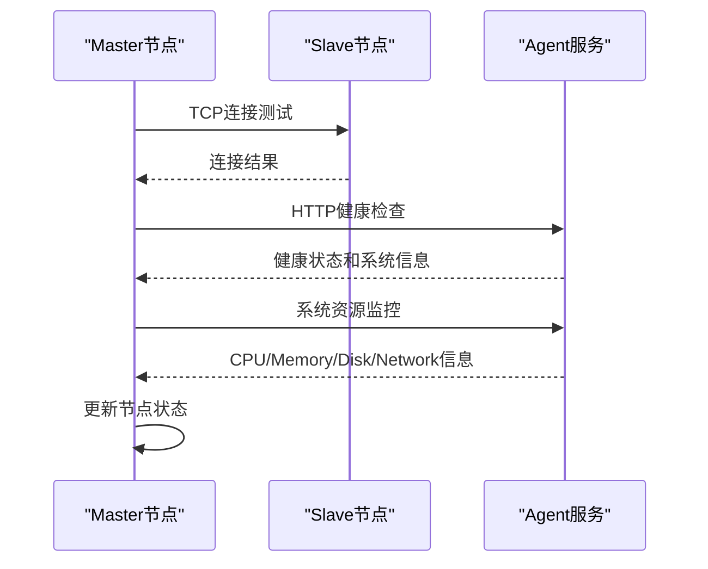

**图表来源**
- [internal/service/slave.go:295-446](file://internal/service/slave.go#L295-L446)

节点管理功能包括：
- 自动心跳检测
- 连通性诊断
- 系统资源监控
- 故障自动恢复

**章节来源**
- [internal/service/slave.go:448-524](file://internal/service/slave.go#L448-L524)

### Agent文件服务

Agent文件服务提供CSV文件的远程分发和清理功能：

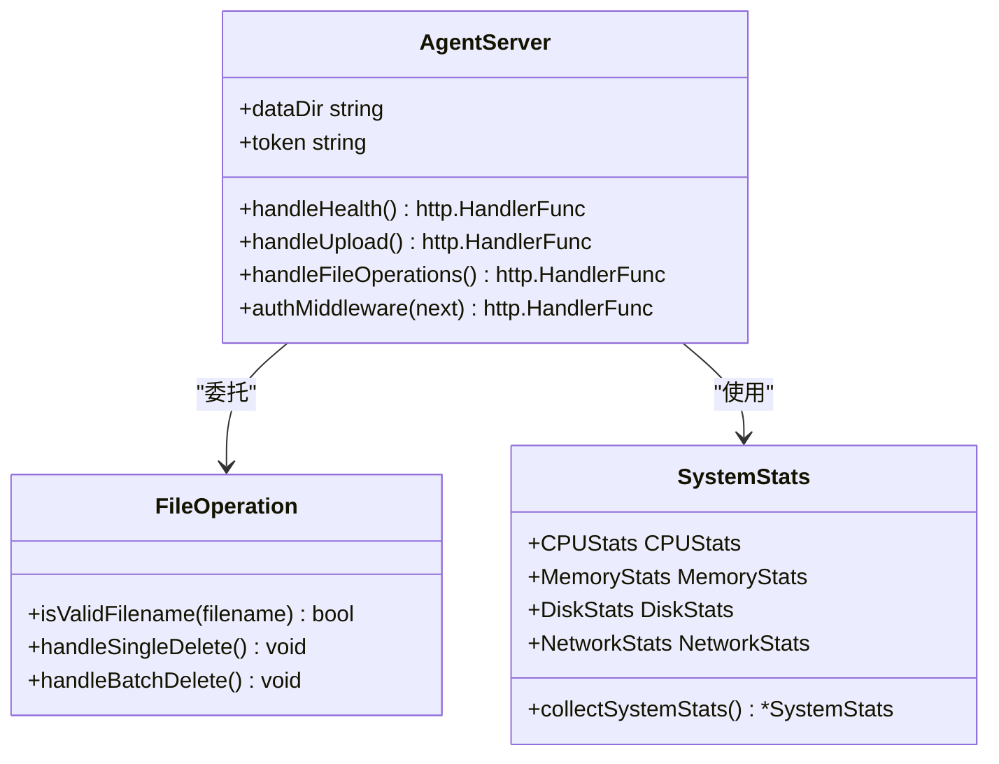

**图表来源**
- [internal/agent/server.go:89-127](file://internal/agent/server.go#L89-L127)

Agent服务特性：
- 文件上传和删除
- 系统资源监控
- 鉴权保护
- 健康检查

**章节来源**
- [internal/agent/server.go:105-326](file://internal/agent/server.go#L105-L326)

## 依赖关系分析

系统采用模块化设计，各组件之间的依赖关系清晰明确：

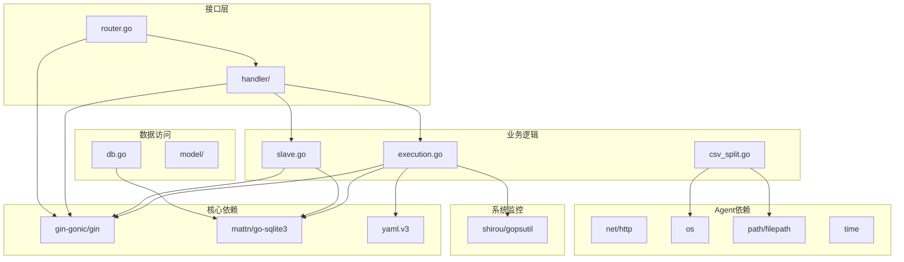

**图表来源**
- [go.mod:1-20](file://go.mod#L1-L20)
- [internal/service/execution.go:3-31](file://internal/service/execution.go#L3-L31)

### 外部依赖管理

系统对外部依赖的管理策略：
- 使用Go modules进行依赖管理
- 最小化第三方库依赖
- 专注于核心功能实现
- 保持代码简洁和可维护性

**章节来源**
- [go.mod:1-20](file://go.mod#L1-L20)

## 性能考虑

系统在设计时充分考虑了性能优化：

### 内存管理
- JVM堆内存动态计算，基于系统可用内存的80%
- 进程组管理和僵尸进程清理
- 文件句柄和连接池优化

### 并发处理
- Slave节点心跳检测使用goroutine并发
- CSV文件处理采用流式读取
- 日志文件使用缓冲区优化I/O

### 存储优化
- SQLite数据库索引优化查询性能
- 文件系统直接访问减少中间层
- 执行结果压缩和清理机制

## 故障排除指南

### 常见问题诊断

**Agent连接问题**
- 检查Agent服务是否启动
- 验证端口和防火墙设置
- 确认Token配置正确

**JMeter执行失败**
- 检查JMeter路径配置
- 验证Slave节点状态
- 查看执行日志获取详细错误信息

**CSV文件处理异常**
- 确认CSV文件格式正确
- 检查磁盘空间充足
- 验证文件权限设置

### 日志分析

系统提供了多层次的日志记录：
- 执行过程日志
- 错误详情日志
- 系统资源监控日志
- Agent健康检查日志

**章节来源**
- [internal/service/execution.go:559-668](file://internal/service/execution.go#L559-L668)

## 结论

JMeter Agent系统是一个设计精良的分布式压测管理平台，具有以下优势：

**技术优势**
- 采用现代化的技术栈和架构设计
- 模块化设计便于维护和扩展
- 完善的错误处理和故障恢复机制

**功能特性**
- 全面的分布式压测管理功能
- 实时监控和分析能力
- 用户友好的Web界面

**部署便利性**
- 单文件部署支持
- 跨平台兼容性
- 简化的配置管理

该系统为JMeter分布式压测提供了完整的解决方案，适合中小型团队和企业级应用场景。通过持续的功能扩展和性能优化，可以满足不断增长的压测需求。