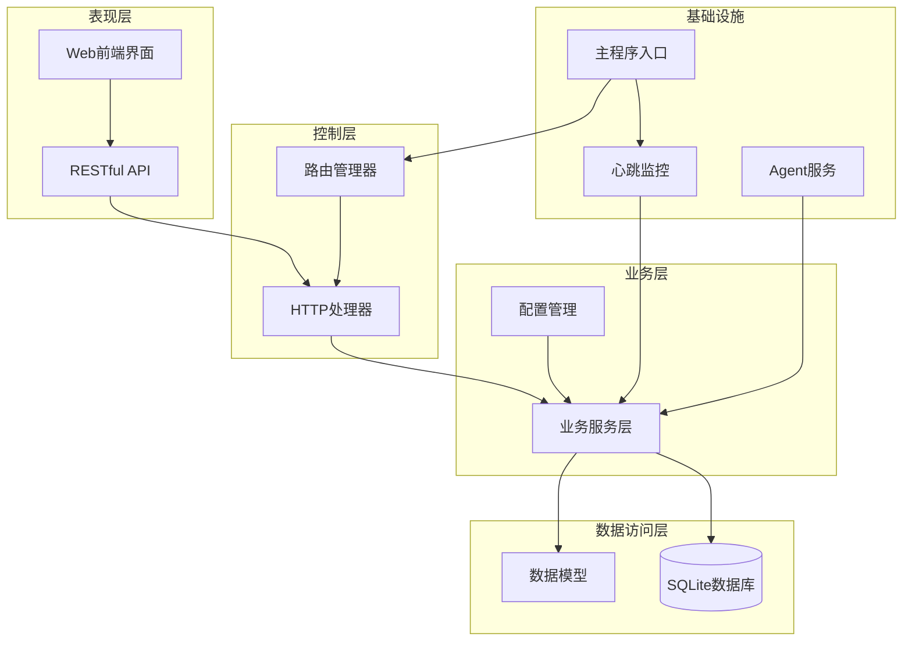
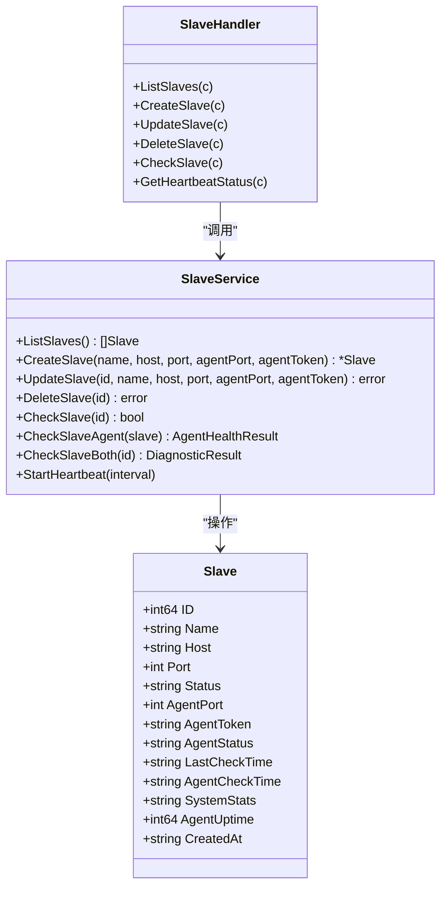
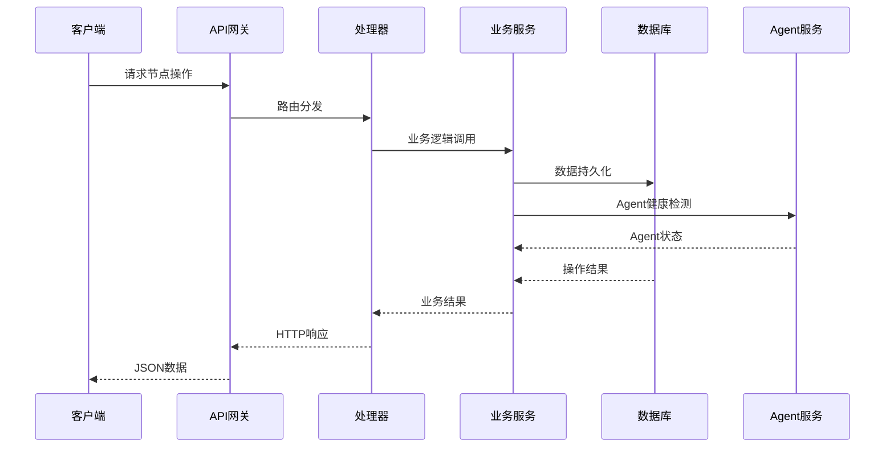
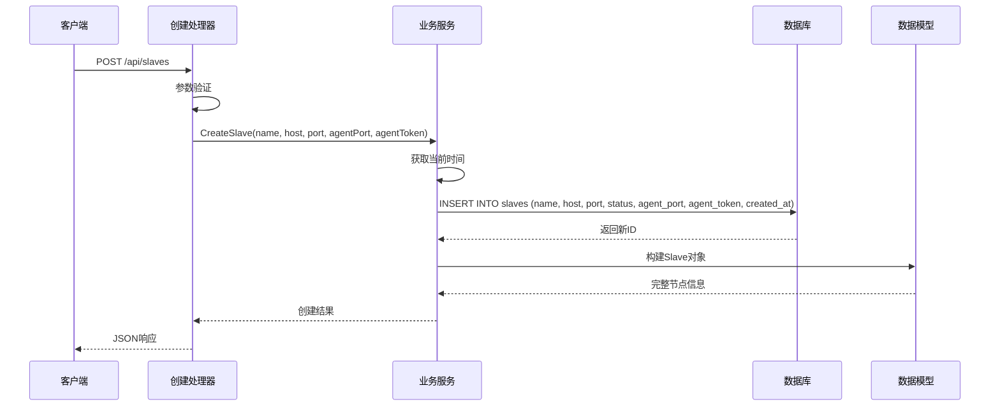
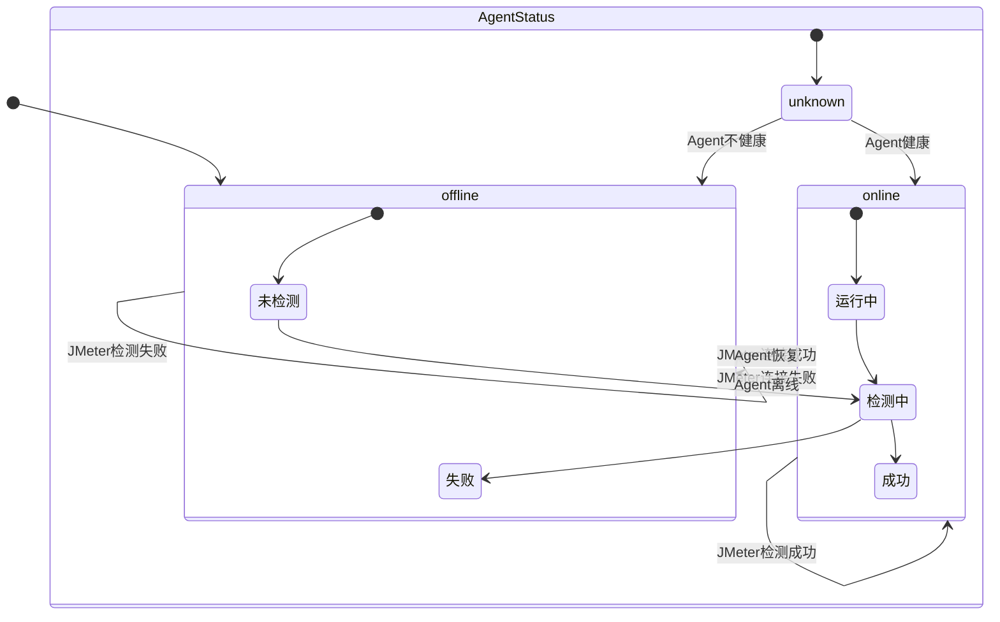
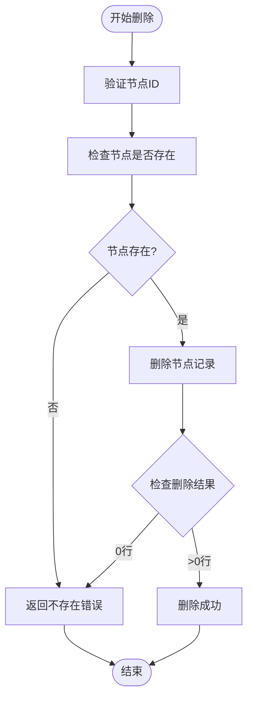
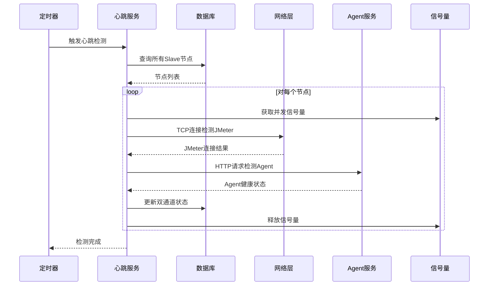
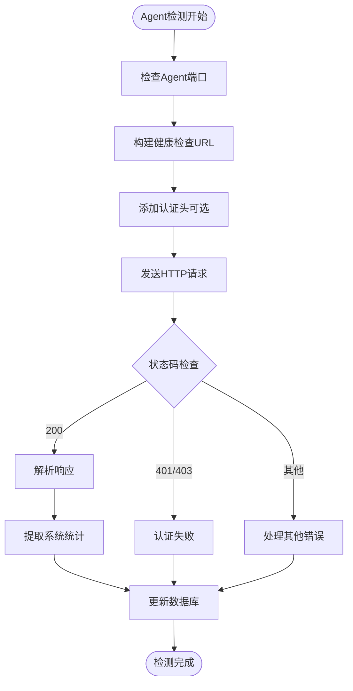
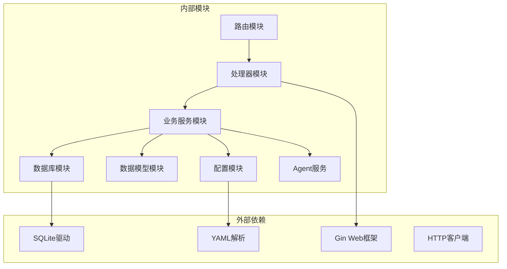

# Slave节点生命周期管理

<cite>
**本文档引用的文件**
- [internal/model/slave.go](file://internal/model/slave.go)
- [internal/service/slave.go](file://internal/service/slave.go)
- [internal/handler/slave.go](file://internal/handler/slave.go)
- [internal/router/router.go](file://internal/router/router.go)
- [internal/database/db.go](file://internal/database/db.go)
- [config/config.go](file://config/config.go)
- [main.go](file://main.go)
- [web/src/views/SlaveManage.vue](file://web/src/views/SlaveManage.vue)
- [web/src/api/slave.js](file://web/src/api/slave.js)
</cite>

## 更新摘要
**变更内容**
- 新增Agent健康状态管理功能，区分JMeter连接状态和Agent健康状态
- 数据库表结构升级，新增agent_status、agent_port、agent_token等字段
- 增强节点诊断功能，支持双通道检测（JMeter RMI + Agent HTTP）
- 前端界面优化，增加Agent状态显示和资源监控面板

## 目录
1. [简介](#简介)
2. [项目结构](#项目结构)
3. [核心组件](#核心组件)
4. [架构概览](#架构概览)
5. [详细组件分析](#详细组件分析)
6. [依赖关系分析](#依赖关系分析)
7. [性能考虑](#性能考虑)
8. [故障排除指南](#故障排除指南)
9. [结论](#结论)

## 简介

JMeter Admin 是一个基于 Go 语言开发的分布式 JMeter 测试管理平台，专门用于管理 Slave 节点的生命周期。该系统提供了完整的 Slave 节点管理功能，包括节点的创建、更新、删除、状态检测和心跳监控等核心功能。

**更新** 系统现已支持双通道节点状态管理：JMeter RMI连接状态（status字段）和Agent健康状态（agent_status字段），提供更精确的节点健康监测能力。

Slave 节点生命周期管理是整个系统的核心功能之一，它确保了分布式测试环境中各个节点的稳定运行和有效管理。本文档将深入分析 Slave 节点从创建到删除的完整生命周期，详细解释每个阶段的实现原理和业务逻辑。

## 项目结构

JMeter Admin 采用典型的分层架构设计，主要分为以下层次：

**图表来源**
- [main.go:28-66](file://main.go#L28-L66)
- [internal/router/router.go:14-112](file://internal/router/router.go#L14-L112)

**章节来源**
- [main.go:19-66](file://main.go#L19-L66)
- [internal/router/router.go:14-112](file://internal/router/router.go#L14-L112)

## 核心组件

### 数据模型设计

**更新** Slave 节点的数据模型现在包含双通道状态管理能力：

**图表来源**
- [internal/model/slave.go:32-46](file://internal/model/slave.go#L32-L46)
- [internal/service/slave.go:22-542](file://internal/service/slave.go#L22-L542)
- [internal/handler/slave.go:16-268](file://internal/handler/slave.go#L16-L268)

### 数据库表结构

**更新** 数据库表结构已升级以支持双通道状态管理：

| 字段名 | 类型 | 约束 | 描述 |
|--------|------|------|------|
| id | INTEGER | PRIMARY KEY AUTOINCREMENT | 节点唯一标识符 |
| name | TEXT | NOT NULL | 节点名称 |
| host | TEXT | NOT NULL | 节点主机地址 |
| port | INTEGER | NOT NULL | 节点端口号 |
| status | TEXT | DEFAULT 'offline' | JMeter连接状态（online/offline） |
| agent_port | INTEGER | DEFAULT 8089 | Agent服务端口 |
| agent_token | TEXT | DEFAULT '' | Agent认证token |
| agent_status | TEXT | DEFAULT 'offline' | Agent健康状态（online/offline/unknown） |
| last_check_time | DATETIME |  | JMeter最后检测时间 |
| agent_check_time | DATETIME |  | Agent最后检测时间 |
| system_stats | TEXT | DEFAULT '' | Agent系统资源统计（JSON） |
| agent_uptime | INTEGER | DEFAULT 0 | Agent运行时长（秒） |
| created_at | DATETIME |  | 节点创建时间 |

**章节来源**
- [internal/database/db.go:175-241](file://internal/database/db.go#L175-L241)
- [internal/model/slave.go:32-46](file://internal/model/slave.go#L32-L46)

## 架构概览

系统采用经典的三层架构模式，实现了清晰的关注点分离：

**图表来源**
- [internal/router/router.go:38-47](file://internal/router/router.go#L38-L47)
- [internal/handler/slave.go:16-268](file://internal/handler/slave.go#L16-L268)
- [internal/service/slave.go:22-542](file://internal/service/slave.go#L22-L542)

## 详细组件分析

### 节点创建流程

**更新** 节点创建流程现在支持Agent配置参数：

**图表来源**
- [internal/handler/slave.go:35-55](file://internal/handler/slave.go#L35-L55)
- [internal/service/slave.go:64-92](file://internal/service/slave.go#L64-L92)

#### 创建流程的关键特性

1. **默认状态设置**：新创建的 Slave 节点默认状态为 "offline"
2. **Agent配置**：支持设置Agent端口（默认8089）和认证Token
3. **时间戳管理**：使用标准时间格式 "YYYY-MM-DD HH:MM:SS"
4. **ID生成机制**：基于 SQLite 的自增主键机制
5. **数据验证**：前端和后端双重参数验证

**章节来源**
- [internal/service/slave.go:64-92](file://internal/service/slave.go#L64-L92)
- [internal/handler/slave.go:26-33](file://internal/handler/slave.go#L26-L33)

### 节点状态管理

**更新** 系统实现了双通道节点状态管理机制，支持JMeter连接状态和Agent健康状态的独立监控：

**图表来源**
- [internal/service/slave.go:135-194](file://internal/service/slave.go#L135-L194)
- [internal/service/slave.go:380-464](file://internal/service/slave.go#L380-L464)

#### 状态转换条件

1. **JMeter状态**：通过TCP 3秒超时连接JMeter RMI端口检测
2. **Agent状态**：通过HTTP请求检测Agent健康端点
3. **并发控制**：限制同时检测的节点数量（默认10个）
4. **双通道诊断**：同时检测两个通道的状态并生成综合诊断报告

**章节来源**
- [internal/service/slave.go:135-464](file://internal/service/slave.go#L135-L464)

### 节点更新操作

**更新** 节点更新操作现在支持Agent配置参数的修改：

**图表来源**
- [internal/handler/slave.go:66-92](file://internal/handler/slave.go#L66-L92)
- [internal/service/slave.go:94-114](file://internal/service/slave.go#L94-L114)

#### 更新约束检查

1. **ID有效性**：64位整数格式验证
2. **参数完整性**：必需字段验证
3. **存在性检查**：确保目标节点存在
4. **Agent配置**：支持Agent端口和Token的动态更新
5. **原子性保证**：单条SQL语句完成更新

**章节来源**
- [internal/handler/slave.go:66-92](file://internal/handler/slave.go#L66-L92)
- [internal/service/slave.go:94-114](file://internal/service/slave.go#L94-L114)

### 节点删除操作

节点删除操作采用了安全的级联删除策略：

**图表来源**
- [internal/handler/slave.go:94-109](file://internal/handler/slave.go#L94-L109)
- [internal/service/slave.go:116-133](file://internal/service/slave.go#L116-L133)

#### 删除安全机制

1. **存在性验证**：删除前检查节点是否存在
2. **影响行数检查**：确保删除操作实际生效
3. **无级联依赖**：当前版本无外键关联，直接删除
4. **事务保证**：单条SQL语句的原子性操作

**章节来源**
- [internal/handler/slave.go:94-109](file://internal/handler/slave.go#L94-L109)
- [internal/service/slave.go:116-133](file://internal/service/slave.go#L116-L133)

### 心跳监控系统

**更新** 系统实现了高效的双通道心跳监控机制：

**图表来源**
- [internal/service/slave.go:466-542](file://internal/service/slave.go#L466-L542)
- [internal/service/slave.go:479-541](file://internal/service/slave.go#L479-L541)

#### 心跳监控特性

1. **双通道检测**：同时检测JMeter RMI连接和Agent健康状态
2. **并发控制**：使用信号量限制最大并发数
3. **超时处理**：JMeter连接超时3秒，Agent连接超时3秒
4. **批量处理**：一次性检测所有节点
5. **异步执行**：后台独立协程运行
6. **资源统计**：收集Agent系统资源使用情况
7. **配置灵活**：心跳间隔可配置

**章节来源**
- [internal/service/slave.go:466-542](file://internal/service/slave.go#L466-L542)
- [config/config.go:32-34](file://config/config.go#L32-L34)

### Agent健康检测

**新增** Agent健康检测功能提供了独立于JMeter的节点健康监控：

**图表来源**
- [internal/service/slave.go:307-378](file://internal/service/slave.go#L307-L378)
- [internal/service/slave.go:380-464](file://internal/service/slave.go#L380-L464)

#### Agent检测特性

1. **HTTP协议**：通过HTTP端点检测Agent健康状态
2. **认证支持**：支持Bearer Token认证
3. **系统统计**：收集CPU、内存、磁盘、网络等资源信息
4. **运行时长**：获取Agent进程运行时长
5. **错误分类**：区分连接拒绝、超时、认证失败等错误类型
6. **JSON响应**：Agent返回标准化的健康检查响应

**章节来源**
- [internal/service/slave.go:307-464](file://internal/service/slave.go#L307-L464)

## 依赖关系分析

系统采用松耦合的设计模式，各组件间的依赖关系清晰明确：

**图表来源**
- [internal/router/router.go:3-12](file://internal/router/router.go#L3-L12)
- [internal/handler/slave.go:3-14](file://internal/handler/slave.go#L3-L14)
- [internal/service/slave.go:3-20](file://internal/service/slave.go#L3-L20)

### 关键依赖关系

1. **路由到处理器**：Gin框架负责HTTP请求路由
2. **处理器到服务**：业务逻辑封装在服务层
3. **服务到数据库**：统一的数据访问接口
4. **服务到Agent**：Agent健康状态检测
5. **配置到服务**：运行时配置注入

**章节来源**
- [internal/router/router.go:3-12](file://internal/router/router.go#L3-L12)
- [internal/handler/slave.go:3-14](file://internal/handler/slave.go#L3-L14)
- [internal/service/slave.go:3-20](file://internal/service/slave.go#L3-L20)

## 性能考虑

### 数据库优化

1. **索引策略**：为常用查询字段建立索引
2. **连接池**：SQLite默认连接池管理
3. **批量操作**：心跳检测使用批量更新
4. **字段选择**：查询时只选择必要的字段

### 并发控制

1. **信号量机制**：限制同时进行的网络连接数
2. **协程管理**：Go语言原生并发支持
3. **资源回收**：及时关闭网络连接和HTTP响应体
4. **超时控制**：避免长时间阻塞操作

### 内存管理

1. **时间格式化**：使用标准时间格式减少内存占用
2. **字符串处理**：避免不必要的字符串复制
3. **JSON解析**：使用流式解析处理大JSON响应
4. **错误处理**：及时释放错误场景下的资源

## 故障排除指南

### 常见问题诊断

**更新** 新增Agent相关故障排除指南：

1. **JMeter连接问题**
   - 检查网络连通性
   - 验证端口开放情况
   - 确认防火墙设置

2. **Agent连接问题**
   - 检查Agent服务是否启动
   - 验证Agent端口开放情况
   - 确认Agent Token配置正确
   - 检查Agent认证是否启用

3. **双通道状态不一致**
   - JMeter在线但Agent离线：检查Agent服务状态
   - JMeter离线但Agent在线：检查JMeter服务状态
   - 两者都离线：检查网络连通性和防火墙设置

4. **心跳检测失败**
   - 检查服务配置
   - 验证并发限制设置
   - 查看系统日志

### 调试建议

1. **启用详细日志**：观察系统运行状态
2. **监控资源使用**：CPU、内存、网络占用
3. **定期健康检查**：确保系统持续可用
4. **Agent日志分析**：检查Agent服务端日志
5. **网络抓包分析**：使用tcpdump或Wireshark分析网络通信

**章节来源**
- [internal/service/slave.go:479-541](file://internal/service/slave.go#L479-L541)
- [internal/database/db.go:15-34](file://internal/database/db.go#L15-L34)

## 结论

JMeter Admin 的 Slave 节点生命周期管理系统展现了良好的软件工程实践：

1. **架构清晰**：分层设计确保了代码的可维护性
2. **功能完整**：覆盖了节点管理的全生命周期
3. **性能优化**：合理的并发控制和资源管理
4. **错误处理**：完善的异常处理和恢复机制
5. **双通道监控**：新增的Agent健康状态管理提供了更精确的节点健康监测
6. **诊断能力**：增强的诊断功能帮助快速定位问题
7. **资源可视化**：前端界面提供了直观的资源使用监控

**更新** 通过引入Agent健康状态管理和双通道检测机制，系统现在能够：
- 区分JMeter连接状态和Agent健康状态
- 提供更准确的节点健康评估
- 支持系统资源使用情况的实时监控
- 增强故障诊断和问题定位能力

该系统为分布式 JMeter 测试环境提供了可靠的基础支撑，其设计原则和实现模式可以作为类似系统的参考模板。通过持续的优化和扩展，该系统能够更好地满足复杂分布式测试场景的需求。