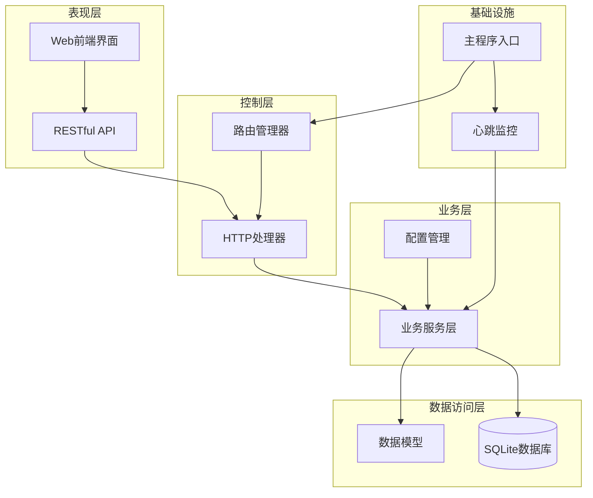
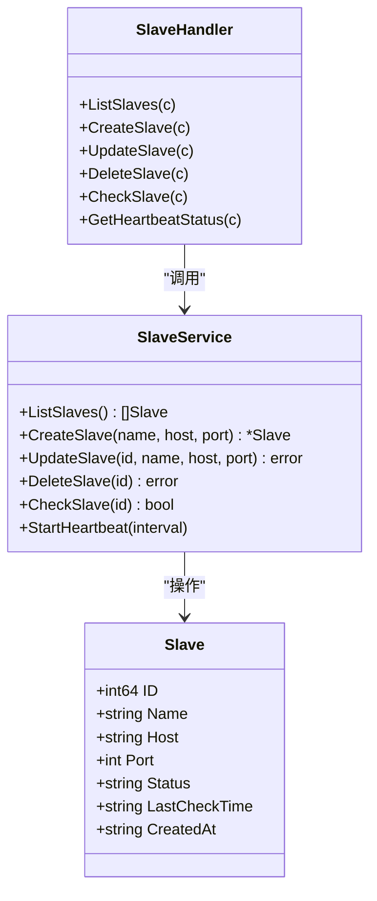
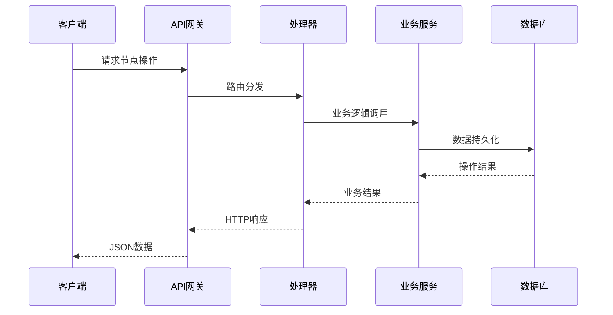
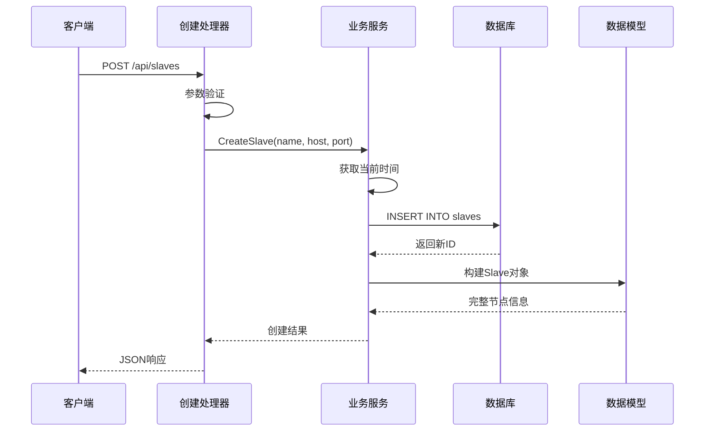
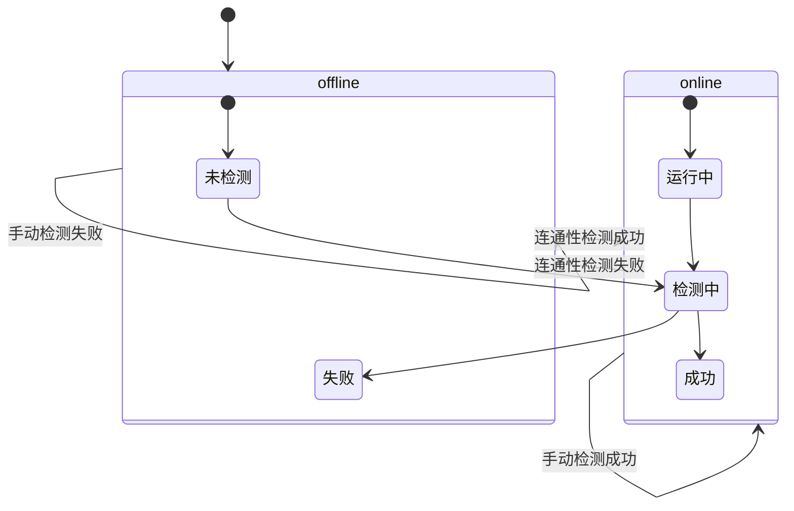
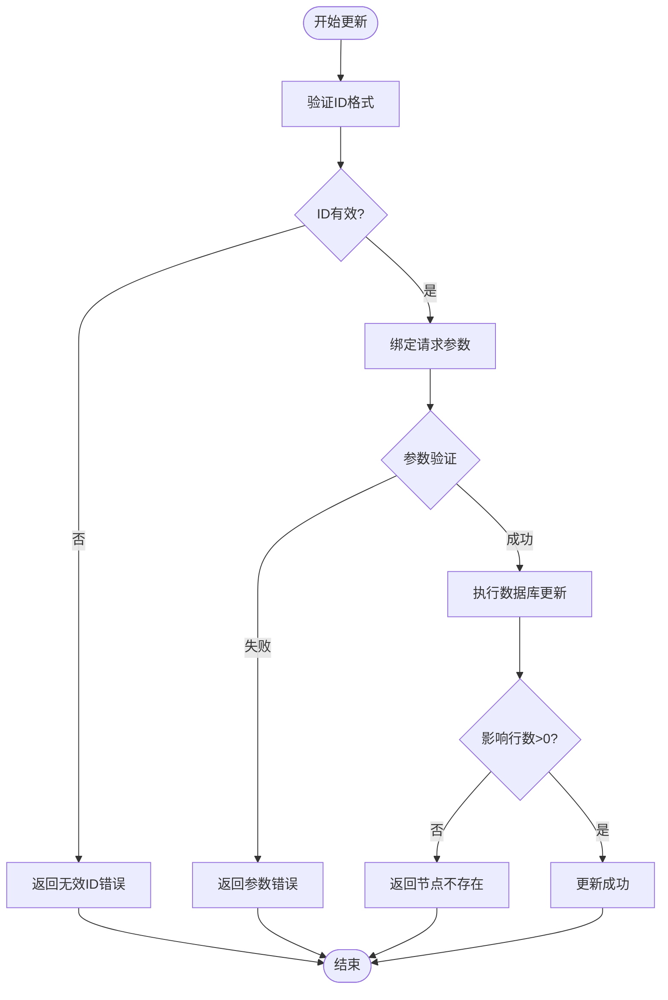
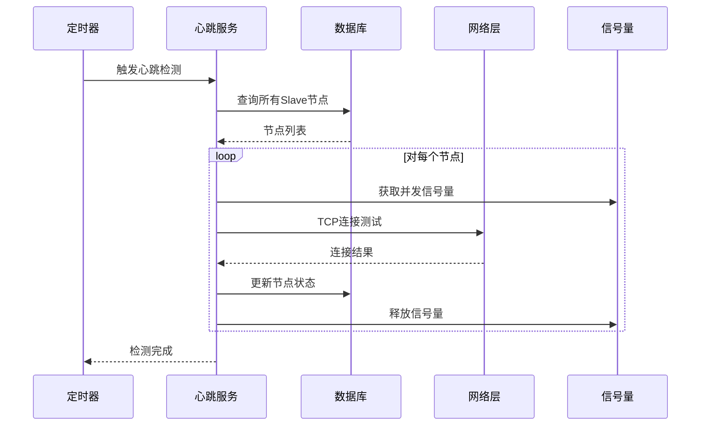
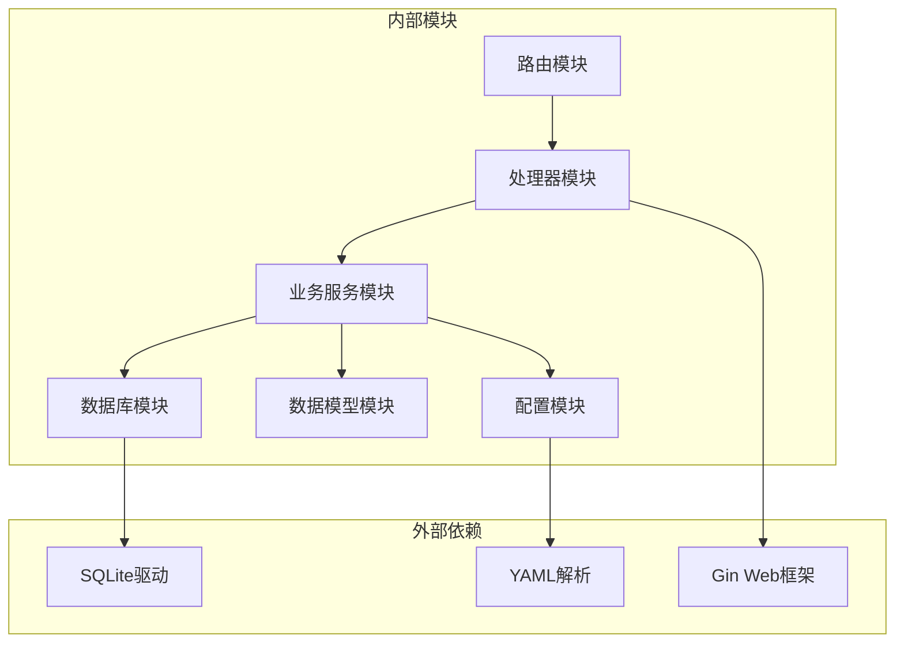

# Slave节点生命周期管理

<cite>
**本文档引用的文件**
- [internal/model/slave.go](file://internal/model/slave.go)
- [internal/service/slave.go](file://internal/service/slave.go)
- [internal/handler/slave.go](file://internal/handler/slave.go)
- [internal/router/router.go](file://internal/router/router.go)
- [internal/database/db.go](file://internal/database/db.go)
- [config/config.go](file://config/config.go)
- [main.go](file://main.go)
- [web/src/views/SlaveManage.vue](file://web/src/views/SlaveManage.vue)
- [web/src/api/slave.js](file://web/src/api/slave.js)
</cite>

## 目录
1. [简介](#简介)
2. [项目结构](#项目结构)
3. [核心组件](#核心组件)
4. [架构概览](#架构概览)
5. [详细组件分析](#详细组件分析)
6. [依赖关系分析](#依赖关系分析)
7. [性能考虑](#性能考虑)
8. [故障排除指南](#故障排除指南)
9. [结论](#结论)

## 简介

JMeter Admin 是一个基于 Go 语言开发的分布式 JMeter 测试管理平台，专门用于管理 Slave 节点的生命周期。该系统提供了完整的 Slave 节点管理功能，包括节点的创建、更新、删除、状态检测和心跳监控等核心功能。

Slave 节点生命周期管理是整个系统的核心功能之一，它确保了分布式测试环境中各个节点的稳定运行和有效管理。本文档将深入分析 Slave 节点从创建到删除的完整生命周期，详细解释每个阶段的实现原理和业务逻辑。

## 项目结构

JMeter Admin 采用典型的分层架构设计，主要分为以下层次：

**图表来源**
- [main.go:28-66](file://main.go#L28-L66)
- [internal/router/router.go:14-112](file://internal/router/router.go#L14-L112)

**章节来源**
- [main.go:19-66](file://main.go#L19-L66)
- [internal/router/router.go:14-112](file://internal/router/router.go#L14-L112)

## 核心组件

### 数据模型设计

Slave 节点的数据模型定义简洁而完整，包含了节点运行所需的所有关键信息：

**图表来源**
- [internal/model/slave.go:3-11](file://internal/model/slave.go#L3-L11)
- [internal/service/slave.go:15-220](file://internal/service/slave.go#L15-L220)
- [internal/handler/slave.go:16-236](file://internal/handler/slave.go#L16-L236)

### 数据库表结构

系统使用 SQLite 作为数据存储，Slave 节点表结构设计如下：

| 字段名 | 类型 | 约束 | 描述 |
|--------|------|------|------|
| id | INTEGER | PRIMARY KEY AUTOINCREMENT | 节点唯一标识符 |
| name | TEXT | NOT NULL | 节点名称 |
| host | TEXT | NOT NULL | 节点主机地址 |
| port | INTEGER | NOT NULL | 节点端口号 |
| status | TEXT | DEFAULT 'offline' | 节点状态（online/offline） |
| created_at | DATETIME |  | 节点创建时间 |
| last_check_time | DATETIME |  | 最后检测时间 |

**章节来源**
- [internal/database/db.go:66-78](file://internal/database/db.go#L66-L78)
- [internal/model/slave.go:3-11](file://internal/model/slave.go#L3-L11)

## 架构概览

系统采用经典的三层架构模式，实现了清晰的关注点分离：

**图表来源**
- [internal/router/router.go:38-47](file://internal/router/router.go#L38-L47)
- [internal/handler/slave.go:16-236](file://internal/handler/slave.go#L16-L236)
- [internal/service/slave.go:15-220](file://internal/service/slave.go#L15-L220)

## 详细组件分析

### 节点创建流程

节点创建是 Slave 生命周期管理的第一步，涉及多个层面的验证和处理：

**图表来源**
- [internal/handler/slave.go:33-48](file://internal/handler/slave.go#L33-L48)
- [internal/service/slave.go:43-69](file://internal/service/slave.go#L43-L69)

#### 创建流程的关键特性

1. **默认状态设置**：新创建的 Slave 节点默认状态为 "offline"
2. **时间戳管理**：使用标准时间格式 "YYYY-MM-DD HH:MM:SS"
3. **ID生成机制**：基于 SQLite 的自增主键机制
4. **数据验证**：前端和后端双重参数验证

**章节来源**
- [internal/service/slave.go:43-69](file://internal/service/slave.go#L43-L69)
- [internal/handler/slave.go:26-31](file://internal/handler/slave.go#L26-L31)

### 节点状态管理

系统实现了完整的节点状态管理机制，支持手动检测和自动心跳监控：

**图表来源**
- [internal/service/slave.go:112-157](file://internal/service/slave.go#L112-L157)
- [internal/service/slave.go:159-220](file://internal/service/slave.go#L159-L220)

#### 状态转换条件

1. **手动检测**：通过 TCP 3 秒超时连接测试
2. **自动心跳**：按配置间隔进行批量检测
3. **并发控制**：限制同时检测的节点数量（默认10个）

**章节来源**
- [internal/service/slave.go:112-220](file://internal/service/slave.go#L112-L220)

### 节点更新操作

节点更新操作提供了灵活的属性修改能力：

**图表来源**
- [internal/handler/slave.go:57-78](file://internal/handler/slave.go#L57-L78)
- [internal/service/slave.go:71-91](file://internal/service/slave.go#L71-L91)

#### 更新约束检查

1. **ID有效性**：64位整数格式验证
2. **参数完整性**：必需字段验证
3. **存在性检查**：确保目标节点存在
4. **原子性保证**：单条SQL语句完成更新

**章节来源**
- [internal/handler/slave.go:57-78](file://internal/handler/slave.go#L57-L78)
- [internal/service/slave.go:71-91](file://internal/service/slave.go#L71-L91)

### 节点删除操作

节点删除操作采用了安全的级联删除策略：

**图表来源**
- [internal/handler/slave.go:80-95](file://internal/handler/slave.go#L80-L95)
- [internal/service/slave.go:93-110](file://internal/service/slave.go#L93-L110)

#### 删除安全机制

1. **存在性验证**：删除前检查节点是否存在
2. **影响行数检查**：确保删除操作实际生效
3. **无级联依赖**：当前版本无外键关联，直接删除
4. **事务保证**：单条SQL语句的原子性操作

**章节来源**
- [internal/handler/slave.go:80-95](file://internal/handler/slave.go#L80-L95)
- [internal/service/slave.go:93-110](file://internal/service/slave.go#L93-L110)

### 心跳监控系统

系统实现了高效的批量心跳监控机制：

**图表来源**
- [internal/service/slave.go:159-220](file://internal/service/slave.go#L159-L220)
- [internal/service/slave.go:172-219](file://internal/service/slave.go#L172-L219)

#### 心跳监控特性

1. **并发控制**：使用信号量限制最大并发数
2. **超时处理**：TCP连接超时3秒
3. **批量处理**：一次性检测所有节点
4. **异步执行**：后台独立协程运行
5. **配置灵活**：心跳间隔可配置

**章节来源**
- [internal/service/slave.go:159-220](file://internal/service/slave.go#L159-L220)
- [config/config.go:31-33](file://config/config.go#L31-L33)

## 依赖关系分析

系统采用松耦合的设计模式，各组件间的依赖关系清晰明确：

**图表来源**
- [internal/router/router.go:3-12](file://internal/router/router.go#L3-L12)
- [internal/handler/slave.go:3-14](file://internal/handler/slave.go#L3-L14)
- [internal/service/slave.go:3-13](file://internal/service/slave.go#L3-L13)

### 关键依赖关系

1. **路由到处理器**：Gin框架负责HTTP请求路由
2. **处理器到服务**：业务逻辑封装在服务层
3. **服务到数据库**：统一的数据访问接口
4. **配置到服务**：运行时配置注入

**章节来源**
- [internal/router/router.go:3-12](file://internal/router/router.go#L3-L12)
- [internal/handler/slave.go:3-14](file://internal/handler/slave.go#L3-L14)
- [internal/service/slave.go:3-13](file://internal/service/slave.go#L3-L13)

## 性能考虑

### 数据库优化

1. **索引策略**：为常用查询字段建立索引
2. **连接池**：SQLite默认连接池管理
3. **批量操作**：心跳检测使用批量更新

### 并发控制

1. **信号量机制**：限制同时进行的网络连接数
2. **协程管理**：Go语言原生并发支持
3. **资源回收**：及时关闭网络连接

### 内存管理

1. **时间格式化**：使用标准时间格式减少内存占用
2. **字符串处理**：避免不必要的字符串复制
3. **错误处理**：及时释放错误场景下的资源

## 故障排除指南

### 常见问题诊断

1. **节点无法连接**
   - 检查网络连通性
   - 验证端口开放情况
   - 确认防火墙设置

2. **心跳检测失败**
   - 检查服务配置
   - 验证并发限制设置
   - 查看系统日志

3. **数据库操作异常**
   - 检查数据库文件权限
   - 验证磁盘空间充足
   - 确认SQLite驱动正常

### 调试建议

1. **启用详细日志**：观察系统运行状态
2. **监控资源使用**：CPU、内存、网络占用
3. **定期健康检查**：确保系统持续可用

**章节来源**
- [internal/service/slave.go:172-219](file://internal/service/slave.go#L172-L219)
- [internal/database/db.go:15-34](file://internal/database/db.go#L15-L34)

## 结论

JMeter Admin 的 Slave 节点生命周期管理系统展现了良好的软件工程实践：

1. **架构清晰**：分层设计确保了代码的可维护性
2. **功能完整**：覆盖了节点管理的全生命周期
3. **性能优化**：合理的并发控制和资源管理
4. **错误处理**：完善的异常处理和恢复机制

该系统为分布式 JMeter 测试环境提供了可靠的基础支撑，其设计原则和实现模式可以作为类似系统的参考模板。通过持续的优化和扩展，该系统能够更好地满足复杂分布式测试场景的需求。