# Slave节点管理系统

<cite>
**本文档引用的文件**
- [main.go](file://main.go)
- [config.go](file://config/config.go)
- [config.yaml](file://config.yaml)
- [db.go](file://internal/database/db.go)
- [router.go](file://internal/router/router.go)
- [slave.go](file://internal/handler/slave.go)
- [slave.go](file://internal/service/slave.go)
- [slave.go](file://internal/model/slave.go)
- [SlaveManage.vue](file://web/src/views/SlaveManage.vue)
- [slave.js](file://web/src/api/slave.js)
- [execution.go](file://internal/service/execution.go)
- [execution.go](file://internal/model/execution.go)
</cite>

## 目录
1. [简介](#简介)
2. [项目结构](#项目结构)
3. [核心组件](#核心组件)
4. [架构概览](#架构概览)
5. [详细组件分析](#详细组件分析)
6. [依赖关系分析](#依赖关系分析)
7. [性能考虑](#性能考虑)
8. [故障排除指南](#故障排除指南)
9. [结论](#结论)

## 简介

Slave节点管理系统是JMeter Admin项目的核心组成部分，负责分布式测试环境中Slave节点的全生命周期管理。该系统提供了节点注册、发现、状态管理、删除以及心跳检测等完整功能，确保分布式测试的稳定性和可靠性。

系统采用前后端分离架构，后端基于Go语言和Gin框架构建RESTful API，前端使用Vue.js开发响应式管理界面。通过SQLite数据库存储节点配置和状态信息，实现了轻量级、易部署的分布式测试节点管理解决方案。

## 项目结构

JMeter Admin项目采用清晰的分层架构设计，主要分为以下几个层次：

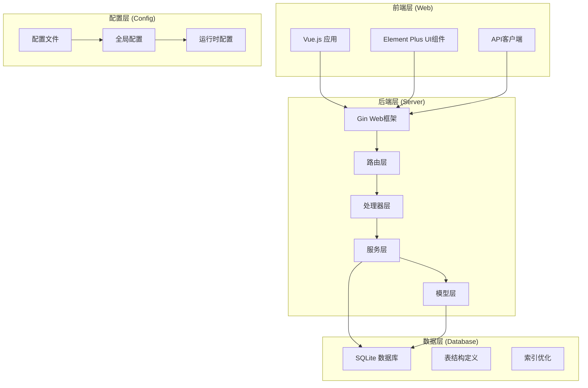

**图表来源**
- [main.go:28-66](file://main.go#L28-L66)
- [router.go:14-112](file://internal/router/router.go#L14-L112)

**章节来源**
- [main.go:19-66](file://main.go#L19-L66)
- [config.go:41-84](file://config/config.go#L41-L84)

## 核心组件

### 数据模型层

系统的核心数据模型围绕Slave节点展开，定义了完整的节点信息结构：

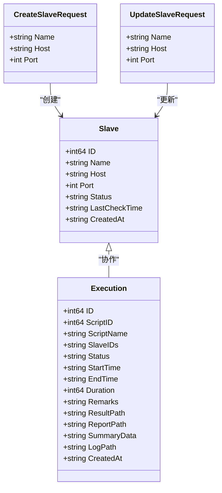

**图表来源**
- [slave.go:3-11](file://internal/model/slave.go#L3-L11)
- [execution.go:3-18](file://internal/model/execution.go#L3-L18)

### 配置管理

系统采用YAML格式的配置文件，支持运行时热更新和持久化存储：

| 配置项 | 类型 | 默认值 | 描述 |
|--------|------|--------|------|
| server.port | int | 8080 | HTTP服务监听端口 |
| jmeter.path | string | "jmeter" | JMeter可执行文件路径 |
| jmeter.master_hostname | string | "" | Master节点IP地址 |
| slave.heartbeat_interval | int | 30 | 心跳检测间隔(秒) |
| dirs.data | string | "./data" | SQLite数据库目录 |
| dirs.uploads | string | "./uploads" | 脚本上传目录 |
| dirs.results | string | "./results" | 测试结果目录 |

**章节来源**
- [config.go:10-39](file://config/config.go#L10-L39)
- [config.yaml:1-26](file://config.yaml#L1-L26)

## 架构概览

系统采用微服务化的分层架构，各层职责明确，耦合度低：

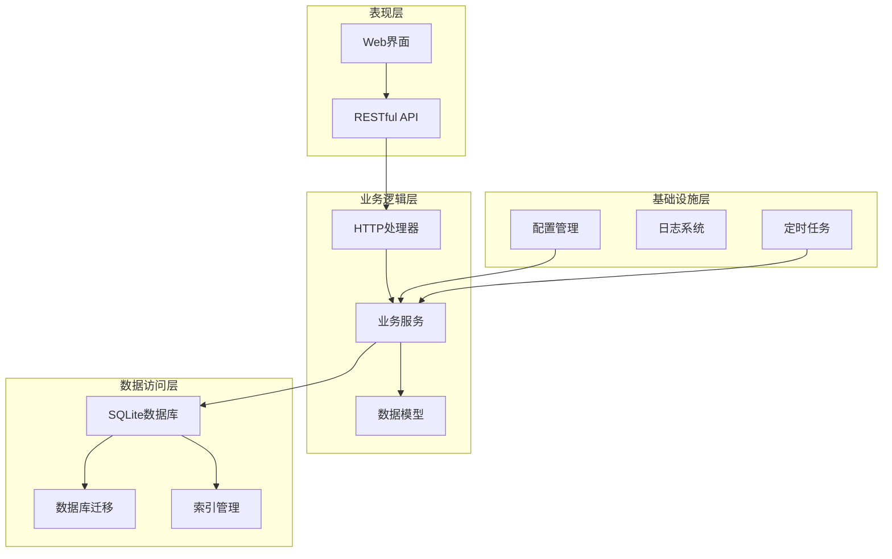

**图表来源**
- [router.go:38-75](file://internal/router/router.go#L38-L75)
- [main.go:50-55](file://main.go#L50-L55)

## 详细组件分析

### Slave节点管理API

系统提供了完整的Slave节点管理API，支持CRUD操作和状态检测：

#### 注册功能

节点注册通过POST /api/slaves接口实现，支持批量添加和单个添加：

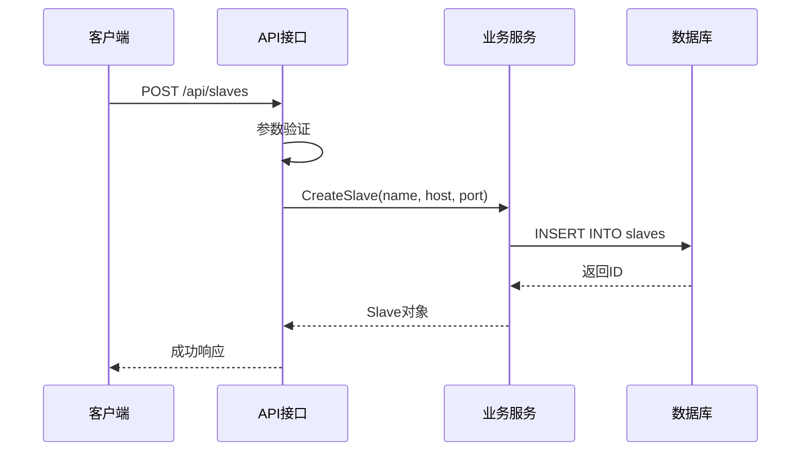

**图表来源**
- [slave.go:33-48](file://internal/handler/slave.go#L33-L48)
- [slave.go:43-69](file://internal/service/slave.go#L43-L69)

#### 发现功能

节点发现通过GET /api/slaves接口实现，支持分页和排序：

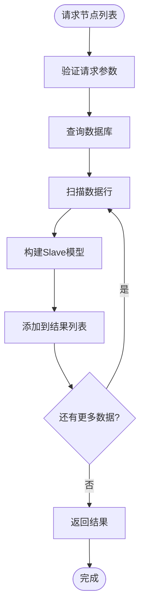

**图表来源**
- [slave.go:16-41](file://internal/service/slave.go#L16-L41)

#### 状态管理

系统实现了完整的节点状态管理机制，包括在线/离线状态检测：

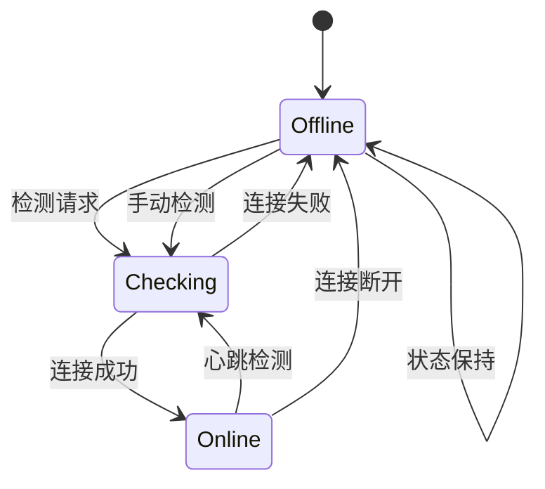

**图表来源**
- [slave.go:112-157](file://internal/service/slave.go#L112-L157)
- [slave.go:200-235](file://internal/handler/slave.go#L200-L235)

#### 删除功能

节点删除通过DELETE /api/slaves/:id接口实现，支持软删除和硬删除：

**章节来源**
- [slave.go:80-95](file://internal/handler/slave.go#L80-L95)
- [slave.go:93-110](file://internal/service/slave.go#L93-L110)

### 心跳检测机制

系统实现了智能的心跳检测机制，确保节点状态的实时准确性：

#### 定时检测

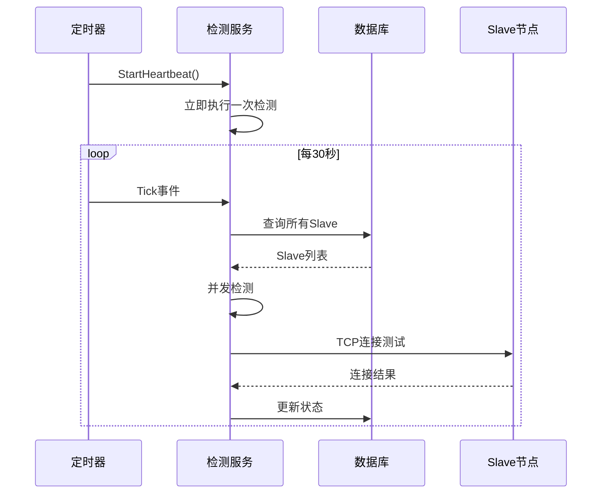

**图表来源**
- [slave.go:159-170](file://internal/service/slave.go#L159-L170)
- [slave.go:172-219](file://internal/service/slave.go#L172-L219)

#### 并发控制

系统采用信号量机制控制并发检测数量，避免资源耗尽：

| 特性 | 实现方式 | 优势 |
|------|----------|------|
| 并发限制 | 信号量(10个) | 控制资源使用 |
| 超时设置 | 3秒超时 | 防止阻塞等待 |
| 错误处理 | 异常捕获 | 系统稳定性 |
| 状态更新 | 原子操作 | 数据一致性 |

**章节来源**
- [slave.go:179-189](file://internal/service/slave.go#L179-L189)

### 网络连通性验证

系统提供了多层次的网络连通性验证机制：

#### IP地址验证

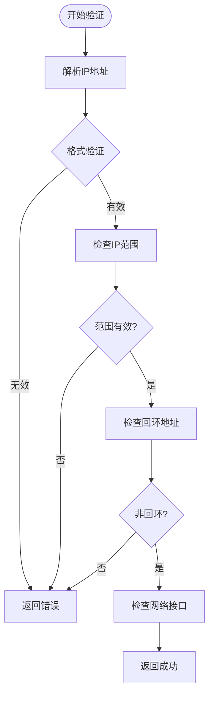

#### 端口检查

系统支持TCP端口连通性检测，使用3秒超时机制：

**章节来源**
- [slave.go:124-167](file://internal/handler/slave.go#L124-L167)

### Master节点配置管理

系统提供了灵活的Master节点配置管理功能：

#### 自动IP检测

**图表来源**
- [slave.go:124-167](file://internal/handler/slave.go#L124-L167)

#### 配置持久化

配置变更通过PUT /api/config/master-hostname接口实现，支持实时更新：

**章节来源**
- [slave.go:169-198](file://internal/handler/slave.go#L169-L198)

### 前端交互组件

Vue.js前端提供了直观的节点管理界面：

#### 节点状态可视化

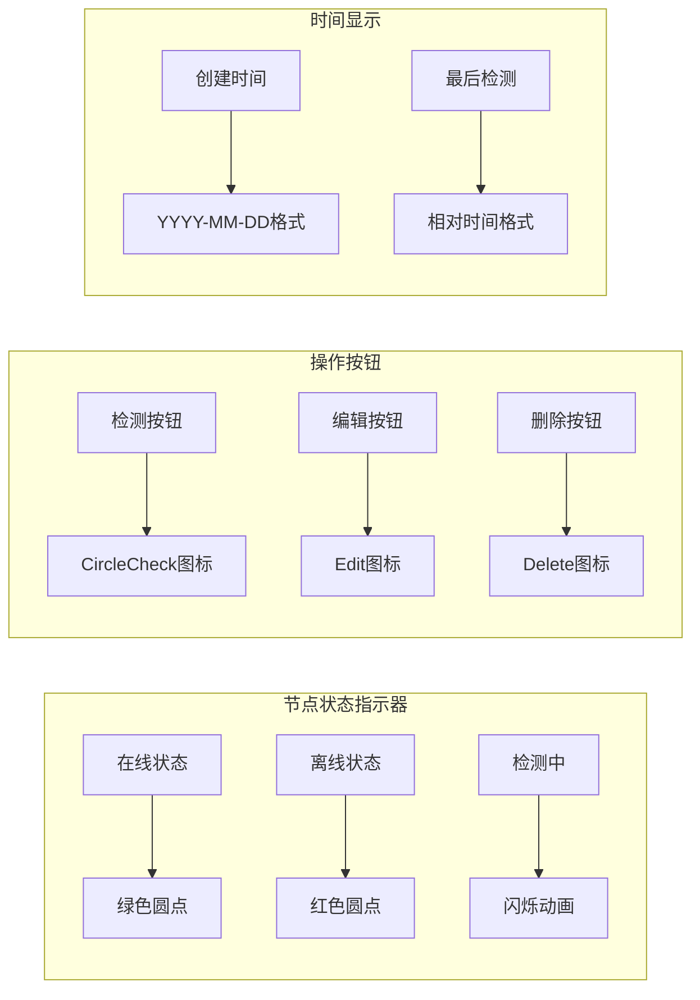

**图表来源**
- [SlaveManage.vue:104-158](file://web/src/views/SlaveManage.vue#L104-L158)

#### 实时状态更新

前端通过定时器每10秒自动刷新心跳状态，确保UI与实际状态一致：

**章节来源**
- [SlaveManage.vue:517-549](file://web/src/views/SlaveManage.vue#L517-L549)

## 依赖关系分析

系统采用模块化的依赖设计，各模块之间通过清晰的接口进行交互：

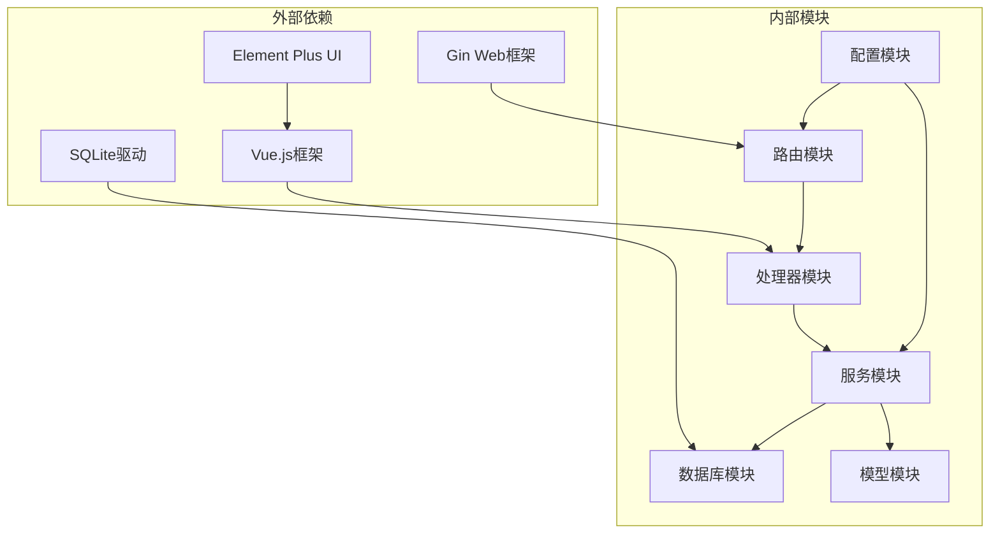

**图表来源**
- [main.go:3-14](file://main.go#L3-L14)
- [router.go:3-12](file://internal/router/router.go#L3-L12)

### 数据库设计

系统使用SQLite作为数据存储，支持自动迁移和索引优化：

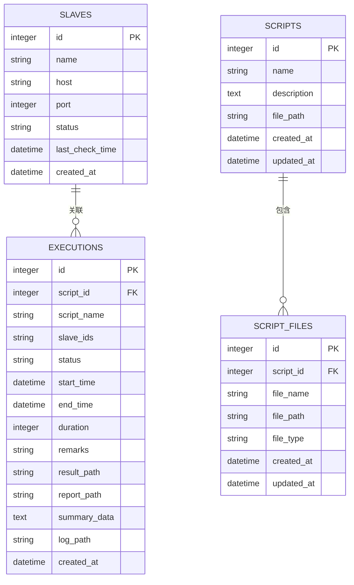

**图表来源**
- [db.go:66-101](file://internal/database/db.go#L66-L101)

**章节来源**
- [db.go:36-124](file://internal/database/db.go#L36-L124)

## 性能考虑

系统在设计时充分考虑了性能优化，采用了多种策略提升响应速度和资源利用率：

### 并发优化

- **信号量控制**：限制最大并发检测数量为10，防止资源耗尽
- **异步处理**：心跳检测采用goroutine异步执行
- **连接复用**：TCP连接检测后及时关闭，避免连接泄漏

### 数据库优化

- **索引优化**：为常用查询字段建立索引
- **批量操作**：支持批量检测和状态更新
- **连接池**：SQLite连接自动管理

### 缓存策略

- **内存缓存**：配置信息存储在内存中，减少磁盘I/O
- **前端缓存**：节点状态在前端本地缓存，减少重复请求

## 故障排除指南

### 常见问题及解决方案

#### 节点无法检测到

**症状**：节点状态始终显示离线
**可能原因**：
1. 网络连接问题
2. 端口被防火墙阻止
3. Slave服务未启动

**解决步骤**：
1. 检查网络连通性：`ping <slave-host>`
2. 验证端口开放：`telnet <slave-host> <port>`
3. 确认Slave服务状态：`ps aux | grep jmeter-server`

#### 心跳检测异常

**症状**：心跳检测频繁失败
**可能原因**：
1. 检测间隔过短
2. 网络延迟过高
3. 并发检测过多

**解决方法**：
1. 调整心跳间隔配置
2. 检查网络延迟
3. 减少并发检测数量

#### 配置更新失败

**症状**：Master IP配置无法保存
**解决步骤**：
1. 检查文件权限
2. 验证YAML格式
3. 重启服务应用配置

### 调试工具

系统提供了完善的调试和监控功能：

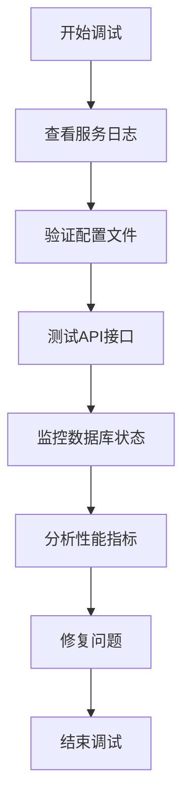

**章节来源**
- [main.go:45-48](file://main.go#L45-L48)

## 结论

Slave节点管理系统是一个功能完整、架构清晰的分布式测试节点管理解决方案。系统通过模块化设计实现了高内聚、低耦合的代码结构，提供了丰富的API接口和友好的用户界面。

### 主要优势

1. **完整的生命周期管理**：从节点注册到状态监控的全流程覆盖
2. **智能心跳检测**：自动化的节点状态维护机制
3. **灵活的配置管理**：支持运行时配置更新和持久化存储
4. **高性能设计**：并发控制和资源优化确保系统稳定性
5. **易于部署**：单文件部署，零依赖要求

### 应用场景

该系统适用于各种规模的分布式测试场景，包括：
- 大型企业级性能测试
- 微服务架构测试
- CI/CD集成测试
- 负载压力测试

### 未来发展方向

1. **集群扩展**：支持多Master节点的高可用架构
2. **监控增强**：集成Prometheus等监控系统
3. **安全加固**：添加认证授权和数据加密
4. **自动化运维**：支持Kubernetes容器化部署

通过持续的功能完善和技术演进，Slave节点管理系统将继续为分布式测试提供可靠的技术支撑。