# Slave节点管理系统

<cite>
**本文档引用的文件**
- [main.go](file://main.go)
- [config.go](file://config/config.go)
- [config.yaml](file://config.yaml)
- [db.go](file://internal/database/db.go)
- [router.go](file://internal/router/router.go)
- [slave.go](file://internal/handler/slave.go)
- [slave.go](file://internal/service/slave.go)
- [slave.go](file://internal/model/slave.go)
- [server.go](file://internal/agent/server.go)
- [main.go](file://cmd/agent/main.go)
- [SlaveManage.vue](file://web/src/views/SlaveManage.vue)
- [slave.js](file://web/src/api/slave.js)
- [execution.go](file://internal/service/execution.go)
- [execution.go](file://internal/model/execution.go)
- [execution_diagnostics.go](file://internal/service/execution_diagnostics.go)
- [execution_environment.go](file://internal/service/execution_environment.go)
- [ExecutionDetail.vue](file://web/src/views/ExecutionDetail.vue)
</cite>

## 更新摘要
**所做更改**
- 新增预检检查功能章节，详细介绍执行前体检机制
- 更新实时资源监控功能，增强Agent系统统计信息收集
- 新增节点拓扑可视化功能，提供分布式执行链路展示
- 更新心跳检测机制，增加双通道检测（JMeter RMI + Agent HTTP）
- 新增Agent健康检查API和前端展示功能
- 更新故障排除指南，增加预检检查和拓扑诊断内容

## 目录
1. [简介](#简介)
2. [项目结构](#项目结构)
3. [核心组件](#核心组件)
4. [架构概览](#架构概览)
5. [详细组件分析](#详细组件分析)
6. [依赖关系分析](#依赖关系分析)
7. [性能考虑](#性能考虑)
8. [故障排除指南](#故障排除指南)
9. [结论](#结论)

## 简介

Slave节点管理系统是JMeter Admin项目的核心组成部分，负责分布式测试环境中Slave节点的全生命周期管理。该系统提供了节点注册、发现、状态管理、删除以及心跳检测等完整功能，确保分布式测试的稳定性和可靠性。

**重要更新**：系统现已增强预检检查、实时资源监控和节点拓扑可视化功能，显著提升了分布式执行能力。新增的预检检查功能允许在执行前对节点进行全面体检，节点拓扑可视化功能提供了分布式执行链路的直观展示，实时资源监控功能通过Agent服务实现对节点的全面监控。

系统采用前后端分离架构，后端基于Go语言和Gin框架构建RESTful API，前端使用Vue.js开发响应式管理界面。通过SQLite数据库存储节点配置和状态信息，实现了轻量级、易部署的分布式测试节点管理解决方案。

## 项目结构

JMeter Admin项目采用清晰的分层架构设计，主要分为以下几个层次：

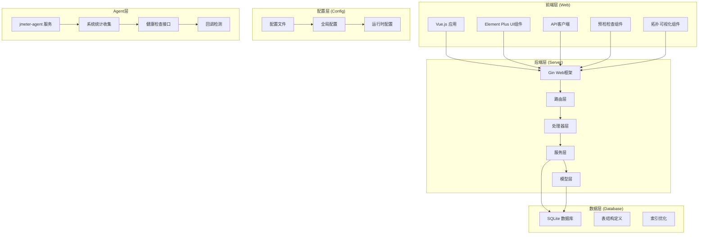

**图表来源**
- [main.go:28-66](file://main.go#L28-L66)
- [router.go:14-112](file://internal/router/router.go#L14-L112)
- [server.go:105-142](file://internal/agent/server.go#L105-L142)

**章节来源**
- [main.go:19-66](file://main.go#L19-L66)
- [config.go:41-84](file://config/config.go#L41-L84)

## 核心组件

### 数据模型层

系统的核心数据模型围绕Slave节点展开，定义了完整的节点信息结构。**新增Agent相关字段和预检检查模型**：

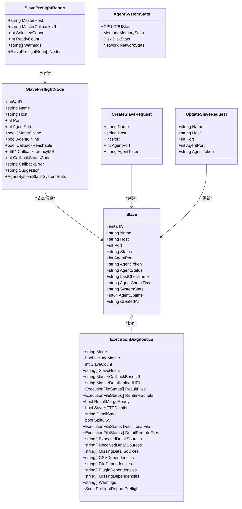

**图表来源**
- [slave.go:32-46](file://internal/model/slave.go#L32-L46)
- [slave.go:3-30](file://internal/model/slave.go#L3-L30)
- [execution.go:3-18](file://internal/model/execution.go#L3-L18)

### 配置管理

系统采用YAML格式的配置文件，支持运行时热更新和持久化存储。**新增Agent配置项和预检检查配置**：

| 配置项 | 类型 | 默认值 | 描述 |
|--------|------|--------|------|
| server.port | int | 8080 | HTTP服务监听端口 |
| jmeter.path | string | "jmeter" | JMeter可执行文件路径 |
| jmeter.master_hostname | string | "" | Master节点IP地址 |
| slave.heartbeat_interval | int | 30 | 心跳检测间隔(秒) |
| agent.csv_data_dir | string | "./csv-data" | Agent CSV数据目录 |
| dirs.data | string | "./data" | SQLite数据库目录 |
| dirs.uploads | string | "./uploads" | 脚本上传目录 |
| dirs.results | string | "./results" | 测试结果目录 |
| preflight.enabled | bool | true | 预检检查开关 |
| topology.visualization | bool | true | 拓扑可视化开关 |

**章节来源**
- [config.go:10-39](file://config/config.go#L10-L39)
- [config.yaml:1-26](file://config.yaml#L1-26)

## 架构概览

系统采用微服务化的分层架构，各层职责明确，耦合度低。**新增预检检查和拓扑可视化架构**：

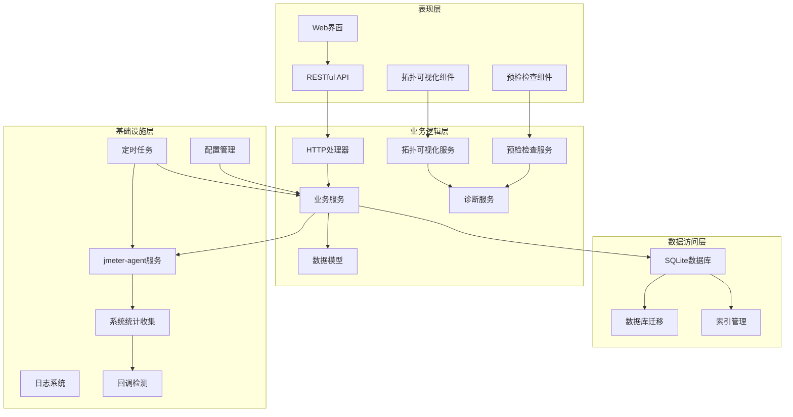

**图表来源**
- [router.go:38-75](file://internal/router/router.go#L38-L75)
- [main.go:50-55](file://main.go#L50-L55)
- [server.go:53-87](file://internal/agent/server.go#L53-L87)

## 详细组件分析

### Slave节点管理API

系统提供了完整的Slave节点管理API，支持CRUD操作和状态检测。**新增预检检查和拓扑可视化功能**：

#### 注册功能

节点注册通过POST /api/slaves接口实现，支持批量添加和单个添加：

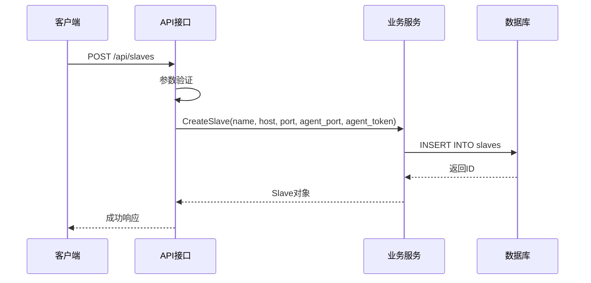

**图表来源**
- [slave.go:33-48](file://internal/handler/slave.go#L33-L48)
- [slave.go:43-69](file://internal/service/slave.go#L43-L69)

#### 发现功能

节点发现通过GET /api/slaves接口实现，支持分页和排序：


**图表来源**
- [slave.go:16-41](file://internal/service/slave.go#L16-L41)

#### 预检检查功能

**新增功能**：系统现在支持执行前预检检查，提供全面的节点体检报告：

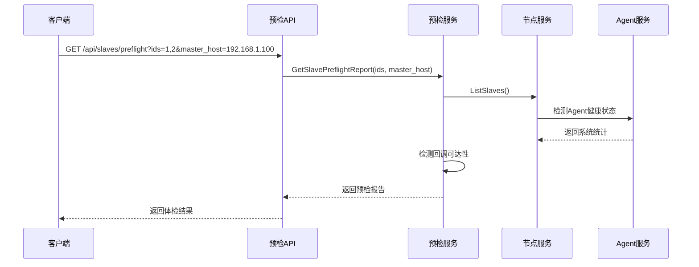

**图表来源**
- [slave.go:294-387](file://internal/service/slave.go#L294-L387)
- [slave.go:147-173](file://internal/handler/slave.go#L147-L173)

#### 状态管理

系统实现了完整的节点状态管理机制，包括在线/离线状态检测。**新增双通道检测机制**：

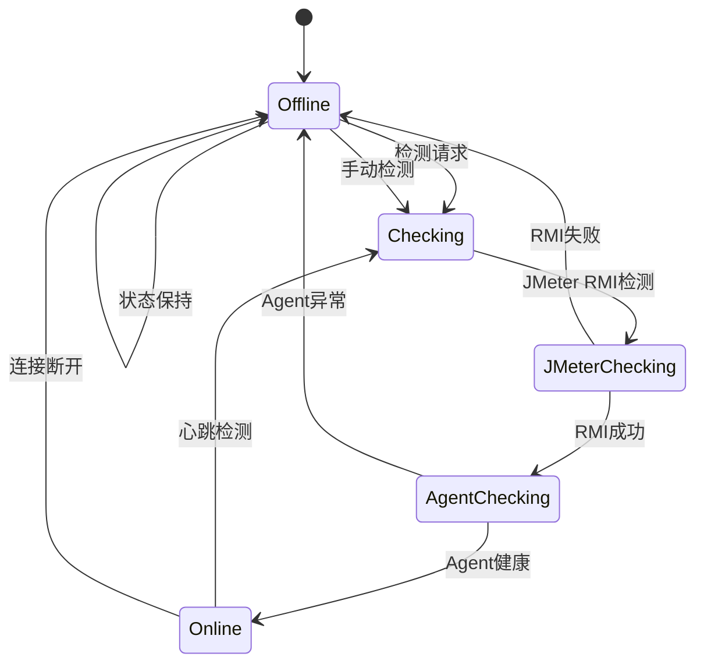

**图表来源**
- [slave.go:112-157](file://internal/service/slave.go#L112-L157)
- [slave.go:368-446](file://internal/service/slave.go#L368-L446)
- [slave.go:200-235](file://internal/handler/slave.go#L200-L235)

#### 删除功能

节点删除通过DELETE /api/slaves/:id接口实现，支持软删除和硬删除：

**章节来源**
- [slave.go:80-95](file://internal/handler/slave.go#L80-L95)
- [slave.go:93-110](file://internal/service/slave.go#L93-L110)

### 心跳检测机制

系统实现了智能的心跳检测机制，确保节点状态的实时准确性。**新增Agent健康检查功能**：

#### 双通道检测

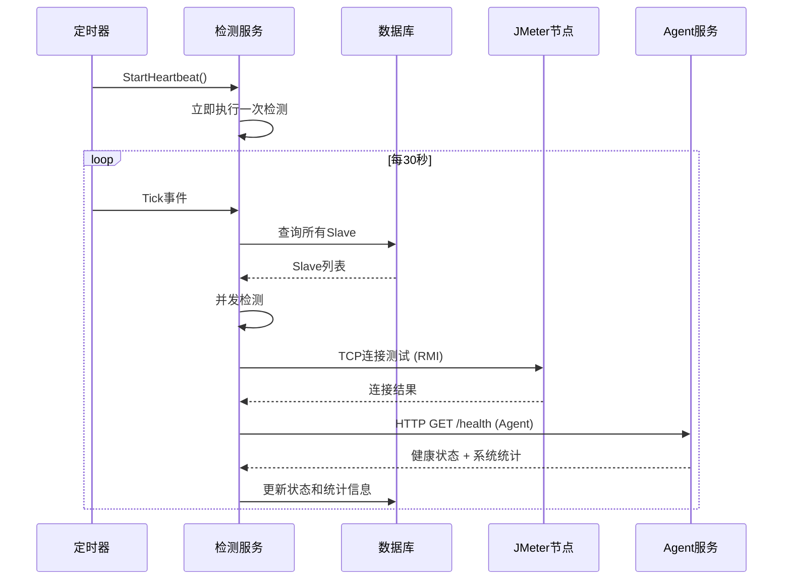

**图表来源**
- [slave.go:448-524](file://internal/service/slave.go#L448-L524)
- [slave.go:295-366](file://internal/service/slave.go#L295-L366)

#### 并发控制

系统采用信号量机制控制并发检测数量，避免资源耗尽：

| 特性 | 实现方式 | 优势 |
|------|----------|------|
| 并发限制 | 信号量(10个) | 控制资源使用 |
| 超时设置 | 3秒超时 | 防止阻塞等待 |
| 错误处理 | 异常捕获 | 系统稳定性 |
| 状态更新 | 原子操作 | 数据一致性 |
| 双通道检测 | 并行执行 | 全面监控 |

**章节来源**
- [slave.go:179-189](file://internal/service/slave.go#L179-L189)

### Agent状态监控

**新增功能**：系统现在支持Agent状态监控，提供实时资源统计信息。

#### Agent健康检查

Agent服务通过HTTP接口提供健康检查功能：

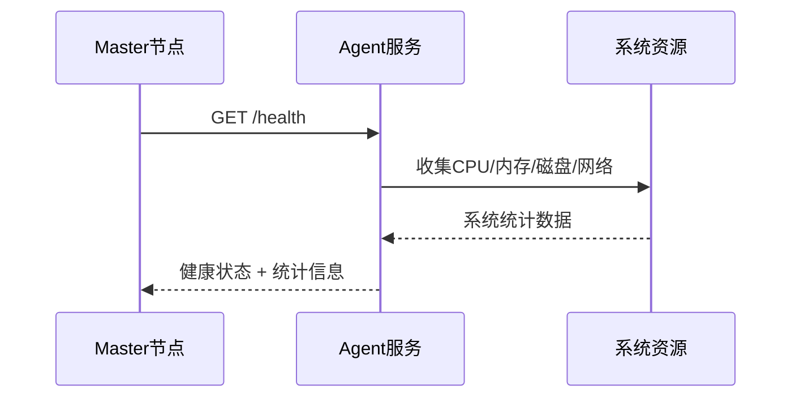

**图表来源**
- [server.go:128-142](file://internal/agent/server.go#L128-L142)
- [slave.go:295-366](file://internal/service/slave.go#L295-L366)

#### 系统统计信息收集

Agent服务实时收集系统资源统计信息：

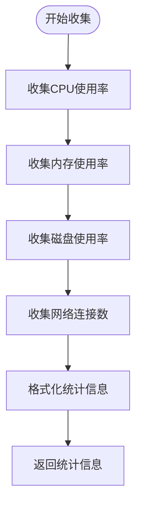

**图表来源**
- [server.go:53-87](file://internal/agent/server.go#L53-L87)

#### Agent配置管理

Agent服务支持配置管理，包括端口、数据目录和认证令牌：

| 配置项 | 默认值 | 描述 |
|--------|--------|------|
| -port | 8089 | Agent监听端口 |
| -data-dir | ./csv-data | CSV数据存储目录 |
| -token | 空字符串 | 认证令牌（可选） |

**章节来源**
- [server.go:14-19](file://internal/agent/server.go#L14-L19)
- [main.go:14-50](file://cmd/agent/main.go#L14-L50)

### 节点拓扑可视化

**新增功能**：系统现在支持节点拓扑可视化，提供分布式执行链路的直观展示。

#### 拓扑数据构建

系统根据执行诊断信息构建节点拓扑图：

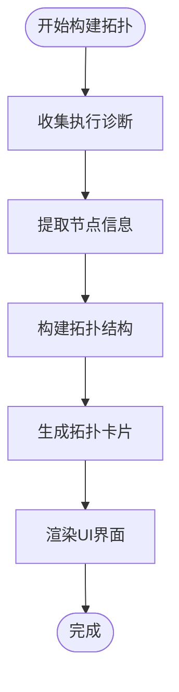

**图表来源**
- [execution_diagnostics.go:685-877](file://internal/service/execution_diagnostics.go#L685-L877)

#### 拓扑卡片展示

前端组件展示分布式执行的关键节点和连接关系：

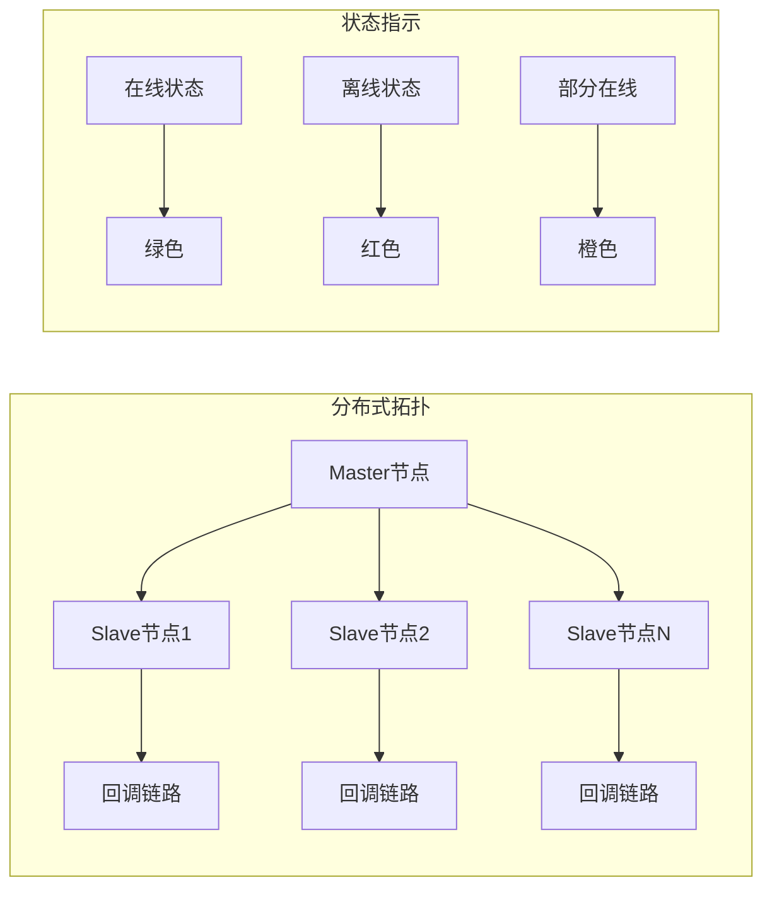

**图表来源**
- [ExecutionDetail.vue:268-314](file://web/src/views/ExecutionDetail.vue#L268-L314)

#### 拓扑元数据展示

系统提供拓扑相关的元数据信息：

| 元数据项 | 描述 | 示例值 |
|----------|------|--------|
| Master回调基地址 | Master节点回调地址 | http://192.168.1.100:8080 |
| HTTP明细回传 | 是否开启明细回传 | 已开启/未开启 |
| 明细上传端点 | 错误明细上传地址 | /api/executions/123/error-details/upload |
| 节点数量 | 分布式节点总数 | 3个节点 |

**章节来源**
- [ExecutionDetail.vue:287-300](file://web/src/views/ExecutionDetail.vue#L287-L300)

### 网络连通性验证

系统提供了多层次的网络连通性验证机制。**新增Agent连接验证和回调可达性检测**：

#### IP地址验证


#### 端口检查

系统支持TCP端口连通性检测，使用3秒超时机制。**新增Agent端口检测和回调端口检测**：

**章节来源**
- [slave.go:124-167](file://internal/handler/slave.go#L124-L167)

### Master节点配置管理

系统提供了灵活的Master节点配置管理功能。**新增Agent配置管理**：

#### 自动IP检测

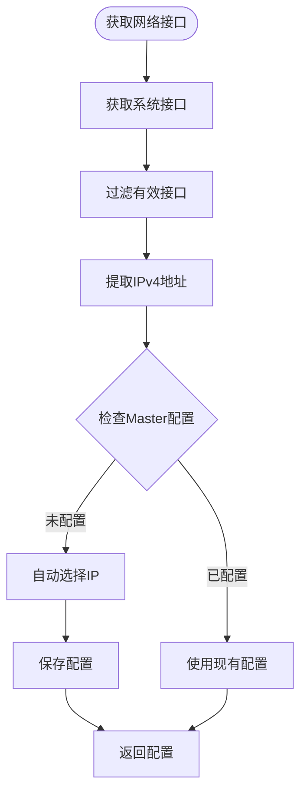

**图表来源**
- [slave.go:124-167](file://internal/handler/slave.go#L124-L167)

#### 配置持久化

配置变更通过PUT /api/config/master-hostname接口实现，支持实时更新。

### 前端交互组件

Vue.js前端提供了直观的节点管理界面。**新增Agent状态和资源监控功能**：

#### 节点状态可视化

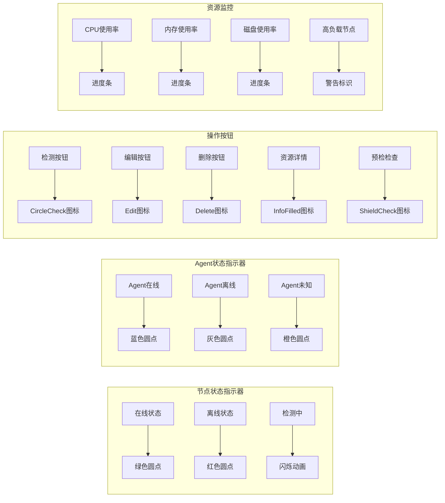

**图表来源**
- [SlaveManage.vue:104-158](file://web/src/views/SlaveManage.vue#L104-L158)
- [SlaveManage.vue:131-181](file://web/src/views/SlaveManage.vue#L131-L181)

#### 实时状态更新

前端通过定时器每10秒自动刷新心跳状态，确保UI与实际状态一致。**新增Agent状态刷新和预检检查功能**：

**章节来源**
- [SlaveManage.vue:517-549](file://web/src/views/SlaveManage.vue#L517-L549)

## 依赖关系分析

系统采用模块化的依赖设计，各模块之间通过清晰的接口进行交互。**新增Agent服务依赖和预检检查依赖**：

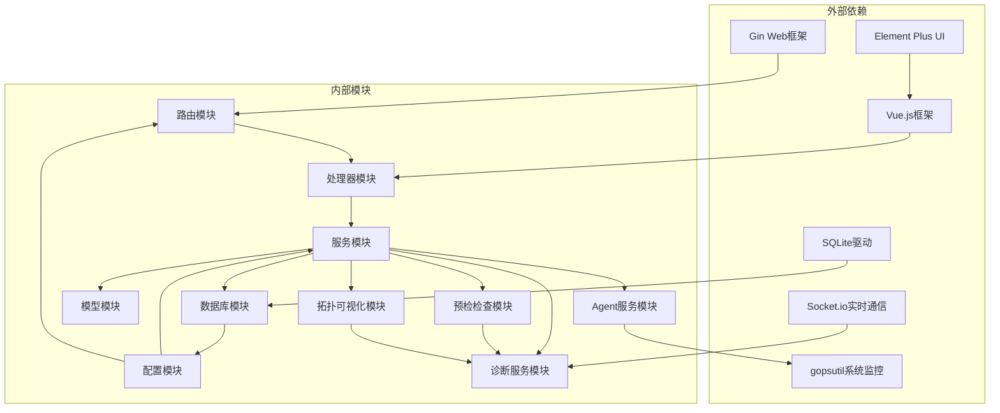

**图表来源**
- [main.go:3-14](file://main.go#L3-L14)
- [router.go:3-12](file://internal/router/router.go#L3-L12)
- [server.go:15-18](file://internal/agent/server.go#L15-L18)

### 数据库设计

系统使用SQLite作为数据存储，支持自动迁移和索引优化。**新增Agent相关字段和预检检查数据**：

```mermaid
erDiagram
SLAVES {
integer id PK
string name
string host
integer port
string status
integer agent_port
string agent_token
string agent_status
datetime last_check_time
datetime agent_check_time
text system_stats
integer agent_uptime
datetime created_at
}
EXECUTIONS {
integer id PK
integer script_id FK
string script_name
string slave_ids
string status
datetime start_time
datetime end_time
integer duration
string remarks
string result_path
string report_path
text summary_data
string log_path
datetime created_at
}
SCRIPTS {
integer id PK
string name
text description
string file_path
datetime created_at
datetime updated_at
}
SCRIPT_FILES {
integer id PK
integer script_id FK
string file_name
string file_path
string file_type
datetime created_at
datetime updated_at
}
SLAVES ||--o{ EXECUTIONS : "关联"
SCRIPTS ||--o{ SCRIPT_FILES : "包含"
}
```

**图表来源**
- [db.go:66-101](file://internal/database/db.go#L66-L101)

**章节来源**
- [db.go:36-124](file://internal/database/db.go#L36-L124)

## 性能考虑

系统在设计时充分考虑了性能优化，采用了多种策略提升响应速度和资源利用率。**新增Agent监控性能优化和预检检查性能优化**：

### 并发优化

- **信号量控制**：限制最大并发检测数量为10，防止资源耗尽
- **异步处理**：心跳检测采用goroutine异步执行
- **连接复用**：TCP连接检测后及时关闭，避免连接泄漏
- **Agent并发**：Agent健康检查支持并行执行，提升检测效率
- **预检检查缓存**：预检报告结果缓存，减少重复计算

### 数据库优化

- **索引优化**：为常用查询字段建立索引
- **批量操作**：支持批量检测和状态更新
- **连接池**：SQLite连接自动管理
- **字段优化**：新增Agent相关字段支持高效查询
- **预检检查数据压缩**：减少存储空间占用

### 缓存策略

- **内存缓存**：配置信息存储在内存中，减少磁盘I/O
- **前端缓存**：节点状态在前端本地缓存，减少重复请求
- **系统统计缓存**：Agent系统统计信息定期更新，避免频繁收集
- **拓扑数据缓存**：拓扑可视化数据缓存，提升渲染性能

### Agent性能优化

- **快速采样**：CPU采样使用500ms超时，平衡准确性和性能
- **增量更新**：仅在状态变化时更新数据库
- **资源限制**：Agent服务占用最小系统资源
- **回调检测优化**：回调可达性检测使用连接复用

### 预检检查性能优化

- **并行检测**：多个节点预检检查并行执行
- **智能缓存**：相同配置的节点共享检测结果
- **增量更新**：仅更新发生变化的节点状态
- **超时控制**：预检检查设置合理超时时间

## 故障排除指南

### 常见问题及解决方案

#### 节点无法检测到

**症状**：节点状态始终显示离线
**可能原因**：
1. 网络连接问题
2. 端口被防火墙阻止
3. Slave服务未启动
4. **Agent服务未启动或配置错误**
5. **预检检查失败**

**解决步骤**：
1. 检查网络连通性：`ping <slave-host>`
2. 验证端口开放：`telnet <slave-host> <port>`
3. 确认Slave服务状态：`ps aux | grep jmeter-server`
4. **启动Agent服务：`./jmeter-agent -port 8089 -data-dir ./csv-data`**
5. **验证Agent健康检查：`curl http://<slave-host>:8089/health`**
6. **检查预检检查结果：`curl http://localhost:8080/api/slaves/preflight?ids=1`**

#### Agent相关问题

**症状**：Agent状态显示离线或资源信息缺失
**可能原因**：
1. Agent服务未启动
2. 端口被防火墙阻止
3. 认证令牌配置错误
4. 系统资源监控权限不足
5. **Agent系统统计收集失败**

**解决方法**：
1. **检查Agent进程状态**：`ps aux | grep jmeter-agent`
2. **验证Agent端口**：`netstat -tlnp | grep :8089`
3. **检查认证配置**：确认AgentToken配置正确
4. **验证系统权限**：确保Agent有访问系统资源的权限
5. **查看Agent日志**：检查`/var/log/jmeter-agent.log`
6. **检查系统统计权限**：确认Agent有读取系统信息的权限

#### 预检检查异常

**症状**：预检检查报告不准确或超时
**可能原因**：
1. 预检检查服务未启动
2. 节点数量过多导致超时
3. 数据库连接问题
4. **Agent服务响应慢**
5. **回调检测失败**

**解决方法**：
1. **检查预检检查服务状态**：`curl http://localhost:8080/api/slaves/preflight`
2. **减少同时预检的节点数量**：分批执行预检检查
3. **检查数据库连接**：确认数据库服务正常
4. **优化Agent性能**：检查Agent服务响应时间
5. **验证回调地址配置**：确认Master回调地址正确

#### 拓扑可视化问题

**症状**：分布式拓扑图显示异常或数据不完整
**可能原因**：
1. 执行诊断数据缺失
2. 拓扑服务未启动
3. Socket.io连接问题
4. **节点状态数据不一致**

**解决方法**：
1. **检查执行诊断数据**：`curl http://localhost:8080/api/executions/123/diagnostics`
2. **验证拓扑服务状态**：确认拓扑可视化服务正常运行
3. **检查实时通信**：验证Socket.io连接状态
4. **同步节点状态**：重新获取最新的节点状态数据
5. **清理浏览器缓存**：清除浏览器缓存重新加载页面

#### 心跳检测异常

**症状**：心跳检测频繁失败
**可能原因**：
1. 检测间隔过短
2. 网络延迟过高
3. 并发检测过多
4. **Agent响应超时**
5. **预检检查干扰**

**解决方法**：
1. 调整心跳间隔配置
2. 检查网络延迟
3. 减少并发检测数量
4. **增加Agent超时时间或优化Agent性能**
5. **暂停预检检查避免干扰**

#### 配置更新失败

**症状**：Master IP配置无法保存
**解决步骤**：
1. 检查文件权限
2. 验证YAML格式
3. 重启服务应用配置

### 调试工具

系统提供了完善的调试和监控功能。**新增Agent调试工具和预检检查调试工具**：

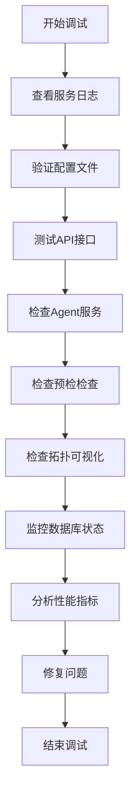

**章节来源**
- [main.go:45-48](file://main.go#L45-L48)

## 结论

Slave节点管理系统是一个功能完整、架构清晰的分布式测试节点管理解决方案。系统通过模块化设计实现了高内聚、低耦合的代码结构，提供了丰富的API接口和友好的用户界面。

**重要更新**：系统现已增强预检检查、实时资源监控和节点拓扑可视化功能，显著提升了分布式执行能力。新增的预检检查功能允许在执行前对节点进行全面体检，节点拓扑可视化功能提供了分布式执行链路的直观展示，实时资源监控功能通过Agent服务实现对节点的全面监控。

### 主要优势

1. **完整的生命周期管理**：从节点注册到状态监控的全流程覆盖
2. **智能心跳检测**：自动化的节点状态维护机制，支持双通道检测
3. **实时资源监控**：Agent服务提供CPU、内存、磁盘、网络等系统资源监控
4. **全面的预检检查**：执行前节点体检，确保分布式执行的稳定性
5. **直观的拓扑可视化**：分布式执行链路的可视化展示
6. **灵活的配置管理**：支持运行时配置更新和持久化存储
7. **高性能设计**：并发控制和资源优化确保系统稳定性
8. **全面的诊断功能**：提供详细的连接诊断和故障排除建议
9. **易于部署**：单文件部署，零依赖要求

### 应用场景

该系统适用于各种规模的分布式测试场景，包括：
- 大型企业级性能测试
- 微服务架构测试
- CI/CD集成测试
- 负载压力测试
- **实时资源监控和性能分析**
- **分布式执行前的全面体检**
- **复杂分布式系统的可视化监控**

### 未来发展方向

1. **集群扩展**：支持多Master节点的高可用架构
2. **监控增强**：集成Prometheus等监控系统
3. **安全加固**：添加认证授权和数据加密
4. **自动化运维**：支持Kubernetes容器化部署
5. **AI诊断**：基于机器学习的故障预测和自动修复
6. **智能预检**：基于历史数据的智能预检建议
7. **实时拓扑**：动态更新的实时拓扑可视化
8. **预测性维护**：基于资源使用趋势的预测性维护

通过持续的功能完善和技术演进，Slave节点管理系统将继续为分布式测试提供可靠的技术支撑，特别是在预检检查、实时资源监控和智能拓扑可视化方面将发挥重要作用。