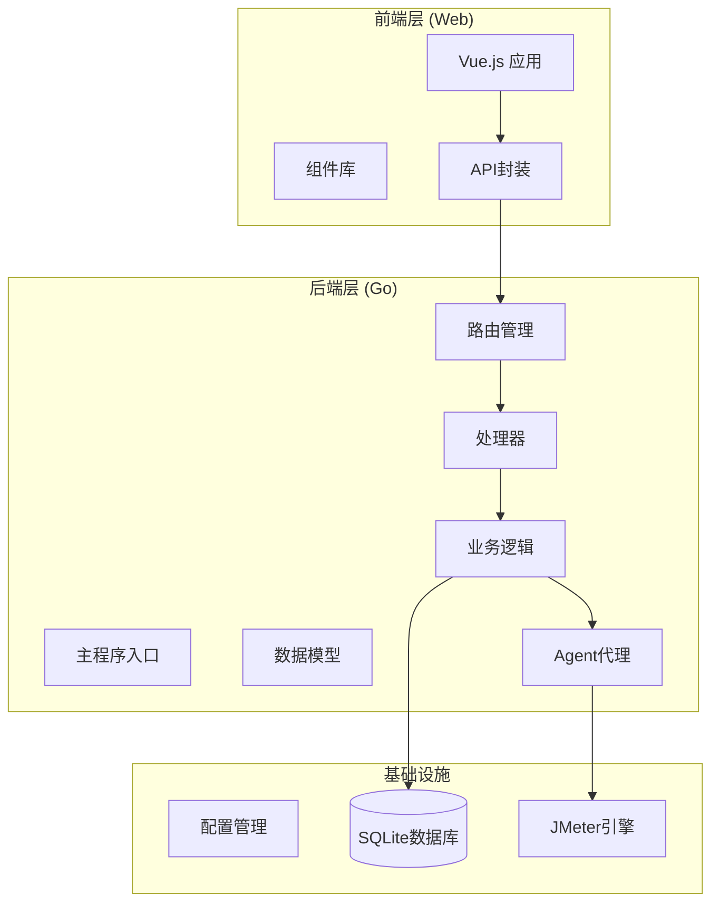
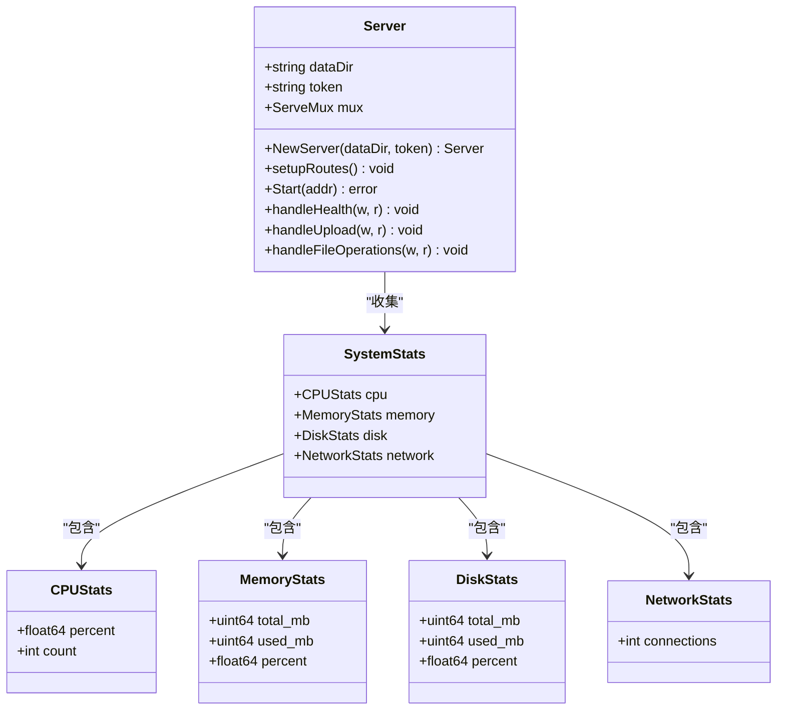
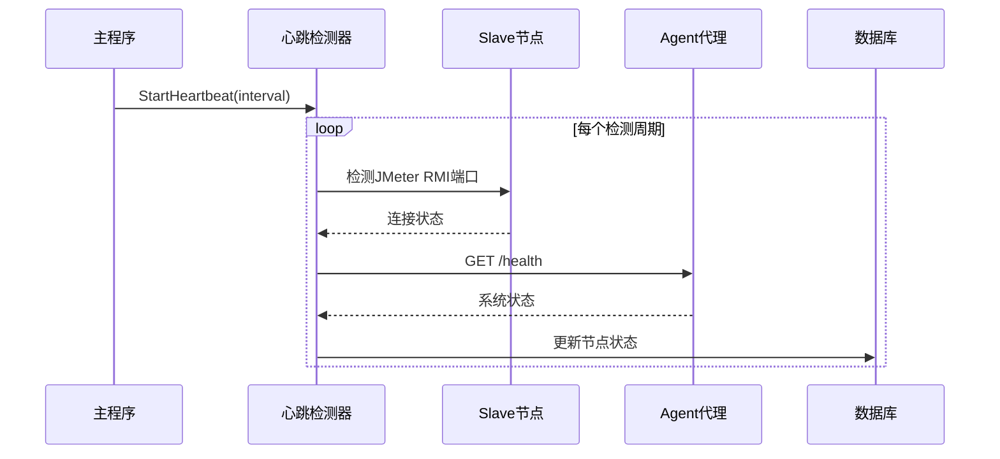
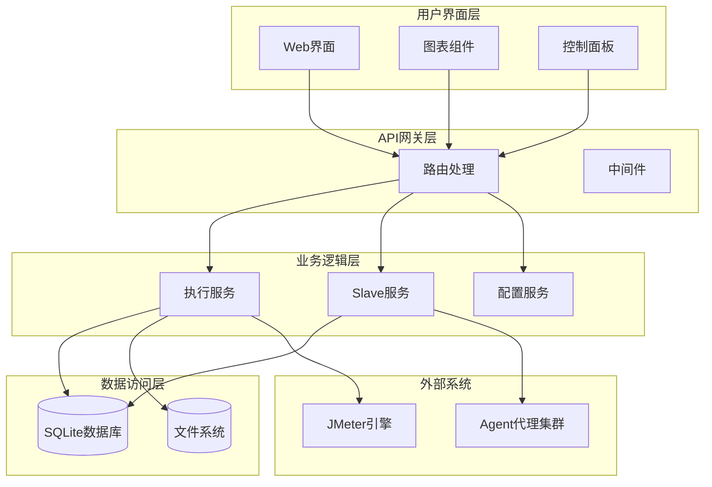
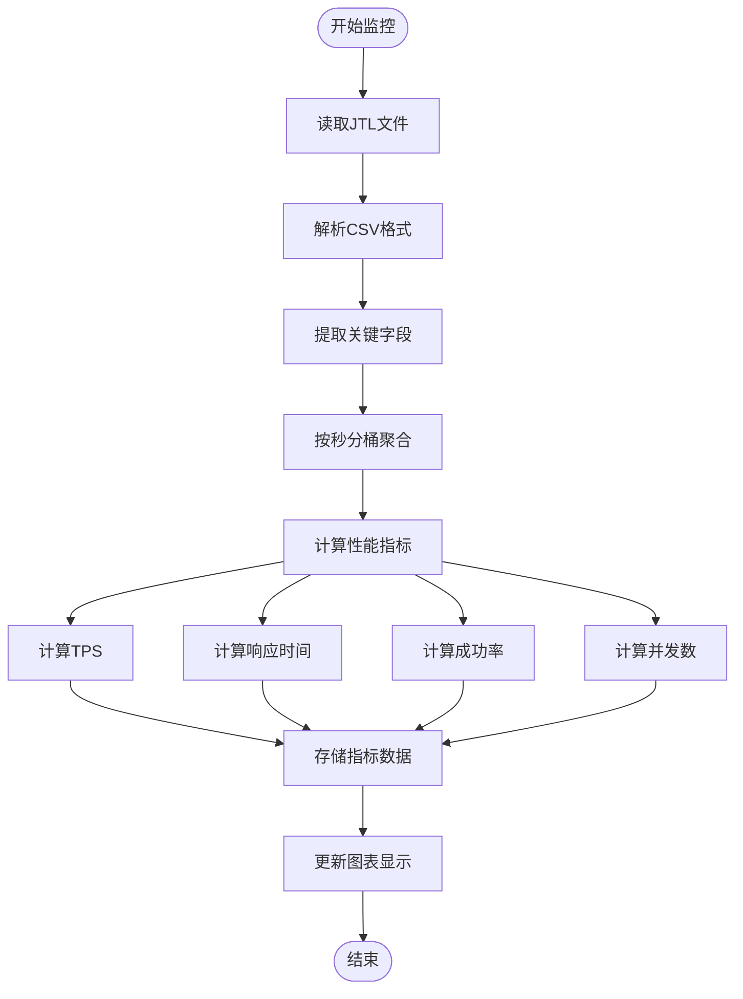
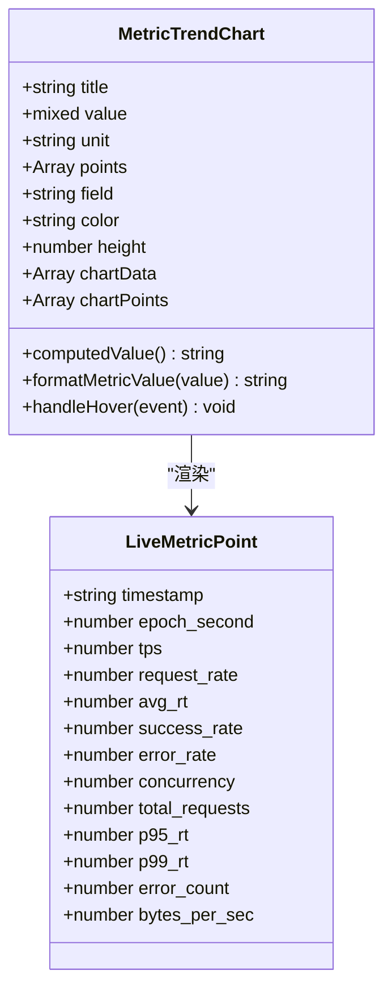
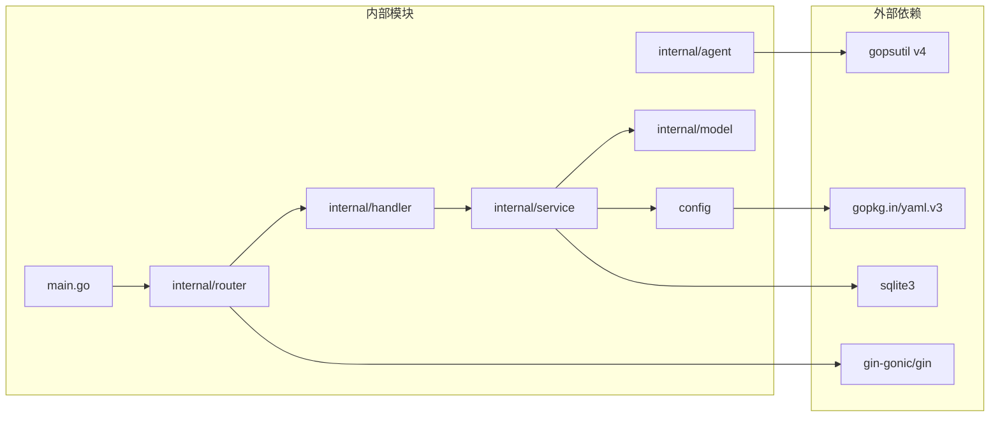

# 实时资源监控

<cite>
**本文档引用的文件**
- [main.go](file://main.go)
- [cmd/agent/main.go](file://cmd/agent/main.go)
- [internal/agent/server.go](file://internal/agent/server.go)
- [internal/router/router.go](file://internal/router/router.go)
- [config/config.go](file://config/config.go)
- [internal/handler/slave.go](file://internal/handler/slave.go)
- [internal/service/slave.go](file://internal/service/slave.go)
- [internal/model/slave.go](file://internal/model/slave.go)
- [internal/handler/execution.go](file://internal/handler/execution.go)
- [internal/service/execution.go](file://internal/service/execution.go)
- [internal/model/execution.go](file://internal/model/execution.go)
- [web/src/components/MetricTrendChart.vue](file://web/src/components/MetricTrendChart.vue)
- [web/src/api/execution.js](file://web/src/api/execution.js)
</cite>

## 目录
1. [简介](#简介)
2. [项目结构](#项目结构)
3. [核心组件](#核心组件)
4. [架构概览](#架构概览)
5. [详细组件分析](#详细组件分析)
6. [依赖关系分析](#依赖关系分析)
7. [性能考虑](#性能考虑)
8. [故障排除指南](#故障排除指南)
9. [结论](#结论)

## 简介

实时资源监控系统是一个基于JMeter的分布式性能测试管理系统，专注于提供全面的实时监控能力。该系统通过Agent代理收集Slave节点的系统资源信息，并通过Web界面实时展示这些监控数据。

系统的核心功能包括：
- **分布式资源监控**：通过Agent代理收集各Slave节点的CPU、内存、磁盘和网络连接状态
- **实时性能指标**：提供TPS、响应时间、成功率等关键性能指标的实时显示
- **心跳检测机制**：自动检测Slave节点的在线状态和健康状况
- **可视化图表**：通过SVG图表组件展示性能趋势和指标变化

## 项目结构

该项目采用Go语言开发，具有清晰的分层架构：

**图表来源**
- [main.go:28-66](file://main.go#L28-L66)
- [internal/router/router.go:14-117](file://internal/router/router.go#L14-L117)

**章节来源**
- [main.go:1-83](file://main.go#L1-L83)
- [internal/router/router.go:1-134](file://internal/router/router.go#L1-L134)

## 核心组件

### Agent代理服务

Agent代理是实时监控系统的关键组件，负责在各个Slave节点上收集系统资源信息。

**图表来源**
- [internal/agent/server.go:89-113](file://internal/agent/server.go#L89-L113)
- [internal/agent/server.go:25-51](file://internal/agent/server.go#L25-L51)

### 心跳检测系统

系统实现了自动化的Slave节点心跳检测机制：

**图表来源**
- [internal/service/slave.go:448-459](file://internal/service/slave.go#L448-L459)
- [internal/service/slave.go:461-523](file://internal/service/slave.go#L461-L523)

**章节来源**
- [internal/agent/server.go:1-326](file://internal/agent/server.go#L1-L326)
- [internal/service/slave.go:1-524](file://internal/service/slave.go#L1-L524)

## 架构概览

系统采用分层架构设计，实现了前后端分离和职责明确的模块划分：

**图表来源**
- [internal/router/router.go:14-117](file://internal/router/router.go#L14-L117)
- [main.go:28-66](file://main.go#L28-L66)

## 详细组件分析

### 实时性能指标系统

系统通过分析JTL结果文件实时计算各种性能指标：

**图表来源**
- [internal/service/execution.go:882-1010](file://internal/service/execution.go#L882-L1010)
- [internal/service/execution.go:1115-1129](file://internal/service/execution.go#L1115-L1129)

### 资源监控数据模型

系统定义了完整的资源监控数据结构：

| 组件 | 字段 | 类型 | 描述 |
|------|------|------|------|
| SystemStats | cpu | CPUStats | CPU使用率和核心数 |
| SystemStats | memory | MemoryStats | 内存总量和使用情况 |
| SystemStats | disk | DiskStats | 磁盘空间使用情况 |
| SystemStats | network | NetworkStats | 网络连接数 |
| CPUStats | percent | float64 | CPU使用百分比 |
| CPUStats | count | int | CPU核心数 |
| MemoryStats | total_mb | uint64 | 总内存(MB) |
| MemoryStats | used_mb | uint64 | 已用内存(MB) |
| MemoryStats | percent | float64 | 内存使用百分比 |
| DiskStats | total_mb | uint64 | 总磁盘(MB) |
| DiskStats | used_mb | uint64 | 已用磁盘(MB) |
| DiskStats | percent | float64 | 磁盘使用百分比 |
| NetworkStats | connections | int | 网络连接数 |

**章节来源**
- [internal/agent/server.go:25-51](file://internal/agent/server.go#L25-L51)
- [internal/model/slave.go:3-30](file://internal/model/slave.go#L3-L30)

### 前端可视化组件

前端使用Vue.js构建了丰富的可视化组件：

**图表来源**
- [web/src/components/MetricTrendChart.vue:142-341](file://web/src/components/MetricTrendChart.vue#L142-L341)
- [internal/service/execution.go:1889-1908](file://internal/service/execution.go#L1889-L1908)

**章节来源**
- [web/src/components/MetricTrendChart.vue:1-526](file://web/src/components/MetricTrendChart.vue#L1-L526)
- [web/src/api/execution.js:1-88](file://web/src/api/execution.js#L1-L88)

## 依赖关系分析

系统的主要依赖关系如下：

**图表来源**
- [internal/agent/server.go:3-19](file://internal/agent/server.go#L3-L19)
- [internal/router/router.go:3-12](file://internal/router/router.go#L3-L12)

**章节来源**
- [go.mod](file://go.mod)
- [go.sum](file://go.sum)

## 性能考虑

### 并发处理优化

系统在多个层面实现了性能优化：

1. **心跳检测并发控制**：使用信号量限制同时检测的Slave节点数量
2. **CSV文件处理**：采用流式读取避免大文件内存占用
3. **数据库连接池**：合理配置数据库连接数
4. **缓存策略**：对频繁访问的数据进行缓存

### 内存管理

- **JVM参数动态计算**：根据系统可用内存动态调整JMeter JVM参数
- **文件处理优化**：使用bufio.Scanner进行高效文件读取
- **数据结构优化**：使用sync.Map提高并发访问性能

### 网络通信优化

- **HTTP客户端复用**：避免重复创建HTTP连接
- **超时控制**：合理设置网络操作超时时间
- **错误重试机制**：对临时性网络错误进行自动重试

## 故障排除指南

### 常见问题及解决方案

| 问题类型 | 症状 | 可能原因 | 解决方案 |
|----------|------|----------|----------|
| Agent无法连接 | /health返回401 | Token配置错误 | 检查Agent配置中的token |
| Slave节点离线 | 心跳检测显示offline | 网络连接问题 | 检查Slave节点网络连通性 |
| 性能指标不更新 | 图表无数据变化 | JTL文件读取失败 | 检查JTL文件权限和路径 |
| 内存不足 | 系统响应缓慢 | JVM内存配置过低 | 调整JVM参数配置 |

### 调试工具

系统提供了多种调试和监控工具：

1. **健康检查端点**：`/api/slaves/:id/check` 获取详细的诊断信息
2. **日志流**：SSE方式实时输出执行日志
3. **系统状态**：Agent的`/health`端点提供系统资源状态
4. **配置验证**：检查配置文件格式和参数有效性

**章节来源**
- [internal/handler/slave.go:111-144](file://internal/handler/slave.go#L111-L144)
- [internal/service/slave.go:195-247](file://internal/service/slave.go#L195-L247)

## 结论

实时资源监控系统通过精心设计的架构和实现，为JMeter分布式性能测试提供了全面的监控能力。系统的主要优势包括：

1. **全面的监控覆盖**：从系统资源到应用性能的多层次监控
2. **实时性保障**：通过Agent代理和SSE技术实现实时数据更新
3. **可视化展示**：丰富的图表组件提供直观的数据展示
4. **高可用性**：心跳检测和故障转移机制确保系统稳定性
5. **易扩展性**：模块化设计便于功能扩展和维护

该系统为性能测试团队提供了强大的工具，能够有效监控分布式环境下的系统状态，及时发现和解决性能问题，提高测试效率和质量。