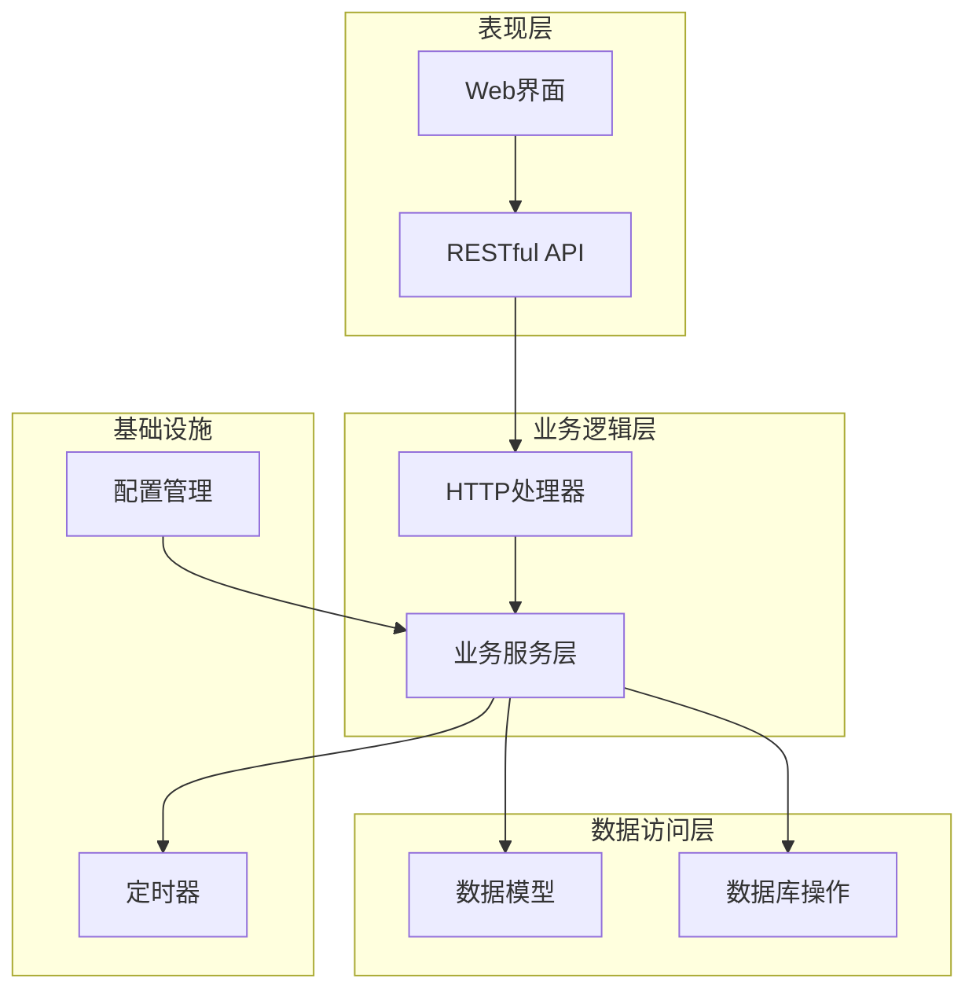
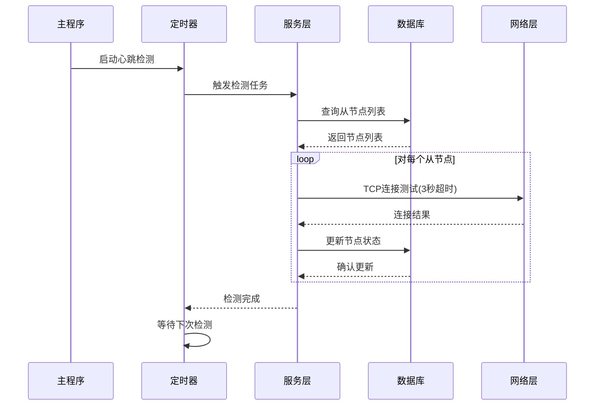
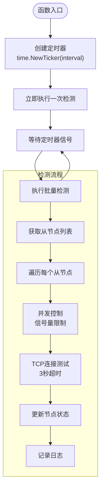
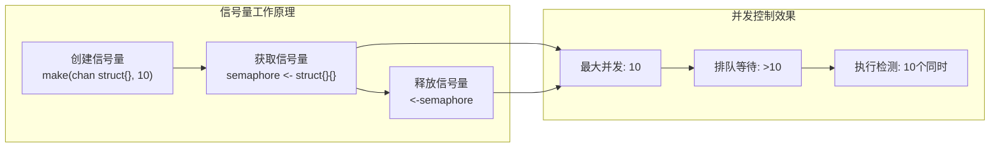
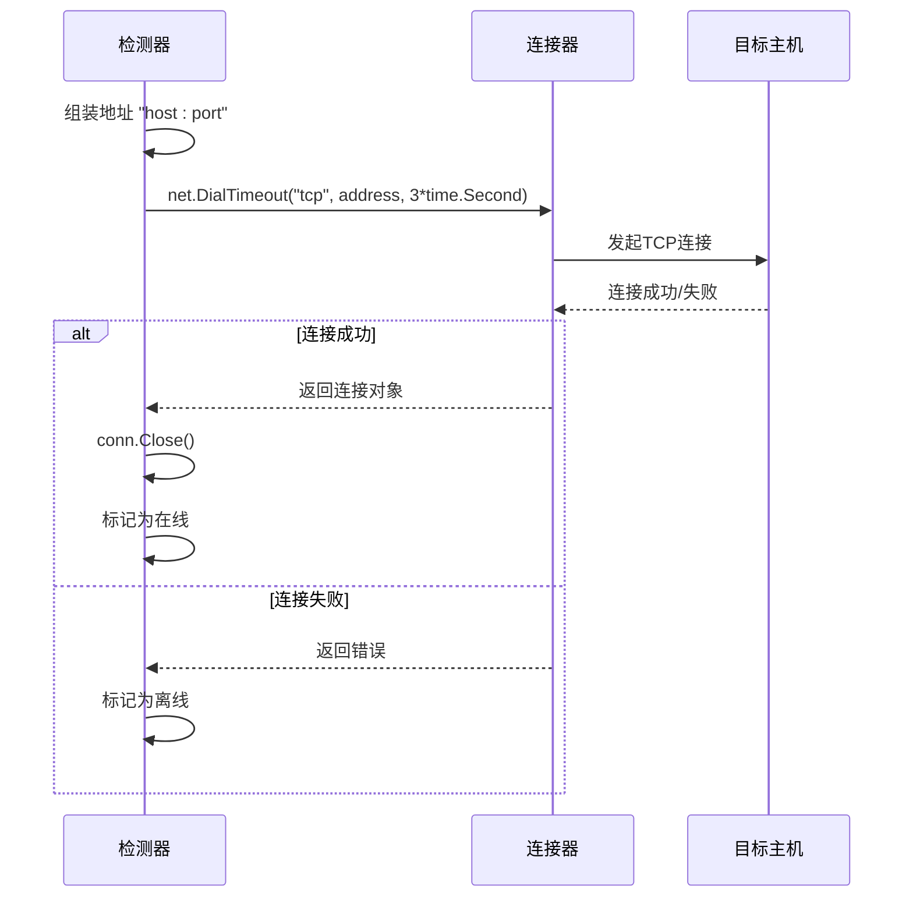
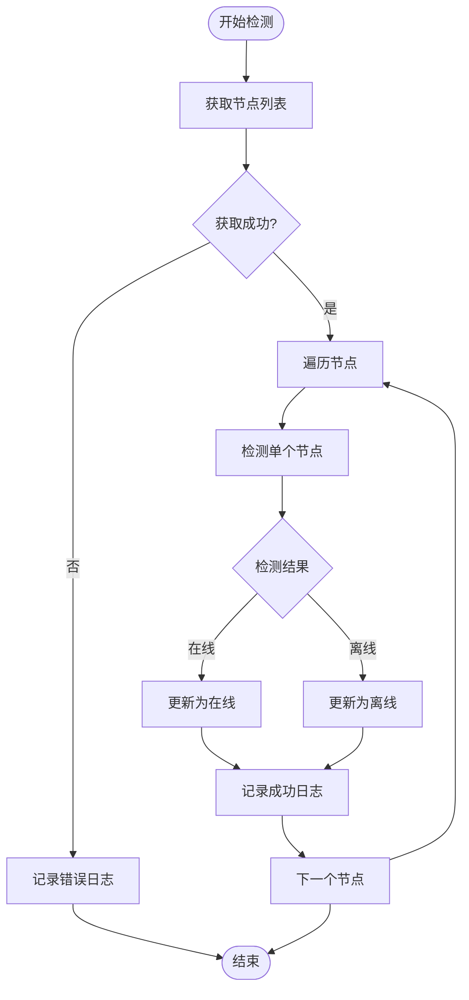
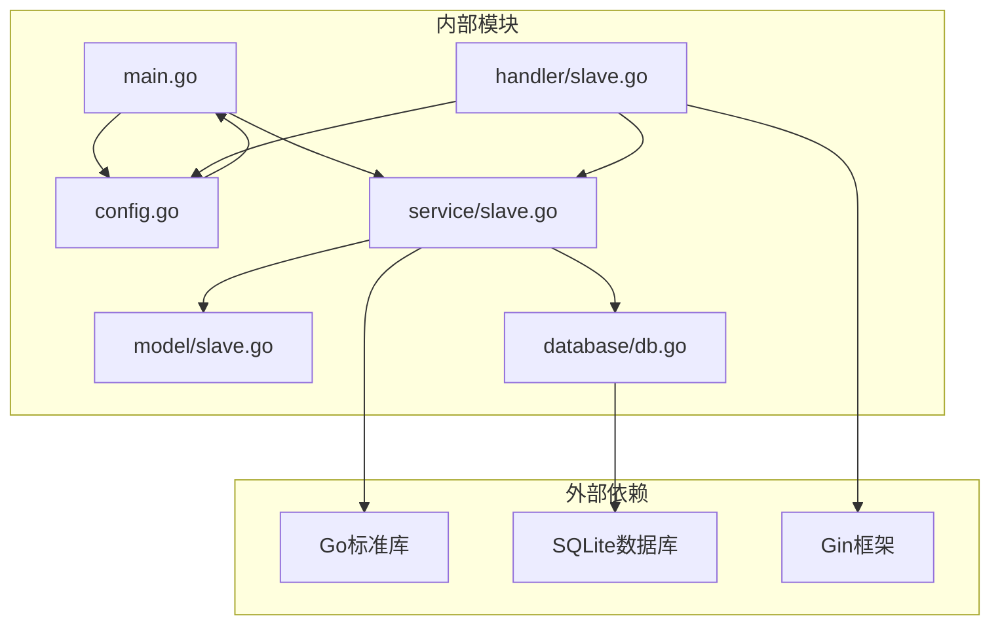

# 心跳检测机制

<cite>
**本文档引用的文件**
- [internal/service/slave.go](file://internal/service/slave.go)
- [main.go](file://main.go)
- [config/config.go](file://config/config.go)
- [internal/model/slave.go](file://internal/model/slave.go)
- [internal/handler/slave.go](file://internal/handler/slave.go)
- [internal/database/db.go](file://internal/database/db.go)
- [config.yaml](file://config.yaml)
</cite>

## 目录
1. [简介](#简介)
2. [项目结构](#项目结构)
3. [核心组件](#核心组件)
4. [架构概览](#架构概览)
5. [详细组件分析](#详细组件分析)
6. [依赖关系分析](#依赖关系分析)
7. [性能考虑](#性能考虑)
8. [故障排查指南](#故障排查指南)
9. [结论](#结论)

## 简介

心跳检测机制是JMeter Admin系统中用于监控从节点（Slave）连通性的核心功能。该机制通过定时检查每个从节点的TCP连接状态，实时更新节点状态，并提供统一的监控界面。系统采用Go语言实现，具有高并发、低延迟的特点，能够有效保障分布式测试环境的稳定性。

## 项目结构

JMeter Admin采用分层架构设计，心跳检测功能主要分布在以下层次：



**图表来源**
- [main.go:28-66](file://main.go#L28-L66)
- [internal/service/slave.go:159-170](file://internal/service/slave.go#L159-L170)

**章节来源**
- [main.go:1-83](file://main.go#L1-L83)
- [internal/service/slave.go:1-220](file://internal/service/slave.go#L1-L220)

## 核心组件

心跳检测系统由以下核心组件构成：

### 1. 定时调度器
- **StartHeartbeat函数**：启动主定时器，负责周期性触发心跳检测
- **时间间隔配置**：支持可配置的检测间隔，默认30秒
- **立即执行机制**：应用启动时立即执行一次检测

### 2. 并发控制中心
- **信号量机制**：限制最大并发连接数为10个
- **goroutine池管理**：动态管理检测任务的并发执行
- **资源保护**：防止过多并发连接导致系统资源耗尽

### 3. 网络检测引擎
- **TCP连接超时**：设置3秒超时时间
- **连通性验证**：通过net.DialTimeout进行网络连通性测试
- **状态判断**：根据连接结果更新节点状态

### 4. 数据持久化层
- **状态更新**：实时更新节点在线/离线状态
- **时间戳记录**：记录每次检测的时间
- **原子性保证**：确保状态更新的一致性

**章节来源**
- [internal/service/slave.go:159-170](file://internal/service/slave.go#L159-L170)
- [internal/service/slave.go:172-219](file://internal/service/slave.go#L172-L219)
- [internal/service/slave.go:132-156](file://internal/service/slave.go#L132-L156)

## 架构概览

心跳检测机制的整体架构如下：



**图表来源**
- [main.go:50-55](file://main.go#L50-L55)
- [internal/service/slave.go:159-170](file://internal/service/slave.go#L159-L170)
- [internal/service/slave.go:172-219](file://internal/service/slave.go#L172-L219)

## 详细组件分析

### StartHeartbeat函数调度机制

StartHeartbeat函数实现了心跳检测的核心调度逻辑：



**图表来源**
- [internal/service/slave.go:159-170](file://internal/service/slave.go#L159-L170)
- [internal/service/slave.go:172-219](file://internal/service/slave.go#L172-L219)

#### 时间间隔配置
- **配置来源**：config.yaml中的heartbeat_interval字段
- **默认值**：30秒
- **最小值**：1秒（当配置为0时自动调整）
- **单位转换**：从秒转换为time.Duration类型

#### 调度策略
- **立即执行**：应用启动时立即执行一次检测
- **周期执行**：按照配置的时间间隔定期执行
- **优雅停止**：使用defer ticker.Stop()确保资源正确释放

**章节来源**
- [main.go:50-55](file://main.go#L50-L55)
- [config/config.go:31-33](file://config/config.go#L31-L33)
- [config.yaml:18-19](file://config.yaml#L18-L19)

### checkAllSlaves函数批量检测流程

checkAllSlaves函数实现了从节点的批量检测逻辑：

```mermaid
classDiagram
class CheckAllSlaves {
+ListSlaves() []Slave
+semaphore chan struct{}
+wg sync.WaitGroup
+checkAllSlaves()
}
class Slave {
+int64 ID
+string Name
+string Host
+int Port
+string Status
+string LastCheckTime
+string CreatedAt
}
class Semaphore {
+chan struct{} semaphore
+int maxConcurrent
}
class NetworkTest {
+DialTimeout(address, timeout)
+TCPConnection
}
CheckAllSlaves --> Slave : "批量处理"
CheckAllSlaves --> Semaphore : "并发控制"
CheckAllSlaves --> NetworkTest : "网络检测"
Slave --> NetworkTest : "被检测"
```

**图表来源**
- [internal/service/slave.go:172-219](file://internal/service/slave.go#L172-L219)
- [internal/model/slave.go:3-11](file://internal/model/slave.go#L3-L11)

#### 并发控制策略
- **信号量实现**：使用make(chan struct{}, 10)创建容量为10的信号量
- **获取信号量**：semaphore <- struct{}{}获取执行许可
- **释放信号量**：defer func() { <-semaphore }()释放执行许可
- **goroutine管理**：使用sync.WaitGroup等待所有检测任务完成

#### 批量检测流程
1. **获取节点列表**：从数据库查询所有从节点
2. **并发初始化**：为每个节点启动独立的检测goroutine
3. **网络测试**：对每个节点执行TCP连接测试
4. **状态更新**：根据测试结果更新节点状态
5. **日志记录**：记录每次检测的详细信息

**章节来源**
- [internal/service/slave.go:172-219](file://internal/service/slave.go#L172-L219)

### 信号量机制详解

信号量机制是心跳检测系统的关键并发控制组件：



**图表来源**
- [internal/service/slave.go:179-189](file://internal/service/slave.go#L179-L189)

#### 信号量特性
- **容量限制**：最多同时允许10个检测任务执行
- **阻塞行为**：超过10个任务时，额外的任务会被阻塞直到有空位
- **资源保护**：防止大量并发连接导致系统资源耗尽
- **自动恢复**：每个任务完成后自动释放信号量

#### 并发优势
- **性能提升**：并行检测多个从节点，提高整体检测效率
- **资源控制**：避免过度并发造成系统负载过高
- **稳定性保障**：通过限流机制确保系统稳定运行

**章节来源**
- [internal/service/slave.go:179-189](file://internal/service/slave.go#L179-L189)

### TCP连接超时设置与网络检测

网络检测模块实现了精确的TCP连接超时控制：



**图表来源**
- [internal/service/slave.go:132-156](file://internal/service/slave.go#L132-L156)
- [internal/service/slave.go:190-214](file://internal/service/slave.go#L190-L214)

#### 超时机制
- **超时时间**：3秒（time.Duration类型）
- **超时原因**：网络延迟、目标主机不可达、端口未开放
- **错误处理**：超时被视为连接失败，标记为离线状态

#### 网络检测策略
- **TCP协议**：使用TCP连接而非UDP，确保检测准确性
- **端口验证**：检测指定端口的连通性，而非仅IP可达性
- **快速反馈**：超时机制确保检测不会无限期等待

**章节来源**
- [internal/service/slave.go:132-156](file://internal/service/slave.go#L132-L156)
- [internal/service/slave.go:190-214](file://internal/service/slave.go#L190-L214)

### 日志记录与错误处理机制

系统实现了完善的日志记录和错误处理机制：

#### 日志记录策略
- **检测结果日志**：记录每次检测的节点名称、地址和状态
- **错误日志**：记录数据库操作失败等异常情况
- **格式化输出**：使用统一的日志格式便于追踪和分析

#### 错误处理层次
- **节点列表获取**：数据库查询失败时记录错误并跳过本次检测
- **单节点检测**：单个节点检测失败不影响其他节点的检测
- **状态更新**：数据库状态更新失败时记录错误但继续执行



**图表来源**
- [internal/service/slave.go:174-176](file://internal/service/slave.go#L174-L176)
- [internal/service/slave.go:210-214](file://internal/service/slave.go#L210-L214)

**章节来源**
- [internal/service/slave.go:174-176](file://internal/service/slave.go#L174-L176)
- [internal/service/slave.go:210-214](file://internal/service/slave.go#L210-L214)

### 节点状态更新的原子性与一致性

节点状态更新机制确保了数据的一致性和可靠性：

#### 状态更新流程
1. **状态计算**：根据网络检测结果确定新状态
2. **时间戳记录**：记录本次检测的时间
3. **数据库更新**：原子性地更新节点状态和检测时间
4. **结果确认**：验证更新操作的成功与否

#### 一致性保证
- **单点更新**：每个节点的状态更新是独立的，避免相互影响
- **时间戳同步**：更新状态时同时记录最新的检测时间
- **错误隔离**：单个节点的更新失败不会影响其他节点的状态

**章节来源**
- [internal/service/slave.go:144-156](file://internal/service/slave.go#L144-L156)
- [internal/service/slave.go:202-214](file://internal/service/slave.go#L202-L214)

## 依赖关系分析

心跳检测系统的依赖关系如下：



**图表来源**
- [main.go:3-14](file://main.go#L3-L14)
- [internal/service/slave.go:3-13](file://internal/service/slave.go#L3-L13)
- [internal/handler/slave.go:3-14](file://internal/handler/slave.go#L3-L14)

### 关键依赖关系
- **main.go**依赖**config.go**和**service.go**进行配置加载和功能启动
- **service/slave.go**依赖**database/db.go**和**model/slave.go**进行数据操作
- **handler/slave.go**依赖**service.go**和**config.go**提供API接口
- **config.go**提供全局配置管理，包括心跳间隔等参数

**章节来源**
- [main.go:3-14](file://main.go#L3-L14)
- [internal/service/slave.go:3-13](file://internal/service/slave.go#L3-L13)
- [internal/handler/slave.go:3-14](file://internal/handler/slave.go#L3-L14)

## 性能考虑

### 并发优化策略
- **信号量限制**：通过10个并发连接限制，平衡检测速度和系统负载
- **异步处理**：使用goroutine实现非阻塞的并发检测
- **资源复用**：检测完成后及时关闭TCP连接，释放系统资源

### 内存管理
- **goroutine池**：使用WaitGroup确保goroutine正确退出
- **通道缓冲**：信号量通道的缓冲设计避免不必要的阻塞
- **数据库连接**：合理使用数据库连接池，避免连接泄漏

### 网络优化
- **超时控制**：3秒超时确保检测不会无限等待
- **连接复用**：检测完成后立即关闭连接，避免连接池污染
- **错误快速反馈**：网络错误时立即返回，不占用检测资源

## 故障排查指南

### 常见问题诊断

#### 心跳检测不执行
1. **检查配置文件**：确认heartbeat_interval设置是否正确
2. **查看日志输出**：检查是否有启动错误信息
3. **验证数据库连接**：确认数据库初始化是否成功

#### 检测结果异常
1. **网络连通性**：使用telnet或nc命令测试目标节点端口
2. **防火墙设置**：检查目标节点防火墙是否允许连接
3. **超时设置**：适当调整超时时间以适应网络环境

#### 并发问题
1. **信号量阻塞**：检查是否存在大量节点同时检测导致的阻塞
2. **资源泄漏**：确认goroutine和数据库连接是否正确释放
3. **数据库锁竞争**：检查是否存在数据库写入冲突

### 调试技巧
- **增加日志级别**：在开发环境中增加详细的日志输出
- **性能监控**：使用pprof工具监控CPU和内存使用情况
- **网络抓包**：使用tcpdump或Wireshark分析网络通信

**章节来源**
- [internal/service/slave.go:174-176](file://internal/service/slave.go#L174-L176)
- [internal/service/slave.go:210-214](file://internal/service/slave.go#L210-L214)

## 结论

JMeter Admin的心跳检测机制通过精心设计的架构和实现，提供了高效、可靠的从节点监控能力。系统采用定时调度、信号量并发控制、TCP连接超时等技术手段，确保了检测的准确性和系统的稳定性。

### 主要优势
- **高并发处理**：通过信号量机制实现10个节点的并发检测
- **精确超时控制**：3秒超时确保检测的及时性
- **完整日志记录**：提供详细的检测过程和结果记录
- **错误隔离机制**：单个节点的失败不影响整体检测

### 改进建议
- **动态并发调整**：根据系统负载动态调整并发数量
- **智能重试机制**：对临时网络故障实施智能重试
- **性能指标监控**：增加检测性能指标的统计和分析
- **告警通知机制**：集成邮件或消息通知功能

该心跳检测机制为JMeter分布式测试环境提供了坚实的技术基础，确保了测试执行的可靠性和稳定性。