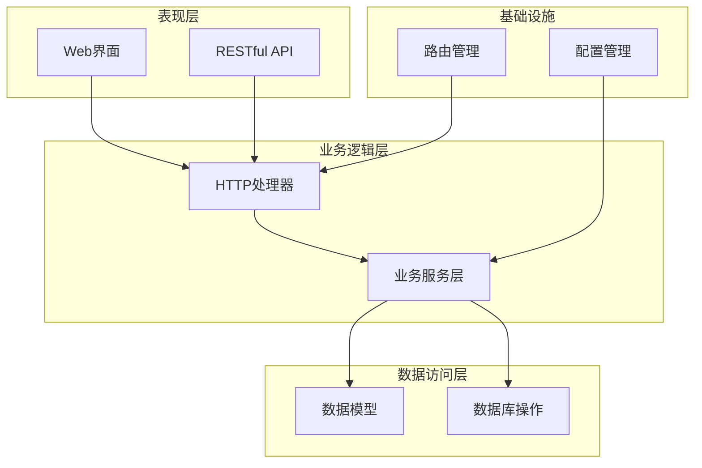
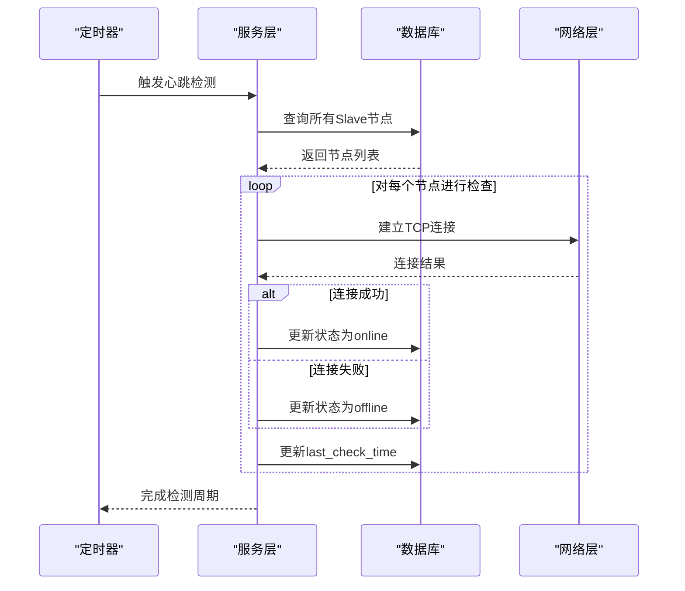
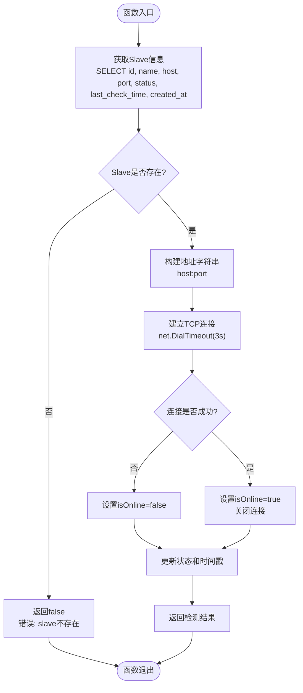
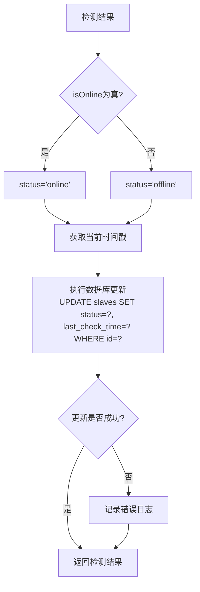
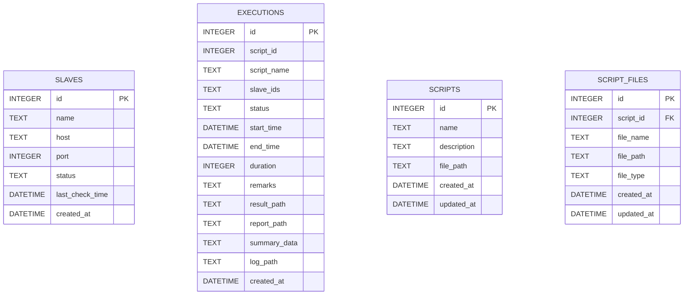
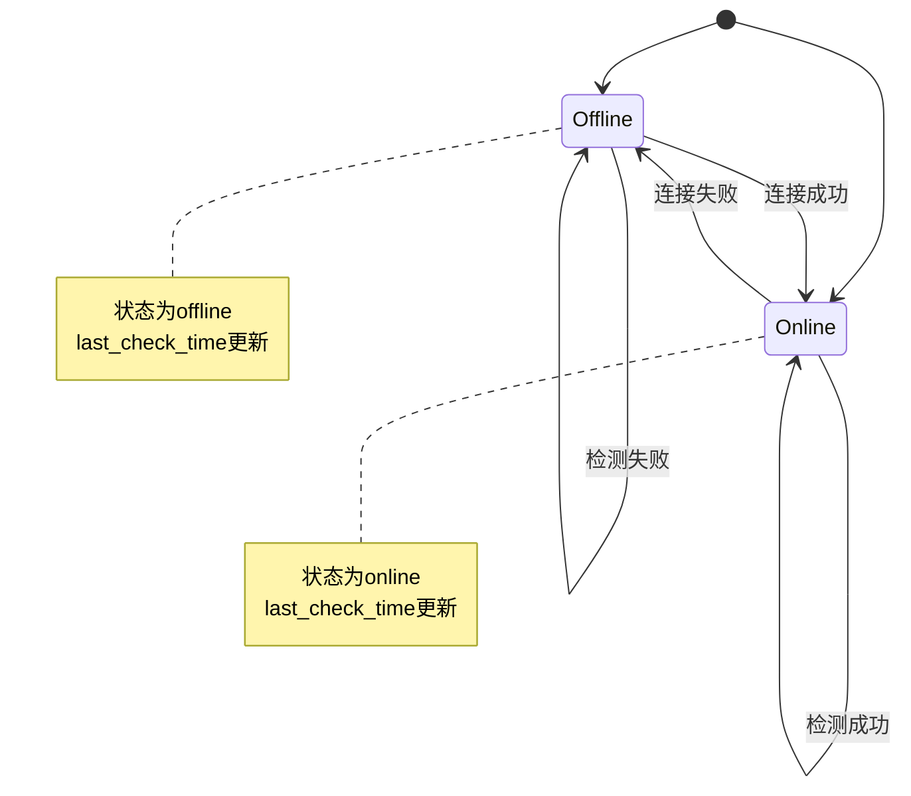
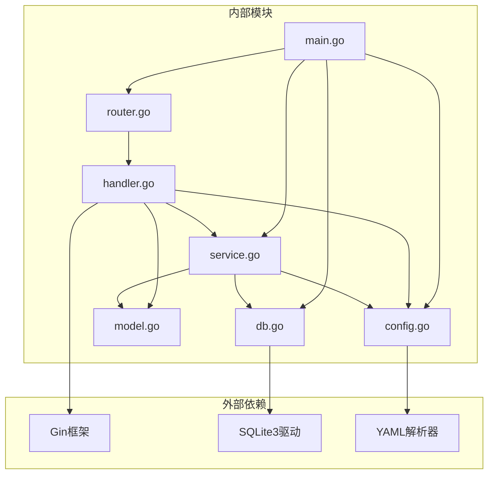
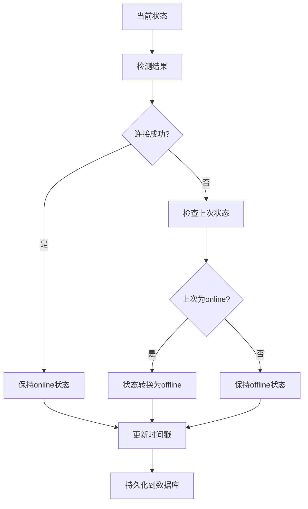

# 连通性验证与状态管理

<cite>
**本文档引用的文件**
- [main.go](file://main.go)
- [config/config.go](file://config/config.go)
- [config.yaml](file://config.yaml)
- [internal/service/slave.go](file://internal/service/slave.go)
- [internal/model/slave.go](file://internal/model/slave.go)
- [internal/database/db.go](file://internal/database/db.go)
- [internal/handler/slave.go](file://internal/handler/slave.go)
- [internal/router/router.go](file://internal/router/router.go)
- [internal/model/response.go](file://internal/model/response.go)
</cite>

## 目录
1. [简介](#简介)
2. [项目结构](#项目结构)
3. [核心组件](#核心组件)
4. [架构概览](#架构概览)
5. [详细组件分析](#详细组件分析)
6. [依赖关系分析](#依赖关系分析)
7. [性能考虑](#性能考虑)
8. [故障排除指南](#故障排除指南)
9. [结论](#结论)

## 简介

本文档深入解析JMeter Admin项目中的连通性验证与状态管理系统。该系统负责监控JMeter Slave节点的网络连通性，实现自动化的状态检测、状态转换和持久化管理。系统采用心跳检测机制，通过定时任务对所有Slave节点进行连通性检查，并将状态变化持久化到SQLite数据库中。

## 项目结构

JMeter Admin项目采用分层架构设计，主要包含以下层次：



**图表来源**
- [main.go:28-66](file://main.go#L28-L66)
- [internal/router/router.go:14-112](file://internal/router/router.go#L14-L112)

**章节来源**
- [main.go:1-83](file://main.go#L1-L83)
- [internal/router/router.go:1-129](file://internal/router/router.go#L1-L129)

## 核心组件

### 主要职责分配

1. **主程序入口** (`main.go`)
   - 应用程序启动和初始化
   - 配置加载和目录创建
   - 数据库初始化和清理
   - 心跳检测服务启动
   - HTTP服务器启动

2. **配置管理** (`config/config.go`, `config.yaml`)
   - 全局配置结构定义
   - 默认配置设置
   - 配置文件读取和保存
   - 心跳检测间隔配置

3. **业务服务层** (`internal/service/slave.go`)
   - 单节点连通性检测
   - 批量心跳检测
   - 状态管理和持久化
   - 并发控制和限流

4. **数据模型** (`internal/model/slave.go`)
   - Slave节点数据结构
   - 状态字段定义
   - 时间戳字段规范

5. **数据库层** (`internal/database/db.go`)
   - SQLite数据库初始化
   - 表结构创建和迁移
   - 数据库连接管理

**章节来源**
- [main.go:19-66](file://main.go#L19-L66)
- [config/config.go:10-41](file://config/config.go#L10-L41)
- [internal/service/slave.go:1-220](file://internal/service/slave.go#L1-L220)
- [internal/model/slave.go:1-12](file://internal/model/slave.go#L1-L12)
- [internal/database/db.go:13-197](file://internal/database/db.go#L13-L197)

## 架构概览

系统采用事件驱动的心跳检测架构，通过定时器触发批量连通性检查：



**图表来源**
- [internal/service/slave.go:159-219](file://internal/service/slave.go#L159-L219)
- [internal/service/slave.go:172-219](file://internal/service/slave.go#L172-L219)

## 详细组件分析

### CheckSlave函数实现分析

#### 单节点检测流程

CheckSlave函数实现了精确的单节点连通性检测：



**图表来源**
- [internal/service/slave.go:112-157](file://internal/service/slave.go#L112-L157)
- [internal/service/slave.go:132-156](file://internal/service/slave.go#L132-L156)

#### TCP连接建立过程

系统使用`net.DialTimeout`进行TCP连接建立，具有以下特性：

- **超时控制**: 3秒超时限制，防止长时间阻塞
- **连接复用**: 成功连接后立即关闭，避免资源泄漏
- **错误处理**: 所有连接错误统一处理为离线状态

#### 状态更新机制

状态更新采用原子性操作：



**图表来源**
- [internal/service/slave.go:144-156](file://internal/service/slave.go#L144-L156)
- [internal/service/slave.go:202-212](file://internal/service/slave.go#L202-L212)

**章节来源**
- [internal/service/slave.go:112-157](file://internal/service/slave.go#L112-L157)

### 批量心跳检测实现

#### 并发控制策略

系统采用信号量模式控制并发连接数量：

```mermaid
classDiagram
class HeartbeatDetector {
+semaphore chan struct{}
+maxConcurrent int
+wg sync.WaitGroup
+checkAllSlaves()
+worker(slave)
}
class Semaphore {
+acquire()
+release()
}
HeartbeatDetector --> Semaphore : 使用
HeartbeatDetector --> Worker : 创建多个
```

**图表来源**
- [internal/service/slave.go:179-219](file://internal/service/slave.go#L179-L219)

#### 批量检测流程

批量检测通过`checkAllSlaves`函数实现：

1. **数据获取**: 从数据库获取所有Slave节点信息
2. **并发控制**: 使用信号量限制同时检测的节点数量（默认10个）
3. **异步检测**: 为每个节点启动独立goroutine进行检测
4. **状态更新**: 异步更新每个节点的状态和时间戳
5. **结果收集**: 等待所有检测完成

**章节来源**
- [internal/service/slave.go:159-219](file://internal/service/slave.go#L159-L219)

### 状态管理与持久化

#### 数据库设计

系统使用SQLite作为数据存储，核心表结构如下：



**图表来源**
- [internal/database/db.go:66-101](file://internal/database/db.go#L66-L101)

#### 状态转换机制

系统实现了完整的状态转换逻辑：



**图表来源**
- [internal/service/slave.go:144-156](file://internal/service/slave.go#L144-L156)
- [internal/service/slave.go:202-212](file://internal/service/slave.go#L202-L212)

**章节来源**
- [internal/database/db.go:66-101](file://internal/database/db.go#L66-L101)

### API接口设计

#### RESTful接口定义

系统提供了完整的Slave节点管理API：

| 方法 | 路径 | 功能 | 请求体 | 响应 |
|------|------|------|--------|------|
| GET | `/api/slaves` | 获取所有Slave列表 | 无 | Slave列表 |
| POST | `/api/slaves` | 创建新的Slave节点 | 名称、主机、端口 | 新创建的Slave |
| PUT | `/api/slaves/:id` | 更新Slave节点信息 | 名称、主机、端口 | 空对象 |
| DELETE | `/api/slaves/:id` | 删除Slave节点 | 无 | 空对象 |
| POST | `/api/slaves/:id/check` | 单节点连通性检测 | 无 | 在线状态 |
| GET | `/api/slaves/heartbeat-status` | 获取心跳状态 | 无 | 心跳状态列表 |

**章节来源**
- [internal/router/router.go:38-75](file://internal/router/router.go#L38-L75)
- [internal/handler/slave.go:16-236](file://internal/handler/slave.go#L16-L236)

## 依赖关系分析

### 组件依赖图



**图表来源**
- [main.go:3-14](file://main.go#L3-L14)
- [internal/router/router.go:3-12](file://internal/router/router.go#L3-L12)
- [internal/handler/slave.go:3-14](file://internal/handler/slave.go#L3-L14)

### 数据一致性保证

系统通过以下机制确保数据一致性：

1. **原子性操作**: 每次状态更新都是独立的SQL语句执行
2. **错误隔离**: 单个节点的检测失败不会影响其他节点
3. **并发安全**: 使用WaitGroup确保批量操作的完整性
4. **状态回滚**: 数据库层面不支持事务回滚，但通过幂等更新保证最终一致性

**章节来源**
- [internal/service/slave.go:179-219](file://internal/service/slave.go#L179-L219)

## 性能考虑

### 连接超时优化

系统在连接超时方面采用了平衡策略：

- **单节点检测**: 3秒超时，适合快速响应
- **批量检测**: 限制并发数为10，避免过度占用网络资源
- **心跳间隔**: 默认30秒，可根据网络环境调整

### 网络环境适配建议

针对不同网络环境，建议调整以下参数：

1. **高延迟网络**:
   - 增加连接超时时间至5-10秒
   - 减少批量检测的并发数至5-8个
   - 延长心跳检测间隔至60-120秒

2. **低延迟网络**:
   - 保持默认3秒超时
   - 可适当增加并发数至15-20个
   - 缩短心跳间隔至15-30秒

3. **不稳定网络**:
   - 增加超时时间至10秒以上
   - 减少并发数至3-5个
   - 延长心跳间隔至120秒以上

### 内存和CPU优化

- **连接池**: 系统使用短连接模式，避免连接池开销
- **并发控制**: 通过信号量限制同时检测的节点数量
- **日志输出**: 批量检测时减少日志输出频率

## 故障排除指南

### 常见网络问题诊断

#### 连接超时问题

**症状**: 所有节点状态显示为offline，检测日志显示超时

**诊断步骤**:
1. 检查目标节点的防火墙设置
2. 验证端口是否正确开放
3. 使用`telnet`或`nc`命令测试连接
4. 检查网络延迟和丢包率

**解决方案**:
- 调整连接超时时间
- 检查网络路由配置
- 验证目标节点的服务状态

#### 并发连接过多

**症状**: 批量检测时出现大量连接拒绝

**诊断步骤**:
1. 检查系统的文件描述符限制
2. 监控网络连接数
3. 分析目标节点的连接处理能力

**解决方案**:
- 降低并发检测数量
- 增加系统资源限制
- 优化目标节点的连接处理

#### 数据库连接问题

**症状**: 状态更新失败，数据库操作报错

**诊断步骤**:
1. 检查数据库文件权限
2. 验证磁盘空间充足
3. 监控数据库连接数

**解决方案**:
- 重启数据库服务
- 清理数据库文件
- 增加磁盘空间

### 状态回退机制

系统实现了智能的状态回退机制：



**图表来源**
- [internal/service/slave.go:144-156](file://internal/service/slave.go#L144-L156)

### 重试机制

系统采用被动重试策略：

1. **自动重试**: 心跳检测定时器会定期重新检测
2. **指数退避**: 通过调整心跳间隔实现自然的退避效果
3. **错误隔离**: 单个节点的失败不影响其他节点

**章节来源**
- [internal/service/slave.go:159-170](file://internal/service/slave.go#L159-L170)

## 结论

JMeter Admin项目的连通性验证与状态管理系统展现了良好的工程实践：

1. **架构清晰**: 分层设计使得各组件职责明确，便于维护和扩展
2. **性能优化**: 通过并发控制和超时管理实现了高效的连通性检测
3. **可靠性保障**: 错误处理和状态回退机制确保了系统的稳定性
4. **可配置性**: 通过配置文件支持灵活的参数调整

该系统为JMeter分布式测试环境提供了可靠的节点监控能力，能够有效识别网络异常并及时反馈给用户。通过合理的参数配置和网络环境适配，可以进一步提升系统的性能和稳定性。