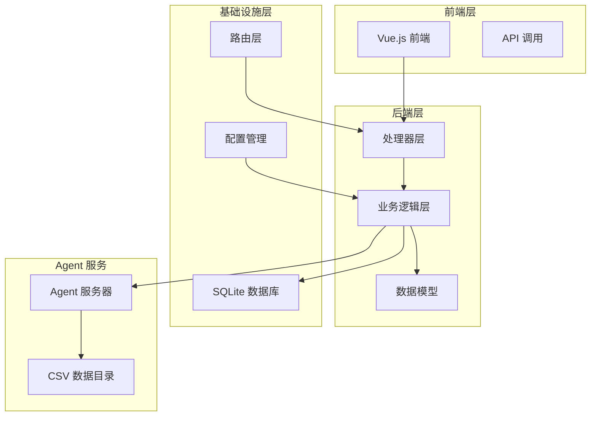
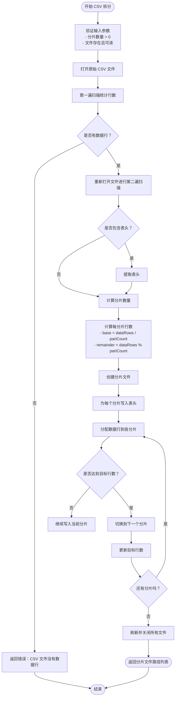
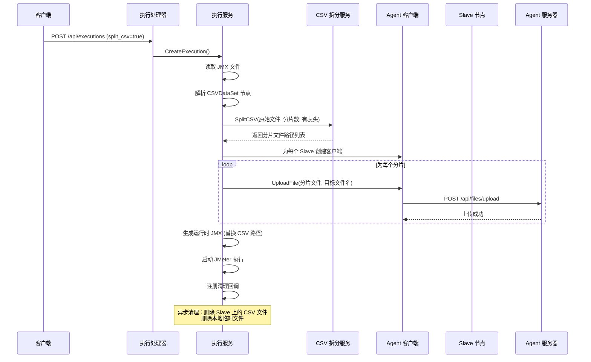
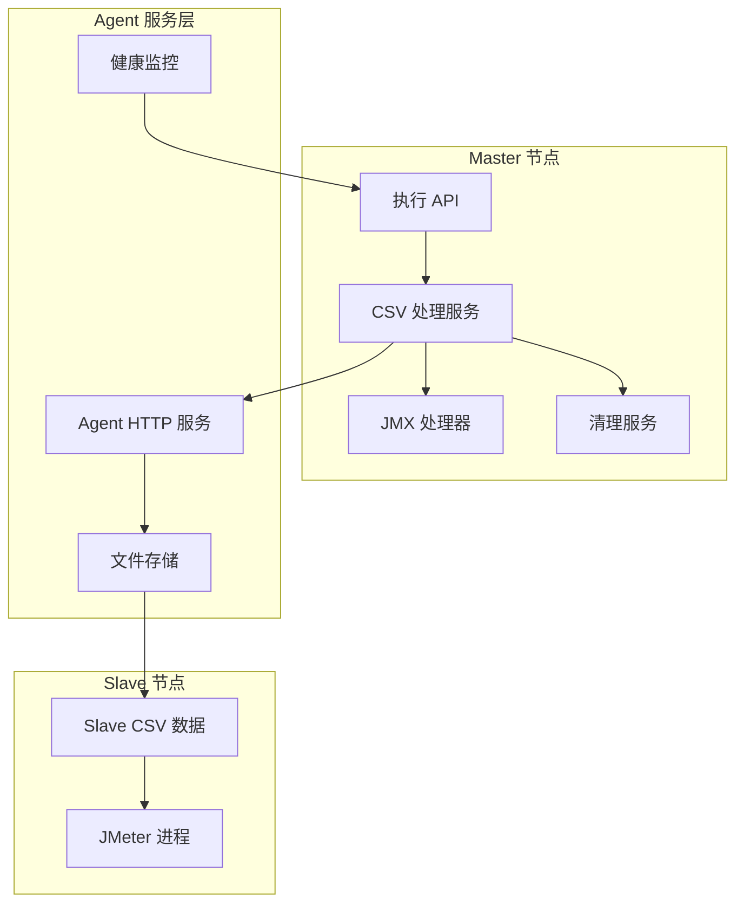
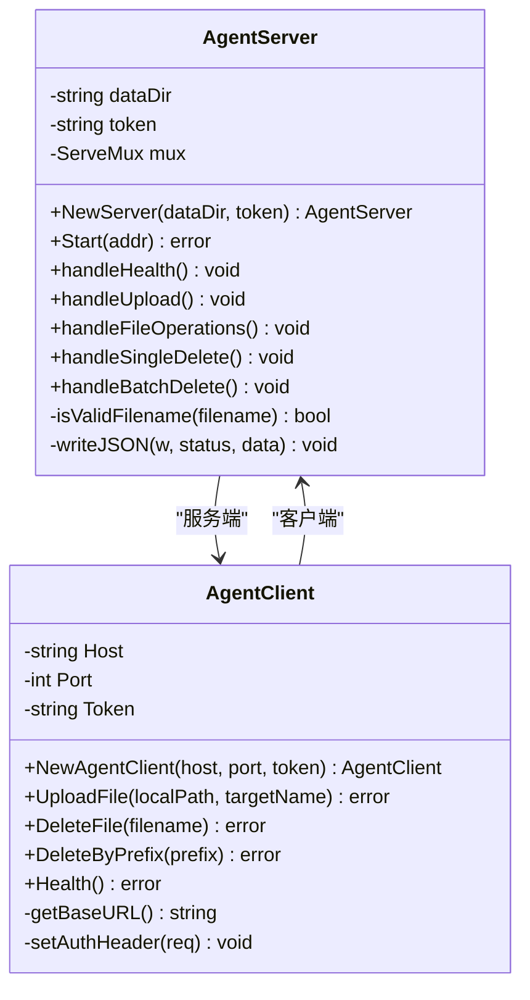
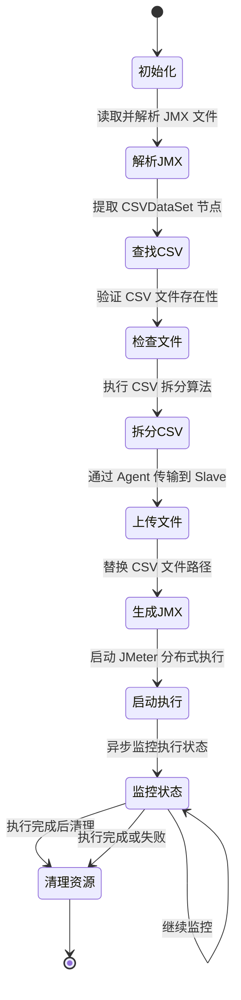
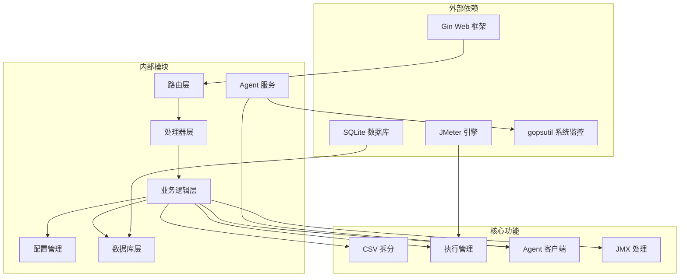

# CSV文件分布处理

<cite>
**本文档引用的文件**
- [csv_split.go](file://internal/service/csv_split.go)
- [execution.go](file://internal/service/execution.go)
- [agent_client.go](file://internal/service/agent_client.go)
- [server.go](file://internal/agent/server.go)
- [execution_handler.go](file://internal/handler/execution.go)
- [config.go](file://config/config.go)
- [main.go](file://main.go)
- [router.go](file://internal/router/router.go)
- [README.md](file://README.md)
</cite>

## 目录
1. [简介](#简介)
2. [项目结构](#项目结构)
3. [核心组件](#核心组件)
4. [架构概览](#架构概览)
5. [详细组件分析](#详细组件分析)
6. [依赖关系分析](#依赖关系分析)
7. [性能考虑](#性能考虑)
8. [故障排除指南](#故障排除指南)
9. [结论](#结论)

## 简介

JMeter Admin 是一个基于 Go 和 Vue 3 的分布式 JMeter 压测管理平台。本文档专注于其核心功能之一——CSV 文件分布处理机制。该功能允许用户将大型 CSV 数据文件自动拆分并分发到多个 JMeter Slave 节点，实现真正的分布式负载测试。

系统的核心特性包括：
- **智能 CSV 拆分**：基于行数的均匀分割算法
- **自动文件分发**：通过 Agent 服务将 CSV 文件传输到各个 Slave 节点
- **动态 JMX 修改**：自动更新 JMX 脚本中的 CSV 文件路径
- **资源清理**：执行完成后自动清理临时文件
- **流式处理**：支持大文件的高效处理

## 项目结构

JMeter Admin 采用典型的三层架构设计：

**图表来源**
- [main.go:28-66](file://main.go#L28-L66)
- [router.go:14-117](file://internal/router/router.go#L14-L117)

**章节来源**
- [README.md:118-152](file://README.md#L118-L152)
- [main.go:19-66](file://main.go#L19-L66)

## 核心组件

### CSV 拆分服务

CSV 拆分功能位于 `internal/service/csv_split.go`，提供了高效的文件分割算法：

**图表来源**
- [csv_split.go:17-144](file://internal/service/csv_split.go#L17-L144)

### 执行协调服务

在 `internal/service/execution.go` 中，CSV 分发与执行流程紧密集成：

**图表来源**
- [execution.go:239-370](file://internal/service/execution.go#L239-L370)
- [agent_client.go:42-99](file://internal/service/agent_client.go#L42-L99)

**章节来源**
- [csv_split.go:10-145](file://internal/service/csv_split.go#L10-L145)
- [execution.go:132-686](file://internal/service/execution.go#L132-L686)

## 架构概览

JMeter Admin 的 CSV 分布处理架构采用分布式设计理念：

**图表来源**
- [execution.go:240-370](file://internal/service/execution.go#L240-L370)
- [server.go:105-142](file://internal/agent/server.go#L105-L142)

### 配置管理

系统通过 `config/config.go` 提供灵活的配置选项：

| 配置项 | 默认值 | 说明 |
|--------|--------|------|
| `server.port` | 8080 | HTTP 服务监听端口 |
| `jmeter.path` | "jmeter" | JMeter 可执行文件路径 |
| `jmeter.master_hostname` | "" | Master 主机名（多网卡时必需） |
| `jmeter.agent_csv_data_dir` | "/opt/jmeter/csv-data" | Agent CSV 数据目录 |
| `slave.heartbeat_interval` | 30 | Slave 心跳检测间隔（秒） |
| `dirs.data` | "./data" | 数据库目录 |
| `dirs.uploads` | "./uploads" | 上传目录 |
| `dirs.results` | "./results" | 结果目录 |

**章节来源**
- [config.go:10-115](file://config/config.go#L10-L115)
- [README.md:83-117](file://README.md#L83-L117)

## 详细组件分析

### CSV 拆分算法实现

CSV 拆分算法采用了两遍扫描策略来确保准确性和效率：

#### 核心算法特点

1. **两遍扫描优化**：第一次扫描统计总行数，第二次扫描实际分配数据
2. **均匀分配**：使用 `base = dataRows / partCount` 和 `remainder = dataRows % partCount` 确保尽可能均匀的分配
3. **表头处理**：每个分片都保留原始表头，保证数据完整性
4. **错误处理**：完善的错误处理和资源清理机制

#### 性能特征

- **时间复杂度**：O(n)，其中 n 为数据行数
- **空间复杂度**：O(1)，除了必要的缓冲区
- **内存效率**：流式处理，适合大文件
- **并发安全**：每个分片独立处理，无共享状态

**章节来源**
- [csv_split.go:17-144](file://internal/service/csv_split.go#L17-L144)

### Agent 通信机制

Agent 服务提供了可靠的文件传输和管理系统：

#### Agent 服务器功能

**图表来源**
- [server.go:89-326](file://internal/agent/server.go#L89-L326)
- [agent_client.go:14-181](file://internal/service/agent_client.go#L14-L181)

#### 通信协议

Agent 服务提供了 RESTful API 接口：

| 方法 | 路径 | 鉴权 | 说明 |
|------|------|------|------|
| GET | `/health` | 否 | 健康检查 + 系统资源监控 |
| POST | `/api/files/upload` | 是 | 上传文件（CSV 等） |
| DELETE | `/api/files/{filename}` | 是 | 删除单个文件 |
| DELETE | `/api/files/batch` | 是 | 批量删除文件 |

**章节来源**
- [server.go:105-279](file://internal/agent/server.go#L105-L279)
- [agent_client.go:30-181](file://internal/service/agent_client.go#L30-L181)

### 执行生命周期管理

执行服务负责整个 CSV 分布处理的生命周期：

**图表来源**
- [execution.go:239-370](file://internal/service/execution.go#L239-L370)

**章节来源**
- [execution.go:132-686](file://internal/service/execution.go#L132-L686)

## 依赖关系分析

系统采用模块化的依赖设计，各组件职责清晰：

**图表来源**
- [main.go:3-14](file://main.go#L3-L14)
- [router.go:3-12](file://internal/router/router.go#L3-L12)

### 关键依赖关系

1. **配置依赖**：所有组件都依赖于统一的配置管理
2. **数据库依赖**：执行状态和元数据存储
3. **Agent 依赖**：文件传输和节点管理
4. **JMeter 依赖**：实际的压测执行

**章节来源**
- [main.go:19-66](file://main.go#L19-L66)
- [router.go:14-117](file://internal/router/router.go#L14-L117)

## 性能考虑

### 内存优化策略

1. **流式处理**：CSV 文件采用流式读取，避免一次性加载到内存
2. **分片大小控制**：根据 Slave 数量动态调整分片大小
3. **资源及时释放**：文件句柄和缓冲区及时关闭和释放

### 并发处理

1. **异步清理**：使用 goroutine 异步清理临时文件，不影响主流程
2. **并行上传**：多个 Slave 的文件上传可以并行进行
3. **心跳监控**：独立的 goroutine 监控 Slave 状态

### 错误恢复

1. **部分失败处理**：单个 Slave 的上传失败不会影响整体执行
2. **资源清理**：异常情况下自动清理已创建的文件
3. **重试机制**：关键操作具备适当的重试能力

## 故障排除指南

### 常见问题及解决方案

#### CSV 文件处理问题

| 问题 | 可能原因 | 解决方案 |
|------|----------|----------|
| CSV 文件拆分失败 | 文件不存在或权限不足 | 检查文件路径和权限，确认文件存在 |
| 分片数量错误 | 分片数 <= 0 | 确保分片数为正整数 |
| 内存不足 | 大文件处理 | 考虑增加系统内存或减少分片数 |

#### Agent 通信问题

| 问题 | 可能原因 | 解决方案 |
|------|----------|----------|
| 文件上传失败 | Agent 服务不可达 | 检查 Agent 端口和防火墙设置 |
| 认证失败 | Token 不匹配 | 验证 Agent Token 配置 |
| 磁盘空间不足 | 目标目录空间不足 | 清理 Agent 数据目录空间 |

#### 执行监控问题

| 问题 | 可能原因 | 解决方案 |
|------|----------|----------|
| 执行超时 | 超过4小时限制 | 调整执行时间或分批执行 |
| 资源清理失败 | 网络中断 | 手动清理 Agent 和本地临时文件 |
| JMX 修改失败 | JMX 文件格式错误 | 检查 JMX 文件语法和 CSVDataSet 配置 |

**章节来源**
- [execution.go:630-652](file://internal/service/execution.go#L630-L652)
- [server.go:115-126](file://internal/agent/server.go#L115-L126)

## 结论

JMeter Admin 的 CSV 文件分布处理功能展现了现代分布式系统的设计理念：

### 技术优势

1. **高效性**：两遍扫描算法确保了最佳的时间复杂度
2. **可靠性**：完善的错误处理和资源清理机制
3. **可扩展性**：模块化设计支持功能扩展和性能优化
4. **易用性**：自动化程度高，用户无需手动处理文件分发

### 架构特色

1. **分布式设计**：Agent 服务实现了真正的分布式文件管理
2. **流式处理**：支持大文件的高效处理
3. **异步清理**：不影响主执行流程的资源管理
4. **统一配置**：集中式的配置管理简化了部署和维护

### 应用场景

该功能特别适用于以下场景：
- 大规模用户数据模拟
- 多节点分布式压测
- 需要精确数据分布的测试场景
- 自动化测试流水线集成

通过合理的配置和监控，JMeter Admin 能够稳定地处理各种规模的 CSV 文件分布需求，为分布式压测提供可靠的数据支撑。