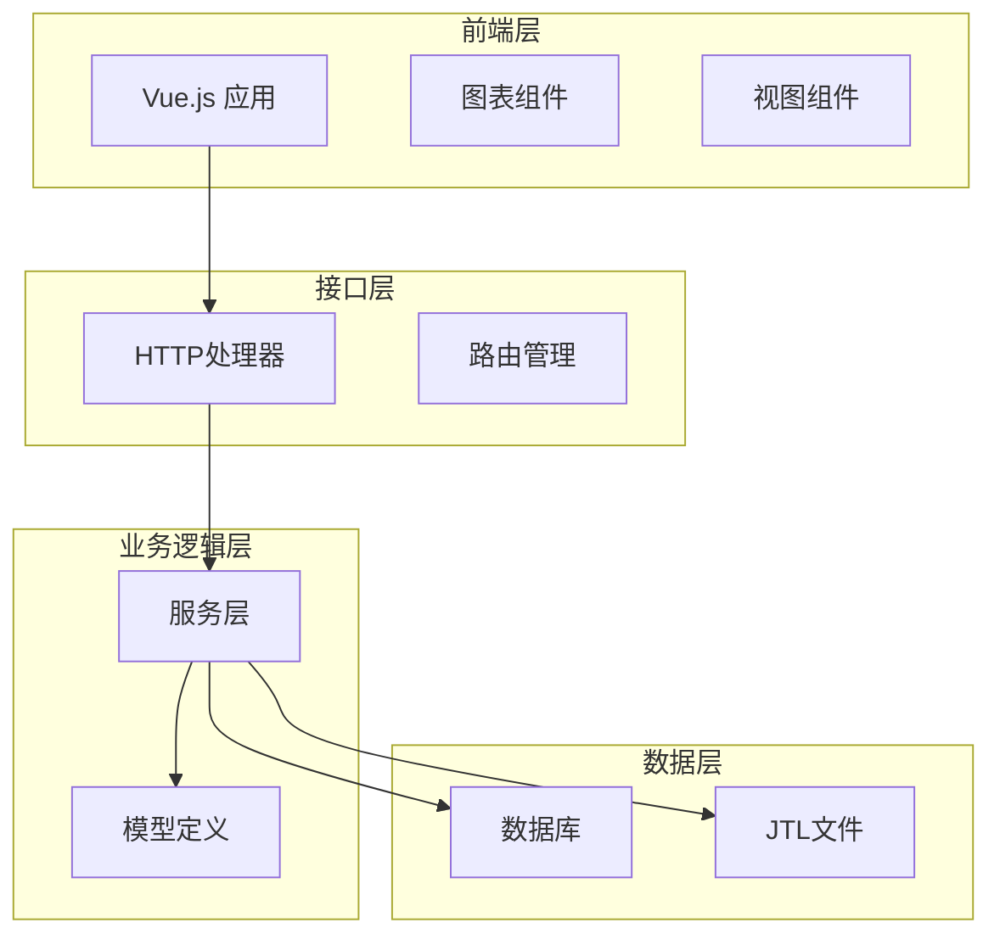
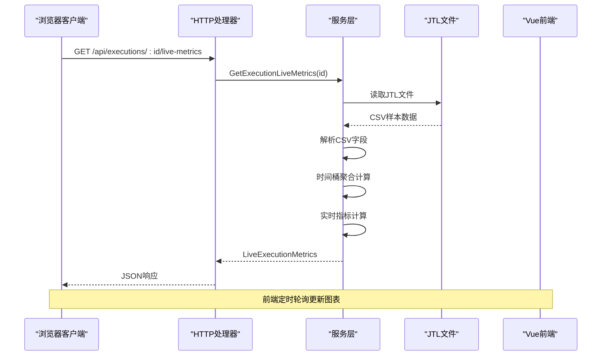
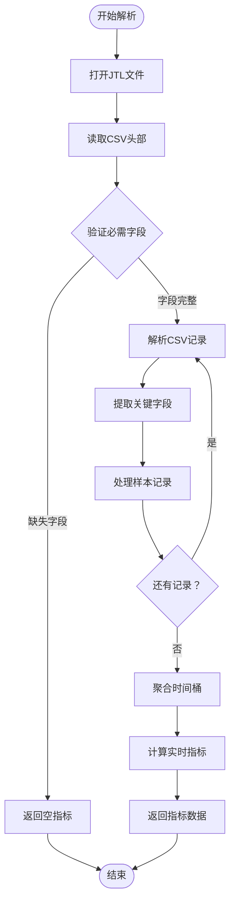
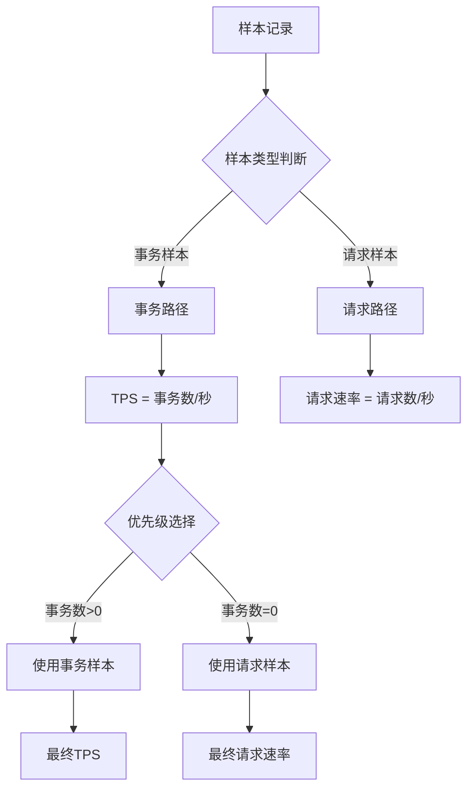
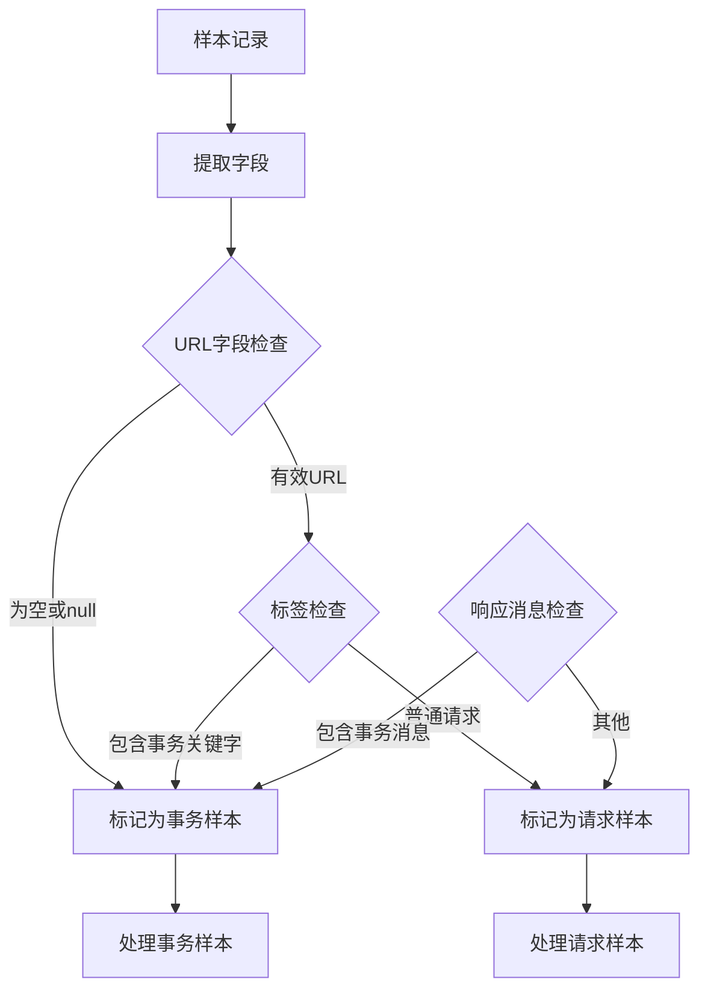
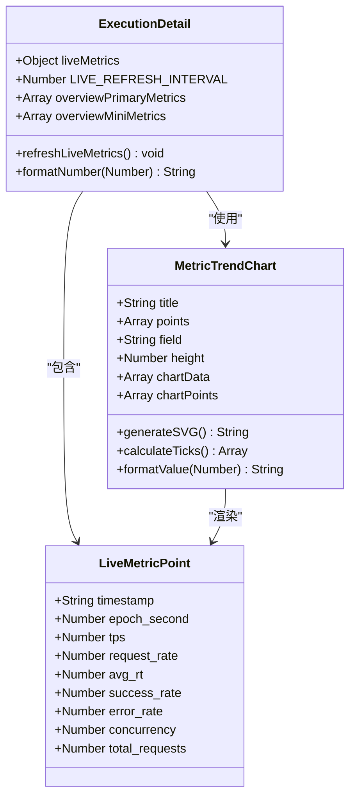
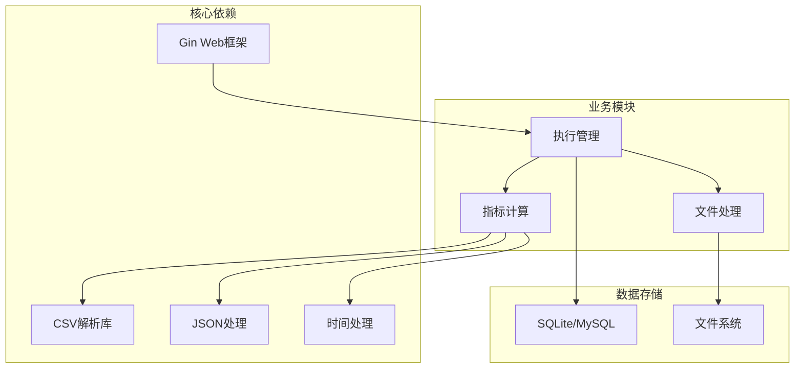

# 实时监控机制

<cite>
**本文档引用的文件**
- [main.go](file://main.go)
- [config.go](file://config/config.go)
- [execution.go](file://internal/service/execution.go)
- [execution_handler.go](file://internal/handler/execution.go)
- [execution_model.go](file://internal/model/execution.go)
- [execution_detail_view.vue](file://web/src/views/ExecutionDetail.vue)
- [metric_trend_chart.vue](file://web/src/components/MetricTrendChart.vue)
- [result.jtl](file://results/1/result.jtl)
</cite>

## 目录
1. [引言](#引言)
2. [项目结构](#项目结构)
3. [核心组件](#核心组件)
4. [架构概览](#架构概览)
5. [详细组件分析](#详细组件分析)
6. [依赖关系分析](#依赖关系分析)
7. [性能考虑](#性能考虑)
8. [故障排除指南](#故障排除指南)
9. [结论](#结论)

## 引言

本文档详细阐述了JMeter Admin项目中的实时监控机制，重点分析JTL文件的实时解析算法、实时指标计算方法、时间桶机制设计以及前后端数据交互流程。该系统通过Go语言后端实时解析JMeter生成的JTL结果文件，计算吞吐量、响应时间、成功率、并发数等核心指标，并通过Vue.js前端以图表形式实时展示。

## 项目结构

项目采用典型的三层架构设计：

**图表来源**
- [main.go:28-66](file://main.go#L28-L66)
- [execution_handler.go:39-53](file://internal/handler/execution.go#L39-L53)

**章节来源**
- [main.go:1-83](file://main.go#L1-L83)
- [config.go:10-41](file://config/config.go#L10-L41)

## 核心组件

### 实时监控核心算法

系统的核心在于实时解析JTL文件并计算关键性能指标：

1. **CSV格式字段提取**：系统自动发现并解析JTL文件的CSV格式，提取timeStamp、elapsed、success等关键字段
2. **时间戳处理**：将timeStamp转换为Unix秒级时间戳，实现精确的时间窗口划分
3. **数据聚合策略**：按秒级时间桶聚合样本数据，计算各类性能指标

### 实时指标计算方法

系统支持以下核心指标的实时计算：

- **吞吐量(TPS)**：每秒事务数，优先使用事务样本，降级使用请求样本
- **请求速率**：每秒请求数
- **平均响应时间**：加权平均响应时间
- **成功率/错误率**：基于成功/失败样本的百分比计算
- **并发数**：活跃线程数的最大值

**章节来源**
- [execution.go:673-947](file://internal/service/execution.go#L673-L947)
- [execution.go:1573-1604](file://internal/service/execution.go#L1573-L1604)

## 架构概览

**图表来源**
- [execution_handler.go:118-134](file://internal/handler/execution.go#L118-L134)
- [execution.go:673-947](file://internal/service/execution.go#L673-L947)

## 详细组件分析

### JTL文件实时解析算法

#### 字段提取与验证

系统通过智能字段映射实现跨版本JTL文件的兼容性：

**图表来源**
- [execution.go:800-830](file://internal/service/execution.go#L800-L830)
- [execution.go:822-828](file://internal/service/execution.go#L822-L828)

#### 时间桶机制设计

系统采用秒级时间窗口进行数据聚合：

**时间桶结构**：
- **键值**：Unix秒级时间戳
- **聚合内容**：每秒内的样本数量、响应时间总和、成功/失败计数
- **并发数追踪**：每秒内的最大并发线程数

**滑动窗口更新策略**：
- 实时维护时间桶映射
- 自动清理过期时间桶
- 支持动态时间窗口扩展

**章节来源**
- [execution.go:702-704](file://internal/service/execution.go#L702-L704)
- [execution.go:725-731](file://internal/service/execution.go#L725-L731)

### 实时指标计算算法

#### 吞吐量计算

**图表来源**
- [execution.go:866-869](file://internal/service/execution.go#L866-L869)
- [execution.go:870](file://internal/service/execution.go#L870)

#### 响应时间计算

系统支持多种响应时间统计：

- **平均响应时间**：加权平均，基于样本数量权重
- **P50/P90/P95/P99分位数**：使用排序算法计算
- **实时响应时间**：当前时间桶的平均响应时间

**章节来源**
- [execution.go:847-854](file://internal/service/execution.go#L847-L854)
- [execution.go:1317-1357](file://internal/service/execution.go#L1317-L1357)

### 事务样本与请求样本识别

系统通过智能算法区分事务样本和请求样本：

**图表来源**
- [execution.go:29-45](file://internal/service/execution.go#L29-L45)

**章节来源**
- [execution.go:29-45](file://internal/service/execution.go#L29-L45)

### 并发数实时计算

系统通过以下字段追踪并发数：

- **allThreads**：当前活跃线程总数
- **grpThreads**：当前组内活跃线程数

**并发数计算策略**：
- 每个样本记录提取并发数字段
- 在对应时间桶中维护最大并发值
- 实时更新当前并发数和峰值并发数

**章节来源**
- [execution.go:780-793](file://internal/service/execution.go#L780-L793)

### 前端实时图表生成

#### Vue.js图表组件架构

**图表来源**
- [metric_trend_chart.vue:123-140](file://web/src/components/MetricTrendChart.vue#L123-L140)
- [execution_detail_view.vue:823](file://web/src/views/ExecutionDetail.vue#L823)

#### 图表数据格式规范

前端期望的实时指标数据格式：

| 字段名 | 类型 | 描述 | 示例 |
|--------|------|------|------|
| status | String | 执行状态 | "running" |
| total_requests | Number | 总请求数 | 1234 |
| success_requests | Number | 成功请求数 | 1200 |
| error_requests | Number | 错误请求数 | 34 |
| current_tps | Number | 当前TPS | 12.5 |
| avg_tps | Number | 平均TPS | 10.2 |
| peak_tps | Number | 峰值TPS | 15.8 |
| current_request_rate | Number | 当前请求速率 | 13.2 |
| avg_request_rate | Number | 平均请求速率 | 11.0 |
| peak_request_rate | Number | 峰值请求速率 | 16.5 |
| current_rt | Number | 当前响应时间 | 150.5 |
| avg_rt | Number | 平均响应时间 | 145.2 |
| success_rate | Number | 成功率(%) | 97.5 |
| error_rate | Number | 错误率(%) | 2.5 |
| current_concurrency | Number | 当前并发数 | 8 |
| peak_concurrency | Number | 峰值并发数 | 12 |
| duration_seconds | Number | 执行时长(秒) | 3600 |
| points | Array | 时间序列点 | [{...}] |

每个时间序列点包含：

| 字段名 | 类型 | 描述 |
|--------|------|------|
| timestamp | String | 时间戳(HH:mm:ss) | 
| epoch_second | Number | Unix秒时间戳 |
| tps | Number | TPS值 |
| request_rate | Number | 请求速率 |
| avg_rt | Number | 平均响应时间 |
| success_rate | Number | 成功率(%) |
| error_rate | Number | 错误率(%) |
| concurrency | Number | 并发数 |
| total_requests | Number | 累计请求数 |

**章节来源**
- [execution_detail_view.vue:155-227](file://web/src/views/ExecutionDetail.vue#L155-L227)
- [metric_trend_chart.vue:154-204](file://web/src/components/MetricTrendChart.vue#L154-L204)

## 依赖关系分析

**图表来源**
- [execution.go:3-27](file://internal/service/execution.go#L3-L27)
- [execution_handler.go:3-21](file://internal/handler/execution.go#L3-L21)

**章节来源**
- [execution.go:3-27](file://internal/service/execution.go#L3-L27)
- [execution_handler.go:3-21](file://internal/handler/execution.go#L3-L21)

## 性能考虑

### 内存优化策略

1. **流式文件处理**：使用bufio.Scanner逐行读取JTL文件，避免一次性加载整个文件
2. **时间桶内存管理**：定期清理过期时间桶，限制内存占用
3. **增量聚合**：只维护必要的聚合状态，避免重复计算

### 并发处理优化

1. **异步执行**：JMeter执行采用goroutine异步处理
2. **批量文件合并**：分布式场景下合并多个JTL文件
3. **缓存机制**：前端缓存最近的指标数据

### 网络传输优化

1. **SSE流式传输**：使用Server-Sent Events实时推送日志
2. **增量数据更新**：前端只更新变化的指标
3. **数据压缩**：JSON响应的紧凑格式

## 故障排除指南

### 常见问题诊断

1. **JTL文件解析失败**
   - 检查JTL文件格式是否正确
   - 验证必需字段是否存在
   - 确认CSV格式兼容性

2. **实时指标显示异常**
   - 检查JMeter配置是否正确
   - 验证时间戳格式转换
   - 确认并发数字段提取

3. **图表渲染问题**
   - 检查前端JavaScript错误
   - 验证数据格式规范
   - 确认SVG渲染兼容性

### 调试工具

系统提供了完整的调试和监控功能：

- **实时日志流**：通过SSE实时查看执行日志
- **错误分析**：详细的错误类型和错误记录分析
- **性能监控**：执行时长、吞吐量等关键指标监控

**章节来源**
- [execution_handler.go:555-708](file://internal/handler/execution.go#L555-L708)
- [execution.go:1521-1571](file://internal/service/execution.go#L1521-L1571)

## 结论

JMeter Admin项目的实时监控机制通过精心设计的算法和架构，实现了对JMeter测试执行的全面监控。系统的核心优势包括：

1. **高效的实时解析**：基于流式的CSV解析算法，支持大规模测试数据的实时处理
2. **精确的指标计算**：多种性能指标的实时计算，包括吞吐量、响应时间、成功率等
3. **智能的时间桶机制**：秒级时间窗口聚合，支持灵活的时间维度分析
4. **用户友好的前端展示**：基于Vue.js的实时图表展示，提供直观的监控界面

该系统为JMeter测试提供了完整的实时监控解决方案，能够满足生产环境下的性能测试监控需求。