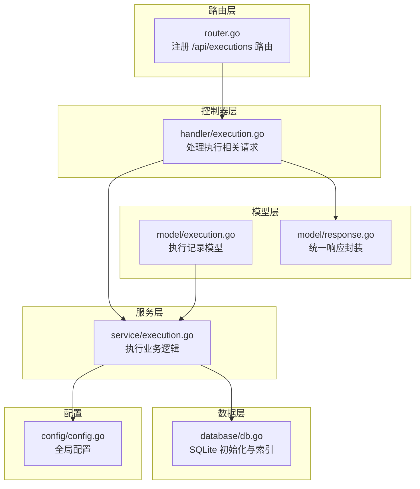
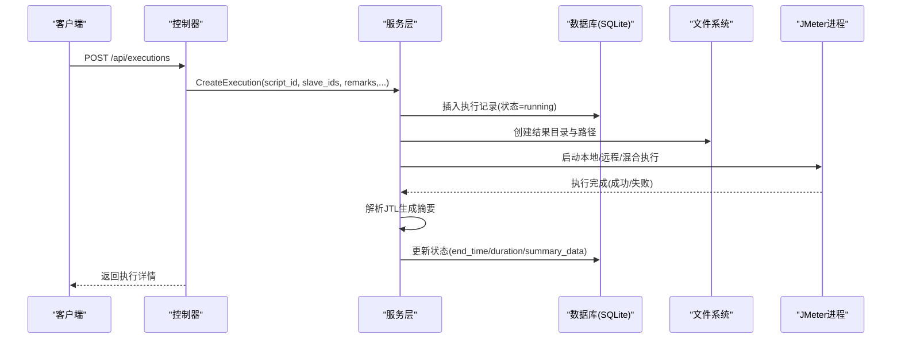
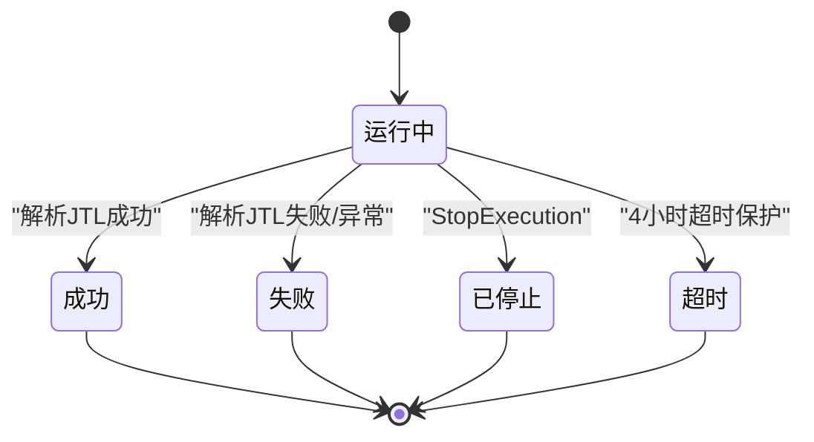
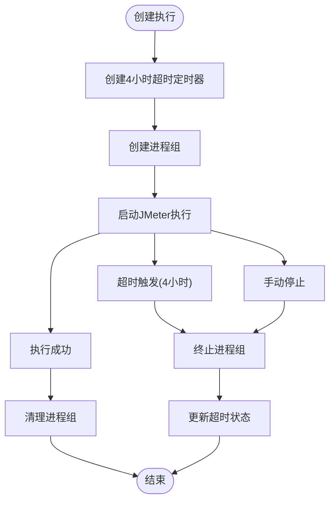
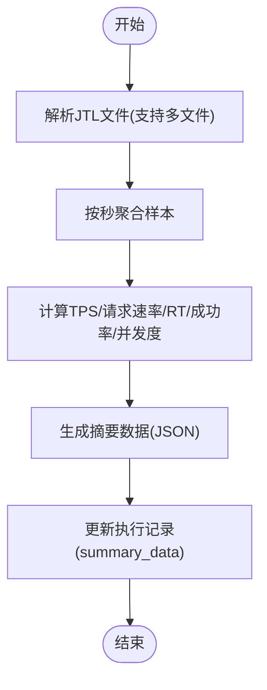
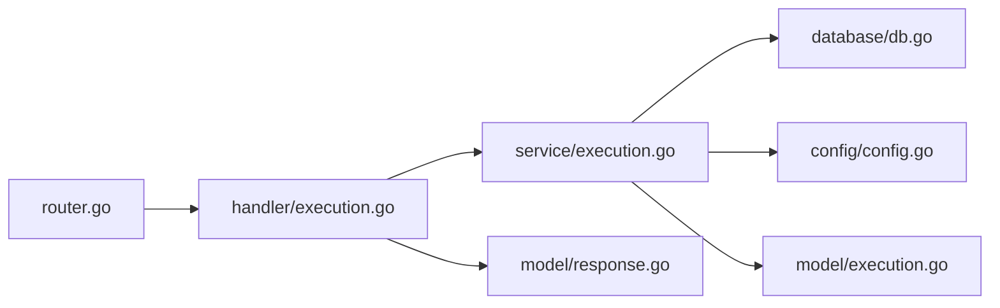

# 执行数据管理

<cite>
**本文引用的文件**
- [internal/model/execution.go](file://internal/model/execution.go)
- [internal/service/execution.go](file://internal/service/execution.go)
- [internal/handler/execution.go](file://internal/handler/execution.go)
- [internal/router/router.go](file://internal/router/router.go)
- [internal/database/db.go](file://internal/database/db.go)
- [internal/model/response.go](file://internal/model/response.go)
- [config/config.go](file://config/config.go)
</cite>

## 更新摘要
**变更内容**
- 优化了执行服务的超时处理机制，增加4小时超时保护
- 改进了进程管理，引入executionProcessGroup结构体进行进程组管理
- 增强了错误处理和日志记录机制
- 支持Unix系统的进程组操作和清理

## 目录
1. [简介](#简介)
2. [项目结构](#项目结构)
3. [核心组件](#核心组件)
4. [架构总览](#架构总览)
5. [详细组件分析](#详细组件分析)
6. [依赖分析](#依赖分析)
7. [性能考虑](#性能考虑)
8. [故障排查指南](#故障排查指南)
9. [结论](#结论)
10. [附录](#附录)

## 简介
本文件面向执行数据管理模块，系统性阐述执行记录的数据模型、CRUD与查询能力、状态生命周期、统计数据聚合、历史数据存储与清理策略、索引与查询优化、以及备份与一致性保障。目标是帮助开发者与运维人员快速理解并高效维护该模块。

## 项目结构
执行数据管理涉及以下关键层次：
- 路由层：定义 /api/executions 相关接口
- 控制器层：处理请求参数、调用服务层、封装响应
- 服务层：执行业务逻辑（创建执行、状态更新、统计、实时指标、日志流等）
- 数据层：SQLite 存储与索引
- 模型层：数据结构定义与响应封装

**图表来源**
- [internal/router/router.go:14-112](file://internal/router/router.go#L14-L112)
- [internal/handler/execution.go:38-134](file://internal/handler/execution.go#L38-L134)
- [internal/service/execution.go:103-481](file://internal/service/execution.go#L103-L481)
- [internal/database/db.go:15-124](file://internal/database/db.go#L15-L124)
- [internal/model/execution.go:3-18](file://internal/model/execution.go#L3-L18)
- [internal/model/response.go:14-45](file://internal/model/response.go#L14-L45)
- [config/config.go:35-62](file://config/config.go#L35-L62)

**章节来源**
- [internal/router/router.go:14-112](file://internal/router/router.go#L14-L112)
- [internal/handler/execution.go:38-134](file://internal/handler/execution.go#L38-L134)
- [internal/service/execution.go:103-481](file://internal/service/execution.go#L103-L481)
- [internal/database/db.go:15-124](file://internal/database/db.go#L15-L124)
- [internal/model/execution.go:3-18](file://internal/model/execution.go#L3-L18)
- [internal/model/response.go:14-45](file://internal/model/response.go#L14-L45)
- [config/config.go:35-62](file://config/config.go#L35-L62)

## 核心组件
- 执行记录模型：包含执行ID、脚本关联、Slave节点列表、状态、时间戳、结果与报告路径、摘要数据、日志路径等字段。
- 服务层：负责创建执行、异步执行JMeter、解析结果、更新状态、统计、实时指标、日志流、错误详情分析、删除执行与清理磁盘。
- 路由与控制器：提供分页查询、条件过滤、排序、统计、下载、SSE日志流、停止执行、删除执行等接口。
- 数据库：SQLite，含 executions 表及索引；提供清理陈旧执行记录的能力。

**章节来源**
- [internal/model/execution.go:3-18](file://internal/model/execution.go#L3-L18)
- [internal/service/execution.go:103-481](file://internal/service/execution.go#L103-L481)
- [internal/handler/execution.go:55-168](file://internal/handler/execution.go#L55-L168)
- [internal/database/db.go:80-124](file://internal/database/db.go#L80-L124)

## 架构总览
执行流程概览：控制器接收请求 -> 服务层创建执行记录并启动JMeter -> 异步执行 -> 解析JTL生成摘要 -> 更新状态 -> 提供实时指标与日志流 -> 支持下载与导出。

**图表来源**
- [internal/handler/execution.go:38-53](file://internal/handler/execution.go#L38-L53)
- [internal/service/execution.go:103-481](file://internal/service/execution.go#L103-L481)
- [internal/database/db.go:80-101](file://internal/database/db.go#L80-L101)

## 详细组件分析

### 数据模型设计
- 字段说明
  - id：自增主键
  - script_id、script_name：脚本关联与冗余展示字段
  - slave_ids：JSON数组，记录参与执行的Slave节点ID
  - status：执行状态，取值 running/success/failed/stopped
  - start_time、end_time、duration：起止时间与时长
  - remarks：备注
  - result_path、report_path、log_path：结果文件、报告目录、日志文件路径
  - summary_data：JSON对象，存放解析后的摘要统计
  - created_at：记录创建时间
- 设计要点
  - 冗余字段提升展示效率
  - JSON字段承载动态结构，便于扩展
  - 路径字段集中管理，便于后续清理与导出

**章节来源**
- [internal/model/execution.go:3-18](file://internal/model/execution.go#L3-L18)

### CRUD与查询能力
- 创建执行
  - 读取脚本信息与在线Slave列表
  - 插入执行记录（状态=running），生成结果目录与路径
  - 构建JMeter命令（本地/远程/混合），异步执行
- 分页查询与条件过滤
  - 支持按 script_id、status、keyword(remarks模糊)、created_at范围过滤
  - 按 created_at 降序排序，LIMIT/OFFSET 实现分页
- 详情查询
  - 按 id 查询，兼容空字段的 NullString/NullInt64 场景
- 删除执行
  - 删除数据库记录，并清理对应磁盘目录与文件

**章节来源**
- [internal/service/execution.go:103-481](file://internal/service/execution.go#L103-L481)
- [internal/service/execution.go:504-594](file://internal/service/execution.go#L504-L594)
- [internal/service/execution.go:637-671](file://internal/service/execution.go#L637-L671)
- [internal/service/execution.go:1486-1519](file://internal/service/execution.go#L1486-L1519)

### 状态生命周期管理
- 状态流转
  - running：创建执行即进入
  - success/failed：执行完成后根据JMeter返回与合并报告结果判定
  - stopped：手动停止执行，通过进程组终止并更新状态
  - timeout：自动超时，4小时超时保护机制
- 触发条件
  - 成功/失败：异步执行结束后解析JTL并更新
  - 停止：控制器调用 StopExecution，服务层终止进程并更新
  - 超时：AfterFunc定时器触发，自动终止进程并更新状态
- 陈旧记录清理
  - 服务启动时将 status=running 的记录标记为 failed，避免脏状态

**图表来源**
- [internal/service/execution.go:483-502](file://internal/service/execution.go#L483-L502)
- [internal/service/execution.go:949-994](file://internal/service/execution.go#L949-L994)
- [internal/service/execution.go:1043-1060](file://internal/service/execution.go#L1043-L1060)

**章节来源**
- [internal/service/execution.go:483-502](file://internal/service/execution.go#L483-L502)
- [internal/service/execution.go:949-994](file://internal/service/execution.go#L949-L994)
- [internal/service/execution.go:1043-1060](file://internal/service/execution.go#L1043-L1060)

### 超时处理机制与进程管理优化

#### 超时处理机制
- **4小时超时保护**：所有执行任务设置4小时超时限制，防止长时间挂起
- **AfterFunc定时器**：使用Go标准库的AfterFunc创建超时定时器
- **原子标志位**：使用atomic.Int32确保超时状态的线程安全
- **进程组终止**：超时触发时调用killProcessGroup终止整个进程组

#### 进程管理改进
- **executionProcessGroup结构体**：统一管理执行中的进程组
- **进程组创建**：setProcessGroup函数为每个进程设置进程组属性
- **进程组清理**：killProcessGroup函数支持Unix系统的进程组终止
- **全局进程管理**：executionProcesses sync.Map存储所有活动进程组

#### 错误处理增强
- **详细的日志记录**：超时、停止、错误等情况都有明确的日志输出
- **资源清理**：确保超时或错误情况下正确清理进程和资源
- **状态一致性**：超时情况下不会重复更新状态

**图表来源**
- [internal/service/execution.go:532-665](file://internal/service/execution.go#L532-L665)
- [internal/service/execution.go:1181-1235](file://internal/service/execution.go#L1181-L1235)

**章节来源**
- [internal/service/execution.go:52-80](file://internal/service/execution.go#L52-L80)
- [internal/service/execution.go:532-665](file://internal/service/execution.go#L532-L665)
- [internal/service/execution.go:1181-1235](file://internal/service/execution.go#L1181-L1235)

### 统计数据聚合与实时更新
- 统计接口
  - 统计总数、运行中、已完成、失败、已停止的数量
- 实时指标
  - 基于JTL文件的CSV解析，按秒聚合：TPS、请求速率、平均/峰值RT、成功率/错误率、并发度、累计请求数
  - 支持多结果文件合并解析
- 摘要数据
  - 执行完成后解析JTL生成 summary_data 并持久化

**图表来源**
- [internal/service/execution.go:673-947](file://internal/service/execution.go#L673-L947)
- [internal/service/execution.go:1062-1357](file://internal/service/execution.go#L1062-L1357)

**章节来源**
- [internal/service/execution.go:596-635](file://internal/service/execution.go#L596-L635)
- [internal/service/execution.go:673-947](file://internal/service/execution.go#L673-L947)
- [internal/service/execution.go:1062-1357](file://internal/service/execution.go#L1062-L1357)

### 历史数据存储策略
- 存储位置
  - SQLite：executions 表存储元数据
  - 文件系统：每个执行一个目录，包含 result.jtl、report/、execution.log、error-details.ndjson 等
- 日志组织
  - 执行期间写入 execution.log，支持SSE流式推送
- 清理策略
  - 删除执行记录时，同步清理对应目录与文件
  - 服务启动时清理陈旧执行记录（status=running）

**章节来源**
- [internal/service/execution.go:181-204](file://internal/service/execution.go#L181-L204)
- [internal/handler/execution.go:211-259](file://internal/handler/execution.go#L211-L259)
- [internal/handler/execution.go:261-358](file://internal/handler/execution.go#L261-L358)
- [internal/service/execution.go:1486-1519](file://internal/service/execution.go#L1486-L1519)
- [internal/service/execution.go:1043-1060](file://internal/service/execution.go#L1043-L1060)

### 索引设计与查询性能优化
- 现有索引
  - idx_executions_script_id：按脚本过滤
  - idx_executions_status：按状态过滤
  - idx_executions_created_at：按时间倒序排序
- 优化建议
  - 若频繁按 status+created_at 过滤，可考虑复合索引
  - 对高频查询字段增加覆盖索引，减少回表
  - 分页查询使用"基于游标"的方式替代大OFFSET，降低扫描成本

**章节来源**
- [internal/database/db.go:173-189](file://internal/database/db.go#L173-L189)
- [internal/service/execution.go:509-557](file://internal/service/execution.go#L509-L557)

### 备份与一致性保障
- 备份
  - SQLite 数据库文件可直接复制备份
  - 历史执行结果目录需单独备份（可通过导出ZIP实现）
- 一致性
  - 服务启动时清理陈旧执行记录，避免脏状态
  - 删除执行记录时同步清理磁盘，保持元数据与文件一致

**章节来源**
- [internal/service/execution.go:1043-1060](file://internal/service/execution.go#L1043-L1060)
- [internal/service/execution.go:1486-1519](file://internal/service/execution.go#L1486-L1519)

## 依赖分析
- 组件耦合
  - 路由层依赖控制器层；控制器层依赖服务层；服务层依赖数据库与文件系统；模型层被服务层使用
- 外部依赖
  - SQLite3 驱动
  - Gin Web框架
  - JMeter 命令行工具

**图表来源**
- [internal/router/router.go:14-112](file://internal/router/router.go#L14-L112)
- [internal/handler/execution.go:38-134](file://internal/handler/execution.go#L38-L134)
- [internal/service/execution.go:103-481](file://internal/service/execution.go#L103-L481)
- [internal/database/db.go:15-34](file://internal/database/db.go#L15-L34)
- [config/config.go:35-62](file://config/config.go#L35-L62)
- [internal/model/execution.go:3-18](file://internal/model/execution.go#L3-L18)
- [internal/model/response.go:14-45](file://internal/model/response.go#L14-L45)

**章节来源**
- [internal/router/router.go:14-112](file://internal/router/router.go#L14-L112)
- [internal/handler/execution.go:38-134](file://internal/handler/execution.go#L38-L134)
- [internal/service/execution.go:103-481](file://internal/service/execution.go#L103-L481)
- [internal/database/db.go:15-34](file://internal/database/db.go#L15-L34)
- [config/config.go:35-62](file://config/config.go#L35-L62)
- [internal/model/execution.go:3-18](file://internal/model/execution.go#L3-L18)
- [internal/model/response.go:14-45](file://internal/model/response.go#L14-L45)

## 性能考虑
- I/O 优化
  - 将结果文件与报告目录写入本地磁盘，避免网络抖动
  - 合并多个JTL文件后再生成报告，减少多次IO
- CPU 优化
  - 解析JTL采用流式CSV读取，避免一次性加载大文件
  - 按秒聚合，控制内存占用
- 网络与并发
  - 分布式执行时合理设置RMI参数，避免阻塞
  - 并发执行本地与远程任务，使用WaitGroup协调
- 查询优化
  - 使用现有索引；必要时引入复合索引
  - 分页使用游标分页替代OFFSET
- **超时保护优化**
  - 4小时超时保护防止长时间挂起
  - 进程组管理确保超时情况下正确清理资源

## 故障排查指南
- 执行记录状态异常
  - 检查服务是否在启动时执行了清理陈旧记录
  - 查看日志文件是否存在与可读
  - **新增**：检查超时日志，确认是否触发4小时超时保护
- 日志流异常
  - 确认日志文件路径与权限
  - 检查SSE连接是否被Nginx缓冲
- 结果文件缺失
  - 确认JTL文件是否生成与大小
  - 检查合并与报告生成过程是否报错
- 删除执行失败
  - 确认磁盘清理是否成功，查看残留文件
- **进程管理问题**
  - **新增**：检查进程组是否正确创建和清理
  - **新增**：确认Unix系统进程组终止功能正常工作

**章节来源**
- [internal/service/execution.go:1043-1060](file://internal/service/execution.go#L1043-L1060)
- [internal/handler/execution.go:555-708](file://internal/handler/execution.go#L555-L708)
- [internal/service/execution.go:1486-1519](file://internal/service/execution.go#L1486-L1519)

## 结论
执行数据管理模块以SQLite为数据存储核心，结合文件系统组织历史数据，提供完整的执行生命周期管理、统计与实时指标能力。通过合理的索引与查询优化、完善的清理与备份策略，能够满足中小规模场景下的稳定运行需求。**最新的优化包括4小时超时保护机制、进程组管理改进和增强的错误处理，进一步提升了系统的稳定性和可靠性。**建议在高并发与大数据量场景下进一步引入复合索引、游标分页与异步解析等优化手段。

## 附录

### API一览（执行相关）
- GET /api/executions/stats：获取执行统计
- GET /api/executions：分页查询（支持 script_id/status/keyword/start_date/end_date 过滤）
- POST /api/executions：创建执行
- GET /api/executions/:id：获取执行详情
- GET /api/executions/:id/live-metrics：获取实时指标
- DELETE /api/executions/:id：删除执行
- POST /api/executions/:id/stop：停止执行
- GET /api/executions/:id/log：SSE日志流
- GET /api/executions/:id/errors：获取错误分析
- POST /api/executions/:id/error-details/upload：上传错误明细
- GET /api/executions/:id/download/jtl：下载JTL
- GET /api/executions/:id/download/report：下载报告ZIP
- GET /api/executions/:id/download/errors：导出错误CSV
- GET /api/executions/:id/download/all：导出完整包

**章节来源**
- [internal/router/router.go:49-66](file://internal/router/router.go#L49-L66)
- [internal/handler/execution.go:55-418](file://internal/handler/execution.go#L55-L418)