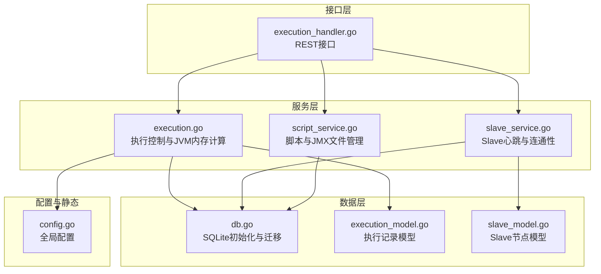
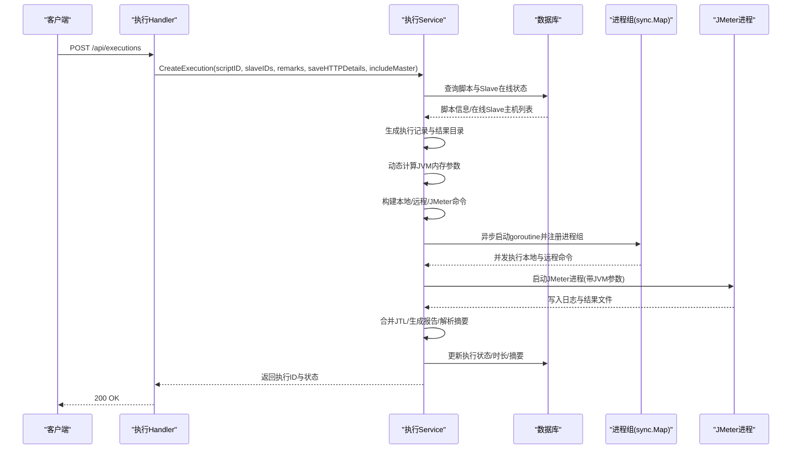
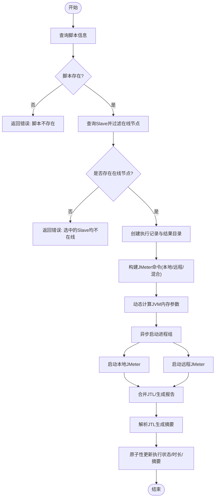
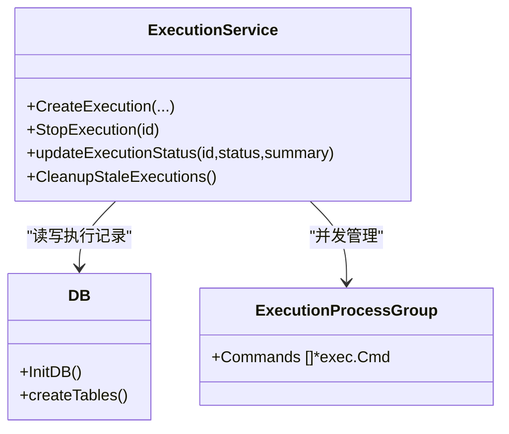
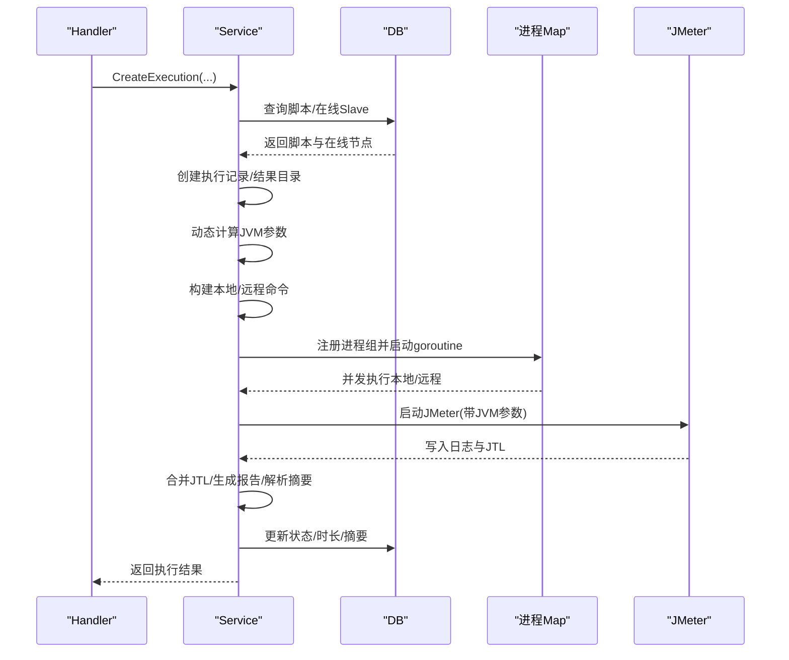
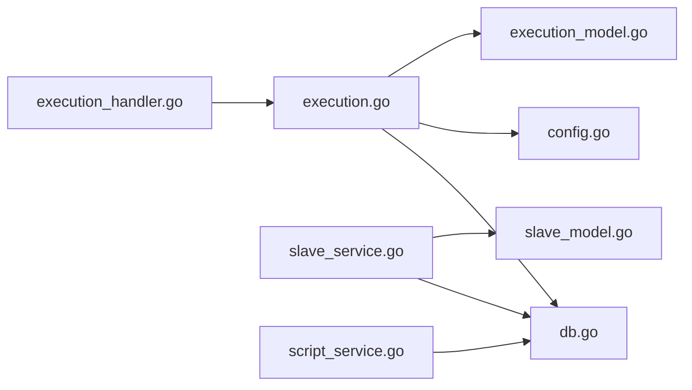

# 执行流程控制

<cite>
**本文引用的文件**
- [execution.go](file://internal/service/execution.go)
- [execution_handler.go](file://internal/handler/execution.go)
- [execution_model.go](file://internal/model/execution.go)
- [slave_service.go](file://internal/service/slave.go)
- [slave_model.go](file://internal/model/slave.go)
- [script_service.go](file://internal/service/script.go)
- [config.go](file://config/config.go)
- [db.go](file://internal/database/db.go)
- [response_model.go](file://internal/model/response.go)
</cite>

## 目录
1. [简介](#简介)
2. [项目结构](#项目结构)
3. [核心组件](#核心组件)
4. [架构总览](#架构总览)
5. [详细组件分析](#详细组件分析)
6. [依赖分析](#依赖分析)
7. [性能考虑](#性能考虑)
8. [故障排查指南](#故障排查指南)
9. [结论](#结论)
10. [附录](#附录)

## 简介
本文件聚焦“执行流程控制”的完整生命周期，覆盖从脚本验证、Slave节点选择、JMeter命令构建、异步执行启动，到分布式与本地模式切换、includeMaster参数机制、JVM内存参数动态计算、错误处理与容错、状态原子性更新与并发安全、以及执行时序与关键决策点。目标是帮助开发者与运维人员全面理解系统在真实生产环境中的行为与优化方向。

## 项目结构
该系统采用分层设计：Handler负责HTTP接口与参数绑定；Service封装业务流程与执行控制；Model定义数据模型；Database封装SQLite初始化与迁移；Config提供全局配置；Web前端通过API消费后端能力。

图表来源
- [execution_handler.go:39-53](file://internal/handler/execution.go#L39-L53)
- [execution.go:104-481](file://internal/service/execution.go#L104-L481)
- [slave_service.go:16-41](file://internal/service/slave.go#L16-L41)
- [script_service.go:18-83](file://internal/service/script.go#L18-L83)
- [db.go:15-34](file://internal/database/db.go#L15-L34)
- [config.go:10-41](file://config/config.go#L10-L41)

章节来源
- [execution_handler.go:39-53](file://internal/handler/execution.go#L39-L53)
- [execution.go:104-481](file://internal/service/execution.go#L104-L481)
- [slave_service.go:16-41](file://internal/service/slave.go#L16-L41)
- [script_service.go:18-83](file://internal/service/script.go#L18-L83)
- [db.go:15-34](file://internal/database/db.go#L15-L34)
- [config.go:10-41](file://config/config.go#L10-L41)

## 核心组件
- 执行服务（CreateExecution）：负责脚本校验、Slave节点过滤与在线状态确认、执行记录创建、结果目录与路径写入、JMeter命令构建（本地/远程/混合）、JVM内存参数注入、异步执行与日志落盘、最终状态更新与摘要生成。
- Handler（CreateExecution）：REST接口入口，参数绑定与错误返回。
- Slave服务：心跳检测、连通性检查、批量状态更新。
- Script服务：脚本列表、JMX文件读写与校验。
- 数据库：SQLite初始化、表结构与索引、迁移。
- 配置：Server、JMeter、Slave、Dirs等全局配置。

章节来源
- [execution.go:104-481](file://internal/service/execution.go#L104-L481)
- [execution_handler.go:39-53](file://internal/handler/execution.go#L39-L53)
- [slave_service.go:112-157](file://internal/service/slave.go#L112-L157)
- [script_service.go:118-134](file://internal/service/script.go#L118-L134)
- [db.go:36-124](file://internal/database/db.go#L36-L124)
- [config.go:10-41](file://config/config.go#L10-L41)

## 架构总览
下图展示了从HTTP请求到执行完成的端到端流程，包括分布式与本地模式切换、includeMaster参数作用、JVM内存动态计算、异步执行与状态更新。

图表来源
- [execution_handler.go:39-53](file://internal/handler/execution.go#L39-L53)
- [execution.go:104-481](file://internal/service/execution.go#L104-L481)
- [execution.go:368-463](file://internal/service/execution.go#L368-L463)
- [db.go:36-124](file://internal/database/db.go#L36-L124)

## 详细组件分析

### 执行生命周期与关键决策点
- 脚本验证与路径解析：查询脚本记录，确保存在且文件路径有效。
- Slave节点选择与在线状态：按ID查询并过滤status=online的节点，记录离线ID集合以便后续提示。
- includeMaster参数机制：当启用分布式且includeMaster=true时，本地Master也会参与执行，分别生成result-local.jtl与result-remote.jtl，随后合并为最终result.jtl并生成HTML报告。
- 命令构建策略：
  - 仅远程：-R指定Slave主机列表，-G传递全局属性。
  - 仅本地：-n -t -l -q -e -o。
  - 本地+远程：本地写入result-local.jtl，远程写入result-remote.jtl，结束后合并并生成报告。
- JVM内存参数动态计算：基于系统可用内存（优先读取/proc/meminfo，回退runtime内存），取80%作为最大堆，最小512MB、最大32GB；初始堆为最大堆的1/4，不低于256MB；可通过环境变量覆盖。
- 异步执行与日志：使用goroutine并发启动本地与远程命令，统一写入execution.log；合并JTL并生成报告；解析JTL生成摘要；最终原子性更新执行状态、结束时间、时长与摘要。
- 错误处理与容错：
  - 离线Slave：若仅选择离线节点，直接报错；若部分离线，记录警告并继续使用在线节点。
  - 部分失败降级：本地或远程任一失败，仍尝试合并与生成报告，错误信息汇总返回。
  - 停止执行：通过sync.Map定位进程组，逐一kill进程，更新状态为stopped。
  - 清理陈旧执行：服务启动时将status=running的记录标记为failed，避免僵尸状态。

图表来源
- [execution.go:104-481](file://internal/service/execution.go#L104-L481)
- [execution.go:368-463](file://internal/service/execution.go#L368-L463)
- [execution.go:1359-1430](file://internal/service/execution.go#L1359-L1430)
- [execution.go:1062-1150](file://internal/service/execution.go#L1062-L1150)

章节来源
- [execution.go:104-481](file://internal/service/execution.go#L104-L481)
- [execution.go:368-463](file://internal/service/execution.go#L368-L463)
- [execution.go:1359-1430](file://internal/service/execution.go#L1359-L1430)
- [execution.go:1062-1150](file://internal/service/execution.go#L1062-L1150)

### includeMaster 参数机制
- 当存在Slave且includeMaster=true时，系统同时启动本地Master执行与远程Slave执行，分别输出result-local.jtl与result-remote.jtl，随后合并为最终结果并生成报告。
- 若仅includeMaster而无Slave，则仅本地执行。
- 此机制允许在分布式环境中，Master也参与负载与数据收集，便于统一分析。

章节来源
- [execution.go:208-235](file://internal/service/execution.go#L208-L235)
- [execution.go:340-347](file://internal/service/execution.go#L340-L347)
- [execution.go:422-436](file://internal/service/execution.go#L422-L436)

### JVM内存参数动态计算算法
- Linux优先读取/proc/meminfo中的MemAvailable，单位KB转MB；否则回退Go runtime统计，若小于1GB则假设4GB。
- 最终取系统可用内存的80%，最小512MB、最大32GB；初始堆为最大堆的1/4，不低于256MB。
- 可通过环境变量JVM_ARGS覆盖默认值。
- 计算结果以-Xms与-Xmx形式注入JMeter进程环境变量。

章节来源
- [execution.go:54-101](file://internal/service/execution.go#L54-L101)
- [execution.go:362-366](file://internal/service/execution.go#L362-L366)

### 分布式与本地模式切换逻辑
- 仅远程：-R列出在线Slave主机；-G传递全局属性；-Dserver.rmi.ssl.disable=true；-Djava.rmi.server.hostname=配置项。
- 仅本地：-n -t -l -q -e -o；granularity=1000；可选开启错误明细采集。
- 本地+远程：本地写result-local.jtl，远程写result-remote.jtl，合并后生成报告；错误明细上传URL与令牌在远程侧注入。

章节来源
- [execution.go:274-335](file://internal/service/execution.go#L274-L335)
- [execution.go:337-347](file://internal/service/execution.go#L337-L347)

### 执行状态原子性更新与并发安全
- 进程管理：使用sync.Map按执行ID存储进程组，支持StopExecution时快速定位并kill进程。
- 状态更新：updateExecutionStatus原子性更新状态、结束时间、时长与摘要；通过查询开始时间计算duration。
- 清理陈旧执行：服务启动时将status=running的记录标记为failed，避免遗留状态。
- 日志与结果：统一写入execution.log；JTL合并与报告生成在异步goroutine内完成，完成后才更新状态。

图表来源
- [execution.go:47-53](file://internal/service/execution.go#L47-L53)
- [execution.go:949-994](file://internal/service/execution.go#L949-L994)
- [execution.go:484-502](file://internal/service/execution.go#L484-L502)
- [execution.go:1044-1060](file://internal/service/execution.go#L1044-L1060)
- [db.go:15-34](file://internal/database/db.go#L15-L34)

章节来源
- [execution.go:47-53](file://internal/service/execution.go#L47-L53)
- [execution.go:949-994](file://internal/service/execution.go#L949-L994)
- [execution.go:484-502](file://internal/service/execution.go#L484-L502)
- [execution.go:1044-1060](file://internal/service/execution.go#L1044-L1060)
- [db.go:15-34](file://internal/database/db.go#L15-L34)

### 错误处理策略与容错机制
- 离线Slave容错：若仅选择离线节点，直接报错；若部分离线，记录警告并继续使用在线节点。
- 部分失败降级：本地或远程任一失败，仍尝试合并与生成报告，错误信息汇总返回。
- 停止执行：通过进程ID定位进程组，逐一kill进程，更新状态为stopped。
- 清理陈旧执行：服务启动时将status=running的记录标记为failed，避免僵尸状态。
- 结果解析与摘要：parseJTLResults聚合请求/事务样本、吞吐量、成功率、RT等指标；discoverExecutionResultPaths兼容本地与远程结果文件。

章节来源
- [execution.go:159-162](file://internal/service/execution.go#L159-L162)
- [execution.go:355-357](file://internal/service/execution.go#L355-L357)
- [execution.go:437-447](file://internal/service/execution.go#L437-L447)
- [execution.go:949-994](file://internal/service/execution.go#L949-L994)
- [execution.go:1044-1060](file://internal/service/execution.go#L1044-L1060)
- [execution.go:1062-1150](file://internal/service/execution.go#L1062-L1150)
- [execution.go:1432-1453](file://internal/service/execution.go#L1432-L1453)

### 关键流程时序图（代码级映射）
以下时序图对应CreateExecution主流程与异步执行细节。

图表来源
- [execution_handler.go:39-53](file://internal/handler/execution.go#L39-L53)
- [execution.go:104-481](file://internal/service/execution.go#L104-L481)
- [execution.go:368-463](file://internal/service/execution.go#L368-L463)

## 依赖分析
- 组件耦合：
  - Handler依赖Service；Service依赖DB与Config；Slave服务独立维护节点状态；Script服务负责JMX文件管理。
- 外部依赖：
  - SQLite驱动（go-sqlite3）；Gin Web框架；JMeter可执行文件（路径来自配置）。
- 潜在循环依赖：未发现直接循环；各层职责清晰。

图表来源
- [execution_handler.go:39-53](file://internal/handler/execution.go#L39-L53)
- [execution.go:104-481](file://internal/service/execution.go#L104-L481)
- [db.go:15-34](file://internal/database/db.go#L15-L34)
- [config.go:10-41](file://config/config.go#L10-L41)
- [slave_service.go:16-41](file://internal/service/slave.go#L16-L41)
- [script_service.go:18-83](file://internal/service/script.go#L18-L83)

章节来源
- [execution_handler.go:39-53](file://internal/handler/execution.go#L39-L53)
- [execution.go:104-481](file://internal/service/execution.go#L104-L481)
- [db.go:15-34](file://internal/database/db.go#L15-L34)
- [config.go:10-41](file://config/config.go#L10-L41)
- [slave_service.go:16-41](file://internal/service/slave.go#L16-L41)
- [script_service.go:18-83](file://internal/service/script.go#L18-L83)

## 性能考虑
- 并发执行：本地与远程命令通过goroutine并发启动，提升整体吞吐；合并JTL与生成报告在完成后进行，避免I/O竞争。
- 内存参数：动态计算JVM堆大小，避免固定值导致资源浪费或OOM；可通过JVM_ARGS覆盖。
- I/O优化：JTL合并与报告生成在本地磁盘完成，减少网络传输；日志统一写入execution.log便于实时监控。
- 资源探测：优先使用/proc/meminfo，回退runtime统计，兼顾不同平台与容器环境。

## 故障排查指南
- “选中的Slave均不在线”：检查Slave心跳与连通性；确认Slave状态为online后再发起执行。
- “分布式保存HTTP明细需要先配置Master回调地址”：在配置中设置JMeter.master_hostname，确保远程节点可回传错误明细。
- “JMeter命令未生成”：检查includeMaster与slaveIDs组合；确认JMeter路径与属性文件正确。
- “执行长时间处于running”：查看execution.log；确认JMeter进程是否正常；必要时调用停止接口。
- “结果文件为空或未生成”：确认JTL写入路径与权限；检查JMeter命令是否包含-l与-e/-o参数。

章节来源
- [execution.go:159-162](file://internal/service/execution.go#L159-L162)
- [execution.go:219-222](file://internal/service/execution.go#L219-L222)
- [execution.go:368-463](file://internal/service/execution.go#L368-L463)
- [execution_handler.go:137-151](file://internal/handler/execution.go#L137-L151)

## 结论
本系统通过清晰的分层设计与严谨的执行流程控制，实现了从脚本验证、Slave节点选择、JMeter命令构建、异步执行启动到状态更新的全链路自动化。includeMaster参数提供了灵活的分布式+本地混合执行模式；动态JVM内存计算提升了资源利用率；完善的错误处理与并发安全保证了生产环境的稳定性。建议在高并发场景下结合JVM_ARGS微调内存参数，并持续监控Slave连通性与执行日志，以获得最佳性能与可靠性。

## 附录
- 数据模型与接口：
  - 执行记录模型：包含ID、脚本ID/名称、Slave IDs、状态、起止时间、时长、备注、结果/报告/日志路径、摘要等。
  - 响应模型：统一返回code/message/data结构，支持分页列表。
- 配置项要点：
  - server.port：HTTP服务端口。
  - jmeter.path：JMeter可执行文件路径。
  - jmeter.master_hostname：RMI回调IP，多网卡时必填。
  - slave.heartbeat_interval：Slave心跳检测间隔（秒）。
  - dirs.data/uploads/results：数据、上传、结果目录。

章节来源
- [execution_model.go:3-18](file://internal/model/execution.go#L3-L18)
- [response_model.go:14-46](file://internal/model/response.go#L14-L46)
- [config.go:18-63](file://config/config.go#L18-L63)