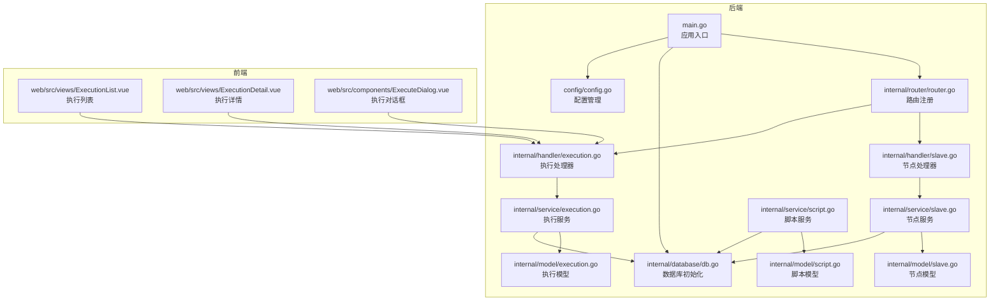
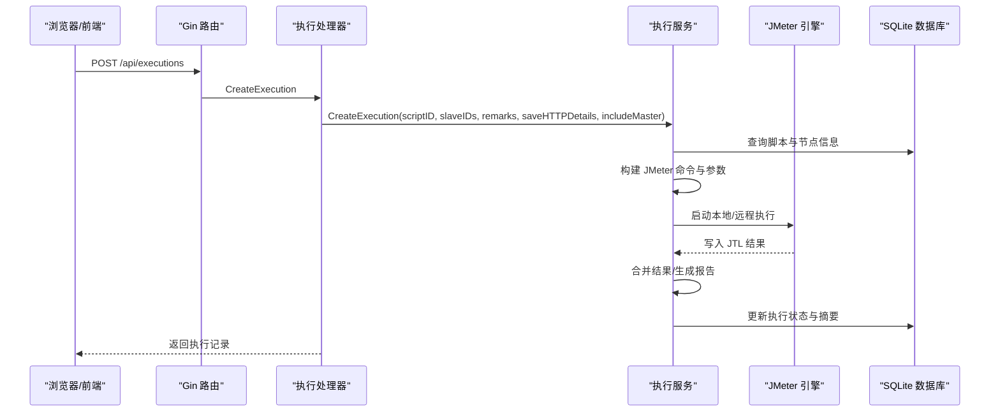
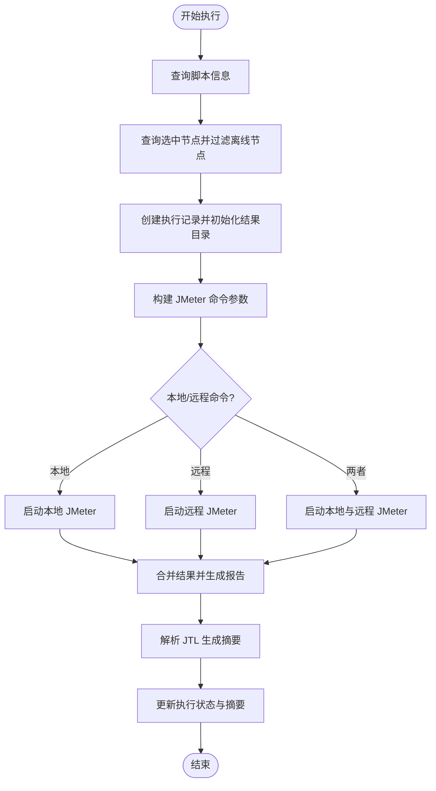
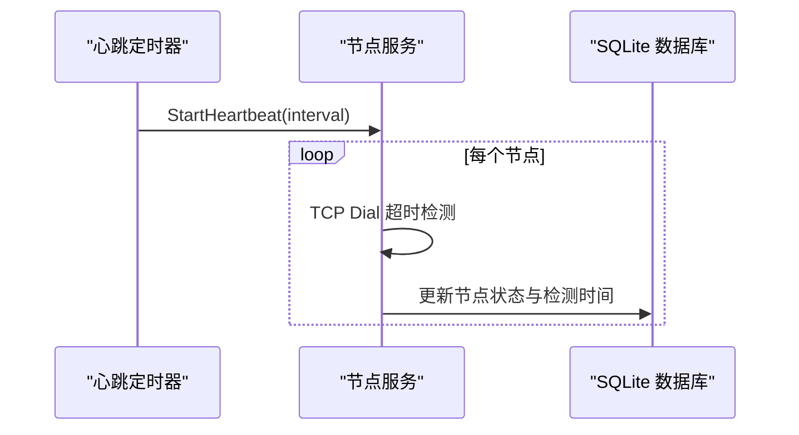
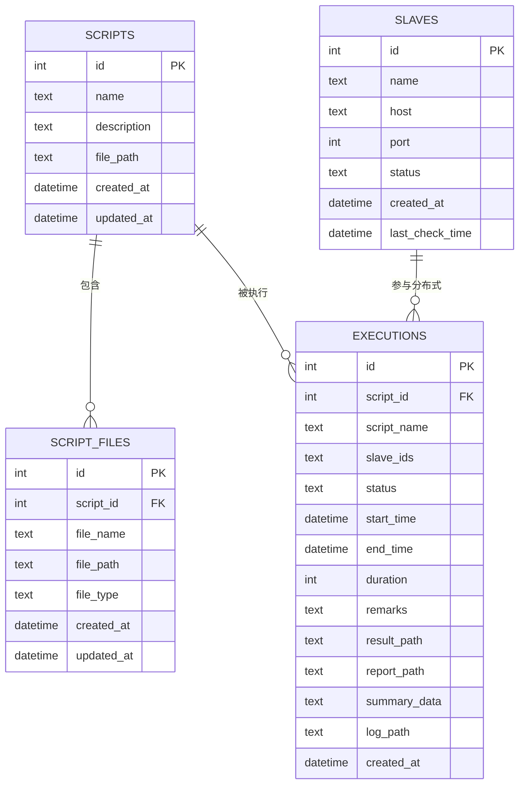
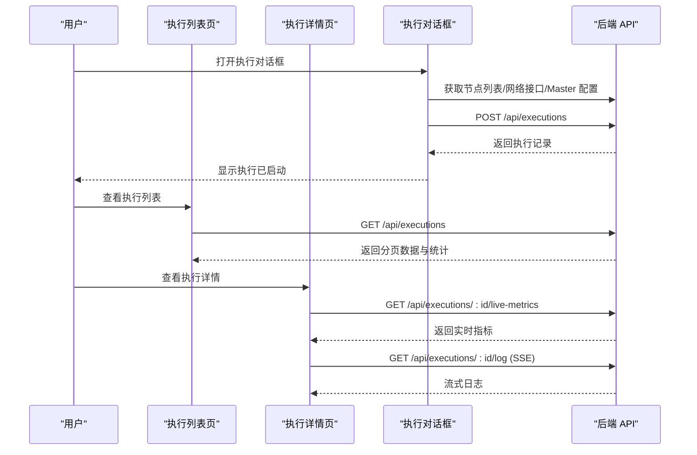
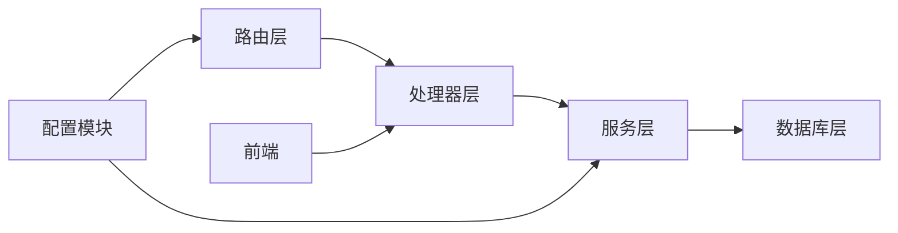

# 执行管理系统

<cite>
**本文档引用的文件**
- [main.go](file://main.go)
- [router.go](file://internal/router/router.go)
- [execution.go](file://internal/service/execution.go)
- [execution_handler.go](file://internal/handler/execution.go)
- [slave_service.go](file://internal/service/slave.go)
- [slave_handler.go](file://internal/handler/slave.go)
- [script_service.go](file://internal/service/script.go)
- [execution_model.go](file://internal/model/execution.go)
- [slave_model.go](file://internal/model/slave.go)
- [script_model.go](file://internal/model/script.go)
- [db.go](file://internal/database/db.go)
- [config.go](file://config/config.go)
- [execution_list_view.vue](file://web/src/views/ExecutionList.vue)
- [execution_detail_view.vue](file://web/src/views/ExecutionDetail.vue)
- [execute_dialog.vue](file://web/src/components/ExecuteDialog.vue)
</cite>

## 目录
1. [简介](#简介)
2. [项目结构](#项目结构)
3. [核心组件](#核心组件)
4. [架构总览](#架构总览)
5. [详细组件分析](#详细组件分析)
6. [依赖关系分析](#依赖关系分析)
7. [性能考虑](#性能考虑)
8. [故障排除指南](#故障排除指南)
9. [结论](#结论)
10. [附录](#附录)

## 简介
本项目是一个基于 Go 语言的执行管理系统，集成了 Apache JMeter，提供脚本管理、分布式节点管理、测试执行编排、实时监控、结果分析与报告生成等功能。系统采用前后端分离架构：后端使用 Gin 框架提供 REST API，前端使用 Vue 3 + Element Plus 构建可视化界面。核心能力包括：
- 脚本选择与管理：支持 JMX 文件上传、编辑、版本化管理
- 节点分配与心跳：支持多节点分布式执行与健康监测
- 执行编排：支持本地与分布式执行模式，自动合并结果
- 实时监控：SSE 流式日志与实时指标展示
- 结果分析：JTL 解析、错误统计、HTML 报告生成
- 历史记录：SQLite 存储执行历史，支持分页查询与筛选

## 项目结构
项目采用典型的分层架构：
- config：全局配置管理
- internal/database：SQLite 数据库初始化与迁移
- internal/model：领域模型定义
- internal/service：业务逻辑实现
- internal/handler：HTTP 请求处理器
- internal/router：路由注册与中间件
- web：前端源码（Vue 3 + Vite）
- results：执行结果与报告目录
- uploads：脚本文件上传目录
- data：SQLite 数据库存放目录

**图表来源**
- [main.go:28-66](file://main.go#L28-L66)
- [router.go:14-112](file://internal/router/router.go#L14-L112)
- [execution.go:104-481](file://internal/service/execution.go#L104-L481)
- [slave_service.go:15-41](file://internal/service/slave.go#L15-L41)
- [script_service.go:18-83](file://internal/service/script.go#L18-L83)

**章节来源**
- [main.go:28-66](file://main.go#L28-L66)
- [router.go:14-112](file://internal/router/router.go#L14-L112)

## 核心组件
- 执行服务（Execution Service）：负责创建执行、构建 JMeter 命令、异步执行、合并结果、生成报告、状态更新与实时指标解析
- 节点服务（Slave Service）：负责节点列表、状态检测、心跳维护
- 脚本服务（Script Service）：负责脚本 CRUD、文件上传与校验、JMX 内容管理
- 数据库（SQLite）：存储脚本、节点、执行记录与文件元数据
- 路由与处理器：提供 REST API，统一处理请求与响应
- 前端视图：执行列表、执行详情、执行对话框，支持实时监控与报告查看

**章节来源**
- [execution.go:104-481](file://internal/service/execution.go#L104-L481)
- [slave_service.go:15-41](file://internal/service/slave.go#L15-L41)
- [script_service.go:18-83](file://internal/service/script.go#L18-L83)
- [db.go:36-124](file://internal/database/db.go#L36-L124)

## 架构总览
系统采用“微服务风格”的单体应用架构，后端以服务层为核心，通过处理器暴露 API，前端通过 HTTP 与 SSE 与后端交互。

**图表来源**
- [execution_handler.go:39-53](file://internal/handler/execution.go#L39-L53)
- [execution.go:104-481](file://internal/service/execution.go#L104-L481)

## 详细组件分析

### 执行服务（Execution Service）
执行服务是系统的核心，负责完整的测试执行生命周期管理：
- 脚本与节点选择：根据脚本 ID 查询脚本信息，根据节点 ID 查询在线节点
- 命令构建：动态生成 JMeter 参数，支持本地与分布式模式，包含 JVM 内存参数计算
- 异步执行：使用 goroutine 并发执行本地与远程命令，合并 JTL，生成 HTML 报告
- 结果解析：解析 JTL 生成摘要数据，更新执行状态与持续时间
- 实时指标：解析 JTL 实时趋势，聚合每秒请求数、平均响应时间、成功率等
- 错误明细：支持保存失败请求的 HTTP 明细，分布式模式下自动回传

**图表来源**
- [execution.go:104-481](file://internal/service/execution.go#L104-L481)
- [execution.go:674-800](file://internal/service/execution.go#L674-L800)

**章节来源**
- [execution.go:104-481](file://internal/service/execution.go#L104-L481)
- [execution_model.go:3-18](file://internal/model/execution.go#L3-L18)

### 节点服务（Slave Service）
节点服务负责节点的生命周期管理：
- 列表查询：按 ID 倒序返回节点列表
- 创建/更新/删除：基本 CRUD 操作
- 连通性检测：TCP 3 秒超时检测节点端口
- 心跳维护：定时器周期性检测所有节点，限制并发数，更新状态与最后检测时间

**图表来源**
- [slave_service.go:159-220](file://internal/service/slave.go#L159-L220)

**章节来源**
- [slave_service.go:15-41](file://internal/service/slave.go#L15-L41)
- [slave_service.go:159-220](file://internal/service/slave.go#L159-L220)
- [slave_model.go:3-11](file://internal/model/slave.go#L3-L11)

### 脚本服务（Script Service）
脚本服务负责脚本与文件的管理：
- 脚本 CRUD：创建、查询、更新、删除脚本记录
- 文件上传：保存上传文件到 uploads/{scriptID}/ 目录，写入 script_files 表
- JMX 校验：XML 格式校验，确保 JMX 文件有效
- 文件关联：当主 JMX 文件变更时，更新 scripts 表的 file_path 字段

**章节来源**
- [script_service.go:18-83](file://internal/service/script.go#L18-L83)
- [script_service.go:299-359](file://internal/service/script.go#L299-L359)
- [script_model.go:3-22](file://internal/model/script.go#L3-L22)

### 数据库设计
系统使用 SQLite 作为持久化存储，包含以下核心表：
- scripts：脚本基本信息与主文件路径
- script_files：脚本关联的文件（JMX、CSV、JAR 等）
- slaves：节点信息与状态
- executions：执行记录、结果路径、报告路径、摘要数据

**图表来源**
- [db.go:37-101](file://internal/database/db.go#L37-L101)

**章节来源**
- [db.go:36-124](file://internal/database/db.go#L36-L124)

### 前端组件与交互
前端提供三个关键页面：
- 执行列表页：统计卡片、筛选、分页、自动刷新、实时指标展示
- 执行详情页：实时趋势图表、详细统计、错误分析、报告查看、日志流
- 执行对话框：本地/分布式模式选择、节点选择、Master 回调地址配置、执行启动

**图表来源**
- [execution_list_view.vue:292-695](file://web/src/views/ExecutionList.vue#L292-L695)
- [execution_detail_view.vue:777-944](file://web/src/views/ExecutionDetail.vue#L777-L944)
- [execute_dialog.vue:259-485](file://web/src/components/ExecuteDialog.vue#L259-L485)

**章节来源**
- [execution_list_view.vue:292-695](file://web/src/views/ExecutionList.vue#L292-L695)
- [execution_detail_view.vue:777-944](file://web/src/views/ExecutionDetail.vue#L777-L944)
- [execute_dialog.vue:259-485](file://web/src/components/ExecuteDialog.vue#L259-L485)

## 依赖关系分析
系统依赖关系清晰，模块间耦合度低：
- 路由层仅依赖处理器，处理器依赖服务层，服务层依赖数据库层
- 前端通过 API 与后端交互，不直接依赖后端业务逻辑
- 配置模块独立于业务模块，便于部署与运维

**图表来源**
- [router.go:14-112](file://internal/router/router.go#L14-L112)
- [execution_handler.go:39-53](file://internal/handler/execution.go#L39-L53)
- [execution.go:104-481](file://internal/service/execution.go#L104-L481)

**章节来源**
- [router.go:14-112](file://internal/router/router.go#L14-L112)
- [config.go:43-84](file://config/config.go#L43-L84)

## 性能考虑
- JVM 内存动态计算：根据系统可用内存的 80% 动态设置 JVM 参数，避免内存不足导致执行失败
- 并发控制：分布式执行时限制节点并发检测，避免对节点造成过大压力
- 实时指标聚合：按秒级窗口聚合 JTL 数据，减少前端渲染压力
- 日志流式输出：使用 SSE 流式推送日志，避免一次性加载大量日志
- 数据库索引：为 executions 表的关键字段建立索引，提升查询性能

**章节来源**
- [execution.go:54-101](file://internal/service/execution.go#L54-L101)
- [slave_service.go:179-219](file://internal/service/slave.go#L179-L219)
- [db.go:174-189](file://internal/database/db.go#L174-L189)

## 故障排除指南
- 执行状态异常：检查执行服务的日志文件路径，确认 JMeter 命令是否正确执行
- 分布式节点不可用：确认节点状态为 online，检查网络连通性与 jmeter-server 是否启动
- 结果文件缺失：确认 result_path 与 report_path 是否正确生成，检查磁盘空间
- 实时指标为空：确认 JTL 文件是否生成，检查字段映射与解析逻辑
- 配置问题：检查 config.yaml 中的 server、jmeter、slave、dirs 配置项

**章节来源**
- [execution_handler.go:556-708](file://internal/handler/execution.go#L556-L708)
- [slave_handler.go:97-122](file://internal/handler/slave.go#L97-L122)
- [config.go:43-84](file://config/config.go#L43-L84)

## 结论
本执行管理系统通过清晰的分层架构与完善的执行编排机制，实现了从脚本选择、节点分配到执行监控与结果收集的全流程自动化。系统具备良好的扩展性与可维护性，适合中小规模到中等规模的性能测试场景。建议在生产环境中结合监控与告警体系，进一步完善资源使用统计与容量规划。

## 附录
- API 端点概览
  - 执行相关：GET/POST/DELETE /api/executions, GET /api/executions/:id, POST /api/executions/:id/stop, GET /api/executions/:id/live-metrics, GET /api/executions/:id/log, GET /api/executions/:id/errors, POST /api/executions/:id/error-details/upload, GET /api/executions/:id/download/jtl, GET /api/executions/:id/download/report, GET /api/executions/:id/download/errors, GET /api/executions/:id/download/all
  - 节点相关：GET/POST/PUT/DELETE /api/slaves, POST /api/slaves/:id/check, GET /api/slaves/heartbeat-status
  - 脚本相关：GET/POST/PUT/DELETE /api/scripts, GET /api/scripts/:id, GET /api/scripts/:id/download, GET /api/scripts/:id/content, PUT /api/scripts/:id/content, POST /api/scripts/:id/files, DELETE /api/scripts/:id/files/:fileId
  - 配置相关：GET /api/config/network-interfaces, GET /api/config/master-hostname, PUT /api/config/master-hostname

**章节来源**
- [router.go:20-75](file://internal/router/router.go#L20-L75)