# 执行管理系统

<cite>
**本文档引用的文件**
- [main.go](file://main.go)
- [router.go](file://internal/router/router.go)
- [execution.go](file://internal/service/execution.go)
- [execution_diagnostics.go](file://internal/service/execution_diagnostics.go)
- [execution_environment.go](file://internal/service/execution_environment.go)
- [execution_error_index.go](file://internal/service/execution_error_index.go)
- [execution_handler.go](file://internal/handler/execution.go)
- [slave_service.go](file://internal/service/slave.go)
- [slave_handler.go](file://internal/handler/slave.go)
- [script_service.go](file://internal/service/script.go)
- [execution_model.go](file://internal/model/execution.go)
- [slave_model.go](file://internal/model/slave.go)
- [script_model.go](file://internal/model/script.go)
- [db.go](file://internal/database/db.go)
- [config.go](file://config/config.go)
- [csv_split.go](file://internal/service/csv_split.go)
- [agent_client.go](file://internal/service/agent_client.go)
- [server.go](file://internal/agent/server.go)
- [execution_list_view.vue](file://web/src/views/ExecutionList.vue)
- [execution_detail_view.vue](file://web/src/views/ExecutionDetail.vue)
- [script_execute_view.vue](file://web/src/views/ScriptExecute.vue)
- [jmx_csv.go](file://internal/service/jmx_csv.go)
- [execution_api.js](file://web/src/api/execution.js)
</cite>

## 更新摘要
**变更内容**
- 新增数据库字段：save_http_details、include_master、split_csv，增强执行配置灵活性
- 扩展执行API参数：CreateExecution接口新增save_http_details、include_master、split_csv参数
- 增强错误报告生成功能：buildErrorReportHighlights函数提供智能复盘结论
- 改进执行服务层错误处理：增强错误分析索引和缓存机制
- 优化CSV文件分割功能：支持分布式环境下的数据分片与去重消费
- 优化SSE流式传输：改进实时监控数据的采集、处理和展示机制
- 完善执行选项配置：失败请求明细保存、Master节点参与执行、CSV数据分片等选项
- 增强实时监控能力：支持更精细的执行状态跟踪和异常处理机制

## 目录
1. [简介](#简介)
2. [项目结构](#项目结构)
3. [核心组件](#核心组件)
4. [架构总览](#架构总览)
5. [详细组件分析](#详细组件分析)
6. [依赖关系分析](#依赖关系分析)
7. [性能考虑](#性能考虑)
8. [故障排除指南](#故障排除指南)
9. [结论](#结论)
10. [附录](#附录)

## 简介
本项目是一个基于 Go 语言的执行管理系统，集成了 Apache JMeter，提供脚本管理、分布式节点管理、测试执行编排、实时监控、结果分析与报告生成等功能。系统采用前后端分离架构：后端使用 Gin 框架提供 REST API，前端使用 Vue 3 + Element Plus 构建可视化界面。核心能力包括：
- 脚本选择与管理：支持 JMX 文件上传、编辑、版本化管理
- 节点分配与心跳：支持多节点分布式执行与健康监测
- 执行编排：支持本地与分布式执行模式，自动合并结果
- 实时监控：SSE 流式日志与实时指标展示
- 结果分析：JTL 解析、错误统计、HTML 报告生成
- 历史记录：SQLite 存储执行历史，支持分页查询与筛选
- **增强的CSV文件分割与分布式处理**：自动将大型CSV数据文件拆分为多个分片，按节点均匀分配，支持Master节点参与执行和去重消费
- **执行诊断与环境监控**：提供脚本依赖分析、执行状态诊断、环境一致性检查与差异警告
- **错误索引与缓存**：实现错误分析结果的索引与缓存机制，提升查询性能与数据一致性
- **增强的CSV处理能力**：支持CSV文件头一致性检查、多节点数据分片、智能文件名映射与共享模式调整
- **执行结论生成**：基于核心指标自动生成执行结论，包含级别、标题、摘要、关键观察和建议动作
- **接口级统计分析**：提供按接口维度的详细统计分析，支持最慢接口、最高风险接口识别
- **环境比较严重性分类**：对环境差异进行严重性分级，提供针对性的警告信息
- **实时监控增强**：SSE流式传输优化，支持更精细的执行状态跟踪和异常处理机制

## 项目结构
项目采用典型的分层架构：
- config：全局配置管理
- internal/database：SQLite 数据库初始化与迁移，包含新增的save_http_details、include_master、split_csv字段
- internal/model：领域模型定义，包含执行配置字段映射
- internal/service：业务逻辑实现，包含CSV分割、JMX处理、执行服务等
- internal/handler：HTTP 请求处理器，包含SSE流式传输优化
- internal/router：路由注册与中间件
- internal/agent：Slave Agent 服务端实现
- web：前端源码（Vue 3 + Vite），包含执行配置界面
- results：执行结果与报告目录
- uploads：脚本文件上传目录
- data：SQLite 数据库存放目录

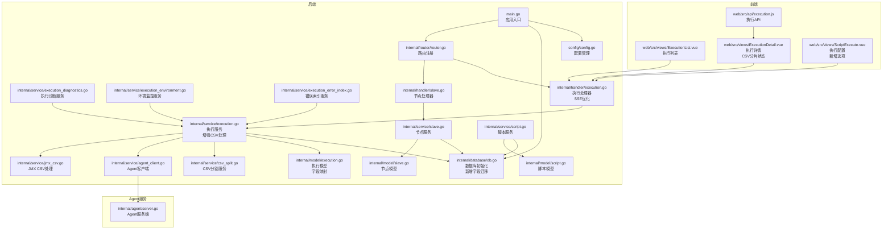

**图表来源**
- [main.go:28-66](file://main.go#L28-L66)
- [router.go:14-112](file://internal/router/router.go#L14-L112)
- [execution.go:104-481](file://internal/service/execution.go#L104-L481)
- [execution_diagnostics.go:417-586](file://internal/service/execution_diagnostics.go#L417-L586)
- [execution_environment.go:362-410](file://internal/service/execution_environment.go#L362-L410)
- [execution_error_index.go:60-82](file://internal/service/execution_error_index.go#L60-L82)
- [slave_service.go:15-41](file://internal/service/slave.go#L15-L41)
- [script_service.go:18-83](file://internal/service/script.go#L18-L83)
- [csv_split.go:1-144](file://internal/service/csv_split.go#L1-L144)
- [agent_client.go:1-181](file://internal/service/agent_client.go#L1-L181)
- [server.go:1-200](file://internal/agent/server.go#L1-L200)
- [jmx_csv.go:1-137](file://internal/service/jmx_csv.go#L1-L137)
- [execution_list_view.vue:292-695](file://web/src/views/ExecutionList.vue#L292-L695)
- [execution_detail_view.vue:777-944](file://web/src/views/ExecutionDetail.vue#L777-L944)
- [script_execute_view.vue:1-200](file://web/src/views/ScriptExecute.vue#L1-L200)
- [execution_api.js:1-93](file://web/src/api/execution.js#L1-L93)

**章节来源**
- [main.go:28-66](file://main.go#L28-L66)
- [router.go:14-112](file://internal/router/router.go#L14-L112)

## 核心组件
- 执行服务（Execution Service）：负责创建执行、构建 JMeter 命令、异步执行、合并结果、生成报告、状态更新与实时指标解析，支持增强的CSV分片处理
- **执行诊断服务（Execution Diagnostics Service）**：提供脚本依赖分析、执行状态诊断、错误明细状态检查与环境一致性警告
- **环境监控服务（Execution Environment Service）**：收集并比较 Master 与 Slave 节点的 JMeter 版本、插件配置、属性文件等环境信息
- **错误索引服务（Execution Error Index Service）**：实现错误分析结果的索引与缓存机制，支持定时刷新与签名验证
- 节点服务（Slave Service）：负责节点列表、状态检测、心跳维护
- 脚本服务（Script Service）：负责脚本 CRUD、文件上传与校验、JMX 内容管理
- **CSV分割服务（CSV Split Service）**：负责将大型CSV文件均匀拆分为多个分片，支持表头保留和均分算法，支持Master节点参与执行
- **JMX CSV处理服务（JMX CSV Processing Service）**：解析JMX文件中的CSV数据集引用，支持文件头一致性检查和智能重写
- **Agent客户端（Agent Client）**：负责与Slave Agent通信，支持文件上传、删除和健康检查
- **执行结论服务（Execution Conclusion Service）**：基于核心指标自动生成执行结论，包含级别、标题、摘要、关键观察和建议动作
- **接口级统计分析服务（Interface-level Statistical Analysis Service）**：提供按接口维度的详细统计分析，支持最慢接口、最高风险接口识别
- **环境比较严重性分类服务（Environment Comparison Severity Classification Service）**：对环境差异进行严重性分级，提供针对性的警告信息
- 数据库（SQLite）：存储脚本、节点、执行记录与文件元数据，包含新增的save_http_details、include_master、split_csv字段
- **Agent服务端（Agent Server）**：Slave Agent的服务端实现，支持文件上传、删除和系统监控
- 路由与处理器：提供 REST API，统一处理请求与响应，优化SSE流式传输
- 前端视图：执行列表、执行详情、执行配置界面，支持实时监控与报告查看
- **执行API（Execution API）**：提供执行相关的前端API调用封装

**章节来源**
- [execution.go:104-481](file://internal/service/execution.go#L104-L481)
- [execution_diagnostics.go:417-586](file://internal/service/execution_diagnostics.go#L417-L586)
- [execution_environment.go:362-410](file://internal/service/execution_environment.go#L362-L410)
- [execution_error_index.go:60-82](file://internal/service/execution_error_index.go#L60-L82)
- [slave_service.go:15-41](file://internal/service/slave.go#L15-L41)
- [script_service.go:18-83](file://internal/service/script.go#L18-L83)
- [csv_split.go:1-144](file://internal/service/csv_split.go#L1-L144)
- [jmx_csv.go:1-137](file://internal/service/jmx_csv.go#L1-L137)
- [agent_client.go:1-181](file://internal/service/agent_client.go#L1-L181)
- [server.go:1-200](file://internal/agent/server.go#L1-L200)
- [db.go:36-124](file://internal/database/db.go#L36-L124)
- [execution_api.js:1-93](file://web/src/api/execution.js#L1-L93)

## 架构总览
系统采用"微服务风格"的单体应用架构，后端以服务层为核心，通过处理器暴露 API，前端通过 HTTP 与 SSE 与后端交互。新增的诊断与监控流程包括执行诊断分析、环境一致性检查、错误索引缓存机制和执行结论生成。**增强的执行配置支持失败请求明细保存、Master节点参与执行、CSV数据分片等高级功能**。

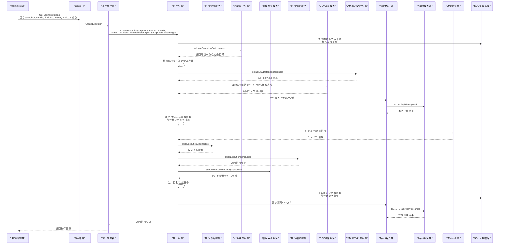

**图表来源**
- [execution_handler.go:39-76](file://internal/handler/execution.go#L39-L76)
- [execution.go:104-481](file://internal/service/execution.go#L104-L481)
- [execution_diagnostics.go:417-586](file://internal/service/execution_diagnostics.go#L417-L586)
- [execution_environment.go:362-410](file://internal/service/execution_environment.go#L362-L410)
- [execution_error_index.go:60-82](file://internal/service/execution_error_index.go#L60-L82)
- [execution.go:1895-2111](file://internal/service/execution.go#L1895-L2111)
- [csv_split.go:17-144](file://internal/service/csv_split.go#L17-L144)
- [jmx_csv.go:26-54](file://internal/service/jmx_csv.go#L26-L54)
- [agent_client.go:42-99](file://internal/service/agent_client.go#L42-L99)
- [server.go:144-195](file://internal/agent/server.go#L144-L195)

## 详细组件分析

### 执行服务（Execution Service）
执行服务是系统的核心，负责完整的测试执行生命周期管理，**现已支持增强的执行配置选项**：
- 脚本与节点选择：根据脚本 ID 查询脚本信息，根据节点 ID 查询在线节点
- **环境验证**：执行前进行环境一致性检查，支持忽略警告选项
- **CSV文件处理**：自动检测脚本中的CSV文件，计算分片数量（节点数±1），拆分文件并上传到各节点，支持Master节点参与执行
- **JMX CSV处理**：解析JMX中的CSV数据集引用，检查文件头一致性，生成智能文件名映射
- 命令构建：动态生成 JMeter 参数，支持本地与分布式模式，包含 JVM 内存参数计算和错误明细监听器
- 异步执行：使用 goroutine 并发执行本地与远程命令，合并 JTL，生成 HTML 报告
- 结果解析：解析 JTL 生成摘要数据，更新执行状态与持续时间
- 实时指标：解析 JTL 实时趋势，聚合每秒请求数、平均响应时间、成功率等
- **错误明细**：支持保存失败请求的 HTTP 明细，分布式模式下自动回传，可配置是否启用
- **错误分析**：实现错误分析结果的缓存与索引，支持分页查询与导出
- **执行结论生成**：在执行完成后自动生成执行结论，包含级别、标题、摘要、关键观察和建议动作

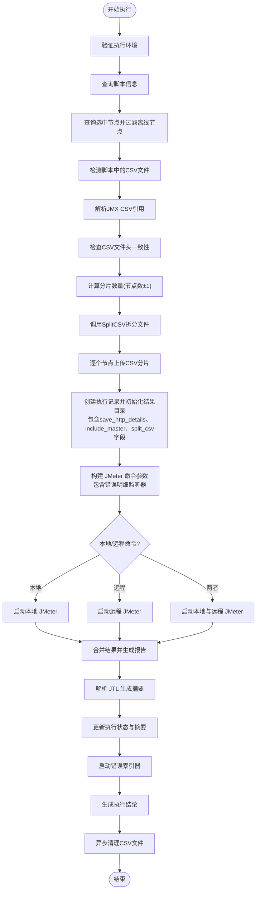

**图表来源**
- [execution.go:104-481](file://internal/service/execution.go#L104-L481)
- [execution.go:250-370](file://internal/service/execution.go#L250-L370)
- [execution_error_index.go:60-82](file://internal/service/execution_error_index.go#L60-L82)
- [execution.go:1895-2111](file://internal/service/execution.go#L1895-L2111)
- [csv_split.go:17-144](file://internal/service/csv_split.go#L17-L144)
- [jmx_csv.go:26-54](file://internal/service/jmx_csv.go#L26-L54)

**章节来源**
- [execution.go:104-481](file://internal/service/execution.go#L104-L481)
- [execution.go:250-370](file://internal/service/execution.go#L250-L370)
- [execution_model.go:3-18](file://internal/model/execution.go#L3-L18)
- [execution.go:1895-2111](file://internal/service/execution.go#L1895-L2111)

### 数据库设计（增强）
系统使用 SQLite 作为持久化存储，**现已包含新增的执行配置字段**：
- scripts：脚本基本信息与主文件路径
- script_files：脚本关联的文件（JMX、CSV、JAR 等）
- slaves：节点信息与状态
- executions：执行记录、结果路径、报告路径、摘要数据，**新增save_http_details、include_master、split_csv字段**

**新增字段说明**：
- save_http_details：是否保存失败请求的HTTP明细，用于故障排查
- include_master：是否让Master节点参与实际执行，而非仅作调度
- split_csv：是否对CSV数据文件进行分片处理，避免重复消费

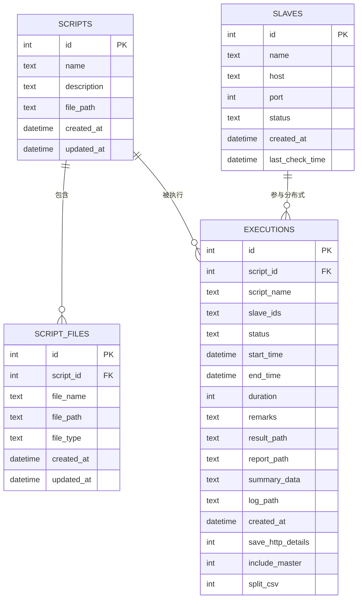

**图表来源**
- [db.go:37-101](file://internal/database/db.go#L37-L101)
- [db.go:154-179](file://internal/database/db.go#L154-L179)

**章节来源**
- [db.go:36-124](file://internal/database/db.go#L36-L124)
- [db.go:154-179](file://internal/database/db.go#L154-L179)

### 执行配置界面（增强）
前端执行配置界面现已支持**三个新的执行选项**：
- **失败请求明细**：保存失败样本的请求和响应细节，执行结果页可直接排查 HTTP 问题
- **Master参与执行**：开启后 Master 既负责调度，也会参与施压；关闭后 Master 只做调度
- **CSV数据分片**：分布式模式下按节点拆分 CSV，降低多个节点重复消费同一批数据的概率

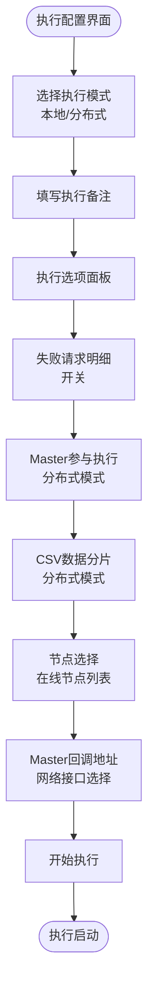

**图表来源**
- [script_execute_view.vue:95-135](file://web/src/views/ScriptExecute.vue#L95-L135)
- [script_execute_view.vue:155-175](file://web/src/views/ScriptExecute.vue#L155-L175)

**章节来源**
- [script_execute_view.vue:95-135](file://web/src/views/ScriptExecute.vue#L95-L135)
- [script_execute_view.vue:155-175](file://web/src/views/ScriptExecute.vue#L155-L175)

### SSE流式传输优化
SSE（Server-Sent Events）流式传输机制得到优化，**支持更精细的实时监控数据采集和展示**：
- **流式头部设置**：正确的Content-Type、Cache-Control、Connection和X-Accel-Buffering配置
- **节点数据缓存**：9秒缓存策略，避免频繁的节点状态查询
- **错误处理**：完整的错误事件发送和客户端断开检测
- **完成信号**：执行结束后发送complete事件通知客户端
- **实时指标**：每3秒推送一次执行快照，包含执行状态、实时指标、错误概览和节点指标

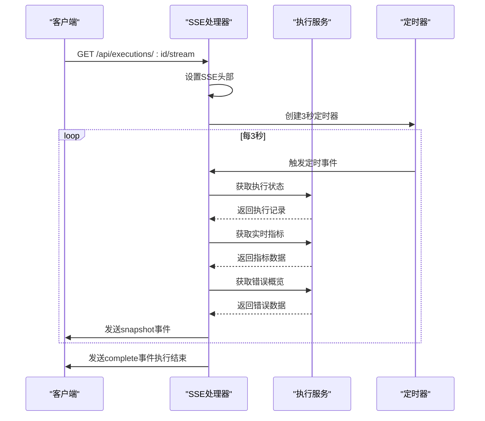

**图表来源**
- [execution_handler.go:159-244](file://internal/handler/execution.go#L159-L244)

**章节来源**
- [execution_handler.go:159-244](file://internal/handler/execution.go#L159-L244)

### CSV分割服务（增强）
CSV分割服务专门负责处理大型CSV文件的分割和分发，**现已支持Master节点参与执行的增强功能**：
- **均分算法**：计算每个分片的数据行数，前remainder个分片多1行，其余分片保持base行数
- **表头处理**：每个分片都保留原始表头，确保数据完整性
- **错误处理**：完整的错误处理机制，包括文件打开失败、扫描失败、创建分片文件失败等情况
- **资源清理**：在发生错误时自动清理已创建的分片文件
- **Master参与**：当includeMaster为true且分片数大于节点数时，额外创建一个分片供Master节点使用

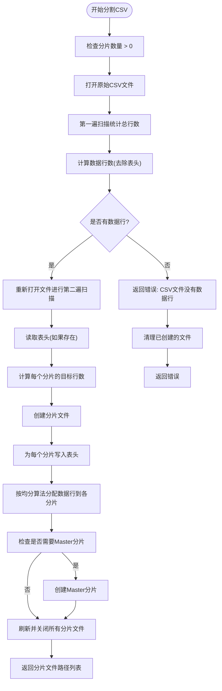

**图表来源**
- [csv_split.go:17-144](file://internal/service/csv_split.go#L17-L144)

**章节来源**
- [csv_split.go:1-144](file://internal/service/csv_split.go#L1-L144)

### JMX CSV处理服务（增强）
JMX CSV处理服务专门负责解析和处理JMX文件中的CSV数据集引用，**现已支持更智能的文件名映射和共享模式调整**：
- **CSV引用提取**：使用正则表达式解析CSVDataSet元素，提取文件名和配置信息
- **文件头一致性检查**：验证同一CSV文件在多个CSVDataSet中的ignoreFirstLine配置是否一致
- **智能文件名映射**：生成唯一的运行时目标文件名，避免同名冲突
- **JMX重写**：自动修改JMX文件中的CSV文件路径和共享模式配置，支持分布式环境

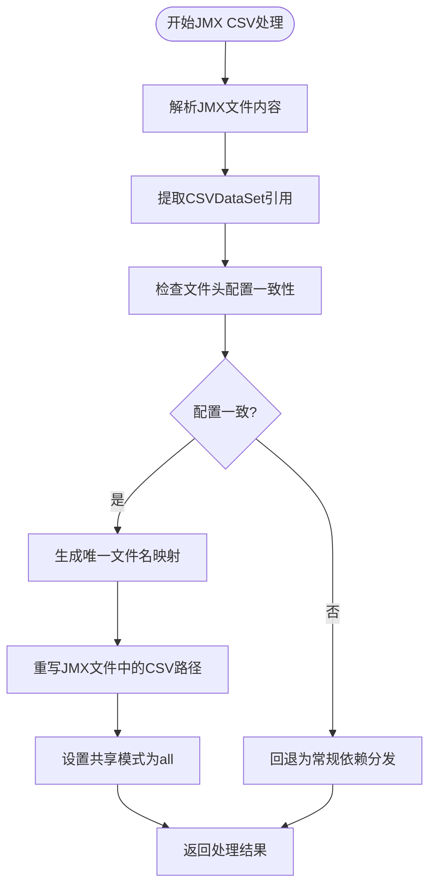

**图表来源**
- [jmx_csv.go:26-54](file://internal/service/jmx_csv.go#L26-L54)
- [jmx_csv.go:70-81](file://internal/service/jmx_csv.go#L70-L81)
- [jmx_csv.go:83-107](file://internal/service/jmx_csv.go#L83-L107)
- [jmx_csv.go:109-136](file://internal/service/jmx_csv.go#L109-L136)

**章节来源**
- [jmx_csv.go:1-137](file://internal/service/jmx_csv.go#L1-L137)

### 执行诊断服务（Enhanced）
执行诊断服务提供全面的执行状态分析与环境监控能力，**现已支持新增字段的诊断展示**：
- **执行状态诊断**：根据执行摘要数据动态计算显示状态，区分运行中、成功、部分失败、全部失败等状态
- **文件状态检查**：检查最终结果文件、运行脚本、错误明细文件的存在状态与大小
- **错误明细状态分析**：跟踪本地与远程错误明细文件的收集状态，支持完整、部分、缺失等状态判断
- **脚本依赖分析**：解析 JMX 文件，识别 CSV 文件、本地文件、插件依赖等，并生成缺失依赖警告
- **环境一致性监控**：检查分布式执行时的环境差异，包括 JMeter 版本、插件配置、属性文件等
- **执行模式识别**：自动识别本地、分布式、包含 Master 的执行模式
- **CSV分片状态**：诊断CSV文件分片状态，包括分片数量、上传状态、Master参与情况

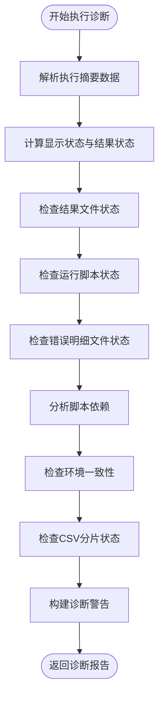

**图表来源**
- [execution_diagnostics.go:92-153](file://internal/service/execution_diagnostics.go#L92-L153)
- [execution_diagnostics.go:417-586](file://internal/service/execution_diagnostics.go#L417-L586)

**章节来源**
- [execution_diagnostics.go:92-153](file://internal/service/execution_diagnostics.go#L92-L153)
- [execution_diagnostics.go:417-586](file://internal/service/execution_diagnostics.go#L417-L586)

### 实时监控与SSE传输（Enhanced）
系统提供增强的实时监控能力，**支持更精细的执行状态跟踪和异常处理机制**：
- **SSE流式传输**：使用Server-Sent Events实现实时数据推送，支持断线重连
- **节点状态监控**：每9秒刷新一次节点资源状态，包括CPU、内存、连接数等
- **错误事件处理**：完整的错误事件发送和客户端断开检测机制
- **执行状态同步**：实时推送执行状态变化，包括运行中、完成、失败等状态
- **指标聚合**：实时聚合执行指标，包括吞吐量、响应时间、错误率等
- **日志流式输出**：支持静态日志复盘和实时日志流两种模式

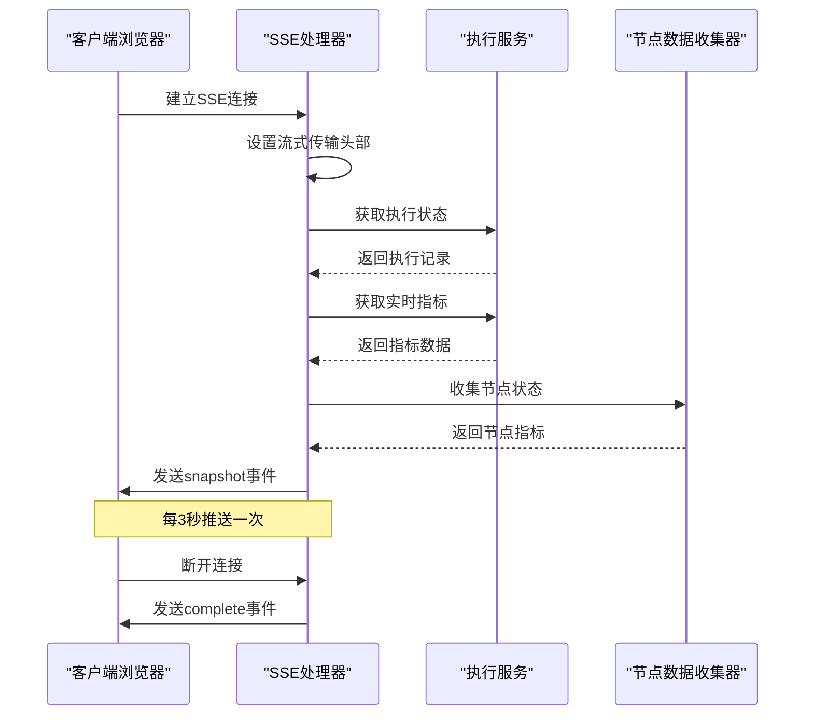

**图表来源**
- [execution_handler.go:159-244](file://internal/handler/execution.go#L159-L244)

**章节来源**
- [execution_handler.go:159-244](file://internal/handler/execution.go#L159-L244)

### 错误报告生成（增强）
系统提供增强的错误报告生成功能，**基于智能分析算法自动生成执行结论**：
- **智能复盘结论**：buildErrorReportHighlights函数根据错误分布、接口失败率、来源节点等指标生成针对性建议
- **多维度分析**：包含错误分类聚类、来源节点分析、失败接口排行、Top错误信息等
- **详细统计**：提供错误率、总样本数、错误总数等关键指标
- **Markdown报告**：支持生成可分享的Markdown格式错误报告
- **缓存机制**：实现2秒TTL的内存缓存和索引文件缓存，提升查询性能

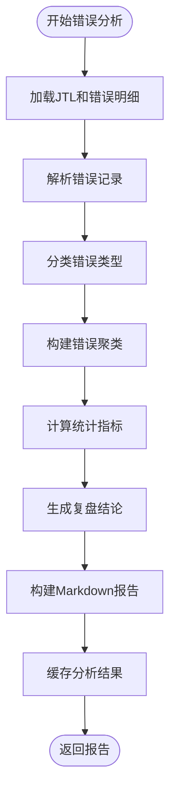

**图表来源**
- [execution.go:3252-3451](file://internal/service/execution.go#L3252-L3451)
- [execution.go:3900-4099](file://internal/service/execution.go#L3900-L4099)
- [execution_error_index.go:1-81](file://internal/service/execution_error_index.go#L1-L81)

**章节来源**
- [execution.go:3252-3451](file://internal/service/execution.go#L3252-L3451)
- [execution.go:3900-4099](file://internal/service/execution.go#L3900-L4099)
- [execution_error_index.go:1-81](file://internal/service/execution_error_index.go#L1-L81)

## 依赖关系分析
系统依赖关系清晰，模块间耦合度低，**新增的执行配置字段增强了系统的灵活性和可配置性**：
- 路由层仅依赖处理器，处理器依赖服务层，服务层依赖数据库层
- 前端通过 API 与后端交互，不直接依赖后端业务逻辑
- 配置模块独立于业务模块，便于部署与运维
- **新增诊断与监控模块**：执行诊断服务依赖执行服务与环境监控服务，环境监控服务独立于其他模块
- **错误索引模块**：错误索引服务与执行服务紧密集成，提供缓存与索引功能
- **CSV处理模块**：CSV分割服务与JMX CSV处理服务协同工作，提供完整的CSV处理能力
- **执行结论模块**：执行结论服务与执行服务深度集成，在执行完成后自动生成结论
- **接口级分析模块**：接口级统计分析服务与执行结论服务协作，提供针对性的接口优化建议
- **数据库增强模块**：新增字段迁移机制，支持向后兼容的数据库升级

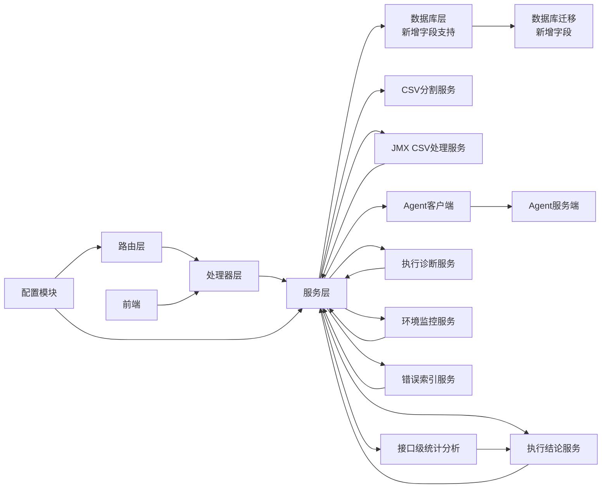

**图表来源**
- [router.go:14-112](file://internal/router/router.go#L14-L112)
- [execution_handler.go:39-76](file://internal/handler/execution.go#L39-L76)
- [execution.go:104-481](file://internal/service/execution.go#L104-L481)
- [execution_diagnostics.go:417-586](file://internal/service/execution_diagnostics.go#L417-L586)
- [execution_environment.go:362-410](file://internal/service/execution_environment.go#L362-L410)
- [execution_error_index.go:60-82](file://internal/service/execution_error_index.go#L60-L82)
- [execution.go:1895-2111](file://internal/service/execution.go#L1895-L2111)
- [csv_split.go:1-144](file://internal/service/csv_split.go#L1-L144)
- [jmx_csv.go:1-137](file://internal/service/jmx_csv.go#L1-L137)
- [agent_client.go:1-181](file://internal/service/agent_client.go#L1-L181)
- [server.go:1-200](file://internal/agent/server.go#L1-L200)
- [db.go:154-179](file://internal/database/db.go#L154-L179)

**章节来源**
- [router.go:14-112](file://internal/router/router.go#L14-L112)
- [config.go:43-84](file://config/config.go#L43-L84)

## 性能考虑
- JVM 内存动态计算：根据系统可用内存的 80% 动态设置 JVM 参数，避免内存不足导致执行失败
- 并发控制：分布式执行时限制节点并发检测，避免对节点造成过大压力
- 实时指标聚合：按秒级窗口聚合 JTL 数据，减少前端渲染压力
- **SSE流式传输优化**：使用9秒节点数据缓存策略，减少频繁的节点状态查询
- 数据库索引：为 executions 表的关键字段建立索引，提升查询性能
- **CSV文件处理优化**：
  - 两遍扫描算法：先统计行数再分配，确保均分效果
  - 分片文件复用：避免重复创建相同大小的分片
  - 异步清理机制：执行完成后异步清理，不影响执行性能
  - 节点负载均衡：按节点数量均分CSV文件，避免单节点过载
  - **Master参与优化**：当includeMaster为true时，智能分配额外分片给Master节点
  - **文件头一致性检查**：避免因配置不一致导致的数据分片问题
- **错误分析性能优化**：
  - 索引文件缓存：避免重复解析错误明细文件
  - 定时刷新机制：平衡数据新鲜度与性能开销
  - 签名验证：确保缓存数据的有效性
  - **内存缓存机制**：实现2秒TTL的内存缓存，进一步提升性能
  - **智能缓存签名**：基于文件状态变化的签名机制，避免无效缓存
- **环境监控优化**：
  - 并发收集：限制同时收集的节点数量
  - 差异比较：仅在必要时进行详细的差异比较
  - 缓存机制：复用已收集的环境信息
- **执行结论生成优化**：
  - 指标计算缓存：避免重复计算相同的统计指标
  - 级别判定算法优化：使用高效的阈值比较逻辑
  - 建议动作模板化：减少动态生成的计算开销
  - 接口分析优化：对大数据集进行分批处理，避免内存溢出
  - **智能复盘结论**：基于错误分布特征的智能分析算法
- **数据库字段优化**：
  - 新增字段使用INTEGER存储布尔值，节省存储空间
  - 默认值设置确保向后兼容性
  - 字段迁移机制支持现有数据的平滑升级

**章节来源**
- [execution.go:54-101](file://internal/service/execution.go#L54-L101)
- [slave_service.go:179-219](file://internal/service/slave.go#L179-L219)
- [db.go:174-189](file://internal/database/db.go#L174-L189)
- [csv_split.go:29-47](file://internal/service/csv_split.go#L29-L47)
- [execution_error_index.go:60-82](file://internal/service/execution_error_index.go#L60-L82)
- [execution_environment.go:362-410](file://internal/service/execution_environment.go#L362-L410)
- [execution.go:3051-3072](file://internal/service/execution.go#L3051-L3072)
- [execution.go:2032-2111](file://internal/service/execution.go#L2032-L2111)
- [db.go:154-179](file://internal/database/db.go#L154-L179)

## 故障排除指南
- 执行状态异常：检查执行服务的日志文件路径，确认 JMeter 命令是否正确执行
- 分布式节点不可用：确认节点状态为 online，检查网络连通性与 jmeter-server 是否启动
- 结果文件缺失：确认 result_path 与 report_path 是否正确生成，检查磁盘空间
- 实时指标为空：确认 JTL 文件是否生成，检查字段映射与解析逻辑
- 配置问题：检查 config.yaml 中的 server、jmeter、slave、dirs 配置项
- **CSV文件处理问题**：
  - CSV文件不存在：检查脚本中的CSV文件路径是否正确
  - 分片失败：检查磁盘空间和文件权限，确认CSV文件可读
  - 节点上传失败：检查Agent服务状态和网络连通性
  - 自动清理失败：检查Agent服务端的文件删除权限
  - **文件头不一致**：检查CSVDataSet中的ignoreFirstLine配置是否一致
  - **同名CSV冲突**：系统会自动重命名分发以避免冲突
  - **Master分片问题**：检查includeMaster配置和Master节点资源
- **执行诊断问题**：
  - 诊断报告为空：检查执行摘要数据格式，确认 JSON 解析正常
  - 依赖分析错误：检查 JMX 文件格式，确认字符串属性解析正常
  - 环境监控失败：检查 Agent 服务状态，确认环境报告收集正常
  - **CSV分片诊断错误**：检查分片数量计算和上传状态
- **错误索引问题**：
  - 索引文件创建失败：检查执行结果目录权限，确认文件写入正常
  - 缓存失效：检查签名验证逻辑，确认文件状态变化检测正常
  - 定时刷新异常：检查定时器状态，确认索引器正常运行
  - **内存缓存问题**：检查TTL设置和缓存清理机制
  - **智能缓存签名失效**：检查文件状态监控机制
- **执行结论生成问题**：
  - 结论级别错误：检查指标计算逻辑，确认阈值设置正确
  - 关键观察缺失：检查统计指标提取逻辑，确认数据完整性
  - 建议动作不当：检查建议模板逻辑，确认与级别匹配
  - 接口分析异常：检查接口统计计算，确认大数据集处理正确
  - **智能复盘结论异常**：检查错误分布分析算法
- **环境比较严重性分类问题**：
  - 分类结果不准确：检查严重性评分算法，确认权重设置合理
  - 警告信息不完整：检查差异比较逻辑，确认所有差异类型都被考虑
  - 性能影响：检查分类算法复杂度，避免对执行性能造成影响
- **SSE流式传输问题**：
  - 流式传输失败：检查SSE头部设置和客户端连接状态
  - 数据刷新异常：检查定时器配置和节点数据缓存策略
  - 断线重连问题：检查客户端断开检测和错误事件处理
- **数据库字段问题**：
  - 字段不存在：检查数据库迁移是否成功执行
  - 字段值异常：检查默认值设置和数据转换逻辑
  - 兼容性问题：确认向后兼容性，避免影响现有功能

**章节来源**
- [execution_handler.go:556-708](file://internal/handler/execution.go#L556-L708)
- [slave_handler.go:97-122](file://internal/handler/slave.go#L97-L122)
- [config.go:43-84](file://config/config.go#L43-L84)
- [csv_split.go:24-26](file://internal/service/csv_split.go#L24-L26)
- [agent_client.go:93-96](file://internal/service/agent_client.go#L93-L96)
- [execution_diagnostics.go:417-586](file://internal/service/execution_diagnostics.go#L417-L586)
- [execution_environment.go:362-410](file://internal/service/execution_environment.go#L362-L410)
- [execution_error_index.go:60-82](file://internal/service/execution_error_index.go#L60-L82)
- [jmx_csv.go:70-81](file://internal/service/jmx_csv.go#L70-L81)
- [execution.go:2032-2111](file://internal/service/execution.go#L2032-L2111)
- [db.go:154-179](file://internal/database/db.go#L154-L179)

## 结论
本执行管理系统通过清晰的分层架构与完善的执行编排机制，实现了从脚本选择、节点分配到执行监控与结果收集的全流程自动化。**新增的save_http_details、include_master、split_csv数据库字段显著增强了系统的配置灵活性和执行能力**，通过智能的CSV数据分片、Master节点参与执行、失败请求明细保存等高级功能，为用户提供更加全面和深入的测试执行解决方案。**增强的SSE流式传输机制进一步提升了实时监控的性能和用户体验**，通过优化的节点数据缓存策略和错误处理机制，确保了执行过程的稳定性和可靠性。**智能错误报告生成功能基于多维度分析算法，自动生成针对性的执行结论和优化建议**，通过缓存机制和索引文件提升查询性能。这些增强功能不仅提升了系统的分析能力和智能化水平，还通过自动化的执行结论生成、精细化的接口级分析和科学的环境差异分级，为用户提供更加全面和深入的测试执行洞察。系统具备良好的扩展性与可维护性，适合中小规模到中等规模的性能测试场景。建议在生产环境中结合监控与告警体系，进一步完善资源使用统计与容量规划。

## 附录
- API 端点概览
  - 执行相关：GET/POST/DELETE /api/executions, GET /api/executions/:id, POST /api/executions/:id/stop, GET /api/executions/:id/live-metrics, GET /api/executions/:id/log, GET /api/executions/:id/errors, POST /api/executions/:id/error-details/upload, GET /api/executions/:id/download/jtl, GET /api/executions/:id/download/report, GET /api/executions/:id/download/errors, GET /api/executions/:id/download/error-report, GET /api/executions/:id/download/all
  - 节点相关：GET/POST/PUT/DELETE /api/slaves, POST /api/slaves/:id/check, GET /api/slaves/heartbeat-status
  - 脚本相关：GET/POST/PUT/DELETE /api/scripts, GET /api/scripts/:id, GET /api/scripts/:id/download, GET /api/scripts/:id/content, PUT /api/scripts/:id/content, POST /api/scripts/:id/files, DELETE /api/scripts/:id/files/:fileId
  - 配置相关：GET /api/config/network-interfaces, GET /api/config/master-hostname, PUT /api/config/master-hostname
  - **Agent文件操作**：POST /api/files/upload, DELETE /api/files/{filename}, DELETE /api/files/batch, GET /api/files/health
  - **环境监控**：GET /api/executions/:id/environment-report
  - **CSV处理**：GET /api/executions/:id/csv-dependencies
  - **执行结论**：GET /api/executions/:id/conclusion
  - **SSE流式传输**：GET /api/executions/:id/stream

**章节来源**
- [router.go:20-75](file://internal/router/router.go#L20-L75)
- [agent_client.go:42-99](file://internal/service/agent_client.go#L42-L99)
- [agent_client.go:101-124](file://internal/service/agent_client.go#L101-L124)
- [server.go:105-109](file://internal/agent/server.go#L105-L109)
- [execution_environment.go:412-433](file://internal/service/execution_environment.go#L412-L433)
- [jmx_csv.go:56-68](file://internal/service/jmx_csv.go#L56-L68)
- [execution.go:1925-1935](file://internal/service/execution.go#L1925-L1935)
- [execution_handler.go:159-244](file://internal/handler/execution.go#L159-L244)