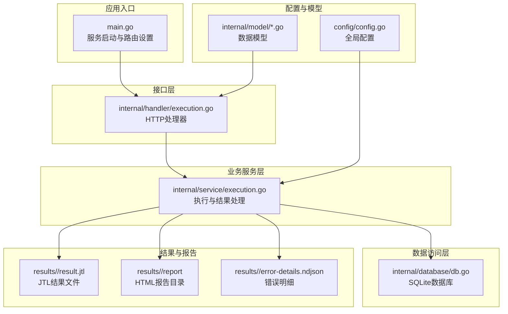
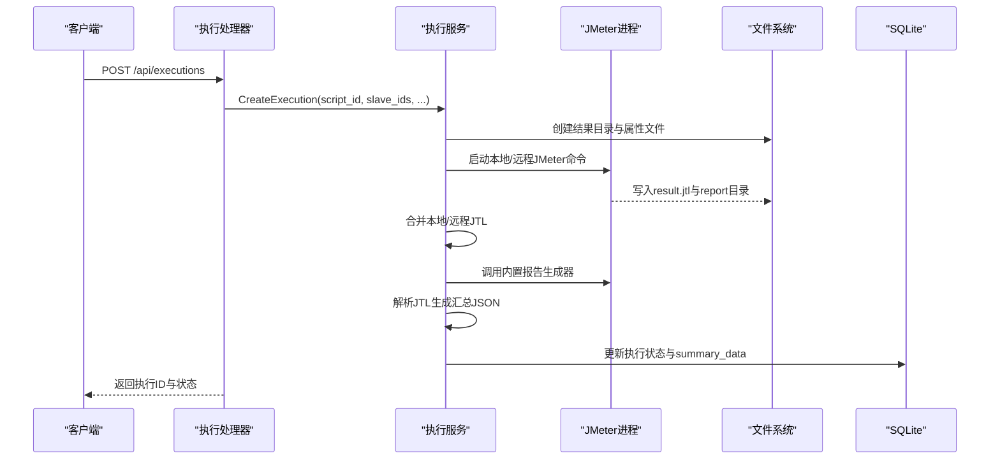
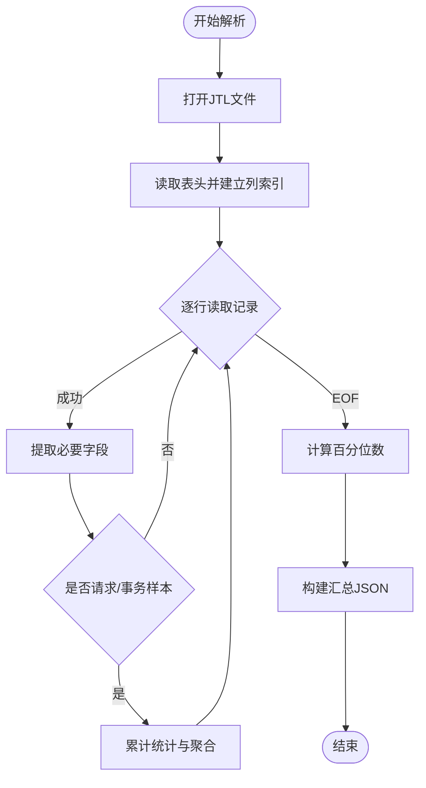
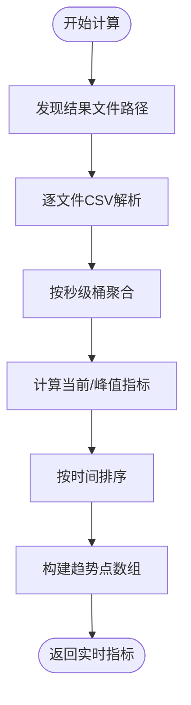
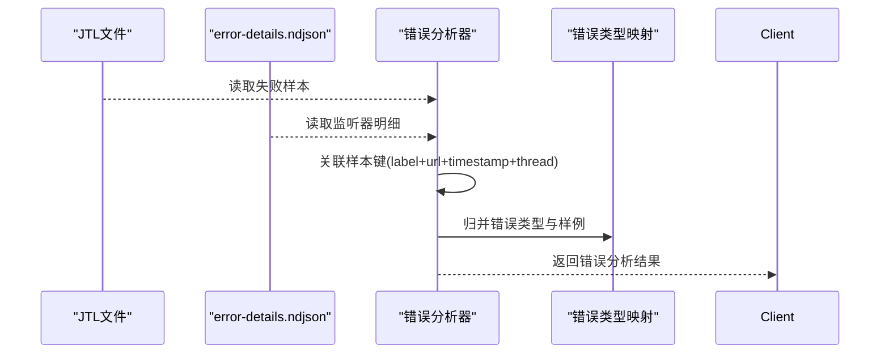
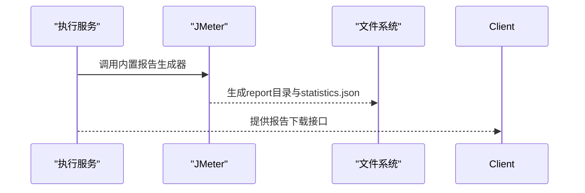
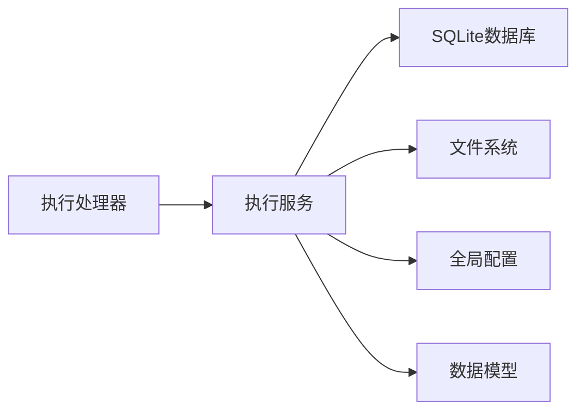

# 结果处理与分析

<cite>
**本文档引用的文件**
- [main.go](file://main.go)
- [execution.go](file://internal/service/execution.go)
- [execution.go](file://internal/handler/execution.go)
- [execution.go](file://internal/model/execution.go)
- [db.go](file://internal/database/db.go)
- [config.go](file://config/config.go)
- [statistics.json](file://results/10/report/statistics.json)
- [error-details.ndjson](file://results/7/error-details.ndjson)
</cite>

## 目录
1. [简介](#简介)
2. [项目结构](#项目结构)
3. [核心组件](#核心组件)
4. [架构概览](#架构概览)
5. [详细组件分析](#详细组件分析)
6. [依赖分析](#依赖分析)
7. [性能考虑](#性能考虑)
8. [故障排除指南](#故障排除指南)
9. [结论](#结论)
10. [附录](#附录)

## 简介
本文件面向JMeter管理系统的"结果处理与分析"模块，系统性阐述以下能力：
- JTL文件批量解析算法与大文件内存优化策略（流式处理）
- 测试结果统计分析方法（总体、分组、错误分类、性能分布）
- HTML报告生成技术（JMeter内置报告生成器调用与自定义模板集成）
- 错误详情收集与分析机制（HTTP响应详情提取、错误分类、根因分析）
- 执行摘要数据结构设计与JSON格式规范
- 结果数据缓存策略与查询优化
- 分布式执行结果合并算法与一致性保障

## 项目结构
系统采用Go语言后端+SQLite存储+前端Vue的典型三层架构。核心结果处理逻辑集中在内部服务层，通过HTTP接口对外提供能力。

**图表来源**
- [main.go:28-66](file://main.go#L28-L66)
- [execution.go:39-53](file://internal/handler/execution.go#L39-L53)
- [execution.go:104-481](file://internal/service/execution.go#L104-L481)
- [db.go:15-34](file://internal/database/db.go#L15-L34)

**章节来源**
- [main.go:28-66](file://main.go#L28-L66)
- [execution.go:39-53](file://internal/handler/execution.go#L39-L53)
- [execution.go:104-481](file://internal/service/execution.go#L104-L481)
- [db.go:15-34](file://internal/database/db.go#L15-L34)

## 核心组件
- 执行服务（CreateExecution/StopExecution/GetExecution）：负责创建执行、合并JTL、生成报告、解析汇总、错误分析等。
- 错误分析服务（GetExecutionErrors）：基于JTL与错误明细文件进行错误分类与根因分析。
- 实时指标服务（GetExecutionLiveMetrics）：按秒级窗口聚合实时吞吐、RT、成功率、并发等指标。
- 报告下载服务（DownloadReport/DownloadAll）：打包HTML报告与完整结果包。
- 数据持久化（SQLite）：存储脚本、执行记录、从机信息等元数据。

**章节来源**
- [execution.go:104-481](file://internal/service/execution.go#L104-L481)
- [execution.go:2139-2399](file://internal/service/execution.go#L2139-L2399)
- [execution.go:674-947](file://internal/service/execution.go#L674-L947)
- [execution.go:262-358](file://internal/handler/execution.go#L262-L358)
- [db.go:36-124](file://internal/database/db.go#L36-L124)

## 架构概览
下图展示了从执行创建到结果分析与报告生成的关键流程。

**图表来源**
- [execution.go:39-53](file://internal/handler/execution.go#L39-L53)
- [execution.go:104-481](file://internal/service/execution.go#L104-L481)

## 详细组件分析

### JTL批量解析与内存优化
- 流式CSV读取：使用标准库csv.Reader逐行读取JTL，避免一次性加载整文件至内存；LazyQuotes与FieldsPerRecord=-1提升兼容性。
- 列索引动态构建：首次读取表头后建立列名到索引的映射，后续记录按需提取字段。
- 采样过滤与识别：通过isRequestSample/isTransactionSample识别请求与事务样本，分别统计不同口径指标。
- 百分位计算：对响应时间数组排序后计算P50/P90/P95/P99，时间复杂度O(n log n)。
- 合并策略：mergeJTLFiles按表头写入后逐条追加记录，避免重复解析头部。

**图表来源**
- [execution.go:1063-1315](file://internal/service/execution.go#L1063-L1315)

**章节来源**
- [execution.go:1063-1315](file://internal/service/execution.go#L1063-L1315)

### 实时趋势与摘要（GetExecutionLiveMetrics）
- 秒级桶聚合：以timeStamp/1000为秒级键聚合，统计每秒请求数、错误数、RT总和、最大并发等。
- 指标计算：当前/峰值TPS、请求速率、平均RT、成功率、并发等，支持前端折线图展示。
- 并发提取：优先从allThreads/groupThreads字段提取并发值，取每秒最大值作为峰值。

**图表来源**
- [execution.go:674-947](file://internal/service/execution.go#L674-L947)

**章节来源**
- [execution.go:674-947](file://internal/service/execution.go#L674-L947)

### 错误详情收集与分析（GetExecutionErrors）
- 数据源整合：优先从错误明细监听器生成的error-details.ndjson读取，其次回退到JTL内嵌的请求/响应字段。
- 错误分类：以label+responseCode为维度聚合错误类型，统计次数、占比、首次/末次时间，并保留每类少量样例。
- 详情字段：当监听器启用时，优先使用监听器提供的请求头/请求体/响应头/响应体；否则回退JTL字段。
- 上传回传：分布式场景下，从机通过HTTP上传错误明细，主控校验令牌后落盘合并。

**图表来源**
- [execution.go:2139-2399](file://internal/service/execution.go#L2139-L2399)
- [error-details.ndjson:1-32](file://results/7/error-details.ndjson#L1-L32)

**章节来源**
- [execution.go:2139-2399](file://internal/service/execution.go#L2139-L2399)
- [error-details.ndjson:1-32](file://results/7/error-details.ndjson#L1-L32)

### HTML报告生成与下载
- 生成流程：执行结束后调用JMeter内置报告生成器，基于合并后的JTL生成HTML报告目录与statistics.json。
- 下载能力：支持下载ZIP压缩包（包含日志、JTL、报告、美化后的summary.json），以及单独下载报告ZIP。
- 自定义模板：通过注入JSR223监听器与上传线程组，实现错误明细监听与回传，间接实现自定义报告扩展。

**图表来源**
- [execution.go:428-436](file://internal/service/execution.go#L428-L436)
- [execution.go:262-358](file://internal/handler/execution.go#L262-L358)

**章节来源**
- [execution.go:428-436](file://internal/service/execution.go#L428-L436)
- [execution.go:262-358](file://internal/handler/execution.go#L262-L358)
- [statistics.json:1-50](file://results/10/report/statistics.json#L1-L50)

### 执行摘要数据结构与JSON规范
- 汇总字段：包含总样本数、成功/失败数、平均/最小/最大响应时间、吞吐量、事务TPS、请求速率、错误率/成功率、P50/P90/P95/P99、样本跨度、网络字节统计等。
- 存储格式：以JSON字符串形式存储在executions.summary_data字段，便于前端直接渲染与二次加工。
- 规范要点：字段命名统一、单位明确（毫秒、字节、每秒）、百分比保留两位小数；当JTL字段缺失时，相应指标为空或0。

**章节来源**
- [execution.go:1284-1315](file://internal/service/execution.go#L1284-L1315)
- [execution.go:3-18](file://internal/model/execution.go#L3-L18)

### 分布式执行结果合并与一致性
- 合并策略：将本地与远程JTL分别解析，按表头写入合并文件，逐条追加记录，避免重复解析表头。
- 一致性保障：合并前检查文件存在与大小，合并后触发报告生成；若任一子执行失败，最终状态标记为失败。
- 令牌校验：分布式错误明细上传使用随机令牌，主控侧校验通过后才写入，防止伪造与丢失。

**章节来源**
- [execution.go:1359-1430](file://internal/service/execution.go#L1359-L1430)
- [execution.go:2002-2031](file://internal/service/execution.go#L2002-L2031)

## 依赖分析
- 外部依赖：JMeter可执行程序、SQLite数据库驱动、Gin Web框架、Flot图表库（报告页面）。
- 内部耦合：处理器依赖服务层，服务层依赖数据库与文件系统；模型层提供数据契约；配置层提供全局参数。

**图表来源**
- [execution.go:39-53](file://internal/handler/execution.go#L39-L53)
- [execution.go:104-481](file://internal/service/execution.go#L104-L481)
- [db.go:15-34](file://internal/database/db.go#L15-L34)
- [config.go:41-84](file://config/config.go#L41-L84)

**章节来源**
- [execution.go:39-53](file://internal/handler/execution.go#L39-L53)
- [execution.go:104-481](file://internal/service/execution.go#L104-L481)
- [db.go:15-34](file://internal/database/db.go#L15-L34)
- [config.go:41-84](file://config/config.go#L41-L84)

## 性能考虑
- 内存优化：CSV流式读取、按需字段提取、百分位计算前的数组长度控制，避免大文件导致内存峰值过高。
- I/O优化：合并JTL时复用writer，减少系统调用；报告生成与下载采用ZIP流式写入。
- 并发与资源：动态计算JVM堆参数，结合系统可用内存上限，避免JMeter执行阶段OOM。
- 查询优化：数据库表建立索引（script_id、status、created_at），分页查询时限制page_size上限。

**章节来源**
- [execution.go:54-101](file://internal/service/execution.go#L54-L101)
- [execution.go:65-71](file://internal/handler/execution.go#L65-L71)
- [db.go:174-189](file://internal/database/db.go#L174-L189)

## 故障排除指南
- JTL解析异常：检查JTL字段完整性（elapsed、success等），确认CSV读取器配置；关注列数异常行的跳过逻辑。
- 报告生成失败：确认JTL合并成功且存在；检查JMeter命令行参数与属性文件；查看执行日志定位具体错误。
- 错误明细缺失：确认执行时启用了错误明细监听器；检查从机上传令牌与回传路径；核对error-details目录与文件权限。
- 实时指标为空：确认JTL文件存在且非空；检查timeStamp字段有效性；确认按秒聚合逻辑正常。

**章节来源**
- [execution.go:1063-1315](file://internal/service/execution.go#L1063-L1315)
- [execution.go:2139-2399](file://internal/service/execution.go#L2139-L2399)
- [execution.go:262-358](file://internal/handler/execution.go#L262-L358)

## 结论
本系统通过流式解析、分桶聚合、监听器回传与内置报告生成器，实现了对大规模JMeter结果的高效处理与可视化呈现。配合SQLite索引与合理的内存/IO策略，能够在高并发场景下稳定运行。建议持续优化错误明细的去重与聚合策略，增强分布式一致性校验与容错能力。

## 附录
- 配置项参考：server.port、jmeter.path、jmeter.master_hostname、slave.heartbeat_interval、dirs.data/uploads/results。
- 数据模型参考：Execution、ErrorRecord、ErrorType、ErrorAnalysis等。

**章节来源**
- [config.go:10-41](file://config/config.go#L10-L41)
- [execution.go:3-18](file://internal/model/execution.go#L3-L18)
- [execution.go:1522-1571](file://internal/service/execution.go#L1522-L1571)