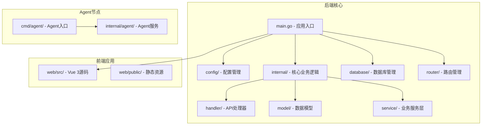
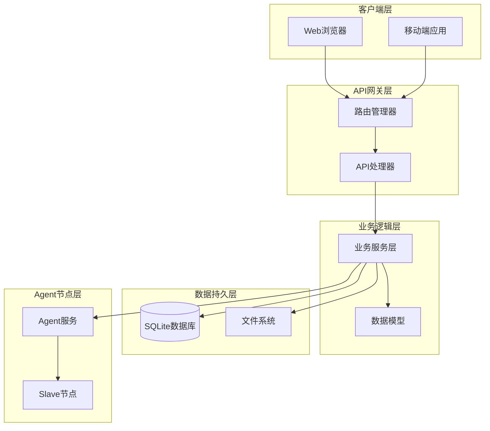
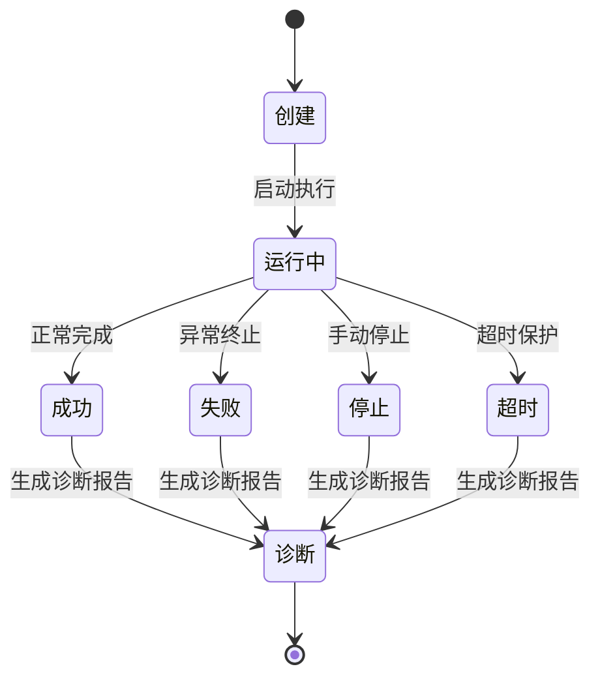
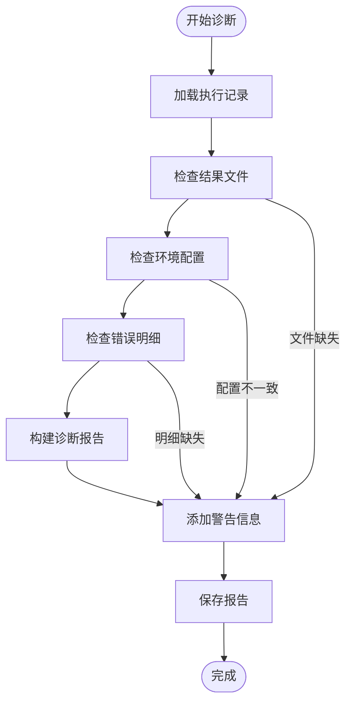
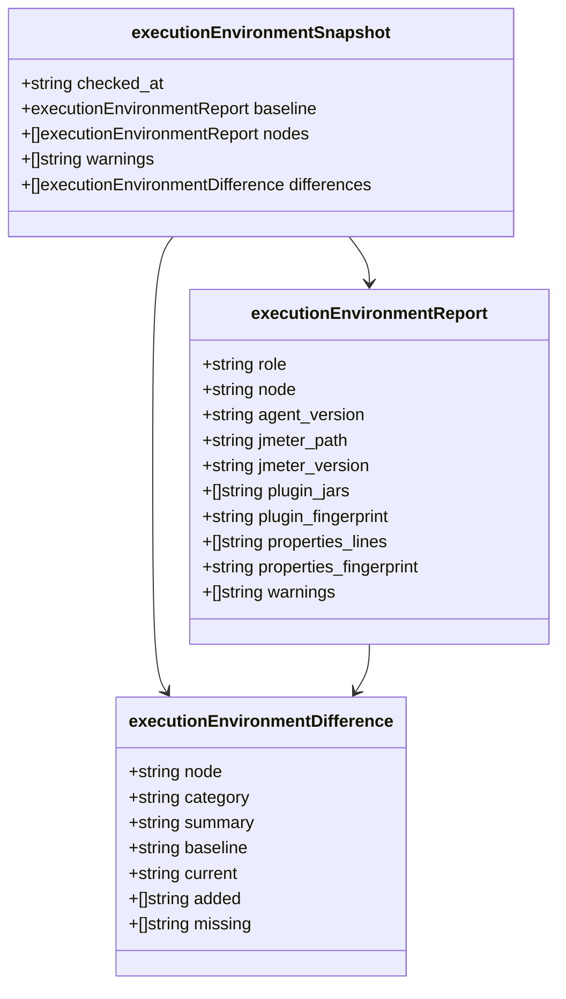
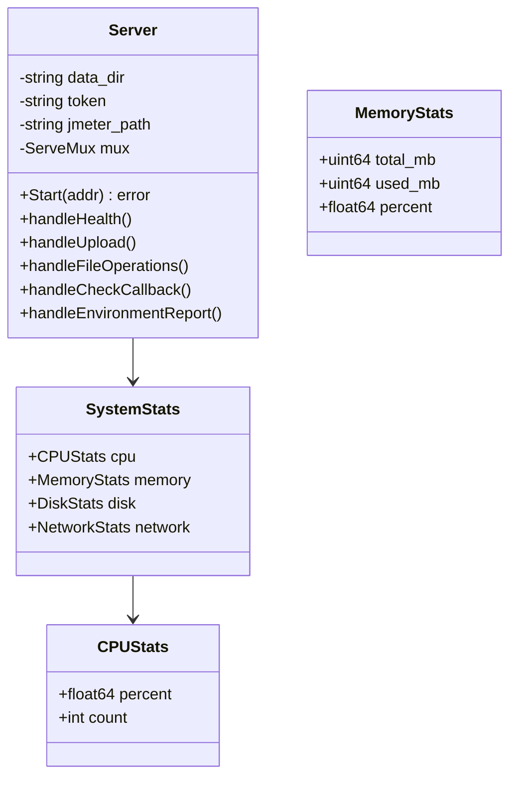
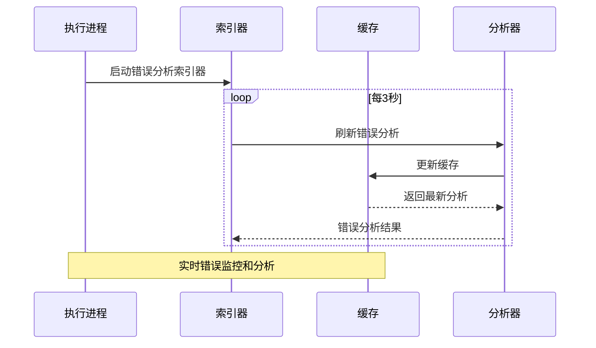
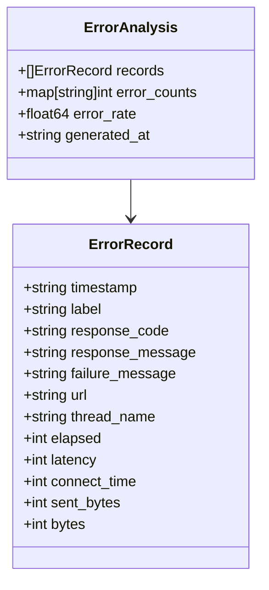
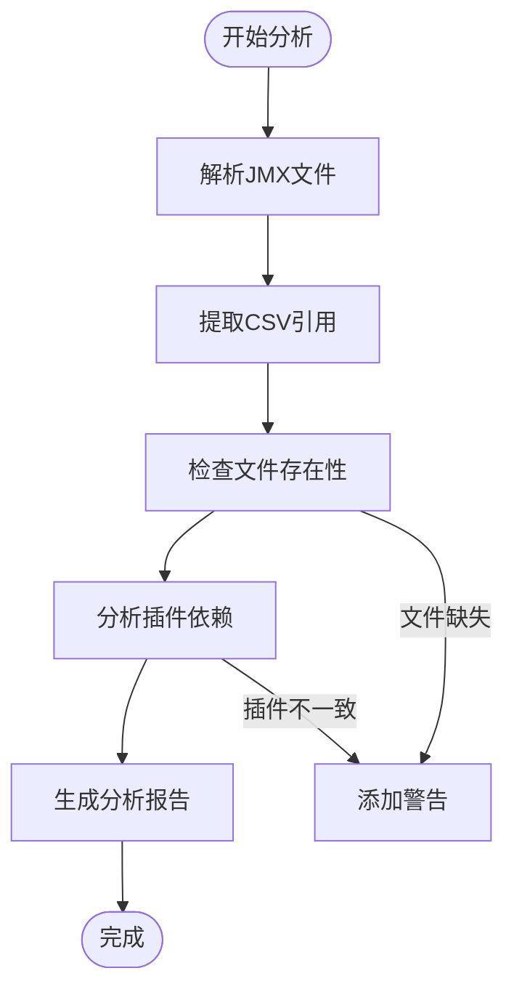
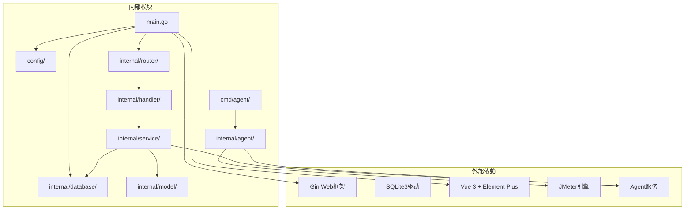

# 执行诊断系统

<cite>
**本文档引用的文件**
- [main.go](file://main.go)
- [README.md](file://README.md)
- [config.go](file://config/config.go)
- [router.go](file://internal/router/router.go)
- [db.go](file://internal/database/db.go)
- [execution.go](file://internal/model/execution.go)
- [execution.go](file://internal/service/execution.go)
- [execution_diagnostics.go](file://internal/service/execution_diagnostics.go)
- [execution_environment.go](file://internal/service/execution_environment.go)
- [execution_error_index.go](file://internal/service/execution_error_index.go)
- [jmx_csv.go](file://internal/service/jmx_csv.go)
- [execution.go](file://internal/handler/execution.go)
- [script.go](file://internal/handler/script.go)
- [slave.go](file://internal/handler/slave.go)
- [server.go](file://internal/agent/server.go)
- [main.go](file://cmd/agent/main.go)
</cite>

## 更新摘要
**所做更改**
- 新增了详细的执行诊断系统架构分析
- 完善了环境一致性检查机制的技术细节
- 增加了错误分析索引系统的实现说明
- 补充了CSV依赖分析和JMX文件处理功能
- 更新了诊断报告生成流程和状态管理

## 目录
1. [简介](#简介)
2. [项目结构](#项目结构)
3. [核心组件](#核心组件)
4. [架构概览](#架构概览)
5. [详细组件分析](#详细组件分析)
6. [依赖关系分析](#依赖关系分析)
7. [性能考虑](#性能考虑)
8. [故障排除指南](#故障排除指南)
9. [结论](#结论)

## 简介

执行诊断系统是一个基于 Go (Gin) + Vue 3 (Element Plus) + SQLite 技术栈的 JMeter 分布式压测管理平台。该系统提供了完整的压测执行生命周期管理，包括脚本管理、节点管理、分布式执行、实时监控、错误分析等功能。

系统采用单文件部署设计，前端资源嵌入后端二进制文件，编译后生成零依赖的可执行文件。支持本地模式和分布式模式的压测执行，并提供丰富的诊断和分析功能。

**更新** 新增了完整的执行诊断系统，包括环境一致性检查、错误分析索引、CSV依赖分析等核心诊断功能。

## 项目结构

**图表来源**
- [main.go:1-83](file://main.go#L1-L83)
- [config.go:1-115](file://config/config.go#L1-L115)
- [router.go:1-137](file://internal/router/router.go#L1-L137)

**章节来源**
- [main.go:1-83](file://main.go#L1-L83)
- [README.md:144-178](file://README.md#L144-L178)

## 核心组件

### 配置管理系统
系统采用 YAML 配置文件，支持服务器端口、JMeter 路径、Slave 心跳间隔、目录配置等参数。配置文件首次启动时自动生成，默认值包括：
- 服务器端口：8080
- JMeter 路径：jmeter
- Agent CSV 数据目录：/opt/jmeter/csv-data
- Slave 心跳间隔：30 秒
- 数据目录：./data
- 上传目录：./uploads
- 结果目录：./results

### 数据库架构
系统使用 SQLite 作为数据存储，包含以下核心表：
- scripts：存储 JMeter 脚本信息
- script_files：存储脚本附件文件
- slaves：存储 Slave 节点信息
- executions：存储执行记录
- script_versions：存储脚本版本历史

数据库支持动态迁移，能够自动添加新列和索引以适应功能演进。

### 执行管理系统
执行管理是系统的核心功能，支持：
- 本地模式和分布式模式执行
- CSV 文件自动拆分和分发
- 实时日志流和指标监控
- 错误分析和报告生成
- 基准线设置和对比分析

**更新** 新增了完整的诊断系统，包括环境一致性检查、错误分析索引、依赖分析等功能。

**章节来源**
- [config.go:10-42](file://config/config.go#L10-L42)
- [db.go:36-129](file://internal/database/db.go#L36-L129)
- [execution.go:145-800](file://internal/service/execution.go#L145-L800)

## 架构概览

**图表来源**
- [router.go:14-120](file://internal/router/router.go#L14-L120)
- [execution.go:145-800](file://internal/service/execution.go#L145-L800)
- [server.go:112-122](file://internal/agent/server.go#L112-L122)

系统采用分层架构设计，各层职责清晰分离：

1. **表现层**：Vue 3 前端应用，提供用户交互界面
2. **API层**：Gin 框架路由和处理器，负责请求处理和响应
3. **业务层**：核心业务逻辑，包括执行管理、脚本管理、节点管理等
4. **数据层**：SQLite 数据库和文件系统存储
5. **Agent层**：分布式节点服务，提供文件分发和监控能力

## 详细组件分析

### 执行诊断组件

执行诊断组件是系统的核心功能模块，负责压测执行的完整生命周期管理。

#### 执行状态管理

**图表来源**
- [execution_diagnostics.go:92-153](file://internal/service/execution_diagnostics.go#L92-L153)

#### 诊断报告生成流程

**图表来源**
- [execution_diagnostics.go:417-586](file://internal/service/execution_diagnostics.go#L417-L586)

#### 环境一致性检查

系统提供全面的环境一致性检查机制：

**图表来源**
- [execution_environment.go:44-50](file://internal/service/execution_environment.go#L44-L50)
- [execution_environment.go:20-32](file://internal/service/execution_environment.go#L20-L32)

**更新** 新增了完整的环境一致性检查机制，包括JMeter版本、插件、属性文件的一致性验证。

**章节来源**
- [execution_diagnostics.go:17-586](file://internal/service/execution_diagnostics.go#L17-L586)
- [execution_environment.go:20-488](file://internal/service/execution_environment.go#L20-L488)

### Agent 节点服务

Agent 服务是分布式执行的关键组件，运行在每个 Slave 节点上。

#### Agent 服务架构

**图表来源**
- [server.go:94-118](file://internal/agent/server.go#L94-L118)
- [server.go:30-56](file://internal/agent/server.go#L30-L56)

#### Agent API 端点

Agent 提供以下核心 API 端点：

| 方法 | 路径 | 鉴权 | 说明 |
|------|------|------|------|
| GET | `/health` | 否 | 健康检查 + 系统资源监控 |
| POST | `/api/files/upload` | 是 | 上传文件（CSV 等） |
| DELETE | `/api/files/{filename}` | 是 | 删除单个文件 |
| DELETE | `/api/files/batch` | 是 | 批量删除文件 |
| POST | `/api/network/check-callback` | 是 | 检查回调可达性 |
| GET | `/api/environment/report` | 是 | 获取环境报告 |

**章节来源**
- [server.go:112-616](file://internal/agent/server.go#L112-L616)
- [main.go:14-52](file://cmd/agent/main.go#L14-L52)

### 错误分析组件

系统提供强大的错误分析功能，支持实时错误监控和历史数据分析。

#### 错误分析索引机制

**图表来源**
- [execution_error_index.go:66-82](file://internal/service/execution_error_index.go#L66-L82)

#### 错误分析数据结构

**图表来源**
- [execution_error_index.go:13-17](file://internal/service/execution_error_index.go#L13-L17)

**更新** 新增了完整的错误分析索引系统，支持缓存机制和实时刷新功能。

**章节来源**
- [execution_error_index.go:1-82](file://internal/service/execution_error_index.go#L1-L82)

### CSV依赖分析组件

系统提供智能的CSV文件依赖分析功能，确保分布式执行时的数据一致性。

#### CSV依赖分析流程

**图表来源**
- [jmx_csv.go:26-81](file://internal/service/jmx_csv.go#L26-L81)

#### CSV文件处理机制

系统支持多种CSV文件处理方式：

- **同名文件冲突处理**：自动重命名避免节点间文件冲突
- **多CSV文件协调**：确保分布式节点间数据同步
- **头部配置一致性检查**：验证ignoreFirstLine配置一致性
- **文件路径规范化**：统一不同操作系统的文件路径格式

**更新** 新增了完整的CSV依赖分析和处理机制，支持复杂的分布式执行场景。

**章节来源**
- [jmx_csv.go:1-137](file://internal/service/jmx_csv.go#L1-L137)

## 依赖关系分析

**图表来源**
- [main.go:3-14](file://main.go#L3-L14)
- [execution.go:1-32](file://internal/service/execution.go#L1-L32)

系统的主要外部依赖包括：
- **Gin**: Web 框架，提供 HTTP 服务和路由管理
- **SQLite3**: 数据库驱动，支持本地数据存储
- **Vue 3 + Element Plus**: 前端框架，提供现代化用户界面
- **JMeter**: 压测引擎，执行实际的性能测试
- **Agent**: 分布式节点服务，提供文件分发和监控能力

**章节来源**
- [main.go:3-14](file://main.go#L3-L14)
- [db.go:3-11](file://internal/database/db.go#L3-L11)

## 性能考虑

### 内存管理优化

系统采用智能的 JVM 内存分配策略，根据系统可用内存动态计算 JMeter 进程的堆大小：

- **最小堆大小**: 512MB
- **最大堆大小**: 32GB  
- **推荐分配**: 可用内存的 80%
- **初始堆大小**: 最大堆大小的 25%

### 并发执行控制

系统支持多执行并发，但通过以下机制保证稳定性：

1. **执行超时保护**: 默认 4 小时超时，防止长时间阻塞
2. **进程组管理**: 使用进程组隔离执行进程
3. **资源监控**: 实时监控系统资源使用情况
4. **错误恢复**: 自动处理执行过程中的异常情况

### 网络通信优化

分布式执行场景下的网络优化措施：

1. **CSV 文件分片**: 大文件自动拆分，减少网络传输
2. **增量更新**: 只传输必要的文件变更
3. **连接池管理**: 优化 Agent 通信连接
4. **压缩传输**: 对传输数据进行压缩处理

**更新** 新增了诊断系统的性能优化考虑，包括缓存机制、索引管理和文件处理优化。

## 故障排除指南

### 常见问题诊断

#### 1. Slave 节点连接失败

**症状**: Slave 节点状态显示离线

**诊断步骤**:
1. 检查 Agent 服务是否正常运行
2. 验证网络连通性和端口开放情况
3. 确认防火墙设置允许必要的端口通信
4. 检查 Agent 配置的 token 设置

**解决方案**:
- 确保 Agent 服务监听正确的端口
- 验证 Agent token 配置一致性
- 检查网络策略和安全组规则

#### 2. 执行超时问题

**症状**: 执行超过 4 小时仍未完成

**诊断步骤**:
1. 检查系统资源使用情况
2. 分析执行日志中的错误信息
3. 验证 CSV 文件大小和数量
4. 检查 JMeter 配置参数

**解决方案**:
- 调整执行超时时间设置
- 优化脚本性能配置
- 分批处理大数据集

#### 3. 错误分析不完整

**症状**: 错误分析报告缺少部分节点的错误信息

**诊断步骤**:
1. 检查分布式节点的错误明细收集状态
2. 验证错误明细文件的传输完整性
3. 确认 Agent 服务的错误收集功能

**解决方案**:
- 检查网络连接稳定性
- 验证错误明细文件格式
- 重新触发错误收集过程

**更新** 新增了诊断系统的故障排除指南，包括环境检查、依赖分析和错误处理等方面的问题诊断。

**章节来源**
- [README.md:463-505](file://README.md#L463-L505)

### 日志分析技巧

系统提供多种日志分析工具：

1. **实时日志流**: 通过 Server-Sent Events 实时查看执行进度
2. **错误日志**: 专门的错误日志文件，便于问题定位
3. **诊断报告**: 自动生成的执行诊断报告
4. **环境报告**: 分布式节点环境一致性检查报告

**更新** 新增了诊断系统的日志分析功能，包括环境报告、错误分析索引和依赖检查等日志信息。

## 结论

执行诊断系统是一个功能完整、架构清晰的 JMeter 分布式压测管理平台。系统的主要优势包括：

### 核心优势

1. **完整的生命周期管理**: 从脚本创建到结果分析的全流程支持
2. **智能诊断功能**: 自动化的执行诊断和问题定位
3. **分布式执行能力**: 支持大规模并发压测场景
4. **实时监控分析**: 提供丰富的实时指标和错误分析
5. **易于部署**: 单文件部署，零依赖运行

**更新** 新增的诊断系统进一步增强了系统的智能化水平，提供了全面的执行监控、环境检查和错误分析能力。

### 技术特点

- **模块化设计**: 清晰的分层架构，便于维护和扩展
- **强类型语言**: Go 语言保证了代码质量和性能
- **现代化前端**: Vue 3 + Element Plus 提供优秀的用户体验
- **轻量级数据库**: SQLite 适合中小型项目的部署需求
- **智能诊断**: 全面的环境检查、依赖分析和错误监控

### 应用场景

该系统适用于以下场景：
- **企业级性能测试**: 支持复杂的分布式测试环境
- **持续集成**: 与 CI/CD 流程集成，自动化性能验证
- **监控告警**: 实时监控系统性能指标
- **问题诊断**: 快速定位和解决性能问题
- **环境治理**: 统一分布式节点的环境配置

系统通过其全面的功能特性和稳定的架构设计，为用户提供了一个强大而易用的执行诊断平台。