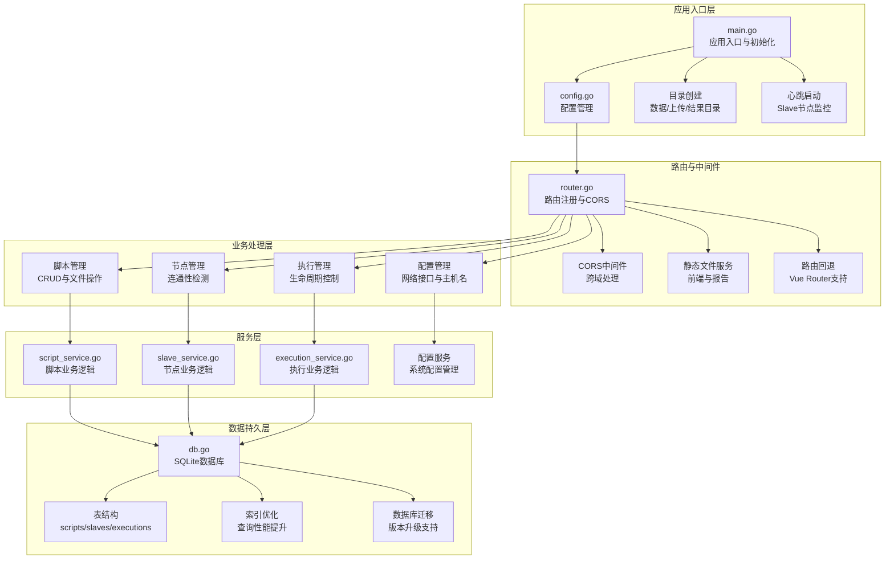
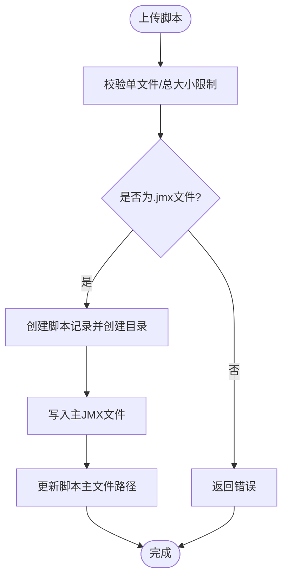
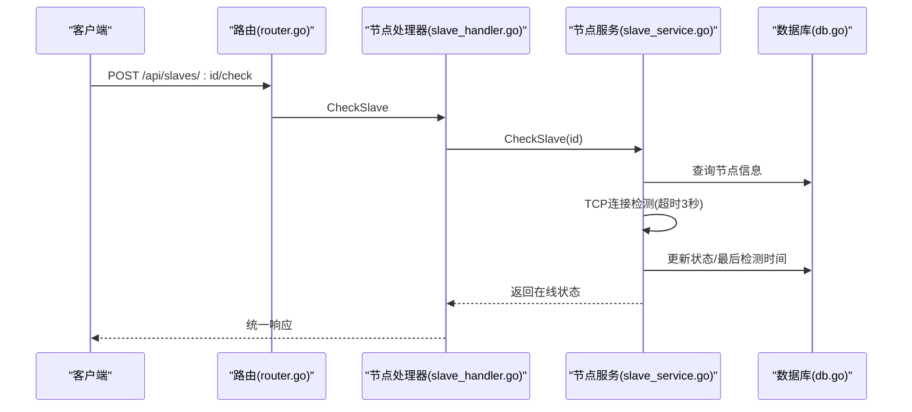
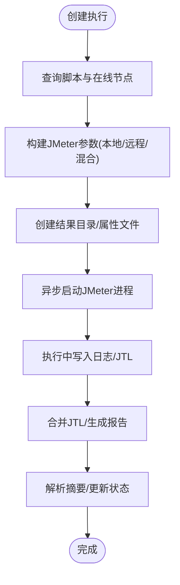
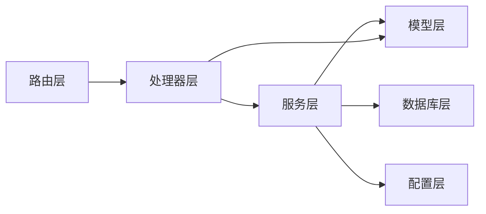

# 核心业务模块

<cite>
**本文引用的文件**
- [main.go](file://main.go)
- [router.go](file://internal/router/router.go)
- [config.go](file://config/config.go)
- [db.go](file://internal/database/db.go)
- [script.go](file://internal/model/script.go)
- [slave.go](file://internal/model/slave.go)
- [execution.go](file://internal/model/execution.go)
- [response.go](file://internal/model/response.go)
- [script_handler.go](file://internal/handler/script.go)
- [slave_handler.go](file://internal/handler/slave.go)
- [execution_handler.go](file://internal/handler/execution.go)
- [script_service.go](file://internal/service/script.go)
- [slave_service.go](file://internal/service/slave.go)
- [execution_service.go](file://internal/service/execution.go)
</cite>

## 更新摘要
**所做更改**
- 新增核心业务模块总览章节，提供整体架构视图
- 完善脚本管理系统详细分析，包含JMX内容编辑、文件管理、CRUD操作
- 扩展Slave节点管理系统分析，涵盖心跳检测机制与状态管理
- 深入执行管理系统说明，包括实时监控、数据管理与流程控制
- 更新依赖分析与性能考虑章节，反映最新架构设计
- 增强故障排查指南，提供更详细的诊断步骤

## 目录
1. [简介](#简介)
2. [核心业务模块总览](#核心业务模块总览)
3. [脚本管理系统](#脚本管理系统)
4. [Slave节点管理系统](#slave节点管理系统)
5. [执行管理系统](#执行管理系统)
6. [依赖分析](#依赖分析)
7. [性能考虑](#性能考虑)
8. [故障排查指南](#故障排查指南)
9. [结论](#结论)
10. [附录](#附录)

## 简介
本文件面向JMeter Admin的核心业务模块，围绕"脚本管理系统"、"Slave节点管理"和"执行管理系统"三大模块进行系统化梳理。文档从架构设计、数据流程、关键算法、模块协作与依赖、业务规则与数据校验、扩展与定制化建议、性能优化策略、异常处理与错误恢复、以及测试与质量保障等方面进行全面阐述，帮助开发者与运维人员快速理解与高效维护系统。

## 核心业务模块总览
JMeter Admin采用典型的分层架构设计，通过清晰的模块划分实现业务功能的解耦与扩展。系统通过Gin框架提供REST API，统一响应模型封装错误与分页数据；服务层通过SQLite进行数据持久化，并在启动时完成表结构初始化与迁移；执行流程以异步goroutine方式运行JMeter命令，结合实时CSV解析与报告生成，形成完整的测试生命周期闭环。

**图表来源**
- [main.go:28-66](file://main.go#L28-L66)
- [router.go:14-129](file://internal/router/router.go#L14-L129)
- [config.go:43-84](file://config/config.go#L43-L84)
- [db.go:15-34](file://internal/database/db.go#L15-L34)

**章节来源**
- [main.go:28-66](file://main.go#L28-L66)
- [router.go:14-129](file://internal/router/router.go#L14-L129)
- [config.go:43-84](file://config/config.go#L43-L84)
- [db.go:15-34](file://internal/database/db.go#L15-L34)

## 脚本管理系统
脚本管理系统负责JMeter测试脚本的全生命周期管理，包括脚本的创建、编辑、文件管理、查询与分页等功能。系统支持主JMX文件与附件文件的上传/下载/删除，提供JMX内容的读取与保存功能，并包含XML合法性校验机制。

### 业务逻辑
- **脚本创建**：校验上传文件大小与类型，生成脚本记录并创建脚本专属目录
- **文件管理**：支持附件批量上传（限制总大小与单文件大小），按ID或文件名删除，区分主JMX与附件类型
- **内容编辑**：读取/保存JMX内容，保存前进行XML合法性校验
- **查询与分页**：支持按名称关键字模糊查询、分页与总数统计

### 关键算法与数据结构
- **文件类型识别**：根据扩展名映射至jmx/csv/json/txt/properties/xml/yaml/jar/other
- **XML合法性校验**：使用解码器逐步扫描，遇EOF视为合法，其他错误即报错
- **分页SQL**：动态拼接where子句，分别查询总数与列表，避免重复扫描

### 数据验证与安全
- **上传限制**：单文件≤100MB，总和≤500MB；仅允许.jmx作为主文件
- **路径清理**：对上传文件名进行清理，防止路径穿越与空名

**图表来源**
- [script_handler.go:52-108](file://internal/handler/script.go#L52-L108)
- [script_service.go:85-116](file://internal/service/script.go#L85-L116)
- [script_service.go:299-359](file://internal/service/script.go#L299-L359)

**章节来源**
- [script_handler.go:37-327](file://internal/handler/script.go#L37-L327)
- [script_service.go:18-540](file://internal/service/script.go#L18-L540)
- [script.go:3-22](file://internal/model/script.go#L3-L22)
- [response.go:14-45](file://internal/model/response.go#L14-L45)

## Slave节点管理系统
Slave节点管理系统负责JMeter分布式测试环境中的节点管理，提供节点的增删改查、连通性检测、心跳定时任务、在线状态维护等功能。系统支持网络接口查询与Master主机名配置管理。

### 业务逻辑
- **节点增删改查**：提供标准CRUD接口
- **连通性检测**：TCP超时连接检测，更新状态与最后检测时间
- **心跳任务**：定时并发检测所有节点，限制并发数，避免资源争用
- **配置管理**：提供本机网卡IP列表查询、Master主机名配置读取与更新

### 关键算法与数据结构
- **并发控制**：信号量限制并发数为10，避免大量节点同时检测导致阻塞
- **TCP探测**：设置3秒超时，成功则online，失败则offline

### 数据验证与安全
- **参数绑定与错误返回**：检测失败不影响整体流程，仅更新状态

**图表来源**
- [router.go:38-47](file://internal/router/router.go#L38-L47)
- [slave_handler.go:97-122](file://internal/handler/slave.go#L97-L122)
- [slave_service.go:112-157](file://internal/service/slave.go#L112-L157)

**章节来源**
- [slave_handler.go:16-236](file://internal/handler/slave.go#L16-L236)
- [slave_service.go:15-220](file://internal/service/slave.go#L15-L220)
- [slave.go:3-11](file://internal/model/slave.go#L3-L11)

## 执行管理系统
执行管理系统负责JMeter测试执行的完整生命周期管理，包括执行的创建与启动、异步执行与进程管理、实时指标聚合、结果合并与报告生成、日志流式输出等功能。

### 业务逻辑
- **执行创建**：选择脚本与节点，支持本地、分布式与混合模式；生成运行时JMX（可选）；动态计算JVM参数；异步执行并写入日志
- **实时指标**：解析JTL CSV，按秒级窗口聚合TPS、RT、成功率、并发度等指标
- **结果与报告**：合并本地与远程JTL，生成HTML报告；支持JTL/报告/错误导出与全量打包下载
- **日志流式**：SSE流式输出日志，支持快照与持续监听
- **停止执行**：通过进程管理器终止JMeter进程并更新状态
- **统计与查询**：提供执行统计与分页查询，支持多维筛选

### 关键算法与数据结构
- **JVM内存参数**：基于系统可用内存动态计算，取80%，上下限约束
- **JTL解析**：CSV懒加载、列索引缓存、按秒桶聚合、事务样本识别
- **命令构建**：本地/远程/混合模式参数组合，属性文件与CLI属性双保险
- **进程管理**：全局map存储执行命令，停止时逐一kill

### 数据验证与安全
- **节点离线检测**：仅使用在线节点，离线节点记录但不阻塞执行
- **错误明细**：分布式模式下要求配置Master回调地址，否则拒绝执行
- **文件访问**：严格检查路径存在性与类型，避免目录穿越

**图表来源**
- [execution_handler.go:38-53](file://internal/handler/execution.go#L38-L53)
- [execution_service.go:103-481](file://internal/service/execution.go#L103-L481)
- [execution_service.go:800-947](file://internal/service/execution.go#L800-L947)

**章节来源**
- [execution_handler.go:38-729](file://internal/handler/execution.go#L38-L729)
- [execution_service.go:103-1200](file://internal/service/execution.go#L103-L1200)
- [execution.go:3-18](file://internal/model/execution.go#L3-L18)
- [response.go:14-45](file://internal/model/response.go#L14-L45)

## 依赖分析
系统采用清晰的分层架构设计，各层职责明确，依赖关系稳定：

### 组件耦合
- **处理器层**：仅依赖服务层接口，低耦合便于替换与测试
- **服务层**：依赖数据库层与配置层，承担业务规则与数据一致性
- **模型层**：为纯数据结构，被处理器与服务层广泛使用

### 外部依赖
- **Gin**：Web框架与路由
- **SQLite**：轻量级本地数据库
- **JMeter**：执行引擎与报告生成

### 循环依赖
未发现循环导入；各层职责清晰

### 接口契约
统一响应模型：Success/Error/PageSuccess封装标准返回格式

**图表来源**
- [router.go:14-112](file://internal/router/router.go#L14-L112)
- [response.go:14-45](file://internal/model/response.go#L14-L45)

**章节来源**
- [router.go:14-112](file://internal/router/router.go#L14-L112)
- [response.go:14-45](file://internal/model/response.go#L14-L45)

## 性能考虑
系统针对不同层面进行了性能优化设计：

### 内存与JVM
- **动态计算JVM堆大小**：避免固定值导致资源浪费或溢出

### 并发与I/O
- **节点心跳并发限制**：限制并发数为10，避免大量节点同时检测导致阻塞
- **JTL解析按秒桶聚合**：避免大文件内存压力

### 存储与索引
- **数据库索引优化**：对执行表的关键列建立索引，提升查询性能

### 网络与分布式
- **分布式模式配置**：合理配置Master主机名，确保RMI回调可达

### 建议
- 对大规模并发场景，可引入队列与限流
- 对JTL解析可考虑分片与增量聚合

## 故障排查指南
提供常见问题的诊断与解决步骤：

### 常见问题
- **执行记录状态异常**：服务重启后陈旧记录会被清理为failed，检查日志与数据库状态
- **节点离线**：心跳检测失败或TCP超时，检查网络连通性与端口开放情况
- **执行失败**：查看执行日志，确认JMeter命令参数、JVM参数与结果路径
- **错误明细未回传**：检查Master主机名配置与令牌生成

### 排查步骤
1. 通过执行详情与日志接口定位问题
2. 使用统计接口核对执行总量与状态分布
3. 对脚本内容保存失败，检查XML合法性与文件权限

### 修复建议
- **节点问题**：修复网络或端口；服务层会自动更新状态
- **执行问题**：调整JVM参数、检查JMeter安装路径与属性文件

**章节来源**
- [execution_service.go:1044-1060](file://internal/service/execution.go#L1044-L1060)
- [slave_service.go:172-219](file://internal/service/slave.go#L172-L219)
- [execution_handler.go:555-708](file://internal/handler/execution.go#L555-L708)

## 结论
JMeter Admin通过清晰的分层架构与完善的业务模块，实现了从脚本管理、节点监控到执行调度与结果分析的全链路能力。模块间职责明确、依赖稳定，具备良好的扩展性与可维护性。建议在生产环境中结合监控与告警体系，持续优化JVM参数与并发策略，确保系统在高负载下的稳定性与性能表现。

## 附录

### 配置项说明
- **server.port**：HTTP服务监听端口
- **jmeter.path**：JMeter可执行文件路径
- **jmeter.master_hostname**：RMI回调IP，多网卡时必填
- **slave.heartbeat_interval**：心跳检测间隔（秒）
- **dirs.data/uploads/results**：数据、上传与结果目录

### 数据库迁移
系统支持数据库自动迁移，包括：
- executions表：添加duration、remarks列
- script_files表：添加updated_at列  
- slaves表：添加last_check_time列
- 创建索引：提升查询性能

**章节来源**
- [config.go:10-41](file://config/config.go#L10-L41)
- [db.go:126-171](file://internal/database/db.go#L126-L171)